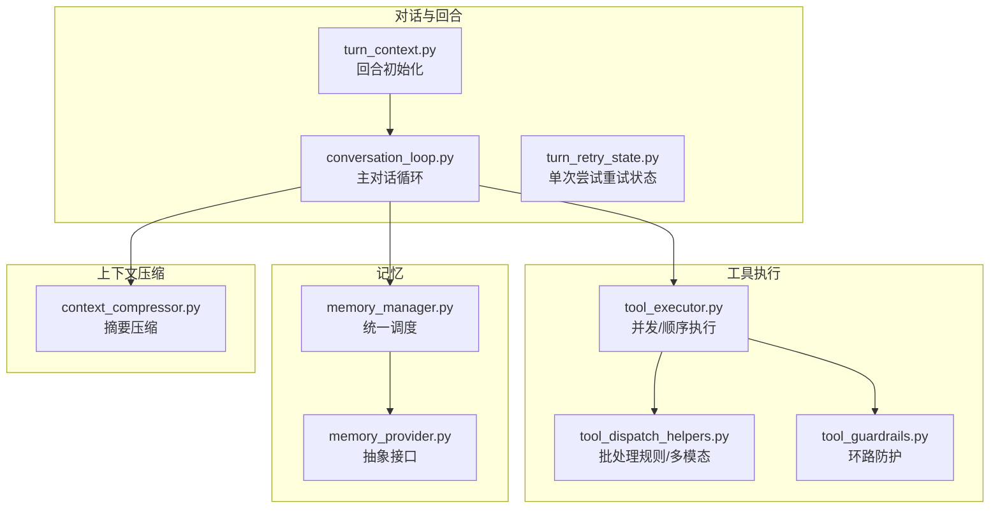
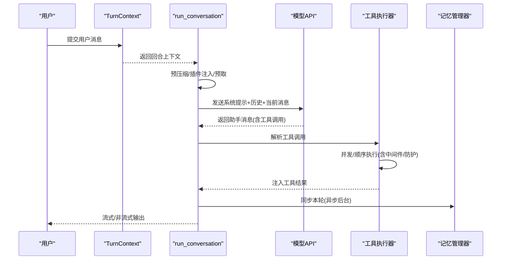
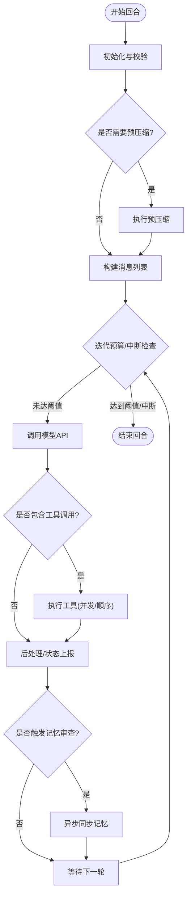
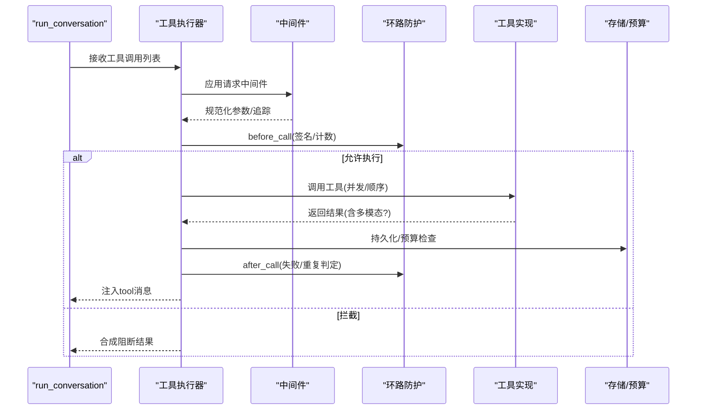
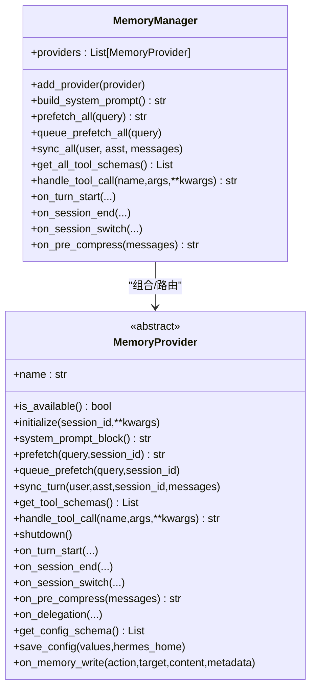
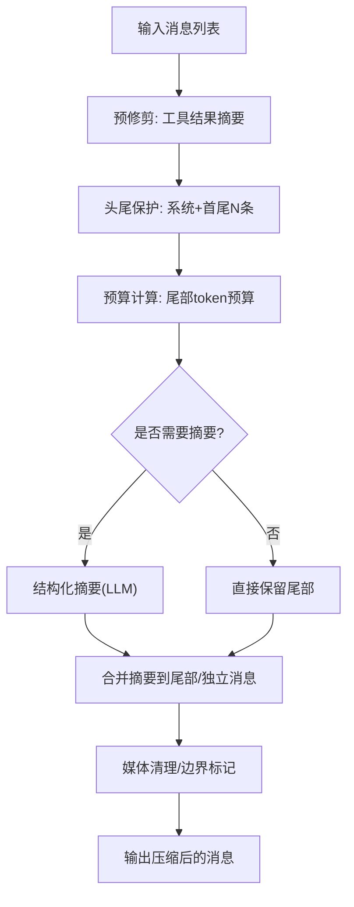
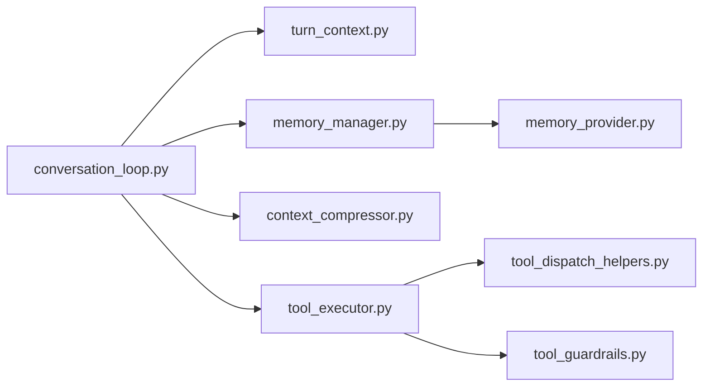

# AI代理系统

<cite>
**本文引用的文件**
- [agent/__init__.py](file://agent/__init__.py)
- [agent/conversation_loop.py](file://agent/conversation_loop.py)
- [agent/turn_context.py](file://agent/turn_context.py)
- [agent/tool_executor.py](file://agent/tool_executor.py)
- [agent/context_compressor.py](file://agent/context_compressor.py)
- [agent/memory_manager.py](file://agent/memory_manager.py)
- [agent/memory_provider.py](file://agent/memory_provider.py)
- [agent/tool_guardrails.py](file://agent/tool_guardrails.py)
- [agent/tool_dispatch_helpers.py](file://agent/tool_dispatch_helpers.py)
- [agent/turn_retry_state.py](file://agent/turn_retry_state.py)
</cite>

## 目录
1. [引言](#引言)
2. [项目结构](#项目结构)
3. [核心组件](#核心组件)
4. [架构总览](#架构总览)
5. [详细组件分析](#详细组件分析)
6. [依赖分析](#依赖分析)
7. [性能考虑](#性能考虑)
8. [故障排查指南](#故障排查指南)
9. [结论](#结论)
10. [附录](#附录)

## 引言
本技术文档面向AI代理系统的实现与扩展，聚焦于核心代理类的架构设计与实现细节，涵盖对话管理、上下文压缩、工具调用循环、记忆管理、错误处理与生命周期管理等主题。文档通过代码级分析与可视化图示，帮助读者理解代理如何在多轮对话中安全高效地执行工具、维护上下文、并进行长期记忆与技能协同。

## 项目结构
本项目采用模块化组织，将原run_agent.py中的庞大逻辑拆分为多个职责清晰的子模块：
- 对话与回合控制：conversation_loop.py、turn_context.py、turn_retry_state.py
- 工具执行与并发：tool_executor.py、tool_dispatch_helpers.py、tool_guardrails.py
- 记忆与外部提供方：memory_manager.py、memory_provider.py
- 上下文压缩与令牌预算：context_compressor.py

图表来源
- [agent/turn_context.py:64-391](file://agent/turn_context.py#L64-L391)
- [agent/conversation_loop.py:469-800](file://agent/conversation_loop.py#L469-L800)
- [agent/tool_executor.py:243-768](file://agent/tool_executor.py#L243-L768)
- [agent/tool_dispatch_helpers.py:103-147](file://agent/tool_dispatch_helpers.py#L103-L147)
- [agent/tool_guardrails.py:224-381](file://agent/tool_guardrails.py#L224-L381)
- [agent/memory_manager.py:313-795](file://agent/memory_manager.py#L313-L795)
- [agent/memory_provider.py:42-297](file://agent/memory_provider.py#L42-L297)
- [agent/context_compressor.py:593-770](file://agent/context_compressor.py#L593-L770)

章节来源
- [agent/__init__.py:1-9](file://agent/__init__.py#L1-L9)

## 核心组件
- 会话回合构建器（TurnContext）：封装每轮对话的初始化步骤，产出循环所需输入，避免orchestrator臃肿。
- 主对话循环（run_conversation）：驱动用户消息到模型请求、工具调用、结果注入、压缩与后处理的完整流程。
- 工具执行器（Tool Executor）：支持并发/顺序两种模式，内置中间件、预检、回滚与结果规范化。
- 记忆管理器（MemoryManager）：统一注册与调度外部记忆提供方，负责预取、同步与工具路由。
- 上下文压缩器（ContextCompressor）：基于摘要的窗口压缩，保护头尾、迭代更新、失败降级。
- 环路防护（Tool Guardrails）：对重复失败、无进展等危险模式给出警告或硬停。

章节来源
- [agent/turn_context.py:37-391](file://agent/turn_context.py#L37-L391)
- [agent/conversation_loop.py:469-800](file://agent/conversation_loop.py#L469-L800)
- [agent/tool_executor.py:243-768](file://agent/tool_executor.py#L243-L768)
- [agent/memory_manager.py:313-795](file://agent/memory_manager.py#L313-L795)
- [agent/context_compressor.py:593-770](file://agent/context_compressor.py#L593-L770)
- [agent/tool_guardrails.py:224-381](file://agent/tool_guardrails.py#L224-L381)

## 架构总览
下图展示了从“回合初始化”到“工具执行与记忆同步”的端到端交互：

图表来源
- [agent/turn_context.py:64-391](file://agent/turn_context.py#L64-L391)
- [agent/conversation_loop.py:469-800](file://agent/conversation_loop.py#L469-L800)
- [agent/tool_executor.py:243-768](file://agent/tool_executor.py#L243-L768)
- [agent/memory_manager.py:515-572](file://agent/memory_manager.py#L515-L572)

## 详细组件分析

### 对话管理与回合生命周期
- 回合初始化：安装安全stdio、设置会话上下文、恢复/构建系统提示、预压缩、插件钩子、外部记忆预取。
- 单轮循环：迭代预算控制、中断检测、工具调用、结果注入、后处理钩子、内存审查触发。
- 生命周期要点：重试状态机（一次尝试内不重复触发同一分支）、令牌估算与压缩决策、流回调与状态上报。

图表来源
- [agent/turn_context.py:64-391](file://agent/turn_context.py#L64-L391)
- [agent/conversation_loop.py:563-620](file://agent/conversation_loop.py#L563-L620)
- [agent/conversation_loop.py:769-800](file://agent/conversation_loop.py#L769-L800)

章节来源
- [agent/turn_context.py:64-391](file://agent/turn_context.py#L64-L391)
- [agent/conversation_loop.py:469-800](file://agent/conversation_loop.py#L469-L800)
- [agent/turn_retry_state.py:32-69](file://agent/turn_retry_state.py#L32-L69)

### 工具调用循环与执行策略
- 参数解析与预检：JSON解析、中间件注入、作用域检查、防护拦截、快照检查点。
- 并发策略：批内路径隔离、互斥工具、MCP并行开关；失败时取消未启动任务并优雅收尾。
- 结果处理：多模态内容归一、文本摘要、目录提示注入、预算限制、后处理钩子。
- 错误恢复：键盘中断、线程缺失、工具失败分类、告警与硬停决策。

图表来源
- [agent/tool_executor.py:243-768](file://agent/tool_executor.py#L243-L768)
- [agent/tool_dispatch_helpers.py:103-147](file://agent/tool_dispatch_helpers.py#L103-L147)
- [agent/tool_guardrails.py:224-381](file://agent/tool_guardrails.py#L224-L381)

章节来源
- [agent/tool_executor.py:243-768](file://agent/tool_executor.py#L243-L768)
- [agent/tool_dispatch_helpers.py:103-147](file://agent/tool_dispatch_helpers.py#L103-L147)
- [agent/tool_guardrails.py:224-381](file://agent/tool_guardrails.py#L224-L381)

### 记忆管理系统与外部提供方
- 统一调度：内置提供方优先，最多一个外部提供方；工具schema去重与冲突告警。
- 生命周期：回合开始通知、会话切换、压缩前提取、异步写入与后台执行器。
- 安全与可见性：上下文围栏清洗、流式过滤器、系统注释剥离、写入镜像回调。

图表来源
- [agent/memory_manager.py:313-795](file://agent/memory_manager.py#L313-L795)
- [agent/memory_provider.py:42-297](file://agent/memory_provider.py#L42-L297)

章节来源
- [agent/memory_manager.py:313-795](file://agent/memory_manager.py#L313-L795)
- [agent/memory_provider.py:42-297](file://agent/memory_provider.py#L42-L297)

### 上下文压缩算法与策略
- 目标：在保持信息完整性前提下降低token占用，保护头尾与尾部预算，迭代更新摘要。
- 步骤：昂贵工具结果预修剪、头尾保护、LLM结构化摘要、失败降级、媒体清理、边界标记。
- 配置：阈值比例、摘要目标比、尾部预算上限、最小摘要token、失败冷却时间。

图表来源
- [agent/context_compressor.py:593-770](file://agent/context_compressor.py#L593-L770)
- [agent/context_compressor.py:189-290](file://agent/context_compressor.py#L189-L290)

章节来源
- [agent/context_compressor.py:593-770](file://agent/context_compressor.py#L593-L770)
- [agent/context_compressor.py:189-290](file://agent/context_compressor.py#L189-L290)

### 环路防护与错误处理策略
- 防护维度：精确失败次数、同工具重复失败、只读无进展、硬停阈值。
- 行为：警告、阻断、硬停；合成结果附加元数据；失败分类与恢复提示。
- 与执行器协作：before_call/after_call贯穿工具生命周期，确保一致性。

章节来源
- [agent/tool_guardrails.py:224-381](file://agent/tool_guardrails.py#L224-L381)
- [agent/tool_guardrails.py:383-404](file://agent/tool_guardrails.py#L383-L404)
- [agent/tool_executor.py:375-391](file://agent/tool_executor.py#L375-L391)

## 依赖分析
- 模块耦合：conversation_loop依赖turn_context、memory_manager、context_compressor、tool_executor等；tool_executor依赖dispatch_helpers与guardrails；memory_manager依赖memory_provider。
- 外部依赖：通过中间件与插件钩子接入，避免直接耦合具体提供方。
- 循环依赖规避：turn_context返回不可变数据对象，避免回指；工具执行器通过延迟引用run_agent符号以支持测试打桩。

图表来源
- [agent/conversation_loop.py:469-524](file://agent/conversation_loop.py#L469-L524)
- [agent/tool_executor.py:243-261](file://agent/tool_executor.py#L243-L261)
- [agent/memory_manager.py:334-398](file://agent/memory_manager.py#L334-L398)

章节来源
- [agent/conversation_loop.py:469-524](file://agent/conversation_loop.py#L469-L524)
- [agent/tool_executor.py:243-261](file://agent/tool_executor.py#L243-L261)
- [agent/memory_manager.py:334-398](file://agent/memory_manager.py#L334-L398)

## 性能考虑
- 令牌预算与预估：使用粗略估算避免provider拒绝；在真实usage后可切换到更准的估算。
- 压缩策略：按压缩内容比例分配摘要预算，尾部token预算保护最新上下文。
- 并发执行：批内路径隔离与互斥工具避免竞态；失败时及时取消未启动任务。
- I/O与网络：记忆同步与预取走后台线程池，避免阻塞主对话循环。
- 日志与可观测性：状态回调与进度钩子便于前端与网关感知。

## 故障排查指南
- 常见问题定位
  - 令牌超限：检查预估与阈值、开启预压缩、调整摘要目标比。
  - 工具环路：查看环路防护告警/硬停，变更参数或策略。
  - 中断与卡死：确认工具是否支持中断、线程清理与活动心跳。
  - 记忆写入失败：检查提供方可用性、线程池状态与会话切换。
- 关键日志与状态
  - 压缩警告重放、预飞行压缩状态、工具批处理统计、记忆同步完成/超时。
- 快速恢复
  - 使用/压缩手动触发压缩；检查中间件trace与工具请求参数；必要时切换摘要模型。

章节来源
- [agent/conversation_loop.py:250-317](file://agent/conversation_loop.py#L250-L317)
- [agent/tool_executor.py:577-624](file://agent/tool_executor.py#L577-L624)
- [agent/memory_manager.py:620-642](file://agent/memory_manager.py#L620-L642)

## 结论
该AI代理系统通过模块化设计实现了高内聚、低耦合的对话与工具执行框架。回合初始化、工具并发执行、记忆统一调度与上下文压缩四大支柱协同工作，在保证安全性与可控性的前提下，最大化提升长对话场景下的效率与稳定性。建议在生产环境中结合配置与中间件策略，持续监控令牌使用与工具执行指标，并根据业务需求扩展记忆提供方与工具集。

## 附录
- 扩展开发建议
  - 新增工具：遵循函数调用schema，使用中间件与防护策略；如涉及文件/终端需纳入并行规则与快照检查。
  - 新增记忆提供方：实现MemoryProvider接口，注意工具名冲突与异步写入；在MemoryManager中注册。
  - 自定义压缩模型：通过摘要模型覆盖与失败降级策略平衡成本与效果。
  - 插件与中间件：利用pre_llm_call与工具请求中间件扩展上下文与参数校验。