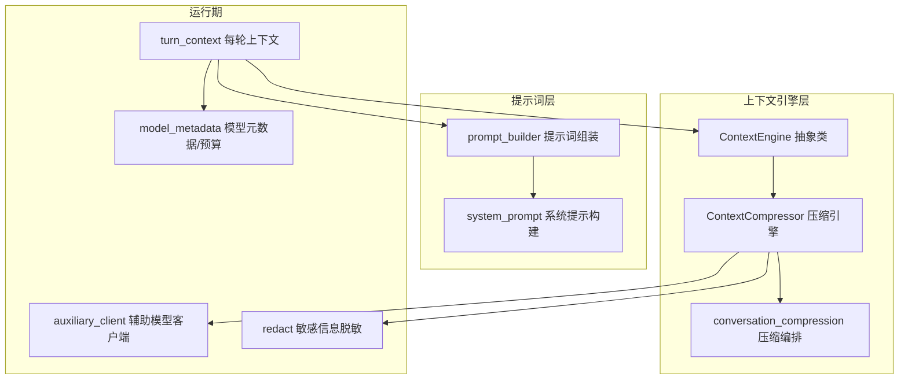
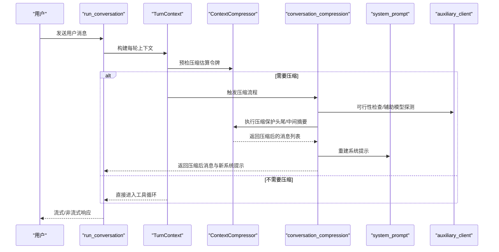
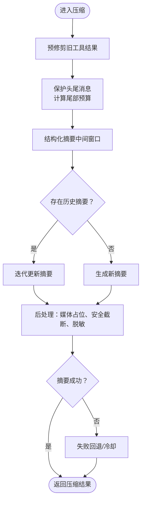
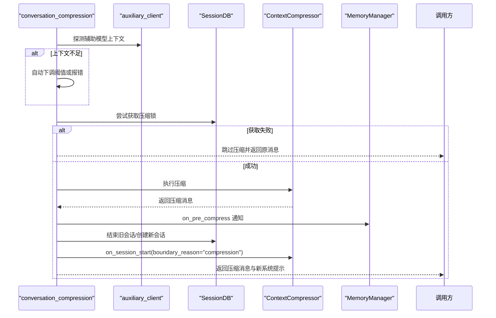
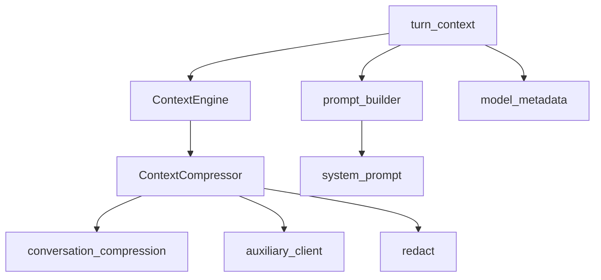

# 上下文处理

<cite>
**本文引用的文件**
- [agent/context_compressor.py](file://agent/context_compressor.py)
- [agent/context_engine.py](file://agent/context_engine.py)
- [agent/conversation_compression.py](file://agent/conversation_compression.py)
- [agent/prompt_builder.py](file://agent/prompt_builder.py)
- [agent/model_metadata.py](file://agent/model_metadata.py)
- [agent/turn_context.py](file://agent/turn_context.py)
- [agent/coding_context.py](file://agent/coding_context.py)
- [agent/auxiliary_client.py](file://agent/auxiliary_client.py)
- [agent/redact.py](file://agent/redact.py)
- [agent/system_prompt.py](file://agent/system_prompt.py)
- [agent/tool_result_classification.py](file://agent/tool_result_classification.py)
- [agent/think_scrubber.py](file://agent/think_scrubber.py)
- [agent/message_sanitization.py](file://agent/message_sanitization.py)
- [agent/iteration_budget.py](file://agent/iteration_budget.py)
- [agent/memory_manager.py](file://agent/memory_manager.py)
- [agent/usage_pricing.py](file://agent/usage_pricing.py)
- [agent/credits_tracker.py](file://agent/credits_tracker.py)
- [agent/trajectory.py](file://agent/trajectory.py)
- [agent/trajectory_compressor.py](file://agent/trajectory_compressor.py)
- [agent/manual_compression_feedback.py](file://agent/manual_compression_feedback.py)
- [agent/error_classifier.py](file://agent/error_classifier.py)
- [agent/retry_utils.py](file://agent/retry_utils.py)
- [agent/stream_diag.py](file://agent/stream_diag.py)
- [agent/subdirectory_hints.py](file://agent/subdirectory_hints.py)
- [agent/ssl_guard.py](file://agent/ssl_guard.py)
- [agent/runtime_cwd.py](file://agent/runtime_cwd.py)
- [agent/async_utils.py](file://agent/async_utils.py)
- [agent/jiter_preload.py](file://agent/jiter_preload.py)
- [agent/lmstudio_reasoning.py](file://agent/lmstudio_reasoning.py)
- [agent/moonshot_schema.py](file://agent/moonshot_schema.py)
- [agent/nous_rate_guard.py](file://agent/nous_rate_guard.py)
- [agent/rate_limit_tracker.py](file://agent/rate_limit_tracker.py)
- [agent/credits_tracker.py](file://agent/credits_tracker.py)
- [agent/usage_pricing.py](file://agent/usage_pricing.py)
- [agent/iteration_budget.py](file://agent/iteration_budget.py)
- [agent/trajectory.py](file://agent/trajectory.py)
- [agent/trajectory_compressor.py](file://agent/trajectory_compressor.py)
- [agent/manual_compression_feedback.py](file://agent/manual_compression_feedback.py)
- [agent/error_classifier.py](file://agent/error_classifier.py)
- [agent/retry_utils.py](file://agent/retry_utils.py)
- [agent/stream_diag.py](file://agent/stream_diag.py)
- [agent/subdirectory_hints.py](file://agent/subdirectory_hints.py)
- [agent/ssl_guard.py](file://agent/ssl_guard.py)
- [agent/runtime_cwd.py](file://agent/runtime_cwd.py)
- [agent/async_utils.py](file://agent/async_utils.py)
- [agent/jiter_preload.py](file://agent/jiter_preload.py)
- [agent/lmstudio_reasoning.py](file://agent/lmstudio_reasoning.py)
- [agent/moonshot_schema.py](file://agent/moonshot_schema.py)
- [agent/nous_rate_guard.py](file://agent/nous_rate_guard.py)
- [agent/rate_limit_tracker.py](file://agent/rate_limit_tracker.py)
</cite>

## 目录
1. [引言](#引言)
2. [项目结构](#项目结构)
3. [核心组件](#核心组件)
4. [架构总览](#架构总览)
5. [详细组件分析](#详细组件分析)
6. [依赖分析](#依赖分析)
7. [性能考量](#性能考量)
8. [故障排查指南](#故障排查指南)
9. [结论](#结论)
10. [附录](#附录)

## 引言
本技术文档围绕“上下文处理系统”展开，聚焦于长对话的上下文压缩与提示词构建两大核心能力。系统通过可插拔的上下文引擎（默认为压缩引擎）在接近模型上下文上限时进行自动压缩，以维持推理稳定性；同时，系统提示词由多段模块化内容拼装而成，覆盖身份、平台、技能索引、环境提示等，确保跨平台一致性与可扩展性。文档还涵盖编码上下文识别、多模态内容处理、上下文窗口动态调整、质量评估与优化策略，以及多模态（文本、图像、音频）融合方法，并提供最佳实践与排障建议。

## 项目结构
上下文处理系统主要分布在 agent 子目录中，核心文件包括：
- 上下文引擎与压缩：context_engine.py、context_compressor.py、conversation_compression.py
- 提示词构建：prompt_builder.py、system_prompt.py
- 模型元数据与预算：model_metadata.py
- 会话与每轮上下文：turn_context.py
- 编码上下文：coding_context.py
- 辅助客户端与敏感信息处理：auxiliary_client.py、redact.py
- 工具结果分类与清洗：tool_result_classification.py、think_scrubber.py、message_sanitization.py
- 其他支撑：iteration_budget.py、memory_manager.py、usage_pricing.py、credits_tracker.py、trajectory*.py、manual_compression_feedback.py、error_classifier.py、retry_utils.py、stream_diag.py、subdirectory_hints.py、ssl_guard.py、runtime_cwd.py、async_utils.py、jiter_preload.py、lmstudio_reasoning.py、moonshot_schema.py、nous_rate_guard.py、rate_limit_tracker.py

图表来源
- [agent/context_engine.py](file://agent/context_engine.py)
- [agent/context_compressor.py](file://agent/context_compressor.py)
- [agent/conversation_compression.py](file://agent/conversation_compression.py)
- [agent/prompt_builder.py](file://agent/prompt_builder.py)
- [agent/system_prompt.py](file://agent/system_prompt.py)
- [agent/turn_context.py](file://agent/turn_context.py)
- [agent/model_metadata.py](file://agent/model_metadata.py)
- [agent/auxiliary_client.py](file://agent/auxiliary_client.py)
- [agent/redact.py](file://agent/redact.py)

章节来源
- [agent/context_engine.py](file://agent/context_engine.py)
- [agent/context_compressor.py](file://agent/context_compressor.py)
- [agent/conversation_compression.py](file://agent/conversation_compression.py)
- [agent/prompt_builder.py](file://agent/prompt_builder.py)
- [agent/system_prompt.py](file://agent/system_prompt.py)
- [agent/turn_context.py](file://agent/turn_context.py)
- [agent/model_metadata.py](file://agent/model_metadata.py)
- [agent/auxiliary_client.py](file://agent/auxiliary_client.py)
- [agent/redact.py](file://agent/redact.py)

## 核心组件
- 上下文引擎抽象：定义统一接口（更新用量、是否压缩、压缩、预检、会话生命周期），支持插件式替换。
- 默认压缩引擎：基于结构化摘要模板与“先保护头尾、再中间压缩”的策略，迭代更新摘要，避免固定消息数保护导致的大工具输出无法压缩。
- 压缩编排：负责可行性检查、并发锁、会话分割、事件回调、标题继承、系统提示重建等。
- 提示词构建：系统提示由身份、平台提示、技能索引、环境提示、任务完成指引、工具使用约束等模块拼装，支持按模型族注入执行指导。
- 模型元数据与预算：提供上下文长度探测、默认回退、请求粗估、端点模型元数据缓存等，保障压缩前预算校验与阈值计算。
- 每轮上下文：在每轮开始时进行预检压缩、插件钩子注入、外部记忆预取、线程中断状态清理等。

章节来源
- [agent/context_engine.py](file://agent/context_engine.py)
- [agent/context_compressor.py](file://agent/context_compressor.py)
- [agent/conversation_compression.py](file://agent/conversation_compression.py)
- [agent/prompt_builder.py](file://agent/prompt_builder.py)
- [agent/model_metadata.py](file://agent/model_metadata.py)
- [agent/turn_context.py](file://agent/turn_context.py)

## 架构总览
系统采用“引擎 + 编排 + 提示词 + 运行期”的分层设计：
- 引擎层：ContextEngine 抽象 + ContextCompressor 实现，负责压缩决策与执行。
- 编排层：conversation_compression 负责压缩可行性检查、并发控制、会话分割、事件通知、系统提示重建。
- 提示词层：prompt_builder 组装系统提示，system_prompt 提供稳定块与工作区快照。
- 运行期：turn_context 在每轮开始时进行预检压缩、插件钩子注入、外部记忆预取、线程安全与中断管理。

图表来源
- [agent/turn_context.py](file://agent/turn_context.py)
- [agent/context_compressor.py](file://agent/context_compressor.py)
- [agent/conversation_compression.py](file://agent/conversation_compression.py)
- [agent/system_prompt.py](file://agent/system_prompt.py)
- [agent/auxiliary_client.py](file://agent/auxiliary_client.py)

## 详细组件分析

### 上下文压缩引擎（ContextCompressor）
- 决策与预算
  - 基于模型上下文长度与阈值百分比计算阈值令牌数；保护头部（系统提示 + 前若干条）与尾部（最近若干条）令牌预算，中间部分用于摘要。
  - 支持动态阈值与摘要目标比例，随模型切换重新计算。
- 压缩算法
  - 第一阶段：对旧工具结果进行廉价预修剪（保留有用摘要而非通用占位），减少后续摘要负担。
  - 第二阶段：保护头尾，中间窗口按预算进行结构化摘要；支持历史摘要的迭代更新，保留多次压缩中的信息。
  - 第三阶段：失败回退与冷却，避免反复失败导致会话停滞。
- 多模态与媒体处理
  - 图像内容识别与替换：在老消息中仅保留占位符，避免重复传输大体积图片。
  - 文本内容长度估算：针对多模态内容（文本 + 图片）采用字符等价估算，保证预算分配合理。
- 安全与合规
  - 去重与占位：对过长工具参数 JSON 进行安全截断，避免破坏结构。
  - 敏感信息脱敏：对摘要内容进行敏感信息脱敏处理。
- 会话边界与状态
  - 记录上次摘要错误、丢弃数量、辅助模型失败等状态，便于上层感知与告警。
  - 会话结束时清理摘要状态，防止跨会话泄漏。

图表来源
- [agent/context_compressor.py](file://agent/context_compressor.py)

章节来源
- [agent/context_compressor.py](file://agent/context_compressor.py)

### 压缩编排（conversation_compression）
- 可行性检查
  - 探测辅助压缩模型上下文窗口，若小于主模型阈值则自动下调或报错；支持提供者标签与基地址解析。
- 并发控制
  - 基于会话数据库的原子锁，避免多个实例同时压缩同一会话导致孤儿子会话。
- 会话分割与系统提示重建
  - 压缩后旋转 session_id，迁移标题与系统提示，触发内存与上下文引擎的会话切换事件。
- 错误与警告
  - 摘要失败时插入确定性占位标记；辅助模型失败但主模型恢复时发出警告；重复压缩给出降质提醒。

图表来源
- [agent/conversation_compression.py](file://agent/conversation_compression.py)
- [agent/auxiliary_client.py](file://agent/auxiliary_client.py)
- [agent/memory_manager.py](file://agent/memory_manager.py)

章节来源
- [agent/conversation_compression.py](file://agent/conversation_compression.py)

### 提示词构建（prompt_builder 与 system_prompt）
- 系统提示模块化
  - 身份与帮助指引、持久化记忆与检索指引、技能使用与维护指引、任务完成与工具使用约束、平台提示、环境提示（WSL、远程终端）、计算机使用指引等。
  - 按模型族注入执行指导（如 OpenAI/GPT、Google/DeepSeek、通用“完成任务”约束）。
- 上下文文件与威胁扫描
  - 对 AGENTS.md、.cursorrules、SOUL.md 等上下文文件进行威胁扫描，阻断潜在注入。
- 动态上下文文件限额
  - 基于模型上下文长度动态计算上下文文件最大字符数，兼顾历史下限与大上下文模型的扩展。

图表来源
- [agent/prompt_builder.py](file://agent/prompt_builder.py)
- [agent/system_prompt.py](file://agent/system_prompt.py)

章节来源
- [agent/prompt_builder.py](file://agent/prompt_builder.py)
- [agent/system_prompt.py](file://agent/system_prompt.py)

### 编码上下文（coding_context）
- 姿态识别与系统提示
  - 通过配置与交互表面判断是否处于“编码姿态”，在该姿态下注入编码操作简报与工作区快照，支持“focus”模式收缩工具集与技能索引。
- 工具格式引导
  - 针对不同模型家族（如 GPT/Codex 使用 V4A patch，Claude 系列使用 str_replace）给出编辑格式建议，提升编辑成功率。

章节来源
- [agent/coding_context.py](file://agent/coding_context.py)

### 模型元数据与预算（model_metadata）
- 上下文长度探测
  - 通过 OpenRouter、models.dev、提供商特定路径探测模型上下文长度，支持磁盘缓存与 TTL 控制。
- 默认回退
  - 当探测失败时，按模型族与命名规则回退到默认上下文长度，保证系统可用性。
- 请求粗估
  - 提供请求粗估函数，用于预检压缩与阈值比较。

章节来源
- [agent/model_metadata.py](file://agent/model_metadata.py)

### 每轮上下文（turn_context）
- 预检压缩
  - 在每轮开始时估算令牌数，若超过阈值且未被上次真实使用延迟，则触发预检压缩。
- 插件钩子与外部记忆
  - 注入 pre_llm_call 的上下文，进行外部记忆预取，提升工具调用效率。
- 线程安全与中断
  - 清理中断状态、设置当前执行线程 ID，确保工具级中断精准作用于当前线程。

章节来源
- [agent/turn_context.py](file://agent/turn_context.py)

### 多模态上下文处理
- 图像处理
  - 识别多模态内容中的图像类型（OpenAI chat.completions、Responses、Anthropic native），在老消息中替换为短文本占位，避免重复传输大图。
  - 提供图像尺寸与字节上限的恢复策略，当出现“过大”错误时尝试缩小尺寸。
- 文本与工具结果
  - 对工具调用参数 JSON 进行安全截断，避免破坏结构；对工具结果生成简洁摘要，减少令牌占用。
- 语音与视频
  - 通过工具层与注册表对接具体提供商，支持文本到视频、图像到视频等多模态生成场景（详见工具层与注册表）。

章节来源
- [agent/context_compressor.py](file://agent/context_compressor.py)
- [agent/conversation_compression.py](file://agent/conversation_compression.py)

## 依赖分析
- 引擎与编排
  - ContextEngine 为抽象基类，ContextCompressor 为其默认实现；conversation_compression 作为编排器协调压缩流程。
- 提示词与系统提示
  - prompt_builder 与 system_prompt 协作，前者负责模块化拼装，后者提供稳定块与工作区快照。
- 运行期支撑
  - model_metadata 提供上下文长度与预算；turn_context 在每轮开始时进行预检压缩与资源准备；auxiliary_client 与 redact 提供辅助模型探测与敏感信息处理。

图表来源
- [agent/context_engine.py](file://agent/context_engine.py)
- [agent/context_compressor.py](file://agent/context_compressor.py)
- [agent/conversation_compression.py](file://agent/conversation_compression.py)
- [agent/prompt_builder.py](file://agent/prompt_builder.py)
- [agent/system_prompt.py](file://agent/system_prompt.py)
- [agent/turn_context.py](file://agent/turn_context.py)
- [agent/model_metadata.py](file://agent/model_metadata.py)
- [agent/auxiliary_client.py](file://agent/auxiliary_client.py)
- [agent/redact.py](file://agent/redact.py)

章节来源
- [agent/context_engine.py](file://agent/context_engine.py)
- [agent/context_compressor.py](file://agent/context_compressor.py)
- [agent/conversation_compression.py](file://agent/conversation_compression.py)
- [agent/prompt_builder.py](file://agent/prompt_builder.py)
- [agent/system_prompt.py](file://agent/system_prompt.py)
- [agent/turn_context.py](file://agent/turn_context.py)
- [agent/model_metadata.py](file://agent/model_metadata.py)
- [agent/auxiliary_client.py](file://agent/auxiliary_client.py)
- [agent/redact.py](file://agent/redact.py)

## 性能考量
- 预检压缩与延迟策略
  - 通过 should_defer_preflight_to_real_usage 避免在已知真实使用后重复从噪声估算进行压缩，降低抖动。
- 令牌预算与动态调整
  - 基于模型上下文长度与阈值百分比动态计算阈值与摘要预算，随模型切换自动重算。
- 媒体与工具结果优化
  - 图像占位与工具摘要显著降低令牌占用；安全截断避免无效重试。
- 并发与会话分割
  - 压缩锁避免并发冲突；会话分割后重建系统提示，保持前缀缓存命中率。

## 故障排查指南
- 压缩失败
  - 若摘要失败，系统会插入确定性占位标记并记录错误；必要时可启用 abort_on_summary_failure 中止压缩并返回原始消息。
  - 辅助模型失败但主模型恢复时会发出警告，提示检查 auxiliary.compression.model 配置。
- 并发压缩冲突
  - 若其他路径正在压缩同一会话，系统会跳过本次压缩并返回原消息；可在日志中查看 holder 信息定位竞争者。
- 图像过大
  - 当出现图像过大错误时，可使用 try_shrink_image_parts_in_messages 进行尺寸缩小；若仍失败，需检查提供商限制。
- 预检压缩不生效
  - 若 should_defer_preflight_to_real_usage 返回真，系统会延迟预检压缩，等待真实使用信号；可通过日志确认原因。

章节来源
- [agent/conversation_compression.py](file://agent/conversation_compression.py)
- [agent/context_compressor.py](file://agent/context_compressor.py)

## 结论
上下文处理系统通过“引擎 + 编排 + 提示词 + 运行期”的分层设计，在保证推理稳定性的同时实现了高效的上下文压缩与提示词构建。其核心特性包括：结构化摘要与迭代更新、媒体与工具结果优化、动态阈值与预算、多模态内容处理、并发控制与会话分割、以及完善的错误与警告机制。结合编码姿态与平台/环境提示，系统能够在多平台、多模态场景下保持一致的用户体验与性能表现。

## 附录
- 最佳实践
  - 合理设置压缩阈值与摘要比例，平衡信息保留与成本控制。
  - 在大上下文模型上适当提高摘要比例，充分利用窗口空间。
  - 对频繁产生大工具输出的任务，优先使用工具摘要与图像占位策略。
  - 定期检查辅助压缩模型配置，确保其上下文窗口满足阈值要求。
  - 在多模态场景中，尽量使用占位符与简洁摘要，避免重复传输大体积媒体。
  - 遇到压缩失败时，优先检查辅助模型可用性与提供商限制，必要时启用中止策略。