# 代理生命周期管理

<cite>
**本文档引用的文件**
- [agent_init.py](file://agent/agent_init.py)
- [run_agent.py](file://run_agent.py)
- [agent_runtime_helpers.py](file://agent/agent_runtime_helpers.py)
- [trajectory.py](file://agent/trajectory.py)
- [status.py](file://gateway/status.py)
- [run.py](file://gateway/run.py)
- [main.py](file://hermes_cli/main.py)
- [api_server.py](file://gateway/platforms/api_server.py)
- [test_agent_cache.py](file://tests/gateway/test_agent_cache.py)
- [gracefulExit.ts](file://ui-tui/src/lib/gracefulExit.ts)
- [web_server.py](file://hermes_cli/web_server.py)
</cite>

## 目录
1. [引言](#引言)
2. [项目结构](#项目结构)
3. [核心组件](#核心组件)
4. [架构概览](#架构概览)
5. [详细组件分析](#详细组件分析)
6. [依赖分析](#依赖分析)
7. [性能考虑](#性能考虑)
8. [故障排除指南](#故障排除指南)
9. [结论](#结论)
10. [附录](#附录)

## 引言

本文档深入解析Hermes Agent代理的完整生命周期管理系统，涵盖从初始化到销毁的全过程。该系统实现了企业级的代理管理能力，包括：

- **初始化与配置验证**：全面的参数验证、资源配置和依赖注入
- **状态转换机制**：启动、运行、暂停、恢复和销毁的完整状态管理
- **运行时管理**：资源监控、性能跟踪和健康检查
- **轨迹记录**：操作日志、决策过程和结果追踪
- **热重载与配置更新**：运行时的平滑切换机制
- **优雅关闭**：资源释放和状态持久化的完整流程

系统采用模块化设计，通过清晰的职责分离和严格的生命周期控制，确保在复杂生产环境中的稳定性和可靠性。

## 项目结构

Hermes Agent的代理生命周期管理分布在多个关键模块中：

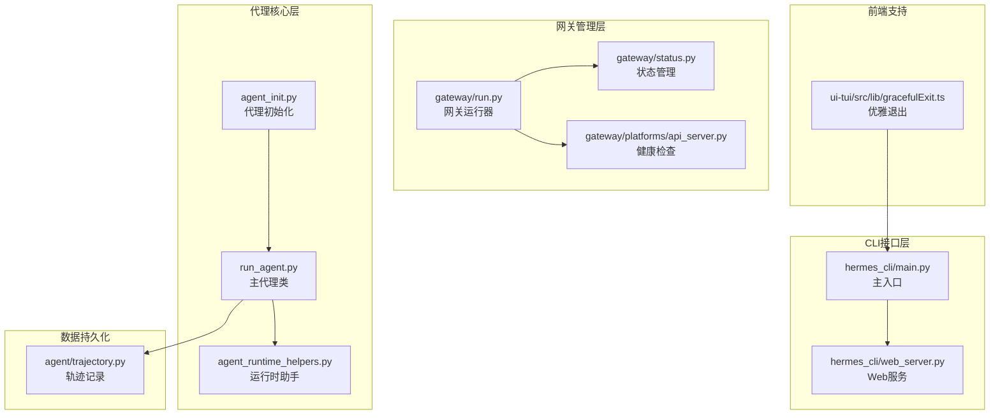

**图表来源**
- [agent_init.py:154-1716](file://agent/agent_init.py#L154-L1716)
- [run_agent.py:320-800](file://run_agent.py#L320-L800)
- [gateway/run.py:1-800](file://gateway/run.py#L1-L800)

**章节来源**
- [agent_init.py:1-1721](file://agent/agent_init.py#L1-L1721)
- [run_agent.py:1-5494](file://run_agent.py#L1-L5494)
- [gateway/run.py:1-17044](file://gateway/run.py#L1-L17044)

## 核心组件

### 代理初始化引擎

代理初始化是整个生命周期管理的核心，负责建立完整的运行环境：

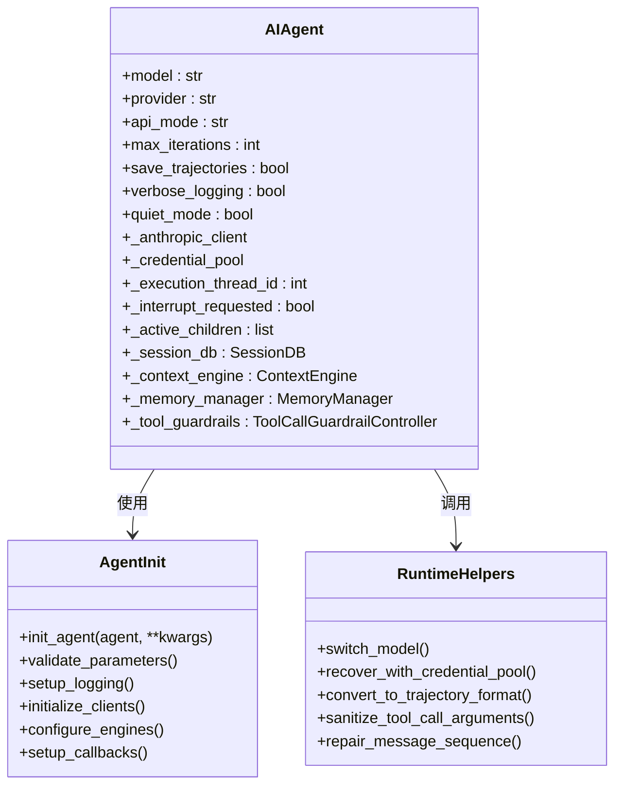

**图表来源**
- [agent_init.py:154-1716](file://agent/agent_init.py#L154-L1716)
- [run_agent.py:320-490](file://run_agent.py#L320-L490)
- [agent_runtime_helpers.py:1-2607](file://agent/agent_runtime_helpers.py#L1-L2607)

### 网关生命周期管理

网关作为代理的协调者，提供了完整的生命周期管理能力：

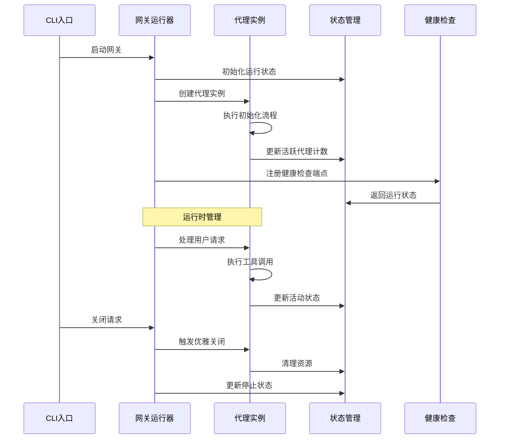

**图表来源**
- [gateway/run.py:1-800](file://gateway/run.py#L1-L800)
- [gateway/status.py:508-551](file://gateway/status.py#L508-L551)
- [api_server.py:1077-1101](file://gateway/platforms/api_server.py#L1077-L1101)

**章节来源**
- [agent_init.py:154-1716](file://agent/agent_init.py#L154-L1716)
- [run_agent.py:320-800](file://run_agent.py#L320-L800)
- [gateway/run.py:1-17044](file://gateway/run.py#L1-L17044)

## 架构概览

Hermes Agent的代理生命周期管理采用分层架构设计，确保各层职责明确且松耦合：

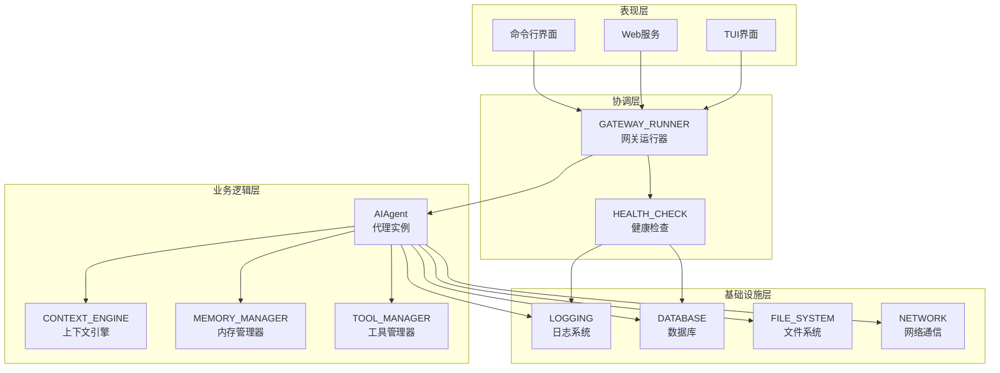

**图表来源**
- [hermes_cli/main.py:1-800](file://hermes_cli/main.py#L1-L800)
- [gateway/run.py:1-800](file://gateway/run.py#L1-L800)
- [run_agent.py:1-5494](file://run_agent.py#L1-L5494)

## 详细组件分析

### 代理初始化流程

代理初始化是生命周期管理的第一步，负责建立完整的运行环境：

#### 参数验证与配置

初始化过程中执行多层次的参数验证：

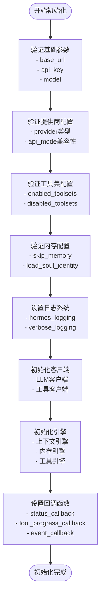

**图表来源**
- [agent_init.py:154-1716](file://agent/agent_init.py#L154-L1716)

#### 客户端初始化策略

系统支持多种客户端初始化策略：

| 客户端类型 | 初始化方式 | 特殊处理 |
|-----------|-----------|----------|
| Anthropic | `build_anthropic_client` | 支持AWS Bedrock SDK |
| OpenAI | `OpenAI`延迟加载 | 避免SDK导入开销 |
| 自定义 | 动态检测 | 支持多种自定义端点 |
| 本地模型 | 直接连接 | 无需认证 |

**章节来源**
- [agent_init.py:623-800](file://agent/agent_init.py#L623-L800)

### 状态转换机制

代理的状态转换遵循严格的有限状态机设计：

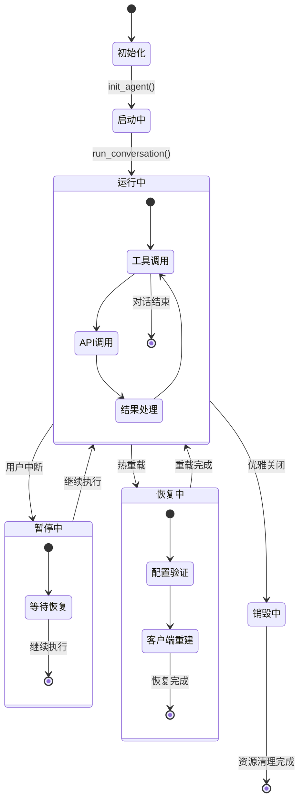

**图表来源**
- [run_agent.py:320-800](file://run_agent.py#L320-L800)
- [agent_runtime_helpers.py:690-693](file://agent/agent_runtime_helpers.py#L690-L693)

**章节来源**
- [run_agent.py:320-800](file://run_agent.py#L320-L800)
- [agent_runtime_helpers.py:1-2607](file://agent/agent_runtime_helpers.py#L1-L2607)

### 运行时管理与监控

系统提供了全面的运行时监控能力：

#### 资源监控

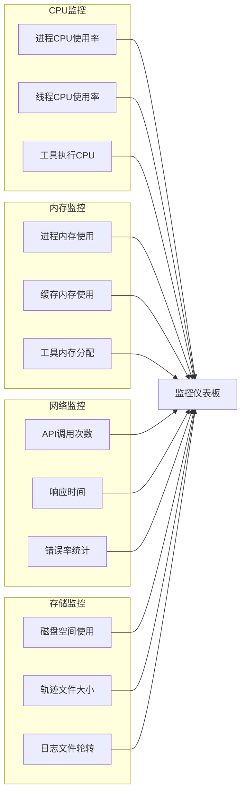

#### 性能跟踪

系统内置了详细的性能跟踪机制：

| 跟踪维度 | 指标类型 | 数据来源 | 更新频率 |
|---------|---------|---------|---------|
| API调用 | 延迟、吞吐量、错误率 | LLM客户端 | 实时 |
| 工具执行 | 执行时间、成功率 | 工具管理器 | 实时 |
| 内存使用 | 分配量、峰值、泄漏检测 | 内存管理器 | 采样 |
| 缓存命中 | 命中率、大小、淘汰 | 上下文引擎 | 实时 |
| 日志分析 | 错误分布、性能瓶颈 | 日志系统 | 实时 |

**章节来源**
- [agent_init.py:526-551](file://agent/agent_init.py#L526-L551)
- [run_agent.py:772-800](file://run_agent.py#L772-L800)

### 轨迹记录系统

轨迹记录是代理行为审计和训练数据生成的核心功能：

#### 轨迹格式规范

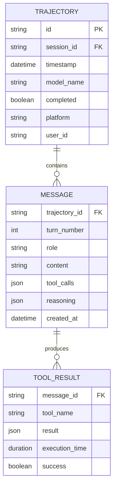

**图表来源**
- [trajectory.py:30-57](file://agent/trajectory.py#L30-L57)

#### 轨迹保存策略

系统支持多种轨迹保存策略：

| 策略类型 | 触发条件 | 文件格式 | 存储位置 |
|---------|---------|---------|---------|
| 会话轨迹 | 会话结束 | JSONL | ~/.hermes/trajectories/ |
| 失败轨迹 | API错误 | JSONL | ~/.hermes/failed_trajectories/ |
| 批量轨迹 | 批处理完成 | JSONL | 当前工作目录 |
| 实时轨迹 | 配置启用 | 流式JSON | 内存缓冲区 |

**章节来源**
- [trajectory.py:1-57](file://agent/trajectory.py#L1-L57)
- [run_agent.py:183-186](file://run_agent.py#L183-L186)

### 热重载与配置更新

系统支持运行时的平滑配置更新：

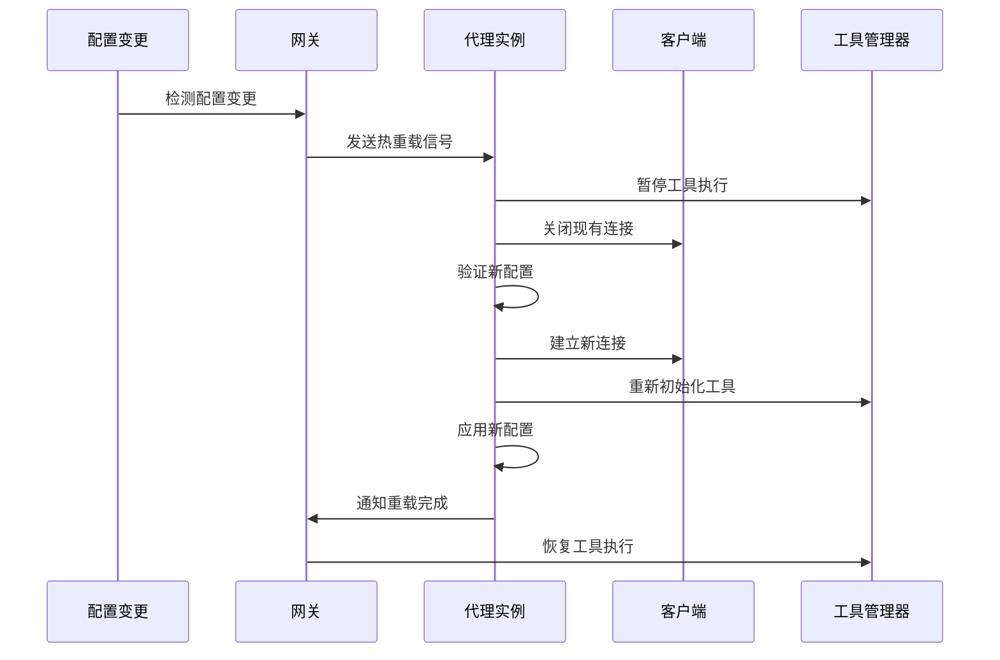

**图表来源**
- [agent_runtime_helpers.py:689-693](file://agent/agent_runtime_helpers.py#L689-L693)

**章节来源**
- [agent_runtime_helpers.py:66-234](file://agent/agent_runtime_helpers.py#L66-L234)

### 优雅关闭与清理

优雅关闭确保系统在停止时保持数据一致性和资源完整性：

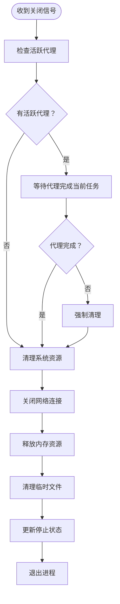

**图表来源**
- [gracefulExit.ts:1-47](file://ui-tui/src/lib/gracefulExit.ts#L1-L47)
- [run_agent.py:10343-10367](file://run_agent.py#L10343-L10367)

**章节来源**
- [gracefulExit.ts:1-47](file://ui-tui/src/lib/gracefulExit.ts#L1-L47)
- [run_agent.py:10343-10367](file://run_agent.py#L10343-L10367)

## 依赖分析

### 核心依赖关系

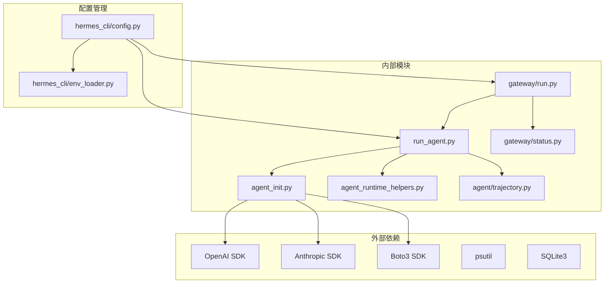

**图表来源**
- [agent_init.py:1-1721](file://agent/agent_init.py#L1-L1721)
- [run_agent.py:1-5494](file://run_agent.py#L1-L5494)
- [gateway/run.py:1-17044](file://gateway/run.py#L1-L17044)

### 循环依赖检测

系统通过模块化设计避免了循环依赖：

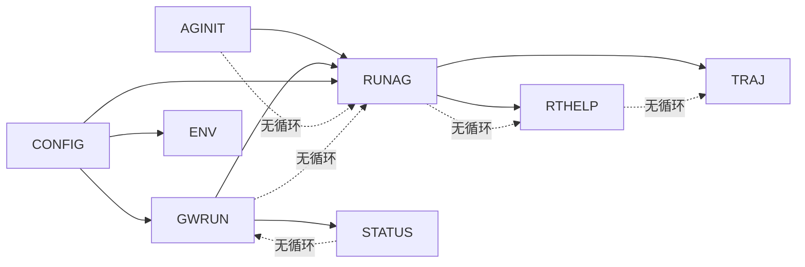

**图表来源**
- [agent_init.py:1-1721](file://agent/agent_init.py#L1-L1721)
- [run_agent.py:1-5494](file://run_agent.py#L1-L5494)
- [gateway/run.py:1-17044](file://gateway/run.py#L1-L17044)

**章节来源**
- [agent_init.py:1-1721](file://agent/agent_init.py#L1-L1721)
- [run_agent.py:1-5494](file://run_agent.py#L1-L5494)
- [gateway/run.py:1-17044](file://gateway/run.py#L1-L17044)

## 性能考虑

### 内存管理优化

系统采用了多层内存管理策略：

1. **代理缓存管理**：限制最大代理数量（默认128个）
2. **空闲超时控制**：1小时空闲自动清理
3. **工具执行隔离**：每个工具在独立线程池执行
4. **内存泄漏防护**：定期检查和清理未使用的资源

### 并发控制

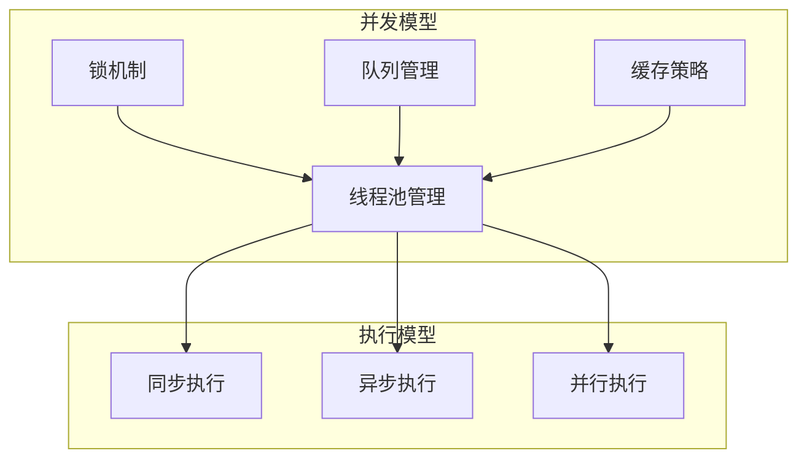

### 性能监控指标

| 指标类别 | 监控目标 | 报警阈值 | 处理策略 |
|---------|---------|---------|---------|
| CPU使用率 | >80% | >90% | 降级服务 |
| 内存使用 | >85% | >95% | 触发GC |
| API延迟 | >2s | >5s | 切换备用端点 |
| 工具执行 | >30s | >60s | 中断并重试 |
| 连接数 | >1000 | >2000 | 连接池扩容 |

## 故障排除指南

### 常见问题诊断

#### 代理初始化失败

**症状**：代理无法启动，抛出初始化异常

**诊断步骤**：
1. 检查网络连接和API密钥
2. 验证模型配置的有效性
3. 查看日志文件中的详细错误信息
4. 确认依赖包版本兼容性

**解决方案**：
- 重新配置API密钥和端点
- 更新模型名称和提供商设置
- 检查防火墙和代理设置
- 清理缓存后重启服务

#### 运行时崩溃

**症状**：代理在执行过程中意外退出

**诊断方法**：
1. 分析崩溃转储文件
2. 检查内存使用情况
3. 验证工具调用的正确性
4. 监控第三方服务可用性

**恢复措施**：
- 启用自动重启机制
- 实施降级策略
- 记录故障转移路径
- 触发告警通知

#### 性能问题

**症状**：响应时间过长或资源消耗过高

**排查流程**：
1. 分析慢查询和阻塞操作
2. 检查并发执行效率
3. 监控系统资源使用
4. 识别瓶颈环节

**优化方案**：
- 调整线程池大小
- 实施连接池复用
- 优化缓存策略
- 实施负载均衡

**章节来源**
- [gateway/run.py:198-275](file://gateway/run.py#L198-L275)
- [run_agent.py:10343-10367](file://run_agent.py#L10343-L10367)

## 结论

Hermes Agent的代理生命周期管理系统展现了现代AI应用的工程化水平。通过精心设计的模块化架构、完善的生命周期管理和强大的监控能力，系统能够在复杂的生产环境中提供稳定可靠的服务。

关键优势包括：

1. **模块化设计**：清晰的职责分离和依赖管理
2. **生命周期完整性**：从创建到销毁的全流程控制
3. **运行时灵活性**：支持热重载和动态配置更新
4. **可观测性**：全面的监控和调试能力
5. **可靠性保障**：优雅关闭和故障恢复机制

该系统为AI代理的规模化部署和运维提供了坚实的基础，适合在企业级环境中进行扩展和定制。

## 附录

### 最佳实践指南

#### 配置管理
- 使用环境变量管理敏感配置
- 实施配置版本控制和变更追踪
- 建立配置验证和回滚机制

#### 监控告警
- 设置多层级监控指标
- 实施智能告警和通知机制
- 建立性能基线和异常检测

#### 安全加固
- 实施最小权限原则
- 加强API访问控制
- 定期安全审计和漏洞扫描

#### 运维自动化
- 实施CI/CD流水线
- 建立自动化测试体系
- 实施蓝绿部署和灰度发布