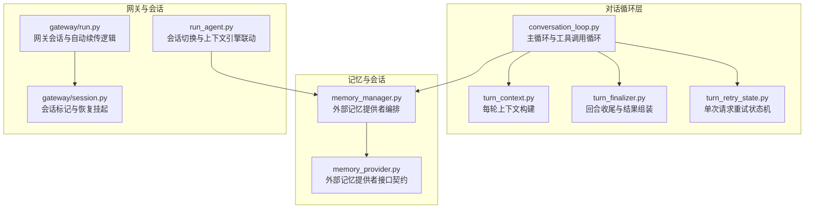
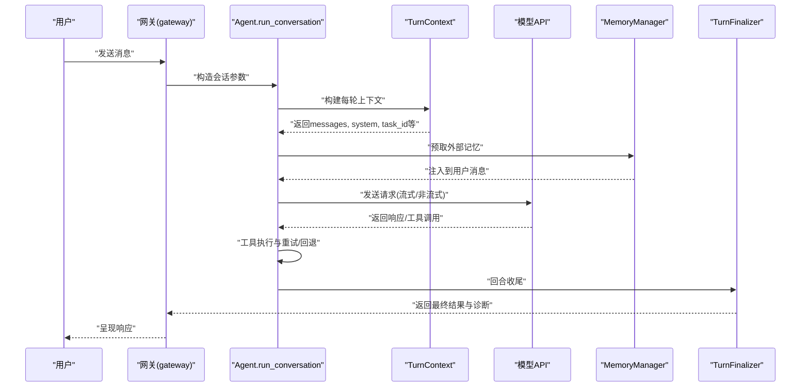
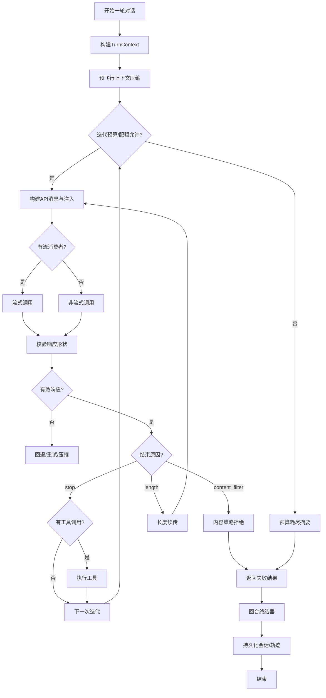
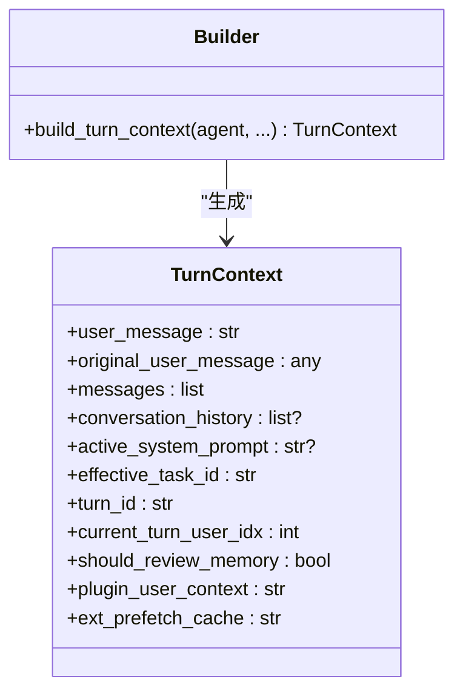
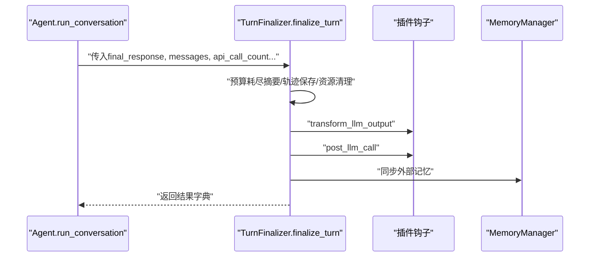
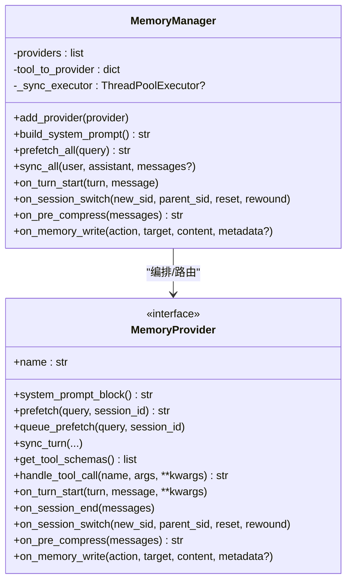
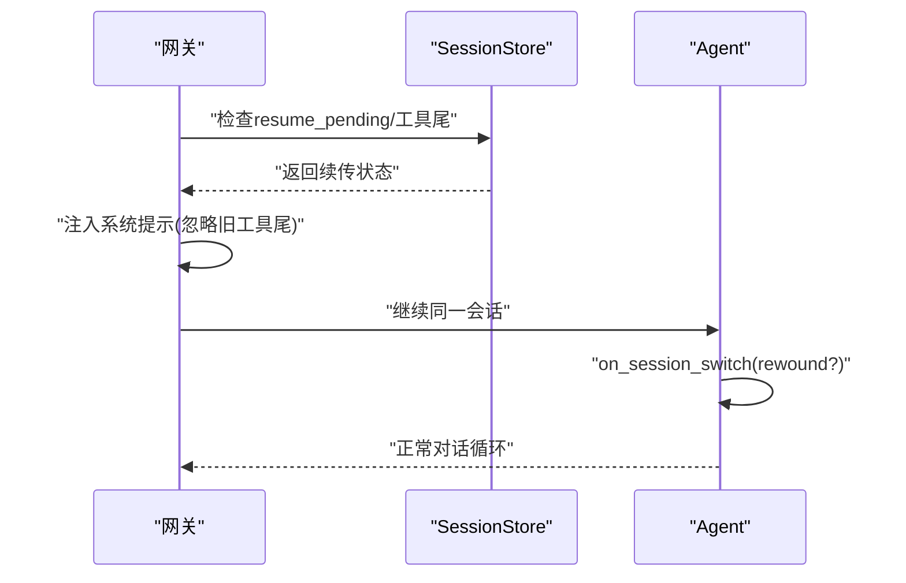
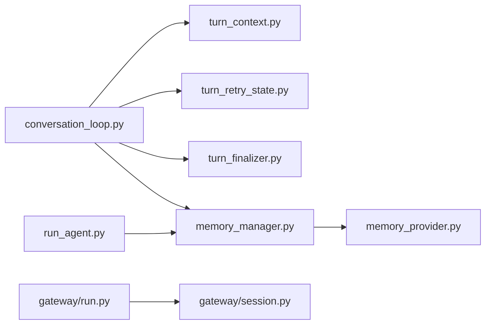

# 对话管理

<cite>
**本文引用的文件**
- [conversation_loop.py](file://agent/conversation_loop.py)
- [turn_context.py](file://agent/turn_context.py)
- [turn_finalizer.py](file://agent/turn_finalizer.py)
- [turn_retry_state.py](file://agent/turn_retry_state.py)
- [memory_manager.py](file://agent/memory_manager.py)
- [memory_provider.py](file://agent/memory_provider.py)
- [run.py](file://gateway/run.py)
- [session.py](file://gateway/session.py)
- [run_agent.py](file://run_agent.py)
</cite>

## 目录
1. [简介](#简介)
2. [项目结构](#项目结构)
3. [核心组件](#核心组件)
4. [架构总览](#架构总览)
5. [详细组件分析](#详细组件分析)
6. [依赖分析](#依赖分析)
7. [性能考虑](#性能考虑)
8. [故障排查指南](#故障排查指南)
9. [结论](#结论)

## 简介
本文件面向对话管理系统的技术文档，聚焦于“对话循环”的核心机制：消息处理、上下文维护与会话状态管理；完整覆盖从用户输入到AI响应的对话轮次生命周期；阐述对话状态的跟踪与恢复（断点续传、会话边界处理）、对话历史的组织与检索策略，以及在工具调用期间的中断与恢复实现细节。同时给出关键算法与数据结构的代码路径指引、性能优化与内存管理最佳实践。

## 项目结构
对话管理由“运行时主循环”“每轮上下文构建”“回合终结器”“重试状态机”“外部记忆管理”等模块协同完成，贯穿于Agent运行期与网关层会话管理之间。

图示来源
- [conversation_loop.py](file://agent/conversation_loop.py)
- [turn_context.py](file://agent/turn_context.py)
- [turn_finalizer.py](file://agent/turn_finalizer.py)
- [turn_retry_state.py](file://agent/turn_retry_state.py)
- [memory_manager.py](file://agent/memory_manager.py)
- [memory_provider.py](file://agent/memory_provider.py)
- [run_agent.py](file://run_agent.py)
- [gateway/run.py](file://gateway/run.py)
- [gateway/session.py](file://gateway/session.py)

章节来源
- [conversation_loop.py](file://agent/conversation_loop.py)
- [turn_context.py](file://agent/turn_context.py)
- [turn_finalizer.py](file://agent/turn_finalizer.py)
- [turn_retry_state.py](file://agent/turn_retry_state.py)
- [memory_manager.py](file://agent/memory_manager.py)
- [memory_provider.py](file://agent/memory_provider.py)
- [run_agent.py](file://run_agent.py)
- [gateway/run.py](file://gateway/run.py)
- [gateway/session.py](file://gateway/session.py)

## 核心组件
- 对话主循环（run_conversation）：驱动一轮对话，包含消息准备、模型调用、工具执行、重试与回退、压缩与恢复、最终收尾。
- 每轮上下文（TurnContext）：一次性初始化本轮所需的所有状态与注入内容，避免循环内重复计算。
- 回合终结器（TurnFinalizer）：在工具循环之后统一进行预算耗尽摘要、轨迹保存、会话持久化、诊断日志、插件钩子、记忆/技能回顾触发等。
- 重试状态机（TurnRetryState）：封装一次请求尝试中的各类恢复分支与重启信号，避免分散的布尔标志。
- 外部记忆管理（MemoryManager/MemoryProvider）：统一注册与调度外部记忆提供者，支持预取、同步、写入回调、会话切换通知等。

章节来源
- [conversation_loop.py](file://agent/conversation_loop.py)
- [turn_context.py](file://agent/turn_context.py)
- [turn_finalizer.py](file://agent/turn_finalizer.py)
- [turn_retry_state.py](file://agent/turn_retry_state.py)
- [memory_manager.py](file://agent/memory_manager.py)
- [memory_provider.py](file://agent/memory_provider.py)

## 架构总览
下图展示从用户输入到AI响应的端到端流程，以及与网关会话恢复、外部记忆提供者的交互。

图示来源
- [conversation_loop.py](file://agent/conversation_loop.py)
- [turn_context.py](file://agent/turn_context.py)
- [turn_finalizer.py](file://agent/turn_finalizer.py)
- [memory_manager.py](file://agent/memory_manager.py)
- [gateway/run.py](file://gateway/run.py)

## 详细组件分析

### 组件A：对话主循环（run_conversation）
- 职责
  - 每轮初始化（安全stdio、运行时主设置、重试计数器、迭代预算、日志上下文、插件钩子、外部记忆预取）。
  - 主工具调用循环：构建API消息、注入推理内容、清理无效角色序列、应用提示缓存策略、选择流式/非流式调用、错误与拒绝处理、长度截断续传、内容策略拒绝终止。
  - 预飞行上下文压缩：根据粗略估算决定是否提前压缩以避免超限。
  - 中断检测：用户新消息或外部中断请求导致提前退出工具循环。
- 关键数据结构
  - messages：当前轮次消息列表，按role交替，包含system/user/assistant/tool。
  - api_messages：发送给模型的API消息副本，进行规范化与注入。
  - TurnRetryState：单次请求尝试的恢复分支与重启信号。
- 算法要点
  - 迭代预算与配额：每次尝试消耗预算，达到上限后进入“预算耗尽摘要”路径。
  - 截断续传：当finish_reason为length且非网络中断stub时，构建续传提示并重建请求。
  - 内容策略拒绝：HTTP 200但被拒绝时，直接返回明确错误，不重试。
  - 流式健康检查：即使无消费者也优先走流式路径，具备空闲检测与超时保护。
- 代码路径
  - [run_conversation](file://agent/conversation_loop.py)
  - [主循环与工具调用循环](file://agent/conversation_loop.py)
  - [API调用与错误处理](file://agent/conversation_loop.py)
  - [截断续传与长度续传](file://agent/conversation_loop.py)
  - [内容策略拒绝处理](file://agent/conversation_loop.py)

图示来源
- [conversation_loop.py](file://agent/conversation_loop.py)
- [turn_finalizer.py](file://agent/turn_finalizer.py)

章节来源
- [conversation_loop.py](file://agent/conversation_loop.py)
- [turn_retry_state.py](file://agent/turn_retry_state.py)

### 组件B：每轮上下文（TurnContext）
- 职责
  - 安装安全stdio、连接健康检查、设置会话上下文、绑定写入来源、恢复主运行时、清理死连接、预压缩警告重放。
  - 初始化迭代预算、记录消息预览、复制历史、水化待办与提醒计数、追踪用户轮次、重置流式上下文清洗器。
  - 注入原始用户消息、添加用户消息、构建活跃系统提示、早期会话持久化、预飞行压缩、插件pre_llm_call钩子、外部记忆预取。
- 输出
  - TurnContext对象，供主循环读取使用，避免在循环中重复初始化。
- 代码路径
  - [build_turn_context](file://agent/turn_context.py)
  - [TurnContext数据结构](file://agent/turn_context.py)

图示来源
- [turn_context.py](file://agent/turn_context.py)

章节来源
- [turn_context.py](file://agent/turn_context.py)

### 组件C：回合终结器（TurnFinalizer）
- 职责
  - 预算耗尽摘要：在达到最大迭代次数时请求模型总结。
  - 轨迹保存：将messages与用户消息摘要保存到轨迹存储。
  - 资源清理：清理任务级VM与浏览器资源。
  - 会话持久化：在私有重试脚手架移除后再持久化，避免误触发“继续”时的空回复循环。
  - 诊断日志：记录回合退出原因、工具调用次数、最后消息角色、响应长度等。
  - 响应解释器：对异常结束（空内容、部分片段）输出可读解释。
  - 插件钩子：transform_llm_output与post_llm_call。
  - 记忆/技能回顾：在响应交付后异步触发。
- 代码路径
  - [finalize_turn](file://agent/turn_finalizer.py)

图示来源
- [turn_finalizer.py](file://agent/turn_finalizer.py)

章节来源
- [turn_finalizer.py](file://agent/turn_finalizer.py)

### 组件D：重试状态机（TurnRetryState）
- 职责
  - 将一次请求尝试中的多个恢复分支（认证刷新、格式修复、传输/速率限制、长上下文压缩重启、长度续传重启）收敛为单一状态对象，便于测试与调试。
- 字段分类
  - 认证/刷新类：codex_auth_retry_attempted、anthropic_auth_retry_attempted、nous_auth_retry_attempted、copilot_auth_retry_attempted、nous_paid_entitlement_refresh_attempted。
  - 格式/载荷类：thinking_sig_retry_attempted、invalid_encrypted_content_retry_attempted、image_shrink_retry_attempted、multimodal_tool_content_retry_attempted、oauth_1m_beta_retry_attempted、llama_cpp_grammar_retry_attempted。
  - 传输/速率限制类：primary_recovery_attempted、has_retried_429。
  - 重启信号：restart_with_compressed_messages、restart_with_length_continuation。
- 代码路径
  - [TurnRetryState](file://agent/turn_retry_state.py)

章节来源
- [turn_retry_state.py](file://agent/turn_retry_state.py)

### 组件E：外部记忆管理（MemoryManager/MemoryProvider）
- 职责
  - 注册与路由：仅允许一个外部提供者，保留内置提供者优先权；建立工具名到提供者的路由表。
  - 上下文注入：在每轮前对查询进行净化，提取用户指令，避免技能脚手架污染；将各提供者的上下文拼接并注入到用户消息中。
  - 同步与预取：后台线程串行执行，确保turn N先于turn N+1落地；支持带或不带messages参数的同步签名探测。
  - 生命周期钩子：on_turn_start、on_session_end、on_session_switch（含rewound语义）、on_pre_compress。
  - 写入回调：on_memory_write支持关键字/位置参数两种模式，屏蔽内置提供者自身写入。
- 数据结构
  - StreamingContextScrubber：跨增量流的内存上下文过滤器，保证拆分块边界的安全性。
  - build_memory_context_block：将原始上下文包裹为带系统注记的围栏块。
- 代码路径
  - [MemoryManager](file://agent/memory_manager.py)
  - [StreamingContextScrubber](file://agent/memory_manager.py)
  - [build_memory_context_block](file://agent/memory_manager.py)
  - [MemoryProvider接口契约](file://agent/memory_provider.py)

图示来源
- [memory_manager.py](file://agent/memory_manager.py)
- [memory_provider.py](file://agent/memory_provider.py)

章节来源
- [memory_manager.py](file://agent/memory_manager.py)
- [memory_provider.py](file://agent/memory_provider.py)

### 组件F：会话边界与断点续传（网关层）
- 自动续传策略
  - 网关在重启/关闭/中断后，若检测到“新鲜的工具尾”或“挂起续传”，会在下一条消息前注入系统提示，要求忽略旧工具输出并优先处理新消息。
- 会话挂起标记
  - 支持将会话标记为“续传挂起”，在重启后继续同一会话通道；与“强制挂起”区分，后者为硬清除信号。
- 会话切换与上下文引擎联动
  - run_agent在会话ID变更时通知上下文引擎，触发on_session_end/on_session_reset/on_session_start等钩子，必要时携带上下文迁移。
- 代码路径
  - [网关自动续传逻辑](file://gateway/run.py)
  - [会话挂起标记与清除](file://gateway/session.py)
  - [会话切换与上下文引擎联动](file://run_agent.py)

图示来源
- [gateway/run.py](file://gateway/run.py)
- [gateway/session.py](file://gateway/session.py)
- [run_agent.py](file://run_agent.py)

章节来源
- [gateway/run.py](file://gateway/run.py)
- [gateway/session.py](file://gateway/session.py)
- [run_agent.py](file://run_agent.py)

## 依赖分析
- 模块耦合
  - conversation_loop依赖turn_context、turn_retry_state、turn_finalizer以解耦初始化、重试与收尾逻辑。
  - memory_manager作为外部提供者编排中心，通过接口契约与具体提供者解耦。
  - 网关层与run_agent通过会话切换钩子与上下文引擎协作，实现跨进程/重启的会话连续性。
- 外部依赖
  - 插件钩子（pre_llm_call、transform_llm_output、post_llm_call等）贯穿上下文构建与回合收尾阶段。
  - 中间件（请求/执行中间件）在API调用前后注入可观测性与负载控制。

图示来源
- [conversation_loop.py](file://agent/conversation_loop.py)
- [turn_context.py](file://agent/turn_context.py)
- [turn_finalizer.py](file://agent/turn_finalizer.py)
- [turn_retry_state.py](file://agent/turn_retry_state.py)
- [memory_manager.py](file://agent/memory_manager.py)
- [memory_provider.py](file://agent/memory_provider.py)
- [run_agent.py](file://run_agent.py)
- [gateway/run.py](file://gateway/run.py)
- [gateway/session.py](file://gateway/session.py)

章节来源
- [conversation_loop.py](file://agent/conversation_loop.py)
- [turn_context.py](file://agent/turn_context.py)
- [turn_finalizer.py](file://agent/turn_finalizer.py)
- [turn_retry_state.py](file://agent/turn_retry_state.py)
- [memory_manager.py](file://agent/memory_manager.py)
- [memory_provider.py](file://agent/memory_provider.py)
- [run_agent.py](file://run_agent.py)
- [gateway/run.py](file://gateway/run.py)
- [gateway/session.py](file://gateway/session.py)

## 性能考虑
- 提示缓存与前缀稳定
  - 在支持的提供商上启用提示缓存，仅在system与最后若干消息插入缓存控制断点，减少输入token成本并保持字节级稳定以复用KV缓存。
- 流式优先与健康检查
  - 即使无消费者也优先走流式路径，利用空闲检测与读超时避免无限挂起；在Copilot ACP等不支持流式的场景降级。
- 预飞行压缩
  - 基于粗略token估算决定是否提前压缩，避免后续多次失败重试；压缩后重估token并可能再次触发压缩。
- 外部记忆异步化
  - 使用单工作线程串行化写入，避免竞争；预取与同步均在后台执行，不阻塞回合主路径。
- 日志与可观测性
  - 详细的回合诊断日志与中间件trace，便于定位超时、配额、上游错误等瓶颈。

## 故障排查指南
- 常见问题与定位
  - “内容策略拒绝”：表现为HTTP 200但被拒绝，系统会直接返回明确错误，不重试；检查提示与工具调用是否触发安全策略。
  - “长度截断续传”：finish_reason为length时，系统会尝试续传；若模型全部用于推理而无可见文本，会提示调整推理预算。
  - “无效响应/429/超时”：系统会尝试回退链路或等待后重试；观察响应时间与错误码，判断是速率限制还是上游超时。
  - “工具尾未完成”：网关检测到历史末尾为tool且“新鲜”，会注入系统提示忽略旧工具尾并优先处理新消息。
- 诊断手段
  - 查看回合诊断日志（退出原因、工具调用次数、最后消息角色、响应长度）。
  - 启用详细日志与请求转储（环境变量），结合中间件trace定位问题。
  - 使用插件钩子transform_llm_output与post_llm_call进行输出修正与外部同步。

章节来源
- [conversation_loop.py](file://agent/conversation_loop.py)
- [turn_finalizer.py](file://agent/turn_finalizer.py)
- [gateway/run.py](file://gateway/run.py)

## 结论
该对话管理系统通过“主循环+每轮上下文+回合终结器+重试状态机+外部记忆管理”的分层设计，实现了高鲁棒性的多轮对话：在消息处理、上下文维护、会话状态管理、断点续传与工具调用恢复方面均有清晰的职责划分与可扩展点。配合网关层的会话挂起与自动续传机制，系统可在进程重启、平台中断等场景下保持对话连续性。建议在生产环境中启用提示缓存、流式健康检查、预飞行压缩与后台记忆异步化，并通过插件与中间件增强可观测性与治理能力。