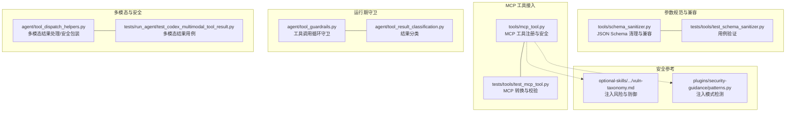
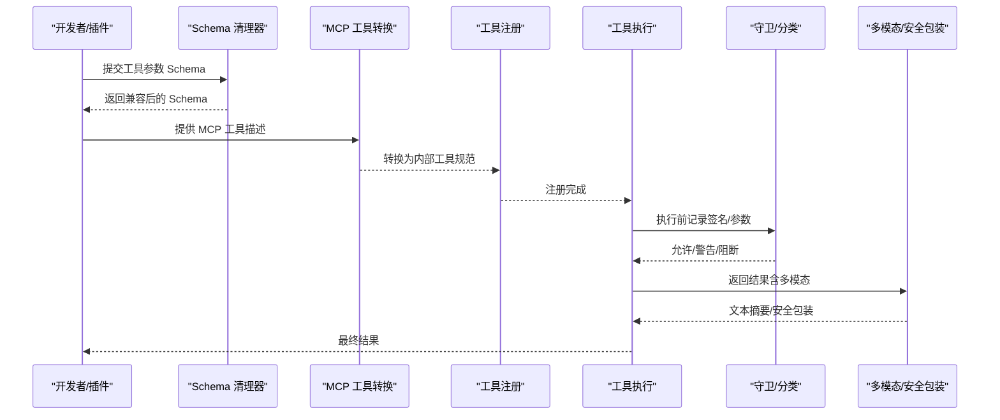
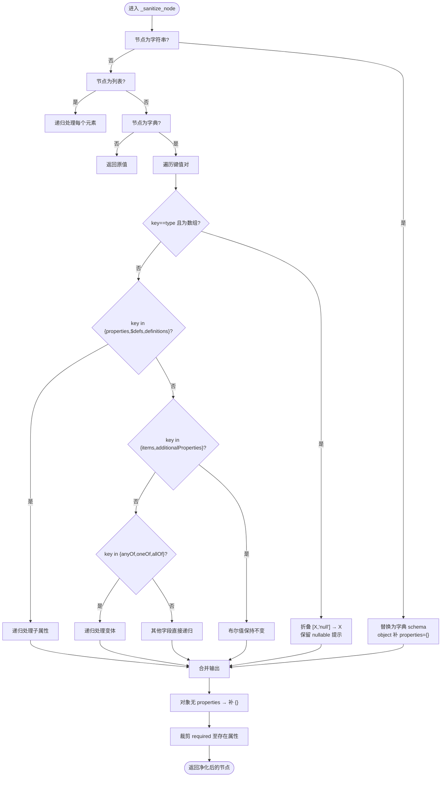
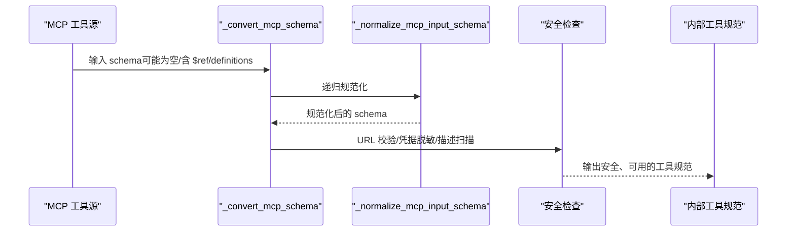
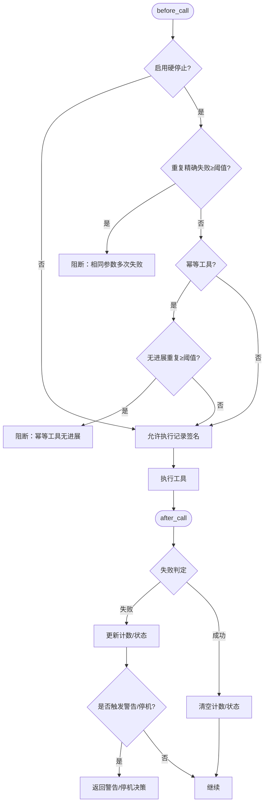
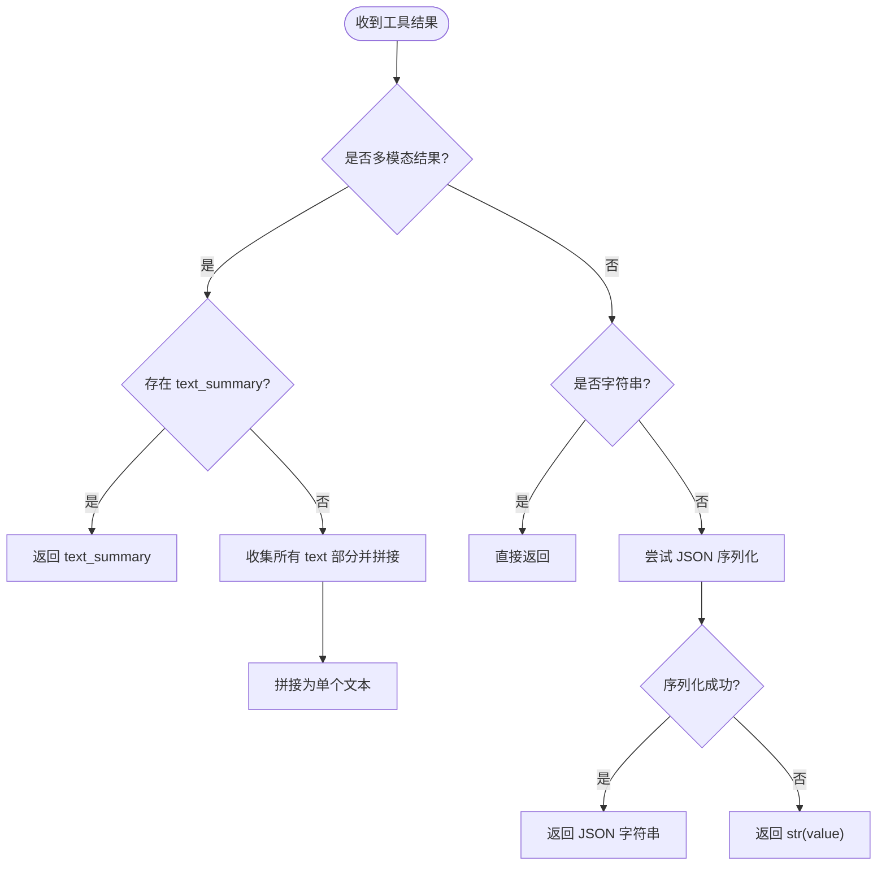
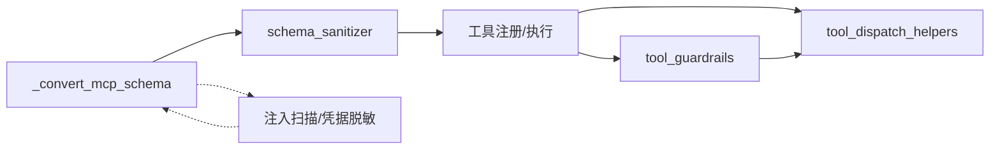

# 工具参数验证

<cite>
**本文引用的文件**
- [tools/schema_sanitizer.py](file://tools/schema_sanitizer.py)
- [tests/tools/test_schema_sanitizer.py](file://tests/tools/test_schema_sanitizer.py)
- [tools/mcp_tool.py](file://tools/mcp_tool.py)
- [tests/tools/test_mcp_tool.py](file://tests/tools/test_mcp_tool.py)
- [agent/tool_guardrails.py](file://agent/tool_guardrails.py)
- [agent/tool_result_classification.py](file://agent/tool_result_classification.py)
- [agent/tool_dispatch_helpers.py](file://agent/tool_dispatch_helpers.py)
- [tests/run_agent/test_codex_multimodal_tool_result.py](file://tests/run_agent/test_codex_multimodal_tool_result.py)
- [optional-skills/security/web-pentest/references/vuln-taxonomy.md](file://optional-skills/security/web-pentest/references/vuln-taxonomy.md)
- [plugins/security-guidance/patterns.py](file://plugins/security-guidance/patterns.py)
</cite>

## 目录
1. [简介](#简介)
2. [项目结构](#项目结构)
3. [核心组件](#核心组件)
4. [架构总览](#架构总览)
5. [详细组件分析](#详细组件分析)
6. [依赖关系分析](#依赖关系分析)
7. [性能考量](#性能考量)
8. [故障排查指南](#故障排查指南)
9. [结论](#结论)
10. [附录](#附录)

## 简介
本文件系统性梳理工具参数验证体系，覆盖以下关键主题：
- 参数类型验证与格式检查：基于 JSON Schema 的严格化与兼容性修复
- 参数转换与规范化：类型强制、空值处理、枚举清理、联合类型折叠
- 工具签名验证：必需参数校验、可选参数处理、顶层组合器剥离
- 多模态工具结果验证与处理：内容结构校验、文本摘要生成、安全包装
- 安全验证机制：注入攻击防护、凭据脱敏、远程 URL 校验
- 错误处理与用户反馈：异常捕获、回退策略、错误消息标准化
- 扩展与自定义：如何在现有框架上添加新的验证规则与处理逻辑

## 项目结构
围绕“工具参数验证”的核心代码主要分布在如下模块：
- schema 规范化与兼容层：tools/schema_sanitizer.py 及其测试
- MCP 工具接入与安全：tools/mcp_tool.py 及其测试
- 运行期守卫与循环控制：agent/tool_guardrails.py
- 结果分类与文件变更识别：agent/tool_result_classification.py
- 多模态结果处理与安全包装：agent/tool_dispatch_helpers.py
- 安全参考与注入模式：optional-skills/security/web-pentest/references/vuln-taxonomy.md、plugins/security-guidance/patterns.py

图示来源
- [tools/schema_sanitizer.py:46-100](file://tools/schema_sanitizer.py#L46-L100)
- [tests/tools/test_schema_sanitizer.py:1-200](file://tests/tools/test_schema_sanitizer.py#L1-L200)
- [tools/mcp_tool.py:1-120](file://tools/mcp_tool.py#L1-L120)
- [tests/tools/test_mcp_tool.py:1-200](file://tests/tools/test_mcp_tool.py#L1-L200)
- [agent/tool_guardrails.py:1-120](file://agent/tool_guardrails.py#L1-L120)
- [agent/tool_result_classification.py:1-27](file://agent/tool_result_classification.py#L1-L27)
- [agent/tool_dispatch_helpers.py:177-235](file://agent/tool_dispatch_helpers.py#L177-L235)
- [tests/run_agent/test_codex_multimodal_tool_result.py:36-69](file://tests/run_agent/test_codex_multimodal_tool_result.py#L36-L69)
- [optional-skills/security/web-pentest/references/vuln-taxonomy.md:7-32](file://optional-skills/security/web-pentest/references/vuln-taxonomy.md#L7-L32)
- [plugins/security-guidance/patterns.py:101-123](file://plugins/security-guidance/patterns.py#L101-L123)

章节来源
- [tools/schema_sanitizer.py:46-100](file://tools/schema_sanitizer.py#L46-L100)
- [tools/mcp_tool.py:1-120](file://tools/mcp_tool.py#L1-L120)
- [agent/tool_guardrails.py:1-120](file://agent/tool_guardrails.py#L1-L120)
- [agent/tool_dispatch_helpers.py:177-235](file://agent/tool_dispatch_helpers.py#L177-L235)

## 核心组件
- JSON Schema 清理器（tools/schema_sanitizer.py）
  - 功能：对工具参数 JSON Schema 进行兼容性修复，移除严格后端不接受的组合器、修复裸字符串 schema、折叠可空联合类型、剥离顶层禁止关键字等
  - 关键点：深拷贝保护、递归遍历、顶层组合器剥离、nullable 提示保留
- MCP 工具转换与安全（tools/mcp_tool.py）
  - 功能：将 MCP 工具描述转换为内部工具规范；远程 URL 校验；凭据脱敏；注入模式扫描；环境变量过滤
  - 关键点：_convert_mcp_schema、_validate_remote_mcp_url、_sanitize_error、_scan_mcp_description
- 工具调用循环守卫（agent/tool_guardrails.py）
  - 功能：检测重复失败、无进展读操作、相同工具反复失败等，提供警告或硬停止决策
  - 关键点：ToolCallGuardrailController、canonical_tool_args、classify_tool_failure
- 多模态结果处理（agent/tool_dispatch_helpers.py）
  - 功能：识别多模态结果、提取文本摘要、追加子目录提示、安全包装高风险输出
  - 关键点：_is_multimodal_tool_result、_multimodal_text_summary、_maybe_wrap_untrusted
- 结果分类（agent/tool_result_classification.py）
  - 功能：识别写入类工具是否真正落地（如 bytes_written、success）
  - 关键点：file_mutation_result_landed

章节来源
- [tools/schema_sanitizer.py:46-100](file://tools/schema_sanitizer.py#L46-L100)
- [tools/mcp_tool.py:352-423](file://tools/mcp_tool.py#L352-L423)
- [agent/tool_guardrails.py:127-187](file://agent/tool_guardrails.py#L127-L187)
- [agent/tool_dispatch_helpers.py:177-235](file://agent/tool_dispatch_helpers.py#L177-L235)
- [agent/tool_result_classification.py:12-26](file://agent/tool_result_classification.py#L12-L26)

## 架构总览
下图展示了从“工具参数 Schema”到“运行期执行”的关键验证路径，以及“多模态结果”和“安全包装”的处理流程。

图示来源
- [tools/schema_sanitizer.py:46-100](file://tools/schema_sanitizer.py#L46-L100)
- [tools/mcp_tool.py:140-200](file://tools/mcp_tool.py#L140-L200)
- [agent/tool_guardrails.py:224-284](file://agent/tool_guardrails.py#L224-L284)
- [agent/tool_dispatch_helpers.py:191-235](file://agent/tool_dispatch_helpers.py#L191-L235)

## 详细组件分析

### 组件一：JSON Schema 清理与兼容（schema_sanitizer）
- 类型验证与格式检查
  - 裸字符串 schema 替换为字典形式（如 "object" → {"type":"object","properties":{}}）
  - 数组类型 ["X","null"] 折叠为单一类型，并保留 nullable 提示
  - 对象节点缺失 properties 自动补全为空对象
  - required 列表裁剪至实际存在的属性名
- 参数转换与规范化
  - strip_nullable_unions：折叠 anyOf/oneOf 中仅含 null 的分支，保留元数据（title/description/default/examples），必要时设置 nullable:true
  - strip_pattern_and_format：针对 llama.cpp 语法限制，按需剥离 pattern/format
  - strip_slash_enum：剥离包含斜杠的 enum 值以适配 xAI Responses 语法编译
  - _strip_ref_siblings：移除与 $ref 同级的 default 等关键字（严格后端不接受）
  - _strip_top_level_combinators：移除顶层 allOf/anyOf/oneOf/enum/not
- 工具签名验证
  - 通过 strip_nullable_unions 和 required 裁剪，确保签名稳定且可比较
  - canonical_tool_args 使用排序 JSON 作为签名基础，避免参数顺序导致的误判

图示来源
- [tools/schema_sanitizer.py:231-336](file://tools/schema_sanitizer.py#L231-L336)

章节来源
- [tools/schema_sanitizer.py:231-336](file://tools/schema_sanitizer.py#L231-L336)
- [tests/tools/test_schema_sanitizer.py:23-144](file://tests/tools/test_schema_sanitizer.py#L23-L144)

### 组件二：MCP 工具转换与安全（mcp_tool）
- Schema 转换
  - _convert_mcp_schema：将 MCP 工具的 inputSchema 转换为内部规范，处理空 schema、$ref 重写、definitions → $defs
  - _normalize_mcp_input_schema：递归规范化嵌套 schema，折叠可空数组项
- 安全与验证
  - _validate_remote_mcp_url：严格校验 http(s) URL，拒绝非字符串、空主机、非法 scheme
  - _sanitize_error：使用正则脱敏错误中的凭据片段
  - _scan_mcp_description：扫描描述中的潜在注入模式（忽略先前指令、身份覆盖、系统提示注入等）
  - 环境变量过滤：仅传递安全变量，避免泄露密钥

图示来源
- [tools/mcp_tool.py:140-200](file://tools/mcp_tool.py#L140-L200)
- [tools/mcp_tool.py:352-423](file://tools/mcp_tool.py#L352-L423)
- [tests/tools/test_mcp_tool.py:139-200](file://tests/tools/test_mcp_tool.py#L139-L200)

章节来源
- [tools/mcp_tool.py:352-423](file://tools/mcp_tool.py#L352-L423)
- [tests/tools/test_mcp_tool.py:139-200](file://tests/tools/test_mcp_tool.py#L139-L200)

### 组件三：工具调用循环守卫（tool_guardrails）
- 签名与参数规范化
  - canonical_tool_args：将参数映射序列化为紧凑 JSON 并排序，作为稳定签名
- 失败与无进展检测
  - exact_failure_counts：同一签名重复失败计数
  - same_tool_failure_counts：同一工具名称重复失败计数
  - no_progress：对幂等工具记录结果哈希，检测重复无进展
- 决策与反馈
  - 允许/警告/阻断/停机，支持可配置阈值与硬停止开关
  - toolguard_synthetic_result：为被阻断的调用生成带元数据的合成结果

图示来源
- [agent/tool_guardrails.py:224-375](file://agent/tool_guardrails.py#L224-L375)

章节来源
- [agent/tool_guardrails.py:127-187](file://agent/tool_guardrails.py#L127-L187)
- [agent/tool_guardrails.py:224-375](file://agent/tool_guardrails.py#L224-L375)

### 组件四：多模态工具结果验证与处理（tool_dispatch_helpers）
- 多模态识别
  - _is_multimodal_tool_result：判断是否为多模态结果（含 _multimodal=True、content 为列表）
- 文本摘要与回退
  - _multimodal_text_summary：优先使用 text_summary，否则拼接所有 text 部分；无法解析时回退为字符串
- 安全包装
  - _maybe_wrap_untrusted：对高风险工具（web_extract、web_search、browser_*、mcp_*）的长字符串结果进行安全包装，防止间接注入

图示来源
- [agent/tool_dispatch_helpers.py:191-213](file://agent/tool_dispatch_helpers.py#L191-L213)

章节来源
- [agent/tool_dispatch_helpers.py:177-235](file://agent/tool_dispatch_helpers.py#L177-L235)
- [tests/run_agent/test_codex_multimodal_tool_result.py:36-69](file://tests/run_agent/test_codex_multimodal_tool_result.py#L36-L69)

### 组件五：结果分类与文件变更识别（tool_result_classification）
- 识别写入类工具是否真正落地
  - write_file：检查返回中是否存在 bytes_written
  - patch：检查 success 是否为真

章节来源
- [agent/tool_result_classification.py:12-26](file://agent/tool_result_classification.py#L12-L26)

## 依赖关系分析
- schema_sanitizer 与 mcp_tool 的协作
  - mcp_tool 在转换阶段规范化 schema（definitions→$defs、空 schema 默认化），随后由 schema_sanitizer 做进一步兼容性修复
- tool_guardrails 与 tool_dispatch_helpers 的配合
  - 守卫在执行前后记录签名与结果；多模态处理负责将复杂结果转为文本摘要，便于守卫做去重与无进展判断
- 安全参考与注入防护
  - mcp_tool 的 _scan_mcp_description 与 vuln-taxonomy.md、patterns.py 的注入模式清单共同构成注入攻击的识别与告警体系

图示来源
- [tools/mcp_tool.py:140-200](file://tools/mcp_tool.py#L140-L200)
- [tools/schema_sanitizer.py:46-100](file://tools/schema_sanitizer.py#L46-L100)
- [agent/tool_guardrails.py:224-284](file://agent/tool_guardrails.py#L224-L284)
- [agent/tool_dispatch_helpers.py:177-235](file://agent/tool_dispatch_helpers.py#L177-L235)

章节来源
- [tools/mcp_tool.py:352-423](file://tools/mcp_tool.py#L352-L423)
- [tools/schema_sanitizer.py:46-100](file://tools/schema_sanitizer.py#L46-L100)
- [agent/tool_guardrails.py:224-284](file://agent/tool_guardrails.py#L224-L284)
- [agent/tool_dispatch_helpers.py:177-235](file://agent/tool_dispatch_helpers.py#L177-L235)

## 性能考量
- 深度复制与递归遍历
  - schema_sanitizer 对输入进行深拷贝并在递归中遍历整个树，建议在批量处理时复用已净化的缓存，减少重复计算
- 正则匹配与字符串处理
  - mcp_tool 的注入扫描与错误脱敏使用正则，注意在高频场景下的正则复杂度；可考虑预编译与缓存
- 多模态摘要与 JSON 序列化
  - _multimodal_text_summary 在大结果时会进行 JSON 序列化，建议对超大结果采用流式处理或截断策略

## 故障排查指南
- llama.cpp 语法错误（无法生成解析器）
  - 现象：HTTP 400，提示 unrecognized schema 或 grammar-parse 失败
  - 处理：调用 strip_pattern_and_format 移除 pattern/format；必要时回退到更宽松的 schema
  - 参考：[tools/schema_sanitizer.py:346-420](file://tools/schema_sanitizer.py#L346-L420)
- xAI Responses 语法错误（enum 包含斜杠）
  - 现象：HTTP 400，提示无效参数
  - 处理：调用 strip_slash_enum 移除包含斜杠的 enum
  - 参考：[tools/schema_sanitizer.py:423-483](file://tools/schema_sanitizer.py#L423-L483)
- MCP 远程 URL 不合法
  - 现象：InvalidMcpUrlError 或 NonMcpEndpointError
  - 处理：检查 scheme/host/port/路径；确认服务端返回正确的 Content-Type
  - 参考：[tools/mcp_tool.py:573-622](file://tools/mcp_tool.py#L573-L622)
- 工具循环阻断
  - 现象：被阻断或警告
  - 处理：查看守卫决策码与计数，调整参数或更换工具路径
  - 参考：[agent/tool_guardrails.py:241-375](file://agent/tool_guardrails.py#L241-L375)
- 多模态结果类型不符
  - 现象：下游需要数组但得到字符串
  - 处理：确认多模态转换逻辑与测试用例一致
  - 参考：[tests/run_agent/test_codex_multimodal_tool_result.py:48-64](file://tests/run_agent/test_codex_multimodal_tool_result.py#L48-L64)

章节来源
- [tools/schema_sanitizer.py:346-483](file://tools/schema_sanitizer.py#L346-L483)
- [tools/mcp_tool.py:573-622](file://tools/mcp_tool.py#L573-L622)
- [agent/tool_guardrails.py:241-375](file://agent/tool_guardrails.py#L241-L375)
- [tests/run_agent/test_codex_multimodal_tool_result.py:48-64](file://tests/run_agent/test_codex_multimodal_tool_result.py#L48-L64)

## 结论
该参数验证体系通过“Schema 清理—MCP 转换—运行期守卫—多模态处理—安全包装”的闭环，实现了：
- 对严格后端的兼容与鲁棒性
- 对注入与凭据泄露的主动防护
- 对工具循环与无进展的智能治理
- 对多模态结果的统一处理与安全输出

## 附录

### 参数验证扩展与自定义规则开发指引
- 新增 JSON Schema 清理规则
  - 在 _sanitize_node 或新增函数中处理特定关键字（如 format/pattern 的条件剥离）
  - 保持深拷贝与递归一致性，避免副作用
  - 编写对应测试用例覆盖边界情况
  - 参考：[tools/schema_sanitizer.py:231-336](file://tools/schema_sanitizer.py#L231-L336)、[tests/tools/test_schema_sanitizer.py:1-200](file://tests/tools/test_schema_sanitizer.py#L1-L200)
- 新增 MCP 描述注入检测
  - 在 _MCP_INJECTION_PATTERNS 中添加正则与告警原因
  - 注意避免误报，结合上下文与长度阈值
  - 参考：[tools/mcp_tool.py:377-401](file://tools/mcp_tool.py#L377-L401)
- 新增工具循环守卫策略
  - 在 ToolCallGuardrailConfig 中增加阈值项
  - 在 ToolCallGuardrailController 中扩展决策逻辑
  - 参考：[agent/tool_guardrails.py:63-124](file://agent/tool_guardrails.py#L63-L124)
- 新增多模态结果处理策略
  - 在 _multimodal_text_summary 中增加特定类型部件的提取与拼接
  - 在 _maybe_wrap_untrusted 中扩大高风险工具集合或调整最小长度
  - 参考：[agent/tool_dispatch_helpers.py:191-235](file://agent/tool_dispatch_helpers.py#L191-L235)