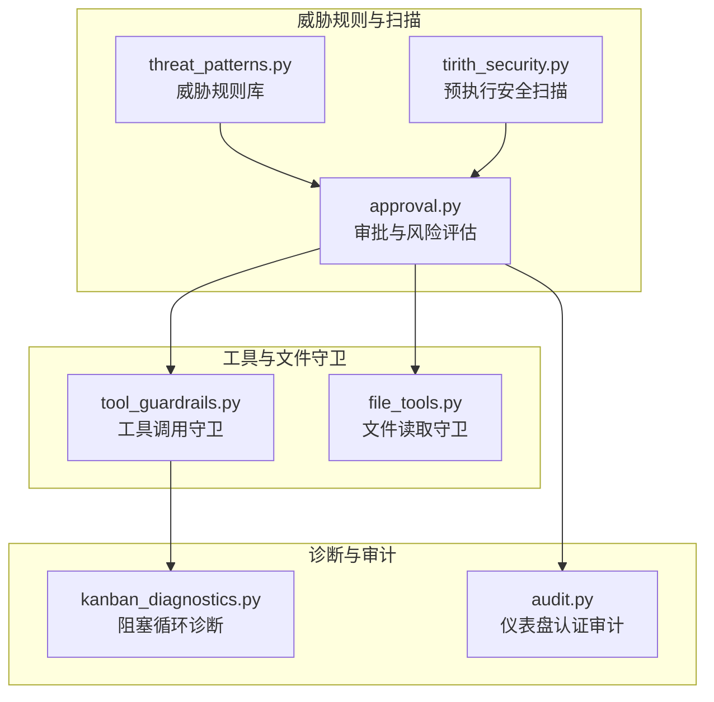
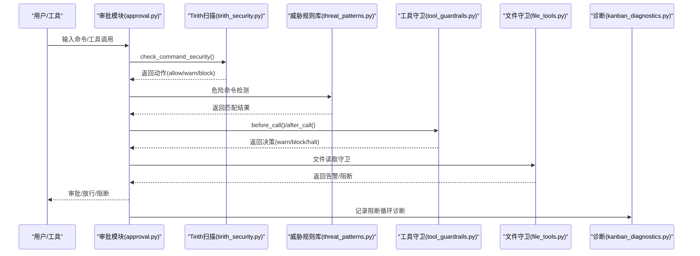
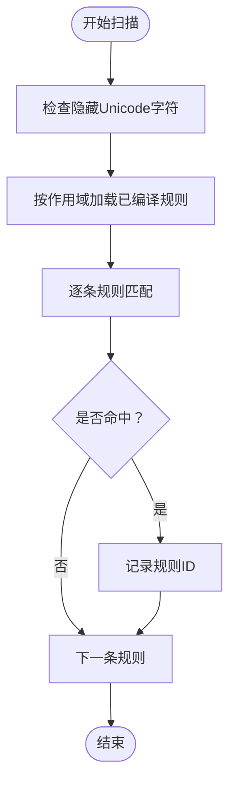
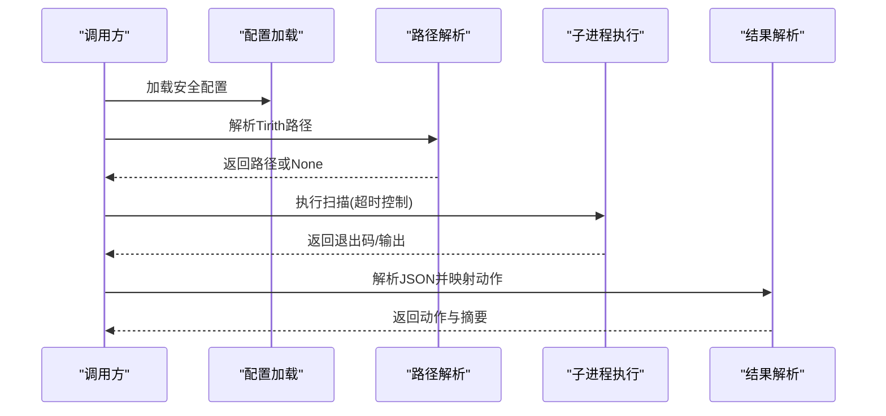
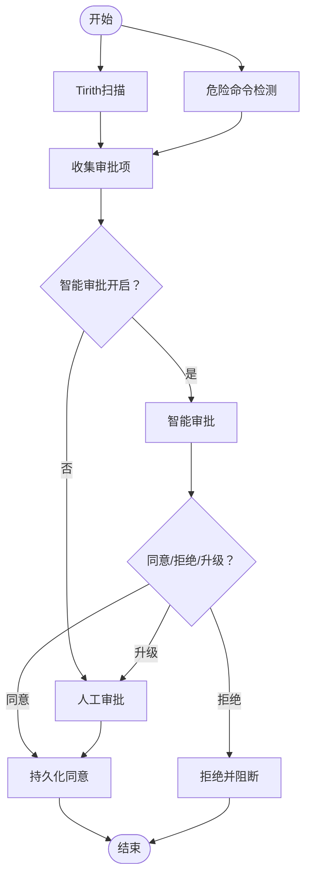
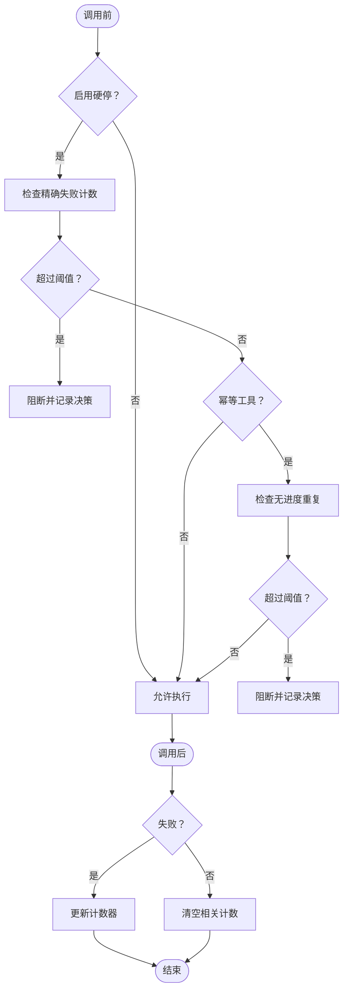
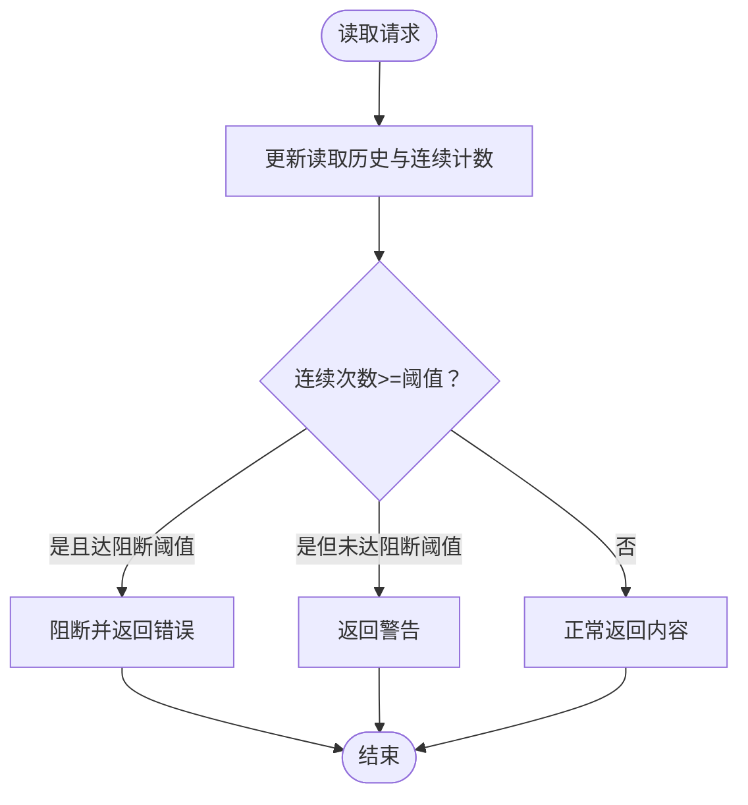
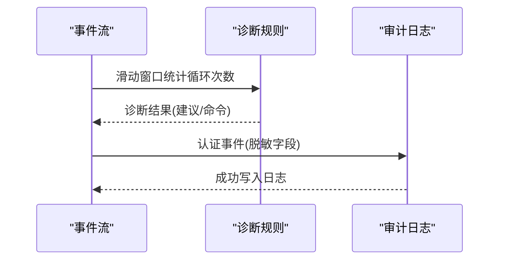
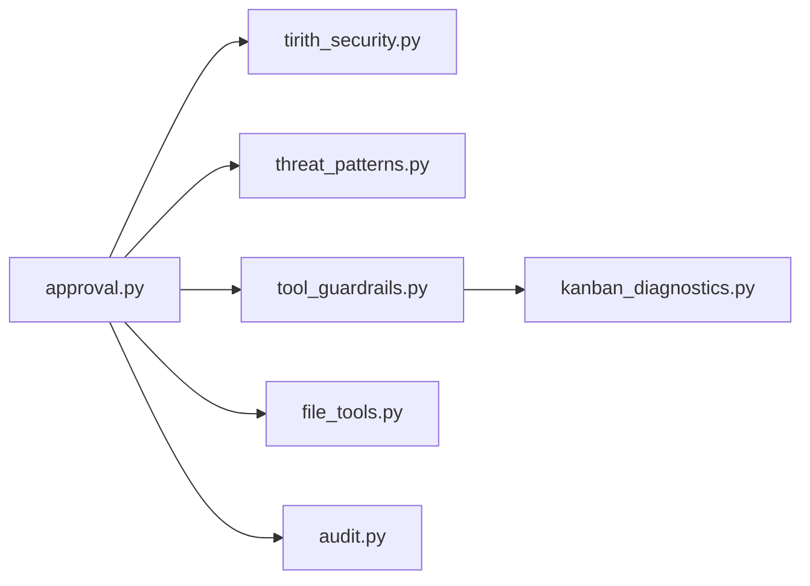

# 威胁检测与响应

<cite>
**本文引用的文件**
- [threat_patterns.py](file://tools/threat_patterns.py)
- [tirith_security.py](file://tools/tirith_security.py)
- [approval.py](file://tools/approval.py)
- [tool_guardrails.py](file://agent/tool_guardrails.py)
- [file_tools.py](file://tools/file_tools.py)
- [kanban_diagnostics.py](file://hermes_cli/kanban_diagnostics.py)
- [audit.py](file://hermes_cli/dashboard_auth/audit.py)
- [test_threat_patterns.py](file://tests/tools/test_threat_patterns.py)
- [test_tirith_security.py](file://tests/tools/test_tirith_security.py)
- [test_tool_guardrails.py](file://tests/agent/test_tool_guardrails.py)
- [test_file_read_guards.py](file://tests/tools/test_file_read_guards.py)
</cite>

## 目录
1. [简介](#简介)
2. [项目结构](#项目结构)
3. [核心组件](#核心组件)
4. [架构总览](#架构总览)
5. [详细组件分析](#详细组件分析)
6. [依赖分析](#依赖分析)
7. [性能考虑](#性能考虑)
8. [故障排查指南](#故障排查指南)
9. [结论](#结论)
10. [附录](#附录)

## 简介
本文件面向“威胁检测与响应系统”的技术文档，聚焦于以下能力：
- 重复失败检测：基于工具调用签名与失败计数的循环检测
- 无进度检测：针对幂等工具调用结果一致性判定的循环检测
- 循环检测：结合阻塞与停止策略，避免无效重试与资源浪费
- 威胁级别识别与响应策略：从低到高的分级处理（警告、阻塞、停止）
- 动态阈值与自适应：阈值可配置、支持硬停用与软警告
- 日志与审计：威胁检测与响应过程的可追溯性
- 规则定制与策略配置：提供可扩展的规则与策略接口

## 项目结构
威胁检测与响应涉及多个子系统协同：
- 威胁规则库：用于内容级威胁识别（提示注入、C2、泄露等）
- 预执行安全扫描：对命令进行内容级威胁评估
- 工具调用守卫：对工具调用循环进行检测与干预
- 文件读取守卫：对连续重复读取进行告警与阻断
- 诊断与审计：对阻塞循环、会话状态进行诊断与审计

图示来源
- [threat_patterns.py:1-253](file://tools/threat_patterns.py#L1-L253)
- [tirith_security.py:1-823](file://tools/tirith_security.py#L1-L823)
- [approval.py:1400-1599](file://tools/approval.py#L1400-L1599)
- [tool_guardrails.py:1-476](file://agent/tool_guardrails.py#L1-L476)
- [file_tools.py:950-1149](file://tools/file_tools.py#L950-L1149)
- [kanban_diagnostics.py:780-979](file://hermes_cli/kanban_diagnostics.py#L780-L979)
- [audit.py:1-88](file://hermes_cli/dashboard_auth/audit.py#L1-L88)

章节来源
- [threat_patterns.py:1-253](file://tools/threat_patterns.py#L1-L253)
- [tirith_security.py:1-823](file://tools/tirith_security.py#L1-L823)
- [approval.py:1400-1599](file://tools/approval.py#L1400-L1599)
- [tool_guardrails.py:1-476](file://agent/tool_guardrails.py#L1-L476)
- [file_tools.py:950-1149](file://tools/file_tools.py#L950-L1149)
- [kanban_diagnostics.py:780-979](file://hermes_cli/kanban_diagnostics.py#L780-L979)
- [audit.py:1-88](file://hermes_cli/dashboard_auth/audit.py#L1-L88)

## 核心组件
- 威胁规则库（threat_patterns.py）
  - 按攻击类别组织正则规则，按作用域（all/context/strict）应用
  - 支持隐藏 Unicode 字符检测
- 预执行安全扫描（tirith_security.py）
  - 调用外部二进制进行命令内容级威胁扫描，返回动作（允许/警告/阻止）
  - 支持自动安装、超时与失败开/关策略
- 审批与风险评估（approval.py）
  - 统一收集威胁扫描与危险命令检测结果，进入审批流程
  - 支持智能审批与网关/CLI 交互式审批
- 工具调用守卫（tool_guardrails.py）
  - 基于工具签名与结果哈希的重复失败与无进度检测
  - 支持警告、阻断、停止三类响应
- 文件读取守卫（file_tools.py）
  - 对同一文件区域连续重复读取进行告警与阻断
- 诊断与审计（kanban_diagnostics.py、audit.py）
  - 任务阻塞循环诊断与仪表盘认证审计日志

章节来源
- [threat_patterns.py:187-224](file://tools/threat_patterns.py#L187-L224)
- [tirith_security.py:697-805](file://tools/tirith_security.py#L697-L805)
- [approval.py:1400-1599](file://tools/approval.py#L1400-L1599)
- [tool_guardrails.py:224-375](file://agent/tool_guardrails.py#L224-L375)
- [file_tools.py:975-1041](file://tools/file_tools.py#L975-L1041)
- [kanban_diagnostics.py:780-851](file://hermes_cli/kanban_diagnostics.py#L780-L851)
- [audit.py:63-87](file://hermes_cli/dashboard_auth/audit.py#L63-L87)

## 架构总览
整体流程：命令输入经由威胁规则与预执行扫描评估，再结合工具调用与文件读取守卫，最终进入审批与响应阶段。

图示来源
- [approval.py:1400-1599](file://tools/approval.py#L1400-L1599)
- [tirith_security.py:697-805](file://tools/tirith_security.py#L697-L805)
- [threat_patterns.py:187-224](file://tools/threat_patterns.py#L187-L224)
- [tool_guardrails.py:224-375](file://agent/tool_guardrails.py#L224-L375)
- [file_tools.py:975-1041](file://tools/file_tools.py#L975-L1041)
- [kanban_diagnostics.py:780-851](file://hermes_cli/kanban_diagnostics.py#L780-L851)

## 详细组件分析

### 威胁规则库（threat_patterns.py）
- 设计要点
  - 按攻击类别组织规则，支持多作用域（all/context/strict）
  - 使用词法锚定与通配减少绕过尝试
  - 隐藏 Unicode 字符检测作为隐形注入防护
- 关键数据结构
  - 规则集：列表形式存储（正则、规则ID、作用域）
  - 编译缓存：按作用域预编译正则，提升扫描效率
- 复杂度
  - 匹配复杂度近似 O(N)（N 为规则数量），隐藏字符检测 O(M)（M 为文本长度）

图示来源
- [threat_patterns.py:147-184](file://tools/threat_patterns.py#L147-L184)
- [threat_patterns.py:187-224](file://tools/threat_patterns.py#L187-L224)

章节来源
- [threat_patterns.py:1-253](file://tools/threat_patterns.py#L1-L253)

### 预执行安全扫描（tirith_security.py）
- 设计要点
  - 通过子进程调用外部二进制进行内容级威胁扫描
  - 退出码决定动作（0=允许，1=阻止，2=警告）
  - JSON 输出用于丰富发现信息，不覆盖退出码判断
  - 支持自动安装、超时与失败开/关策略
- 关键流程
  - 配置加载与路径解析
  - 子进程执行与异常处理
  - 结果解析与规则抑制（如 .app TLD 的误报抑制）

图示来源
- [tirith_security.py:68-87](file://tools/tirith_security.py#L68-L87)
- [tirith_security.py:459-564](file://tools/tirith_security.py#L459-L564)
- [tirith_security.py:722-775](file://tools/tirith_security.py#L722-L775)
- [tirith_security.py:777-805](file://tools/tirith_security.py#L777-L805)

章节来源
- [tirith_security.py:1-823](file://tools/tirith_security.py#L1-L823)

### 审批与风险评估（approval.py）
- 设计要点
  - 统一收集 Tirith 与危险命令检测结果
  - 支持智能审批（辅助LLM初判）、网关/CLI 交互式审批
  - 将“阻止”与“警告”统一纳入审批流程，便于用户理解与授权
- 关键流程
  - Tirith 扫描与危险命令检测
  - 审批项收集与去重
  - 智能审批与人工审批
  - 决策持久化与拒绝处理

图示来源
- [approval.py:1400-1599](file://tools/approval.py#L1400-L1599)

章节来源
- [approval.py:1400-1599](file://tools/approval.py#L1400-L1599)

### 工具调用守卫（tool_guardrails.py）
- 设计要点
  - 基于工具签名（名称+规范化参数）与结果哈希进行循环检测
  - 支持三类响应：警告、阻断、停止
  - 阈值可配置，支持幂等工具与变更型工具区分
- 关键算法
  - 重复精确失败：相同签名连续失败达到阈值触发阻断
  - 同一工具失败：同工具连续失败达到阈值触发停止
  - 幂等无进度：相同结果重复出现达到阈值触发阻断
- 数据结构
  - 签名：工具名+参数哈希
  - 计数器：精确失败、同工具失败、无进度重复
  - 结果哈希：标准化结果字符串的哈希

图示来源
- [tool_guardrails.py:224-375](file://agent/tool_guardrails.py#L224-L375)
- [tool_guardrails.py:426-446](file://agent/tool_guardrails.py#L426-L446)

章节来源
- [tool_guardrails.py:1-476](file://agent/tool_guardrails.py#L1-L476)

### 文件读取守卫（file_tools.py）
- 设计要点
  - 追踪同一文件区域的连续读取次数
  - 达到阈值后发出警告；再次达到更高阈值后阻断
  - 清理与失效策略：上下文压缩、写入/补丁后失效缓存
- 关键流程
  - 读取历史与连续计数维护
  - mtime 记录与陈旧性检测
  - 警告与阻断输出

图示来源
- [file_tools.py:975-1041](file://tools/file_tools.py#L975-L1041)

章节来源
- [file_tools.py:950-1149](file://tools/file_tools.py#L950-L1149)

### 诊断与审计（kanban_diagnostics.py、audit.py）
- 诊断（kanban_diagnostics.py）
  - 基于事件流统计 block→unblock 循环次数，超过阈值给出诊断建议
- 审计（audit.py）
  - 认证相关事件的结构化日志，字段脱敏，落盘安全

图示来源
- [kanban_diagnostics.py:780-851](file://hermes_cli/kanban_diagnostics.py#L780-L851)
- [audit.py:63-87](file://hermes_cli/dashboard_auth/audit.py#L63-L87)

章节来源
- [kanban_diagnostics.py:780-979](file://hermes_cli/kanban_diagnostics.py#L780-L979)
- [audit.py:1-88](file://hermes_cli/dashboard_auth/audit.py#L1-L88)

## 依赖分析
- 组件耦合
  - approval.py 依赖 tirith_security.py 与 threat_patterns.py 的检测结果
  - tool_guardrails.py 与 file_tools.py 独立运行，分别服务于工具调用与文件读取场景
  - kanban_diagnostics.py 与 audit.py 作为诊断与审计支撑模块
- 外部依赖
  - Tirith 二进制（通过子进程调用）
  - 平台与环境变量（如 HERMES_HOME、TIRITH_* 环境变量）

图示来源
- [approval.py:1400-1599](file://tools/approval.py#L1400-L1599)
- [tirith_security.py:1-823](file://tools/tirith_security.py#L1-L823)
- [threat_patterns.py:1-253](file://tools/threat_patterns.py#L1-L253)
- [tool_guardrails.py:1-476](file://agent/tool_guardrails.py#L1-L476)
- [file_tools.py:950-1149](file://tools/file_tools.py#L950-L1149)
- [kanban_diagnostics.py:780-979](file://hermes_cli/kanban_diagnostics.py#L780-L979)
- [audit.py:1-88](file://hermes_cli/dashboard_auth/audit.py#L1-L88)

## 性能考虑
- 正则编译缓存：按作用域预编译，避免重复编译开销
- 子进程超时：限制扫描耗时，避免阻塞主流程
- 结果哈希：对工具结果进行标准化与哈希，降低比较成本
- 读取追踪限容：定期清理过期状态，避免长期会话内存膨胀
- 日志落盘加锁：串行写入，避免竞争条件

## 故障排查指南
- Tirith 无法启动或超时
  - 检查配置与路径解析、自动安装状态、超时设置
  - 参考测试用例验证行为
- 威胁规则误报
  - 使用测试用例定位具体规则与触发条件
- 工具调用循环未被拦截
  - 检查阈值配置、工具签名与结果哈希逻辑
- 文件读取循环未告警
  - 检查连续计数与阈值、写入/补丁后的缓存失效

章节来源
- [test_tirith_security.py:1356-1413](file://tests/tools/test_tirith_security.py#L1356-L1413)
- [test_threat_patterns.py:150-207](file://tests/tools/test_threat_patterns.py#L150-L207)
- [test_tool_guardrails.py:40-251](file://tests/agent/test_tool_guardrails.py#L40-L251)
- [test_file_read_guards.py:375-408](file://tests/tools/test_file_read_guards.py#L375-L408)

## 结论
该系统通过“规则库 + 预执行扫描 + 守卫 + 审批 + 诊断/审计”的组合，实现了对提示注入、C2、泄露、工具循环与文件循环等威胁的多层次防护。其设计强调可配置、可观测与可追溯，既能在高风险场景下提供强约束，也能在低风险场景下提供温和提醒。

## 附录

### 威胁级别与响应策略
- 级别定义
  - 警告：检测到潜在威胁但允许继续，同时给出恢复建议
  - 阻断：阻止当前操作，要求用户介入或修改
  - 停止：终止当前回合或流程，避免进一步损失
- 适用场景
  - 警告：工具循环、文件循环的早期信号
  - 阻断：明确的重复失败或无进度
  - 停止：持续失败且无进展，可能陷入死循环

章节来源
- [tool_guardrails.py:224-375](file://agent/tool_guardrails.py#L224-L375)
- [file_tools.py:1024-1041](file://tools/file_tools.py#L1024-L1041)

### 威胁检测阈值与自适应机制
- 阈值来源
  - 工具调用守卫：可配置的警告/阻断/停止阈值
  - 文件读取守卫：固定阈值（连续读取次数）
- 自适应
  - 通过配置文件动态调整阈值
  - 审批模式（智能/手动）影响用户体验与响应速度

章节来源
- [tool_guardrails.py:63-124](file://agent/tool_guardrails.py#L63-L124)
- [file_tools.py:1024-1041](file://tools/file_tools.py#L1024-L1041)

### 威胁检测日志与审计
- 日志
  - 威胁规则命中、Tirith 扫描结果、工具调用守卫决策
- 审计
  - 认证事件结构化日志，字段脱敏，落盘安全

章节来源
- [audit.py:63-87](file://hermes_cli/dashboard_auth/audit.py#L63-L87)

### 规则定制与响应策略配置
- 规则定制
  - 在威胁规则库中新增/调整正则与作用域
  - 隐藏 Unicode 字符检测可直接复用
- 响应策略配置
  - 通过配置文件调整阈值与模式（警告/硬停）
  - 审批模式（智能/手动）与持久化选项

章节来源
- [threat_patterns.py:187-224](file://tools/threat_patterns.py#L187-L224)
- [tool_guardrails.py:63-124](file://agent/tool_guardrails.py#L63-L124)
- [approval.py:1443-1463](file://tools/approval.py#L1443-L1463)