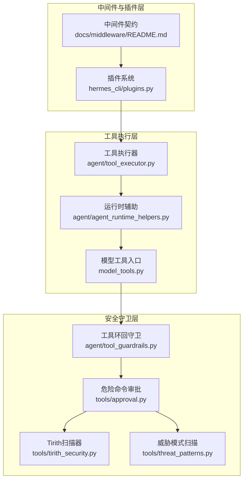
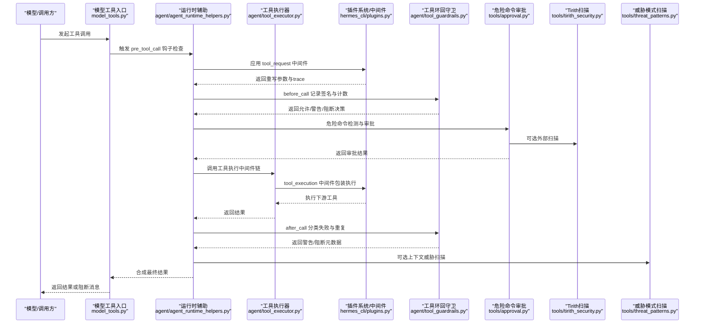
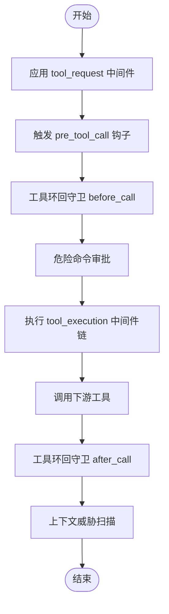
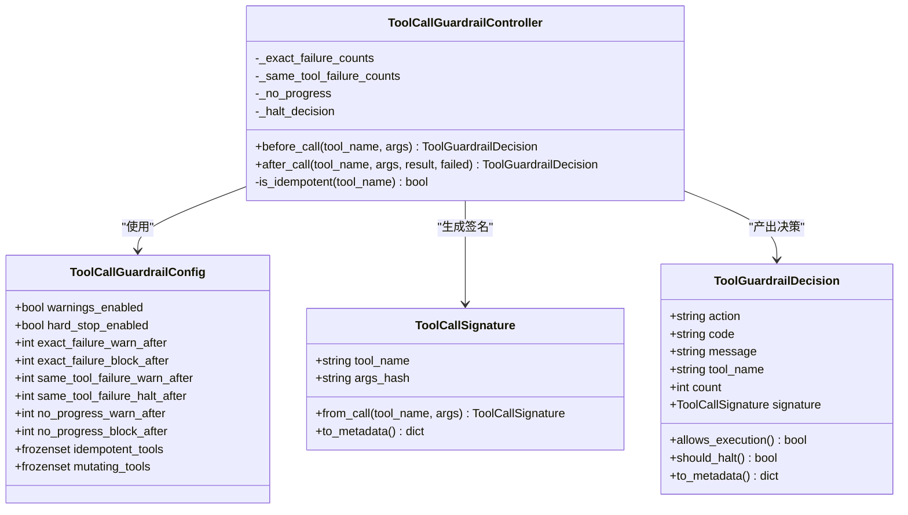
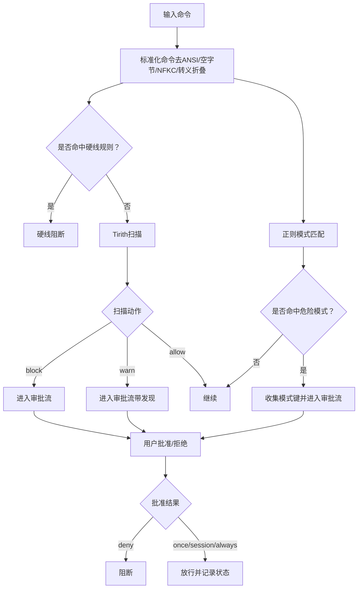
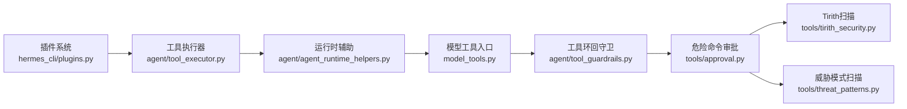

# 安全中间件拦截

<cite>
**本文引用的文件**
- [docs/middleware/README.md](file://docs/middleware/README.md)
- [agent/tool_guardrails.py](file://agent/tool_guardrails.py)
- [tools/approval.py](file://tools/approval.py)
- [tools/tirith_security.py](file://tools/tirith_security.py)
- [tools/threat_patterns.py](file://tools/threat_patterns.py)
- [hermes_cli/plugins.py](file://hermes_cli/plugins.py)
- [agent/tool_executor.py](file://agent/tool_executor.py)
- [agent/agent_runtime_helpers.py](file://agent/agent_runtime_helpers.py)
- [model_tools.py](file://model_tools.py)
- [tests/test_yuanbao_pipeline.py](file://tests/test_yuanbao_pipeline.py)
- [tests/test_model_tools.py](file://tests/test_model_tools.py)
</cite>

## 目录
1. [简介](#简介)
2. [项目结构](#项目结构)
3. [核心组件](#核心组件)
4. [架构总览](#架构总览)
5. [详细组件分析](#详细组件分析)
6. [依赖分析](#依赖分析)
7. [性能考虑](#性能考虑)
8. [故障排查指南](#故障排查指南)
9. [结论](#结论)
10. [附录](#附录)

## 简介
本文件面向“安全中间件拦截系统”的技术文档，聚焦于工具调度过程中的安全检查点与拦截机制，系统性阐述以下主题：
- before_call 与 after_call 钩子在工具调用前后的作用与执行时机
- 工具调用前的完整性检查与调用后的结果验证流程
- 中间件与守卫系统（工具环回守卫、危险命令审批、内容威胁扫描）的协同机制
- 安全违规的检测算法与响应策略
- 自定义安全中间件与拦截规则的开发与配置实践

## 项目结构
围绕安全中间件拦截的关键模块分布如下：
- 中间件契约与执行顺序：docs/middleware/README.md
- 工具调用前/后守卫：agent/tool_guardrails.py
- 危险命令检测与审批流：tools/approval.py
- 外部安全扫描器封装：tools/tirith_security.py
- 上下文威胁模式扫描：tools/threat_patterns.py
- 插件与中间件注册/调用：hermes_cli/plugins.py
- 工具执行链路与中间件集成：agent/tool_executor.py、agent/agent_runtime_helpers.py、model_tools.py
- 行为测试样例：tests/test_yuanbao_pipeline.py、tests/test_model_tools.py

图示来源
- [docs/middleware/README.md:1-261](file://docs/middleware/README.md#L1-L261)
- [hermes_cli/plugins.py:128-170](file://hermes_cli/plugins.py#L128-L170)
- [agent/tool_executor.py:194-233](file://agent/tool_executor.py#L194-L233)
- [agent/agent_runtime_helpers.py:1730-1758](file://agent/agent_runtime_helpers.py#L1730-L1758)
- [model_tools.py:1022-1049](file://model_tools.py#L1022-L1049)
- [agent/tool_guardrails.py:241-375](file://agent/tool_guardrails.py#L241-L375)
- [tools/approval.py:655-667](file://tools/approval.py#L655-L667)
- [tools/tirith_security.py:697-775](file://tools/tirith_security.py#L697-L775)
- [tools/threat_patterns.py:187-224](file://tools/threat_patterns.py#L187-L224)

章节来源
- [docs/middleware/README.md:1-261](file://docs/middleware/README.md#L1-L261)
- [hermes_cli/plugins.py:128-170](file://hermes_cli/plugins.py#L128-L170)

## 核心组件
- 中间件契约与执行顺序
  - 支持 llm_request、tool_request、llm_execution、tool_execution 四类中间件
  - 请求型中间件返回完整替换载荷；执行型中间件通过 next_call 链式调用
  - 执行顺序明确：请求型先于钩子与守卫，执行型包裹下游执行
- 工具环回守卫
  - before_call 记录失败次数与重复结果，after_call 分类失败并给出警告/阻断决策
  - 可配置阈值，支持可变/只读工具集合区分
- 危险命令审批
  - 硬线拦截（不可撤销）、软拦截（警告/审批）
  - 模块化检测（正则模式）、会话态持久化、网关/CLI统一审批接口
- 内容威胁扫描
  - 上下文/严格范围的威胁模式匹配，支持隐藏字符检测
  - 与工具结果/内存写入等路径结合，形成多层防护
- 外部安全扫描器
  - Tirith 子进程扫描，支持自动安装、超时/失败开闭策略、JSON 增强

章节来源
- [docs/middleware/README.md:23-120](file://docs/middleware/README.md#L23-L120)
- [agent/tool_guardrails.py:241-375](file://agent/tool_guardrails.py#L241-L375)
- [tools/approval.py:260-527](file://tools/approval.py#L260-L527)
- [tools/threat_patterns.py:187-224](file://tools/threat_patterns.py#L187-L224)
- [tools/tirith_security.py:697-775](file://tools/tirith_security.py#L697-L775)

## 架构总览
工具调用的安全拦截链路如下：

图示来源
- [model_tools.py:1022-1049](file://model_tools.py#L1022-L1049)
- [agent/agent_runtime_helpers.py:1730-1758](file://agent/agent_runtime_helpers.py#L1730-L1758)
- [agent/tool_executor.py:194-233](file://agent/tool_executor.py#L194-L233)
- [hermes_cli/plugins.py:1679-1713](file://hermes_cli/plugins.py#L1679-L1713)
- [agent/tool_guardrails.py:241-375](file://agent/tool_guardrails.py#L241-L375)
- [tools/approval.py:1334-1434](file://tools/approval.py#L1334-L1434)
- [tools/tirith_security.py:697-775](file://tools/tirith_security.py#L697-L775)
- [tools/threat_patterns.py:187-224](file://tools/threat_patterns.py#L187-L224)

## 详细组件分析

### 中间件与执行顺序
- 中间件类型与职责
  - tool_request：在钩子与守卫之前重写工具参数，影响后续策略评估
  - tool_execution：包裹实际工具执行，可短路或二次处理结果
  - llm_request/llm_execution：对应大模型请求与执行的中间件
- 执行顺序
  - 请求型中间件先于钩子与守卫；执行型中间件包裹下游执行
  - 多个执行型中间件按注册顺序嵌套执行，失败开路（fail-open）

图示来源
- [docs/middleware/README.md:79-112](file://docs/middleware/README.md#L79-L112)
- [agent/tool_executor.py:211-233](file://agent/tool_executor.py#L211-L233)
- [agent/agent_runtime_helpers.py:1730-1758](file://agent/agent_runtime_helpers.py#L1730-L1758)
- [model_tools.py:1022-1049](file://model_tools.py#L1022-L1049)

章节来源
- [docs/middleware/README.md:23-120](file://docs/middleware/README.md#L23-L120)
- [agent/tool_executor.py:194-233](file://agent/tool_executor.py#L194-L233)
- [agent/agent_runtime_helpers.py:1730-1758](file://agent/agent_runtime_helpers.py#L1730-L1758)
- [model_tools.py:1022-1049](file://model_tools.py#L1022-L1049)

### 工具环回守卫（before_call/after_call）
- before_call
  - 基于工具名与规范化参数生成稳定签名
  - 维护精确失败计数、同工具失败计数、只读工具重复结果哈希
  - 当启用硬停止时，超过阈值直接阻断
- after_call
  - 分类失败（含工具特定失败语义）
  - 对只读工具比较结果哈希，检测重复无进展
  - 产生警告/阻断元数据，供上层展示与记录

图示来源
- [agent/tool_guardrails.py:64-124](file://agent/tool_guardrails.py#L64-L124)
- [agent/tool_guardrails.py:128-174](file://agent/tool_guardrails.py#L128-L174)
- [agent/tool_guardrails.py:224-381](file://agent/tool_guardrails.py#L224-L381)

章节来源
- [agent/tool_guardrails.py:241-375](file://agent/tool_guardrails.py#L241-L375)

### 危险命令审批与拦截
- 硬线拦截（不可撤销）
  - 针对破坏性极高的命令（如根目录递归删除、格式化磁盘、系统关机等）
  - 不受 yolo、会话级放行、定时任务模式影响
- 软拦截（警告/审批）
  - 基于正则模式检测潜在危险命令
  - 与 Tirith 扫描结果合并，形成统一审批提示
  - 支持会话级批准、一次性批准、永久允许列表
- 网关/CLI 审批接口
  - 提供通知回调、队列管理、批量批准等能力
  - 支持 cron 会话的特殊审批模式

图示来源
- [tools/approval.py:260-527](file://tools/approval.py#L260-L527)
- [tools/approval.py:655-667](file://tools/approval.py#L655-L667)
- [tools/tirith_security.py:697-775](file://tools/tirith_security.py#L697-L775)

章节来源
- [tools/approval.py:1334-1434](file://tools/approval.py#L1334-L1434)
- [tools/tirith_security.py:697-775](file://tools/tirith_security.py#L697-L775)

### 内容威胁扫描（上下文/严格范围）
- 模式覆盖
  - 经典注入/窃取、角色扮演/身份劫持、C2/脑虫风格提示工程、环境变量清理、已知框架名称、凭据泄露、持久化后门、隐藏字符等
- 范围策略
  - all：最小化误报，适用于任意文本
  - context：适用于上下文文件/内存/工具结果
  - strict：适用于用户可控写入（内存/技能安装），更宽松但需人工干预
- 首次威胁消息
  - 提供人类可读错误字符串，便于阻断提示

章节来源
- [tools/threat_patterns.py:187-224](file://tools/threat_patterns.py#L187-L224)

### 中间件与守卫协作
- 中间件在钩子与守卫之前生效，可改变后续策略评估对象（如路径、命令、URL）
- 钩子负责阻断指令（如 pre_tool_call），守卫负责循环/无进展检测
- 审批与扫描作为补充，覆盖更广的攻击面

章节来源
- [docs/middleware/README.md:109-112](file://docs/middleware/README.md#L109-L112)
- [model_tools.py:1022-1049](file://model_tools.py#L1022-L1049)
- [agent/tool_guardrails.py:241-375](file://agent/tool_guardrails.py#L241-L375)

### 自定义安全中间件与拦截规则开发指南
- 注册中间件
  - 在插件 register(ctx) 中注册 tool_request 或 tool_execution
  - 请求型中间件返回完整替换载荷；执行型中间件通过 next_call 包裹执行
- before_call/after_call 使用建议
  - 在 before_call 中进行参数规范化与签名计算
  - 在 after_call 中分类失败与重复，输出决策元数据
- 审批与扫描集成
  - 将中间件结果纳入审批键集合，避免绕过
  - 在执行型中间件中整合外部扫描结果，统一 fail-open/fail-closed 策略
- 配置与调试
  - 通过插件系统启用/禁用中间件
  - 使用 HERMES_PLUGINS_DEBUG 观察加载与回调行为
  - 使用测试用例验证拦截逻辑（参考测试文件）

章节来源
- [docs/middleware/README.md:25-78](file://docs/middleware/README.md#L25-L78)
- [hermes_cli/plugins.py:128-170](file://hermes_cli/plugins.py#L128-L170)
- [tests/test_model_tools.py:150-163](file://tests/test_model_tools.py#L150-L163)

## 依赖分析
- 中间件与插件系统
  - 插件系统提供中间件注册与调用接口，中间件按序嵌套执行
- 工具执行链路
  - 运行时辅助在 pre_tool_call 阶段检查阻断指令
  - 工具执行器应用 tool_request 中间件，再进入执行型中间件链
- 守卫与审批
  - 环回守卫与审批模块相互独立又协同：前者基于工具行为，后者基于命令/内容策略

图示来源
- [hermes_cli/plugins.py:1679-1713](file://hermes_cli/plugins.py#L1679-L1713)
- [agent/tool_executor.py:194-233](file://agent/tool_executor.py#L194-L233)
- [agent/agent_runtime_helpers.py:1730-1758](file://agent/agent_runtime_helpers.py#L1730-L1758)
- [model_tools.py:1022-1049](file://model_tools.py#L1022-L1049)
- [agent/tool_guardrails.py:241-375](file://agent/tool_guardrails.py#L241-L375)
- [tools/approval.py:1334-1434](file://tools/approval.py#L1334-L1434)
- [tools/tirith_security.py:697-775](file://tools/tirith_security.py#L697-L775)
- [tools/threat_patterns.py:187-224](file://tools/threat_patterns.py#L187-L224)

章节来源
- [hermes_cli/plugins.py:128-170](file://hermes_cli/plugins.py#L128-L170)
- [agent/tool_executor.py:194-233](file://agent/tool_executor.py#L194-L233)
- [agent/agent_runtime_helpers.py:1730-1758](file://agent/agent_runtime_helpers.py#L1730-L1758)
- [model_tools.py:1022-1049](file://model_tools.py#L1022-L1049)

## 性能考虑
- 中间件应保持确定性，避免动态外部系统导致抖动
- 请求型中间件返回完整载荷，减少后续补丁成本
- 执行型中间件仅在必要时短路，确保下游结果不被重复执行
- 审批与扫描采用 fail-open 策略以降低可用性风险，同时提供 fail-closed 选项用于严格场景

## 故障排查指南
- 中间件未生效
  - 检查插件启用状态与注册回调
  - 关注中间件失败开路行为，确认日志中无异常
- 审批卡住
  - 确认网关通知回调已注册且事件队列存在
  - 使用 /approve 或 /approve all 解决挂起
- 扫描器不可用
  - 检查平台支持与自动安装状态
  - 查看 fail_open/fail_closed 配置与日志警告

章节来源
- [docs/middleware/README.md:239-261](file://docs/middleware/README.md#L239-L261)
- [tools/approval.py:687-760](file://tools/approval.py#L687-L760)
- [tools/tirith_security.py:697-775](file://tools/tirith_security.py#L697-L775)

## 结论
安全中间件拦截系统通过“中间件—钩子—守卫—审批—扫描”的多层协作，在工具调用前后实现了从参数重写、行为限制到内容威胁检测的全面防护。其关键特性包括：
- 明确的执行顺序与失败开路策略
- 可配置的工具环回守卫与审批阈值
- 外部扫描与内部威胁模式的互补
- 可扩展的中间件与拦截规则开发路径

## 附录
- 测试参考
  - 中间件拦截行为验证：tests/test_yuanbao_pipeline.py
  - 中间件参数重写与执行链包裹：tests/test_model_tools.py

章节来源
- [tests/test_yuanbao_pipeline.py:492-547](file://tests/test_yuanbao_pipeline.py#L492-L547)
- [tests/test_model_tools.py:150-163](file://tests/test_model_tools.py#L150-L163)