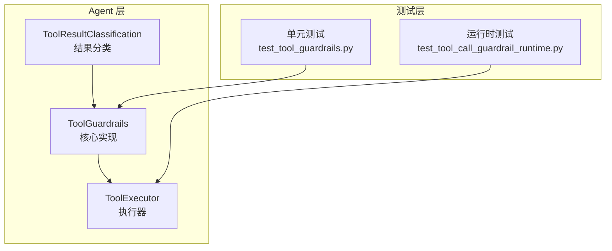
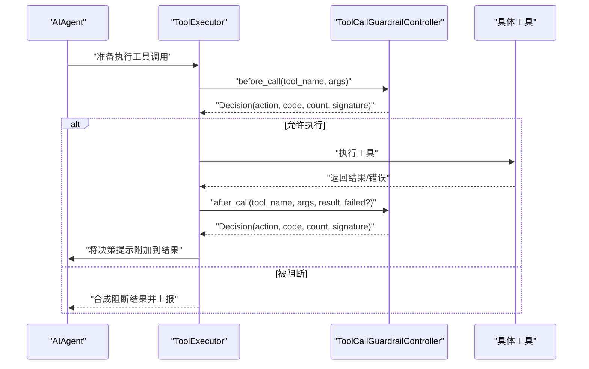
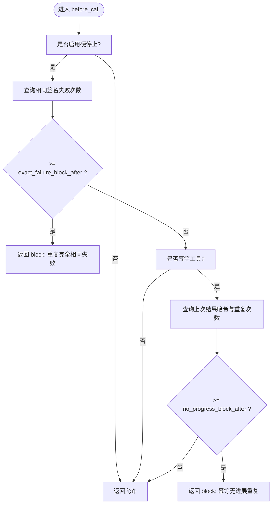
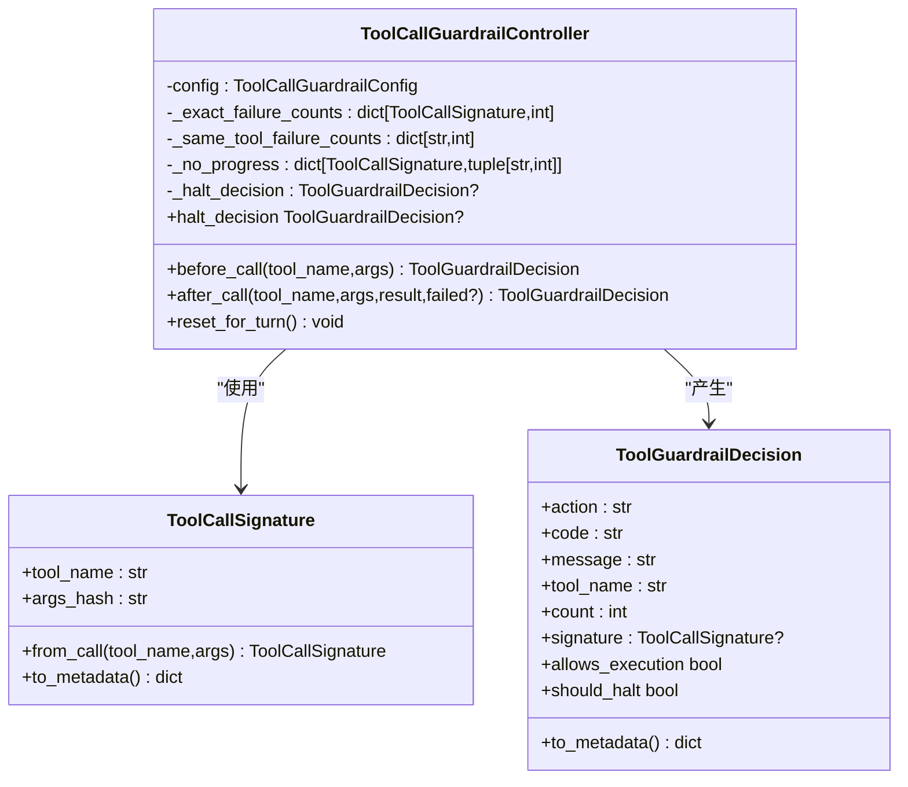
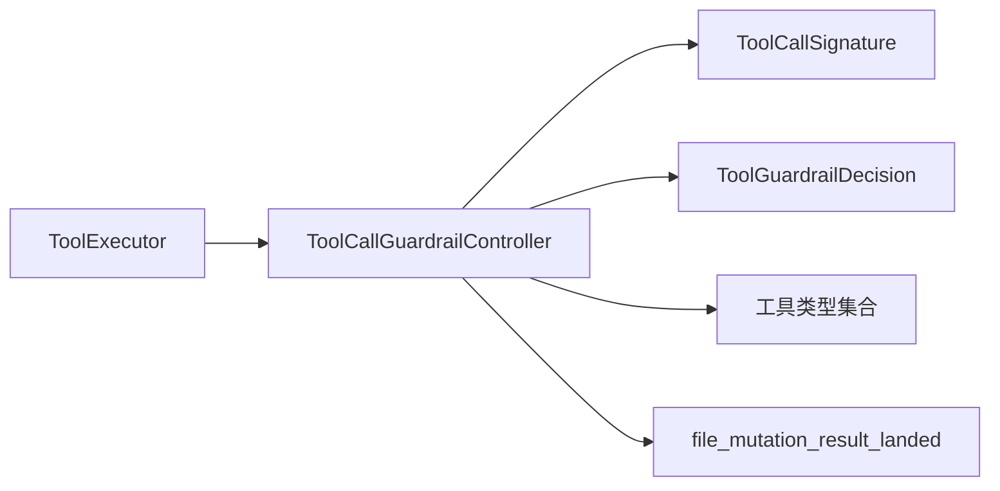

# 工具守卫核心机制

<cite>
**本文引用的文件列表**
- [tool_guardrails.py](file://agent/tool_guardrails.py)
- [test_tool_guardrails.py](file://tests/agent/test_tool_guardrails.py)
- [test_tool_call_guardrail_runtime.py](file://tests/run_agent/test_tool_call_guardrail_runtime.py)
- [tool_executor.py](file://agent/tool_executor.py)
- [tool_result_classification.py](file://agent/tool_result_classification.py)
</cite>

## 目录
1. [简介](#简介)
2. [项目结构](#项目结构)
3. [核心组件](#核心组件)
4. [架构总览](#架构总览)
5. [详细组件分析](#详细组件分析)
6. [依赖关系分析](#依赖关系分析)
7. [性能考量](#性能考量)
8. [故障排查指南](#故障排查指南)
9. [结论](#结论)
10. [附录：配置与自定义指南](#附录配置与自定义指南)

## 简介
本文件系统化阐述工具守卫（Tool Call Guardrails）的核心机制，重点围绕以下目标：
- 深入解析 ToolCallGuardrailController 的设计原理与实现策略
- 详述工具调用循环检测算法，包括失败次数统计与重复调用识别机制
- 解释 ToolGuardrailConfig 配置系统的参数与阈值控制
- 阐明 ToolCallSignature 签名机制如何确保工具调用的唯一性与可追踪性
- 描述 ToolGuardrailDecision 决策系统的动作分类与状态管理
- 提供关键算法与决策逻辑的代码路径示例
- 给出配置优化与自定义守卫规则的开发指导

## 项目结构
工具守卫相关代码集中在 agent 子模块中，并通过测试用例覆盖了纯逻辑与运行时行为：
- 核心实现：agent/tool_guardrails.py
- 运行时集成：agent/tool_executor.py
- 结果分类辅助：agent/tool_result_classification.py
- 单元测试：tests/agent/test_tool_guardrails.py
- 运行时集成测试：tests/run_agent/test_tool_call_guardrail_runtime.py

图表来源
- [tool_guardrails.py:1-476](file://agent/tool_guardrails.py#L1-L476)
- [tool_executor.py:360-559](file://agent/tool_executor.py#L360-L559)
- [tool_result_classification.py:1-27](file://agent/tool_result_classification.py#L1-L27)
- [test_tool_guardrails.py:1-259](file://tests/agent/test_tool_guardrails.py#L1-L259)
- [test_tool_call_guardrail_runtime.py:1-356](file://tests/run_agent/test_tool_call_guardrail_runtime.py#L1-L356)

章节来源
- [tool_guardrails.py:1-476](file://agent/tool_guardrails.py#L1-L476)
- [tool_executor.py:360-559](file://agent/tool_executor.py#L360-L559)
- [tool_result_classification.py:1-27](file://agent/tool_result_classification.py#L1-L27)
- [test_tool_guardrails.py:1-259](file://tests/agent/test_tool_guardrails.py#L1-L259)
- [test_tool_call_guardrail_runtime.py:1-356](file://tests/run_agent/test_tool_call_guardrail_runtime.py#L1-L356)

## 核心组件
- ToolCallGuardrailConfig：配置阈值与开关，支持软警告与硬停止两种模式
- ToolCallSignature：基于工具名与规范化参数的稳定哈希签名，用于唯一标识一次调用
- ToolGuardrailDecision：守卫决策的数据载体，包含动作、代码、消息、计数与签名等
- ToolCallGuardrailController：控制器，负责在 before_call/after_call 阶段进行循环检测与决策生成
- 辅助函数：canonical_tool_args、classify_tool_failure、_result_hash 等

章节来源
- [tool_guardrails.py:63-125](file://agent/tool_guardrails.py#L63-L125)
- [tool_guardrails.py:127-174](file://agent/tool_guardrails.py#L127-L174)
- [tool_guardrails.py:176-222](file://agent/tool_guardrails.py#L176-L222)
- [tool_guardrails.py:224-381](file://agent/tool_guardrails.py#L224-L381)
- [tool_guardrails.py:383-476](file://agent/tool_guardrails.py#L383-L476)

## 架构总览
工具守卫在“调用前检查 + 调用后记录”的双阶段工作流中运行，与执行器协作，将决策转化为警告或阻断，并在运行时将提示信息注入到工具结果中。

图表来源
- [tool_executor.py:375-390](file://agent/tool_executor.py#L375-L390)
- [tool_guardrails.py:241-283](file://agent/tool_guardrails.py#L241-L283)
- [tool_guardrails.py:285-375](file://agent/tool_guardrails.py#L285-L375)

## 详细组件分析

### ToolCallGuardrailController 设计与实现
- 初始化与重置
  - 使用配置初始化，每轮对话重置内部状态（失败计数、进度计数、阻断决策）
- before_call 策略
  - 若未启用硬停止，直接允许
  - 否则检查“完全相同的失败调用”阈值；若达到阈值，返回 block 决策并缓存 halt_decision
  - 对幂等工具进一步检查“无进展重复调用”阈值；若达到阈值，返回 block 决策并缓存 halt_decision
- after_call 策略
  - 失败分支：更新“相同签名失败计数”和“同工具失败计数”，必要时触发 halt；根据阈值返回 warn 或 allow
  - 成功分支：清空对应计数；对非幂等工具清理无进展记录；对幂等工具计算结果哈希并累加重复次数，按阈值返回 warn 或 allow
- 工具类型判定
  - 通过内置集合判断是否为幂等/易变工具，决定是否参与“无进展重复”检测

图表来源
- [tool_guardrails.py:241-283](file://agent/tool_guardrails.py#L241-L283)

章节来源
- [tool_guardrails.py:224-381](file://agent/tool_guardrails.py#L224-L381)

### 循环检测算法详解
- 失败次数统计
  - 相同签名失败计数：以 ToolCallSignature 为键，记录完全相同的工具+参数组合连续失败次数
  - 同工具失败计数：以工具名为键，记录同一工具连续失败次数
- 重复调用识别
  - ToolCallSignature 基于规范化参数 JSON 的 SHA-256 哈希，保证参数顺序无关、Unicode 安全、不暴露原始参数
  - 幂等工具的“无进展重复”检测：比较结果哈希，若一致则重复计数递增
- 阈值控制
  - exact_failure_warn_after / block_after 控制“完全相同失败”的警告与阻断
  - same_tool_failure_warn_after / halt_after 控制“同工具失败”的警告与停机
  - no_progress_warn_after / block_after 控制“幂等无进展重复”的警告与阻断

图表来源
- [tool_guardrails.py:224-381](file://agent/tool_guardrails.py#L224-L381)
- [tool_guardrails.py:127-174](file://agent/tool_guardrails.py#L127-L174)

章节来源
- [tool_guardrails.py:127-174](file://agent/tool_guardrails.py#L127-L174)
- [tool_guardrails.py:224-381](file://agent/tool_guardrails.py#L224-L381)

### ToolGuardrailConfig 配置系统
- 默认行为
  - warnings_enabled: True（软警告）
  - hard_stop_enabled: False（硬停止需显式开启）
- 阈值字段
  - exact_failure_warn_after / block_after
  - same_tool_failure_warn_after / halt_after
  - no_progress_warn_after / block_after
- 配置来源
  - 支持从映射构建，嵌套结构支持 warn_after/hard_stop_after 键
  - 类型与边界处理：布尔值、正整数、字符串“on/off/true/false”等

章节来源
- [tool_guardrails.py:63-125](file://agent/tool_guardrails.py#L63-L125)

### ToolCallSignature 签名机制
- 规范化参数
  - canonical_tool_args 将参数映射排序、紧凑序列化，避免顺序差异导致不同签名
- 哈希生成
  - 使用 SHA-256 对规范化 JSON 进行哈希，得到固定长度摘要
- 元数据导出
  - to_metadata 返回不含原始参数的公开信息，保护敏感数据

章节来源
- [tool_guardrails.py:127-142](file://agent/tool_guardrails.py#L127-L142)
- [tool_guardrails.py:176-186](file://agent/tool_guardrails.py#L176-L186)
- [tool_guardrails.py:474-476](file://agent/tool_guardrails.py#L474-L476)

### ToolGuardrailDecision 决策系统
- 动作分类
  - allow：允许继续
  - warn：发出警告但允许继续
  - block：阻断当前调用
  - halt：停机（同一轮内不再尝试该工具）
- 状态管理
  - 记录工具名、计数、签名
  - provides helpers allows_execution / should_halt
  - to_metadata 输出可序列化结构，便于日志与 UI 展示

章节来源
- [tool_guardrails.py:144-174](file://agent/tool_guardrails.py#L144-L174)

### 运行时集成与测试验证
- 执行器集成
  - 在工具执行前调用 before_call，若被阻断则合成阻断结果并上报
  - 在工具执行后调用 after_call，将决策提示附加到结果中
- 测试覆盖
  - 单元测试验证默认配置、阈值解析、警告与阻断行为、幂等无进展检测、重置逻辑
  - 运行时测试验证并发/顺序路径、插件前置阻断优先级、会话级停机与最终响应

章节来源
- [tool_executor.py:360-559](file://agent/tool_executor.py#L360-L559)
- [test_tool_guardrails.py:1-259](file://tests/agent/test_tool_guardrails.py#L1-L259)
- [test_tool_call_guardrail_runtime.py:1-356](file://tests/run_agent/test_tool_call_guardrail_runtime.py#L1-L356)

## 依赖关系分析
- 内部依赖
  - ToolCallGuardrailController 依赖 ToolCallSignature、ToolGuardrailDecision、工具类型集合、结果分类辅助
  - 执行器依赖守卫控制器进行决策，并在阻断时合成结果
- 外部依赖
  - 工具结果分类：file_mutation_result_landed 用于区分“写入落地”与“语法/诊断错误”
  - 工具类型集合：IDEMPOTENT_TOOL_NAMES、MUTATING_TOOL_NAMES

图表来源
- [tool_guardrails.py:20-60](file://agent/tool_guardrails.py#L20-L60)
- [tool_guardrails.py:176-222](file://agent/tool_guardrails.py#L176-L222)
- [tool_guardrails.py:224-381](file://agent/tool_guardrails.py#L224-L381)
- [tool_executor.py:360-559](file://agent/tool_executor.py#L360-L559)

章节来源
- [tool_guardrails.py:20-60](file://agent/tool_guardrails.py#L20-L60)
- [tool_result_classification.py:1-27](file://agent/tool_result_classification.py#L1-L27)
- [tool_guardrails.py:176-222](file://agent/tool_guardrails.py#L176-L222)
- [tool_guardrails.py:224-381](file://agent/tool_guardrails.py#L224-L381)
- [tool_executor.py:360-559](file://agent/tool_executor.py#L360-L559)

## 性能考量
- 时间复杂度
  - before_call/after_call 主要操作为字典查找与哈希计算，均为 O(1)
  - 规范化参数与哈希生成为 O(n)，n 为参数大小
- 空间复杂度
  - 状态表（签名失败计数、同工具失败计数、无进展记录）随轮次调用增长，但受阈值限制
- 优化建议
  - 参数规模较大时，尽量减少不必要的重复调用
  - 合理设置阈值，避免过早阻断导致交互体验下降
  - 对幂等工具的无进展检测仅在必要时启用

## 故障排查指南
- 常见问题
  - 误报阻断：检查 hard_stop_enabled 是否开启，以及阈值设置是否过严
  - 未触发警告：确认 warnings_enabled 为 True，且阈值尚未达到
  - 幂等工具仍被阻断：确认 no_progress_block_after 设置，以及结果哈希是否一致
- 排查步骤
  - 查看 ToolGuardrailDecision 的 action/code/count/signature
  - 检查 before_call/after_call 的调用顺序与结果
  - 在运行时测试中定位阻断发生的具体轮次与工具

章节来源
- [tool_guardrails.py:144-174](file://agent/tool_guardrails.py#L144-L174)
- [tool_guardrails.py:241-375](file://agent/tool_guardrails.py#L241-L375)
- [test_tool_call_guardrail_runtime.py:1-356](file://tests/run_agent/test_tool_call_guardrail_runtime.py#L1-L356)

## 结论
工具守卫通过“调用前检查 + 调用后记录”的双阶段机制，结合签名唯一性与阈值控制，有效防止工具调用陷入循环。其设计强调可配置性与可追踪性，既可作为温和的警告引导，也可在明确需求下启用硬停止以保障会话稳定性。配合执行器的集成与测试覆盖，整体方案具备良好的工程实践价值。

## 附录：配置与自定义指南

### 配置项说明与推荐
- warnings_enabled：默认 True，建议在调试阶段开启，生产环境可按需关闭
- hard_stop_enabled：默认 False，建议在 CLI/TUI 中显式开启以获得更强的保护
- 阈值建议
  - exact_failure_warn_after/block_after：默认 2/5，适合快速发现重复失败
  - same_tool_failure_warn_after/halt_after：默认 3/8，平衡容忍度与保护强度
  - no_progress_warn_after/block_after：默认 2/5，针对幂等工具的无进展重复

章节来源
- [tool_guardrails.py:63-125](file://agent/tool_guardrails.py#L63-L125)

### 自定义工具类型
- 幂等工具集合：新增工具名至 IDEMPOTENT_TOOL_NAMES，使其参与“无进展重复”检测
- 易变工具集合：新增工具名至 MUTATING_TOOL_NAMES，避免被误判为幂等

章节来源
- [tool_guardrails.py:20-60](file://agent/tool_guardrails.py#L20-L60)

### 自定义签名与结果哈希
- 若需扩展签名维度，可在 ToolCallSignature.from_call 中加入额外上下文
- 若需调整结果哈希策略，可在 _result_hash 中修改规范化流程

章节来源
- [tool_guardrails.py:134-141](file://agent/tool_guardrails.py#L134-L141)
- [tool_guardrails.py:430-445](file://agent/tool_guardrails.py#L430-L445)

### 代码示例路径（不含具体代码内容）
- ToolCallGuardrailController.before_call 实现路径
  - [tool_guardrails.py:241-283](file://agent/tool_guardrails.py#L241-L283)
- ToolCallGuardrailController.after_call 实现路径
  - [tool_guardrails.py:285-375](file://agent/tool_guardrails.py#L285-L375)
- ToolCallSignature.from_call 实现路径
  - [tool_guardrails.py:134-137](file://agent/tool_guardrails.py#L134-L137)
- ToolGuardrailDecision.to_metadata 实现路径
  - [tool_guardrails.py:163-173](file://agent/tool_guardrails.py#L163-L173)
- 执行器集成调用路径
  - [tool_executor.py:375-390](file://agent/tool_executor.py#L375-L390)
  - [tool_executor.py:664-669](file://agent/tool_executor.py#L664-L669)