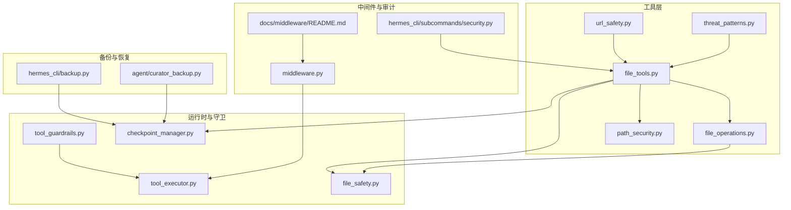
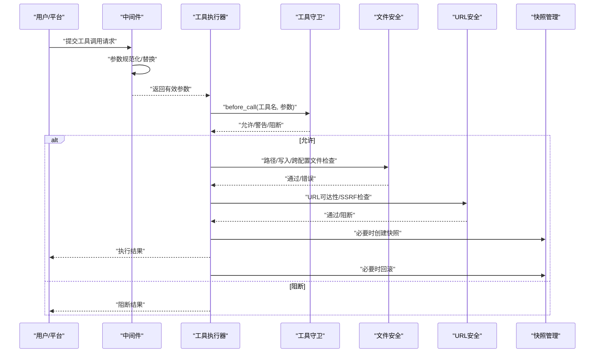
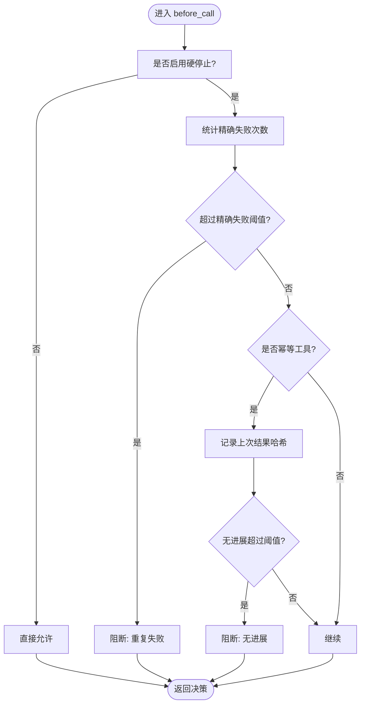
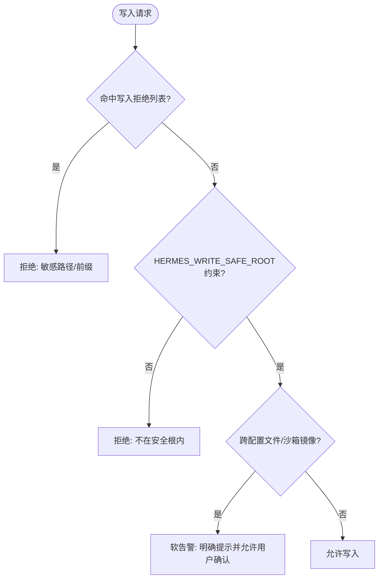
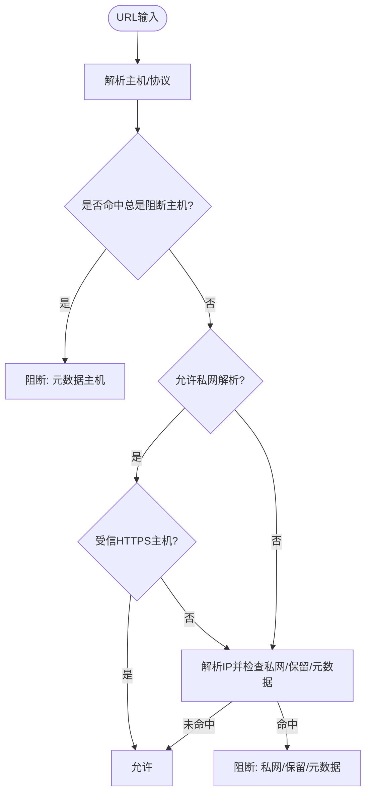
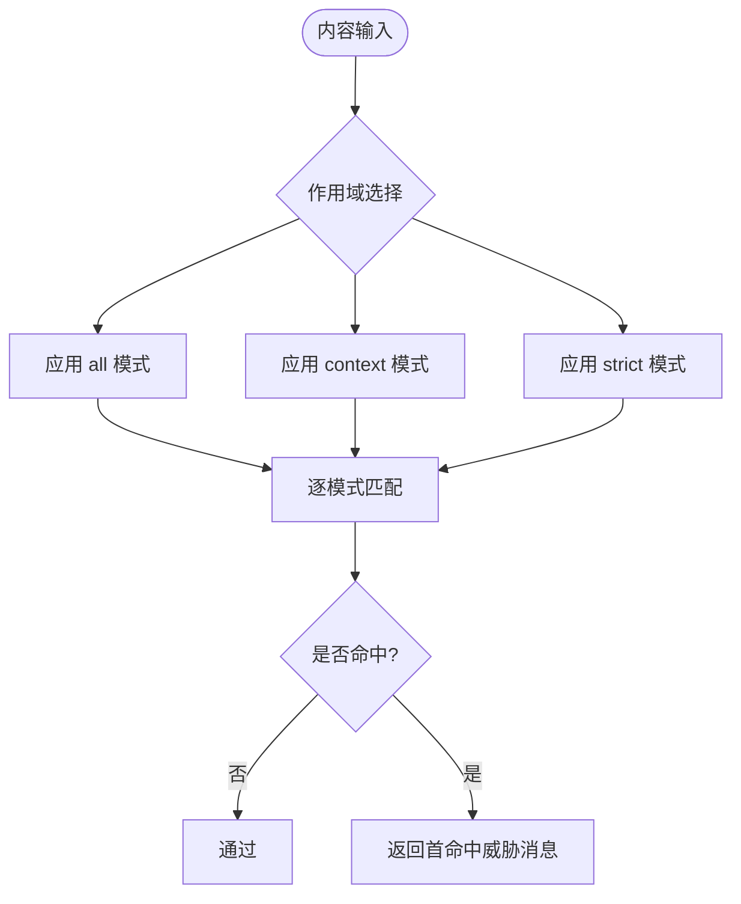
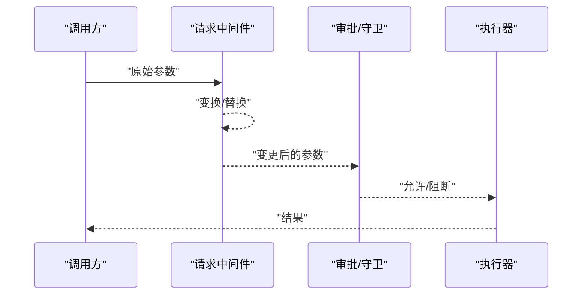
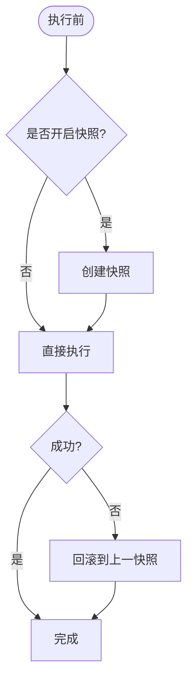
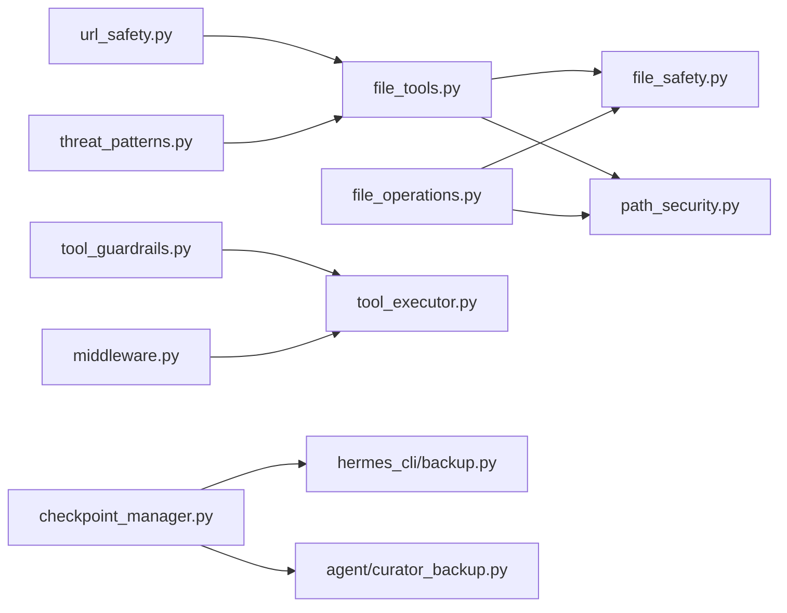

# 工具安全防护

<cite>
**本文引用的文件**
- [agent/tool_guardrails.py](file://agent/tool_guardrails.py)
- [agent/tool_executor.py](file://agent/tool_executor.py)
- [tools/file_tools.py](file://tools/file_tools.py)
- [tools/file_operations.py](file://tools/file_operations.py)
- [agent/file_safety.py](file://agent/file_safety.py)
- [tools/path_security.py](file://tools/path_security.py)
- [tools/url_safety.py](file://tools/url_safety.py)
- [tools/threat_patterns.py](file://tools/threat_patterns.py)
- [tools/checkpoint_manager.py](file://tools/checkpoint_manager.py)
- [hermes_cli/middleware.py](file://hermes_cli/middleware.py)
- [hermes_cli/subcommands/security.py](file://hermes_cli/subcommands/security.py)
- [docs/middleware/README.md](file://docs/middleware/README.md)
- [tests/tools/test_file_write_safety.py](file://tests/tools/test_file_write_safety.py)
- [tests/tools/test_file_operations.py](file://tests/tools/test_file_operations.py)
- [tests/agent/test_curator_backup.py](file://tests/agent/test_curator_backup.py)
- [hermes_cli/backup.py](file://hermes_cli/backup.py)
</cite>

## 目录
1. [简介](#简介)
2. [项目结构](#项目结构)
3. [核心组件](#核心组件)
4. [架构总览](#架构总览)
5. [详细组件分析](#详细组件分析)
6. [依赖分析](#依赖分析)
7. [性能考量](#性能考量)
8. [故障排查指南](#故障排查指南)
9. [结论](#结论)
10. [附录：安全配置与自定义规则](#附录安全配置与自定义规则)

## 简介
本文件面向“工具安全防护系统”的设计与实现，聚焦以下目标：
- 工具守卫机制的设计原理与实现策略
- 破坏性命令的识别与拦截（文件操作、系统命令）
- 工具调用的作用域控制与权限验证流程
- 中间件拦截与插件阻塞的实现机制
- 工具执行前的完整性检查与备份策略
- 安全违规的检测与响应机制
- 安全配置与自定义安全规则的开发指导
- 常见安全威胁的防护策略与最佳实践

## 项目结构
围绕工具安全防护的关键模块分布如下：
- 工具调用与守卫：agent/tool_guardrails.py、agent/tool_executor.py
- 文件与路径安全：tools/file_tools.py、tools/file_operations.py、agent/file_safety.py、tools/path_security.py
- URL与网络安全：tools/url_safety.py
- 上下文与提示词威胁扫描：tools/threat_patterns.py
- 执行前完整性与回滚：tools/checkpoint_manager.py
- 中间件与请求链路：hermes_cli/middleware.py、docs/middleware/README.md
- 安全审计子命令：hermes_cli/subcommands/security.py
- 备份与恢复：hermes_cli/backup.py、agent/curator_backup.py

图示来源
- [tools/file_tools.py:1-800](file://tools/file_tools.py#L1-800)
- [tools/file_operations.py:1240-1270](file://tools/file_operations.py#L1240-L1270)
- [agent/file_safety.py:1-624](file://agent/file_safety.py#L1-L624)
- [tools/path_security.py:1-44](file://tools/path_security.py#L1-L44)
- [tools/url_safety.py:1-403](file://tools/url_safety.py#L1-L403)
- [tools/threat_patterns.py:1-253](file://tools/threat_patterns.py#L1-L253)
- [agent/tool_guardrails.py:1-476](file://agent/tool_guardrails.py#L1-L476)
- [agent/tool_executor.py:368-393](file://agent/tool_executor.py#L368-L393)
- [hermes_cli/middleware.py:113-158](file://hermes_cli/middleware.py#L113-L158)
- [docs/middleware/README.md:239-261](file://docs/middleware/README.md#L239-L261)
- [tools/checkpoint_manager.py:1-200](file://tools/checkpoint_manager.py#L1-L200)
- [hermes_cli/subcommands/security.py:1-63](file://hermes_cli/subcommands/security.py#L1-L63)
- [hermes_cli/backup.py:222-887](file://hermes_cli/backup.py#L222-L887)
- [agent/curator_backup.py:291-324](file://agent/curator_backup.py#L291-L324)

章节来源
- [tools/file_tools.py:1-800](file://tools/file_tools.py#L1-800)
- [agent/file_safety.py:1-624](file://agent/file_safety.py#L1-L624)
- [tools/url_safety.py:1-403](file://tools/url_safety.py#L1-L403)
- [tools/threat_patterns.py:1-253](file://tools/threat_patterns.py#L1-L253)
- [agent/tool_guardrails.py:1-476](file://agent/tool_guardrails.py#L1-L476)
- [agent/tool_executor.py:368-393](file://agent/tool_executor.py#L368-L393)
- [hermes_cli/middleware.py:113-158](file://hermes_cli/middleware.py#L113-L158)
- [docs/middleware/README.md:239-261](file://docs/middleware/README.md#L239-L261)
- [tools/checkpoint_manager.py:1-200](file://tools/checkpoint_manager.py#L1-L200)
- [hermes_cli/subcommands/security.py:1-63](file://hermes_cli/subcommands/security.py#L1-L63)
- [hermes_cli/backup.py:222-887](file://hermes_cli/backup.py#L222-L887)
- [agent/curator_backup.py:291-324](file://agent/curator_backup.py#L291-L324)

## 核心组件
- 工具调用守卫与循环检测：基于工具名与参数签名的重复失败/无进展检测，支持警告与硬停止策略。
- 文件与路径安全：写入拒绝列表、敏感路径保护、跨配置文件/沙箱镜像写入软告警、HERMES_WRITE_SAFE_ROOT 沙箱根。
- URL与网络安全：SSRF防护（私有地址、元数据端点），可选允许私网解析与受信HTTPS主机豁免。
- 提示词与上下文威胁扫描：统一的威胁模式库，按作用域（all/context/strict）进行匹配与首命中阻断。
- 中间件拦截与插件阻塞：请求级中间件可替换参数；执行级中间件必须严格调用下游一次或短路；工具请求在审批前执行。
- 执行前完整性与回滚：透明快照与自动维护，支持按会话回合触发的自动快照与回滚。
- 安全审计：对虚拟环境、插件与MCP服务器进行供应链漏洞扫描。

章节来源
- [agent/tool_guardrails.py:224-381](file://agent/tool_guardrails.py#L224-L381)
- [tools/file_tools.py:352-381](file://tools/file_tools.py#L352-L381)
- [agent/file_safety.py:91-131](file://agent/file_safety.py#L91-L131)
- [tools/url_safety.py:314-393](file://tools/url_safety.py#L314-L393)
- [tools/threat_patterns.py:187-245](file://tools/threat_patterns.py#L187-L245)
- [hermes_cli/middleware.py:120-158](file://hermes_cli/middleware.py#L120-L158)
- [tools/checkpoint_manager.py:1-200](file://tools/checkpoint_manager.py#L1-L200)
- [hermes_cli/subcommands/security.py:12-62](file://hermes_cli/subcommands/security.py#L12-L62)

## 架构总览
工具安全防护贯穿“请求进入—中间件—守卫—执行—后置处理”全链路，关键节点如下：
- 请求进入：apply_tool_request_middleware 对工具参数进行标准化与可选替换。
- 审批前置：工具请求在审批与守卫之前生效，确保后续审批与守卫针对变更后的参数。
- 守卫决策：工具调用循环检测与阻断；文件/路径/URL/威胁扫描等前置检查。
- 执行与回滚：执行前根据配置触发快照；失败或违规时可回滚到上一快照。
- 审计与可观测：中间件安全注意事项与审计子命令。

图示来源
- [hermes_cli/middleware.py:120-158](file://hermes_cli/middleware.py#L120-L158)
- [agent/tool_guardrails.py:241-283](file://agent/tool_guardrails.py#L241-L283)
- [tools/file_tools.py:352-381](file://tools/file_tools.py#L352-L381)
- [tools/url_safety.py:314-393](file://tools/url_safety.py#L314-L393)
- [tools/checkpoint_manager.py:1-200](file://tools/checkpoint_manager.py#L1-L200)
- [agent/tool_executor.py:368-393](file://agent/tool_executor.py#L368-L393)

## 详细组件分析

### 工具调用守卫与循环检测
- 工具签名：以工具名与规范化参数生成稳定哈希，用于精确失败与无进展检测。
- 循环检测维度：
  - 精确失败：相同工具+参数连续失败阈值
  - 同一工具失败：同一工具连续失败阈值
  - 无进展：对幂等工具（只读）检测重复返回
- 行为：允许/警告/阻断/停机，支持可配置阈值与硬停止开关。

图示来源
- [agent/tool_guardrails.py:224-381](file://agent/tool_guardrails.py#L224-L381)

章节来源
- [agent/tool_guardrails.py:63-174](file://agent/tool_guardrails.py#L63-L174)
- [agent/tool_guardrails.py:224-381](file://agent/tool_guardrails.py#L224-L381)

### 文件与路径安全
- 写入拒绝：静态敏感路径/前缀、HERMES_WRITE_SAFE_ROOT 沙箱限制、Hermes内部目录（如mcp-tokens、pairing）。
- 路径校验：相对路径解析与“..”遍历检测，避免逃逸工作区。
- 敏感路径保护：/etc、/boot、/usr/lib/systemd、/private/etc、/private/var 等前缀；特定套接字路径。
- 跨配置文件/沙箱镜像软告警：跨profile写入、容器内沙箱镜像写入，提示用户显式确认。

图示来源
- [agent/file_safety.py:91-131](file://agent/file_safety.py#L91-L131)
- [tools/path_security.py:15-44](file://tools/path_security.py#L15-L44)
- [tools/file_tools.py:352-381](file://tools/file_tools.py#L352-L381)
- [agent/file_safety.py:410-436](file://agent/file_safety.py#L410-L436)
- [agent/file_safety.py:517-546](file://agent/file_safety.py#L517-L546)

章节来源
- [agent/file_safety.py:28-131](file://agent/file_safety.py#L28-L131)
- [tools/path_security.py:15-44](file://tools/path_security.py#L15-L44)
- [tools/file_tools.py:352-381](file://tools/file_tools.py#L352-L381)
- [agent/file_safety.py:410-546](file://agent/file_safety.py#L410-L546)

### URL与网络安全（SSRF防护）
- 规则集：阻止云元数据主机与地址段、私网/环回/未指定/多播/保留地址、CGNAT范围。
- 受信豁免：仅HTTPS且白名单主机可绕过私网解析。
- 强制阻断：metadata.google.internal、169.254.169.254 等永远阻断。
- 异步DNS：提供异步版本以避免事件循环阻塞。

图示来源
- [tools/url_safety.py:314-393](file://tools/url_safety.py#L314-L393)
- [tools/url_safety.py:213-306](file://tools/url_safety.py#L213-L306)

章节来源
- [tools/url_safety.py:1-403](file://tools/url_safety.py#L1-L403)

### 提示词与上下文威胁扫描
- 模式库：按攻击类别组织，支持 all/context/strict 三档作用域。
- 匹配策略：正则编译缓存，按作用域选择集合；首命中即阻断（strict）。
- 特殊字符：检测隐藏双向文本与隔离符，作为首命中威胁。

图示来源
- [tools/threat_patterns.py:187-245](file://tools/threat_patterns.py#L187-L245)

章节来源
- [tools/threat_patterns.py:1-253](file://tools/threat_patterns.py#L1-L253)

### 中间件拦截与插件阻塞
- 请求中间件：可替换参数，变更后由审批与守卫评估；必须返回完整替换载荷。
- 执行中间件：必须调用下游一次（除非明确短路）；异常处理遵循文档约定。
- 安全注意事项：确定性、不可路由到动态外部系统、Observer钩子仅用于只读遥测。

图示来源
- [hermes_cli/middleware.py:120-158](file://hermes_cli/middleware.py#L120-L158)
- [docs/middleware/README.md:239-261](file://docs/middleware/README.md#L239-L261)

章节来源
- [hermes_cli/middleware.py:113-158](file://hermes_cli/middleware.py#L113-L158)
- [docs/middleware/README.md:239-261](file://docs/middleware/README.md#L239-L261)

### 执行前完整性检查与备份策略
- 快照策略：按回合自动快照，覆盖写文件、补丁、终端破坏性命令等。
- 存储布局：单共享Git存储，跨项目与回合去重，带自动维护与清理。
- 回滚保障：防御性安全快照不被清理；失败/违规时可回滚至目标快照。
- 备份：CLI全量备份含SQLite安全复制、错误收集与进度报告。

图示来源
- [tools/checkpoint_manager.py:1-200](file://tools/checkpoint_manager.py#L1-L200)
- [agent/curator_backup.py:291-324](file://agent/curator_backup.py#L291-L324)
- [hermes_cli/backup.py:222-887](file://hermes_cli/backup.py#L222-L887)

章节来源
- [tools/checkpoint_manager.py:1-200](file://tools/checkpoint_manager.py#L1-L200)
- [agent/curator_backup.py:291-324](file://agent/curator_backup.py#L291-L324)
- [hermes_cli/backup.py:222-887](file://hermes_cli/backup.py#L222-L887)

### 安全违规检测与响应
- 文件写入违规：命中拒绝列表、越界工作区、跨配置文件/沙箱镜像。
- URL违规：私网/保留/元数据地址、受信豁免不足。
- 提示词违规：strict作用域下首命中即阻断。
- 响应策略：阻断、软告警、回滚、审计日志。

章节来源
- [agent/file_safety.py:91-131](file://agent/file_safety.py#L91-L131)
- [tools/url_safety.py:314-393](file://tools/url_safety.py#L314-L393)
- [tools/threat_patterns.py:187-245](file://tools/threat_patterns.py#L187-L245)
- [agent/tool_executor.py:368-393](file://agent/tool_executor.py#L368-L393)

## 依赖分析
- 组件耦合
  - file_tools 依赖 file_safety 与 path_security 进行路径与写入安全判定。
  - file_operations 依赖 path_security 与 file_safety 的拒绝规则。
  - tool_guardrails 与 tool_executor 协同实现工具调用循环检测与阻断。
  - middleware 在工具执行前介入参数处理，影响后续审批与守卫。
  - checkpoint_manager 与备份模块共同保障执行前完整性与回滚能力。
- 外部依赖
  - DNS解析（SSRF）、Git子进程（快照）、配置加载（中间件与URL安全）。

图示来源
- [tools/file_tools.py:1-800](file://tools/file_tools.py#L1-800)
- [agent/file_safety.py:1-624](file://agent/file_safety.py#L1-L624)
- [tools/path_security.py:1-44](file://tools/path_security.py#L1-L44)
- [tools/file_operations.py:1240-1270](file://tools/file_operations.py#L1240-L1270)
- [agent/tool_guardrails.py:1-476](file://agent/tool_guardrails.py#L1-L476)
- [agent/tool_executor.py:368-393](file://agent/tool_executor.py#L368-L393)
- [hermes_cli/middleware.py:113-158](file://hermes_cli/middleware.py#L113-L158)
- [tools/url_safety.py:1-403](file://tools/url_safety.py#L1-L403)
- [tools/threat_patterns.py:1-253](file://tools/threat_patterns.py#L1-L253)
- [tools/checkpoint_manager.py:1-200](file://tools/checkpoint_manager.py#L1-L200)
- [hermes_cli/backup.py:222-887](file://hermes_cli/backup.py#L222-L887)
- [agent/curator_backup.py:291-324](file://agent/curator_backup.py#L291-L324)

## 性能考量
- 快照与GC：单共享Git存储减少对象冗余；定期清理孤儿与陈旧快照，控制总大小。
- 读取上限：文件读取字符数上限与大文件提示，避免模型上下文窗口压力。
- DNS异步：URL安全检查提供异步版本，避免阻塞事件循环。
- 中间件确定性：避免动态外部系统路由，降低不确定性带来的性能波动。

## 故障排查指南
- 文件写入失败
  - 检查是否命中写入拒绝列表或HERMES_WRITE_SAFE_ROOT限制。
  - 使用测试用例验证敏感路径与安全根行为。
- 路径逃逸
  - 确认相对路径解析与“..”遍历检测是否触发。
- URL访问异常
  - 检查私网解析开关与受信主机豁免；查看DNS解析失败日志。
- 提示词阻断
  - 使用严格作用域扫描，定位首命中威胁ID并调整内容。
- 中间件异常
  - 遵循中间件安全注意事项，确保执行中间件调用下游一次或正确短路。
- 回滚失败
  - 检查快照完整性与预回滚安全快照保护；确认tar包安全性。

章节来源
- [tests/tools/test_file_write_safety.py:1-98](file://tests/tools/test_file_write_safety.py#L1-L98)
- [tests/tools/test_file_operations.py:568-598](file://tests/tools/test_file_operations.py#L568-L598)
- [tests/agent/test_curator_backup.py:236-260](file://tests/agent/test_curator_backup.py#L236-L260)
- [docs/middleware/README.md:239-261](file://docs/middleware/README.md#L239-L261)

## 结论
该工具安全防护体系通过“中间件前置—守卫与循环检测—文件/路径/URL/威胁扫描—执行前快照—回滚与审计”的闭环设计，在不牺牲可用性的前提下，显著降低了破坏性命令与供应链风险。建议在生产环境中启用快照与严格作用域的威胁扫描，并结合中间件与审批流程形成纵深防御。

## 附录：安全配置与自定义规则
- 中间件安全注意事项
  - 请求中间件返回完整替换载荷，避免部分补丁。
  - 执行中间件必须调用下游一次或明确短路；异常按文档处理。
  - 工具请求在审批前执行，变更后的参数用于后续审批与守卫。
- 文件写入安全
  - 设置 HERMES_WRITE_SAFE_ROOT 限定写入范围；默认拒绝敏感路径与前缀。
  - 跨配置文件/沙箱镜像写入需显式确认（cross_profile=True）。
- URL安全
  - 默认阻断私网/保留/元数据地址；可通过配置允许私网解析或受信HTTPS豁免。
- 威胁扫描
  - 使用严格作用域阻断内存/技能安装等用户可控写入；all作用域用于最小化误报。
- 审计
  - 使用 hermes security audit 子命令扫描虚拟环境、插件与MCP服务器的已知漏洞。

章节来源
- [docs/middleware/README.md:239-261](file://docs/middleware/README.md#L239-L261)
- [agent/file_safety.py:91-131](file://agent/file_safety.py#L91-L131)
- [tools/url_safety.py:128-181](file://tools/url_safety.py#L128-L181)
- [tools/threat_patterns.py:187-245](file://tools/threat_patterns.py#L187-L245)
- [hermes_cli/subcommands/security.py:12-62](file://hermes_cli/subcommands/security.py#L12-L62)