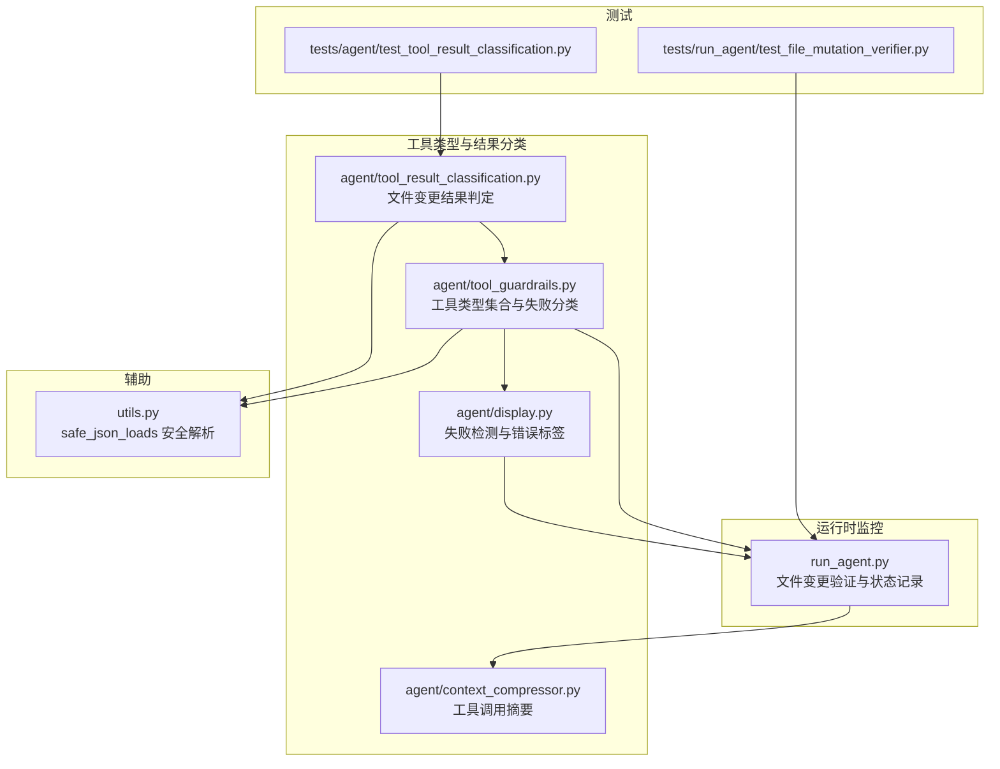
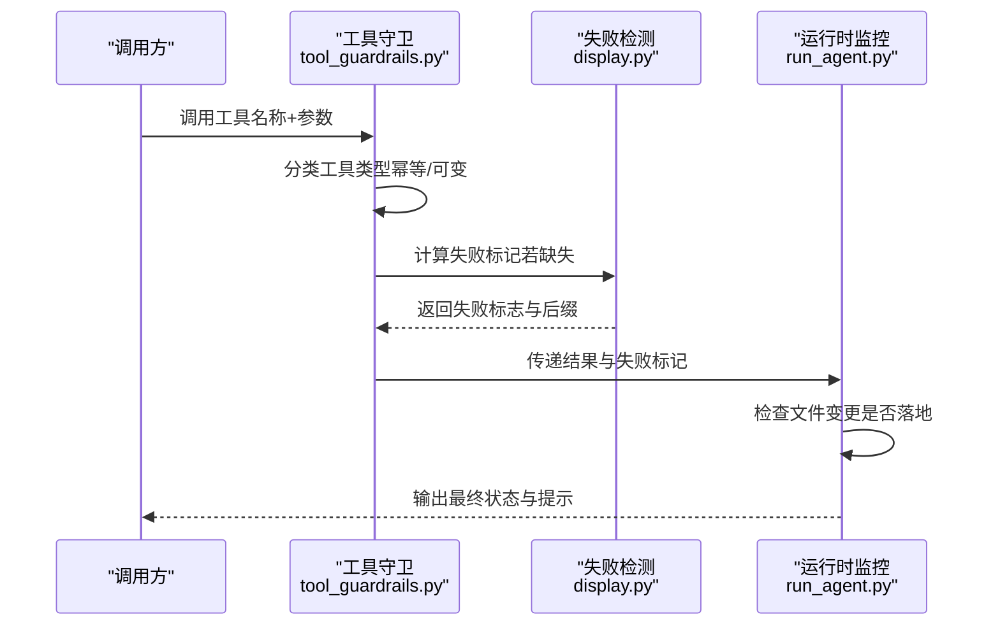
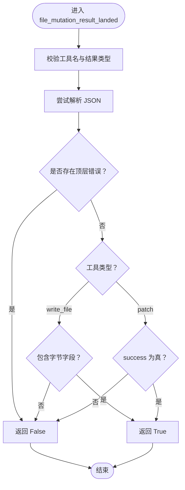
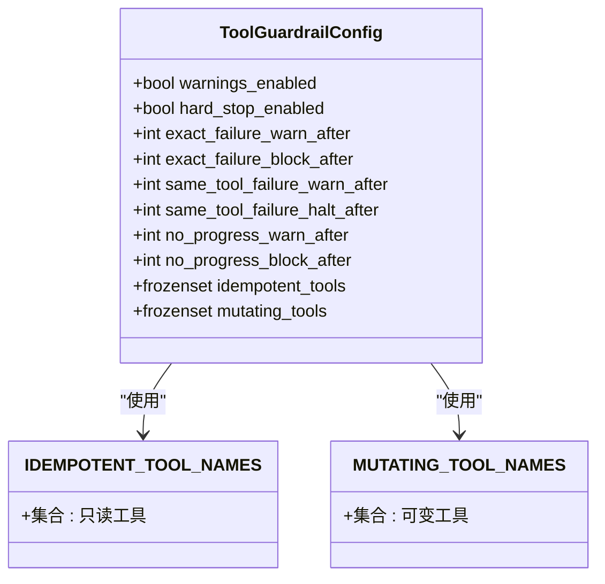
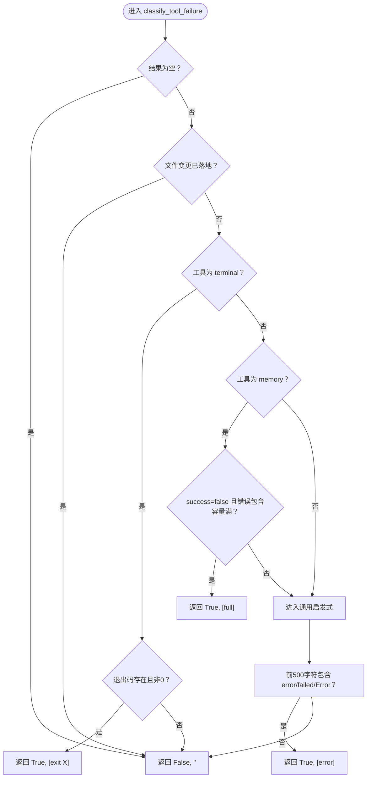
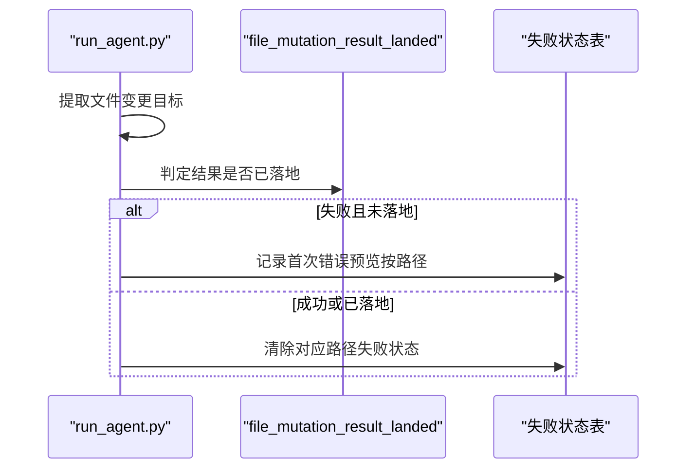
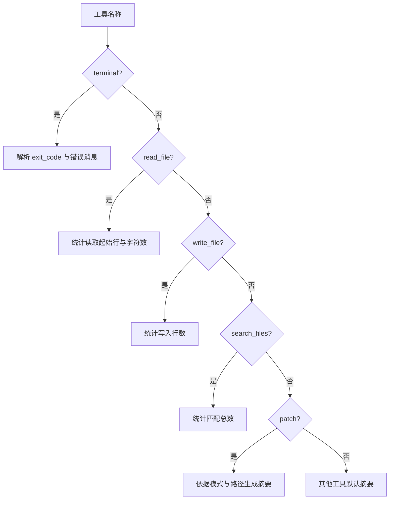
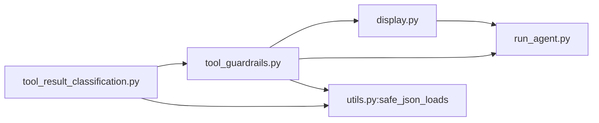

# 工具类型分类系统

<cite>
**本文档引用的文件**
- [agent/tool_result_classification.py](file://agent/tool_result_classification.py)
- [agent/tool_guardrails.py](file://agent/tool_guardrails.py)
- [agent/display.py](file://agent/display.py)
- [utils.py](file://utils.py)
- [run_agent.py](file://run_agent.py)
- [tests/agent/test_tool_result_classification.py](file://tests/agent/test_tool_result_classification.py)
- [tests/run_agent/test_file_mutation_verifier.py](file://tests/run_agent/test_file_mutation_verifier.py)
- [agent/context_compressor.py](file://agent/context_compressor.py)
</cite>

## 目录
1. [简介](#简介)
2. [项目结构](#项目结构)
3. [核心组件](#核心组件)
4. [架构总览](#架构总览)
5. [详细组件分析](#详细组件分析)
6. [依赖分析](#依赖分析)
7. [性能考量](#性能考量)
8. [故障排查指南](#故障排查指南)
9. [结论](#结论)
10. [附录](#附录)

## 简介
本文件系统性阐述工具类型分类系统的设计与实现，重点覆盖以下方面：
- 可变工具（MUTATING_TOOL_NAMES）与幂等工具（IDEMPOTENT_TOOL_NAMES）的分类标准与差异
- 工具结果分类器对文件变更、终端执行状态、内存操作结果的识别机制
- classify_tool_failure 函数的错误检测算法与失败分类逻辑
- 工具调用前后状态变化的监控机制（含文件变更验证）
- 不同工具类型的特殊处理策略与安全注意事项
- 具体代码示例路径，展示工具分类与结果检测的实际应用
- 新增工具类型与自定义分类规则的开发指导

## 项目结构
围绕工具类型分类系统的关键文件分布如下：
- 结果分类与工具类型：agent/tool_result_classification.py、agent/tool_guardrails.py
- 失败检测与显示：agent/display.py
- 工具调用前后状态监控：run_agent.py
- 辅助工具：utils.py（safe_json_loads）
- 测试与验证：tests/agent/test_tool_result_classification.py、tests/run_agent/test_file_mutation_verifier.py
- 上下文摘要与可视化：agent/context_compressor.py

**图表来源**
- [agent/tool_result_classification.py:1-27](file://agent/tool_result_classification.py#L1-L27)
- [agent/tool_guardrails.py:19-60](file://agent/tool_guardrails.py#L19-L60)
- [agent/display.py:849-892](file://agent/display.py#L849-L892)
- [run_agent.py:2505-2536](file://run_agent.py#L2505-L2536)
- [utils.py:299-310](file://utils.py#L299-L310)
- [tests/agent/test_tool_result_classification.py:1-31](file://tests/agent/test_tool_result_classification.py#L1-L31)
- [tests/run_agent/test_file_mutation_verifier.py:372-409](file://tests/run_agent/test_file_mutation_verifier.py#L372-L409)
- [agent/context_compressor.py:491-521](file://agent/context_compressor.py#L491-L521)

**章节来源**
- [agent/tool_result_classification.py:1-27](file://agent/tool_result_classification.py#L1-L27)
- [agent/tool_guardrails.py:19-60](file://agent/tool_guardrails.py#L19-L60)
- [agent/display.py:849-892](file://agent/display.py#L849-L892)
- [run_agent.py:2505-2536](file://run_agent.py#L2505-L2536)
- [utils.py:299-310](file://utils.py#L299-L310)
- [tests/agent/test_tool_result_classification.py:1-31](file://tests/agent/test_tool_result_classification.py#L1-L31)
- [tests/run_agent/test_file_mutation_verifier.py:372-409](file://tests/run_agent/test_file_mutation_verifier.py#L372-L409)
- [agent/context_compressor.py:491-521](file://agent/context_compressor.py#L491-L521)

## 核心组件
- 文件变更结果判定器：用于判断写入或补丁操作是否真正落地，避免误判为“成功”但实际未写入的情况。
- 工具类型集合：明确区分幂等工具与可变工具，支撑守卫机制与循环检测。
- 失败分类器：在缺少显式失败标记时，基于结果字符串与结构化数据进行安全回退分类。
- 运行时状态监控：在工具调用后检查文件变更是否成功，并维护每轮失败状态。

**章节来源**
- [agent/tool_result_classification.py:9-26](file://agent/tool_result_classification.py#L9-L26)
- [agent/tool_guardrails.py:20-60](file://agent/tool_guardrails.py#L20-L60)
- [agent/tool_guardrails.py:189-221](file://agent/tool_guardrails.py#L189-L221)
- [run_agent.py:2505-2536](file://run_agent.py#L2505-L2536)

## 架构总览
工具类型分类系统由“类型定义—结果判定—失败检测—状态监控”四层构成，形成闭环的安全与可观测体系。

**图表来源**
- [agent/tool_guardrails.py:224-376](file://agent/tool_guardrails.py#L224-L376)
- [agent/display.py:849-892](file://agent/display.py#L849-L892)
- [run_agent.py:2505-2536](file://run_agent.py#L2505-L2536)

## 详细组件分析

### 文件变更结果判定器
- 目标：确保仅当写入或补丁操作真正生效时才视为“已落地”，避免被嵌套错误或非关键字段误导。
- 判定规则：
  - 仅针对写文件与补丁两类工具
  - 必须是字符串且可解析为字典
  - 字典中不得存在顶层错误键
  - 写文件：要求包含“字节数”字段
  - 补丁：要求返回布尔成功标志为真
- 测试要点：嵌套错误不影响“已落地”判定；顶层错误则不计为落地。

**图表来源**
- [agent/tool_result_classification.py:12-26](file://agent/tool_result_classification.py#L12-L26)

**章节来源**
- [agent/tool_result_classification.py:9-26](file://agent/tool_result_classification.py#L9-L26)
- [tests/agent/test_tool_result_classification.py:8-31](file://tests/agent/test_tool_result_classification.py#L8-L31)

### 工具类型集合与分类标准
- 幂等工具（IDEMPOTENT_TOOL_NAMES）：只读查询与信息检索类工具，重复调用不应产生副作用。
- 可变工具（MUTATING_TOOL_NAMES）：可能改变系统状态的工具，如终端执行、文件写入、补丁、内存操作等。
- 分类用途：
  - 守卫机制：对可变工具严格限制循环重试，对幂等工具检测“无进展”重复调用
  - 配置注入：通过配置对象注入到守卫阈值与行为控制

**图表来源**
- [agent/tool_guardrails.py:63-81](file://agent/tool_guardrails.py#L63-L81)
- [agent/tool_guardrails.py:20-60](file://agent/tool_guardrails.py#L20-L60)

**章节来源**
- [agent/tool_guardrails.py:20-60](file://agent/tool_guardrails.py#L20-L60)
- [agent/tool_guardrails.py:63-81](file://agent/tool_guardrails.py#L63-L81)

### 失败分类器（classify_tool_failure）
- 设计目标：在调用方未显式提供失败标记时，基于结果内容进行一致性的安全回退分类。
- 关键分支：
  - 若文件变更已落地，则不视为失败
  - 终端工具：以退出码为主要失败信号；若有错误消息则优先使用
  - 内存工具：区分“容量满”与普通错误
  - 通用启发式：在前 500 字符内匹配错误关键字
- 与显示层一致性：与显示模块的失败检测保持完全一致，保证用户界面与守卫逻辑一致。

**图表来源**
- [agent/tool_guardrails.py:189-221](file://agent/tool_guardrails.py#L189-L221)
- [agent/display.py:849-892](file://agent/display.py#L849-L892)
- [utils.py:299-310](file://utils.py#L299-L310)

**章节来源**
- [agent/tool_guardrails.py:189-221](file://agent/tool_guardrails.py#L189-L221)
- [agent/display.py:849-892](file://agent/display.py#L849-L892)
- [utils.py:299-310](file://utils.py#L299-L310)

### 工具调用前后状态监控机制
- 前置：根据工具类型提取潜在的文件变更目标路径
- 后置：
  - 若工具报错但文件变更未落地：记录首次错误预览，按路径去重
  - 若工具成功或文件变更已落地：清除对应路径的失败状态
- 验证开关：可通过环境变量覆盖配置，启用/禁用每轮文件变更验证

**图表来源**
- [run_agent.py:2505-2536](file://run_agent.py#L2505-L2536)
- [agent/tool_result_classification.py:12-26](file://agent/tool_result_classification.py#L12-L26)

**章节来源**
- [run_agent.py:2505-2536](file://run_agent.py#L2505-L2536)
- [tests/run_agent/test_file_mutation_verifier.py:372-409](file://tests/run_agent/test_file_mutation_verifier.py#L372-L409)

### 工具结果分类与可视化摘要
- 终端：解析退出码与错误消息，生成简洁摘要
- 文件读取/写入：统计偏移与行数，便于上下文压缩
- 搜索：统计匹配数量，帮助快速理解结果规模
- 补丁：依据模式与目标路径生成摘要

**图表来源**
- [agent/context_compressor.py:491-521](file://agent/context_compressor.py#L491-L521)

**章节来源**
- [agent/context_compressor.py:491-521](file://agent/context_compressor.py#L491-L521)

## 依赖分析
- 工具类型集合与失败分类器相互依赖：守卫配置持有两类工具集合，失败分类器依赖安全 JSON 解析与文件变更判定
- 显示层与守卫层保持一致性：失败分类器与显示层的失败检测逻辑完全一致，避免 UI 与后台判断分歧
- 运行时监控依赖文件变更判定器与配置开关，确保验证行为可控

**图表来源**
- [agent/tool_result_classification.py:12-26](file://agent/tool_result_classification.py#L12-L26)
- [agent/tool_guardrails.py:189-221](file://agent/tool_guardrails.py#L189-L221)
- [agent/display.py:849-892](file://agent/display.py#L849-L892)
- [run_agent.py:2505-2536](file://run_agent.py#L2505-L2536)
- [utils.py:299-310](file://utils.py#L299-L310)

**章节来源**
- [agent/tool_guardrails.py:16-17](file://agent/tool_guardrails.py#L16-L17)
- [agent/display.py:849-892](file://agent/display.py#L849-L892)
- [utils.py:299-310](file://utils.py#L299-L310)

## 性能考量
- JSON 解析与哈希计算：失败分类与结果哈希均涉及 JSON 解析与排序，建议在高频场景下缓存解析结果或采用更轻量的哈希策略
- 字符串扫描范围：通用启发式仅扫描前 500 字符，兼顾性能与覆盖率
- 集合查找：幂等/可变工具集合为冻结集合，查找复杂度为 O(1)，适合频繁判断

## 故障排查指南
- 失败标签不一致：若 UI 显示与守卫逻辑不一致，检查失败分类器与显示层的实现是否同步
- 文件变更未落地：确认结果字符串是否包含必要的字段（如字节数或成功标志），并排除顶层错误
- 终端失败误判：检查退出码与错误消息是否正确解析，避免将异常输出误判为成功
- 内存容量满误报：确保“容量满”的错误消息包含预期关键词，避免与其他错误混淆

**章节来源**
- [agent/tool_guardrails.py:189-221](file://agent/tool_guardrails.py#L189-L221)
- [agent/display.py:849-892](file://agent/display.py#L849-L892)
- [agent/tool_result_classification.py:12-26](file://agent/tool_result_classification.py#L12-L26)

## 结论
该工具类型分类系统通过清晰的类型划分、稳健的结果判定与一致的失败分类，构建了可靠的工具调用安全与可观测框架。结合运行时状态监控与可视化摘要，能够有效降低工具滥用风险并提升用户体验。

## 附录

### 新增工具类型与自定义分类规则开发指导
- 新增工具类型步骤
  - 在工具集合中注册新工具名称（幂等或可变）
  - 若为文件变更相关工具，需补充结果判定逻辑
  - 在失败分类器中增加针对性分支（如新增工具的退出码/错误消息特征）
  - 更新测试用例，覆盖典型成功/失败场景
- 自定义分类规则建议
  - 保持与显示层一致的失败判定逻辑
  - 对于结构化结果，优先解析字典字段而非字符串启发式
  - 对于文件变更工具，务必区分“已落地”与“成功但未落地”的边界
  - 通过环境变量或配置项控制验证开关，便于灰度发布与回滚

**章节来源**
- [agent/tool_guardrails.py:20-60](file://agent/tool_guardrails.py#L20-L60)
- [agent/tool_guardrails.py:189-221](file://agent/tool_guardrails.py#L189-L221)
- [agent/tool_result_classification.py:9-26](file://agent/tool_result_classification.py#L9-L26)
- [tests/agent/test_tool_result_classification.py:1-31](file://tests/agent/test_tool_result_classification.py#L1-L31)