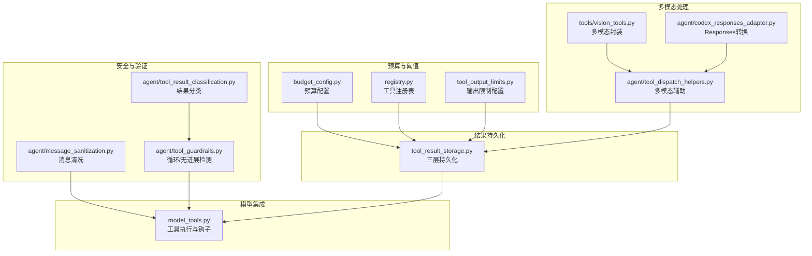
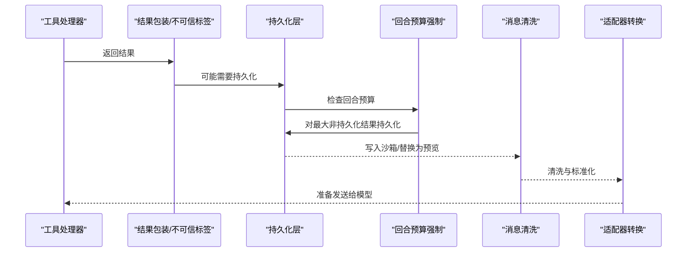
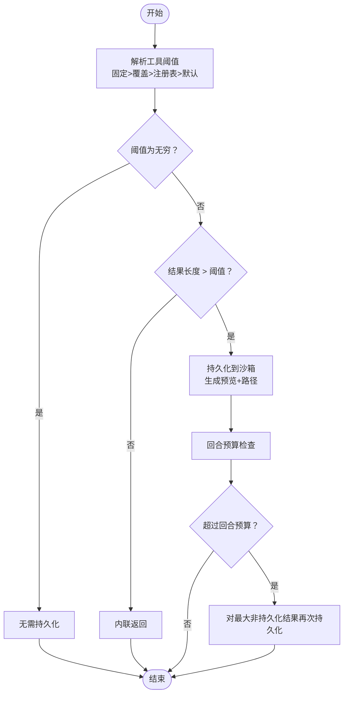
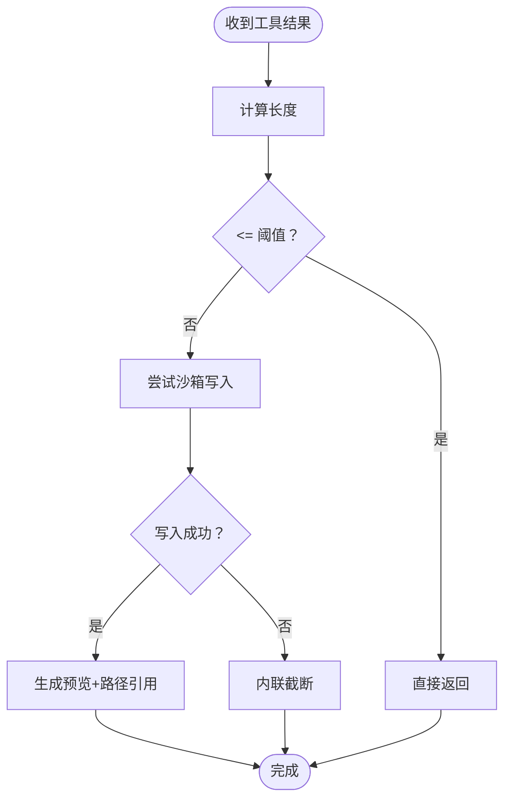
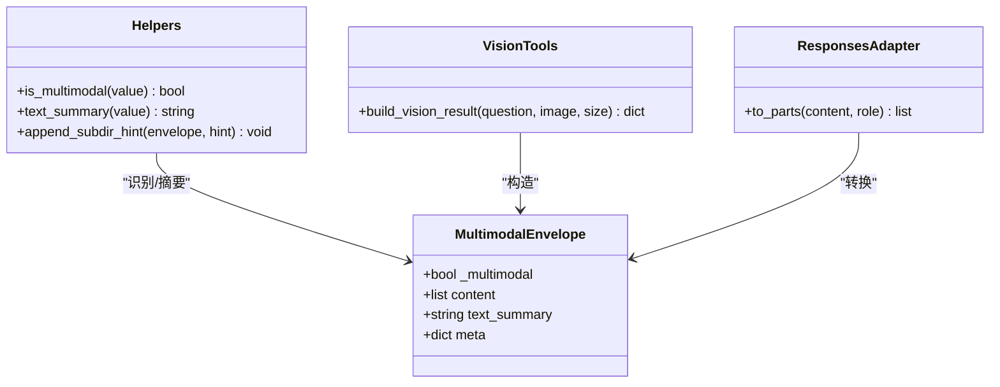
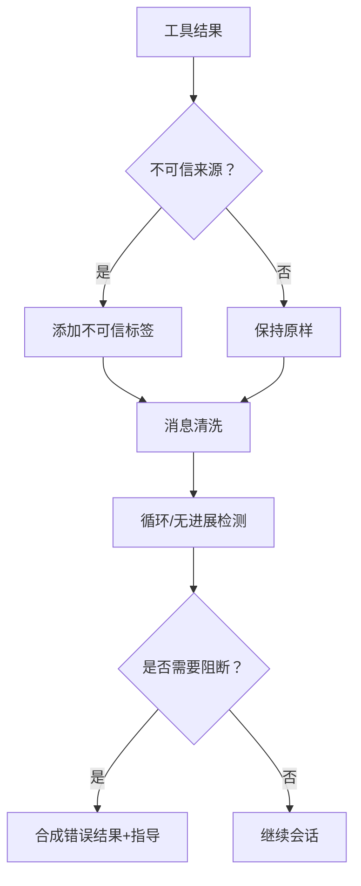
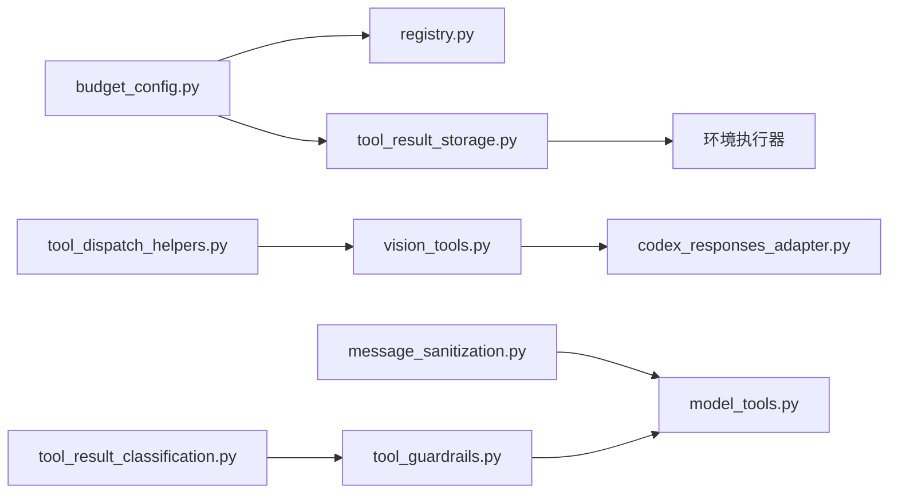

# 工具结果处理

<cite>
**本文引用的文件**
- [tool_result_storage.py](file://tools/tool_result_storage.py)
- [budget_config.py](file://tools/budget_config.py)
- [tool_output_limits.py](file://tools/tool_output_limits.py)
- [registry.py](file://tools/registry.py)
- [tool_dispatch_helpers.py](file://agent/tool_dispatch_helpers.py)
- [vision_tools.py](file://tools/vision_tools.py)
- [tool_guardrails.py](file://agent/tool_guardrails.py)
- [message_sanitization.py](file://agent/message_sanitization.py)
- [tool_result_classification.py](file://agent/tool_result_classification.py)
- [model_tools.py](file://model_tools.py)
- [codex_responses_adapter.py](file://agent/codex_responses_adapter.py)
- [test_tool_result_storage.py](file://tests/tools/test_tool_result_storage.py)
- [test_budget_config.py](file://tests/tools/test_budget_config.py)
- [test_mcp_tool.py](file://tests/tools/test_mcp_tool.py)
- [test_memory_tool.py](file://tests/tools/test_memory_tool.py)
- [test_codex_multimodal_tool_result.py](file://tests/run_agent/test_codex_multimodal_tool_result.py)
</cite>

## 目录
1. [引言](#引言)
2. [项目结构](#项目结构)
3. [核心组件](#核心组件)
4. [架构总览](#架构总览)
5. [详细组件分析](#详细组件分析)
6. [依赖分析](#依赖分析)
7. [性能考量](#性能考量)
8. [故障排查指南](#故障排查指南)
9. [结论](#结论)
10. [附录](#附录)

## 引言
本文件面向“工具结果处理”子系统，系统性梳理工具执行后结果的分类与处理策略、多模态内容统一处理、存储与持久化、预算与大小限制、内容转换与格式标准化、验证与清理流程，并给出性能优化与错误恢复的最佳实践。目标是帮助开发者在不同模型与适配器环境下，稳定地处理文本、图像与多媒体工具结果，避免上下文溢出与安全风险。

## 项目结构
工具结果处理涉及以下关键模块：
- 预算与阈值配置：预算配置、注册表查询、输出限制
- 结果持久化：按工具阈值与回合预算的三层防御
- 多模态处理：统一的多模态封装、摘要提取、适配器转换
- 安全与验证：结果清洗、不可信内容包装、循环/无进展检测
- 存储与清理：沙箱写入、预览构建、回合级预算强制

图示来源
- [budget_config.py:1-52](file://tools/budget_config.py#L1-L52)
- [tool_result_storage.py:1-233](file://tools/tool_result_storage.py#L1-L233)
- [tool_dispatch_helpers.py:1-418](file://agent/tool_dispatch_helpers.py#L1-L418)
- [vision_tools.py:522-676](file://tools/vision_tools.py#L522-L676)
- [codex_responses_adapter.py:76-106](file://agent/codex_responses_adapter.py#L76-L106)
- [message_sanitization.py:1-445](file://agent/message_sanitization.py#L1-L445)
- [tool_guardrails.py:1-476](file://agent/tool_guardrails.py#L1-L476)
- [tool_result_classification.py:1-27](file://agent/tool_result_classification.py#L1-L27)
- [model_tools.py:1183-1219](file://model_tools.py#L1183-L1219)

章节来源
- [tool_result_storage.py:1-233](file://tools/tool_result_storage.py#L1-L233)
- [budget_config.py:1-52](file://tools/budget_config.py#L1-L52)
- [tool_output_limits.py:1-111](file://tools/tool_output_limits.py#L1-L111)
- [registry.py:420-431](file://tools/registry.py#L420-L431)
- [tool_dispatch_helpers.py:177-235](file://agent/tool_dispatch_helpers.py#L177-L235)
- [vision_tools.py:522-676](file://tools/vision_tools.py#L522-L676)
- [codex_responses_adapter.py:76-106](file://agent/codex_responses_adapter.py#L76-L106)
- [message_sanitization.py:75-140](file://agent/message_sanitization.py#L75-L140)
- [tool_guardrails.py:224-375](file://agent/tool_guardrails.py#L224-L375)
- [tool_result_classification.py:12-26](file://agent/tool_result_classification.py#L12-L26)
- [model_tools.py:1183-1219](file://model_tools.py#L1183-L1219)

## 核心组件
- 预算配置与阈值解析：提供工具级阈值、回合级预算与预览大小的统一入口，支持固定阈值、配置覆盖与注册表回退。
- 结果持久化：三层防御机制，分别针对单结果、回合聚合与环境写入失败的回退策略。
- 多模态封装与转换：统一多模态结果结构，提供文本摘要与适配器转换，保障不同供应商对多模态的支持差异。
- 安全与验证：对不可信来源结果进行包装，对消息进行清洗，对工具循环与无进展进行检测与告警/阻断。
- 存储与清理：在沙箱目录写入大结果，生成预览与路径引用；回合预算不足时按大小排序优先持久化。

章节来源
- [budget_config.py:22-48](file://tools/budget_config.py#L22-L48)
- [tool_result_storage.py:122-178](file://tools/tool_result_storage.py#L122-L178)
- [tool_dispatch_helpers.py:177-235](file://agent/tool_dispatch_helpers.py#L177-L235)
- [vision_tools.py:642-671](file://tools/vision_tools.py#L642-L671)
- [message_sanitization.py:75-140](file://agent/message_sanitization.py#L75-L140)
- [tool_guardrails.py:224-375](file://agent/tool_guardrails.py#L224-L375)

## 架构总览
工具结果处理的关键流程如下：
- 工具执行返回字符串或结构化结果
- 统一包装为消息结构，必要时对不可信内容加标签
- 计算阈值与预览，决定是否持久化
- 按回合预算强制持久化较大结果
- 清洗与适配器转换，最终进入模型输入

图示来源
- [model_tools.py:1183-1219](file://model_tools.py#L1183-L1219)
- [tool_result_storage.py:181-232](file://tools/tool_result_storage.py#L181-L232)
- [message_sanitization.py:75-140](file://agent/message_sanitization.py#L75-L140)
- [codex_responses_adapter.py:76-106](file://agent/codex_responses_adapter.py#L76-L106)

## 详细组件分析

### 预算与阈值解析
- 工具级阈值解析优先级：固定阈值（如 read_file 固定无穷）> 配置覆盖 > 注册表 > 默认值
- 回合级预算：对一轮内所有工具结果进行字符计数，按大小降序优先持久化
- 输出限制：集中式配置项，支持终端输出、分页行数与每行长度的可调上限

图示来源
- [budget_config.py:37-47](file://tools/budget_config.py#L37-L47)
- [tool_result_storage.py:122-178](file://tools/tool_result_storage.py#L122-L178)
- [tool_result_storage.py:181-232](file://tools/tool_result_storage.py#L181-L232)
- [test_budget_config.py:137-176](file://tests/tools/test_budget_config.py#L137-L176)

章节来源
- [budget_config.py:11-13](file://tools/budget_config.py#L11-L13)
- [budget_config.py:37-47](file://tools/budget_config.py#L37-L47)
- [tool_result_storage.py:122-178](file://tools/tool_result_storage.py#L122-L178)
- [tool_result_storage.py:181-232](file://tools/tool_result_storage.py#L181-L232)
- [test_budget_config.py:137-176](file://tests/tools/test_budget_config.py#L137-L176)

### 结果持久化与存储
- 单结果持久化：当结果超过工具阈值时，写入沙箱临时目录，生成预览与路径引用
- 回合预算强制：对非持久化结果按大小排序，优先持久化，直至低于回合预算
- 写入策略：通过环境执行器写入，避免命令行参数过长导致失败；失败时回退为内联截断
- 预览与标签：生成带标签的替换消息，包含原始大小、保存路径与访问指引

图示来源
- [tool_result_storage.py:122-178](file://tools/tool_result_storage.py#L122-L178)
- [tool_result_storage.py:181-232](file://tools/tool_result_storage.py#L181-L232)

章节来源
- [tool_result_storage.py:44-57](file://tools/tool_result_storage.py#L44-L57)
- [tool_result_storage.py:78-94](file://tools/tool_result_storage.py#L78-L94)
- [tool_result_storage.py:97-119](file://tools/tool_result_storage.py#L97-L119)
- [tool_result_storage.py:122-178](file://tools/tool_result_storage.py#L122-L178)
- [tool_result_storage.py:181-232](file://tools/tool_result_storage.py#L181-L232)
- [test_tool_result_storage.py:484-515](file://tests/tools/test_tool_result_storage.py#L484-L515)

### 多模态工具结果处理
- 统一封装：多模态结果以字典形式包含标志位、内容列表与可选文本摘要
- 文本摘要：用于日志、预览与不支持多模态的适配器回退
- 适配器转换：将聊天风格内容转换为各供应商期望的输入格式（如 Responses 的 input_text/output_text/input_image）

图示来源
- [tool_dispatch_helpers.py:177-235](file://agent/tool_dispatch_helpers.py#L177-L235)
- [vision_tools.py:642-671](file://tools/vision_tools.py#L642-L671)
- [codex_responses_adapter.py:76-106](file://agent/codex_responses_adapter.py#L76-L106)

章节来源
- [tool_dispatch_helpers.py:177-235](file://agent/tool_dispatch_helpers.py#L177-L235)
- [vision_tools.py:522-676](file://tools/vision_tools.py#L522-L676)
- [codex_responses_adapter.py:76-106](file://agent/codex_responses_adapter.py#L76-L106)
- [test_codex_multimodal_tool_result.py:48-69](file://tests/run_agent/test_codex_multimodal_tool_result.py#L48-L69)

### 安全与验证
- 不可信内容包装：对高风险工具（如 web_extract/web_search/browser_*）的字符串结果进行包装，降低间接注入风险
- 消息清洗：去除代理字符、修复 JSON 工具调用参数、移除非 ASCII 或图像内容
- 循环/无进展检测：基于签名与哈希统计失败次数与重复结果，提供警告或阻断决策

图示来源
- [tool_dispatch_helpers.py:320-397](file://agent/tool_dispatch_helpers.py#L320-L397)
- [message_sanitization.py:75-140](file://agent/message_sanitization.py#L75-L140)
- [tool_guardrails.py:224-375](file://agent/tool_guardrails.py#L224-L375)

章节来源
- [tool_dispatch_helpers.py:320-397](file://agent/tool_dispatch_helpers.py#L320-L397)
- [message_sanitization.py:75-140](file://agent/message_sanitization.py#L75-L140)
- [tool_guardrails.py:224-375](file://agent/tool_guardrails.py#L224-L375)
- [tool_result_classification.py:12-26](file://agent/tool_result_classification.py#L12-L26)

### 内容转换与格式标准化
- 工具执行钩子：在工具执行前后提供钩子，允许对结果进行转换与错误清理
- Trajectory 规范化：将推理内容统一为特定标签，工具调用与响应进行 XML 包裹的 JSON 规范化
- Schema 转换：MCP 工具 schema 转换为内部 schema，保证参数结构一致性

章节来源
- [model_tools.py:1183-1219](file://model_tools.py#L1183-L1219)
- [test_mcp_tool.py:139-171](file://tests/tools/test_mcp_tool.py#L139-L171)

## 依赖分析
- 预算配置依赖注册表获取工具级阈值，回退到默认值
- 结果持久化依赖预算配置与环境执行器写入
- 多模态处理依赖工具结果封装与适配器转换
- 安全与验证贯穿消息与工具结果的全链路
- 测试覆盖预算解析优先级、回合预算强制与多模态转换

图示来源
- [budget_config.py:46-47](file://tools/budget_config.py#L46-L47)
- [registry.py:422-430](file://tools/registry.py#L422-L430)
- [tool_result_storage.py:78-94](file://tools/tool_result_storage.py#L78-L94)
- [tool_dispatch_helpers.py:177-235](file://agent/tool_dispatch_helpers.py#L177-L235)
- [vision_tools.py:642-671](file://tools/vision_tools.py#L642-L671)
- [codex_responses_adapter.py:76-106](file://agent/codex_responses_adapter.py#L76-L106)
- [message_sanitization.py:75-140](file://agent/message_sanitization.py#L75-L140)
- [tool_guardrails.py:224-375](file://agent/tool_guardrails.py#L224-L375)
- [tool_result_classification.py:12-26](file://agent/tool_result_classification.py#L12-L26)

章节来源
- [registry.py:422-430](file://tools/registry.py#L422-L430)
- [tool_result_storage.py:78-94](file://tools/tool_result_storage.py#L78-L94)
- [tool_dispatch_helpers.py:177-235](file://agent/tool_dispatch_helpers.py#L177-L235)
- [vision_tools.py:642-671](file://tools/vision_tools.py#L642-L671)
- [codex_responses_adapter.py:76-106](file://agent/codex_responses_adapter.py#L76-L106)
- [message_sanitization.py:75-140](file://agent/message_sanitization.py#L75-L140)
- [tool_guardrails.py:224-375](file://agent/tool_guardrails.py#L224-L375)
- [tool_result_classification.py:12-26](file://agent/tool_result_classification.py#L12-L26)

## 性能考量
- 预算优先级：优先使用固定阈值与配置覆盖，减少注册表查询开销
- 缓存策略：工具输出限制配置采用进程内缓存，避免频繁磁盘读取
- 写入优化：通过 stdin 管道写入沙箱，绕过命令行参数长度限制
- 排序与剪裁：回合预算强制按大小排序，优先持久化最大结果，减少多次 IO
- 多模态摘要：仅在需要时生成文本摘要，避免不必要的序列化

## 故障排查指南
- 持久化失败：检查环境执行器可用性与沙箱目录权限；确认写入超时与异常日志
- 阈值解析异常：核对固定阈值、配置覆盖与注册表设置；验证默认值回退
- 多模态适配失败：确认内容类型与适配器支持；检查 Responses 转换映射
- 不可信内容告警：检查工具名称是否命中不可信集合；评估标签包裹范围
- 循环/无进展：查看告警阈值与计数；调整参数或切换工具路径

章节来源
- [tool_result_storage.py:160-168](file://tools/tool_result_storage.py#L160-L168)
- [test_budget_config.py:137-176](file://tests/tools/test_budget_config.py#L137-L176)
- [test_codex_multimodal_tool_result.py:48-69](file://tests/run_agent/test_codex_multimodal_tool_result.py#L48-L69)
- [tool_guardrails.py:306-343](file://agent/tool_guardrails.py#L306-L343)

## 结论
工具结果处理系统通过三层预算与阈值、多模态统一封装、安全清洗与循环检测，实现了在复杂模型与适配器环境下的稳健运行。建议在生产环境中启用回合预算强制与不可信内容包装，并结合测试用例验证阈值解析与多模态转换行为，以获得最佳稳定性与安全性。

## 附录
- 配置项参考
  - 工具输出限制：max_bytes、max_lines、max_line_length
  - 预算配置：default_result_size、turn_budget、preview_size、tool_overrides
- 关键常量
  - 固定阈值：read_file=无穷
  - 默认阈值：工具结果 100KB、回合预算 200KB、预览 1.5KB

章节来源
- [tool_output_limits.py:19-29](file://tools/tool_output_limits.py#L19-L29)
- [budget_config.py:11-19](file://tools/budget_config.py#L11-L19)
- [test_budget_config.py:29-41](file://tests/tools/test_budget_config.py#L29-L41)