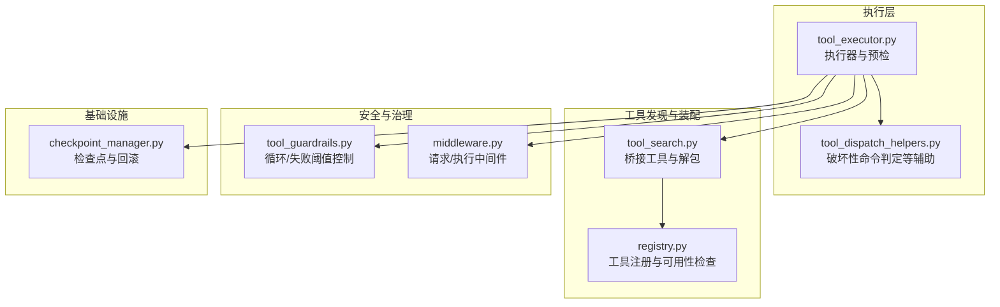
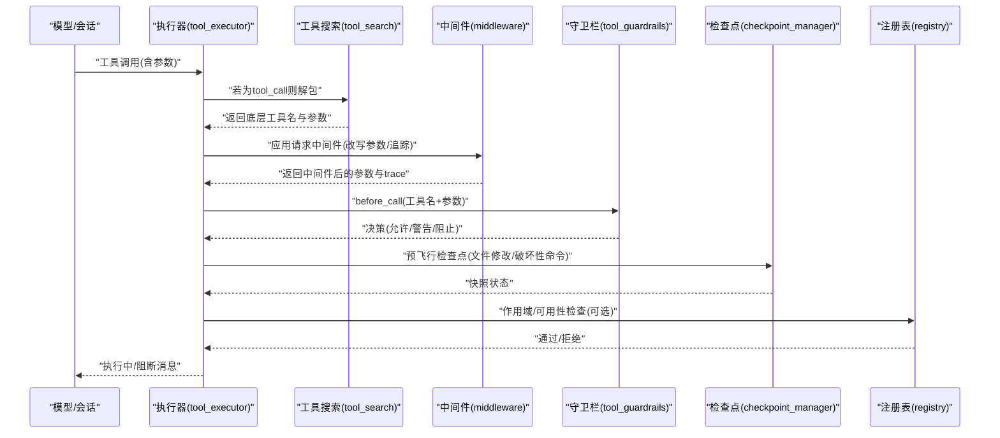
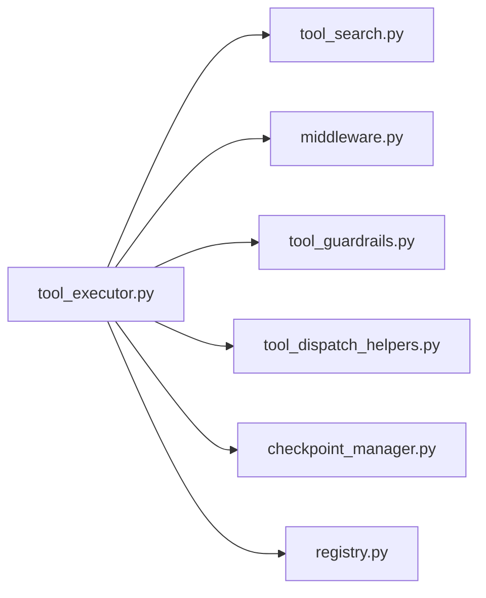

# 工具执行前处理

<cite>
**本文引用的文件**
- [agent/tool_executor.py](file://agent/tool_executor.py)
- [agent/tool_guardrails.py](file://agent/tool_guardrails.py)
- [agent/tool_dispatch_helpers.py](file://agent/tool_dispatch_helpers.py)
- [tools/tool_search.py](file://tools/tool_search.py)
- [tools/checkpoint_manager.py](file://tools/checkpoint_manager.py)
- [hermes_cli/middleware.py](file://hermes_cli/middleware.py)
- [tools/registry.py](file://tools/registry.py)
- [tests/tools/test_tool_search.py](file://tests/tools/test_tool_search.py)
- [tests/tools/test_registry.py](file://tests/tools/test_registry.py)
</cite>

## 目录
1. [简介](#简介)
2. [项目结构](#项目结构)
3. [核心组件](#核心组件)
4. [架构总览](#架构总览)
5. [详细组件分析](#详细组件分析)
6. [依赖分析](#依赖分析)
7. [性能考虑](#性能考虑)
8. [故障排查指南](#故障排查指南)
9. [结论](#结论)

## 简介
本文件系统化阐述“工具执行前处理”流程的技术细节，覆盖从模型工具调用到实际执行之间的完整预检链路。内容包括：
- 参数解析与校验
- 作用域验证（会话授权）
- 中间件请求处理与追踪
- 守卫栏评估（危险命令与破坏性操作防护）
- 检查点预飞行（文件修改与破坏性终端命令自动快照）
- 工具搜索解包（TOOL_CALL_NAME 解析与底层工具提取）
- 性能优化与错误处理策略

## 项目结构
围绕工具执行前处理的核心模块如下：
- 执行器：负责并发/顺序调度、预检、中间件应用、检查点预飞行、后置回调与结果归档
- 工具搜索：桥接工具（tool_search/tool_describe/tool_call）与底层工具解包
- 守卫栏：基于工具名与参数的循环/失败次数阈值控制
- 中间件：请求级与执行级插件扩展点
- 注册表：工具定义、可用性检查与动态模式覆盖
- 检查点管理：透明文件系统快照与回滚

图示来源
- [agent/tool_executor.py](file://agent/tool_executor.py)
- [agent/tool_dispatch_helpers.py](file://agent/tool_dispatch_helpers.py)
- [tools/tool_search.py](file://tools/tool_search.py)
- [tools/registry.py](file://tools/registry.py)
- [agent/tool_guardrails.py](file://agent/tool_guardrails.py)
- [hermes_cli/middleware.py](file://hermes_cli/middleware.py)
- [tools/checkpoint_manager.py](file://tools/checkpoint_manager.py)

章节来源
- [agent/tool_executor.py](file://agent/tool_executor.py)
- [tools/tool_search.py](file://tools/tool_search.py)
- [agent/tool_guardrails.py](file://agent/tool_guardrails.py)
- [agent/tool_dispatch_helpers.py](file://agent/tool_dispatch_helpers.py)
- [hermes_cli/middleware.py](file://hermes_cli/middleware.py)
- [tools/registry.py](file://tools/registry.py)
- [tools/checkpoint_manager.py](file://tools/checkpoint_manager.py)

## 核心组件
- 工具执行器（tool_executor.py）
  - 并发/顺序执行入口
  - 预检阶段：参数解析、作用域验证、中间件应用、守卫栏评估、检查点预飞行
  - 后置钩子与结果持久化
- 工具搜索（tool_search.py）
  - 桥接工具：tool_search/tool_describe/tool_call
  - 解包：TOOL_CALL_NAME 的解析与底层工具提取
  - 会话作用域约束：scoped_deferrable_names
- 守卫栏（tool_guardrails.py）
  - 循环/失败阈值控制与硬停止策略
  - 工具签名与结果分类
- 中间件（middleware.py）
  - 请求级中间件：改写工具参数并记录追踪
  - 执行级中间件：包装下游执行回调
- 注册表（registry.py）
  - 工具注册、可用性检查、动态模式覆盖
- 辅助判定（tool_dispatch_helpers.py）
  - 终端破坏性命令识别
  - 多模态结果处理、路径重叠判定等
- 检查点管理（checkpoint_manager.py）
  - 自动快照与回滚
  - 输入校验与安全限制

章节来源
- [agent/tool_executor.py](file://agent/tool_executor.py)
- [tools/tool_search.py](file://tools/tool_search.py)
- [agent/tool_guardrails.py](file://agent/tool_guardrails.py)
- [hermes_cli/middleware.py](file://hermes_cli/middleware.py)
- [tools/registry.py](file://tools/registry.py)
- [agent/tool_dispatch_helpers.py](file://agent/tool_dispatch_helpers.py)
- [tools/checkpoint_manager.py](file://tools/checkpoint_manager.py)

## 架构总览
下图展示了工具调用在进入实际执行前的关键路径与交互。

图示来源
- [agent/tool_executor.py](file://agent/tool_executor.py)
- [tools/tool_search.py](file://tools/tool_search.py)
- [hermes_cli/middleware.py](file://hermes_cli/middleware.py)
- [agent/tool_guardrails.py](file://agent/tool_guardrails.py)
- [tools/checkpoint_manager.py](file://tools/checkpoint_manager.py)
- [tools/registry.py](file://tools/registry.py)

## 详细组件分析

### 参数解析与作用域验证
- 参数解析
  - 将 tool_call.function.arguments 解析为字典；异常或非字典时回退为空参数，避免后续处理崩溃
  - 对 tool_call 进行解包：当 function.name 为 TOOL_CALL_NAME 时，解析 arguments 中的 name 与 arguments，并对底层工具进行作用域校验
- 作用域验证
  - 使用 scoped_deferrable_names 获取当前会话可调用的 deferrable 名称集合
  - 若底层工具不在该集合内，则直接阻断，返回“未授权工具”的错误消息
- 关键实现位置
  - [agent/tool_executor.py](file://agent/tool_executor.py)
  - [tools/tool_search.py](file://tools/tool_search.py)

章节来源
- [agent/tool_executor.py](file://agent/tool_executor.py)
- [tools/tool_search.py](file://tools/tool_search.py)
- [tests/tools/test_tool_search.py](file://tests/tools/test_tool_search.py)

### 工具搜索解包（TOOL_CALL_NAME 解析与底层工具提取）
- 解包流程
  - 当 function.name == TOOL_CALL_NAME 时，从 arguments 中提取 name 与 arguments
  - 校验 name 是否为 deferrable 工具；若是，进一步校验是否在会话作用域内
  - 若通过，将 function_name 与 function_args 替换为底层工具的真实名称与参数
- 会话作用域约束
  - scoped_deferrable_names 返回当前 enabled/disabled toolset 下的 deferrable 名称集合
  - 任何越权调用都会被阻断，防止通过桥接工具绕过授权
- 关键实现位置
  - [tools/tool_search.py](file://tools/tool_search.py)
  - [agent/tool_executor.py](file://agent/tool_executor.py)

章节来源
- [tools/tool_search.py](file://tools/tool_search.py)
- [agent/tool_executor.py](file://agent/tool_executor.py)
- [tests/tools/test_tool_search.py](file://tests/tools/test_tool_search.py)

### 中间件请求处理与追踪
- 请求中间件
  - 在参数进入守卫栏与执行前，应用请求中间件以改写参数并记录 trace
  - 支持深拷贝回退（遇到不可深拷贝对象时使用浅拷贝），保证中间件链稳定运行
- 执行中间件
  - 包装下游执行回调，形成可组合的执行链，支持单次调用约束与错误传播
- 关键实现位置
  - [hermes_cli/middleware.py](file://hermes_cli/middleware.py)
  - [agent/tool_executor.py](file://agent/tool_executor.py)

章节来源
- [hermes_cli/middleware.py](file://hermes_cli/middleware.py)
- [agent/tool_executor.py](file://agent/tool_executor.py)

### 守卫栏评估（危险命令与破坏性操作防护）
- 循环/失败阈值控制
  - 基于工具签名（工具名+规范化参数哈希）统计重复失败与无进展次数
  - 可配置警告与硬停止阈值；达到阈值时返回阻断决策
- 危险命令检测
  - 对 terminal 工具的命令进行破坏性模式识别（如 rm/cp/mv/sed/truncate/dd/shred/git reset/clean/checkout 等）
  - 对输出重定向（> 覆盖）进行识别
- 关键实现位置
  - [agent/tool_guardrails.py](file://agent/tool_guardrails.py)
  - [agent/tool_dispatch_helpers.py](file://agent/tool_dispatch_helpers.py)

章节来源
- [agent/tool_guardrails.py](file://agent/tool_guardrails.py)
- [agent/tool_dispatch_helpers.py](file://agent/tool_dispatch_helpers.py)

### 检查点预飞行（文件修改与破坏性终端命令）
- 触发条件
  - 文件修改类工具（write_file/patch）：在每次调用前对目标工作目录创建快照
  - 破坏性终端命令（terminal）：在执行前对当前工作目录创建快照
- 安全与隔离
  - 单一共享存储（git 对象复用）、索引隔离、排除规则（依赖/缓存/虚拟环境/日志等）
  - 输入校验：禁止以短横线开头的提交哈希、路径穿越、绝对路径等
- 关键实现位置
  - [tools/checkpoint_manager.py](file://tools/checkpoint_manager.py)
  - [agent/tool_executor.py](file://agent/tool_executor.py)

章节来源
- [tools/checkpoint_manager.py](file://tools/checkpoint_manager.py)
- [agent/tool_executor.py](file://agent/tool_executor.py)

### 注册表与可用性检查
- 工具注册与可用性
  - 工具模块在导入时向注册表注册；可用性由 check_fn 决定，带 TTL 缓存
  - 提供 get_definitions、dispatch、is_toolset_available 等查询接口
- 动态模式覆盖
  - 支持动态 schema 覆盖（如 delegate_task 描述随配置变化）
- 关键实现位置
  - [tools/registry.py](file://tools/registry.py)

章节来源
- [tools/registry.py](file://tools/registry.py)
- [tests/tools/test_registry.py](file://tests/tools/test_registry.py)

## 依赖分析
- 执行器对各模块的依赖
  - 工具搜索：用于 TOOL_CALL_NAME 解包与作用域校验
  - 中间件：用于请求/执行期改写与包装
  - 守卫栏：用于循环/失败阈值控制
  - 辅助判定：用于终端破坏性命令识别
  - 检查点：用于文件修改/破坏性命令的预飞行快照
  - 注册表：用于工具可用性与动态模式覆盖
- 依赖可视化

图示来源
- [agent/tool_executor.py](file://agent/tool_executor.py)
- [tools/tool_search.py](file://tools/tool_search.py)
- [hermes_cli/middleware.py](file://hermes_cli/middleware.py)
- [agent/tool_guardrails.py](file://agent/tool_guardrails.py)
- [agent/tool_dispatch_helpers.py](file://agent/tool_dispatch_helpers.py)
- [tools/checkpoint_manager.py](file://tools/checkpoint_manager.py)
- [tools/registry.py](file://tools/registry.py)

章节来源
- [agent/tool_executor.py](file://agent/tool_executor.py)
- [tools/tool_search.py](file://tools/tool_search.py)
- [hermes_cli/middleware.py](file://hermes_cli/middleware.py)
- [agent/tool_guardrails.py](file://agent/tool_guardrails.py)
- [agent/tool_dispatch_helpers.py](file://agent/tool_dispatch_helpers.py)
- [tools/checkpoint_manager.py](file://tools/checkpoint_manager.py)
- [tools/registry.py](file://tools/registry.py)

## 性能考虑
- 预检阶段的开销控制
  - 参数解析与 JSON 解码仅在必要时进行，异常回退为安全空参数
  - 中间件应用采用深拷贝回退策略，避免因不可深拷贝对象导致整体失败
  - 守卫栏阈值控制按工具签名统计，避免重复计算
- 并发与批处理
  - 并行批处理需满足路径隔离与工具安全集要求；否则回退顺序执行
  - 终端破坏性命令默认串行，降低并发风险
- 检查点管理
  - 单一共享存储减少对象冗余；按转换单位大小与文件数量限制快照规模
  - 自动维护（gc/prune）与大小上限控制，避免无限增长

## 故障排查指南
- 工具调用被阻断
  - 检查是否为 out-of-scope 工具（TOOL_CALL_NAME 解包后不在会话 deferrable 名称集合）
  - 查看中间件 trace 是否对参数进行了意外改写
  - 确认守卫栏是否触发（重复失败/无进展阈值）
- 检查点相关问题
  - 快照未生成：确认启用标志与 git 可用性；避免对根目录/家目录等过宽目录创建快照
  - 回滚失败：检查提交哈希格式与路径合法性（禁止短横线开头、路径穿越、绝对路径）
- 中间件异常
  - 执行链回调多次调用 next_call 将被拒绝；确保单次使用
  - 中间件抛出异常时，系统会记录警告并尝试继续链路或回退到下一个回调

章节来源
- [agent/tool_executor.py](file://agent/tool_executor.py)
- [hermes_cli/middleware.py](file://hermes_cli/middleware.py)
- [tools/checkpoint_manager.py](file://tools/checkpoint_manager.py)
- [tests/tools/test_tool_search.py](file://tests/tools/test_tool_search.py)
- [tests/tools/test_registry.py](file://tests/tools/test_registry.py)

## 结论
工具执行前处理通过“参数解析—作用域验证—中间件—守卫栏—检查点预飞行”的多层保障，确保工具调用的安全、可控与可观测。其中：
- 工具搜索解包与作用域校验有效防止越权调用
- 中间件提供强大的可扩展性与可追溯性
- 守卫栏与破坏性命令识别降低循环与误操作风险
- 检查点机制为文件修改与破坏性命令提供自动保护
- 注册表与可用性检查保证工具生命周期内的稳定性与一致性