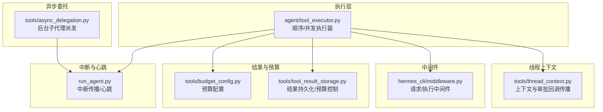
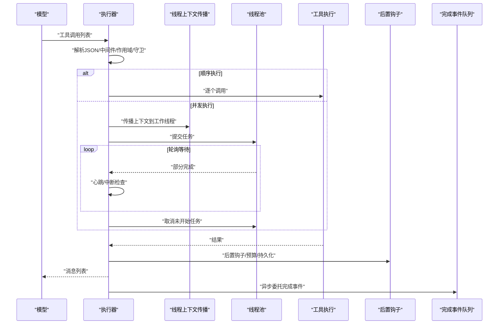
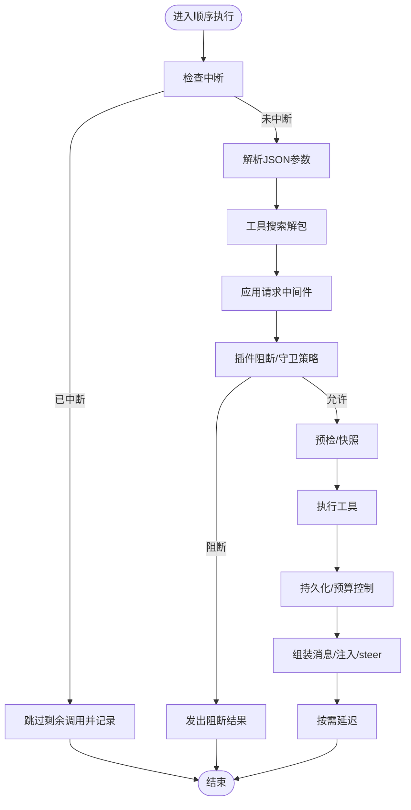
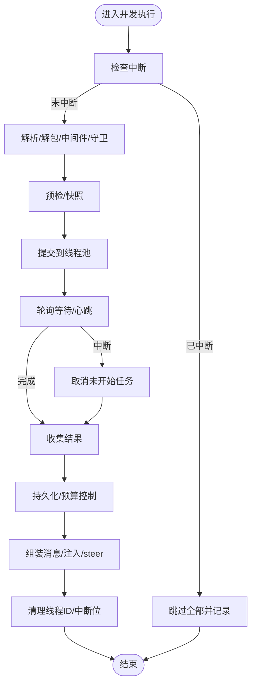
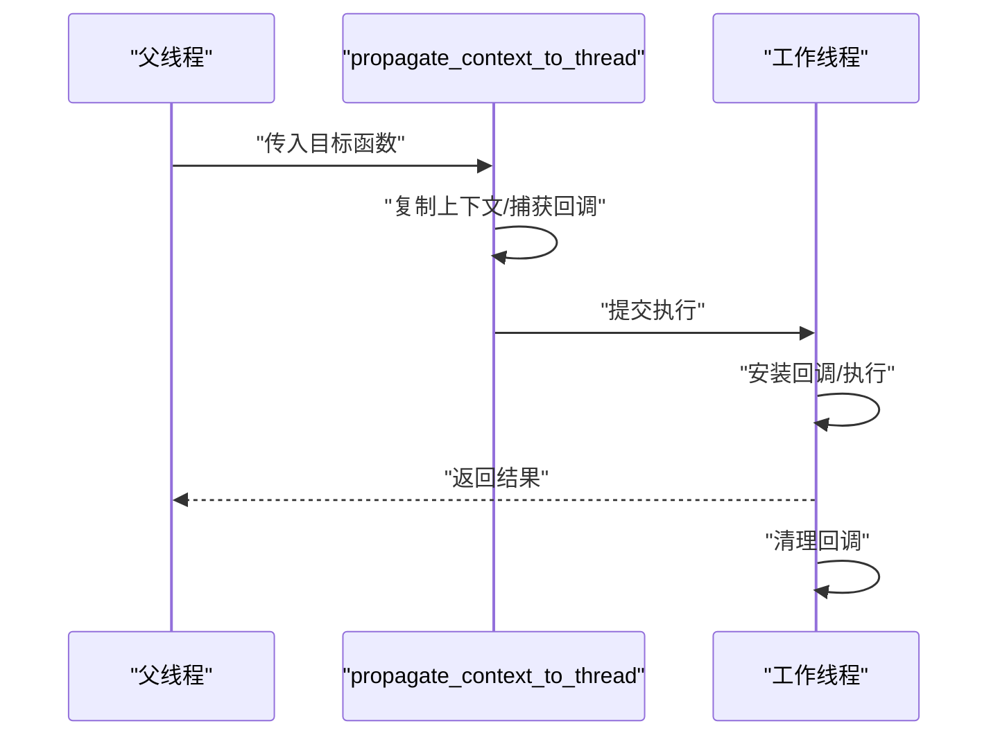
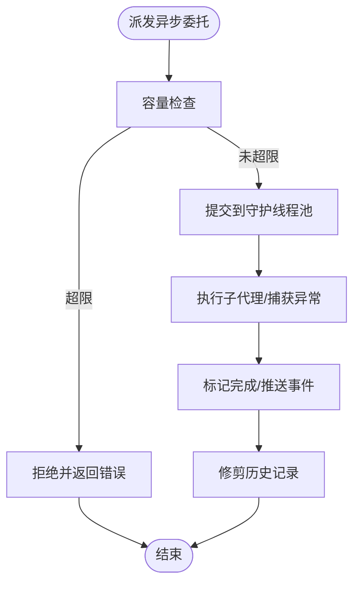
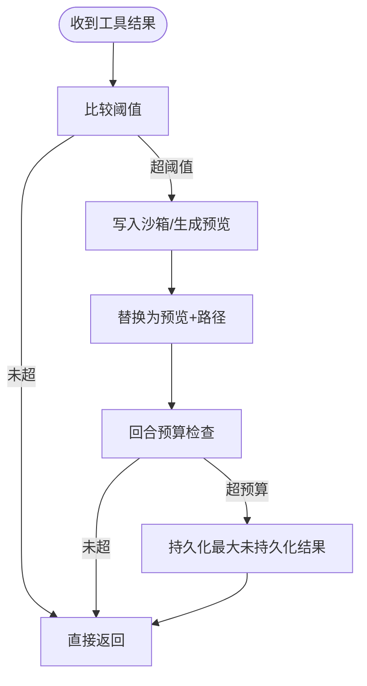
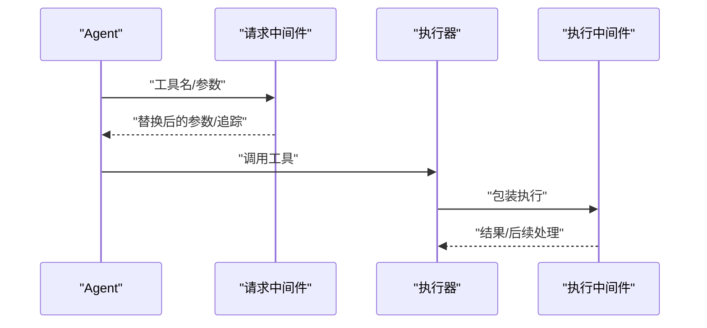
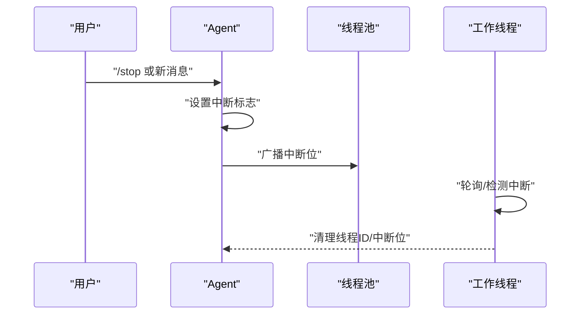
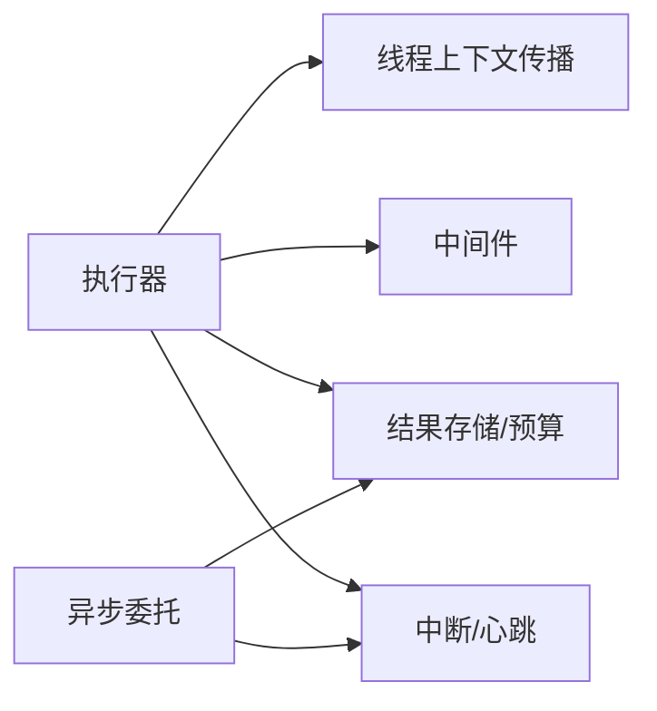

# 工具调度与执行

<cite>
**本文引用的文件**
- [agent/tool_executor.py](file://agent/tool_executor.py)
- [tools/thread_context.py](file://tools/thread_context.py)
- [tools/async_delegation.py](file://tools/async_delegation.py)
- [tools/tool_result_storage.py](file://tools/tool_result_storage.py)
- [tools/budget_config.py](file://tools/budget_config.py)
- [hermes_cli/middleware.py](file://hermes_cli/middleware.py)
- [run_agent.py](file://run_agent.py)
- [tests/tools/test_async_delegation.py](file://tests/tools/test_async_delegation.py)
- [tests/tools/test_interrupt.py](file://tests/tools/test_interrupt.py)
- [tests/run_agent/test_concurrent_interrupt.py](file://tests/run_agent/test_concurrent_interrupt.py)
- [tests/run_agent/test_interrupt_propagation.py](file://tests/run_agent/test_interrupt_propagation.py)
</cite>

## 目录
1. [简介](#简介)
2. [项目结构](#项目结构)
3. [核心组件](#核心组件)
4. [架构总览](#架构总览)
5. [详细组件分析](#详细组件分析)
6. [依赖分析](#依赖分析)
7. [性能考量](#性能考量)
8. [故障排查指南](#故障排查指南)
9. [结论](#结论)

## 简介
本文件系统性梳理工具调度与执行系统，覆盖顺序执行与并发执行两种模式的实现差异、工具调用解析流程（从JSON参数解析到函数签名验证）、并发线程池管理机制（最大工作线程数限制与任务分配策略）、执行前预检流程（中断检查、作用域验证、中间件处理）、执行过程中的活动跟踪与心跳机制，并提供性能优化与故障处理的最佳实践。文档以代码级分析为基础，辅以图示帮助理解。

## 项目结构
围绕工具调度与执行的关键模块如下：
- 执行器：负责顺序与并发执行、预检、回调、预算控制、结果持久化与消息组装
- 上下文传播：在工作线程中恢复会话上下文与审批回调
- 异步委托：后台子代理的异步派发与完成事件推送
- 结果存储与预算：三层预算控制（单工具阈值、转储持久化、回合聚合预算）
- 中间件：请求级与执行级中间件，支持参数改写与执行包装
- 中断与心跳：全局中断传播、线程级中断位、心跳与活动提示

图表来源
- [agent/tool_executor.py:243-767](file://agent/tool_executor.py#L243-L767)
- [tools/thread_context.py:64-121](file://tools/thread_context.py#L64-L121)
- [tools/async_delegation.py:105-263](file://tools/async_delegation.py#L105-L263)
- [tools/tool_result_storage.py:181-233](file://tools/tool_result_storage.py#L181-L233)
- [tools/budget_config.py:22-51](file://tools/budget_config.py#L22-L51)
- [hermes_cli/middleware.py:120-158](file://hermes_cli/middleware.py#L120-L158)
- [run_agent.py:2370-2394](file://run_agent.py#L2370-L2394)

章节来源
- [agent/tool_executor.py:1-1429](file://agent/tool_executor.py#L1-L1429)
- [tools/thread_context.py:1-121](file://tools/thread_context.py#L1-L121)
- [tools/async_delegation.py:1-387](file://tools/async_delegation.py#L1-L387)
- [tools/tool_result_storage.py:1-233](file://tools/tool_result_storage.py#L1-L233)
- [tools/budget_config.py:1-51](file://tools/budget_config.py#L1-L51)
- [hermes_cli/middleware.py:1-158](file://hermes_cli/middleware.py#L1-L158)
- [run_agent.py:2370-2394](file://run_agent.py#L2370-L2394)

## 核心组件
- 顺序执行器：逐个执行工具调用，前置中断检查，支持回调、预检、预算与结果持久化
- 并发执行器：使用线程池并发执行多个工具调用，支持取消、心跳、活动提示与清理
- 线程上下文传播：在工作线程中恢复会话上下文与审批回调，确保交互式安全
- 异步委托：后台子代理派发，守护线程池，完成事件通过共享队列回推
- 预算与持久化：三层预算控制，避免上下文溢出
- 中间件：请求级改写与执行级包装，支持链式追踪
- 中断与心跳：全局中断传播至工作线程，心跳保持网关活跃度

章节来源
- [agent/tool_executor.py:243-767](file://agent/tool_executor.py#L243-L767)
- [agent/tool_executor.py:770-1429](file://agent/tool_executor.py#L770-L1429)
- [tools/thread_context.py:64-121](file://tools/thread_context.py#L64-L121)
- [tools/async_delegation.py:51-122](file://tools/async_delegation.py#L51-L122)
- [tools/tool_result_storage.py:181-233](file://tools/tool_result_storage.py#L181-L233)
- [hermes_cli/middleware.py:120-158](file://hermes_cli/middleware.py#L120-L158)
- [run_agent.py:2370-2394](file://run_agent.py#L2370-L2394)

## 架构总览
工具调度与执行的整体流程如下：
- 接收模型生成的工具调用列表
- 解析JSON参数，应用中间件，进行作用域与守卫策略检查
- 顺序或并发执行工具，期间维护活动提示与心跳
- 执行后进行结果持久化与预算控制，组装消息并注入“/steer”标记
- 并发执行时对未开始的任务进行取消，清理线程中断位

图表来源
- [agent/tool_executor.py:243-767](file://agent/tool_executor.py#L243-L767)
- [tools/thread_context.py:64-121](file://tools/thread_context.py#L64-L121)
- [tools/async_delegation.py:228-263](file://tools/async_delegation.py#L228-L263)

## 详细组件分析

### 顺序执行器（execute_tool_calls_sequential）
- 前置中断检查：每轮开始前检查中断状态，若已中断则跳过剩余调用
- 参数解析：JSON解码失败回退为空字典；非字典参数回退为空字典
- 工具搜索解包：当调用名为桥接工具时，解析底层工具名与参数，并按会话作用域校验
- 中间件与守卫：应用请求中间件，检查插件阻断与守卫策略
- 预检与快照：针对写文件、补丁、终端等危险操作进行工作目录快照
- 活动提示与回调：设置活动回调，触发进度/开始回调
- 执行与结果处理：调用统一入口执行工具，记录错误/成功，持久化结果，组装消息，注入“/steer”，按需延迟

图表来源
- [agent/tool_executor.py:770-1429](file://agent/tool_executor.py#L770-L1429)

章节来源
- [agent/tool_executor.py:770-1429](file://agent/tool_executor.py#L770-L1429)

### 并发执行器（execute_tool_calls_concurrent）
- 前置中断检查：若已中断直接跳过所有调用
- 参数解析与解包：同顺序执行
- 中间件与守卫：同顺序执行
- 预检与快照：仅对将要执行的工具进行
- 并发执行：根据可执行调用数量选择最大工作线程数，提交到线程池
- 心跳与中断：周期性等待，检测中断，对未开始任务进行取消
- 清理与回调：每个工作线程注册/注销线程ID，异常清理防止泄漏
- 结果汇总：按原始顺序收集结果，持久化与预算控制，组装消息，注入“/steer”

图表来源
- [agent/tool_executor.py:243-767](file://agent/tool_executor.py#L243-L767)

章节来源
- [agent/tool_executor.py:243-767](file://agent/tool_executor.py#L243-L767)

### 线程上下文传播（propagate_context_to_thread）
- 目标：在工作线程中恢复父线程的上下文变量与审批/sudo回调，保证交互式安全
- 实现：复制当前上下文，安装审批与sudo回调，执行目标函数，最终清理回调
- 安全：失败时采用“拒绝关闭”策略，避免静默绕过交互式确认

图表来源
- [tools/thread_context.py:64-121](file://tools/thread_context.py#L64-L121)

章节来源
- [tools/thread_context.py:1-121](file://tools/thread_context.py#L1-L121)

### 异步委托（dispatch_async_delegation）
- 守护线程池：使用守护线程的工作池，避免进程退出被阻塞
- 并发上限：基于配置的最大并发，超过即拒绝
- 记录与清理：运行中记录与完成后修剪，保留最近完成项
- 完成事件：通过共享队列推送完成事件，供CLI/Gateway消费

图表来源
- [tools/async_delegation.py:152-263](file://tools/async_delegation.py#L152-L263)

章节来源
- [tools/async_delegation.py:1-387](file://tools/async_delegation.py#L1-L387)

### 结果持久化与预算控制
- 单工具阈值：工具返回结果超过阈值时写入沙箱临时目录，替换为预览+路径
- 回合聚合预算：回合内所有工具结果总字符数超过预算时，优先持久化最大的未持久化结果
- 配置优先级：固定阈值 > 工具覆盖 > 注册表 > 默认值

图表来源
- [tools/tool_result_storage.py:122-233](file://tools/tool_result_storage.py#L122-L233)
- [tools/budget_config.py:22-51](file://tools/budget_config.py#L22-L51)

章节来源
- [tools/tool_result_storage.py:1-233](file://tools/tool_result_storage.py#L1-L233)
- [tools/budget_config.py:1-51](file://tools/budget_config.py#L1-L51)

### 中间件（请求与执行）
- 请求中间件：在守卫与执行前对参数进行替换，支持链式追踪
- 执行中间件：包装下游执行，支持调用一次且错误处理语义明确

图表来源
- [hermes_cli/middleware.py:120-158](file://hermes_cli/middleware.py#L120-L158)
- [agent/tool_executor.py:211-240](file://agent/tool_executor.py#L211-L240)

章节来源
- [hermes_cli/middleware.py:1-158](file://hermes_cli/middleware.py#L1-L158)
- [agent/tool_executor.py:184-240](file://agent/tool_executor.py#L184-L240)

### 中断与心跳
- 全局中断传播：向所有并发工作线程与子代理线程广播中断位
- 线程级中断：工作线程注册/注销线程ID，finally块确保清理
- 心跳与活动提示：并发执行周期性更新活动描述，避免网关误判空闲

图表来源
- [run_agent.py:2370-2394](file://run_agent.py#L2370-L2394)
- [agent/tool_executor.py:462-544](file://agent/tool_executor.py#L462-L544)
- [tests/tools/test_interrupt.py:248-279](file://tests/tools/test_interrupt.py#L248-L279)

章节来源
- [run_agent.py:2370-2394](file://run_agent.py#L2370-L2394)
- [agent/tool_executor.py:462-544](file://agent/tool_executor.py#L462-L544)
- [tests/tools/test_interrupt.py:248-279](file://tests/tools/test_interrupt.py#L248-L279)
- [tests/run_agent/test_concurrent_interrupt.py:108-145](file://tests/run_agent/test_concurrent_interrupt.py#L108-L145)
- [tests/run_agent/test_interrupt_propagation.py:134-168](file://tests/run_agent/test_interrupt_propagation.py#L134-L168)

## 依赖分析
- 执行器依赖：线程上下文传播、中间件、结果存储与预算、环境与回调
- 异步委托依赖：守护线程池、共享完成事件队列
- 中断传播依赖：全局中断位与工作线程集合锁

图表来源
- [agent/tool_executor.py:1-1429](file://agent/tool_executor.py#L1-L1429)
- [tools/async_delegation.py:1-387](file://tools/async_delegation.py#L1-L387)
- [run_agent.py:2370-2394](file://run_agent.py#L2370-L2394)

章节来源
- [agent/tool_executor.py:1-1429](file://agent/tool_executor.py#L1-L1429)
- [tools/async_delegation.py:1-387](file://tools/async_delegation.py#L1-L387)
- [run_agent.py:2370-2394](file://run_agent.py#L2370-L2394)

## 性能考量
- 最大工作线程数：并发执行器使用固定上限，避免资源争用与过度上下文切换
- 取消策略：对未开始任务直接取消，减少无效开销
- 心跳频率：定期心跳避免网关误判空闲，同时降低不必要的日志输出
- 预算控制：优先持久化最大结果，减少回合内总字符数，提升后续迭代效率
- 上下文传播：仅在需要时传播，避免重复拷贝与安装成本

## 故障排查指南
- 并发执行未响应/卡死
  - 检查是否发生BaseException导致清理逻辑未执行，确认finally块清理线程ID与中断位
  - 参考测试用例验证清理行为
- 中断不生效
  - 确认全局中断传播是否正确广播至工作线程
  - 检查工作线程是否正确注册/注销线程ID
- 异步委托无法退出
  - 确认守护线程池使用了守护线程
  - 检查容量上限与拒绝策略
- 结果过大导致上下文溢出
  - 检查单工具阈值与回合预算配置
  - 确认沙箱写入是否成功，必要时降级为内联截断

章节来源
- [tests/tools/test_interrupt.py:248-279](file://tests/tools/test_interrupt.py#L248-L279)
- [tests/run_agent/test_concurrent_interrupt.py:108-145](file://tests/run_agent/test_concurrent_interrupt.py#L108-L145)
- [tests/tools/test_async_delegation.py:65-76](file://tests/tools/test_async_delegation.py#L65-L76)
- [tools/tool_result_storage.py:122-233](file://tools/tool_result_storage.py#L122-L233)

## 结论
该工具调度与执行系统通过顺序与并发两种模式满足不同场景需求，结合中间件、守卫策略、上下文传播、预算控制与异步委托，实现了安全、可观测、可扩展的工具执行框架。并发执行在性能与稳定性之间取得平衡，而严格的中断与清理机制保障了系统的健壮性。建议在生产环境中合理配置并发上限与预算阈值，并持续监控心跳与活动提示，以获得最佳体验。