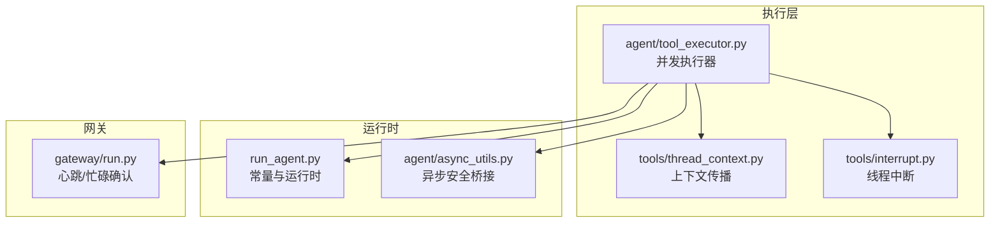
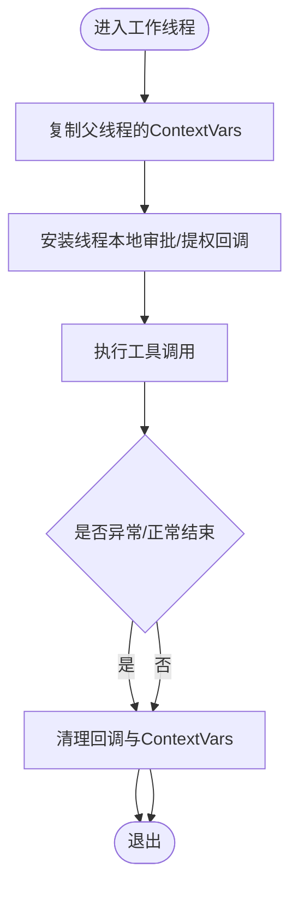
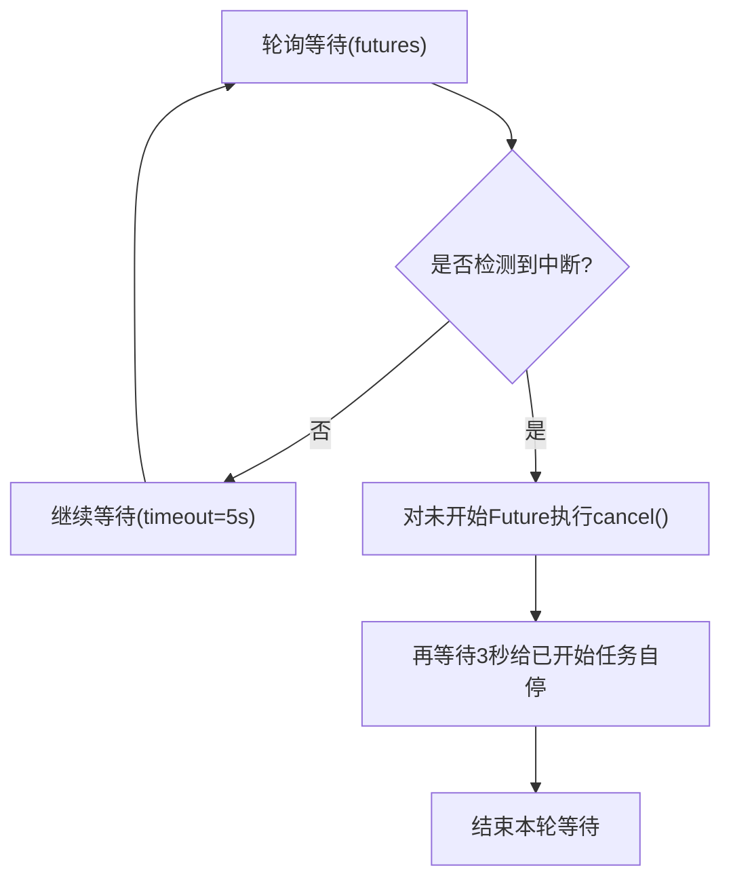
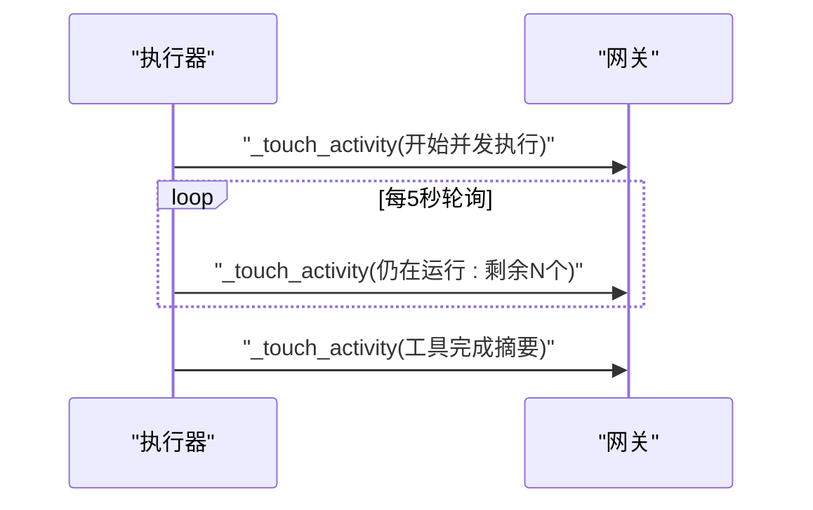
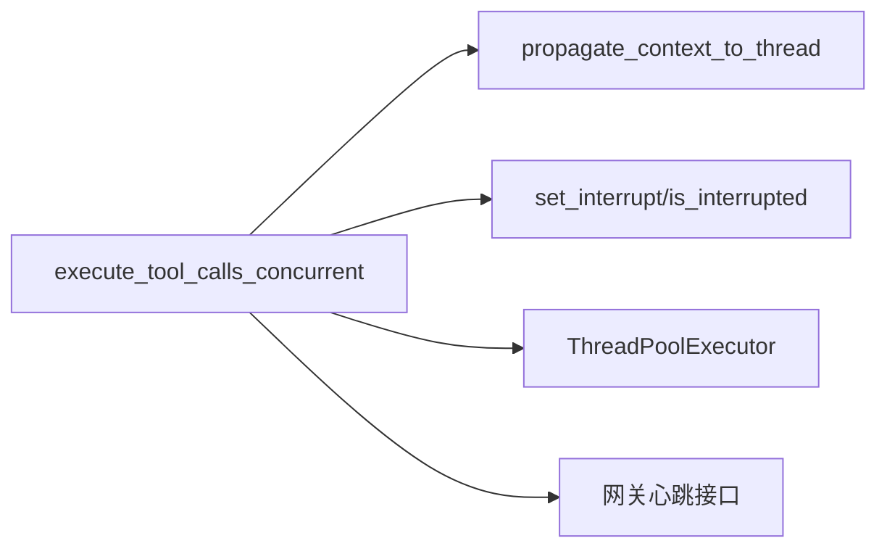

# 并发执行模式

<cite>
**本文引用的文件**
- [agent/tool_executor.py](file://agent/tool_executor.py)
- [tools/thread_context.py](file://tools/thread_context.py)
- [tools/interrupt.py](file://tools/interrupt.py)
- [run_agent.py](file://run_agent.py)
- [agent/async_utils.py](file://agent/async_utils.py)
- [tests/tools/test_interrupt.py](file://tests/tools/test_interrupt.py)
- [tests/run_agent/test_tool_executor_contextvar_propagation.py](file://tests/run_agent/test_tool_executor_contextvar_propagation.py)
- [tests/tools/test_execute_code_approval_cluster.py](file://tests/tools/test_execute_code_approval_cluster.py)
- [gateway/run.py](file://gateway/run.py)
</cite>

## 目录
1. [引言](#引言)
2. [项目结构](#项目结构)
3. [核心组件](#核心组件)
4. [架构总览](#架构总览)
5. [详细组件分析](#详细组件分析)
6. [依赖分析](#依赖分析)
7. [性能考量](#性能考量)
8. [故障排查指南](#故障排查指南)
9. [结论](#结论)

## 引言
本文件系统性阐述并发执行模式的设计与实现，重点围绕 execute_tool_calls_concurrent 函数展开，覆盖线程池管理、任务调度、上下文传播、中断处理、心跳与活动跟踪等主题，并给出可操作的优化建议与最佳实践。

## 项目结构
并发执行相关的核心代码分布在以下模块：
- 执行器：agent/tool_executor.py 提供并发/串行工具调用入口与实现
- 上下文传播：tools/thread_context.py 提供跨线程的 ContextVars 与线程本地回调传播
- 中断信号：tools/interrupt.py 提供线程级中断状态管理
- 常量与运行时：run_agent.py 定义最大并发工作线程数常量
- 异步安全：agent/async_utils.py 提供线程到事件循环的安全调度封装
- 网关心跳：gateway/run.py 提供平台侧的心跳与“忙碌确认”消息



图示来源
- [agent/tool_executor.py:243-768](file://agent/tool_executor.py#L243-L768)
- [tools/thread_context.py:64-121](file://tools/thread_context.py#L64-L121)
- [tools/interrupt.py:39-99](file://tools/interrupt.py#L39-L99)
- [run_agent.py:202-203](file://run_agent.py#L202-L203)
- [agent/async_utils.py:34-69](file://agent/async_utils.py#L34-L69)
- [gateway/run.py:4038-15701](file://gateway/run.py#L4038-L15701)

章节来源
- [agent/tool_executor.py:243-768](file://agent/tool_executor.py#L243-L768)
- [tools/thread_context.py:64-121](file://tools/thread_context.py#L64-L121)
- [tools/interrupt.py:39-99](file://tools/interrupt.py#L39-L99)
- [run_agent.py:202-203](file://run_agent.py#L202-L203)
- [agent/async_utils.py:34-69](file://agent/async_utils.py#L34-L69)
- [gateway/run.py:4038-15701](file://gateway/run.py#L4038-L15701)

## 核心组件
- 并发执行器：负责解析工具调用、预检（拦截/守卫）、并发调度、结果收集与回传、预算与后处理
- 上下文传播器：在工作线程中恢复父线程的 ContextVars 与线程本地审批/提权回调
- 中断管理器：以线程为粒度维护中断位，支持优雅取消与清理
- 心跳与活动跟踪：通过 _touch_activity 持续向网关上报状态，避免被误判为空闲超时

章节来源
- [agent/tool_executor.py:243-768](file://agent/tool_executor.py#L243-L768)
- [tools/thread_context.py:64-121](file://tools/thread_context.py#L64-L121)
- [tools/interrupt.py:39-99](file://tools/interrupt.py#L39-L99)

## 架构总览
并发执行的主流程如下：

```mermaid
sequenceDiagram
participant Caller as "调用方"
participant Exec as "execute_tool_calls_concurrent"
participant Pool as "线程池(ThreadPoolExecutor)"
participant Worker as "工作线程"
participant Ctx as "上下文传播器"
participant Int as "中断管理器"
participant GW as "网关心跳"
Caller->>Exec : "提交工具调用列表"
Exec->>Exec : "预检/拦截/守卫"
Exec->>Pool : "按最小(待执行数, 最大工作线程数)创建线程池"
loop 对每个待执行调用
Exec->>Ctx : "包装目标函数以传播ContextVars与回调"
Exec->>Pool : "executor.submit(传播后的目标)"
end
Pool-->>Exec : "返回Future集合"
loop 轮询等待
Exec->>Pool : "wait(futures, timeout=5s)"
alt 仍有未完成任务
Exec->>Int : "检查全局中断"
alt 已请求中断
Exec->>Pool : "对未开始任务执行cancel()"
Exec->>GW : "周期性心跳上报"
end
else 全部完成
break
end
end
Exec->>Exec : "收集结果并按原始顺序写入消息"
Exec-->>Caller : "返回"
```

图示来源
- [agent/tool_executor.py:553-624](file://agent/tool_executor.py#L553-L624)
- [tools/thread_context.py:64-121](file://tools/thread_context.py#L64-L121)
- [tools/interrupt.py:39-99](file://tools/interrupt.py#L39-L99)
- [gateway/run.py:4038-15701](file://gateway/run.py#L4038-L15701)

## 详细组件分析

### 线程池与任务调度
- 线程池大小
  - 使用常量 _MAX_TOOL_WORKERS 控制最大并发工作线程数，当前值为 8
  - 实际 max_workers 取“待执行调用数量”与“最大线程数”的较小值，避免过度创建
- 任务队列与执行
  - 将“无需拦截/阻塞”的调用加入 runnable_calls 列表
  - 逐个提交至线程池，使用 executor.submit 包装传播后的目标函数
- 结果收集
  - 使用 results 数组按原序保存每个调用的结果，保证 API 返回顺序一致

章节来源
- [agent/tool_executor.py:553-570](file://agent/tool_executor.py#L553-L570)
- [run_agent.py:202-203](file://run_agent.py#L202-L203)

### 任务分配算法与动态调整
- 待执行集筛选
  - 预先过滤掉被拦截/守卫阻断的调用，仅对可执行项分配线程
- 工作线程数计算
  - max_workers = min(待执行数, _MAX_TOOL_WORKERS)，确保资源可控
- 动态调整策略
  - 当待执行数小于最大值时，按实际需求缩小线程池规模，降低上下文切换与内存占用

章节来源
- [agent/tool_executor.py:554-561](file://agent/tool_executor.py#L554-L561)
- [run_agent.py:202-203](file://run_agent.py#L202-L203)

### 线程上下文传播机制（ContextVars 与线程本地回调）
- ContextVars 传播
  - 在提交前调用 propagate_context_to_thread 包装目标函数，复制父线程的 contextvars.Context
- 线程本地回调传播
  - 捕获父线程的审批/提权回调，并在工作线程安装；退出时自动清理，防止回收线程残留引用
- 生命周期保障
  - 通过 finally 块确保回调清空，避免危险命令绕过交互审批或网关通知回调缺失



图示来源
- [tools/thread_context.py:64-121](file://tools/thread_context.py#L64-L121)
- [agent/tool_executor.py:488-490](file://agent/tool_executor.py#L488-L490)

章节来源
- [tools/thread_context.py:64-121](file://tools/thread_context.py#L64-L121)
- [agent/tool_executor.py:488-490](file://agent/tool_executor.py#L488-L490)

### 中断处理：未开始任务取消与已开始任务优雅终止
- 未开始任务取消
  - 若在等待期间检测到中断，对未开始的 Future 调用 cancel()，避免浪费资源
- 已开始任务优雅终止
  - 通过线程级中断位（per-thread）让工具轮询 is_interrupted() 并尽快返回
  - 工作线程在 finally 中清除自身中断位与线程标识，防止回收线程遗留状态
- 测试验证
  - 单元测试覆盖了 BaseException 场景下的清理行为，确保线程集合不泄漏



图示来源
- [agent/tool_executor.py:577-604](file://agent/tool_executor.py#L577-L604)
- [tools/interrupt.py:39-99](file://tools/interrupt.py#L39-L99)
- [tests/tools/test_interrupt.py:248-279](file://tests/tools/test_interrupt.py#L248-L279)

章节来源
- [agent/tool_executor.py:577-604](file://agent/tool_executor.py#L577-L604)
- [tools/interrupt.py:39-99](file://tools/interrupt.py#L39-L99)
- [tests/tools/test_interrupt.py:248-279](file://tests/tools/test_interrupt.py#L248-L279)

### 心跳机制与活动跟踪
- 心跳触发点
  - 执行前设置当前工具名与活动摘要
  - 轮询阶段每约 30 秒更新一次“仍在运行的工具列表”
  - 每个工具完成后上报“已完成”摘要
- 网关侧响应
  - 网关根据心跳间隔与详情生成“忙碌确认”消息，避免因长耗时被判定为空闲超时
- 平台配置
  - 可按平台启用/控制“忙碌确认详情”，平衡可观测性与消息冗余



图示来源
- [agent/tool_executor.py:459-460](file://agent/tool_executor.py#L459-L460)
- [agent/tool_executor.py:606-617](file://agent/tool_executor.py#L606-L617)
- [agent/tool_executor.py:714-715](file://agent/tool_executor.py#L714-L715)
- [gateway/run.py:4038-15701](file://gateway/run.py#L4038-L15701)

章节来源
- [agent/tool_executor.py:459-460](file://agent/tool_executor.py#L459-L460)
- [agent/tool_executor.py:606-617](file://agent/tool_executor.py#L606-L617)
- [agent/tool_executor.py:714-715](file://agent/tool_executor.py#L714-L715)
- [gateway/run.py:4038-15701](file://gateway/run.py#L4038-L15701)

### 代码示例路径（关键算法与实现细节）
- 并发执行入口与线程池创建
  - [agent/tool_executor.py:553-570](file://agent/tool_executor.py#L553-L570)
- 心跳与活动跟踪
  - [agent/tool_executor.py:459-460](file://agent/tool_executor.py#L459-L460)
  - [agent/tool_executor.py:606-617](file://agent/tool_executor.py#L606-L617)
  - [agent/tool_executor.py:714-715](file://agent/tool_executor.py#L714-L715)
- 上下文传播包装
  - [tools/thread_context.py:64-121](file://tools/thread_context.py#L64-L121)
- 线程级中断注册与清理
  - [agent/tool_executor.py:467-478](file://agent/tool_executor.py#L467-L478)
  - [agent/tool_executor.py:539-544](file://agent/tool_executor.py#L539-L544)
- 中断取消与优雅等待
  - [agent/tool_executor.py:591-604](file://agent/tool_executor.py#L591-L604)
- 最大工作线程常量
  - [run_agent.py:202-203](file://run_agent.py#L202-L203)

章节来源
- [agent/tool_executor.py:553-570](file://agent/tool_executor.py#L553-L570)
- [agent/tool_executor.py:459-460](file://agent/tool_executor.py#L459-L460)
- [agent/tool_executor.py:606-617](file://agent/tool_executor.py#L606-L617)
- [agent/tool_executor.py:714-715](file://agent/tool_executor.py#L714-L715)
- [tools/thread_context.py:64-121](file://tools/thread_context.py#L64-L121)
- [agent/tool_executor.py:467-478](file://agent/tool_executor.py#L467-L478)
- [agent/tool_executor.py:539-544](file://agent/tool_executor.py#L539-L544)
- [agent/tool_executor.py:591-604](file://agent/tool_executor.py#L591-L604)
- [run_agent.py:202-203](file://run_agent.py#L202-L203)

## 依赖分析
- 组件耦合
  - execute_tool_calls_concurrent 依赖线程上下文传播器进行环境注入，依赖中断管理器进行线程级取消，依赖网关心跳接口维持活跃状态
- 外部依赖
  - concurrent.futures.ThreadPoolExecutor 提供线程池能力
  - contextvars 提供跨线程上下文传播
  - threading.Lock 用于保护共享状态（如中断集合）



图示来源
- [agent/tool_executor.py:553-570](file://agent/tool_executor.py#L553-L570)
- [tools/thread_context.py:64-121](file://tools/thread_context.py#L64-L121)
- [tools/interrupt.py:39-99](file://tools/interrupt.py#L39-L99)
- [gateway/run.py:4038-15701](file://gateway/run.py#L4038-L15701)

章节来源
- [agent/tool_executor.py:553-570](file://agent/tool_executor.py#L553-L570)
- [tools/thread_context.py:64-121](file://tools/thread_context.py#L64-L121)
- [tools/interrupt.py:39-99](file://tools/interrupt.py#L39-L99)
- [gateway/run.py:4038-15701](file://gateway/run.py#L4038-L15701)

## 性能考量
- 线程池规模
  - 默认上限为 8，适用于多数场景；当工具调用数量较少时自动收缩，减少上下文切换开销
- 结果收集与顺序
  - 使用固定长度数组按索引写入，避免字典查找与无序拼接带来的额外成本
- 心跳频率
  - 5 秒轮询 + 每 30 秒一次汇总心跳，兼顾可观测性与网络负载
- 异步安全
  - 对从工作线程调度协程到事件循环的路径提供安全封装，避免泄漏与警告

章节来源
- [agent/tool_executor.py:553-570](file://agent/tool_executor.py#L553-L570)
- [agent/tool_executor.py:606-617](file://agent/tool_executor.py#L606-L617)
- [agent/async_utils.py:34-69](file://agent/async_utils.py#L34-L69)

## 故障排查指南
- 现象：工具长时间运行被网关判定为空闲并中断
  - 排查要点：确认执行器是否周期性调用 _touch_activity；检查心跳间隔与平台配置
  - 参考路径：[agent/tool_executor.py:606-617](file://agent/tool_executor.py#L606-L617)、[gateway/run.py:4038-15701](file://gateway/run.py#L4038-L15701)
- 现象：危险命令绕过交互审批或网关通知回调缺失
  - 排查要点：确认工作线程是否正确安装并清理线程本地回调；检查传播包装是否生效
  - 参考路径：[tools/thread_context.py:64-121](file://tools/thread_context.py#L64-L121)
- 现象：中断后线程集合泄漏或回收线程残留状态
  - 排查要点：确认 finally 分支是否执行；核对 set_interrupt(false) 是否被调用
  - 参考路径：[agent/tool_executor.py:539-544](file://agent/tool_executor.py#L539-L544)、[tools/interrupt.py:39-99](file://tools/interrupt.py#L39-L99)
- 现象：单元测试中 BaseException 导致清理不彻底
  - 参考测试：[tests/tools/test_interrupt.py:248-279](file://tests/tools/test_interrupt.py#L248-L279)

章节来源
- [agent/tool_executor.py:606-617](file://agent/tool_executor.py#L606-L617)
- [gateway/run.py:4038-15701](file://gateway/run.py#L4038-L15701)
- [tools/thread_context.py:64-121](file://tools/thread_context.py#L64-L121)
- [agent/tool_executor.py:539-544](file://agent/tool_executor.py#L539-L544)
- [tools/interrupt.py:39-99](file://tools/interrupt.py#L39-L99)
- [tests/tools/test_interrupt.py:248-279](file://tests/tools/test_interrupt.py#L248-L279)

## 结论
并发执行模式通过“受控线程池 + 上下文传播 + 线程级中断 + 周期心跳”实现了高吞吐、低耦合且可中断的工具调用执行。默认最大工作线程数为 8，既满足大多数场景的并行度，又避免过度竞争。配合心跳与活动跟踪，可有效规避网关空闲超时问题；通过 finally 清理与单元测试保障，确保在异常路径下也能保持系统稳定。