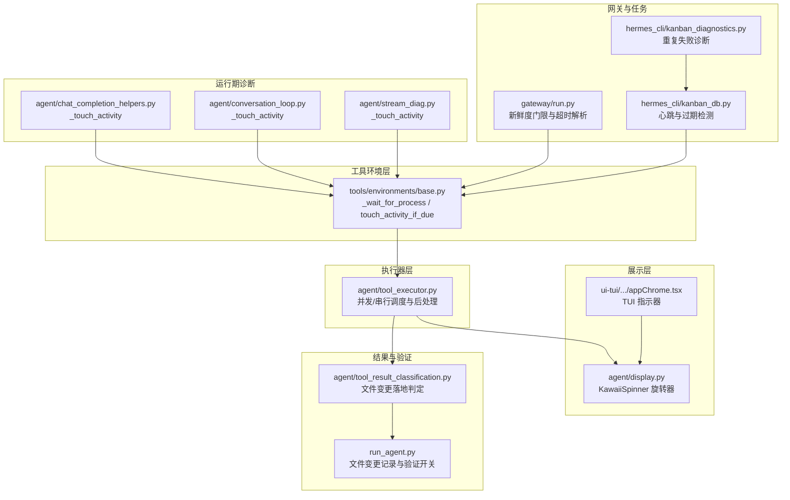
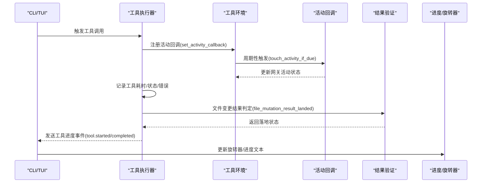
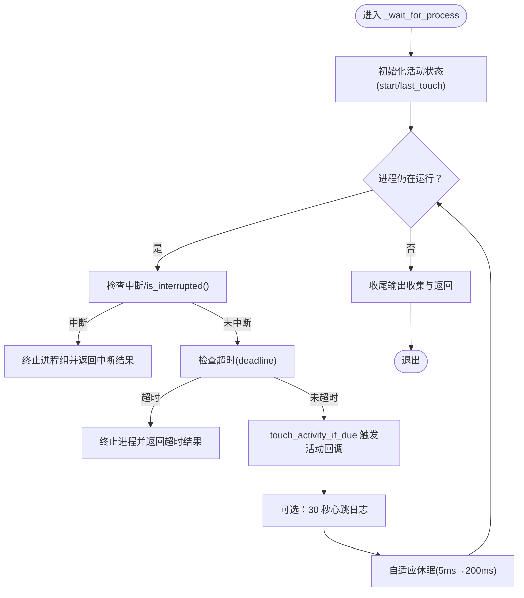
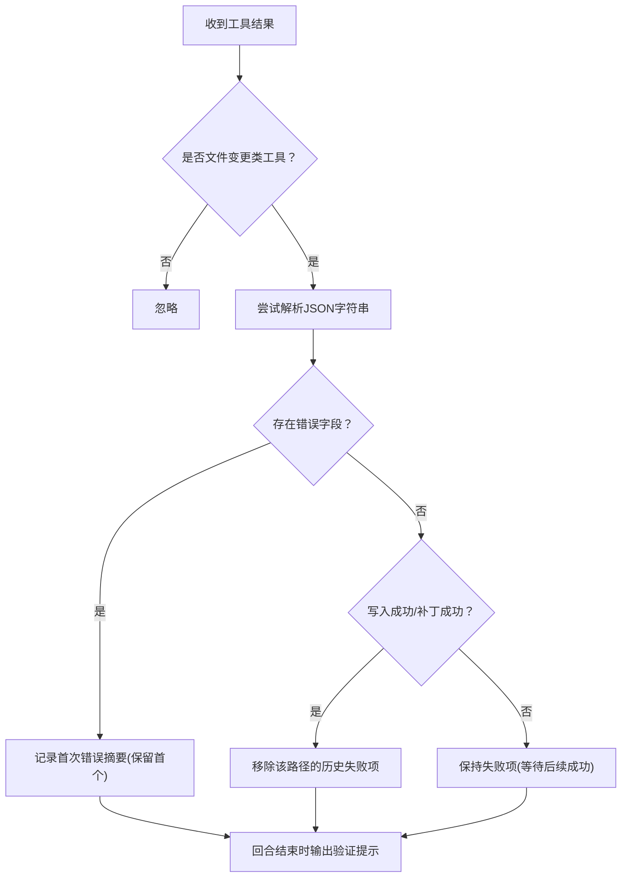
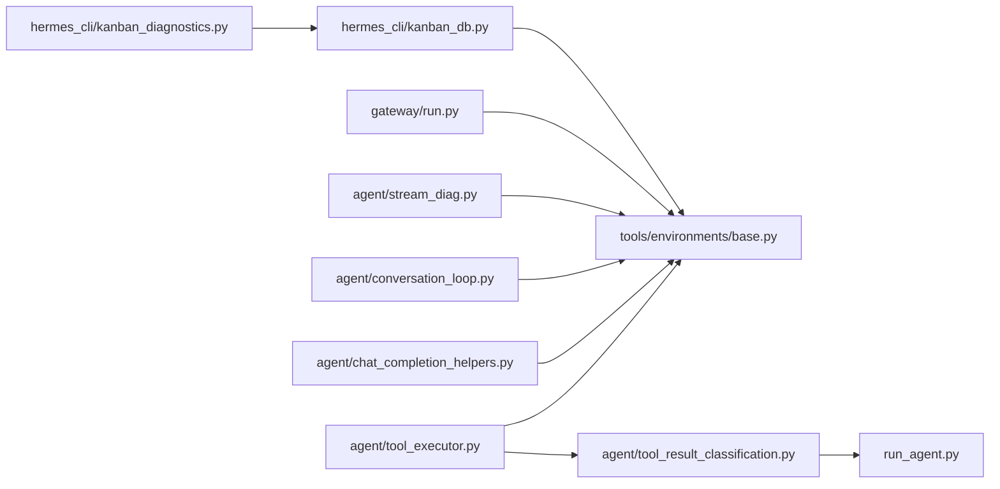

# 执行监控与追踪

<cite>
**本文引用的文件**
- [tools/environments/base.py](file://tools/environments/base.py)
- [agent/tool_executor.py](file://agent/tool_executor.py)
- [agent/display.py](file://agent/display.py)
- [agent/tool_result_classification.py](file://agent/tool_result_classification.py)
- [run_agent.py](file://run_agent.py)
- [hermes_cli/hooks.py](file://hermes_cli/hooks.py)
- [agent/chat_completion_helpers.py](file://agent/chat_completion_helpers.py)
- [agent/conversation_loop.py](file://agent/conversation_loop.py)
- [agent/stream_diag.py](file://agent/stream_diag.py)
- [tools/code_execution_tool.py](file://tools/code_execution_tool.py)
- [gateway/run.py](file://gateway/run.py)
- [hermes_cli/kanban_diagnostics.py](file://hermes_cli/kanban_diagnostics.py)
- [hermes_cli/kanban_db.py](file://hermes_cli/kanban_db.py)
- [ui-tui/src/components/appChrome.tsx](file://ui-tui/src/components/appChrome.tsx)
- [tests/cli/test_tool_progress_scrollback.py](file://tests/cli/test_tool_progress_scrollback.py)
</cite>

## 目录
1. [简介](#简介)
2. [项目结构](#项目结构)
3. [核心组件](#核心组件)
4. [架构总览](#架构总览)
5. [详细组件分析](#详细组件分析)
6. [依赖关系分析](#依赖关系分析)
7. [性能考量](#性能考量)
8. [故障排查指南](#故障排查指南)
9. [结论](#结论)
10. [附录](#附录)

## 简介
本文件系统化梳理“执行监控与追踪”体系，围绕以下主题展开：活动跟踪与状态更新（含 _touch_activity 使用）、心跳与网关超时防护、工具执行结果记录与验证（文件变更落地校验）、执行时间统计与性能监控（单工具与总耗时）、错误检测与日志记录、执行进度可视化反馈（CLI 旋转器与详细进度）。文档在每个涉及具体实现的章节均给出“章节来源”，并在需要时提供“图示来源”。

## 项目结构
监控与追踪贯穿工具执行链路的多个层次：
- 工具环境层：统一的进程等待循环与活动回调注册，用于心跳与超时控制
- 执行器层：并发/串行工具调度、结果后处理与中间件钩子
- 展示层：CLI 旋转器与进度文本更新
- 结果分类与验证：文件变更类工具的结果落地判定
- 运行期诊断：API 流式响应、对话轮次等场景的活动触达
- 网关与任务调度：超时检测、断路器与恢复策略

**图示来源**
- [tools/environments/base.py:483-760](file://tools/environments/base.py#L483-L760)
- [agent/tool_executor.py:1-200](file://agent/tool_executor.py#L1-L200)
- [agent/display.py:597-800](file://agent/display.py#L597-L800)
- [agent/tool_result_classification.py:1-27](file://agent/tool_result_classification.py#L1-L27)
- [run_agent.py:2486-2600](file://run_agent.py#L2486-L2600)
- [agent/chat_completion_helpers.py:355-368](file://agent/chat_completion_helpers.py#L355-L368)
- [agent/conversation_loop.py:576-580](file://agent/conversation_loop.py#L576-L580)
- [agent/stream_diag.py:264-264](file://agent/stream_diag.py#L264-L264)
- [gateway/run.py:544-581](file://gateway/run.py#L544-L581)
- [hermes_cli/kanban_db.py:5303-5312](file://hermes_cli/kanban_db.py#L5303-L5312)
- [hermes_cli/kanban_diagnostics.py:591-622](file://hermes_cli/kanban_diagnostics.py#L591-L622)
- [ui-tui/src/components/appChrome.tsx:62-97](file://ui-tui/src/components/appChrome.tsx#L62-L97)

**章节来源**
- [tools/environments/base.py:483-760](file://tools/environments/base.py#L483-L760)
- [agent/tool_executor.py:1-200](file://agent/tool_executor.py#L1-L200)
- [agent/display.py:597-800](file://agent/display.py#L597-L800)
- [agent/tool_result_classification.py:1-27](file://agent/tool_result_classification.py#L1-L27)
- [run_agent.py:2486-2600](file://run_agent.py#L2486-L2600)
- [agent/chat_completion_helpers.py:355-368](file://agent/chat_completion_helpers.py#L355-L368)
- [agent/conversation_loop.py:576-580](file://agent/conversation_loop.py#L576-L580)
- [agent/stream_diag.py:264-264](file://agent/stream_diag.py#L264-L264)
- [gateway/run.py:544-581](file://gateway/run.py#L544-L581)
- [hermes_cli/kanban_db.py:5303-5312](file://hermes_cli/kanban_db.py#L5303-L5312)
- [hermes_cli/kanban_diagnostics.py:591-622](file://hermes_cli/kanban_diagnostics.py#L591-L622)
- [ui-tui/src/components/appChrome.tsx:62-97](file://ui-tui/src/components/appChrome.tsx#L62-L97)

## 核心组件
- 活动回调与心跳
  - 在工具环境层，通过线程局部存储注册活动回调，并在进程等待循环中周期性触发，以向网关报告存活状态，避免因长时间无活动导致的超时中断。
  - 关键实现路径：[tools/environments/base.py:46-78](file://tools/environments/base.py#L46-L78)、[tools/environments/base.py:483-760](file://tools/environments/base.py#L483-L760)

- 执行器与结果后处理
  - 并发/串行工具调度，记录工具耗时、状态与错误类型，触发后置钩子以便外部观测。
  - 关键实现路径：[agent/tool_executor.py:61-133](file://agent/tool_executor.py#L61-L133)

- 文件变更结果验证
  - 对写文件/补丁工具的结果进行“是否真正落地”的判定；在回合结束时汇总未成功修改的文件路径与首次错误摘要，作为用户可见的验证提示。
  - 关键实现路径：[agent/tool_result_classification.py:12-26](file://agent/tool_result_classification.py#L12-L26)、[run_agent.py:2486-2600](file://run_agent.py#L2486-L2600)

- CLI 进度与旋转器
  - 提供带表情与计时的旋转器动画，以及工具开始/完成事件驱动的进度文本更新。
  - 关键实现路径：[agent/display.py:597-800](file://agent/display.py#L597-L800)、[tests/cli/test_tool_progress_scrollback.py:134-161](file://tests/cli/test_tool_progress_scrollback.py#L134-L161)、[ui-tui/src/components/appChrome.tsx:62-97](file://ui-tui/src/components/appChrome.tsx#L62-L97)

- 网关超时与新鲜度门限
  - 解析环境变量中的超时与新鲜度阈值，提供“是否为新近中断”的判断逻辑，避免误判旧会话。
  - 关键实现路径：[gateway/run.py:544-581](file://gateway/run.py#L544-L581)

**章节来源**
- [tools/environments/base.py:46-78](file://tools/environments/base.py#L46-L78)
- [tools/environments/base.py:483-760](file://tools/environments/base.py#L483-L760)
- [agent/tool_executor.py:61-133](file://agent/tool_executor.py#L61-L133)
- [agent/tool_result_classification.py:12-26](file://agent/tool_result_classification.py#L12-L26)
- [run_agent.py:2486-2600](file://run_agent.py#L2486-L2600)
- [agent/display.py:597-800](file://agent/display.py#L597-L800)
- [tests/cli/test_tool_progress_scrollback.py:134-161](file://tests/cli/test_tool_progress_scrollback.py#L134-L161)
- [ui-tui/src/components/appChrome.tsx:62-97](file://ui-tui/src/components/appChrome.tsx#L62-L97)
- [gateway/run.py:544-581](file://gateway/run.py#L544-L581)

## 架构总览
下图展示了从工具调用到结果呈现的监控与追踪路径，强调活动触达、心跳、结果验证与进度反馈。

**图示来源**
- [tools/environments/base.py:46-78](file://tools/environments/base.py#L46-L78)
- [tools/environments/base.py:483-760](file://tools/environments/base.py#L483-L760)
- [agent/tool_executor.py:61-133](file://agent/tool_executor.py#L61-L133)
- [agent/tool_result_classification.py:12-26](file://agent/tool_result_classification.py#L12-L26)
- [agent/display.py:597-800](file://agent/display.py#L597-L800)

## 详细组件分析

### 活动跟踪与状态更新（_touch_activity 与心跳）
- 设计要点
  - 通过线程局部存储注册活动回调，确保在长轮询期间能周期性上报“我还活着”。该回调携带“已耗时秒数”标签，便于网关侧定位卡点。
  - 在工具环境的等待循环中，每轮检查中断、超时与活动回调；同时在调试模式下输出心跳日志，辅助定位“未感知中断”的问题。
- 关键流程
  - 注册回调：set_activity_callback
  - 周期上报：touch_activity_if_due（默认约 10 秒）
  - 循环内调用：_wait_for_process 中的活动触达与心跳日志
- 代码示例路径
  - 回调注册与周期上报：[tools/environments/base.py:46-78](file://tools/environments/base.py#L46-L78)
  - 长轮询中的活动触达与心跳日志：[tools/environments/base.py:687-706](file://tools/environments/base.py#L687-L706)

**图示来源**
- [tools/environments/base.py:483-760](file://tools/environments/base.py#L483-L760)

**章节来源**
- [tools/environments/base.py:46-78](file://tools/environments/base.py#L46-L78)
- [tools/environments/base.py:483-760](file://tools/environments/base.py#L483-L760)

### 心跳机制与网关超时防护
- 环境变量与新鲜度门限
  - 支持从环境变量读取“自动继续新鲜度”阈值，用于判断“是否为新近中断”，避免对旧会话误判。
  - 关键实现路径：[gateway/run.py:544-581](file://gateway/run.py#L544-L581)
- 任务级心跳与过期检测
  - 数据库层维护任务运行状态，若任务长时间未发送心跳或超过最大运行时长，则标记为超时并记录事件，同时可能触发断路器。
  - 关键实现路径：[hermes_cli/kanban_db.py:5303-5312](file://hermes_cli/kanban_db.py#L5303-L5312)
- 子代理超时诊断
  - 当子代理在发起任何 API 调用前即超时，会输出诊断信息帮助定位。
  - 关键实现路径：[agent/tool_executor.py:1675-1702](file://agent/tool_executor.py#L1675-L1702)

**章节来源**
- [gateway/run.py:544-581](file://gateway/run.py#L544-L581)
- [hermes_cli/kanban_db.py:5303-5312](file://hermes_cli/kanban_db.py#L5303-L5312)
- [agent/tool_executor.py:1675-1702](file://agent/tool_executor.py#L1675-L1702)

### 工具执行结果记录与验证（文件变更）
- 结果判定
  - 对写文件/补丁工具，仅当返回 JSON 包含“字节数/成功标志”且无错误字段时，视为“已落地”。
  - 关键实现路径：[agent/tool_result_classification.py:12-26](file://agent/tool_result_classification.py#L12-L26)
- 回合级验证
  - 在回合结束时，记录所有未落地的文件路径及其首次错误摘要；若后续同一路径出现成功结果则清除对应条目。
  - 可通过配置/环境变量开启/关闭该验证器。
  - 关键实现路径：[run_agent.py:2486-2600](file://run_agent.py#L2486-L2600)
- 钩子与 CLI 行为
  - CLI 在工具完成后打印“退出码”等信息；测试覆盖了工具开始/完成事件对旋转器与计时的影响。
  - 关键实现路径：[hermes_cli/hooks.py:358-383](file://hermes_cli/hooks.py#L358-L383)、[tests/cli/test_tool_progress_scrollback.py:134-161](file://tests/cli/test_tool_progress_scrollback.py#L134-L161)

**图示来源**
- [agent/tool_result_classification.py:12-26](file://agent/tool_result_classification.py#L12-L26)
- [run_agent.py:2486-2600](file://run_agent.py#L2486-L2600)

**章节来源**
- [agent/tool_result_classification.py:12-26](file://agent/tool_result_classification.py#L12-L26)
- [run_agent.py:2486-2600](file://run_agent.py#L2486-L2600)
- [hermes_cli/hooks.py:358-383](file://hermes_cli/hooks.py#L358-L383)
- [tests/cli/test_tool_progress_scrollback.py:134-161](file://tests/cli/test_tool_progress_scrollback.py#L134-L161)

### 执行时间统计与性能监控
- 单工具耗时
  - 执行器在工具完成后计算毫秒级耗时，并通过后置钩子上报，便于外部观测与聚合。
  - 关键实现路径：[agent/tool_executor.py:61-133](file://agent/tool_executor.py#L61-L133)
- 总耗时与流式响应
  - 对非流式与流式 API 响应等待阶段分别进行活动触达，有助于在长轮询中维持会话活性。
  - 关键实现路径：[agent/chat_completion_helpers.py:355-368](file://agent/chat_completion_helpers.py#L355-L368)、[agent/chat_completion_helpers.py:1824-1861](file://agent/chat_completion_helpers.py#L1824-L1861)、[agent/stream_diag.py:264-264](file://agent/stream_diag.py#L264-L264)
- 代码执行工具的长耗时保护
  - 在长时间代码执行过程中，周期性调用活动触达以防止网关因“无活动”而中断。
  - 关键实现路径：[tools/code_execution_tool.py:1378-1400](file://tools/code_execution_tool.py#L1378-L1400)

**章节来源**
- [agent/tool_executor.py:61-133](file://agent/tool_executor.py#L61-L133)
- [agent/chat_completion_helpers.py:355-368](file://agent/chat_completion_helpers.py#L355-L368)
- [agent/chat_completion_helpers.py:1824-1861](file://agent/chat_completion_helpers.py#L1824-L1861)
- [agent/stream_diag.py:264-264](file://agent/stream_diag.py#L264-L264)
- [tools/code_execution_tool.py:1378-1400](file://tools/code_execution_tool.py#L1378-L1400)

### 错误检测与日志记录
- 工具错误识别
  - CLI 钩子在执行外部脚本时，对超时与错误进行分类输出；工具执行器在取消时构造标准错误结果并上报。
  - 关键实现路径：[hermes_cli/hooks.py:361-383](file://hermes_cli/hooks.py#L361-L383)、[agent/tool_executor.py:96-133](file://agent/tool_executor.py#L96-L133)
- 重复失败诊断
  - 任务连续失败时，生成严重级别与诊断建议，包含最近一次错误摘要与恢复动作。
  - 关键实现路径：[hermes_cli/kanban_diagnostics.py:591-622](file://hermes_cli/kanban_diagnostics.py#L591-L622)

**章节来源**
- [hermes_cli/hooks.py:361-383](file://hermes_cli/hooks.py#L361-L383)
- [agent/tool_executor.py:96-133](file://agent/tool_executor.py#L96-L133)
- [hermes_cli/kanban_diagnostics.py:591-622](file://hermes_cli/kanban_diagnostics.py#L591-L622)

### 执行进度可视化反馈（CLI 旋转器与详细进度）
- 旋转器
  - 提供多种动画风格与表情，支持在 TTY 与非 TTY 场景下差异化行为；在 TUI 上由专用组件渲染指示器。
  - 关键实现路径：[agent/display.py:597-800](file://agent/display.py#L597-L800)、[ui-tui/src/components/appChrome.tsx:62-97](file://ui-tui/src/components/appChrome.tsx#L62-L97)
- 详细进度
  - 工具开始/完成事件会更新旋转器文本与计时器，测试覆盖了事件驱动的行为。
  - 关键实现路径：[tests/cli/test_tool_progress_scrollback.py:134-161](file://tests/cli/test_tool_progress_scrollback.py#L134-L161)

**章节来源**
- [agent/display.py:597-800](file://agent/display.py#L597-L800)
- [ui-tui/src/components/appChrome.tsx:62-97](file://ui-tui/src/components/appChrome.tsx#L62-L97)
- [tests/cli/test_tool_progress_scrollback.py:134-161](file://tests/cli/test_tool_progress_scrollback.py#L134-L161)

## 依赖关系分析
- 组件耦合
  - 工具环境层与执行器层通过“活动回调”解耦：执行器不关心回调如何实现，只负责在合适时机触发。
  - 结果验证依赖于“文件变更工具名集合”与“结果 JSON 字段约定”，降低对上层业务的侵入。
- 外部集成
  - 网关层通过环境变量与健康探测参与新鲜度与超时判定；任务调度层通过数据库事件记录与断路器策略保障稳定性。

**图示来源**
- [agent/tool_executor.py:1-200](file://agent/tool_executor.py#L1-L200)
- [tools/environments/base.py:483-760](file://tools/environments/base.py#L483-L760)
- [agent/tool_result_classification.py:1-27](file://agent/tool_result_classification.py#L1-L27)
- [run_agent.py:2486-2600](file://run_agent.py#L2486-L2600)
- [agent/chat_completion_helpers.py:355-368](file://agent/chat_completion_helpers.py#L355-L368)
- [agent/conversation_loop.py:576-580](file://agent/conversation_loop.py#L576-L580)
- [agent/stream_diag.py:264-264](file://agent/stream_diag.py#L264-L264)
- [gateway/run.py:544-581](file://gateway/run.py#L544-L581)
- [hermes_cli/kanban_db.py:5303-5312](file://hermes_cli/kanban_db.py#L5303-L5312)
- [hermes_cli/kanban_diagnostics.py:591-622](file://hermes_cli/kanban_diagnostics.py#L591-L622)

**章节来源**
- [agent/tool_executor.py:1-200](file://agent/tool_executor.py#L1-L200)
- [tools/environments/base.py:483-760](file://tools/environments/base.py#L483-L760)
- [agent/tool_result_classification.py:1-27](file://agent/tool_result_classification.py#L1-L27)
- [run_agent.py:2486-2600](file://run_agent.py#L2486-L2600)
- [agent/chat_completion_helpers.py:355-368](file://agent/chat_completion_helpers.py#L355-L368)
- [agent/conversation_loop.py:576-580](file://agent/conversation_loop.py#L576-L580)
- [agent/stream_diag.py:264-264](file://agent/stream_diag.py#L264-L264)
- [gateway/run.py:544-581](file://gateway/run.py#L544-L581)
- [hermes_cli/kanban_db.py:5303-5312](file://hermes_cli/kanban_db.py#L5303-L5312)
- [hermes_cli/kanban_diagnostics.py:591-622](file://hermes_cli/kanban_diagnostics.py#L591-L622)

## 性能考量
- 自适应轮询
  - 工具环境等待循环采用“5ms→200ms”指数退避策略，短命令快速返回、长命令稳态开销一致，减少轮询 CPU 占用。
  - 关键实现路径：[tools/environments/base.py:708-718](file://tools/environments/base.py#L708-L718)
- 活动回调节流
  - 默认约 10 秒一次的活动上报，避免过于频繁的心跳造成额外负载。
  - 关键实现路径：[tools/environments/base.py:55-78](file://tools/environments/base.py#L55-L78)
- 输出收集与解码
  - 使用增量 UTF-8 解码器与非阻塞 select/读取，避免大输出阻塞与内存压力。
  - 关键实现路径：[tools/environments/base.py:525-624](file://tools/environments/base.py#L525-L624)

**章节来源**
- [tools/environments/base.py:525-624](file://tools/environments/base.py#L525-L624)
- [tools/environments/base.py:708-718](file://tools/environments/base.py#L708-L718)
- [tools/environments/base.py:55-78](file://tools/environments/base.py#L55-L78)

## 故障排查指南
- 未感知中断
  - 启用调试日志（HERMES_DEBUG_INTERRUPT=1）观察心跳与中断状态变化，定位“回调丢失”或“轮询被阻塞”问题。
  - 关键实现路径：[tools/environments/base.py:634-706](file://tools/environments/base.py#L634-L706)
- 工具执行超时
  - 检查 CLI 钩子与执行器的超时输出；确认环境变量中的超时阈值与新鲜度门限设置。
  - 关键实现路径：[hermes_cli/hooks.py:361-383](file://hermes_cli/hooks.py#L361-L383)、[gateway/run.py:544-581](file://gateway/run.py#L544-L581)
- 子代理零 API 调用超时
  - 查看诊断输出，定位启动/初始化阶段的问题。
  - 关键实现路径：[agent/tool_executor.py:1675-1702](file://agent/tool_executor.py#L1675-L1702)
- 文件变更未落地
  - 根据回合级验证提示，结合首次错误摘要定位问题；必要时启用更严格的验证器。
  - 关键实现路径：[run_agent.py:2486-2600](file://run_agent.py#L2486-L2600)、[agent/tool_result_classification.py:12-26](file://agent/tool_result_classification.py#L12-L26)

**章节来源**
- [tools/environments/base.py:634-706](file://tools/environments/base.py#L634-L706)
- [hermes_cli/hooks.py:361-383](file://hermes_cli/hooks.py#L361-L383)
- [gateway/run.py:544-581](file://gateway/run.py#L544-L581)
- [agent/tool_executor.py:1675-1702](file://agent/tool_executor.py#L1675-L1702)
- [run_agent.py:2486-2600](file://run_agent.py#L2486-L2600)
- [agent/tool_result_classification.py:12-26](file://agent/tool_result_classification.py#L12-L26)

## 结论
本监控与追踪体系通过“活动回调+心跳”保证长耗时工具不会被网关误判为超时；通过“结果落地判定+回合级验证”提升文件变更类工具的可靠性；借助“自适应轮询+节流心跳”平衡性能与可观测性；配合“CLI 旋转器与详细进度”提供良好的交互体验。整体设计在保证稳定性的前提下，尽量降低对业务逻辑的侵入。

## 附录
- 相关实现路径速览
  - 活动回调注册与周期上报：[tools/environments/base.py:46-78](file://tools/environments/base.py#L46-L78)
  - 长轮询中的活动触达与心跳日志：[tools/environments/base.py:687-706](file://tools/environments/base.py#L687-L706)
  - 工具耗时与后置钩子：[agent/tool_executor.py:61-133](file://agent/tool_executor.py#L61-L133)
  - 文件变更落地判定：[agent/tool_result_classification.py:12-26](file://agent/tool_result_classification.py#L12-L26)
  - 回合级验证与开关：[run_agent.py:2486-2600](file://run_agent.py#L2486-L2600)
  - CLI 旋转器与进度事件：[agent/display.py:597-800](file://agent/display.py#L597-L800)、[tests/cli/test_tool_progress_scrollback.py:134-161](file://tests/cli/test_tool_progress_scrollback.py#L134-L161)
  - 新鲜度门限与超时解析：[gateway/run.py:544-581](file://gateway/run.py#L544-L581)
  - 任务心跳与过期检测：[hermes_cli/kanban_db.py:5303-5312](file://hermes_cli/kanban_db.py#L5303-L5312)
  - 重复失败诊断：[hermes_cli/kanban_diagnostics.py:591-622](file://hermes_cli/kanban_diagnostics.py#L591-L622)