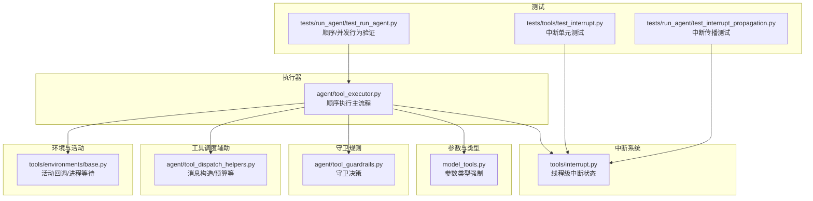
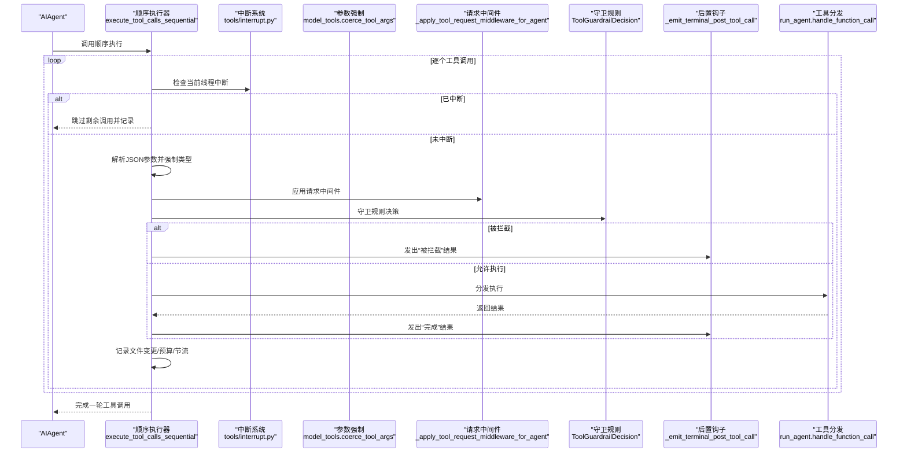
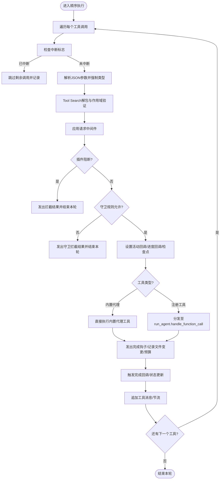
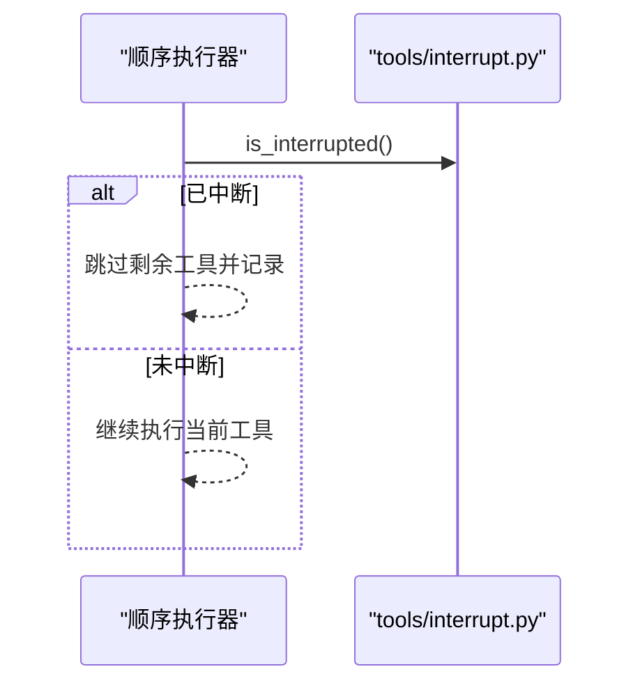
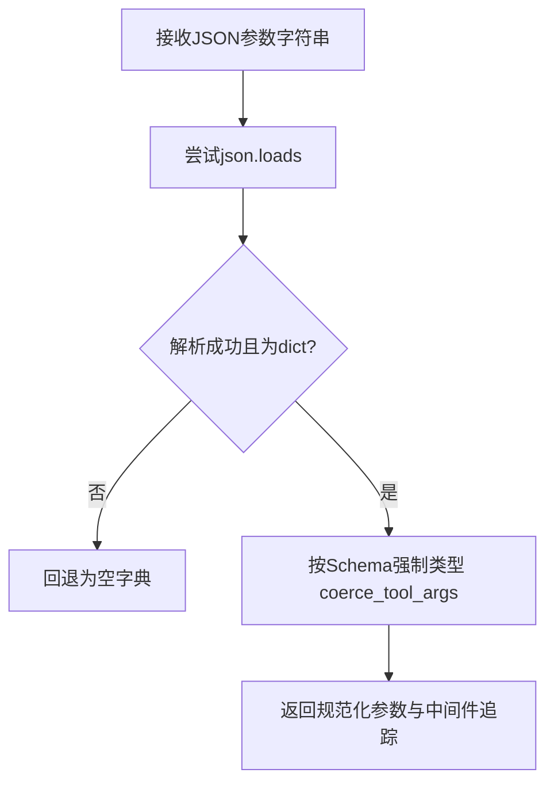
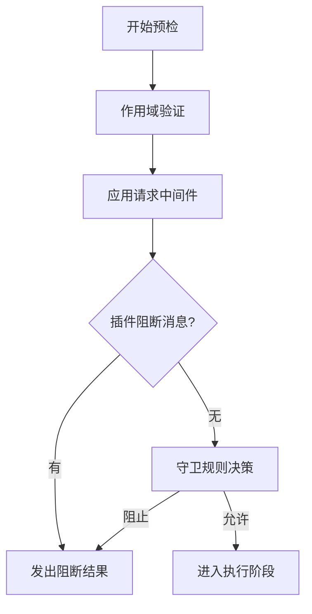
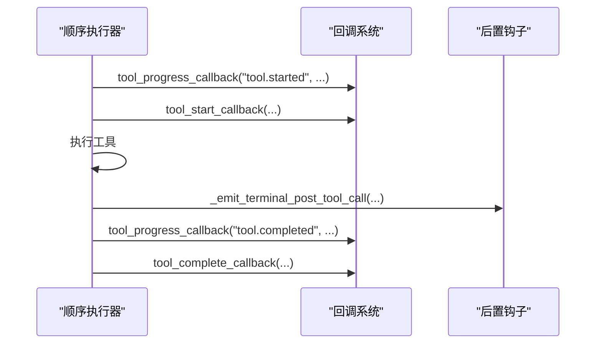
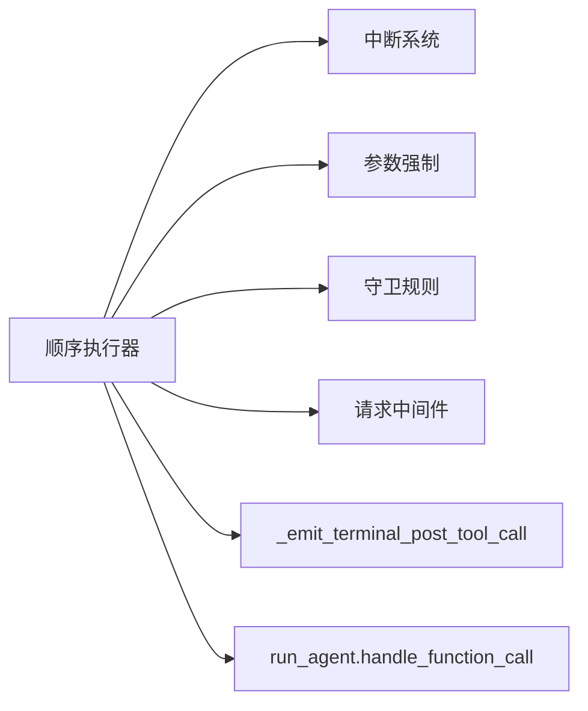

# 顺序执行模式

<cite>
**本文引用的文件**
- [agent/tool_executor.py](file://agent/tool_executor.py)
- [tools/interrupt.py](file://tools/interrupt.py)
- [tests/run_agent/test_run_agent.py](file://tests/run_agent/test_run_agent.py)
- [model_tools.py](file://model_tools.py)
- [agent/tool_guardrails.py](file://agent/tool_guardrails.py)
- [agent/tool_dispatch_helpers.py](file://agent/tool_dispatch_helpers.py)
- [tools/environments/base.py](file://tools/environments/base.py)
- [tests/tools/test_interrupt.py](file://tests/tools/test_interrupt.py)
- [tests/run_agent/test_interrupt_propagation.py](file://tests/run_agent/test_interrupt_propagation.py)
</cite>

## 目录
1. [简介](#简介)
2. [项目结构](#项目结构)
3. [核心组件](#核心组件)
4. [架构总览](#架构总览)
5. [详细组件分析](#详细组件分析)
6. [依赖关系分析](#依赖关系分析)
7. [性能考量](#性能考量)
8. [故障排查指南](#故障排查指南)
9. [结论](#结论)
10. [附录](#附录)

## 简介
本文件系统性阐述顺序执行模式（execute_tool_calls_sequential）的技术实现，重点覆盖以下方面：
- 单个工具调用的逐个执行机制与控制流
- 用户中断检查的时机、策略与线程安全保证
- 工具调用参数从JSON字符串到字典对象的解析、类型校验与容错
- 执行前的预检流程：作用域验证、中间件处理、守卫规则拦截
- 执行过程中的进度反馈与状态更新机制
- 关键算法与实现细节的代码路径定位
- 性能考虑与最佳实践

## 项目结构
围绕顺序执行模式的核心代码位于 agent 模块的工具执行器中，配合中断系统、参数类型强制、守卫规则、结果持久化等子系统协同工作。

图示来源
- [agent/tool_executor.py:770-1420](file://agent/tool_executor.py#L770-L1420)
- [tools/interrupt.py:33-98](file://tools/interrupt.py#L33-L98)
- [model_tools.py:619-806](file://model_tools.py#L619-L806)
- [agent/tool_guardrails.py:141-184](file://agent/tool_guardrails.py#L141-L184)
- [agent/tool_dispatch_helpers.py:32-46](file://agent/tool_dispatch_helpers.py#L32-L46)
- [tools/environments/base.py:619-654](file://tools/environments/base.py#L619-L654)
- [tests/run_agent/test_run_agent.py:2360-2559](file://tests/run_agent/test_run_agent.py#L2360-L2559)
- [tests/tools/test_interrupt.py:1-47](file://tests/tools/test_interrupt.py#L1-L47)
- [tests/run_agent/test_interrupt_propagation.py:134-244](file://tests/run_agent/test_interrupt_propagation.py#L134-L244)

章节来源
- [agent/tool_executor.py:1-200](file://agent/tool_executor.py#L1-L200)
- [agent/tool_executor.py:770-1420](file://agent/tool_executor.py#L770-L1420)

## 核心组件
- 顺序执行主函数：execute_tool_calls_sequential
- 中断系统：线程级中断状态管理与传播
- 参数解析与类型强制：JSON字符串到字典并按Schema强制类型
- 守卫规则：执行前的策略拦截与告警
- 预检与中间件：作用域验证、插件钩子、中间件链
- 进度与状态：开始/完成回调、后置钩子、预算与节流

章节来源
- [agent/tool_executor.py:770-1420](file://agent/tool_executor.py#L770-L1420)
- [tools/interrupt.py:33-98](file://tools/interrupt.py#L33-L98)
- [model_tools.py:619-806](file://model_tools.py#L619-L806)
- [agent/tool_guardrails.py:141-184](file://agent/tool_guardrails.py#L141-L184)
- [agent/tool_dispatch_helpers.py:32-46](file://agent/tool_dispatch_helpers.py#L32-L46)

## 架构总览
顺序执行模式将一次消息中的多个工具调用串行执行，确保：
- 每次仅有一个工具处于活跃状态，避免资源竞争
- 在每次工具执行前进行中断检查，保证用户可随时终止后续调用
- 对参数进行严格解析与类型强制，提升鲁棒性
- 通过中间件与守卫规则在执行前完成权限与策略校验
- 提供统一的进度与状态上报，便于前端与网关展示

图示来源
- [agent/tool_executor.py:770-1420](file://agent/tool_executor.py#L770-L1420)
- [tools/interrupt.py:62-70](file://tools/interrupt.py#L62-L70)
- [model_tools.py:619-806](file://model_tools.py#L619-L806)
- [agent/tool_guardrails.py:141-184](file://agent/tool_guardrails.py#L141-L184)
- [agent/tool_dispatch_helpers.py:61-94](file://agent/tool_dispatch_helpers.py#L61-L94)

## 详细组件分析

### 顺序执行主流程（execute_tool_calls_sequential）
- 控制流要点
  - 遍历 assistant_message.tool_calls，按序执行
  - 每次工具执行前检查 agent._interrupt_requested；若已中断则跳过剩余调用并记录
  - 参数解析：尝试json.loads，失败或非dict时回退为空字典
  - Tool Search解包：对工具搜索调用进行作用域验证后再解包为底层工具
  - 请求中间件：应用插件中间件链，返回中间件追踪
  - 插件与守卫规则：先检查插件阻断消息，再评估守卫规则决策
  - 执行前准备：设置活动回调、触发tool_progress_callback与tool_start_callback
  - 文件变更保护：对写文件/补丁/终端命令进行快照检查点
  - 执行阶段：根据工具类型走内置代理工具路径或分发至run_agent.handle_function_call
  - 结果处理：持久化、子目录提示、内容归一化、追加工具消息
  - 进度与状态：完成后触发tool_progress_callback与tool_complete_callback
  - 节流与预算：每轮结束后执行回合预算与/steer注入

图示来源
- [agent/tool_executor.py:770-1420](file://agent/tool_executor.py#L770-L1420)

章节来源
- [agent/tool_executor.py:770-1420](file://agent/tool_executor.py#L770-L1420)

### 中断检查与策略
- 时机
  - 每个工具执行前检查 agent._interrupt_requested
  - 若已中断，立即跳过剩余调用并生成“取消/跳过”消息
- 线程安全
  - 使用线程级中断状态（tools/interrupt.py），不同线程互不干扰
  - 支持目标线程设置/清除中断，避免误伤其他线程
- 传播与绑定
  - 测试覆盖了中断在执行线程上的绑定与传播，确保只影响目标线程

图示来源
- [tools/interrupt.py:62-70](file://tools/interrupt.py#L62-L70)
- [agent/tool_executor.py:776-790](file://agent/tool_executor.py#L776-L790)
- [tests/tools/test_interrupt.py:19-28](file://tests/tools/test_interrupt.py#L19-L28)
- [tests/run_agent/test_interrupt_propagation.py:134-244](file://tests/run_agent/test_interrupt_propagation.py#L134-L244)

章节来源
- [tools/interrupt.py:33-98](file://tools/interrupt.py#L33-L98)
- [agent/tool_executor.py:770-800](file://agent/tool_executor.py#L770-L800)
- [tests/tools/test_interrupt.py:1-47](file://tests/tools/test_interrupt.py#L1-L47)
- [tests/run_agent/test_interrupt_propagation.py:134-244](file://tests/run_agent/test_interrupt_propagation.py#L134-L244)

### 工具调用参数解析与验证
- JSON解析与回退
  - 尝试json.loads(tool_call.function.arguments)
  - 解析失败或结果非dict时回退为空字典，避免后续执行异常
- 类型强制
  - 使用model_tools.coerce_tool_args按Schema强制类型，处理字符串数字/布尔/数组包裹等常见问题
- 作用域验证（Tool Search）
  - 对工具搜索调用进行解包，验证底层工具是否在会话作用域内
  - 不在作用域内则阻断并给出明确错误信息

图示来源
- [agent/tool_executor.py:793-827](file://agent/tool_executor.py#L793-L827)
- [model_tools.py:619-806](file://model_tools.py#L619-L806)
- [agent/tool_executor.py:804-820](file://agent/tool_executor.py#L804-L820)

章节来源
- [agent/tool_executor.py:793-827](file://agent/tool_executor.py#L793-L827)
- [model_tools.py:619-806](file://model_tools.py#L619-L806)

### 执行前预检流程（作用域、中间件、守卫规则）
- 作用域验证
  - Tool Search解包后再次核验底层工具是否在会话可用工具集中
- 请求中间件
  - 应用插件请求中间件，支持参数改写与审计追踪
- 守卫规则
  - before_call返回ToolGuardrailDecision，允许/警告/阻止/中止
- 插件阻断
  - 可通过插件钩子提前返回阻断消息，避免实际执行

图示来源
- [agent/tool_executor.py:804-857](file://agent/tool_executor.py#L804-L857)
- [agent/tool_guardrails.py:141-184](file://agent/tool_guardrails.py#L141-L184)

章节来源
- [agent/tool_executor.py:804-857](file://agent/tool_executor.py#L804-L857)
- [agent/tool_guardrails.py:141-184](file://agent/tool_guardrails.py#L141-L184)

### 执行过程中的进度反馈与状态更新
- 开始回调
  - tool_start_callback：工具开始执行时触发
- 进度回调
  - tool_progress_callback：发送“started”和“completed”事件，携带持续时间、错误标记与结果
- 活动回调
  - 设置活动回调以防止网关空闲监控误判长任务
- 后置钩子
  - _emit_terminal_post_tool_call：统一发出“完成/拦截”事件，包含中间件追踪与错误信息
- 结果持久化与预算
  - maybe_persist_tool_result：超大结果落盘并截断
  - enforce_turn_budget：回合级预算控制

图示来源
- [agent/tool_executor.py:892-903](file://agent/tool_executor.py#L892-L903)
- [agent/tool_executor.py:1337-1360](file://agent/tool_executor.py#L1337-L1360)
- [agent/tool_executor.py:61-94](file://agent/tool_executor.py#L61-L94)

章节来源
- [agent/tool_executor.py:892-903](file://agent/tool_executor.py#L892-L903)
- [agent/tool_executor.py:1337-1360](file://agent/tool_executor.py#L1337-L1360)
- [agent/tool_executor.py:61-94](file://agent/tool_executor.py#L61-L94)

### 关键算法与实现细节（代码路径）
- 顺序执行入口与循环控制
  - [execute_tool_calls_sequential:770-1420](file://agent/tool_executor.py#L770-L1420)
- 中断检查与跳过逻辑
  - [agent._interrupt_requested 检查与跳过:776-790](file://agent/tool_executor.py#L776-L790)
- 参数解析与类型强制
  - [JSON解析与回退:793-799](file://agent/tool_executor.py#L793-L799)
  - [类型强制 coerce_tool_args:619-806](file://model_tools.py#L619-L806)
- 作用域验证与Tool Search解包
  - [作用域缓存与解包:804-820](file://agent/tool_executor.py#L804-L820)
- 中间件与守卫规则
  - [请求中间件应用:821-827](file://agent/tool_executor.py#L821-L827)
  - [守卫规则 before_call:141-184](file://agent/tool_guardrails.py#L141-L184)
- 执行与回调
  - [开始/完成回调触发:892-903](file://agent/tool_executor.py#L892-L903)
  - [后置钩子与结果持久化:1300-1366](file://agent/tool_executor.py#L1300-L1366)
- 预算与节流
  - [回合预算 enforce_turn_budget:42-46](file://agent/tool_dispatch_helpers.py#L42-L46)
  - [工具延迟 agent.tool_delay:1408-1409](file://agent/tool_executor.py#L1408-L1409)

章节来源
- [agent/tool_executor.py:770-1420](file://agent/tool_executor.py#L770-L1420)
- [model_tools.py:619-806](file://model_tools.py#L619-L806)
- [agent/tool_guardrails.py:141-184](file://agent/tool_guardrails.py#L141-L184)
- [agent/tool_dispatch_helpers.py:42-46](file://agent/tool_dispatch_helpers.py#L42-L46)

## 依赖关系分析
- 内聚性
  - 顺序执行器高度内聚于工具调用生命周期管理，职责清晰
- 耦合性
  - 与中断系统、参数强制、守卫规则、回调系统存在明确接口耦合
  - 与run_agent.handle_function_call形成分发耦合
- 外部依赖
  - 插件中间件、环境活动回调、工具注册表、会话作用域缓存

图示来源
- [agent/tool_executor.py:184-200](file://agent/tool_executor.py#L184-L200)
- [agent/tool_executor.py:61-94](file://agent/tool_executor.py#L61-L94)
- [agent/tool_executor.py:1200-1272](file://agent/tool_executor.py#L1200-L1272)

章节来源
- [agent/tool_executor.py:184-200](file://agent/tool_executor.py#L184-L200)
- [agent/tool_executor.py:61-94](file://agent/tool_executor.py#L61-L94)
- [agent/tool_executor.py:1200-1272](file://agent/tool_executor.py#L1200-L1272)

## 性能考量
- 串行执行的优缺点
  - 优点：资源占用低、无并发竞争、易于调试与可观测
  - 缺点：整体吞吐受限，长工具会阻塞后续调用
- 节流与预算
  - 使用回合预算限制工具调用成本
  - 工具延迟参数用于平滑系统负载
- 结果持久化
  - 大结果自动落盘并截断，降低内存压力
- 回调开销
  - 进度与完成回调建议谨慎使用，避免频繁I/O
- 建议
  - 将耗时工具置于末尾，减少对后续工具的影响
  - 合理设置工具延迟，平衡吞吐与响应
  - 对长工具启用检查点，避免不可逆破坏

[本节为通用指导，无需列出具体文件来源]

## 故障排查指南
- 中断无效或误触发
  - 确认中断针对的是执行线程而非主线程
  - 参考测试用例验证线程隔离与传播
- 参数解析失败导致工具不执行
  - 检查arguments是否为合法JSON字符串
  - 观察回退为空字典后的默认行为
- 工具被拦截
  - 查看插件阻断消息与守卫规则决策
  - 确认工具是否在会话作用域内
- 进度回调未生效
  - 确认回调函数已正确设置
  - 检查回调异常日志

章节来源
- [tests/run_agent/test_interrupt_propagation.py:134-244](file://tests/run_agent/test_interrupt_propagation.py#L134-L244)
- [agent/tool_executor.py:793-799](file://agent/tool_executor.py#L793-L799)
- [agent/tool_executor.py:821-857](file://agent/tool_executor.py#L821-L857)
- [agent/tool_executor.py:892-903](file://agent/tool_executor.py#L892-L903)

## 结论
顺序执行模式通过严格的中断检查、参数解析与类型强制、作用域与中间件预检、以及统一的进度与状态上报，实现了稳定、可控、可观测的工具调用执行路径。在需要串行一致性与易调试性的场景下，顺序执行是首选方案；对于高吞吐需求，可结合并发执行与预算控制实现更优的性能表现。

[本节为总结性内容，无需列出具体文件来源]

## 附录
- 相关测试用例
  - [顺序执行回调触发:2512-2525](file://tests/run_agent/test_run_agent.py#L2512-L2525)
  - [非字典参数强制顺序执行:2366-2376](file://tests/run_agent/test_run_agent.py#L2366-L2376)
  - [并发/顺序行为对比:2378-2406](file://tests/run_agent/test_run_agent.py#L2378-L2406)

章节来源
- [tests/run_agent/test_run_agent.py:2512-2525](file://tests/run_agent/test_run_agent.py#L2512-L2525)
- [tests/run_agent/test_run_agent.py:2366-2376](file://tests/run_agent/test_run_agent.py#L2366-L2376)
- [tests/run_agent/test_run_agent.py:2378-2406](file://tests/run_agent/test_run_agent.py#L2378-L2406)