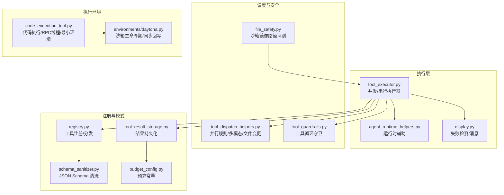
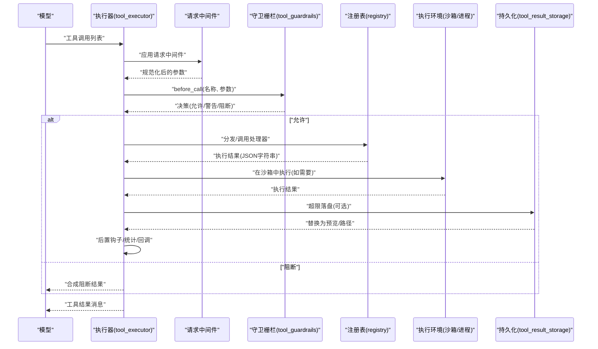
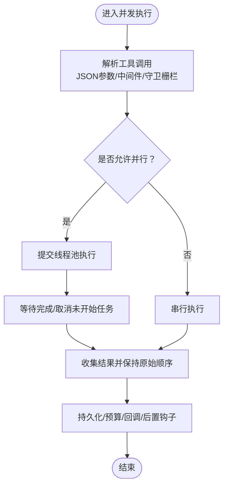
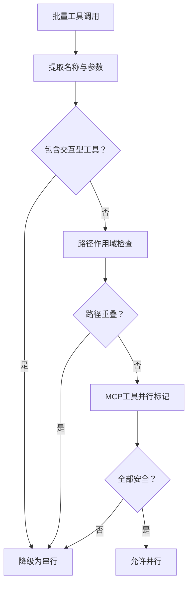
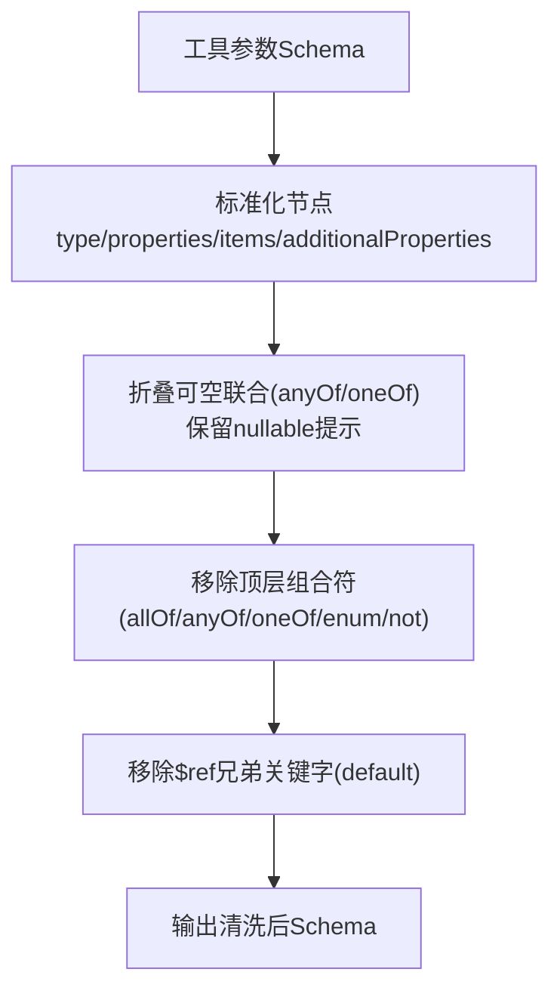
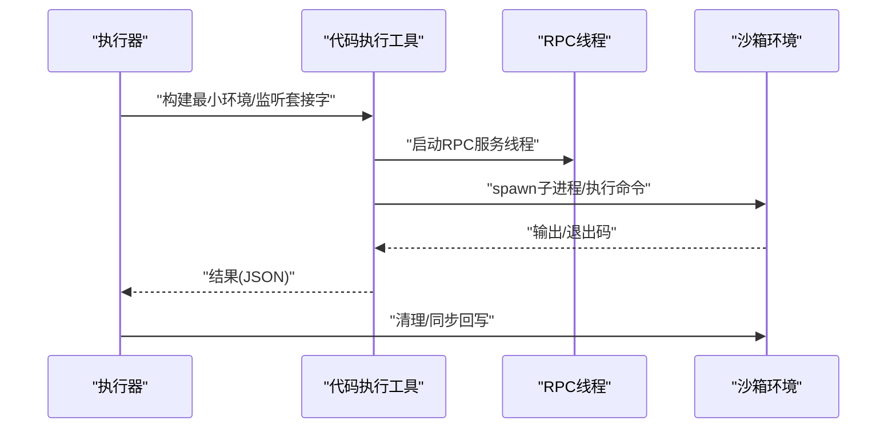
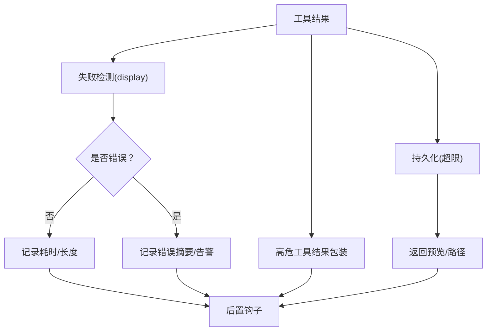
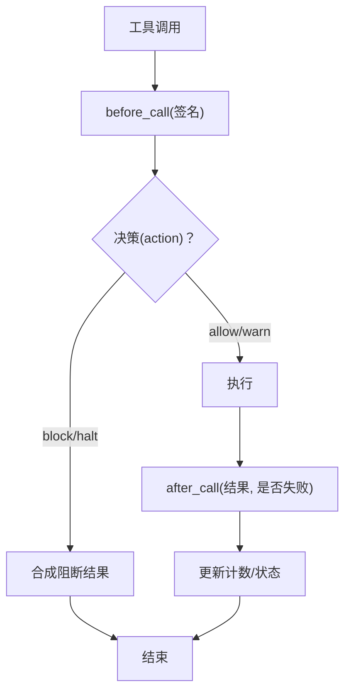
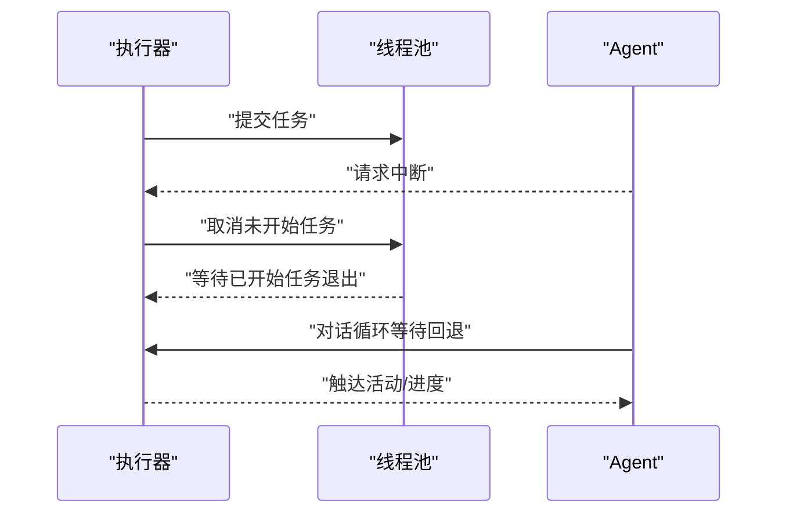
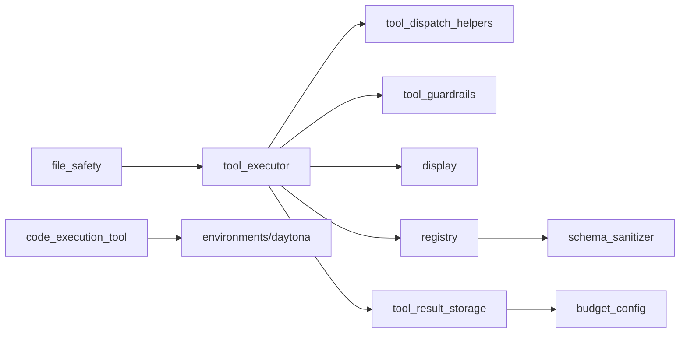

# 工具调用系统

<cite>
**本文档引用的文件**
- [agent/tool_executor.py](file://agent/tool_executor.py)
- [agent/tool_dispatch_helpers.py](file://agent/tool_dispatch_helpers.py)
- [agent/tool_guardrails.py](file://agent/tool_guardrails.py)
- [agent/tool_result_classification.py](file://agent/tool_result_classification.py)
- [agent/display.py](file://agent/display.py)
- [agent/agent_runtime_helpers.py](file://agent/agent_runtime_helpers.py)
- [tools/registry.py](file://tools/registry.py)
- [tools/schema_sanitizer.py](file://tools/schema_sanitizer.py)
- [tools/budget_config.py](file://tools/budget_config.py)
- [tools/tool_result_storage.py](file://tools/tool_result_storage.py)
- [tools/code_execution_tool.py](file://tools/code_execution_tool.py)
- [tools/environments/daytona.py](file://tools/environments/daytona.py)
- [agent/file_safety.py](file://agent/file_safety.py)
- [docs/middleware/README.md](file://docs/middleware/README.md)
</cite>

## 目录
1. [引言](#引言)
2. [项目结构](#项目结构)
3. [核心组件](#核心组件)
4. [架构总览](#架构总览)
5. [详细组件分析](#详细组件分析)
6. [依赖分析](#依赖分析)
7. [性能考虑](#性能考虑)
8. [故障排查指南](#故障排查指南)
9. [结论](#结论)
10. [附录](#附录)

## 引言
本文件面向工具调用系统的开发者与维护者，系统性阐述从函数签名解析、参数校验与类型转换、并发调度与依赖管理、安全防护（沙箱与权限）、到结果分类与处理（成功/失败/异常）以及错误恢复与重试机制的完整技术路径。文档以代码为依据，辅以图示与最佳实践建议，帮助读者快速理解并高效集成与扩展工具调用能力。

## 项目结构
工具调用系统由“执行器”“调度助手”“守卫栅栏”“注册表与模式清洗”“预算与持久化”“环境与沙箱”等模块协同构成，形成“请求预处理—并发/串行调度—执行—结果归档—后置钩子”的闭环。

**图表来源**
- [agent/tool_executor.py:243-768](file://agent/tool_executor.py#L243-L768)
- [agent/tool_dispatch_helpers.py:103-146](file://agent/tool_dispatch_helpers.py#L103-L146)
- [agent/tool_guardrails.py:224-375](file://agent/tool_guardrails.py#L224-L375)
- [agent/display.py:862-892](file://agent/display.py#L862-L892)
- [tools/registry.py:337-417](file://tools/registry.py#L337-L417)
- [tools/schema_sanitizer.py:46-100](file://tools/schema_sanitizer.py#L46-L100)
- [tools/budget_config.py:22-36](file://tools/budget_config.py#L22-L36)
- [tools/tool_result_storage.py:122-160](file://tools/tool_result_storage.py#L122-L160)
- [tools/code_execution_tool.py:1205-1231](file://tools/code_execution_tool.py#L1205-L1231)
- [tools/environments/daytona.py:237-270](file://tools/environments/daytona.py#L237-L270)
- [agent/file_safety.py:496-534](file://agent/file_safety.py#L496-L534)

**章节来源**
- [agent/tool_executor.py:1-1429](file://agent/tool_executor.py#L1-L1429)
- [agent/tool_dispatch_helpers.py:1-418](file://agent/tool_dispatch_helpers.py#L1-L418)
- [agent/tool_guardrails.py:1-476](file://agent/tool_guardrails.py#L1-L476)
- [tools/registry.py:1-590](file://tools/registry.py#L1-L590)
- [tools/schema_sanitizer.py:1-484](file://tools/schema_sanitizer.py#L1-L484)
- [tools/budget_config.py:1-36](file://tools/budget_config.py#L1-L36)
- [tools/tool_result_storage.py:1-200](file://tools/tool_result_storage.py#L1-L200)
- [tools/code_execution_tool.py:1205-1231](file://tools/code_execution_tool.py#L1205-L1231)
- [tools/environments/daytona.py:237-270](file://tools/environments/daytona.py#L237-L270)
- [agent/file_safety.py:496-534](file://agent/file_safety.py#L496-L534)

## 核心组件
- 执行器：负责解析工具调用、应用中间件、执行前检查、并发/串行调度、结果归档与后置钩子触发。
- 调度助手：定义并行规则（工具集、路径范围、破坏性命令启发式），多模态结果封装与摘要，文件变更目标提取。
- 守卫栅栏：基于“精确失败次数、同工具重复失败、只读无进展”等阈值的工具循环检测与阻断。
- 注册表与模式清洗：集中注册工具、动态可用性检查、统一输出模式清洗，兼容不同推理后端。
- 预算与持久化：按工具/回合维度限制结果大小，超限落盘并返回可读提示。
- 环境与沙箱：通过最小化环境变量、RPC通道与进程隔离，实现代码执行的安全边界；沙箱支持文件同步回写。

**章节来源**
- [agent/tool_executor.py:243-768](file://agent/tool_executor.py#L243-L768)
- [agent/tool_dispatch_helpers.py:103-146](file://agent/tool_dispatch_helpers.py#L103-L146)
- [agent/tool_guardrails.py:224-375](file://agent/tool_guardrails.py#L224-L375)
- [tools/registry.py:337-417](file://tools/registry.py#L337-L417)
- [tools/schema_sanitizer.py:46-100](file://tools/schema_sanitizer.py#L46-L100)
- [tools/budget_config.py:22-36](file://tools/budget_config.py#L22-L36)
- [tools/tool_result_storage.py:122-160](file://tools/tool_result_storage.py#L122-L160)
- [tools/code_execution_tool.py:1205-1231](file://tools/code_execution_tool.py#L1205-L1231)
- [tools/environments/daytona.py:237-270](file://tools/environments/daytona.py#L237-L270)

## 架构总览
工具调用从模型生成的工具调用列表开始，经“请求中间件—守卫栅栏—并行规则—执行—结果持久化—后置钩子”链路完成一次完整的生命周期。

**图表来源**
- [agent/tool_executor.py:243-768](file://agent/tool_executor.py#L243-L768)
- [agent/tool_guardrails.py:241-283](file://agent/tool_guardrails.py#L241-L283)
- [tools/registry.py:390-417](file://tools/registry.py#L390-L417)
- [tools/tool_result_storage.py:122-160](file://tools/tool_result_storage.py#L122-L160)

## 详细组件分析

### 组件A：工具执行器（并发/串行）
- 并发执行：使用线程池，最大工作线程数受控；每个任务注册线程ID以便中断；周期性等待与心跳，避免网关误判空闲。
- 串行执行：逐个工具执行，支持用户中断跳过剩余调用。
- 中间件：请求中间件用于参数规范化；执行中间件用于包装/短路执行。
- 结果处理：失败检测、多模态结果解包、目录提示注入、预算强制与/steer注入。

**图表来源**
- [agent/tool_executor.py:243-768](file://agent/tool_executor.py#L243-L768)
- [agent/tool_dispatch_helpers.py:103-146](file://agent/tool_dispatch_helpers.py#L103-L146)

**章节来源**
- [agent/tool_executor.py:243-768](file://agent/tool_executor.py#L243-L768)
- [agent/tool_dispatch_helpers.py:103-146](file://agent/tool_dispatch_helpers.py#L103-L146)

### 组件B：工具调度与依赖管理
- 并行规则：禁止与交互型工具（如clarify）混批；路径作用域工具（读写/补丁）需路径不重叠；MCP工具需显式声明支持并行。
- 破坏性命令启发式：对终端命令进行模式匹配，决定是否提前打快照。
- 多模态结果：统一为内容列表，保障视觉适配与回退文本。

**图表来源**
- [agent/tool_dispatch_helpers.py:103-146](file://agent/tool_dispatch_helpers.py#L103-L146)

**章节来源**
- [agent/tool_dispatch_helpers.py:103-146](file://agent/tool_dispatch_helpers.py#L103-L146)

### 组件C：工具参数验证与类型转换
- 模式清洗：将裸字符串schema、数组type、顶层组合符、$ref兄弟关键字等转换为严格后端可接受形式；必要时剥离pattern/format或enum斜杠值。
- 运行期动态覆盖：委托任务描述等随配置变化而更新。
- 类型转换：将字符串“null”映射为None（当保留nullable提示时）。

**图表来源**
- [tools/schema_sanitizer.py:231-336](file://tools/schema_sanitizer.py#L231-L336)
- [tools/registry.py:367-383](file://tools/registry.py#L367-L383)

**章节来源**
- [tools/schema_sanitizer.py:46-484](file://tools/schema_sanitizer.py#L46-L484)
- [tools/registry.py:337-383](file://tools/registry.py#L337-L383)

### 组件D：安全防护机制（沙箱与权限）
- 沙箱隔离：代码执行通过RPC线程与最小化子进程环境，仅传递必要变量；Windows平台保留系统必需变量。
- 文件路径识别：识别沙箱镜像目标路径，给出软警告提示，避免静默复制偏差。
- 沙箱生命周期：启动/停止/删除、同步回写、幂等清理与错误吞吐。

**图表来源**
- [tools/code_execution_tool.py:1205-1231](file://tools/code_execution_tool.py#L1205-L1231)
- [tools/environments/daytona.py:237-270](file://tools/environments/daytona.py#L237-L270)
- [agent/file_safety.py:496-534](file://agent/file_safety.py#L496-L534)

**章节来源**
- [tools/code_execution_tool.py:1205-1231](file://tools/code_execution_tool.py#L1205-L1231)
- [tools/environments/daytona.py:237-270](file://tools/environments/daytona.py#L237-L270)
- [agent/file_safety.py:496-534](file://agent/file_safety.py#L496-L534)

### 组件E：结果分类与处理策略
- 失败判定：终端工具以非零退出码为主；内存工具区分“容量满”与普通错误；通用路径解析JSON中的error/message字段。
- 成功/异常：成功记录长度与耗时；异常记录错误摘要；多模态结果转为文本摘要用于日志/回退。
- 后置钩子：执行完成后触发，用于观测与审计。

**图表来源**
- [agent/display.py:862-892](file://agent/display.py#L862-L892)
- [agent/tool_result_classification.py:12-26](file://agent/tool_result_classification.py#L12-L26)
- [tools/tool_result_storage.py:122-160](file://tools/tool_result_storage.py#L122-L160)

**章节来源**
- [agent/display.py:862-892](file://agent/display.py#L862-L892)
- [agent/tool_result_classification.py:12-26](file://agent/tool_result_classification.py#L12-L26)
- [tools/tool_result_storage.py:122-160](file://tools/tool_result_storage.py#L122-L160)

### 组件F：工具循环守卫与阻断
- 阈值配置：精确失败、同工具失败、只读无进展三类阈值可分别启用警告/阻断/硬停。
- 签名去重：基于工具名+规范化参数哈希，避免误判。
- 合成阻断结果：向会话注入带元数据的阻断信息，便于可观测与回溯。

**图表来源**
- [agent/tool_guardrails.py:224-375](file://agent/tool_guardrails.py#L224-L375)

**章节来源**
- [agent/tool_guardrails.py:224-375](file://agent/tool_guardrails.py#L224-L375)

### 组件G：错误恢复与重试机制
- 工具执行：在并发路径中对未开始任务进行取消，已开始任务等待优雅退出；串行路径在每次调用前检查中断。
- 会话级重试：对话循环在等待回退期间持续触达活动，支持用户中断打断。
- 中间件契约：执行中间件必须调用下游一次（除非短路），保证行为确定性与一致性。

**图表来源**
- [agent/tool_executor.py:577-624](file://agent/tool_executor.py#L577-L624)
- [agent/agent_runtime_helpers.py:1731-1758](file://agent/agent_runtime_helpers.py#L1731-L1758)
- [docs/middleware/README.md:239-261](file://docs/middleware/README.md#L239-L261)

**章节来源**
- [agent/tool_executor.py:577-624](file://agent/tool_executor.py#L577-L624)
- [agent/agent_runtime_helpers.py:1731-1758](file://agent/agent_runtime_helpers.py#L1731-L1758)
- [docs/middleware/README.md:239-261](file://docs/middleware/README.md#L239-L261)

## 依赖分析
- 执行器依赖调度助手（并行规则/多模态）、守卫栅栏（循环检测）、显示模块（失败判定）、注册表（分发）、存储模块（预算/持久化）。
- 注册表依赖模式清洗模块；预算配置被存储模块引用。
- 代码执行工具依赖沙箱环境；文件安全模块为执行器提供路径识别。

**图表来源**
- [agent/tool_executor.py:243-768](file://agent/tool_executor.py#L243-L768)
- [tools/registry.py:337-417](file://tools/registry.py#L337-L417)
- [tools/schema_sanitizer.py:46-100](file://tools/schema_sanitizer.py#L46-L100)
- [tools/tool_result_storage.py:122-160](file://tools/tool_result_storage.py#L122-L160)
- [tools/code_execution_tool.py:1205-1231](file://tools/code_execution_tool.py#L1205-L1231)
- [tools/environments/daytona.py:237-270](file://tools/environments/daytona.py#L237-L270)
- [agent/file_safety.py:496-534](file://agent/file_safety.py#L496-L534)

**章节来源**
- [agent/tool_executor.py:243-768](file://agent/tool_executor.py#L243-L768)
- [tools/registry.py:337-417](file://tools/registry.py#L337-L417)
- [tools/schema_sanitizer.py:46-100](file://tools/schema_sanitizer.py#L46-L100)
- [tools/tool_result_storage.py:122-160](file://tools/tool_result_storage.py#L122-L160)
- [tools/code_execution_tool.py:1205-1231](file://tools/code_execution_tool.py#L1205-L1231)
- [tools/environments/daytona.py:237-270](file://tools/environments/daytona.py#L237-L270)
- [agent/file_safety.py:496-534](file://agent/file_safety.py#L496-L534)

## 性能考虑
- 并发度控制：最大工作线程数上限，避免过度竞争；对未开始任务及时取消，减少资源浪费。
- I/O与序列化：多模态结果统一为内容列表，降低后续适配成本；超限落盘减少内存占用。
- 可观测性：心跳与进度回调确保长任务不被网关误判；失败检测与日志分级提升定位效率。
- 模式清洗：仅在严格后端拒绝时进行二次清洗，避免不必要的开销。

## 故障排查指南
- 工具返回错误：优先查看失败检测逻辑与错误摘要；确认是否为“容量满”等特殊语义。
- 并发卡死：检查中断信号是否正确下发至工作线程；确认未开始任务是否被取消。
- 模式不兼容：核对清洗规则与后端要求；必要时剥离pattern/format或enum斜杠。
- 沙箱问题：确认最小环境变量与RPC通道；关注同步回写与清理阶段的异常吞吐。

**章节来源**
- [agent/display.py:862-892](file://agent/display.py#L862-L892)
- [agent/tool_executor.py:577-624](file://agent/tool_executor.py#L577-L624)
- [tools/schema_sanitizer.py:346-421](file://tools/schema_sanitizer.py#L346-L421)
- [tools/environments/daytona.py:244-270](file://tools/environments/daytona.py#L244-L270)

## 结论
该工具调用系统通过“执行器+调度助手+守卫栅栏+注册表+模式清洗+预算与持久化+沙箱环境”的协作，实现了从参数解析到结果落盘的全链路安全与可控。其并发策略、失败检测、中间件契约与沙箱隔离共同构成了可扩展、可观测且可恢复的工具执行框架。

## 附录
- 最佳实践
  - 明确工具参数Schema，尽量避免顶层组合符与$ref兄弟关键字。
  - 使用中间件进行参数规范化与访问控制，而非在工具内部分散处理。
  - 对可能产生大结果的工具设置合理阈值与预览策略。
  - 在并发场景下避免共享可变状态，必要时采用路径作用域或串行化。
  - 为高危工具（终端/文件/网络）启用沙箱与最小化环境变量。
  - 建立失败检测与告警机制，结合后置钩子完善可观测性。