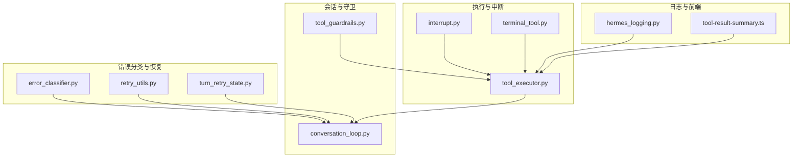
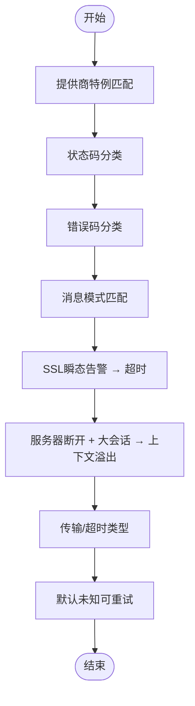
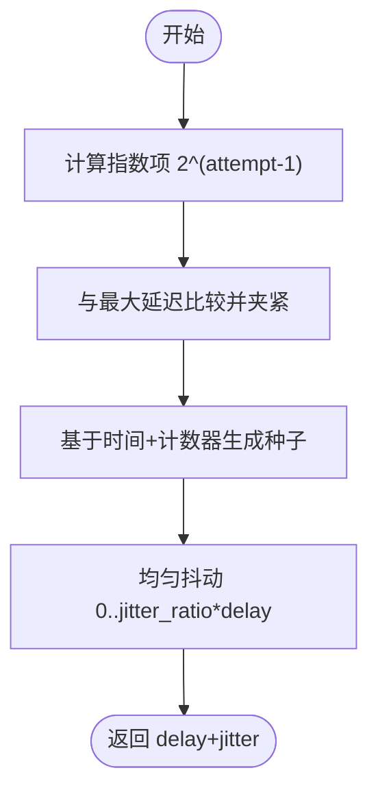
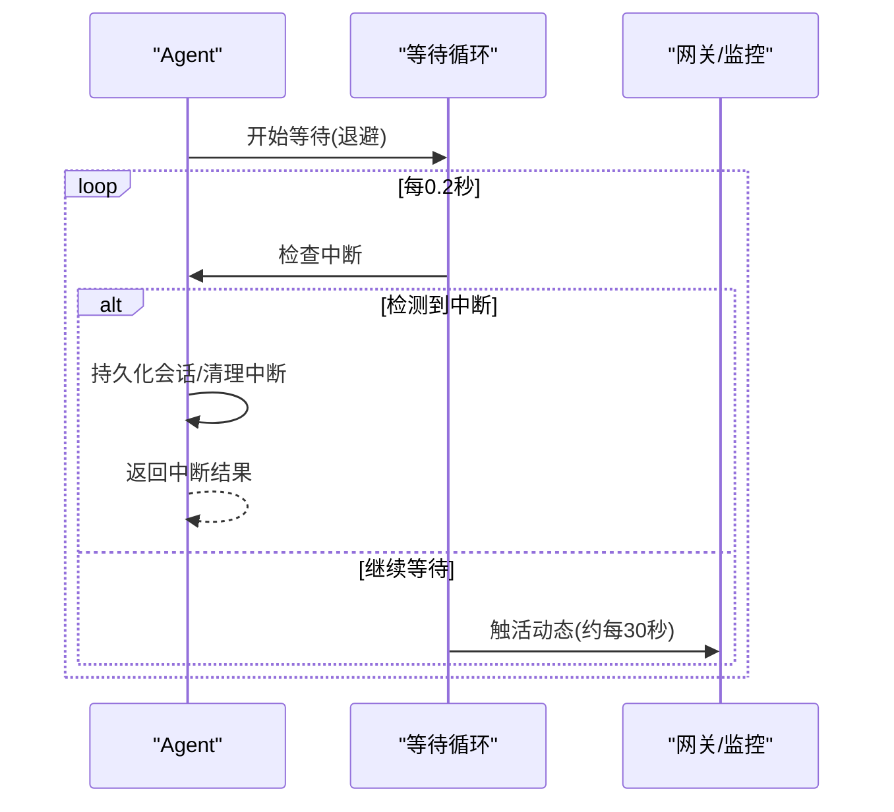
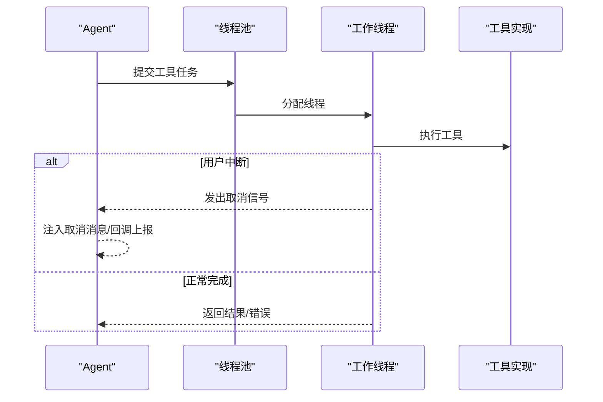
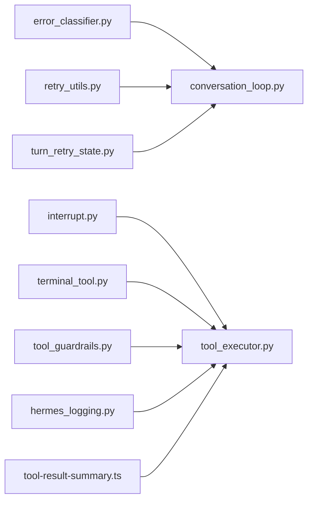

# 工具错误处理

<cite>
**本文引用的文件**
- [agent/error_classifier.py](file://agent/error_classifier.py)
- [agent/retry_utils.py](file://agent/retry_utils.py)
- [agent/conversation_loop.py](file://agent/conversation_loop.py)
- [agent/tool_executor.py](file://agent/tool_executor.py)
- [agent/tool_guardrails.py](file://agent/tool_guardrails.py)
- [agent/turn_retry_state.py](file://agent/turn_retry_state.py)
- [agent/errors.py](file://agent/errors.py)
- [tools/interrupt.py](file://tools/interrupt.py)
- [tools/terminal_tool.py](file://tools/terminal_tool.py)
- [hermes_logging.py](file://hermes_logging.py)
- [apps/desktop/src/lib/tool-result-summary.ts](file://apps/desktop/src/lib/tool-result-summary.ts)
- [tests/test_retry_utils.py](file://tests/test_retry_utils.py)
- [tests/run_agent/test_18028_content_policy_blocked.py](file://tests/run_agent/test_18028_content_policy_blocked.py)
</cite>

## 目录
1. [简介](#简介)
2. [项目结构](#项目结构)
3. [核心组件](#核心组件)
4. [架构总览](#架构总览)
5. [详细组件分析](#详细组件分析)
6. [依赖分析](#依赖分析)
7. [性能考量](#性能考量)
8. [故障排查指南](#故障排查指南)
9. [结论](#结论)
10. [附录](#附录)

## 简介
本文件系统化梳理工具错误处理体系：从错误识别与分类、恢复与重试策略（含指数退避与抖动）、中断处理（用户/系统）、错误信息采集与报告、结果错误包装与用户友好提示、到日志记录与调试信息提取。文档以代码为依据，结合图示与路径引用，帮助读者快速定位实现细节并进行配置与扩展。

## 项目结构
围绕“工具错误处理”的关键模块分布如下：
- 错误分类与恢复决策：agent/error_classifier.py
- 重试与退避：agent/retry_utils.py
- 会话循环与重试等待中的中断检测：agent/conversation_loop.py
- 工具执行与并发/顺序调度、失败与取消处理：agent/tool_executor.py
- 工具调用守卫（失败次数与进度监控）：agent/tool_guardrails.py
- 单次尝试的恢复状态机：agent/turn_retry_state.py
- 工具层中断信号：tools/interrupt.py
- 终端工具的超时与重试：tools/terminal_tool.py
- 日志与脱敏格式化：hermes_logging.py
- 前端工具结果错误提取辅助：apps/desktop/src/lib/tool-result-summary.ts
- 测试与验证：tests/test_retry_utils.py、tests/run_agent/test_18028_content_policy_blocked.py



**图表来源**
- [agent/error_classifier.py](file://agent/error_classifier.py)
- [agent/retry_utils.py](file://agent/retry_utils.py)
- [agent/conversation_loop.py](file://agent/conversation_loop.py)
- [agent/tool_executor.py](file://agent/tool_executor.py)
- [agent/tool_guardrails.py](file://agent/tool_guardrails.py)
- [agent/turn_retry_state.py](file://agent/turn_retry_state.py)
- [tools/interrupt.py](file://tools/interrupt.py)
- [tools/terminal_tool.py](file://tools/terminal_tool.py)
- [hermes_logging.py](file://hermes_logging.py)
- [apps/desktop/src/lib/tool-result-summary.ts](file://apps/desktop/src/lib/tool-result-summary.ts)

**章节来源**
- [agent/error_classifier.py](file://agent/error_classifier.py)
- [agent/retry_utils.py](file://agent/retry_utils.py)
- [agent/conversation_loop.py](file://agent/conversation_loop.py)
- [agent/tool_executor.py](file://agent/tool_executor.py)
- [agent/tool_guardrails.py](file://agent/tool_guardrails.py)
- [agent/turn_retry_state.py](file://agent/turn_retry_state.py)
- [tools/interrupt.py](file://tools/interrupt.py)
- [tools/terminal_tool.py](file://tools/terminal_tool.py)
- [hermes_logging.py](file://hermes_logging.py)
- [apps/desktop/src/lib/tool-result-summary.ts](file://apps/desktop/src/lib/tool-result-summary.ts)

## 核心组件
- 错误分类器：对API异常进行结构化分类，输出可执行的恢复建议（是否可重试、是否压缩上下文、是否轮换凭证、是否回退）。
- 重试工具：提供抖动指数退避，避免“惊群效应”。
- 会话循环：在重试等待期间响应用户中断；对内容策略拒绝等特殊情形给出明确提示。
- 工具执行器：并发/顺序执行工具调用，处理键盘中断、线程取消、结果持久化与预算控制。
- 工具守卫：统计重复失败与无进展调用，提供警告或硬停止。
- 中断信号：线程级中断标记，确保多会话并发场景下互不干扰。
- 终端工具：对超时类错误进行特殊处理与重试。
- 日志系统：统一日志文件、脱敏格式化、组件路由与会话上下文注入。
- 前端错误提取：从工具结果中抽取错误文本，用于用户界面展示。

**章节来源**
- [agent/error_classifier.py](file://agent/error_classifier.py)
- [agent/retry_utils.py](file://agent/retry_utils.py)
- [agent/conversation_loop.py](file://agent/conversation_loop.py)
- [agent/tool_executor.py](file://agent/tool_executor.py)
- [agent/tool_guardrails.py](file://agent/tool_guardrails.py)
- [tools/interrupt.py](file://tools/interrupt.py)
- [tools/terminal_tool.py](file://tools/terminal_tool.py)
- [hermes_logging.py](file://hermes_logging.py)
- [apps/desktop/src/lib/tool-result-summary.ts](file://apps/desktop/src/lib/tool-result-summary.ts)

## 架构总览
整体流程：工具执行产生异常或非成功结果；错误分类器给出恢复建议；重试工具计算退避时间；会话循环在等待期间检查中断；工具执行器处理取消与结果持久化；日志系统记录上下文；前端从结果中提取错误信息。

```mermaid
sequenceDiagram
participant Tool as "工具执行器"
participant Exec as "工具实现"
participant Classifier as "错误分类器"
participant Retry as "重试工具"
participant Loop as "会话循环"
participant Logger as "日志系统"
Tool->>Exec : 调用工具
Exec-->>Tool : 返回结果/异常
Tool->>Classifier : 分类错误
Classifier-->>Tool : 结构化恢复建议
Tool->>Retry : 计算退避
Retry-->>Tool : 延迟秒数
Tool->>Loop : 进入等待可中断
Loop-->>Tool : 检测中断/继续
Tool->>Logger : 记录上下文
Tool-->>Tool : 处理取消/持久化/预算
```

**图表来源**
- [agent/tool_executor.py](file://agent/tool_executor.py)
- [agent/error_classifier.py](file://agent/error_classifier.py)
- [agent/retry_utils.py](file://agent/retry_utils.py)
- [agent/conversation_loop.py](file://agent/conversation_loop.py)
- [hermes_logging.py](file://hermes_logging.py)

## 详细组件分析

### 错误分类与恢复（error_classifier）
- 分类维度：认证/授权、计费/配额、服务端错误、传输/超时、上下文/负载过大、模型/策略限制、请求格式、特定提供商问题等。
- 分类管线优先级：提供商特例 → HTTP状态码 → 错误码 → 消息模式 → SSL瞬态告警 → 服务器断开+大会话 → 传输/超时 → 默认未知。
- 输出结构：包含原因、状态码、提供商/模型、消息、错误上下文及恢复动作提示（可重试、是否压缩、是否轮换凭证、是否回退）。



**图表来源**
- [agent/error_classifier.py](file://agent/error_classifier.py)

**章节来源**
- [agent/error_classifier.py](file://agent/error_classifier.py)

### 重试与指数退避（retry_utils）
- 抖动指数退避：基于尝试次数计算延迟，叠加随机抖动，避免多个会话同时重试。
- 关键参数：基础延迟、最大延迟、抖动比例；线程安全计数器与随机种子生成。
- 测试覆盖：边界值、负数尝试、零基础延迟、高尝试次数、并发安全性。



**图表来源**
- [agent/retry_utils.py](file://agent/retry_utils.py)

**章节来源**
- [agent/retry_utils.py](file://agent/retry_utils.py)
- [tests/test_retry_utils.py](file://tests/test_retry_utils.py)

### 会话循环中的重试与中断（conversation_loop）
- 重试等待期间：周期性检查中断请求；若检测到中断，持久化会话、清理中断、返回中断结果。
- 内容策略拒绝：对“内容策略拒绝”分支进行专门处理，尝试回退模型后仍拒绝则终止并给出用户提示。
- 超时与断连：在等待期间定期触活动态，防止网关误判空闲。



**图表来源**
- [agent/conversation_loop.py](file://agent/conversation_loop.py)

**章节来源**
- [agent/conversation_loop.py](file://agent/conversation_loop.py)

### 工具执行与并发/顺序调度（tool_executor）
- 并发执行：线程池执行多个工具调用；每个工作线程注册自身线程ID以便接收中断；支持取消未开始的任务；周期性心跳避免被网关停掉。
- 顺序执行：逐个执行工具调用；在每次开始前检查中断；若已中断则跳过剩余调用并注入取消消息。
- 取消与失败：捕获键盘中断转为用户中断；记录取消结果并通过回调上报；失败检测与日志记录；结果持久化与预算控制；目录提示附加。
- 守卫观察：在工具完成后追加守卫观察结果，便于后续验证。



**图表来源**
- [agent/tool_executor.py](file://agent/tool_executor.py)

**章节来源**
- [agent/tool_executor.py](file://agent/tool_executor.py)

### 工具调用守卫（tool_guardrails）
- 配置：允许启用警告/硬停止，设置不同阈值（精确失败、同工具失败、无进展）。
- 行为：统计签名（工具名+规范化参数哈希）与工具名计数；当达到阈值时发出警告或阻断/停止；支持“幂等工具无进展”阻断。
- 输出：决策对象包含动作、代码、消息、工具名、计数与签名元数据；可转换为合成结果或附加到实际结果。

**章节来源**
- [agent/tool_guardrails.py](file://agent/tool_guardrails.py)

### 单次尝试恢复状态机（turn_retry_state）
- 作用：将一次API调用尝试内的多种恢复分支（凭证刷新、长上下文压缩、长度续写、格式修复等）收敛为单一状态对象，避免分散变量。
- 字段：各恢复分支的一次性触发标志与重启信号；循环结束后由外层逻辑读取并决定重建请求与重试。

**章节来源**
- [agent/turn_retry_state.py](file://agent/turn_retry_state.py)

### 工具层中断信号（interrupt）
- 设计：线程级中断标记集合；通过锁保证并发安全；提供可选调试日志；兼容旧接口映射。
- 使用：工具侧调用 is_interrupted() 检查当前线程是否被中断；在长时间运行工具中定期轮询以快速退出。

**章节来源**
- [tools/interrupt.py](file://tools/interrupt.py)

### 终端工具的超时与重试（terminal_tool）
- 超时识别：通过异常字符串判断“超时”，返回标准化错误结果（含退出码与错误信息）。
- 重试策略：对瞬态错误在限定次数内指数退避重试；记录警告/错误日志并附带上下文信息。

**章节来源**
- [tools/terminal_tool.py](file://tools/terminal_tool.py)

### 日志系统与脱敏（hermes_logging）
- 文件：agent.log（主活动）、errors.log（仅警告及以上）、gateway.log/gui.log（按组件路由）。
- 特性：跨进程旋转（Windows使用并发旋转处理器）、统一格式、会话上下文注入、组件过滤、脱敏格式化。
- 控制台：可开启详细日志输出，降低第三方噪声级别。

**章节来源**
- [hermes_logging.py](file://hermes_logging.py)

### 前端工具结果错误提取（tool-result-summary.ts）
- 功能：从任意嵌套结构中抽取错误信号与错误文本，支持多键位、包装键、递归遍历与截断。
- 用途：在UI中呈现用户可读的错误摘要，提升可观测性与可诊断性。

**章节来源**
- [apps/desktop/src/lib/tool-result-summary.ts](file://apps/desktop/src/lib/tool-result-summary.ts)

## 依赖分析
- 错误分类器依赖于错误类型/状态码/消息模式与上下文信息，输出供会话循环与工具执行器消费。
- 重试工具独立于业务逻辑，仅提供延迟计算，被会话循环与工具执行器调用。
- 工具执行器依赖中断信号、守卫、结果持久化与预算控制；并发路径引入线程池与取消语义。
- 日志系统作为横切关注点，贯穿所有组件，提供一致的可观测性。



**图表来源**
- [agent/error_classifier.py](file://agent/error_classifier.py)
- [agent/retry_utils.py](file://agent/retry_utils.py)
- [agent/conversation_loop.py](file://agent/conversation_loop.py)
- [agent/tool_executor.py](file://agent/tool_executor.py)
- [agent/tool_guardrails.py](file://agent/tool_guardrails.py)
- [agent/turn_retry_state.py](file://agent/turn_retry_state.py)
- [tools/interrupt.py](file://tools/interrupt.py)
- [tools/terminal_tool.py](file://tools/terminal_tool.py)
- [hermes_logging.py](file://hermes_logging.py)
- [apps/desktop/src/lib/tool-result-summary.ts](file://apps/desktop/src/lib/tool-result-summary.ts)

**章节来源**
- [agent/error_classifier.py](file://agent/error_classifier.py)
- [agent/retry_utils.py](file://agent/retry_utils.py)
- [agent/conversation_loop.py](file://agent/conversation_loop.py)
- [agent/tool_executor.py](file://agent/tool_executor.py)
- [agent/tool_guardrails.py](file://agent/tool_guardrails.py)
- [agent/turn_retry_state.py](file://agent/turn_retry_state.py)
- [tools/interrupt.py](file://tools/interrupt.py)
- [tools/terminal_tool.py](file://tools/terminal_tool.py)
- [hermes_logging.py](file://hermes_logging.py)
- [apps/desktop/src/lib/tool-result-summary.ts](file://apps/desktop/src/lib/tool-result-summary.ts)

## 性能考量
- 抖动退避：显著降低“惊群效应”，提高整体吞吐稳定性。
- 并发工具执行：合理设置最大工作线程数，避免过度竞争；及时取消未开始任务，减少资源浪费。
- 日志轮转与脱敏：在Windows上采用并发旋转处理器，避免权限冲突；统一格式与组件过滤降低IO与解析成本。
- 结果持久化与预算控制：在工具结果过大时进行持久化与裁剪，避免内存膨胀与会话历史膨胀。

## 故障排查指南
- 内容策略拒绝：确认错误分类器是否正确识别为不可重试且应尝试回退；查看会话循环中的回退逻辑与用户提示。
- 传输/超时：检查SSL瞬态告警与断连模式匹配；确认抖动退避是否生效；核对等待期间的心跳是否正常。
- 工具失败循环：启用工具守卫的硬停止阈值，观察是否出现“相同工具重复失败”或“幂等工具无进展”阻断。
- 中断处理：确认线程级中断标记是否正确设置与清除；并发执行时检查未开始任务的取消行为。
- 日志定位：使用会话上下文标签与组件过滤快速定位问题；在Windows上注意并发旋转处理器的使用。

**章节来源**
- [tests/run_agent/test_18028_content_policy_blocked.py](file://tests/run_agent/test_18028_content_policy_blocked.py)
- [hermes_logging.py](file://hermes_logging.py)

## 结论
该错误处理系统通过“分类—退避—中断—执行—日志—前端提取”的闭环，实现了对工具执行过程中的多样化错误的稳健应对。其关键在于：
- 结构化的错误分类与恢复建议；
- 抖动指数退避避免集中重试；
- 线程级中断与并发取消保障响应性；
- 守卫机制与预算控制防止无效循环；
- 统一日志与前端错误提取提升可观测性与可诊断性。

## 附录

### 错误处理策略配置与自定义
- 错误分类：可在错误分类器的消息模式与提供商特例处扩展新的匹配规则，确保新场景被正确识别与恢复。
- 重试策略：调整基础延迟、最大延迟与抖动比例；在会话循环与工具执行器中分别应用。
- 守卫阈值：根据会话类型调整工具守卫的警告/阻断阈值，平衡安全性与可用性。
- 日志级别：通过日志系统配置最小级别、文件大小与备份数量，满足不同环境需求。

**章节来源**
- [agent/error_classifier.py](file://agent/error_classifier.py)
- [agent/retry_utils.py](file://agent/retry_utils.py)
- [agent/tool_guardrails.py](file://agent/tool_guardrails.py)
- [hermes_logging.py](file://hermes_logging.py)