# 上下文压缩器

<cite>
**本文档引用的文件**
- [agent/context_compressor.py](file://agent/context_compressor.py)
- [agent/context_engine.py](file://agent/context_engine.py)
- [agent/conversation_compression.py](file://agent/conversation_compression.py)
- [agent/context_references.py](file://agent/context_references.py)
- [trajectory_compressor.py](file://trajectory_compressor.py)
</cite>

## 目录
1. [简介](#简介)
2. [项目结构](#项目结构)
3. [核心组件](#核心组件)
4. [架构概览](#架构概览)
5. [详细组件分析](#详细组件分析)
6. [依赖关系分析](#依赖关系分析)
7. [性能考虑](#性能考虑)
8. [故障排除指南](#故障排除指南)
9. [结论](#结论)

## 简介

上下文压缩器是 Hermes Agent 中用于管理长对话上下文的核心组件。它通过损失性摘要算法，在保持对话连贯性和任务完整性的同时，有效控制模型输入的 token 数量。

该系统实现了多种压缩策略，包括：
- **消息压缩算法**：基于结构化模板的摘要生成
- **摘要生成**：迭代更新的摘要机制
- **DAG 构建**：上下文链接和引用维护
- **主题聚焦压缩**：支持用户指定的主题压缩
- **时间锚定策略**：确保已完成任务的绝对化表述

## 项目结构

上下文压缩器相关的核心文件组织如下：

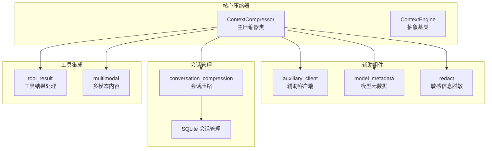
```mermaid
graph TB
subgraph "核心压缩器"
CC[ContextCompressor<br/>主压缩器类]
CE[ContextEngine<br/>抽象基类]
end
subgraph "辅助组件"
AC[auxiliary_client<br/>辅助客户端]
MM[model_metadata<br/>模型元数据]
RC[redact<br/>敏感信息脱敏]
end
subgraph "会话管理"
CC --> CC2[conversation_compression<br/>会话压缩]
CC2 --> SM[SQLite 会话管理]
end
subgraph "工具集成"
CC --> TR[tool_result<br/>工具结果处理]
CC --> MP[multimodal<br/>多模态内容]
end
CC --> AC
CC --> MM
CC --> RC
```

**图表来源**
- [agent/context_compressor.py:1-50](file://agent/context_compressor.py#L1-L50)
- [agent/context_engine.py:1-50](file://agent/context_engine.py#L1-L50)

**章节来源**
- [agent/context_compressor.py:1-100](file://agent/context_compressor.py#L1-L100)
- [agent/context_engine.py:1-50](file://agent/context_engine.py#L1-L50)

## 核心组件

### ContextCompressor 主压缩器

ContextCompressor 是内置上下文引擎的主要实现，负责执行实际的压缩操作。其核心特性包括：

#### 压缩算法阶段
1. **工具结果清理**：预处理昂贵的工具调用结果
2. **头部保护**：保留系统提示和首次交互
3. **尾部保护**：基于 token 预算的最近消息保护
4. **中间区域摘要**：使用结构化模板进行摘要生成
5. **迭代更新**：在后续压缩中更新之前的摘要

#### 关键配置参数
- `threshold_percent`: 触发压缩的阈值百分比（默认 0.50）
- `protect_first_n`: 保护的头部消息数量（默认 3）
- `protect_last_n`: 保护的尾部消息数量（默认 20）
- `summary_target_ratio`: 摘要目标比例（默认 0.20）

**章节来源**
- [agent/context_compressor.py:593-750](file://agent/context_compressor.py#L593-L750)
- [agent/context_compressor.py:815-835](file://agent/context_compressor.py#L815-L835)

### ContextEngine 抽象基类

ContextEngine 定义了所有上下文引擎必须实现的标准接口：

#### 核心接口方法
- `should_compress()`: 判断是否需要触发压缩
- `compress()`: 执行压缩操作
- `update_from_response()`: 更新令牌使用情况
- `on_session_start()`: 会话开始时的回调
- `on_session_end()`: 会话结束时的回调

#### 生命周期管理
引擎具有完整的生命周期管理，包括会话状态重置、令牌使用跟踪和模型切换支持。

**章节来源**
- [agent/context_engine.py:32-227](file://agent/context_engine.py#L32-L227)

## 架构概览

上下文压缩器采用模块化设计，通过清晰的接口分离关注点：

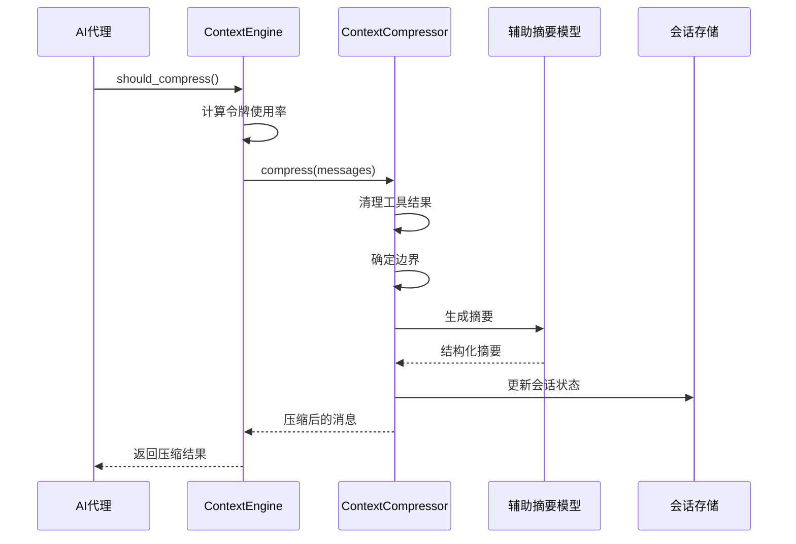
```mermaid
sequenceDiagram
participant Agent as AI代理
participant Engine as ContextEngine
participant Compressor as ContextCompressor
participant LLM as 辅助摘要模型
participant Storage as 会话存储
Agent->>Engine : should_compress()
Engine->>Engine : 计算令牌使用率
Engine->>Compressor : compress(messages)
Compressor->>Compressor : 清理工具结果
Compressor->>Compressor : 确定边界
Compressor->>LLM : 生成摘要
LLM-->>Compressor : 结构化摘要
Compressor->>Storage : 更新会话状态
Compressor-->>Engine : 压缩后的消息
Engine-->>Agent : 返回压缩结果
```

**图表来源**
- [agent/context_compressor.py:2151-2399](file://agent/context_compressor.py#L2151-L2399)
- [agent/conversation_compression.py:281-653](file://agent/conversation_compression.py#L281-L653)

## 详细组件分析

### 消息压缩算法

#### 工具结果清理阶段
压缩器首先执行廉价的预处理步骤，清理冗长的工具调用结果：

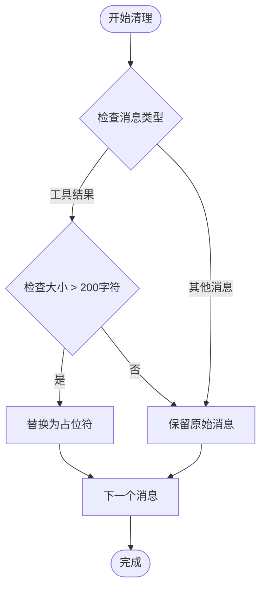
```mermaid
flowchart TD
Start([开始清理]) --> CheckMsg{检查消息类型}
CheckMsg --> |工具结果| CheckSize{检查大小 > 200字符}
CheckMsg --> |其他消息| KeepOriginal[保留原始消息]
CheckSize --> |是| ReplacePlaceholder[替换为占位符]
CheckSize --> |否| KeepOriginal
ReplacePlaceholder --> NextMsg[下一个消息]
KeepOriginal --> NextMsg
NextMsg --> End([完成])
```

**图表来源**
- [agent/context_compressor.py:841-1007](file://agent/context_compressor.py#L841-L1007)

清理策略包括：
- **重复检测**：识别并删除相同的工具结果
- **占位符替换**：将大文本替换为简洁的占位符
- **图像内容剥离**：移除屏幕截图等二进制内容

#### 边界确定算法
压缩器使用智能边界算法确保压缩的有效性和安全性：

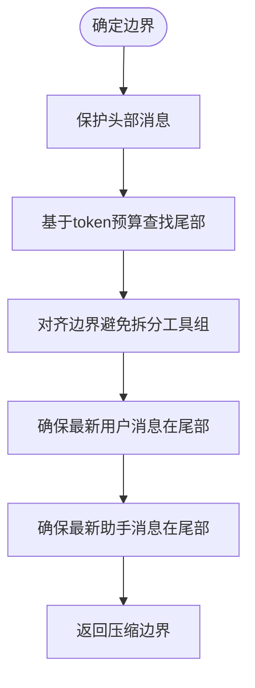
```mermaid
flowchart TD
Start([确定边界]) --> ProtectHead[保护头部消息]
ProtectHead --> FindTail[基于token预算查找尾部]
FindTail --> AlignBoundary[对齐边界避免拆分工具组]
AlignBoundary --> EnsureUserAnchor[确保最新用户消息在尾部]
EnsureUserAnchor --> EnsureAssistantAnchor[确保最新助手消息在尾部]
EnsureAssistantAnchor --> ReturnBoundary[返回压缩边界]
```

**图表来源**
- [agent/context_compressor.py:2015-2130](file://agent/context_compressor.py#L2015-L2130)

边界算法的关键特性：
- **工具组完整性**：避免拆分 `assistant(tool_calls)` → `tool(result)` 组
- **用户任务保护**：确保最新的用户请求不会被压缩掉
- **助手回复保护**：防止重要的助手回复被包含在摘要中

**章节来源**
- [agent/context_compressor.py:1802-2130](file://agent/context_compressor.py#L1802-L2130)

### 摘要生成机制

#### 结构化摘要模板
压缩器使用精心设计的结构化模板生成摘要：

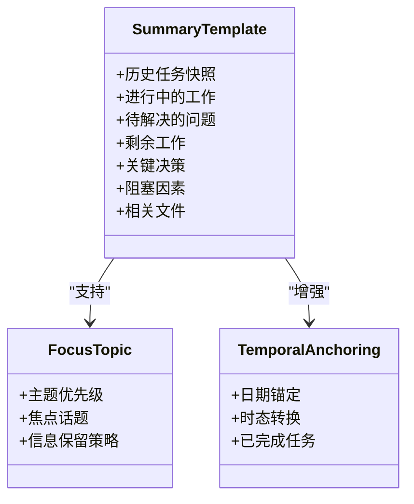
```mermaid
classDiagram
class SummaryTemplate {
+历史任务快照
+进行中的工作
+待解决的问题
+剩余工作
+关键决策
+阻塞因素
+相关文件
}
class FocusTopic {
+主题优先级
+焦点话题
+信息保留策略
}
class TemporalAnchoring {
+日期锚定
+时态转换
+已完成任务
}
SummaryTemplate --> FocusTopic : "支持"
SummaryTemplate --> TemporalAnchoring : "增强"
```

**图表来源**
- [agent/context_compressor.py:1386-1460](file://agent/context_compressor.py#L1386-L1460)

摘要模板包含的结构化部分：
- **历史任务快照**：用户未完成的请求
- **进行中的工作**：当前正在进行的任务
- **待解决的问题**：用户提出但未回答的问题
- **剩余工作**：需要完成的任务列表
- **关键决策**：重要的技术决策及其原因
- **阻塞因素**：尚未解决的问题或错误
- **相关文件**：涉及的重要文件列表

#### 迭代摘要更新
压缩器支持迭代更新摘要，保持信息的连续性：

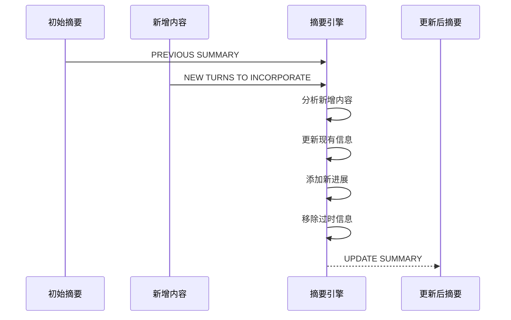
```mermaid
sequenceDiagram
participant Initial as 初始摘要
participant Updates as 新增内容
participant Engine as 摘要引擎
participant Output as 更新后摘要
Initial->>Engine : PREVIOUS SUMMARY
Updates->>Engine : NEW TURNS TO INCORPORATE
Engine->>Engine : 分析新增内容
Engine->>Engine : 更新现有信息
Engine->>Engine : 添加新进展
Engine->>Engine : 移除过时信息
Engine-->>Output : UPDATE SUMMARY
```

**图表来源**
- [agent/context_compressor.py:1462-1496](file://agent/context_compressor.py#L1462-L1496)

**章节来源**
- [agent/context_compressor.py:1013-1527](file://agent/context_compressor.py#L1013-L1527)

### DAG 构建与上下文链接

#### 工具调用对完整性
压缩器维护工具调用对的完整性，防止 API 错误：

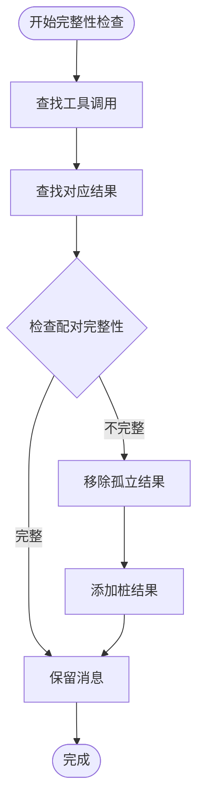
```mermaid
flowchart TD
Start([开始完整性检查]) --> FindCalls[查找工具调用]
FindCalls --> FindResults[查找对应结果]
FindResults --> CheckPairs{检查配对完整性}
CheckPairs --> |完整| KeepMessages[保留消息]
CheckPairs --> |不完整| RemoveOrphans[移除孤立结果]
RemoveOrphans --> AddStubs[添加桩结果]
AddStubs --> KeepMessages
KeepMessages --> End([完成])
```

**图表来源**
- [agent/context_compressor.py:1742-1800](file://agent/context_compressor.py#L1742-L1800)

完整性检查包括：
- **孤立结果移除**：删除没有对应调用的结果
- **桩结果添加**：为缺失的结果添加占位符
- **调用 ID 匹配**：确保每个调用都有正确的结果

#### 上下文链接维护
压缩器通过元数据标记维护上下文链接：

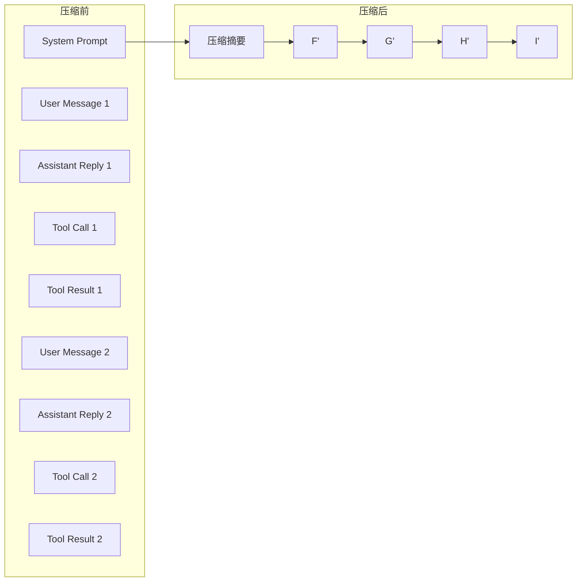
```mermaid
graph LR
subgraph "压缩前"
A[System Prompt]
B[User Message 1]
C[Assistant Reply 1]
D[Tool Call 1]
E[Tool Result 1]
F[User Message 2]
G[Assistant Reply 2]
H[Tool Call 2]
I[Tool Result 2]
end
subgraph "压缩后"
A --> J[压缩摘要]
J --> F'
F' --> G'
G' --> H'
H' --> I'
end
```

**图表来源**
- [agent/context_compressor.py:2372-2391](file://agent/context_compressor.py#L2372-L2391)

**章节来源**
- [agent/context_compressor.py:1742-1800](file://agent/context_compressor.py#L1742-L1800)

### 压缩策略选择逻辑

#### 触发条件判断
压缩器使用多层判断逻辑决定何时触发压缩：

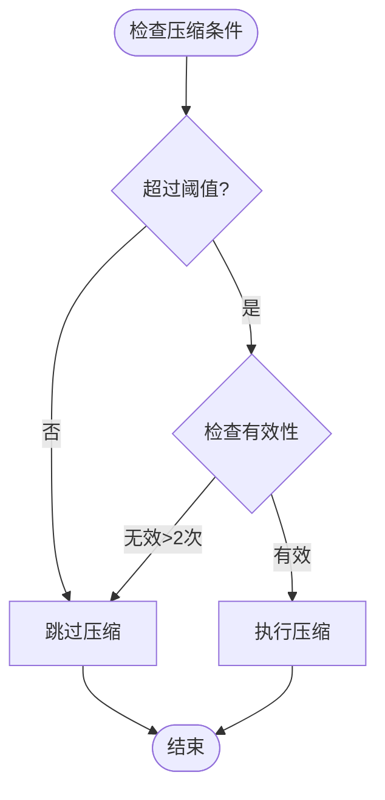
```mermaid
flowchart TD
Start([检查压缩条件]) --> CheckThreshold{超过阈值?}
CheckThreshold --> |否| SkipCompression[跳过压缩]
CheckThreshold --> |是| CheckEffectiveness{检查有效性}
CheckEffectiveness --> |无效>2次| SkipCompression
CheckEffectiveness --> |有效| ProceedCompression[执行压缩]
SkipCompression --> End([结束])
ProceedCompression --> End
```

**图表来源**
- [agent/context_compressor.py:815-835](file://agent/context_compressor.py#L815-L835)

有效性检查包括：
- **压缩效果监控**：跟踪每次压缩的节省百分比
- **反振荡保护**：避免无限循环压缩
- **阈值自适应**：根据使用情况调整压缩策略

#### 目标选择策略
压缩器采用智能策略选择压缩目标：

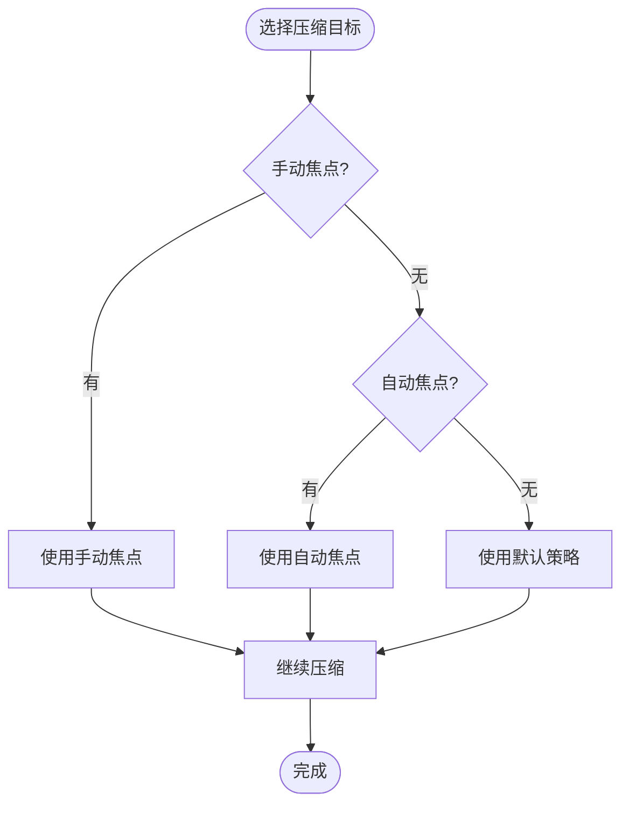
```mermaid
flowchart TD
Start([选择压缩目标]) --> CheckManualFocus{手动焦点?}
CheckManualFocus --> |有| UseManualFocus[使用手动焦点]
CheckManualFocus --> |无| CheckAutoFocus{自动焦点?}
CheckAutoFocus --> |有| UseAutoFocus[使用自动焦点]
CheckAutoFocus --> |无| UseDefault[使用默认策略]
UseManualFocus --> Proceed[继续压缩]
UseAutoFocus --> Proceed
UseDefault --> Proceed
Proceed --> End([完成])
```

**图表来源**
- [agent/context_compressor.py:1685-1715](file://agent/context_compressor.py#L1685-L1715)

**章节来源**
- [agent/context_compressor.py:815-835](file://agent/context_compressor.py#L815-L835)

### 压缩质量控制机制

#### 信息保留规则
压缩器实施严格的信息保留规则：

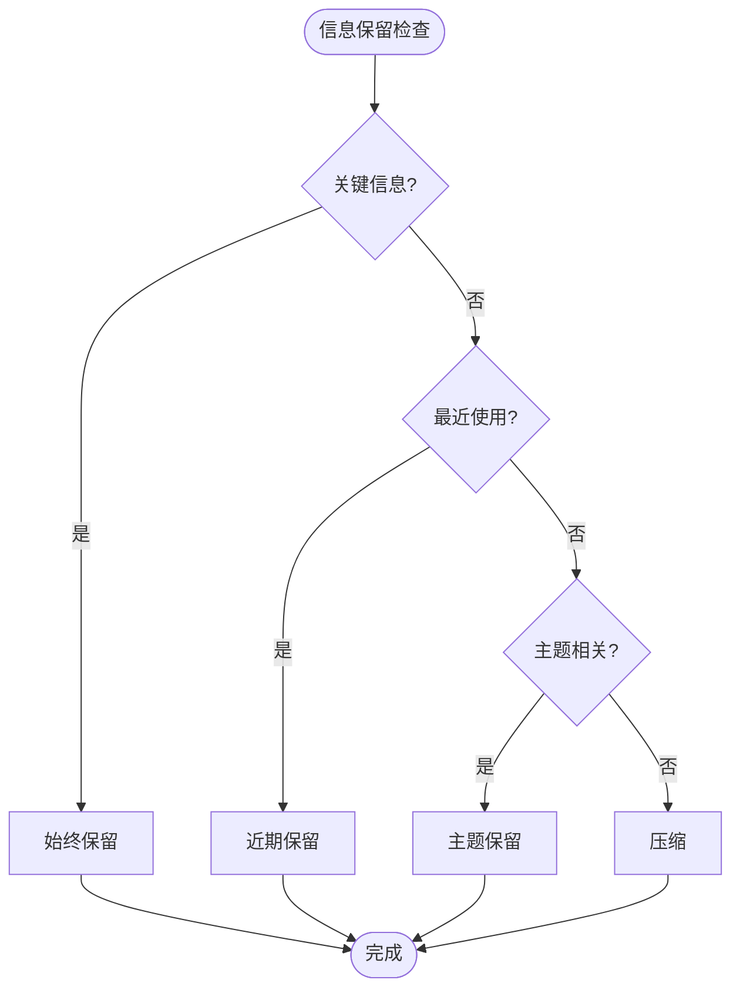
```mermaid
flowchart TD
Start([信息保留检查]) --> CheckCritical{关键信息?}
CheckCritical --> |是| PreserveAlways[始终保留]
CheckCritical --> |否| CheckRecent{最近使用?}
CheckRecent --> |是| PreserveRecent[近期保留]
CheckRecent --> |否| CheckTopic{主题相关?}
CheckTopic --> |是| PreserveTopic[主题保留]
CheckTopic --> |否| Compress[压缩]
PreserveAlways --> End([完成])
PreserveRecent --> End
PreserveTopic --> End
Compress --> End
```

**图表来源**
- [agent/context_compressor.py:1490-1496](file://agent/context_compressor.py#L1490-L1496)

关键信息包括：
- **用户明确指令**：最新的用户请求和指令
- **系统状态**：重要的系统状态信息
- **错误信息**：关键的错误和异常信息

#### 时间锚定策略
压缩器使用时间锚定确保已完成任务的绝对化表述：

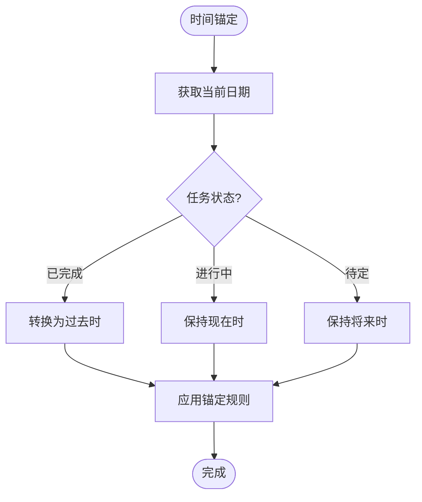
```mermaid
flowchart TD
Start([时间锚定]) --> GetDate[获取当前日期]
GetDate --> CheckTask{任务状态?}
CheckTask --> |已完成| ConvertPast[转换为过去时]
CheckTask --> |进行中| KeepPresent[保持现在时]
CheckTask --> |待定| KeepFuture[保持将来时]
ConvertPast --> ApplyRule[应用锚定规则]
KeepPresent --> ApplyRule
KeepFuture --> ApplyRule
ApplyRule --> End([完成])
```

**图表来源**
- [agent/context_compressor.py:1368-1384](file://agent/context_compressor.py#L1368-L1384)

时间锚定规则：
- **已完成任务**：转换为已完成的过去时表述
- **进行中任务**：保持进行中的现在时表述
- **待定任务**：保持将来时表述

**章节来源**
- [agent/context_compressor.py:1368-1384](file://agent/context_compressor.py#L1368-L1384)

### 压缩后消息重组

#### 上下文链接重建
压缩完成后，系统重建上下文链接：

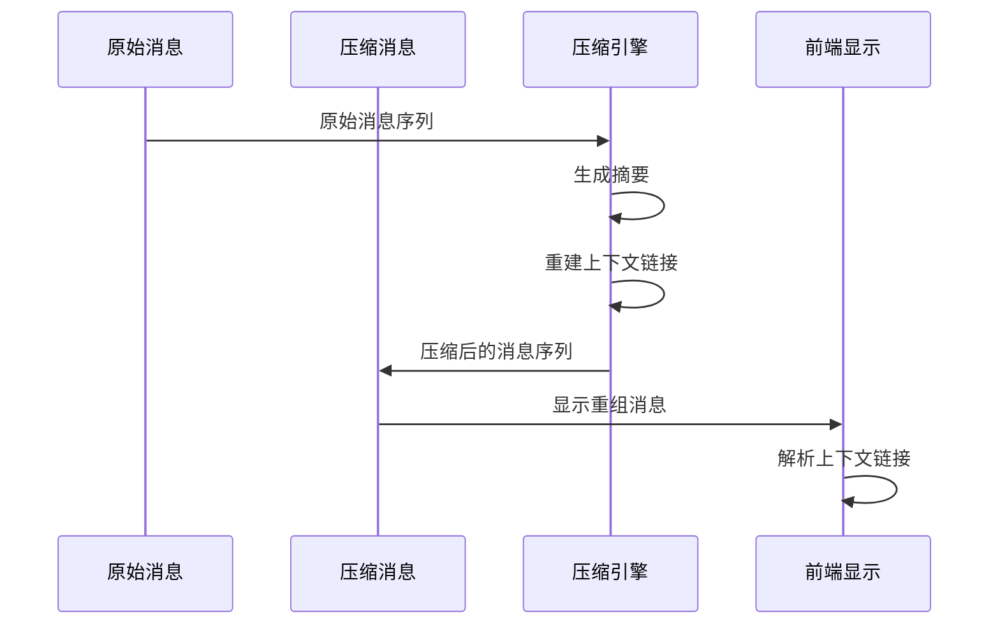
```mermaid
sequenceDiagram
participant Original as 原始消息
participant Compressed as 压缩消息
participant Engine as 压缩引擎
participant Frontend as 前端显示
Original->>Engine : 原始消息序列
Engine->>Engine : 生成摘要
Engine->>Engine : 重建上下文链接
Engine->>Compressed : 压缩后的消息序列
Compressed->>Frontend : 显示重组消息
Frontend->>Frontend : 解析上下文链接
```

**图表来源**
- [agent/context_compressor.py:2312-2399](file://agent/context_compressor.py#L2312-L2399)

重组过程包括：
- **摘要插入**：将结构化摘要插入到适当位置
- **元数据标记**：添加压缩摘要的元数据标记
- **上下文恢复**：确保前端能够正确解析上下文关系

#### 引用维护机制
压缩器维护各种引用的完整性：

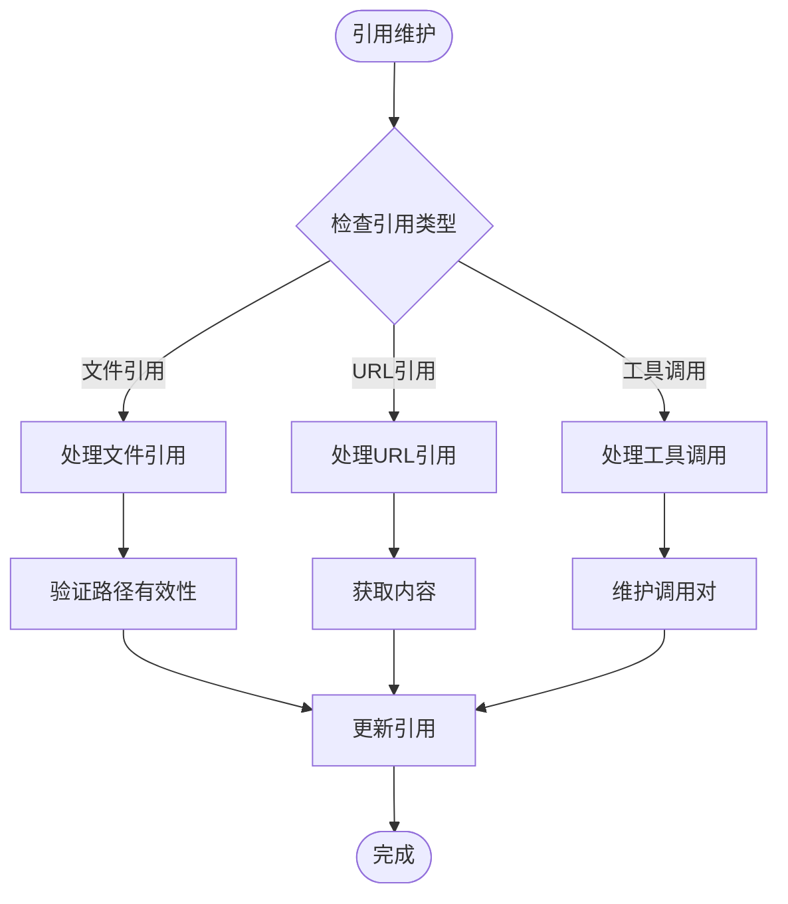
```mermaid
flowchart TD
Start([引用维护]) --> CheckReferences{检查引用类型}
CheckReferences --> |文件引用| ProcessFileRef[处理文件引用]
CheckReferences --> |URL引用| ProcessURLRef[处理URL引用]
CheckReferences --> |工具调用| ProcessToolRef[处理工具调用]
ProcessFileRef --> ValidatePath[验证路径有效性]
ProcessURLRef --> FetchContent[获取内容]
ProcessToolRef --> MaintainPair[维护调用对]
ValidatePath --> UpdateRef[更新引用]
FetchContent --> UpdateRef
MaintainPair --> UpdateRef
UpdateRef --> End([完成])
```

**图表来源**
- [agent/context_references.py:206-334](file://agent/context_references.py#L206-L334)

**章节来源**
- [agent/context_compressor.py:2312-2399](file://agent/context_compressor.py#L2312-L2399)

## 依赖关系分析

### 外部依赖

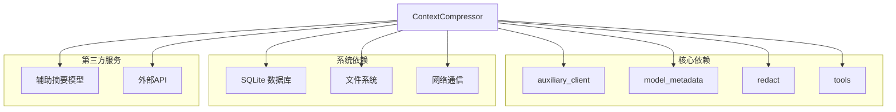
```mermaid
graph TB
subgraph "核心依赖"
AC[auxiliary_client]
MM[model_metadata]
RC[redact]
TC[tools]
end
subgraph "系统依赖"
DB[SQLite 数据库]
FS[文件系统]
NET[网络通信]
end
subgraph "第三方服务"
LLM[辅助摘要模型]
API[外部API]
end
CC[ContextCompressor] --> AC
CC --> MM
CC --> RC
CC --> TC
CC --> DB
CC --> FS
CC --> NET
CC --> LLM
CC --> API
```

**图表来源**
- [agent/context_compressor.py:26-33](file://agent/context_compressor.py#L26-L33)

### 内部耦合关系

压缩器内部各组件之间的耦合关系：

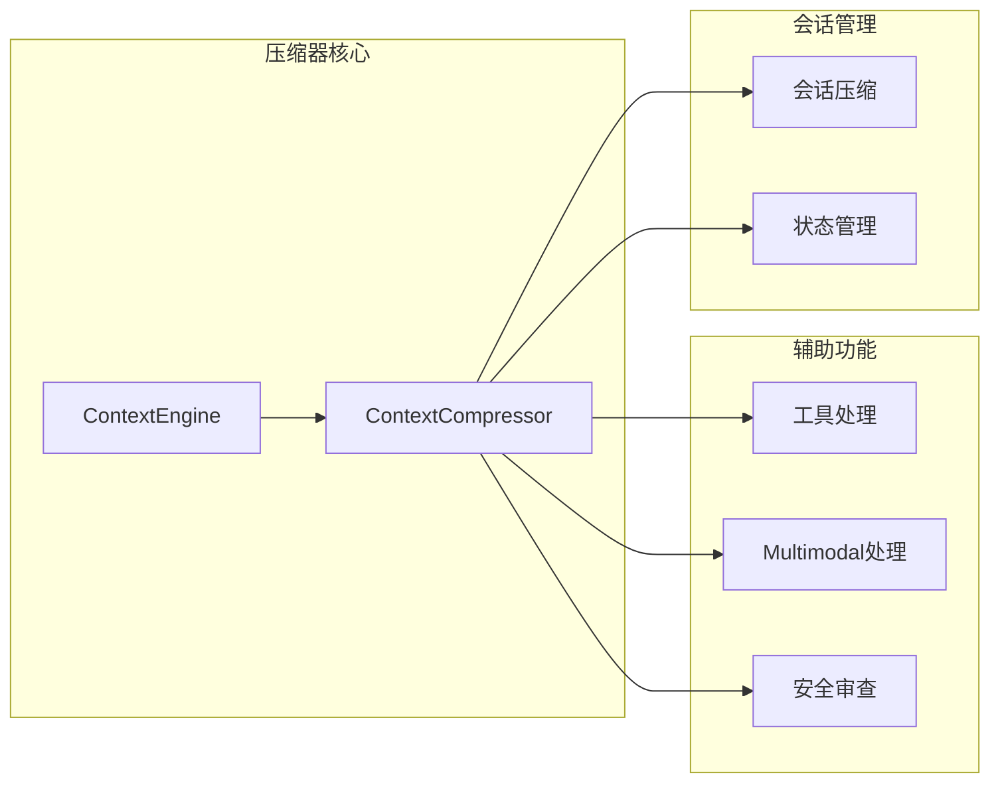
```mermaid
graph LR
subgraph "压缩器核心"
CC[ContextCompressor]
CE[ContextEngine]
end
subgraph "辅助功能"
TP[工具处理]
MP[Multimodal处理]
SR[安全审查]
end
subgraph "会话管理"
SC[会话压缩]
SM[状态管理]
end
CC --> TP
CC --> MP
CC --> SR
CC --> SC
CC --> SM
CE --> CC
```

**图表来源**
- [agent/context_compressor.py:593-607](file://agent/context_compressor.py#L593-L607)

**章节来源**
- [agent/context_compressor.py:26-33](file://agent/context_compressor.py#L26-L33)

## 性能考虑

### 内存使用优化

压缩器采用了多项内存优化策略：

#### 流式处理
- **延迟加载**：只在需要时加载工具结果内容
- **增量处理**：逐批处理消息，避免一次性加载整个对话
- **缓存策略**：智能缓存常用的数据结构和计算结果

#### 计算复杂度控制
- **预估计算**：使用快速估算避免昂贵的令牌计算
- **边界剪枝**：提前排除不可能的压缩候选
- **渐进式压缩**：根据需要逐步增加压缩强度

### 缓存策略

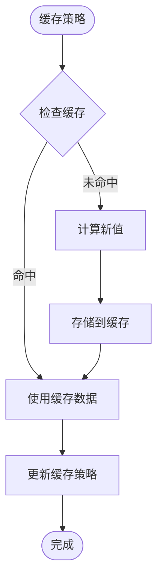
```mermaid
flowchart TD
Start([缓存策略]) --> CheckCache{检查缓存}
CheckCache --> |命中| UseCache[使用缓存数据]
CheckCache --> |未命中| ComputeValue[计算新值]
ComputeValue --> StoreCache[存储到缓存]
StoreCache --> UseCache
UseCache --> UpdatePolicy[更新缓存策略]
UpdatePolicy --> End([完成])
```

**图表来源**
- [agent/context_compressor.py:1013-1023](file://agent/context_compressor.py#L1013-L1023)

缓存优化包括：
- **摘要缓存**：缓存迭代更新的摘要结果
- **令牌估算缓存**：缓存消息的令牌估算
- **工具结果缓存**：缓存已处理的工具结果

## 故障排除指南

### 常见问题诊断

#### 摘要生成失败
当辅助摘要模型不可用时，系统会自动降级：

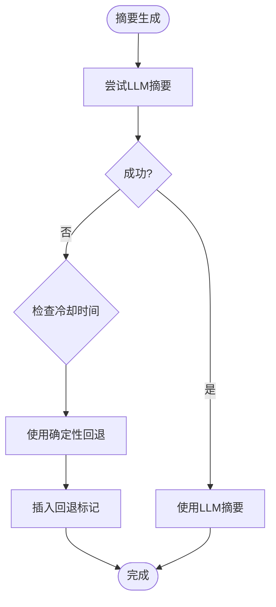
```mermaid
flowchart TD
Start([摘要生成]) --> TryLLM[尝试LLM摘要]
TryLLM --> Success{成功?}
Success --> |是| UseLLM[使用LLM摘要]
Success --> |否| CheckCooldown{检查冷却时间}
CheckCooldown --> UseFallback[使用确定性回退]
UseFallback --> InsertMarker[插入回退标记]
InsertMarker --> End([完成])
UseLLM --> End
```

**图表来源**
- [agent/context_compressor.py:1528-1634](file://agent/context_compressor.py#L1528-L1634)

#### 令牌预算不足
当辅助模型的上下文窗口小于主模型的压缩阈值时：

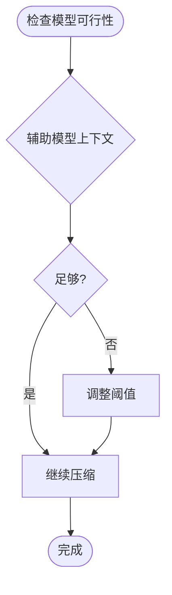
```mermaid
flowchart TD
Start([检查模型可行性]) --> CheckContext{辅助模型上下文}
CheckContext --> Enough{足够?}
Enough --> |是| Proceed[继续压缩]
Enough --> |否| AdjustThreshold[调整阈值]
AdjustThreshold --> Proceed
Proceed --> End([完成])
```

**图表来源**
- [agent/conversation_compression.py:176-252](file://agent/conversation_compression.py#L176-L252)

#### 工具调用对不匹配
当工具调用和结果不匹配时：

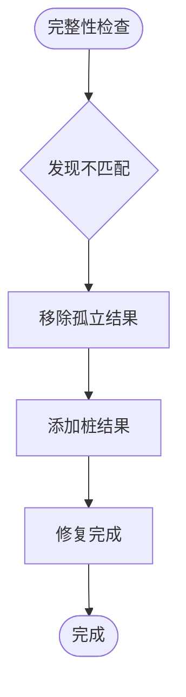
```mermaid
flowchart TD
Start([完整性检查]) --> FindMismatch{发现不匹配}
FindMismatch --> RemoveOrphan[移除孤立结果]
RemoveOrphan --> AddStub[添加桩结果]
AddStub --> FixComplete[修复完成]
FixComplete --> End([完成])
```

**图表来源**
- [agent/context_compressor.py:1771-1799](file://agent/context_compressor.py#L1771-L1799)

**章节来源**
- [agent/context_compressor.py:1528-1634](file://agent/context_compressor.py#L1528-L1634)

### 性能监控指标

压缩器提供了详细的性能监控：

| 指标名称 | 描述 | 默认值 |
|---------|------|--------|
| `last_prompt_tokens` | 最近提示令牌数 | 0 |
| `threshold_tokens` | 压缩阈值令牌数 | 0 |
| `context_length` | 模型上下文长度 | 0 |
| `compression_count` | 压缩次数 | 0 |
| `last_compression_savings_pct` | 最近压缩节省百分比 | 100.0 |

**章节来源**
- [agent/context_engine.py:46-51](file://agent/context_engine.py#L46-L51)

## 结论

上下文压缩器通过精心设计的算法和策略，在保持对话连贯性和任务完整性的同时，有效控制了模型输入的 token 数量。其主要优势包括：

1. **智能压缩策略**：基于多层判断逻辑的触发机制
2. **结构化摘要**：提供丰富的上下文信息保留
3. **完整性保证**：维护工具调用对和上下文链接
4. **性能优化**：采用多种内存和计算优化策略
5. **容错机制**：完善的错误处理和降级策略

该系统为长对话场景提供了可靠的上下文管理解决方案，是 Hermes Agent 能够处理长时间对话的关键技术支撑。