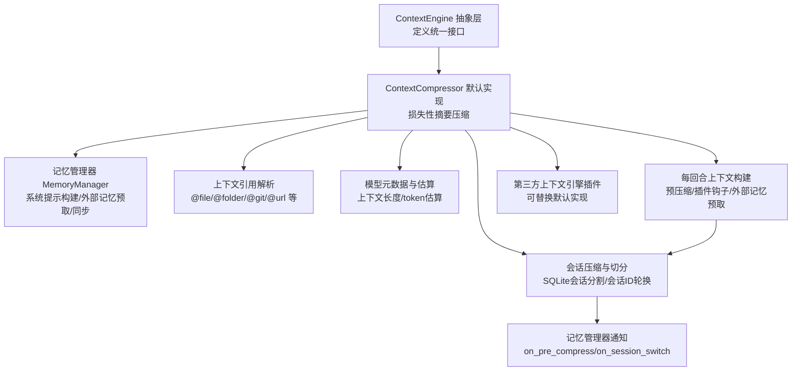
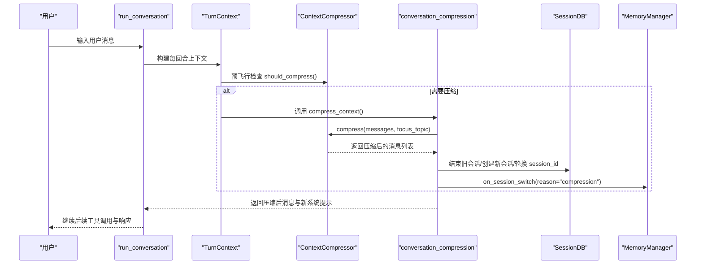
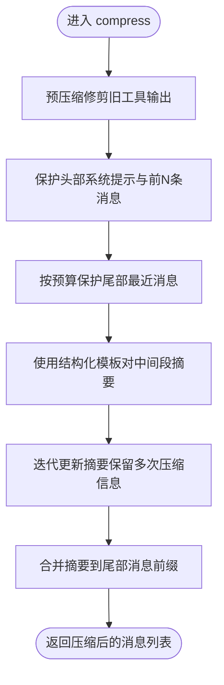
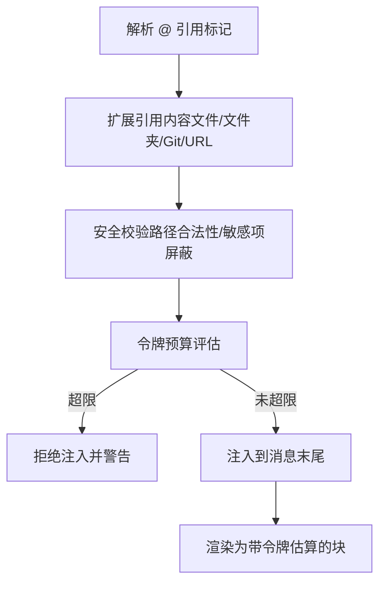
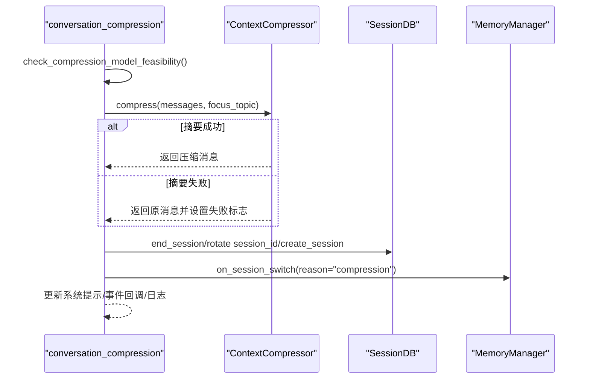
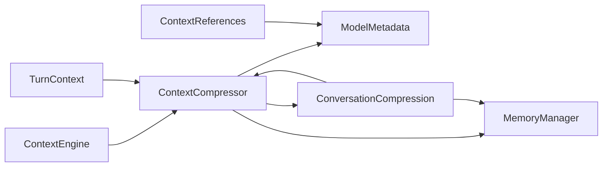

# 上下文引擎

<cite>
**本文档引用的文件**
- [agent/context_engine.py](file://agent/context_engine.py)
- [agent/context_compressor.py](file://agent/context_compressor.py)
- [agent/context_references.py](file://agent/context_references.py)
- [agent/memory_manager.py](file://agent/memory_manager.py)
- [agent/conversation_compression.py](file://agent/conversation_compression.py)
- [agent/turn_context.py](file://agent/turn_context.py)
- [agent/model_metadata.py](file://agent/model_metadata.py)
</cite>

## 目录
1. [简介](#简介)
2. [项目结构](#项目结构)
3. [核心组件](#核心组件)
4. [架构总览](#架构总览)
5. [详细组件分析](#详细组件分析)
6. [依赖关系分析](#依赖关系分析)
7. [性能考虑](#性能考虑)
8. [故障排除指南](#故障排除指南)
9. [结论](#结论)
10. [附录](#附录)

## 简介
本文件系统性阐述上下文引擎的技术架构与实现细节，覆盖以下关键主题：
- 上下文提取、过滤与重组机制
- 上下文压缩算法（token优化策略、信息保留规则、压缩比控制）
- 上下文引用系统（引用标记、解析与渲染）
- 上下文生命周期管理（从创建到过期）
- 缓存策略与性能优化（内存管理与命中率提升）
- 上下文引擎与记忆系统的交互（数据流与同步机制）
- 与AI代理的集成方式与调用序列

## 项目结构
上下文引擎由“抽象接口 + 默认实现 + 预压缩与会话切分 + 引用解析 + 记忆集成”等模块协同组成，围绕 ContextEngine 抽象类展开，默认实现为 ContextCompressor，并通过 conversation_compression 提供压缩入口与会话切分能力；同时提供上下文引用解析与渲染工具，以及与记忆系统的深度集成。

图示来源
- [agent/context_engine.py:32-227](file://agent/context_engine.py#L32-L227)
- [agent/context_compressor.py:593-770](file://agent/context_compressor.py#L593-L770)
- [agent/memory_manager.py:313-795](file://agent/memory_manager.py#L313-L795)
- [agent/conversation_compression.py:281-654](file://agent/conversation_compression.py#L281-L654)
- [agent/turn_context.py:64-391](file://agent/turn_context.py#L64-L391)
- [agent/model_metadata.py:1-200](file://agent/model_metadata.py#L1-L200)

章节来源
- [agent/context_engine.py:1-227](file://agent/context_engine.py#L1-L227)
- [agent/context_compressor.py:1-200](file://agent/context_compressor.py#L1-L200)
- [agent/conversation_compression.py:1-120](file://agent/conversation_compression.py#L1-L120)
- [agent/turn_context.py:1-120](file://agent/turn_context.py#L1-L120)
- [agent/memory_manager.py:1-120](file://agent/memory_manager.py#L1-L120)
- [agent/model_metadata.py:1-120](file://agent/model_metadata.py#L1-L120)

## 核心组件
- ContextEngine 抽象基类：定义上下文引擎的统一接口与生命周期钩子，包括更新token使用、是否压缩、压缩执行、会话开始/结束、工具暴露、状态查询、模型切换等。
- ContextCompressor 默认实现：基于辅助模型进行损失性摘要压缩，保护头尾消息，迭代更新摘要，支持媒体清理、工具结果修剪、图像内容剥离等。
- ConversationCompression：提供压缩可行性检查、压缩执行、会话数据库切分、会话ID轮换、事件回调、图像尺寸收缩等。
- TurnContext：每回合上下文构建，负责预压缩、插件钩子注入、外部记忆预取、系统提示缓存与重建等。
- ContextReferences：上下文引用解析与渲染，支持 @file/@folder/@git/@url 等引用标记，安全路径限制与令牌预算控制。
- MemoryManager：与记忆系统的集成点，负责系统提示块构建、外部记忆预取、同步、工具路由、会话切换通知等。

章节来源
- [agent/context_engine.py:32-227](file://agent/context_engine.py#L32-L227)
- [agent/context_compressor.py:593-770](file://agent/context_compressor.py#L593-L770)
- [agent/conversation_compression.py:281-654](file://agent/conversation_compression.py#L281-L654)
- [agent/turn_context.py:64-391](file://agent/turn_context.py#L64-L391)
- [agent/context_references.py:1-120](file://agent/context_references.py#L1-L120)
- [agent/memory_manager.py:313-795](file://agent/memory_manager.py#L313-L795)

## 架构总览
上下文引擎贯穿“预压缩检查 → 压缩执行 → 会话切分 → 记忆同步”的完整链路，确保在接近或超过模型上下文窗口时，仍能维持对话连贯性与信息完整性。

图示来源
- [agent/turn_context.py:250-317](file://agent/turn_context.py#L250-L317)
- [agent/conversation_compression.py:281-654](file://agent/conversation_compression.py#L281-L654)
- [agent/context_compressor.py:593-770](file://agent/context_compressor.py#L593-L770)
- [agent/memory_manager.py:777-795](file://agent/memory_manager.py#L777-L795)

## 详细组件分析

### 上下文引擎抽象层（ContextEngine）
- 角色与职责：统一上下文引擎接口，负责压缩触发决策、压缩执行、token使用跟踪、会话生命周期管理、可选工具暴露与状态展示。
- 关键属性与方法：
  - 名称标识、token状态字段（最后提示/补全/总计tokens、阈值、上下文长度、压缩次数）
  - 压缩参数（阈值百分比、保护前N条、保护后N条）
  - 接口：update_from_response、should_compress、compress
  - 可选：预飞行检查、延迟预飞行、内容可压缩性检查、会话开始/结束/重置、工具schema与调用、状态查询、模型切换

章节来源
- [agent/context_engine.py:32-227](file://agent/context_engine.py#L32-L227)

### 默认压缩器（ContextCompressor）
- 算法概览：预压缩修剪旧工具输出 → 保护头尾消息 → 使用结构化摘要模板对中间段进行摘要 → 迭代更新摘要以保留多次压缩中的信息。
- 关键特性：
  - 摘要前缀与历史任务/待办/剩余工作等标题，明确区分参考性摘要与最新指令
  - 图像内容剥离与媒体指令清理，避免重复传输大体积附件
  - 工具结果摘要化，减少冗长输出带来的token占用
  - 摘要预算按压缩内容比例分配，上限受模型上下文长度限制
  - 失败冷却与回退策略：摘要失败时插入确定性占位并记录丢弃的turn数量
  - 与模型切换联动：动态调整阈值与摘要预算
- 数据结构与复杂度：
  - 摘要生成涉及多轮摘要模板与输入拼接，时间复杂度与消息长度线性相关
  - 图像剥离与媒体指令清理为线性扫描，空间开销低
  - token预算计算与内容长度估算为常数级开销

图示来源
- [agent/context_compressor.py:593-770](file://agent/context_compressor.py#L593-L770)

章节来源
- [agent/context_compressor.py:1-200](file://agent/context_compressor.py#L1-L200)
- [agent/context_compressor.py:593-770](file://agent/context_compressor.py#L593-L770)

### 上下文引用系统（ContextReferences）
- 引用标记与解析：
  - 支持 @file/@folder/@git/@staged/@diff/@url 等引用
  - 解析文件行号范围、去除尾部标点、安全路径解析与根目录限制
- 渲染与注入：
  - 将引用内容渲染为带令牌估算的文本块，注入到用户消息中
  - 设置硬/软令牌上限，超限时拒绝注入并给出警告
  - 对二进制文件提供可操作的占位块而非直接内联
- 安全与合规：
  - 屏蔽敏感路径（如 ~/.ssh、~/.aws 等）与敏感文件（如 ~/.ssh/id_rsa、~/.bashrc 等）
  - URL抓取通过工具函数异步执行，避免阻塞

图示来源
- [agent/context_references.py:62-204](file://agent/context_references.py#L62-L204)
- [agent/context_references.py:206-335](file://agent/context_references.py#L206-L335)

章节来源
- [agent/context_references.py:1-200](file://agent/context_references.py#L1-L200)
- [agent/context_references.py:200-400](file://agent/context_references.py#L200-L400)

### 会话压缩与生命周期（ConversationCompression）
- 压缩可行性检查：在首次压缩尝试时探测辅助压缩模型上下文是否足以容纳主模型的压缩阈值，必要时自动降低阈值并发出警告
- 压缩执行：调用 ContextCompressor.compress，处理摘要失败回退、会话ID轮换、SQLite会话切分、系统提示重建、事件回调等
- 并发保护：压缩锁防止同一会话并发压缩导致孤儿会话
- 图像过大恢复：对 data:image/...;base64 的图像进行二次编码与尺寸缩小，以规避供应商5MB等限制

图示来源
- [agent/conversation_compression.py:74-261](file://agent/conversation_compression.py#L74-L261)
- [agent/conversation_compression.py:281-654](file://agent/conversation_compression.py#L281-L654)

章节来源
- [agent/conversation_compression.py:1-120](file://agent/conversation_compression.py#L1-L120)
- [agent/conversation_compression.py:281-654](file://agent/conversation_compression.py#L281-L654)

### 每回合上下文构建（TurnContext）
- 职责：每回合一次性初始化，包括安全stdio、会话DB、运行时主客户端绑定、日志上下文、任务/回合ID生成、重试计数器重置、连接健康检查、压缩警告重放、系统提示缓存/重建、预压缩检查、插件钩子注入、外部记忆预取等
- 关键流程：预飞行压缩检查与执行、插件 pre_llm_call 钩子、外部记忆预取缓存

章节来源
- [agent/turn_context.py:64-391](file://agent/turn_context.py#L64-L391)

### 记忆系统集成（MemoryManager）
- 系统提示构建：收集各提供者的系统提示块并组合
- 预取与同步：在回合开始前进行外部记忆预取，在回合结束后进行同步，后台线程串行写入，避免阻塞
- 工具路由：聚合外部提供者工具schema，避免与内置核心工具冲突
- 会话切换：在压缩等场景触发 session_id 轮换时，通知各提供者刷新其内部缓存状态
- 上下文清洗：提供流式与非流式的上下文清洗器，确保内存上下文标签与系统注释不泄露到UI

章节来源
- [agent/memory_manager.py:313-795](file://agent/memory_manager.py#L313-L795)

## 依赖关系分析
- ContextEngine ← ContextCompressor：默认实现继承抽象接口
- ContextCompressor ← ModelMetadata：依赖上下文长度与token估算
- ContextCompressor ← ConversationCompression：压缩入口与会话切分
- ContextCompressor ← MemoryManager：压缩前/后与会话切换通知
- TurnContext ← ContextCompressor：预飞行压缩检查
- ContextReferences ← ModelMetadata：令牌估算用于预算控制
- ConversationCompression ← ContextCompressor：压缩执行
- ConversationCompression ← MemoryManager：压缩前通知与会话切换

图示来源
- [agent/context_engine.py:32-227](file://agent/context_engine.py#L32-L227)
- [agent/context_compressor.py:593-770](file://agent/context_compressor.py#L593-L770)
- [agent/conversation_compression.py:281-654](file://agent/conversation_compression.py#L281-L654)
- [agent/memory_manager.py:313-795](file://agent/memory_manager.py#L313-L795)
- [agent/turn_context.py:250-317](file://agent/turn_context.py#L250-L317)
- [agent/context_references.py:132-204](file://agent/context_references.py#L132-L204)
- [agent/model_metadata.py:1-200](file://agent/model_metadata.py#L1-L200)

章节来源
- [agent/context_engine.py:32-227](file://agent/context_engine.py#L32-L227)
- [agent/context_compressor.py:593-770](file://agent/context_compressor.py#L593-L770)
- [agent/conversation_compression.py:281-654](file://agent/conversation_compression.py#L281-L654)
- [agent/turn_context.py:250-317](file://agent/turn_context.py#L250-L317)
- [agent/context_references.py:132-204](file://agent/context_references.py#L132-L204)
- [agent/memory_manager.py:313-795](file://agent/memory_manager.py#L313-L795)
- [agent/model_metadata.py:1-200](file://agent/model_metadata.py#L1-L200)

## 性能考虑
- 预压缩修剪：在调用摘要模型之前先修剪旧工具输出，显著降低摘要输入规模
- 媒体清理：仅在最近用户消息携带图像时，对更早消息中的图像进行剥离，避免重复传输大体积附件
- 令牌预算：按压缩内容比例分配摘要预算，结合模型上下文长度上限，避免摘要过长
- 后台同步：记忆同步与预取通过单线程后台执行器串行化，避免阻塞主线程
- 缓存与估算：模型元数据与token估算采用缓存策略，减少重复网络请求与计算
- 图像尺寸恢复：在图像过大错误发生时，尝试缩小尺寸或重新编码，提高成功率

## 故障排除指南
- 辅助压缩模型不可用或上下文不足：启动时进行可行性检查，若辅助模型上下文小于阈值，自动降低阈值并发出警告；必要时配置更大的压缩模型或降低阈值
- 摘要失败：默认插入确定性占位并记录丢弃的turn数量；可通过 /compress 手动重试
- 并发压缩冲突：压缩锁防止同一会话并发压缩，出现冲突时跳过本次压缩并提示稍后重试
- 图像过大：当供应商拒绝超大图像时，尝试缩小尺寸或更换格式；若无法缩小则建议改用链接或摘要
- 引用注入超限：当 @ 引用注入的令牌超过硬/软上限时，拒绝注入并给出警告，建议减少引用或拆分

章节来源
- [agent/conversation_compression.py:74-261](file://agent/conversation_compression.py#L74-L261)
- [agent/conversation_compression.py:340-427](file://agent/conversation_compression.py#L340-L427)
- [agent/context_compressor.py:771-800](file://agent/context_compressor.py#L771-L800)
- [agent/context_references.py:167-187](file://agent/context_references.py#L167-L187)

## 结论
上下文引擎通过抽象接口与默认实现分离、预压缩与迭代摘要相结合、严格的令牌预算与媒体清理策略，实现了在高上下文窗口下的稳定与高效运行。与记忆系统的深度集成确保了长期记忆的一致性与可检索性，而与AI代理的紧密耦合使得压缩与会话切分在每回合上下文中无缝衔接，既保证了性能也维护了用户体验。

## 附录
- 代码示例路径（不展示具体代码内容，仅提供定位）：
  - 上下文引擎接口定义：[agent/context_engine.py:32-227](file://agent/context_engine.py#L32-L227)
  - 默认压缩器算法入口：[agent/context_compressor.py:593-770](file://agent/context_compressor.py#L593-L770)
  - 会话压缩与切分流程：[agent/conversation_compression.py:281-654](file://agent/conversation_compression.py#L281-L654)
  - 每回合上下文构建：[agent/turn_context.py:64-391](file://agent/turn_context.py#L64-L391)
  - 上下文引用解析与渲染：[agent/context_references.py:62-204](file://agent/context_references.py#L62-L204)
  - 记忆系统集成与工具路由：[agent/memory_manager.py:313-795](file://agent/memory_manager.py#L313-L795)
  - 模型元数据与token估算：[agent/model_metadata.py:1-200](file://agent/model_metadata.py#L1-L200)