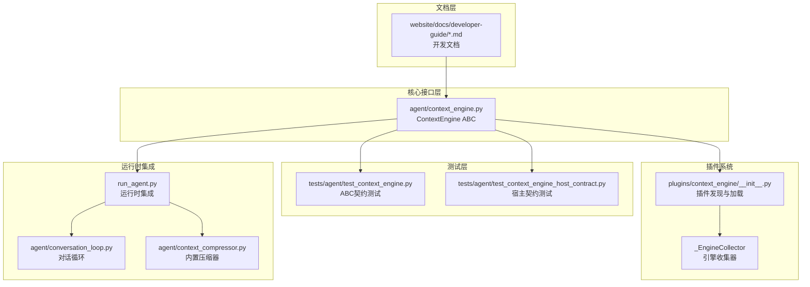
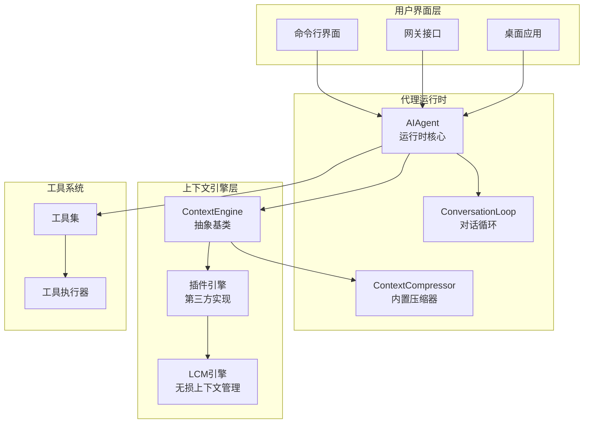
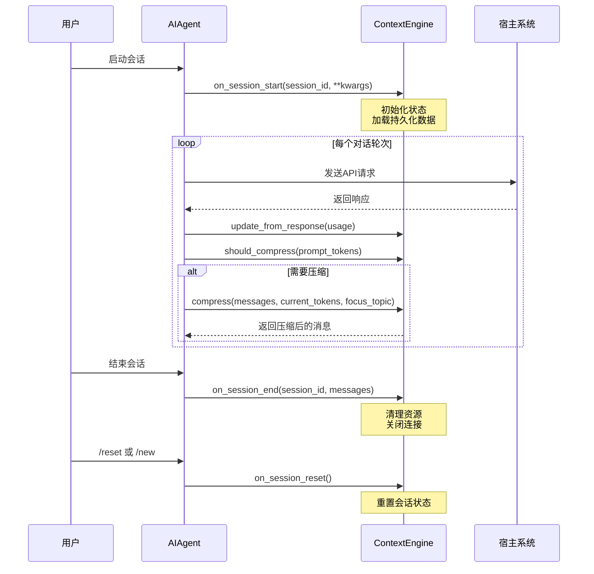
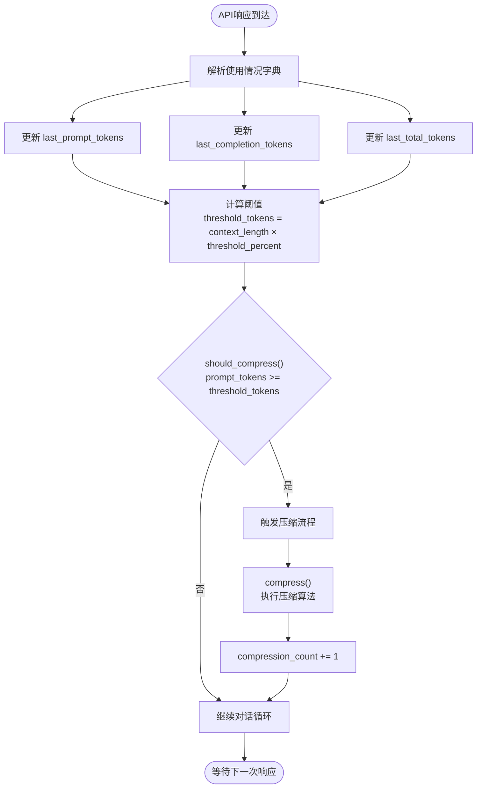
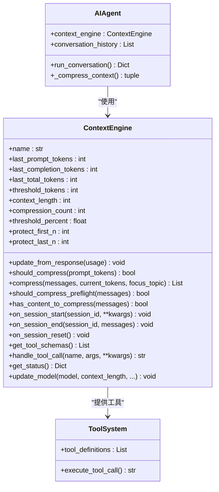
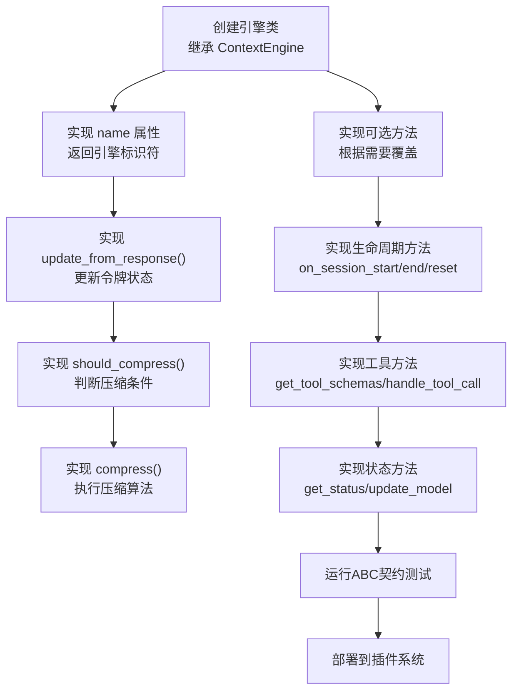
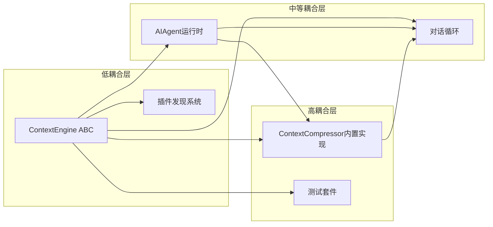

# 上下文引擎核心接口

<cite>
**本文档引用的文件**
- [agent/context_engine.py](file://agent/context_engine.py)
- [plugins/context_engine/__init__.py](file://plugins/context_engine/__init__.py)
- [tests/agent/test_context_engine.py](file://tests/agent/test_context_engine.py)
- [tests/agent/test_context_engine_host_contract.py](file://tests/agent/test_context_engine_host_contract.py)
- [website/docs/developer-guide/context-engine-plugin.md](file://website/docs/developer-guide/context-engine-plugin.md)
- [website/docs/developer-guide/context-compression-and-caching.md](file://website/docs/developer-guide/context-compression-and-caching.md)
- [run_agent.py](file://run_agent.py)
- [agent/conversation_loop.py](file://agent/conversation_loop.py)
- [agent/context_compressor.py](file://agent/context_compressor.py)
</cite>

## 目录
1. [简介](#简介)
2. [项目结构](#项目结构)
3. [核心组件](#核心组件)
4. [架构概览](#架构概览)
5. [详细组件分析](#详细组件分析)
6. [依赖关系分析](#依赖关系分析)
7. [性能考虑](#性能考虑)
8. [故障排除指南](#故障排除指南)
9. [结论](#结论)
10. [附录](#附录)

## 简介

上下文引擎核心接口是Hermes Agent框架中用于管理对话上下文的核心抽象。该接口设计允许开发者实现自定义的上下文管理策略，支持有损压缩、无损上下文管理等多种策略。本文档深入解释ContextEngine抽象基类的设计理念、接口规范、生命周期管理和与AI代理的集成方式。

## 项目结构

上下文引擎相关的核心文件分布如下：



**图表来源**
- [agent/context_engine.py:1-227](file://agent/context_engine.py#L1-L227)
- [plugins/context_engine/__init__.py:1-286](file://plugins/context_engine/__init__.py#L1-L286)

**章节来源**
- [agent/context_engine.py:1-227](file://agent/context_engine.py#L1-L227)
- [plugins/context_engine/__init__.py:1-286](file://plugins/context_engine/__init__.py#L1-L286)

## 核心组件

### ContextEngine抽象基类

ContextEngine是所有上下文引擎的抽象基类，定义了统一的接口规范。该类采用抽象基类模式，确保所有实现都遵循相同的行为契约。

#### 核心属性

引擎必须维护以下令牌跟踪状态：
- `last_prompt_tokens`: 最后一次请求的提示词令牌数
- `last_completion_tokens`: 最后一次响应的完成令牌数  
- `last_total_tokens`: 最后一次的总令牌数
- `threshold_tokens`: 触发压缩的令牌阈值
- `context_length`: 模型的完整上下文窗口大小
- `compression_count`: 压缩执行次数

#### 关键参数

引擎提供以下可配置参数控制压缩行为：
- `threshold_percent`: 阈值百分比，默认0.75
- `protect_first_n`: 保护的消息数量，默认3
- `protect_last_n`: 尾部保护的消息数量，默认6

**章节来源**
- [agent/context_engine.py:32-227](file://agent/context_engine.py#L32-L227)

## 架构概览

上下文引擎架构采用插件化设计，支持多种上下文管理策略：



**图表来源**
- [run_agent.py:5227-5248](file://run_agent.py#L5227-L5248)
- [agent/context_engine.py:32-227](file://agent/context_engine.py#L32-L227)

## 详细组件分析

### 接口规范详解

#### 必需抽象方法

1. **update_from_response()**
   - 功能：从API响应更新令牌使用情况
   - 参数：usage字典（包含标准化的令牌计数）
   - 返回：None
   - 兼容性：支持传统聚合键和新式规范桶

2. **should_compress()**
   - 功能：判断当前轮次是否应该触发压缩
   - 参数：prompt_tokens（可选的提示词令牌估算）
   - 返回：布尔值

3. **compress()**
   - 功能：对消息列表进行压缩
   - 参数：
     - messages: 完整的消息列表
     - current_tokens: 当前令牌估算
     - focus_topic: 可选的主题焦点
   - 返回：压缩后的消息列表

#### 可选扩展方法

1. **should_compress_preflight()**
   - 功能：API调用前的快速检查
   - 默认：返回False（跳过预检）

2. **has_content_to_compress()**
   - 功能：检查是否有内容可以压缩
   - 默认：返回True（总是尝试）

3. **on_session_start()**
   - 功能：会话开始时的初始化
   - 参数：session_id和kwargs（可能包含平台信息）

4. **on_session_end()**
   - 功能：会话结束时的状态清理

5. **on_session_reset()**
   - 功能：会话重置时的状态清除
   - 默认：重置令牌计数器和压缩计数

6. **get_tool_schemas()**
   - 功能：返回引擎提供的工具模式
   - 默认：返回空列表

7. **handle_tool_call()**
   - 功能：处理工具调用
   - 默认：返回未知工具错误

8. **get_status()**
   - 功能：返回状态信息
   - 默认：返回标准令牌/阈值字典

9. **update_model()**
   - 功能：模型切换时的更新
   - 默认：更新上下文长度和阈值

**章节来源**
- [agent/context_engine.py:70-227](file://agent/context_engine.py#L70-L227)

### 生命周期管理

上下文引擎的生命周期严格遵循以下顺序：



**图表来源**
- [tests/agent/test_context_engine_host_contract.py:44-159](file://tests/agent/test_context_engine_host_contract.py#L44-L159)
- [agent/context_engine.py:144-166](file://agent/context_engine.py#L144-L166)

### 令牌跟踪系统

令牌跟踪系统提供了完整的令牌使用监控能力：



**图表来源**
- [agent/context_engine.py:70-106](file://agent/context_engine.py#L70-L106)
- [agent/context_engine.py:192-206](file://agent/context_engine.py#L192-L206)

### 压缩决策机制

压缩决策基于多维度参数：

#### 阈值百分比（threshold_percent）
- 默认值：0.75（75%）
- 作用：确定触发压缩的上下文使用率阈值
- 计算：threshold_tokens = context_length × threshold_percent

#### 保护消息数量（protect_first_n/protect_last_n）
- protect_first_n：保护头部消息数量（默认3），额外包含系统提示
- protect_last_n：保护尾部消息数量（默认6）
- 作用：确保重要的历史对话和最新交互不被压缩

#### 预检压缩（should_compress_preflight）
- 功能：在实际API调用前进行快速估算
- 默认：False（跳过预检）
- 适用场景：第三方引擎可以实现成本较低的预估逻辑

**章节来源**
- [agent/context_engine.py:64-126](file://agent/context_engine.py#L64-L126)

### 与AI代理的集成

#### 状态同步机制

上下文引擎与AI代理通过以下方式保持状态同步：

1. **令牌状态共享**：代理直接读取引擎的令牌状态用于显示和日志
2. **生命周期回调**：代理在适当时机调用引擎的生命周期方法
3. **工具集成**：引擎提供的工具自动注入到代理的工具系统

#### 工具调用机制



**图表来源**
- [agent/context_engine.py:32-227](file://agent/context_engine.py#L32-L227)
- [run_agent.py:5071-5085](file://run_agent.py#L5071-L5085)

**章节来源**
- [website/docs/developer-guide/context-engine-plugin.md:100-125](file://website/docs/developer-guide/context-engine-plugin.md#L100-L125)
- [run_agent.py:5071-5085](file://run_agent.py#L5071-L5085)

### 自定义上下文引擎实现

#### 基础实现模板



#### 配置与部署

1. **插件目录结构**：
   ```
   plugins/context_engine/my-engine/
   ├── __init__.py          # 导出引擎类
   ├── plugin.yaml          # 元数据配置
   └── engine_impl.py       # 引擎实现
   ```

2. **配置方式**：
   ```yaml
   context:
     engine: "my-engine"     # 必须与引擎name属性匹配
   ```

3. **注册机制**：
   - 目录发现：自动扫描`plugins/context_engine/<name>/`目录
   - 插件注册：通过通用插件系统`ctx.register_context_engine()`

**章节来源**
- [website/docs/developer-guide/context-engine-plugin.md:26-35](file://website/docs/developer-guide/context-engine-plugin.md#L26-L35)
- [website/docs/developer-guide/context-engine-plugin.md:129-143](file://website/docs/developer-guide/context-engine-plugin.md#L129-L143)

## 依赖关系分析

### 组件耦合度



**图表来源**
- [agent/context_engine.py:28-30](file://agent/context_engine.py#L28-L30)
- [plugins/context_engine/__init__.py:199-286](file://plugins/context_engine/__init__.py#L199-L286)

### 外部依赖

1. **Python标准库**：abc模块用于抽象基类
2. **类型注解**：typing模块提供类型安全
3. **配置系统**：支持YAML配置文件
4. **插件系统**：集成到通用插件框架

**章节来源**
- [plugins/context_engine/__init__.py:21-26](file://plugins/context_engine/__init__.py#L21-L26)

## 性能考虑

### 令牌跟踪优化

1. **增量更新**：只在响应到达时更新令牌状态
2. **内存效率**：避免存储完整的令牌历史
3. **计算复杂度**：令牌计算为O(1)操作

### 压缩算法选择

1. **预检优化**：可选的预检机制避免不必要的计算
2. **批量处理**：支持批量消息压缩提高效率
3. **缓存机制**：利用模型缓存减少重复计算

### 并发处理

1. **线程安全**：令牌状态更新需要考虑并发访问
2. **状态隔离**：每个会话维护独立的状态
3. **资源管理**：及时释放不再使用的资源

## 故障排除指南

### 常见问题诊断

1. **引擎未激活**
   - 检查`context.engine`配置是否正确
   - 验证引擎类是否正确实现ABC
   - 确认插件目录结构完整

2. **令牌统计异常**
   - 验证`update_from_response()`实现
   - 检查令牌阈值计算逻辑
   - 确认状态重置机制正常工作

3. **压缩触发问题**
   - 检查`should_compress()`判断逻辑
   - 验证阈值百分比配置
   - 确认保护消息数量设置合理

**章节来源**
- [tests/agent/test_context_engine.py:64-86](file://tests/agent/test_context_engine.py#L64-L86)
- [tests/agent/test_context_engine_host_contract.py:198-250](file://tests/agent/test_context_engine_host_contract.py#L198-L250)

### 调试技巧

1. **启用详细日志**：查看令牌使用和压缩触发记录
2. **单元测试**：运行ABC契约测试确保接口完整性
3. **集成测试**：验证与代理运行时的集成效果

## 结论

上下文引擎核心接口通过清晰的抽象设计和灵活的插件机制，为Hermes Agent提供了强大的上下文管理能力。该接口不仅支持内置的有损压缩策略，还为第三方实现无损上下文管理等创新方案提供了标准化的接入点。

设计特点包括：
- **强类型约束**：通过ABC确保接口一致性
- **生命周期管理**：完整的会话状态管理
- **工具集成**：原生支持代理工具调用
- **插件化架构**：支持第三方扩展
- **性能优化**：考虑了令牌跟踪和压缩的效率

这一设计为AI代理在长对话场景下的稳定运行提供了坚实的基础。

## 附录

### 测试参考

完整的测试套件包括：
- ABC契约测试：验证接口完整性
- 生命周期测试：确认状态管理正确性
- 集成测试：验证与代理运行时的协作
- 插件系统测试：确保插件发现和加载机制

### 最佳实践

1. **实现最小必要功能**：只实现必需的抽象方法
2. **正确处理状态**：维护准确的令牌统计
3. **优雅处理错误**：提供有意义的错误信息
4. **性能优先**：优化压缩算法和令牌计算
5. **文档完善**：提供清晰的使用说明和配置示例