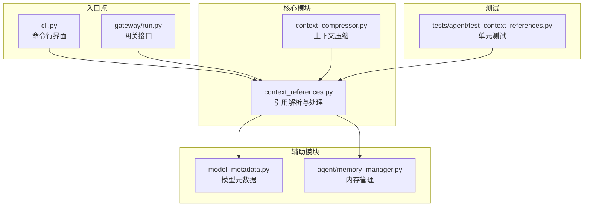
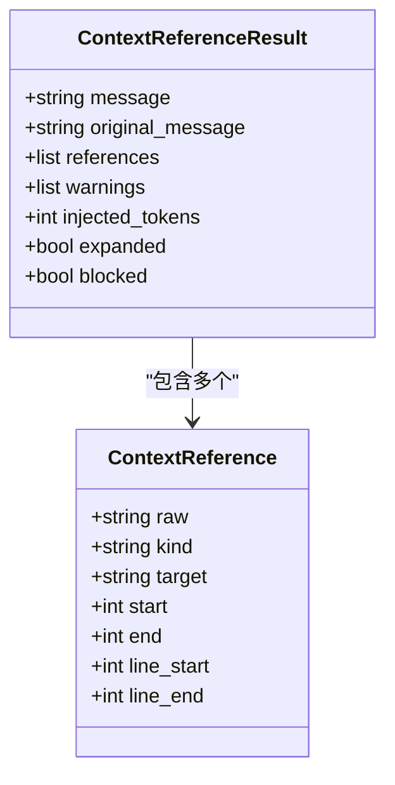
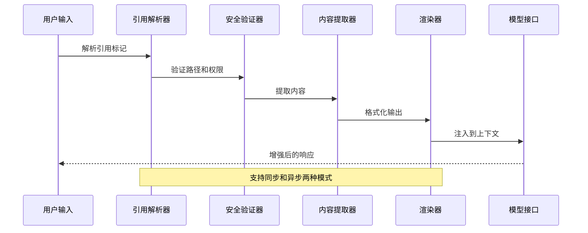
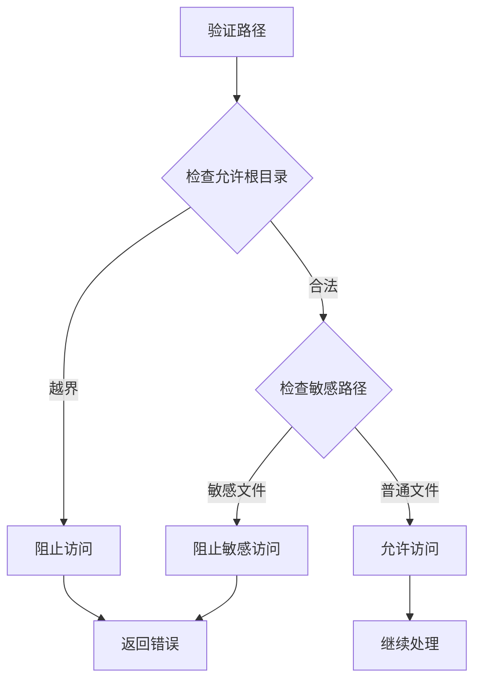
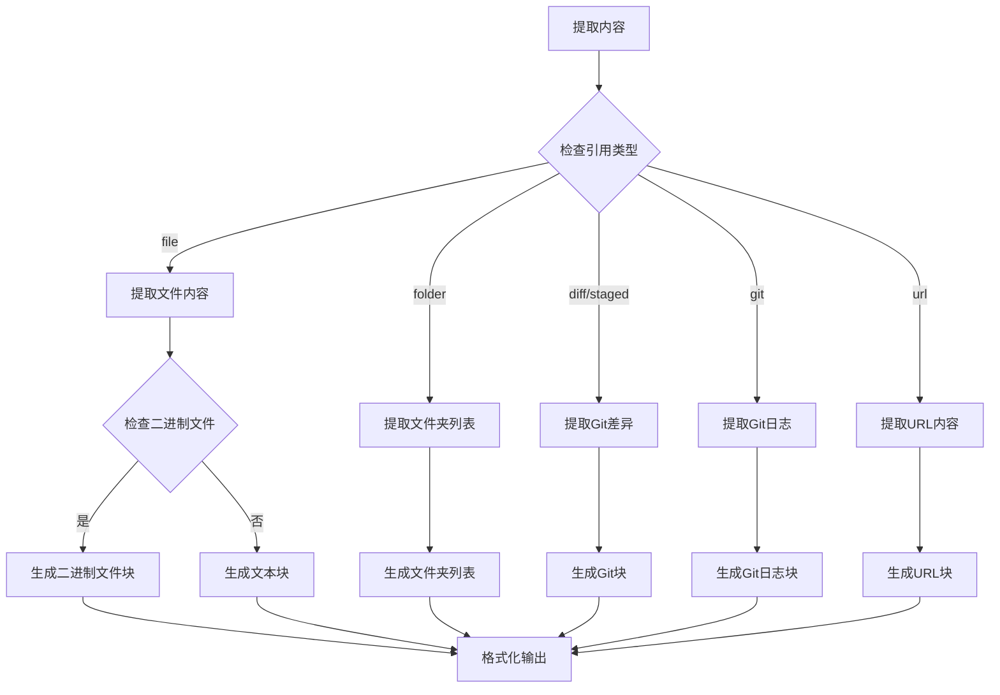
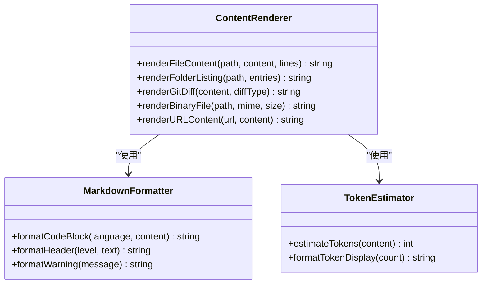
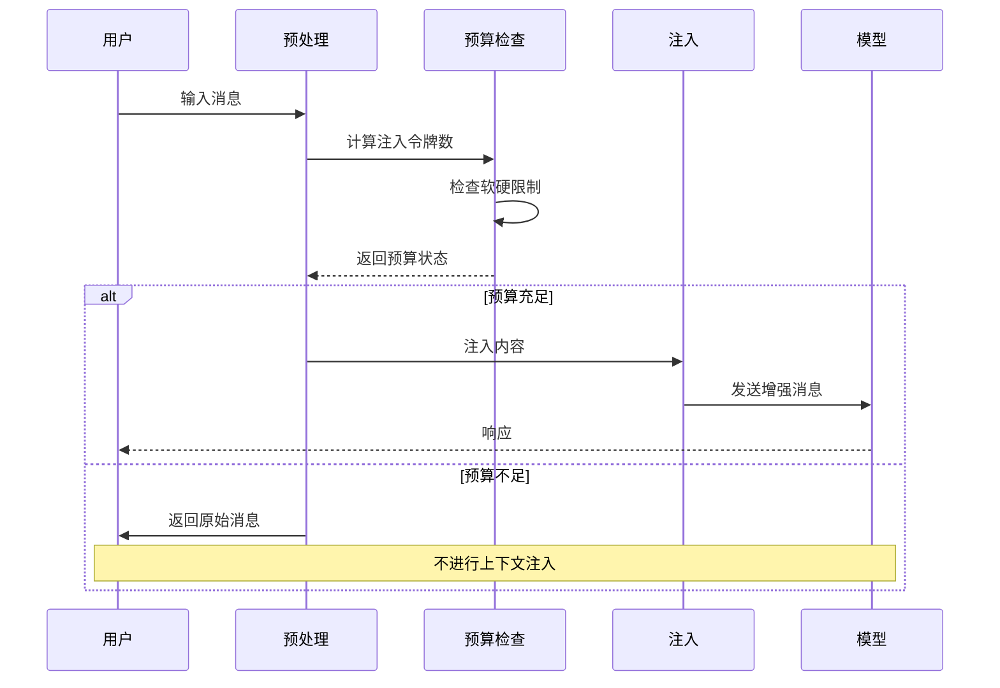
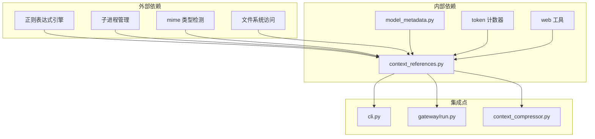

# 上下文引用系统

<cite>
**本文档引用的文件**
- [agent/context_references.py](file://agent/context_references.py)
- [tests/agent/test_context_references.py](file://tests/agent/test_context_references.py)
- [agent/context_compressor.py](file://agent/context_compressor.py)
- [cli.py](file://cli.py)
- [gateway/run.py](file://gateway/run.py)
- [agent/model_metadata.py](file://agent/model_metadata.py)
- [agent/memory_manager.py](file://agent/memory_manager.py)
</cite>

## 目录
1. [引言](#引言)
2. [项目结构](#项目结构)
3. [核心组件](#核心组件)
4. [架构概览](#架构概览)
5. [详细组件分析](#详细组件分析)
6. [依赖关系分析](#依赖关系分析)
7. [性能考虑](#性能考虑)
8. [故障排除指南](#故障排除指南)
9. [结论](#结论)

## 引言

上下文引用系统是 Hermes Agent 中的一个关键组件，负责处理用户输入中的引用标记，将外部内容（文件、Git 差异、URL 等）动态注入到对话上下文中。该系统实现了完整的引用生命周期管理，从引用标记的识别、解析、安全验证、内容提取到最终的渲染呈现。

系统支持多种引用类型：
- 文件引用：@file:path[:line-range]
- 文件夹引用：@folder:path
- Git 引用：@diff、@staged、@git:n
- URL 引用：@url:https://example.com

每个引用都会经过严格的安全检查和大小限制，确保不会泄露敏感信息且不会超出模型的上下文窗口限制。

## 项目结构

上下文引用系统主要分布在以下文件中：



**图表来源**
- [agent/context_references.py:1-552](file://agent/context_references.py#L1-L552)
- [agent/context_compressor.py:1-2427](file://agent/context_compressor.py#L1-L2427)
- [cli.py:10070-10269](file://cli.py#L10070-L10269)
- [gateway/run.py:8210-8409](file://gateway/run.py#L8210-L8409)

**章节来源**
- [agent/context_references.py:1-552](file://agent/context_references.py#L1-L552)
- [agent/context_compressor.py:1-2427](file://agent/context_compressor.py#L1-L2427)
- [cli.py:10070-10269](file://cli.py#L10070-L10269)
- [gateway/run.py:8210-8409](file://gateway/run.py#L8210-L8409)

## 核心组件

### 数据结构设计

系统使用两个核心数据类来表示引用信息：



**图表来源**
- [agent/context_references.py:40-60](file://agent/context_references.py#L40-L60)
- [agent/context_references.py:51-60](file://agent/context_references.py#L51-L60)

### 引用格式规范

系统支持多种引用格式：

| 引用类型 | 格式 | 示例 | 描述 |
|---------|------|------|------|
| 文件引用 | @file:path[:line-range] | @file:src/main.py:1-10 | 单个文件，可指定行范围 |
| 文件引用 | @file:"path with spaces":line-start-line-end | @file:"docs/readme.md":5-15 | 包含空格的路径，带引号 |
| 文件夹引用 | @folder:path | @folder:src/ | 整个文件夹的内容 |
| Git 引用 | @diff | @diff | 工作副本与暂存区的差异 |
| Git 引用 | @staged | @staged | 暂存区与上次提交的差异 |
| Git 引用 | @git:n | @git:3 | 最近 n 次提交的详细信息 |
| URL 引用 | @url:url | @url:https://example.com | 远程网页内容 |

**章节来源**
- [agent/context_references.py:16-22](file://agent/context_references.py#L16-L22)
- [agent/context_references.py:62-102](file://agent/context_references.py#L62-L102)

## 架构概览

上下文引用系统采用分层架构设计，确保功能的模块化和可维护性：



**图表来源**
- [agent/context_references.py:105-203](file://agent/context_references.py#L105-L203)
- [agent/context_references.py:206-233](file://agent/context_references.py#L206-L233)

系统的核心流程包括：

1. **引用识别**：使用正则表达式匹配 @ 符号开头的引用标记
2. **安全验证**：检查路径合法性、权限和敏感文件保护
3. **内容提取**：根据引用类型执行相应的提取操作
4. **格式化渲染**：将提取的内容转换为 Markdown 格式
5. **上下文注入**：将内容注入到对话历史中

**章节来源**
- [agent/context_references.py:132-203](file://agent/context_references.py#L132-L203)

## 详细组件分析

### 引用解析器

引用解析器负责识别和解析用户输入中的引用标记：

```mermaid
flowchart TD
Start([开始解析]) --> CheckEmpty{输入是否为空}
CheckEmpty --> |是| ReturnEmpty[返回空结果]
CheckEmpty --> |否| FindMatches[查找所有@引用]
FindMatches --> ProcessMatch{是否有匹配项}
ProcessMatch --> |否| ReturnRefs[返回引用列表]
ProcessMatch --> |是| ParseSimple{是否为简单引用}
ParseSimple --> |是| CreateSimple[创建简单引用对象]
ParseSimple --> |否| ParseTyped[解析类型化引用]
ParseTyped --> ExtractTarget[提取目标路径]
ExtractTarget --> ValidatePath[验证路径安全性]
ValidatePath --> CreateTyped[创建类型化引用对象]
CreateSimple --> NextMatch[处理下一个匹配]
CreateTyped --> NextMatch
NextMatch --> FindMatches
```

**图表来源**
- [agent/context_references.py:62-102](file://agent/context_references.py#L62-L102)
- [agent/context_references.py:206-233](file://agent/context_references.py#L206-L233)

解析器支持以下引用类型：

- **简单引用**：@diff、@staged（无参数）
- **类型化引用**：@file:、@folder:、@git:、@url:（带参数）

**章节来源**
- [agent/context_references.py:62-102](file://agent/context_references.py#L62-L102)

### 安全验证系统

安全验证系统确保引用操作不会泄露敏感信息或访问受限资源：



**图表来源**
- [agent/context_references.py:337-370](file://agent/context_references.py#L337-L370)

系统保护的敏感路径包括：
- SSH 密钥文件（~/.ssh/*）
- AWS 凭据文件（~/.aws/*）
- GPG 秘钥（~/.gnupg/*）
- Kubernetes 配置（~/.kube/*）
- Docker 配置（~/.docker/*）
- Heremes 内部配置（.hermes/*）

**章节来源**
- [agent/context_references.py:21-37](file://agent/context_references.py#L21-L37)
- [agent/context_references.py:350-370](file://agent/context_references.py#L350-L370)

### 内容提取器

内容提取器根据引用类型执行相应的提取操作：



**图表来源**
- [agent/context_references.py:206-334](file://agent/context_references.py#L206-L334)

**章节来源**
- [agent/context_references.py:236-334](file://agent/context_references.py#L236-L334)

### 渲染系统

渲染系统负责将提取的内容转换为适合模型理解的格式：



**图表来源**
- [agent/context_references.py:236-268](file://agent/context_references.py#L236-L268)
- [agent/context_references.py:428-552](file://agent/context_references.py#L428-L552)

渲染系统支持的输出格式：

| 内容类型 | 输出格式 | 示例 |
|---------|---------|------|
| 文本文件 | Markdown 代码块 | ```python<br/>print("hello")<br/>``` |
| 文件夹 | 层次化列表 | src/<br/>&nbsp;&nbsp;- main.py (100 lines)<br/>&nbsp;&nbsp;- utils.py (50 lines) |
| Git 差异 | Diff 格式 | ```diff<br/>+ new line<br/>- removed line<br/>``` |
| 二进制文件 | 行为说明 | 附件：binary file (application/octet-stream, 1.2 KB) |
| URL 内容 | Markdown 文本 | # 页面标题<br/>页面内容... |

**章节来源**
- [agent/context_references.py:236-268](file://agent/context_references.py#L236-L268)
- [agent/context_references.py:512-552](file://agent/context_references.py#L512-L552)

### 上下文注入与预算控制

系统实现了智能的上下文注入机制，确保不会超出模型的上下文窗口限制：



**图表来源**
- [agent/context_references.py:167-187](file://agent/context_references.py#L167-L187)

预算控制策略：
- **硬限制**：总注入令牌数不超过上下文长度的 50%
- **软限制**：总注入令牌数超过上下文长度的 25% 时发出警告
- **令牌估算**：使用启发式算法估算 Markdown 内容的令牌数

**章节来源**
- [agent/context_references.py:167-203](file://agent/context_references.py#L167-L203)

## 依赖关系分析

上下文引用系统与其他组件的依赖关系如下：



**图表来源**
- [agent/context_references.py:1-15](file://agent/context_references.py#L1-L15)
- [agent/context_compressor.py:26-33](file://agent/context_compressor.py#L26-L33)

**章节来源**
- [agent/context_references.py:1-15](file://agent/context_references.py#L1-L15)
- [agent/context_compressor.py:26-33](file://agent/context_compressor.py#L26-L33)

## 性能考虑

### 查找效率优化

系统采用了多种优化策略来提高引用查找和处理的效率：

1. **单次正则扫描**：使用一次正则表达式扫描同时识别所有引用标记
2. **延迟加载**：仅在需要时才执行实际的内容提取操作
3. **缓存机制**：对已提取的内容进行缓存，避免重复处理
4. **异步处理**：支持异步模式，避免阻塞主线程

### 存储空间优化

为了最小化内存占用，系统实现了以下优化：

1. **流式处理**：对于大文件，采用流式读取而非一次性加载到内存
2. **增量构建**：逐步构建输出内容，而不是先构建完整字符串再处理
3. **令牌估算**：在实际注入前估算令牌数量，避免不必要的内容提取

### 内存管理

系统遵循严格的内存管理原则：

1. **及时释放**：处理完的临时变量立即释放
2. **异常安全**：确保在异常情况下也能正确清理资源
3. **超时控制**：对可能阻塞的操作设置超时时间

**章节来源**
- [agent/context_references.py:121-129](file://agent/context_references.py#L121-L129)
- [agent/context_references.py:294-306](file://agent/context_references.py#L294-L306)

## 故障排除指南

### 常见问题及解决方案

#### 引用无法解析
**症状**：@file:src/main.py 被忽略
**原因**：
- 文件不存在
- 路径不在允许范围内
- 权限不足

**解决方案**：
1. 检查文件路径是否正确
2. 确认文件存在于工作目录中
3. 使用绝对路径或相对路径的正确形式

#### 安全访问被阻止
**症状**：出现 "path is outside the allowed workspace" 错误
**原因**：
- 引用路径超出了允许的工作空间范围
- 访问了敏感目录或文件

**解决方案**：
1. 将引用限制在工作目录内
2. 使用相对路径而非 ../ 路径
3. 检查 HERMES_HOME 环境变量设置

#### 令牌超限
**症状**：@context injection refused: X tokens exceeds the 50% hard limit
**原因**：
- 注入的内容过多，超出模型上下文限制

**解决方案**：
1. 减少引用的数量或大小
2. 使用更精确的行范围限定
3. 分批处理大文件

#### Git 命令失败
**症状**：git diff 或 git log 执行失败
**原因**：
- 当前目录不是 Git 仓库
- Git 命令执行超时
- 权限不足

**解决方案**：
1. 确保在正确的 Git 仓库中运行
2. 检查 Git 安装和配置
3. 简化引用，减少输出量

**章节来源**
- [tests/agent/test_context_references.py:195-227](file://tests/agent/test_context_references.py#L195-L227)
- [tests/agent/test_context_references.py:289-328](file://tests/agent/test_context_references.py#L289-L328)

### 调试技巧

1. **启用详细日志**：在调试模式下查看详细的处理步骤
2. **逐步验证**：单独测试每个引用类型的功能
3. **检查环境变量**：确认 HOME 和 HERMES_HOME 设置正确
4. **验证模型配置**：确保模型上下文长度配置准确

## 结论

上下文引用系统是一个设计精良的组件，它提供了安全、高效、灵活的外部内容注入机制。系统的主要优势包括：

1. **安全性**：通过多层次的安全检查防止敏感信息泄露
2. **灵活性**：支持多种引用类型和复杂的路径处理
3. **性能**：采用多种优化策略确保高效的处理速度
4. **可靠性**：完善的错误处理和恢复机制

该系统成功地解决了大型对话场景下的上下文管理问题，为用户提供了一个强大而安全的工具来扩展对话的背景知识。通过合理的预算控制和安全验证，系统能够在保持性能的同时确保用户数据的安全性。

未来可以考虑的改进方向包括：
- 更智能的缓存策略
- 更精细的令牌估算算法
- 更丰富的引用类型支持
- 更好的错误诊断和报告机制