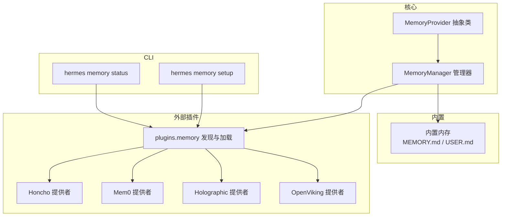
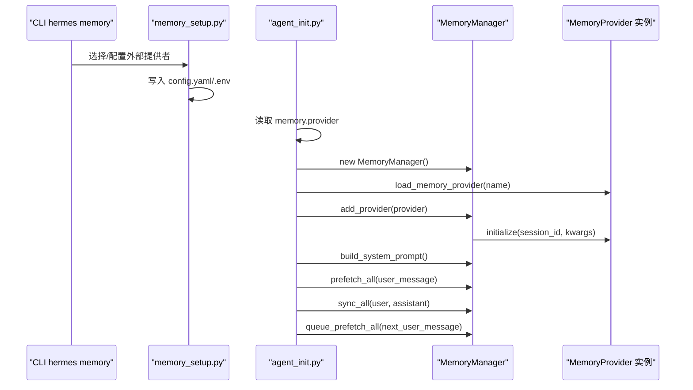
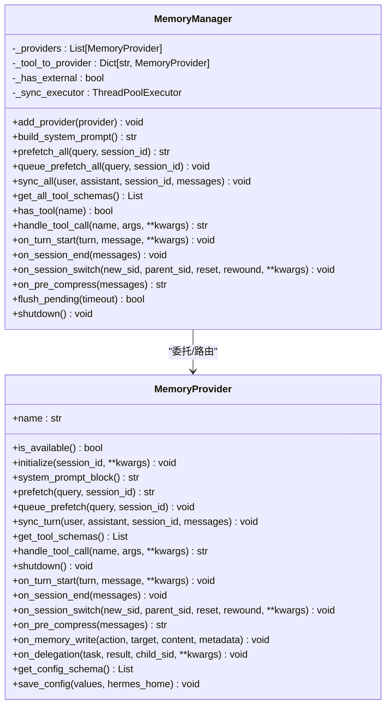
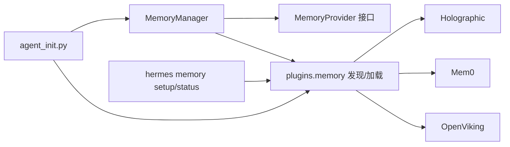

# 内存提供者系统

<cite>
**本文引用的文件**
- [agent/memory_provider.py](file://agent/memory_provider.py)
- [agent/memory_manager.py](file://agent/memory_manager.py)
- [plugins/memory/__init__.py](file://plugins/memory/__init__.py)
- [plugins/memory/holographic/__init__.py](file://plugins/memory/holographic/__init__.py)
- [plugins/memory/holographic/holographic.py](file://plugins/memory/holographic/holographic.py)
- [plugins/memory/mem0/__init__.py](file://plugins/memory/mem0/__init__.py)
- [plugins/memory/openviking/__init__.py](file://plugins/memory/openviking/__init__.py)
- [hermes_cli/memory_setup.py](file://hermes_cli/memory_setup.py)
- [hermes_cli/subcommands/memory.py](file://hermes_cli/subcommands/memory.py)
- [agent/agent_init.py](file://agent/agent_init.py)
</cite>

## 目录
1. [引言](#引言)
2. [项目结构](#项目结构)
3. [核心组件](#核心组件)
4. [架构总览](#架构总览)
5. [详细组件分析](#详细组件分析)
6. [依赖分析](#依赖分析)
7. [性能考虑](#性能考虑)
8. [故障排查指南](#故障排查指南)
9. [结论](#结论)
10. [附录](#附录)

## 引言
本技术文档系统性阐述内存提供者系统的架构与实现，覆盖 MemoryProvider 抽象基类设计、内置与外部提供者的注册机制、生命周期管理、工具 schema 注册与路由、提供者间隔离与错误处理、同步与异步操作模式，并给出实现自定义内存提供者的步骤与集成要点。

## 项目结构
内存提供者系统由以下关键模块组成：
- 抽象基类与管理器：MemoryProvider 抽象类与 MemoryManager 管理器
- 内置提供者：MEMORY.md/USER.md 的本地持久化
- 外部提供者：通过插件体系发现与加载（如 Honcho、Mem0、Holographic、OpenViking 等）
- CLI 配置工具：hermes memory setup/status/off/reset 等子命令
- 运行时集成：在 agent 初始化阶段加载并注入外部提供者

图表来源
- [agent/memory_provider.py:1-297](file://agent/memory_provider.py#L1-L297)
- [agent/memory_manager.py:1-949](file://agent/memory_manager.py#L1-L949)
- [plugins/memory/__init__.py:1-451](file://plugins/memory/__init__.py#L1-L451)
- [hermes_cli/memory_setup.py:1-473](file://hermes_cli/memory_setup.py#L1-L473)

章节来源
- [agent/memory_provider.py:1-297](file://agent/memory_provider.py#L1-L297)
- [agent/memory_manager.py:1-949](file://agent/memory_manager.py#L1-L949)
- [plugins/memory/__init__.py:1-451](file://plugins/memory/__init__.py#L1-L451)
- [hermes_cli/memory_setup.py:1-473](file://hermes_cli/memory_setup.py#L1-L473)

## 核心组件
- MemoryProvider 抽象基类：定义提供者必须实现的核心生命周期钩子与可选扩展钩子，统一外部提供者接口。
- MemoryManager：负责注册、路由、并发控制、背景任务调度、错误隔离与系统提示拼装等。
- 插件发现与加载：扫描内置与用户插件目录，解析 provider 的 register()/类实例化路径，支持 CLI 命令注册。
- CLI 配置：交互式选择与配置外部提供者，写入 config.yaml 与 .env；提供状态查询与关闭功能。
- 运行时集成：在 agent 初始化时根据配置加载外部提供者并注入到 MemoryManager。

章节来源
- [agent/memory_provider.py:1-297](file://agent/memory_provider.py#L1-L297)
- [agent/memory_manager.py:313-794](file://agent/memory_manager.py#L313-L794)
- [plugins/memory/__init__.py:146-451](file://plugins/memory/__init__.py#L146-L451)
- [hermes_cli/memory_setup.py:190-473](file://hermes_cli/memory_setup.py#L190-L473)
- [agent/agent_init.py:1138-1169](file://agent/agent_init.py#L1138-L1169)

## 架构总览
系统采用“内置提供者 + 最多一个外部提供者”的组合模式，外部提供者通过插件机制动态加载，MemoryManager 统一编排所有提供者的工具 schema、系统提示块、预取与同步、生命周期钩子调用。

图表来源
- [hermes_cli/memory_setup.py:226-361](file://hermes_cli/memory_setup.py#L226-L361)
- [agent/agent_init.py:1138-1169](file://agent/agent_init.py#L1138-L1169)
- [agent/memory_manager.py:313-794](file://agent/memory_manager.py#L313-L794)
- [plugins/memory/__init__.py:183-206](file://plugins/memory/__init__.py#L183-L206)

## 详细组件分析

### MemoryProvider 抽象基类
- 必须实现：
  - name：提供者标识
  - is_available：可用性检查（不进行网络请求）
  - initialize：会话初始化（连接、资源、后台线程等）
  - get_tool_schemas：返回工具 schema 列表
- 可选钩子（按需覆盖）：
  - system_prompt_block：系统提示静态块
  - prefetch/queue_prefetch：预取与队列预取
  - sync_turn：回合后端持久化（非阻塞）
  - on_turn_start/on_session_end/on_session_switch/on_pre_compress/on_memory_write/on_delegation
- 配置相关：
  - get_config_schema/save_config：用于 hermes memory setup 的配置收集与保存

章节来源
- [agent/memory_provider.py:42-297](file://agent/memory_provider.py#L42-L297)

### MemoryManager 管理器
- 注册与路由：
  - add_provider：内置提供者总是接受；最多仅允许一个外部提供者；保留核心工具名（如 clarify、delegate_task）不被外部提供者覆盖
  - 工具 schema 收集与去重，构建工具名到提供者的路由表
- 生命周期与系统提示：
  - build_system_prompt：收集各提供者的静态提示块
  - on_turn_start/on_session_end/on_session_switch/on_pre_compress：广播给所有提供者
- 预取与同步：
  - prefetch_all：对所有提供者发起预取，失败不阻断其他提供者
  - queue_prefetch_all：后台线程队列化预取
  - sync_all：后台线程串行化写入，turn N 先于 N+1 完成
- 背景执行与线程安全：
  - 单工作线程的 ThreadPoolExecutor，序列化外部提供者的写入
  - 对 provider.sync_turn 的 messages 参数做反射探测，兼容不同签名
- 错误隔离与清理：
  - 所有提供者调用均 try/except 记录日志，避免相互影响
  - flush_pending：等待已提交任务完成，用于确定性测试与会话边界
  - shutdown：超时等待后台任务收尾，守护线程避免阻塞进程退出

图表来源
- [agent/memory_provider.py:42-297](file://agent/memory_provider.py#L42-L297)
- [agent/memory_manager.py:313-794](file://agent/memory_manager.py#L313-L794)

章节来源
- [agent/memory_manager.py:313-794](file://agent/memory_manager.py#L313-L794)

### 插件发现与加载（plugins.memory）
- 目录扫描：
  - 先内置 plugins/memory/<name>/，再用户 $HERMES_HOME/plugins/<name>/，同名时内置优先
  - 通过 __init__.py 是否包含 register_memory_provider 或 MemoryProvider 类来判断是否为内存提供者
- 加载策略：
  - 优先查找 register(ctx) 函数，向 ctx.register_memory_provider 注册实例
  - 否则查找 MemoryProvider 子类并实例化
  - 用户插件使用合成命名空间 _hermes_user_memory 避免与内置冲突
- CLI 命令：
  - 仅激活 provider 的 cli.py 中的 register_cli，且只加载当前激活的插件

章节来源
- [plugins/memory/__init__.py:90-451](file://plugins/memory/__init__.py#L90-L451)

### CLI 配置与状态（hermes memory）
- setup：交互式选择提供者，安装依赖，收集配置，写入 config.yaml 与 .env
- status：显示当前激活的提供者、插件安装状态、必要环境变量缺失情况
- off/reset：关闭外部提供者或重置内置内存

章节来源
- [hermes_cli/memory_setup.py:226-473](file://hermes_cli/memory_setup.py#L226-L473)
- [hermes_cli/subcommands/memory.py:12-54](file://hermes_cli/subcommands/memory.py#L12-L54)

### 运行时集成（agent 初始化）
- 读取 memory.provider，加载对应插件并校验 is_available
- 创建 MemoryManager，注册提供者并调用 initialize
- 在会话开始前构建系统提示，每回合前预取，回合后同步并队列下一轮预取

章节来源
- [agent/agent_init.py:1138-1169](file://agent/agent_init.py#L1138-L1169)

### 内置提供者（MEMORY.md/USER.md）
- 作为 MemoryManager 的第一个提供者始终生效
- 不参与外部提供者限制；其工具 schema 由内置工具提供
- 通过 MemoryManager 的 on_memory_write 钩子，可将内置写入镜像到外部提供者（如 Holographic）

章节来源
- [agent/memory_manager.py:313-397](file://agent/memory_manager.py#L313-L397)

### 外部提供者示例

#### Holographic 提供者
- 特点：结构化事实存储、实体解析、信任评分、HRR 检索
- 工具 schema：fact_store、fact_feedback
- 生命周期：initialize 创建数据库与检索器；prefetch 返回检索结果；on_session_end 可自动抽取偏好/决策
- 配置：支持 db_path、auto_extract、default_trust、hrr_dim 等

章节来源
- [plugins/memory/holographic/__init__.py:115-409](file://plugins/memory/holographic/__init__.py#L115-L409)
- [plugins/memory/holographic/holographic.py:1-204](file://plugins/memory/holographic/holographic.py#L1-L204)

#### Mem0 提供者
- 特点：服务端 LLM 提取、语义检索、重排、自动去重
- 工具 schema：mem0_profile、mem0_search、mem0_conclude
- 生命周期：initialize 读取配置；queue_prefetch 使用后台线程检索；sync_turn 异步写入；带熔断器避免连续失败
- 配置：api_key、user_id、agent_id、rerank；支持 mem0.json 与 .env

章节来源
- [plugins/memory/mem0/__init__.py:119-375](file://plugins/memory/mem0/__init__.py#L119-L375)

#### OpenViking 提供者
- 特点：文件系统式知识库、分层上下文（L0/L1/L2）、会话管理、资源入库
- 工具 schema：viking_search、viking_read、viking_browse、viking_remember、viking_add_resource
- 生命周期：initialize 健康检查；prefetch 后台检索；sync_turn 以 daemon 线程写入；on_session_end/on_session_switch 提交旧会话并旋转状态
- 配置：endpoint、api_key、account、user、agent；支持 atexit 安全网关提交

章节来源
- [plugins/memory/openviking/__init__.py:429-1352](file://plugins/memory/openviking/__init__.py#L429-L1352)

## 依赖分析
- 组件耦合：
  - MemoryManager 依赖 MemoryProvider 接口，不关心具体实现
  - 插件发现模块与 MemoryManager 解耦，仅负责加载与实例化
  - CLI 仅在 setup 阶段与插件交互，运行时通过配置驱动
- 外部依赖：
  - 各外部提供者依赖各自 SDK/服务端（如 mem0、openviking），通过 is_available 做轻量检查
- 循环依赖：
  - 未发现循环导入；插件发现模块通过字符串路径与延迟导入规避

图表来源
- [agent/memory_manager.py:313-794](file://agent/memory_manager.py#L313-L794)
- [plugins/memory/__init__.py:146-451](file://plugins/memory/__init__.py#L146-L451)
- [hermes_cli/memory_setup.py:190-473](file://hermes_cli/memory_setup.py#L190-L473)
- [agent/agent_init.py:1138-1169](file://agent/agent_init.py#L1138-L1169)

章节来源
- [agent/memory_manager.py:313-794](file://agent/memory_manager.py#L313-L794)
- [plugins/memory/__init__.py:146-451](file://plugins/memory/__init__.py#L146-L451)
- [hermes_cli/memory_setup.py:190-473](file://hermes_cli/memory_setup.py#L190-L473)
- [agent/agent_init.py:1138-1169](file://agent/agent_init.py#L1138-L1169)

## 性能考虑
- 预取与同步的异步化：通过单工作线程的 ThreadPoolExecutor 序列化外部写入，避免竞争与过载
- 背景执行：prefetch_all/queue_prefetch_all/sync_all 将阻塞操作移出主回路
- 熔断与退避：Mem0 提供电路断路器，连续失败后冷却，防止雪崩
- 上下文清洗：StreamingContextScrubber 与 sanitize_context 防止泄露内部标签与系统注释
- 会话切换原子性：OpenViking 使用锁与生成号丢弃过期预取结果，确保状态一致性

章节来源
- [agent/memory_manager.py:474-642](file://agent/memory_manager.py#L474-L642)
- [plugins/memory/mem0/__init__.py:181-203](file://plugins/memory/mem0/__init__.py#L181-L203)
- [plugins/memory/openviking/__init__.py:825-984](file://plugins/memory/openviking/__init__.py#L825-L984)

## 故障排查指南
- 外部提供者冲突：
  - 仅允许一个外部提供者；重复注册会被拒绝并记录警告
- 工具名冲突：
  - 外部提供者工具名不得与核心工具名冲突；冲突将被忽略并记录告警
- 网络/服务异常：
  - MemoryManager 对各提供者调用进行 try/except 并记录日志；单个提供者失败不影响其他提供者
- 同步阻塞：
  - 若外部提供者 sync_turn 阻塞，MemoryManager 已在后台线程执行；仍可能影响后续回合，建议优化提供者实现
- 配置问题：
  - 使用 hermes memory status 检查 provider 是否可用、必要环境变量是否就绪
  - 使用 hermes memory setup 重新配置并写入 .env

章节来源
- [agent/memory_manager.py:334-397](file://agent/memory_manager.py#L334-L397)
- [hermes_cli/memory_setup.py:398-454](file://hermes_cli/memory_setup.py#L398-L454)

## 结论
内存提供者系统通过 MemoryProvider 抽象与 MemoryManager 统一编排，实现了“内置 + 最多一个外部”提供者的灵活组合。插件发现与 CLI 配置提供了良好的扩展性与易用性；通过后台执行、线程池序列化与错误隔离，保障了系统的稳定性与性能。外部提供者在工具 schema、生命周期钩子、配置与线程安全方面保持一致的契约，便于实现与维护。

## 附录

### 实现自定义内存提供者的步骤
- 实现 MemoryProvider 子类：
  - 必填：name/is_available/initialize/get_tool_schemas
  - 可选：system_prompt_block/prefetch/queue_prefetch/sync_turn 等
  - 配置：实现 get_config_schema/save_config（或仅依赖环境变量）
- 插件入口：
  - 在插件包的 __init__.py 中提供 register(ctx) 函数，调用 ctx.register_memory_provider 实例
  - 或直接导出 MemoryProvider 子类实例（由插件发现模块自动识别）
- CLI 集成（可选）：
  - 在 cli.py 中提供 register_cli 与命令处理器，仅在激活 provider 时加载
- 配置与安装：
  - 将插件放入用户目录 ~/.hermes/plugins/<name>/，或发布为独立仓库
  - 使用 hermes memory setup 交互式配置，写入 config.yaml 与 .env

章节来源
- [plugins/memory/__init__.py:208-337](file://plugins/memory/__init__.py#L208-L337)
- [agent/memory_provider.py:42-297](file://agent/memory_provider.py#L42-L297)
- [hermes_cli/memory_setup.py:226-361](file://hermes_cli/memory_setup.py#L226-L361)