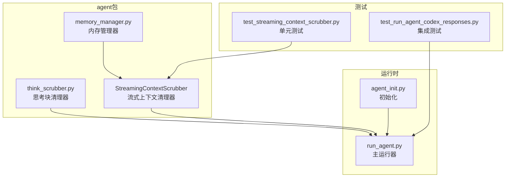
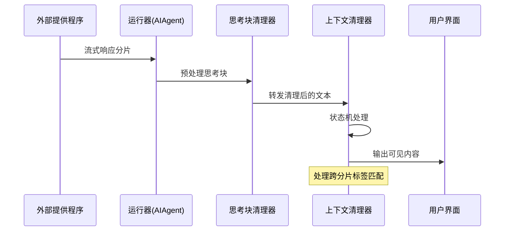
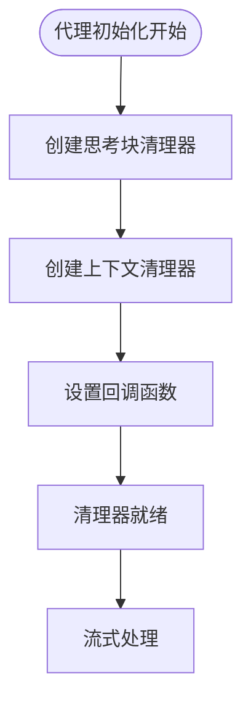
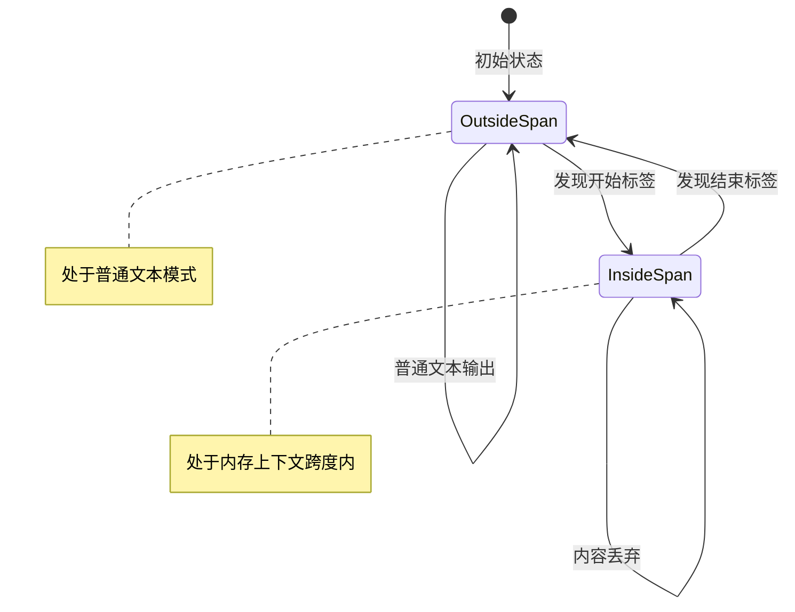
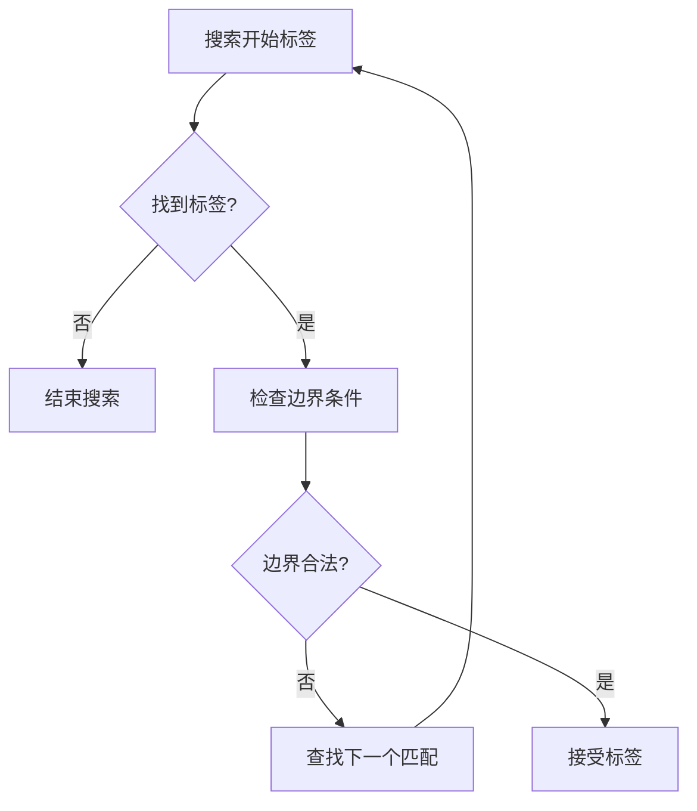
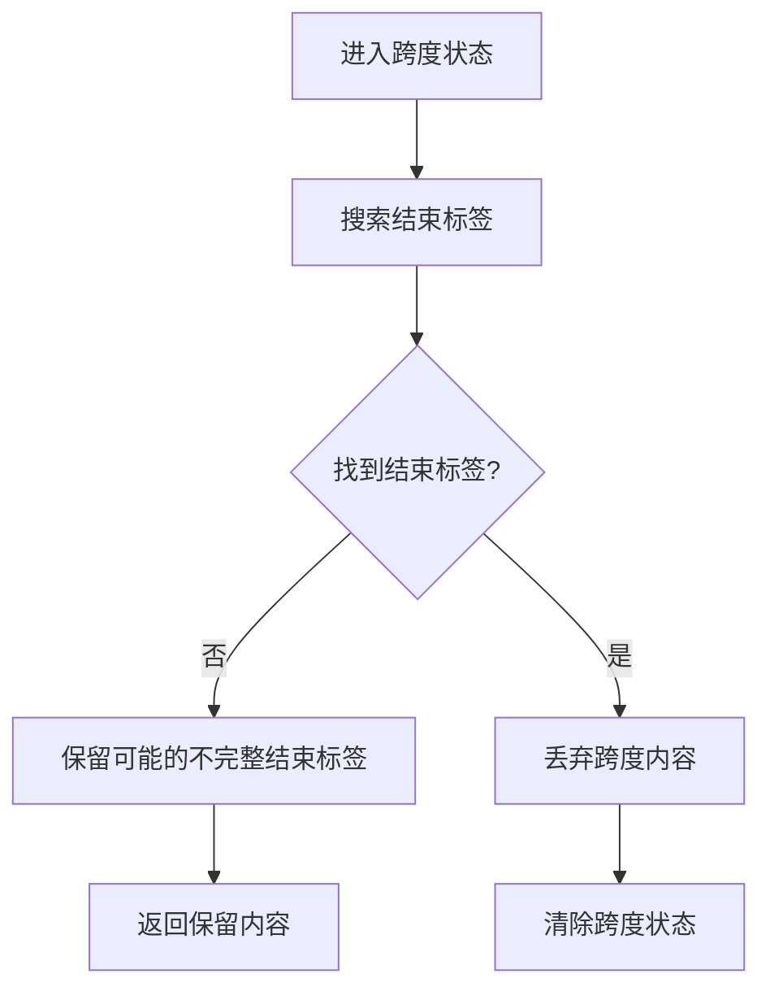
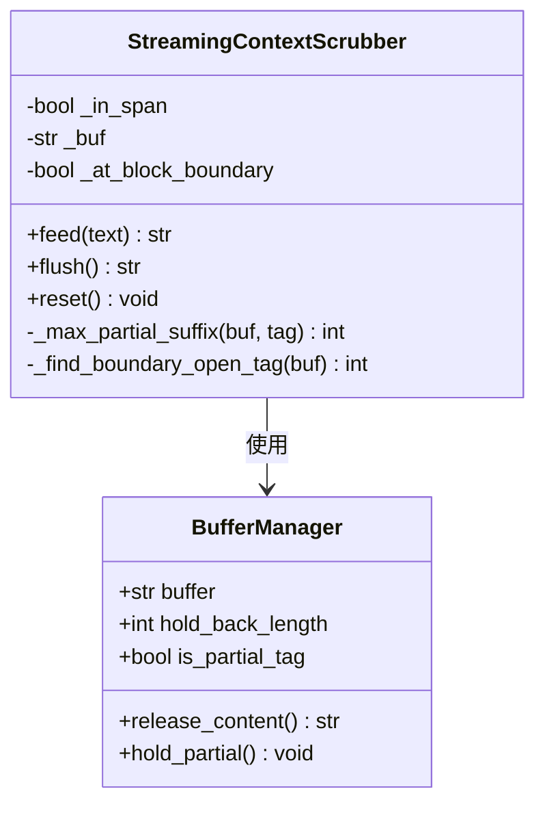
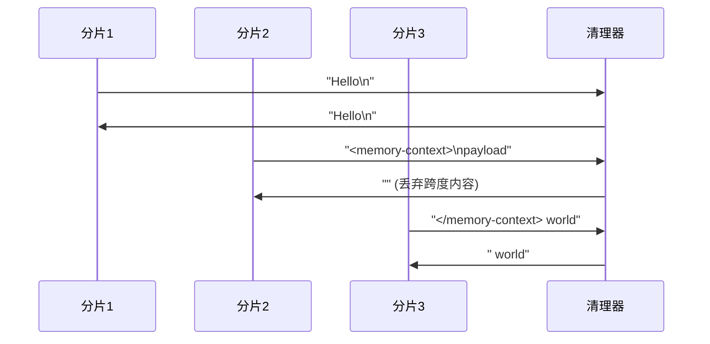
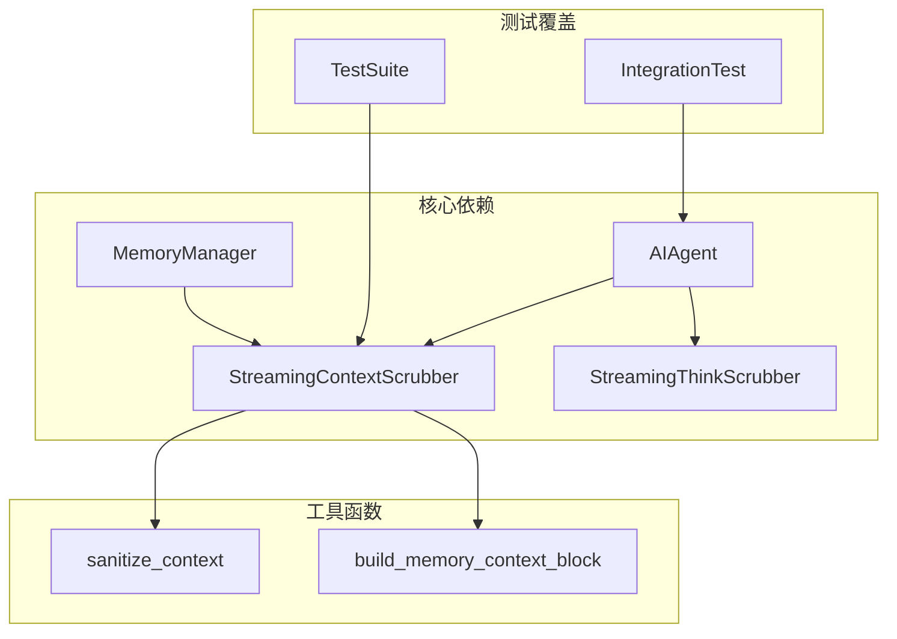

# 流式上下文清理器

<cite>
**本文档引用的文件**
- [memory_manager.py](file://agent/memory_manager.py)
- [think_scrubber.py](file://agent/think_scrubber.py)
- [test_streaming_context_scrubber.py](file://tests/agent/test_streaming_context_scrubber.py)
- [run_agent.py](file://run_agent.py)
- [agent_init.py](file://agent/agent_init.py)
- [test_run_agent_codex_responses.py](file://tests/run_agent/test_run_agent_codex_responses.py)
</cite>

## 目录
1. [简介](#简介)
2. [项目结构](#项目结构)
3. [核心组件](#核心组件)
4. [架构概览](#架构概览)
5. [详细组件分析](#详细组件分析)
6. [依赖分析](#依赖分析)
7. [性能考虑](#性能考虑)
8. [故障排除指南](#故障排除指南)
9. [结论](#结论)

## 简介

流式上下文清理器（StreamingContextScrubber）是Hermes智能体框架中的一个关键组件，专门设计用于处理流式文本中的内存上下文泄漏问题。该清理器解决了传统一次性正则表达式清理方法无法处理跨分片边界的问题，通过状态机实现确保内存上下文标签不会泄露到UI层。

该组件的核心价值在于：
- **安全性**：防止内存上下文从外部提供程序泄露到用户界面
- **可靠性**：处理跨流分片的标签匹配，确保完整的内容保护
- **兼容性**：与现有的思考块清理器协同工作，提供全面的流式内容净化

## 项目结构

流式上下文清理器位于agent包中，与思考块清理器并列存在，共同构成完整的流式内容净化体系：



**图表来源**
- [memory_manager.py:131-310](file://agent/memory_manager.py#L131-L310)
- [think_scrubber.py:64-387](file://agent/think_scrubber.py#L64-L387)
- [run_agent.py:4168-4220](file://run_agent.py#L4168-L4220)

**章节来源**
- [memory_manager.py:1-949](file://agent/memory_manager.py#L1-L949)
- [think_scrubber.py:1-387](file://agent/think_scrubber.py#L1-L387)
- [run_agent.py:1-200](file://run_agent.py#L1-L200)

## 核心组件

### StreamingContextScrubber类

StreamingContextScrubber是一个状态驱动的清理器，专门处理可能包含分割内存上下文的流式文本。其设计基于以下核心原则：

#### 状态管理
- `_in_span`: 布尔标志，指示当前是否处于内存上下文跨度内
- `_buf`: 字符串缓冲区，保存可能作为标签前缀的尾部片段
- `_at_block_boundary`: 布尔标志，跟踪当前是否处于块边界

#### 标签处理策略
- **开始标签**：<memory-context>（大小写不敏感）
- **结束标签**：</memory-context>（大小写不敏感）
- **边界检测**：仅当标签出现在行首或块边界时才被视为有效

#### 关键方法
- `feed(text)`: 处理单个流分片，返回可见内容
- `flush()`: 处理流结束时的残留内容
- `reset()`: 重置所有状态，用于跨轮次清理

**章节来源**
- [memory_manager.py:131-310](file://agent/memory_manager.py#L131-L310)

### 辅助函数

#### sanitize_context函数
提供一次性清理功能，用于处理完整字符串而非流式分片：

```python
def sanitize_context(text: str) -> str:
    """剥离围栏标签、注入的上下文块和系统注释"""
    text = _INTERNAL_CONTEXT_RE.sub('', text)
    text = _INTERNAL_NOTE_RE.sub('', text)
    text = _FENCE_TAG_RE.sub('', text)
    return text
```

#### build_memory_context_block函数
将预提取的记忆内容包装在围栏块中，并添加系统注释：

**章节来源**
- [memory_manager.py:123-310](file://agent/memory_manager.py#L123-L310)

## 架构概览

流式上下文清理器在整个系统中的位置和交互关系如下：



**图表来源**
- [run_agent.py:4168-4220](file://run_agent.py#L4168-L4220)
- [agent_init.py:580-590](file://agent/agent_init.py#L580-L590)

### 初始化流程

清理器在代理初始化时创建并配置：



**图表来源**
- [agent_init.py:580-590](file://agent/agent_init.py#L580-L590)

**章节来源**
- [agent_init.py:580-590](file://agent/agent_init.py#L580-L590)
- [run_agent.py:4168-4220](file://run_agent.py#L4168-L4220)

## 详细组件分析

### 状态机实现

StreamingContextScrubber采用有限状态机设计，通过三个主要状态管理内容处理：



**图表来源**
- [memory_manager.py:160-169](file://agent/memory_manager.py#L160-L169)

#### 状态转换逻辑

状态转换由以下条件触发：

1. **OutsideSpan → InsideSpan**：找到有效的开始标签且满足边界条件
2. **InsideSpan → OutsideSpan**：找到结束标签或到达流末尾
3. **OutsideSpan → OutsideSpan**：普通文本直接输出
4. **InsideSpan → InsideSpan**：跨度内内容被丢弃

**章节来源**
- [memory_manager.py:170-230](file://agent/memory_manager.py#L170-L230)

### 标签识别和匹配算法

#### 开始标签识别

开始标签识别包含严格的边界检查：



**图表来源**
- [memory_manager.py:246-280](file://agent/memory_manager.py#L246-L280)

#### 结束标签处理

结束标签处理采用贪心策略，确保完整跨度的正确识别：



**图表来源**
- [memory_manager.py:183-194](file://agent/memory_manager.py#L183-L194)

**章节来源**
- [memory_manager.py:183-214](file://agent/memory_manager.py#L183-L214)

### 缓冲和分割处理

#### 部分标签处理

清理器实现了智能的缓冲机制来处理跨分片的标签：



**图表来源**
- [memory_manager.py:160-230](file://agent/memory_manager.py#L160-L230)

#### 边界检测机制

边界检测确保只有真正的内存上下文跨度被识别，而不是普通的文本提及：

**章节来源**
- [memory_manager.py:273-294](file://agent/memory_manager.py#L273-L294)

### 系统注释过滤

系统注释过滤通过专用的正则表达式实现：


**图表来源**
- [memory_manager.py:112-128](file://agent/memory_manager.py#L112-L128)

**章节来源**
- [memory_manager.py:112-128](file://agent/memory_manager.py#L112-L128)

### 性能优化策略

#### 内存使用优化

1. **最小化缓冲区大小**：只保留必要的部分标签尾部
2. **惰性分配**：按需创建输出列表，避免不必要的内存分配
3. **字符串拼接优化**：使用列表收集后一次性连接

#### 处理效率优化

1. **大小写不敏感查找**：预转换为小写进行快速匹配
2. **最短长度优先**：优先处理较短的标签，减少搜索范围
3. **边界条件缓存**：缓存块边界状态，避免重复计算

**章节来源**
- [memory_manager.py:232-294](file://agent/memory_manager.py#L232-L294)

### 不同流式场景的行为

#### 正常流处理

正常流场景下，清理器保持透明的处理过程：



**图表来源**
- [test_streaming_context_scrubber.py:36-47](file://tests/agent/test_streaming_context_scrubber.py#L36-L47)

#### 异常流处理

异常流场景包括未终止跨度和跨轮次状态：

**章节来源**
- [test_streaming_context_scrubber.py:147-162](file://tests/agent/test_streaming_context_scrubber.py#L147-L162)

## 依赖分析

### 组件间依赖关系



**图表来源**
- [memory_manager.py:131-310](file://agent/memory_manager.py#L131-L310)
- [think_scrubber.py:64-387](file://agent/think_scrubber.py#L64-L387)

### 外部接口依赖

清理器依赖于以下外部接口：

1. **正则表达式模块**：用于系统注释的精确匹配
2. **字符串操作**：高效的大小写转换和子串查找
3. **类型提示**：完整的类型定义支持IDE和静态分析

**章节来源**
- [memory_manager.py:26-38](file://agent/memory_manager.py#L26-L38)

## 性能考虑

### 时间复杂度分析

- **单次处理**：O(n)，其中n是输入分片的长度
- **空间复杂度**：O(k)，其中k是保留的缓冲区大小
- **最坏情况**：当标签完全分离时，需要额外的缓冲存储

### 内存优化技巧

1. **动态缓冲调整**：根据实际需要调整缓冲区大小
2. **及时释放**：在处理完分片后立即释放不需要的引用
3. **批量处理**：对于大量小分片，考虑合并处理以减少开销

### 并发安全

清理器设计为线程安全，但建议：
- 每个流使用独立的清理器实例
- 在跨轮次之间调用reset()方法
- 避免在多个线程中共享同一实例

## 故障排除指南

### 常见问题诊断

#### 标签未正确识别

**症状**：内存上下文仍然泄露到UI
**原因**：
1. 标签不在块边界上
2. 标签格式不正确
3. 缓冲区处理错误

**解决方案**：
1. 检查标签格式是否符合规范
2. 验证边界检测逻辑
3. 确认缓冲区状态正确更新

#### 性能问题

**症状**：处理延迟增加或内存使用过高
**原因**：
1. 过多的小分片导致频繁的状态切换
2. 缓冲区过大影响内存使用
3. 正则表达式匹配效率低

**解决方案**：
1. 优化分片大小
2. 调整缓冲区阈值
3. 使用更高效的匹配算法

#### 跨轮次状态污染

**症状**：新轮次开始时出现意外内容
**原因**：上一轮次的清理器状态未正确重置
**解决方案**：
1. 确保在每轮开始时调用reset()
2. 验证清理器实例的生命周期管理

**章节来源**
- [test_streaming_context_scrubber.py:191-218](file://tests/agent/test_streaming_context_scrubber.py#L191-L218)

### 调试技巧

1. **启用详细日志**：监控状态转换和缓冲区变化
2. **单元测试覆盖**：使用现有测试套件验证各种场景
3. **性能基准测试**：定期评估处理性能和内存使用

## 结论

流式上下文清理器通过精心设计的状态机和智能缓冲机制，成功解决了流式文本处理中的内存上下文泄漏问题。其设计特点包括：

1. **安全性优先**：通过严格的边界检测确保只有真正的内存上下文跨度被识别
2. **性能优化**：采用多种优化策略确保高效处理大量流式数据
3. **可靠性保证**：完善的测试覆盖和错误处理机制
4. **可维护性**：清晰的代码结构和详细的文档说明

该组件与思考块清理器协同工作，为Hermes智能体提供了全面的流式内容净化能力，确保用户界面的安全性和一致性。通过合理的使用和配置，开发者可以充分利用这一组件的优势，在各种流式场景中提供可靠的内容处理服务。