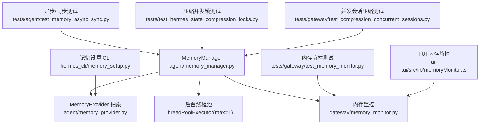
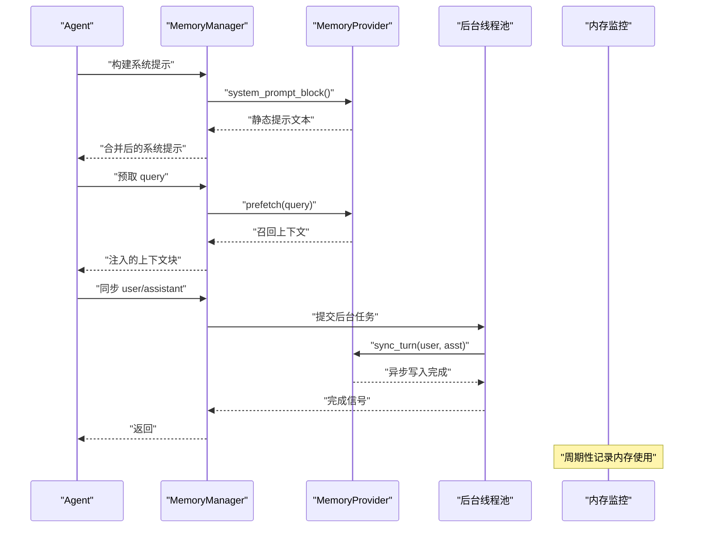
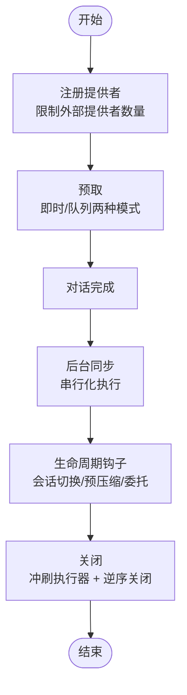
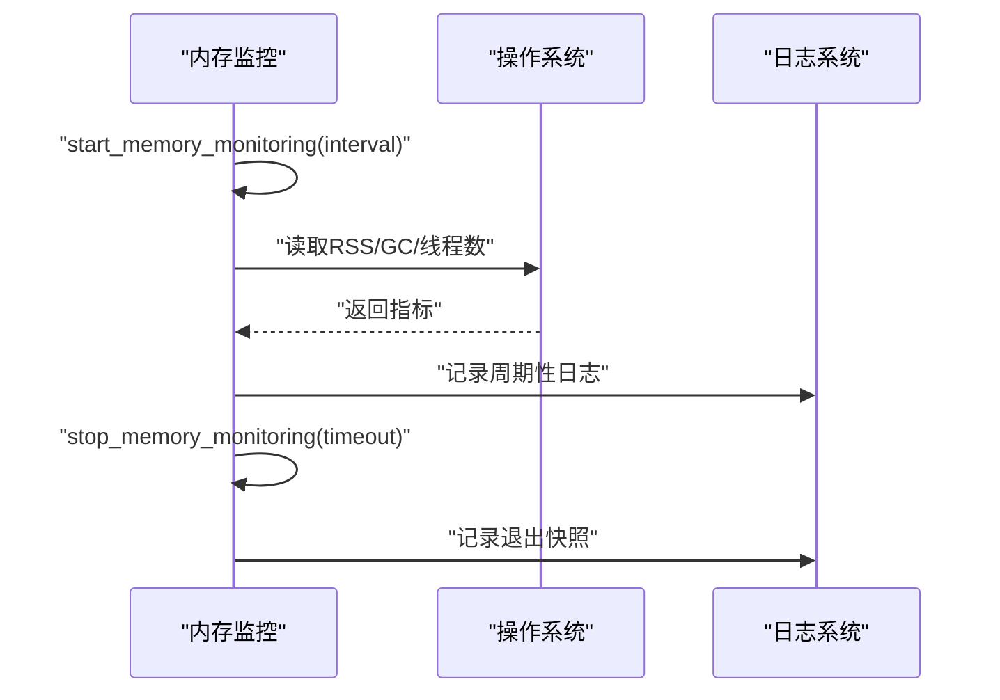
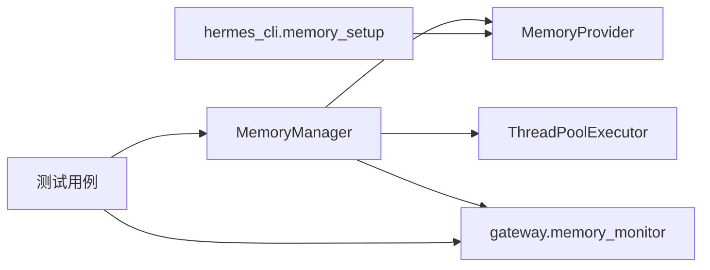

# 记忆生命周期管理

<cite>
**本文引用的文件**
- [agent/memory_manager.py](file://agent/memory_manager.py)
- [agent/memory_provider.py](file://agent/memory_provider.py)
- [gateway/memory_monitor.py](file://gateway/memory_monitor.py)
- [hermes_cli/memory_setup.py](file://hermes_cli/memory_setup.py)
- [tests/agent/test_memory_async_sync.py](file://tests/agent/test_memory_async_sync.py)
- [tests/test_hermes_state_compression_locks.py](file://tests/test_hermes_state_compression_locks.py)
- [tests/gateway/test_compression_concurrent_sessions.py](file://tests/gateway/test_compression_concurrent_sessions.py)
- [tests/gateway/test_memory_monitor.py](file://tests/gateway/test_memory_monitor.py)
- [ui-tui/src/lib/memoryMonitor.ts](file://ui-tui/src/lib/memoryMonitor.ts)
</cite>

## 目录
1. [引言](#引言)
2. [项目结构](#项目结构)
3. [核心组件](#核心组件)
4. [架构总览](#架构总览)
5. [详细组件分析](#详细组件分析)
6. [依赖分析](#依赖分析)
7. [性能考虑](#性能考虑)
8. [故障排查指南](#故障排查指南)
9. [结论](#结论)
10. [附录](#附录)

## 引言
本文件系统性阐述记忆生命周期管理的技术方案与实现细节，覆盖从记忆创建、激活、更新到销毁的完整流程；解释状态管理机制（状态转换与持久化）、同步/异步操作模式（后台写入与前台读取协调）、并发控制与线程安全（锁与原子操作）、错误处理与恢复策略（失败重试与数据一致性）、性能监控与优化（缓存命中率与延迟控制），并给出与系统其他模块的集成方式。

## 项目结构
围绕记忆生命周期的关键代码分布在以下模块：
- 记忆管理器：统一编排内置与外部记忆提供者，负责预取、同步、工具路由、生命周期钩子与资源回收。
- 记忆提供者抽象：定义提供者的生命周期接口与可选钩子，约束实现契约。
- 内存监控：网关侧周期性记录进程内存使用，辅助定位泄漏与性能问题。
- CLI 设置：交互式引导完成外部提供者的安装与配置。
- 测试用例：验证异步写入、并发锁竞争、内存监控等行为。

图表来源
- [agent/memory_manager.py:313-949](file://agent/memory_manager.py#L313-L949)
- [agent/memory_provider.py:42-297](file://agent/memory_provider.py#L42-L297)
- [gateway/memory_monitor.py:1-231](file://gateway/memory_monitor.py#L1-L231)
- [hermes_cli/memory_setup.py:190-473](file://hermes_cli/memory_setup.py#L190-L473)
- [tests/agent/test_memory_async_sync.py:75-116](file://tests/agent/test_memory_async_sync.py#L75-L116)
- [tests/test_hermes_state_compression_locks.py:125-149](file://tests/test_hermes_state_compression_locks.py#L125-L149)
- [tests/gateway/test_compression_concurrent_sessions.py:153-183](file://tests/gateway/test_compression_concurrent_sessions.py#L153-L183)
- [tests/gateway/test_memory_monitor.py:70-103](file://tests/gateway/test_memory_monitor.py#L70-L103)
- [ui-tui/src/lib/memoryMonitor.ts:63-102](file://ui-tui/src/lib/memoryMonitor.ts#L63-L102)

章节来源
- [agent/memory_manager.py:1-949](file://agent/memory_manager.py#L1-L949)
- [agent/memory_provider.py:1-297](file://agent/memory_provider.py#L1-L297)
- [gateway/memory_monitor.py:1-231](file://gateway/memory_monitor.py#L1-L231)
- [hermes_cli/memory_setup.py:1-473](file://hermes_cli/memory_setup.py#L1-L473)

## 核心组件
- MemoryManager：单点编排器，负责注册提供者、构建系统提示、预取/回放、同步写入、后台任务调度、工具分发、生命周期钩子与优雅关闭。
- MemoryProvider 抽象：定义提供者必须实现的生命周期方法与可选钩子，确保一致的接入体验。
- 内存监控：网关长期运行进程的内存使用记录，支持启动基线、周期采样与退出快照。
- CLI 设置：交互式选择与配置外部记忆提供者，自动安装依赖并写入配置与环境变量。

章节来源
- [agent/memory_manager.py:313-949](file://agent/memory_manager.py#L313-L949)
- [agent/memory_provider.py:42-297](file://agent/memory_provider.py#L42-L297)
- [gateway/memory_monitor.py:83-231](file://gateway/memory_monitor.py#L83-L231)
- [hermes_cli/memory_setup.py:190-473](file://hermes_cli/memory_setup.py#L190-L473)

## 架构总览
记忆生命周期由“预取-对话-同步-回收”四个阶段构成，贯穿前台读取与后台写入的异步协调，配合严格的并发控制与可观测性保障。

图表来源
- [agent/memory_manager.py:413-571](file://agent/memory_manager.py#L413-L571)
- [agent/memory_manager.py:575-642](file://agent/memory_manager.py#L575-L642)
- [gateway/memory_monitor.py:139-231](file://gateway/memory_monitor.py#L139-L231)

## 详细组件分析

### MemoryManager：生命周期编排与异步协调
- 初始化与注册
  - 仅允许一个非内置提供者注册，避免工具冲突与后端竞争。
  - 注册时校验工具名不与核心保留名冲突，建立工具名到提供者的路由表。
- 预取与回放
  - 预取在每轮对话前触发，支持“即时预取”与“队列预取”两种路径，后者在本轮结束后为下一轮排队后台召回。
  - 对技能类消息进行脚手架剥离，仅向提供者传递用户真实意图，避免污染存储。
- 同步写入
  - 所有提供者同步写入均在后台线程执行，避免阻塞主流程；单线程串行化确保turn N先于turn N+1落盘。
  - 支持携带原始消息列表（当提供者签名允许时），便于语义化/结构化写入。
- 生命周期钩子
  - 会话切换、回合开始、预压缩、委托观察等钩子，确保提供者能刷新会话状态或提取关键信息。
- 关闭与回收
  - 关闭前先“限时限速”地冲刷后台执行器，随后逆序调用提供者shutdown，守护进程退出不被挂起。

图表来源
- [agent/memory_manager.py:334-402](file://agent/memory_manager.py#L334-L402)
- [agent/memory_manager.py:452-571](file://agent/memory_manager.py#L452-L571)
- [agent/memory_manager.py:620-642](file://agent/memory_manager.py#L620-L642)
- [agent/memory_manager.py:704-775](file://agent/memory_manager.py#L704-L775)
- [agent/memory_manager.py:866-949](file://agent/memory_manager.py#L866-L949)

章节来源
- [agent/memory_manager.py:313-949](file://agent/memory_manager.py#L313-L949)

### MemoryProvider 抽象：生命周期与可选钩子
- 必须实现
  - is_available、initialize、system_prompt_block、prefetch、queue_prefetch、sync_turn、get_tool_schemas。
- 可选钩子
  - on_turn_start、on_session_end、on_session_switch、on_pre_compress、on_memory_write、on_delegation。
- 配置与部署
  - 提供 get_config_schema/save_config 接口，配合 CLI 完成交互式配置与依赖安装。

章节来源
- [agent/memory_provider.py:42-297](file://agent/memory_provider.py#L42-L297)

### 内存监控：进程内存观测与告警
- 网关长期运行场景下，内存缓慢泄漏难以通过单次日志发现，需周期性记录RSS与GC统计。
- 支持Linux/macOS（resource）与Windows（psutil）双通道，不可用时降级记录并停止监控。
- 提供启动基线、周期采样、退出快照与停止接口，便于诊断与回归。

图表来源
- [gateway/memory_monitor.py:139-231](file://gateway/memory_monitor.py#L139-L231)
- [tests/gateway/test_memory_monitor.py:70-103](file://tests/gateway/test_memory_monitor.py#L70-L103)
- [ui-tui/src/lib/memoryMonitor.ts:63-102](file://ui-tui/src/lib/memoryMonitor.ts#L63-L102)

章节来源
- [gateway/memory_monitor.py:1-231](file://gateway/memory_monitor.py#L1-L231)
- [tests/gateway/test_memory_monitor.py:70-103](file://tests/gateway/test_memory_monitor.py#L70-L103)
- [ui-tui/src/lib/memoryMonitor.ts:63-102](file://ui-tui/src/lib/memoryMonitor.ts#L63-L102)

### CLI 设置：外部提供者安装与配置
- 发现已安装插件，支持交互式选择与依赖安装（uv/pip）。
- 生成配置与环境变量，保存至 config.yaml 与 .env，支持 post_setup 钩子自定义流程。
- 提供 status 子命令查看当前配置与可用性。

章节来源
- [hermes_cli/memory_setup.py:190-473](file://hermes_cli/memory_setup.py#L190-L473)

## 依赖分析
- 组件耦合
  - MemoryManager 依赖 MemoryProvider 抽象，通过统一接口编排多个提供者；提供者间相互独立，失败不互相阻塞。
  - 后台执行器为单线程串行化，降低提供者内部锁竞争成本。
- 并发与锁
  - 执行器创建采用互斥锁保护，避免重复创建与竞态。
  - 压缩/会话切换等并发场景下，通过屏障与原子操作确保同一会话只被一个线程获得锁。
- 外部依赖
  - 内存监控依赖 resource 或 psutil；CLI 依赖 uv/pip 安装提供者依赖。

图表来源
- [agent/memory_manager.py:313-949](file://agent/memory_manager.py#L313-L949)
- [gateway/memory_monitor.py:139-231](file://gateway/memory_monitor.py#L139-L231)
- [hermes_cli/memory_setup.py:190-473](file://hermes_cli/memory_setup.py#L190-L473)

章节来源
- [agent/memory_manager.py:313-949](file://agent/memory_manager.py#L313-L949)
- [tests/test_hermes_state_compression_locks.py:125-149](file://tests/test_hermes_state_compression_locks.py#L125-L149)
- [tests/gateway/test_compression_concurrent_sessions.py:153-183](file://tests/gateway/test_compression_concurrent_sessions.py#L153-L183)

## 性能考虑
- 异步写入与前台读取
  - 同步写入在后台线程执行，避免阻塞主流程；flush_pending 使用哨兵任务确保有序完成。
- 单线程串行化
  - 通过单工作线程串行化提供者写入，简化并发控制，避免跨提供者的顺序问题。
- 内存监控与诊断
  - 周期性记录RSS/GC/线程数，结合退出快照定位泄漏；TUI侧也提供动态缓存清理能力以缓解峰值。
- 缓存与流式清洗
  - 提供流式清洗器，处理跨块边界导致的标签泄露问题，保障UI输出干净。

章节来源
- [agent/memory_manager.py:575-642](file://agent/memory_manager.py#L575-L642)
- [agent/memory_manager.py:620-642](file://agent/memory_manager.py#L620-L642)
- [gateway/memory_monitor.py:139-231](file://gateway/memory_monitor.py#L139-L231)
- [ui-tui/src/lib/memoryMonitor.ts:63-102](file://ui-tui/src/lib/memoryMonitor.ts#L63-L102)
- [agent/memory_manager.py:131-294](file://agent/memory_manager.py#L131-L294)

## 故障排查指南
- 异步写入未完成
  - 使用 flush_pending 在会话边界等待后台任务完成；若超时，检查提供者是否阻塞或执行器被提前关闭。
- 关闭卡顿
  - shutdown_all 先冲刷执行器（带限时），再逆序关闭提供者；若仍卡住，检查提供者内部阻塞或网络超时。
- 并发竞争
  - 压缩/会话切换场景下，确保同一会话只被一个线程获得锁；出现竞态时检查屏障与原子操作逻辑。
- 内存泄漏
  - 启动内存监控，观察RSS/GC曲线；结合退出快照定位异常增长；必要时启用TUI侧缓存清理。
- 提供者不可用
  - 使用 CLI status 检查配置与依赖；必要时重新运行 setup 修复。

章节来源
- [tests/agent/test_memory_async_sync.py:75-116](file://tests/agent/test_memory_async_sync.py#L75-L116)
- [agent/memory_manager.py:866-949](file://agent/memory_manager.py#L866-L949)
- [tests/test_hermes_state_compression_locks.py:125-149](file://tests/test_hermes_state_compression_locks.py#L125-L149)
- [tests/gateway/test_memory_monitor.py:70-103](file://tests/gateway/test_memory_monitor.py#L70-L103)

## 结论
该记忆生命周期管理方案以 MemoryManager 为核心，通过严格的异步写入、单线程串行化、完备的生命周期钩子与可观测性，实现了高可靠、低耦合的记忆系统。外部提供者通过统一抽象接入，既保持灵活性又避免冲突。配套的内存监控与CLI配置进一步提升了运维效率与稳定性。

## 附录
- 代码片段路径（用于定位实现）
  - [异步写入与后台执行器:575-642](file://agent/memory_manager.py#L575-L642)
  - [单工作线程串行化与关闭冲刷:866-949](file://agent/memory_manager.py#L866-L949)
  - [预取与队列预取:452-500](file://agent/memory_manager.py#L452-L500)
  - [系统提示与工具路由:413-431](file://agent/memory_manager.py#L413-L431)
  - [生命周期钩子（会话切换/预压缩/委托）:704-794](file://agent/memory_manager.py#L704-L794)
  - [内存监控启动/停止/周期采样:139-231](file://gateway/memory_monitor.py#L139-L231)
  - [TUI侧内存监控与缓存清理:63-102](file://ui-tui/src/lib/memoryMonitor.ts#L63-L102)
  - [CLI设置与依赖安装:190-473](file://hermes_cli/memory_setup.py#L190-L473)