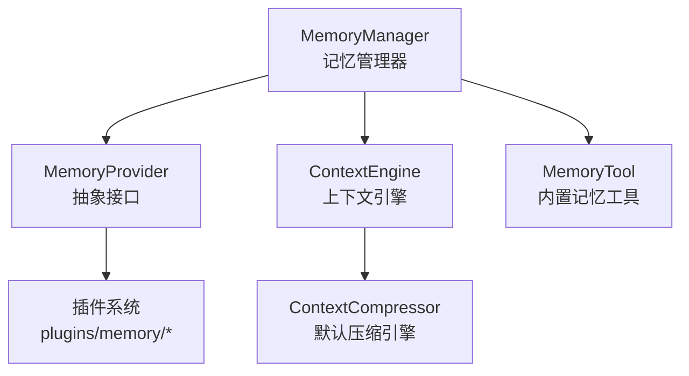
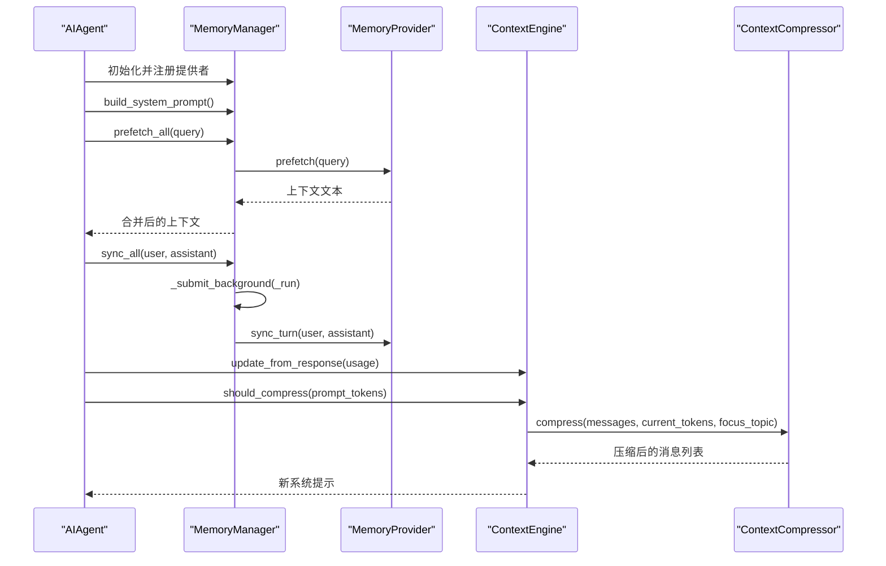
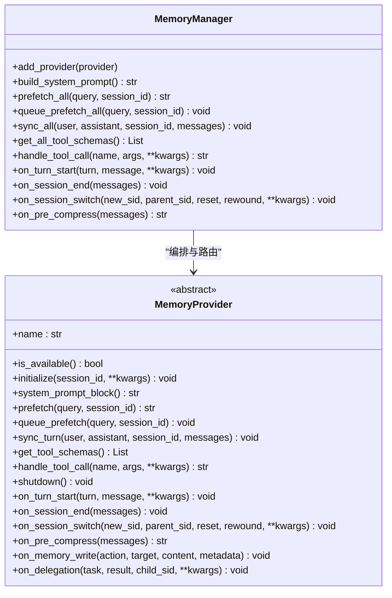
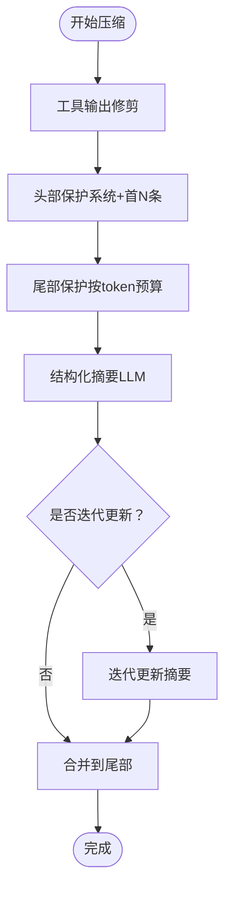
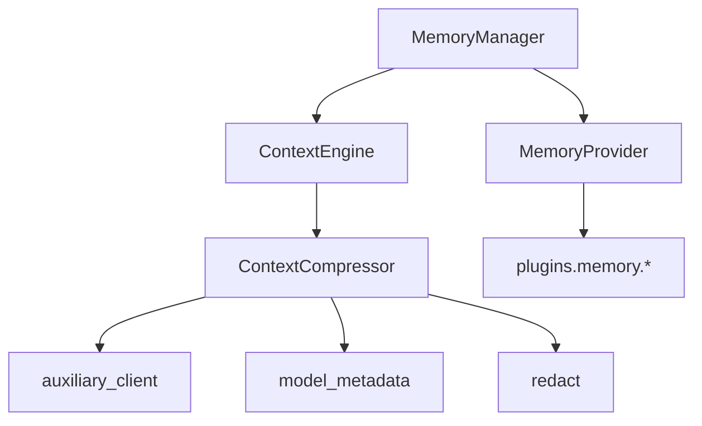

# 记忆管理系统

<cite>
**本文档引用的文件**
- [memory_manager.py](file://agent/memory_manager.py)
- [memory_provider.py](file://agent/memory_provider.py)
- [context_compressor.py](file://agent/context_compressor.py)
- [conversation_compression.py](file://agent/conversation_compression.py)
- [context_engine.py](file://agent/context_engine.py)
- [__init__.py](file://plugins/memory/__init__.py)
- [memory_tool.py](file://tools/memory_tool.py)
- [retrieval.py](file://plugins/memory/holographic/retrieval.py)
</cite>

## 目录
1. [简介](#简介)
2. [项目结构](#项目结构)
3. [核心组件](#核心组件)
4. [架构总览](#架构总览)
5. [详细组件分析](#详细组件分析)
6. [依赖关系分析](#依赖关系分析)
7. [性能考量](#性能考量)
8. [故障排查指南](#故障排查指南)
9. [结论](#结论)
10. [附录](#附录)

## 简介
本文件面向记忆管理系统的开发者与维护者，系统性阐述短期记忆与长期记忆的架构设计、数据存储与检索机制、上下文压缩算法、持久化与恢复策略、查询与匹配算法、性能优化与扩展实践。文档以代码为依据，结合图示与分层讲解，帮助读者快速掌握系统全貌与实现细节。

## 项目结构
记忆管理由“管理器 + 提供者 + 上下文引擎”三层构成：
- 管理器：统一编排多个记忆提供者，负责注册、工具路由、异步同步、会话切换等。
- 提供者：抽象接口定义（MemoryProvider），内置提供者与外部插件提供者（如 Honcho、Hindsight、Mem0 等）通过插件系统加载。
- 引擎：上下文压缩引擎（默认为 ContextCompressor），在接近模型上下文阈值时进行压缩与摘要，保障长对话持续可用。

图表来源
- [memory_manager.py:313-800](file://agent/memory_manager.py#L313-L800)
- [memory_provider.py:42-297](file://agent/memory_provider.py#L42-L297)
- [context_engine.py:32-227](file://agent/context_engine.py#L32-L227)
- [context_compressor.py:593-800](file://agent/context_compressor.py#L593-L800)
- [__init__.py:1-451](file://plugins/memory/__init__.py#L1-L451)
- [memory_tool.py:240-272](file://tools/memory_tool.py#L240-L272)

章节来源
- [memory_manager.py:1-949](file://agent/memory_manager.py#L1-L949)
- [memory_provider.py:1-297](file://agent/memory_provider.py#L1-L297)
- [context_engine.py:1-227](file://agent/context_engine.py#L1-L227)
- [context_compressor.py:1-800](file://agent/context_compressor.py#L1-L800)
- [__init__.py:1-451](file://plugins/memory/__init__.py#L1-L451)
- [memory_tool.py:240-272](file://tools/memory_tool.py#L240-L272)

## 核心组件
- MemoryManager：集中式记忆编排，支持内置与最多一个外部提供者；提供系统提示拼装、预取、异步同步、工具路由、会话切换通知等能力。
- MemoryProvider：记忆提供者抽象，定义生命周期钩子（初始化、系统提示、预取、同步、工具schema、关闭等）与可选钩子（每回合开始、会话结束、会话切换、压缩前提取、写入镜像、委托观察等）。
- ContextEngine：上下文引擎抽象，定义何时压缩、如何压缩、跟踪令牌使用、会话生命周期钩子、工具暴露等。
- ContextCompressor：默认上下文压缩器，采用“工具输出修剪 + 头尾保护 + 结构化摘要”的多阶段策略，支持迭代更新摘要、历史摘要兼容、失败回退等。
- 插件系统：扫描 plugins/memory 与用户插件目录，按名称加载提供者，仅允许一个外部提供者激活。
- 内置记忆工具：基于本地文件的 MEMORY.md/USER.md 存储，提供增删改查与磁盘持久化。

章节来源
- [memory_manager.py:313-800](file://agent/memory_manager.py#L313-L800)
- [memory_provider.py:42-297](file://agent/memory_provider.py#L42-L297)
- [context_engine.py:32-227](file://agent/context_engine.py#L32-L227)
- [context_compressor.py:593-800](file://agent/context_compressor.py#L593-L800)
- [__init__.py:1-451](file://plugins/memory/__init__.py#L1-L451)
- [memory_tool.py:240-272](file://tools/memory_tool.py#L240-L272)

## 架构总览
记忆系统围绕 MemoryManager 展开，统一调度 MemoryProvider，并在对话过程中通过 ContextCompressor 控制上下文长度，确保模型输入稳定。

图表来源
- [memory_manager.py:413-572](file://agent/memory_manager.py#L413-L572)
- [context_engine.py:70-107](file://agent/context_engine.py#L70-L107)
- [context_compressor.py:593-800](file://agent/context_compressor.py#L593-L800)

## 详细组件分析

### MemoryManager：记忆编排与生命周期
- 注册与路由
  - 仅允许一个非内置提供者；内置提供者始终优先。
  - 将各提供者的工具schema合并并去重，避免与核心工具冲突。
- 系统提示构建
  - 聚合所有提供者的静态系统提示块，按提供者命名标注。
- 预取与队列预取
  - 预取：在每轮对话前调用各提供者的 prefetch，返回可注入的上下文文本。
  - 队列预取：在当前轮结束后，将下一轮的预取任务提交至后台线程池，避免阻塞。
- 同步与后台执行
  - sync_all 在后台线程串行执行，turn N 的写入必须先于 turn N+1 完成，防止乱序。
  - 支持传递原始消息列表给提供者（若其签名接受）。
- 工具调用路由
  - handle_tool_call 将工具名映射到对应提供者实例，捕获异常并返回标准错误。
- 会话生命周期
  - on_turn_start/on_session_end/on_session_switch/on_pre_compress 等钩子贯穿会话周期，支持压缩前抽取、会话切换时刷新状态等。
- 上下文清洗与流式过滤
  - sanitize_context 与 StreamingContextScrubber 用于去除内部标记与系统注释，保证输出安全。

图表来源
- [memory_manager.py:313-800](file://agent/memory_manager.py#L313-L800)
- [memory_provider.py:42-297](file://agent/memory_provider.py#L42-L297)

章节来源
- [memory_manager.py:313-800](file://agent/memory_manager.py#L313-L800)
- [memory_provider.py:42-297](file://agent/memory_provider.py#L42-L297)

### MemoryProvider：抽象接口与生命周期钩子
- 必需方法
  - is_available：配置就绪检查。
  - initialize：会话初始化，建立资源、连接或后台线程。
  - system_prompt_block/prefetch/sync_turn/get_tool_schemas/handle_tool_call/shutdown。
- 可选钩子
  - on_turn_start/on_session_end/on_session_switch/on_pre_compress/on_memory_write/on_delegation。
- 配置与保存
  - get_config_schema/save_config 用于“hermes memory setup”向导。

章节来源
- [memory_provider.py:42-297](file://agent/memory_provider.py#L42-L297)

### 插件系统：提供者发现与加载
- 发现范围
  - 内置：plugins/memory/<name>/。
  - 用户安装：$HERMES_HOME/plugins/<name>/。
- 加载策略
  - 优先内置，同名时内置优先。
  - 支持 register(ctx) 与直接类实例化两种模式。
  - 仅允许一个外部提供者被激活。
- CLI 命令
  - 仅对当前激活的提供者暴露 CLI 子命令。

章节来源
- [__init__.py:1-451](file://plugins/memory/__init__.py#L1-L451)

### 上下文压缩：算法与实现
- 默认引擎 ContextCompressor
  - 多阶段策略：工具输出修剪 → 头部保护 → 尾部保护 → 结构化摘要 → 迭代更新。
  - 结构化摘要模板：包含历史快照、进行中状态、待办、剩余工作等分区，避免被误认为当前指令。
  - 摘要预算：按压缩内容比例分配，上限控制，尾部保护采用 token 预算而非固定条数。
  - 图像处理：对旧消息中的图片进行替换，减少重复传输。
  - 失败回退：当摘要生成失败时插入确定性占位，或在严格模式下中止压缩。
- 压缩流程
  - 压缩可行性检查：辅助模型上下文窗口是否足以承载主模型阈值。
  - 压缩锁：防止并发压缩导致会话分叉。
  - 旋转会话：压缩后新建会话，保留标题与父子关系。
  - 通知：压缩前通知提供者抽取要点，压缩后通知上下文引擎与记忆管理器。

图表来源
- [context_compressor.py:593-800](file://agent/context_compressor.py#L593-L800)
- [conversation_compression.py:281-653](file://agent/conversation_compression.py#L281-L653)

章节来源
- [context_compressor.py:1-800](file://agent/context_compressor.py#L1-L800)
- [conversation_compression.py:1-831](file://agent/conversation_compression.py#L1-L831)

### 内置记忆工具：存储与持久化
- 文件布局
  - MEMORY.md：环境事实与知识。
  - USER.md：用户画像与偏好。
- 持久化策略
  - 每次变更后立即保存，使用文件锁保证并发安全。
  - 读取时检测外部漂移（无法往返序列化的条目或超限条目），必要时中止变更。
- 工具能力
  - 增删改查、去重、注入到系统提示等。

章节来源
- [memory_tool.py:240-272](file://tools/memory_tool.py#L240-L272)

### 查询与匹配：混合检索与相似度排序
- 检索器 FactRetriever
  - 多策略融合：FTS5 全文搜索 + Jaccard 相似度重排 + Holographic HRR 向量相似度（可选）。
  - 信任度加权评分：综合检索分数与信任度，支持实体相关性发现与内容相似度对比。
  - 时间衰减：可配置半衰期，降低陈旧信息权重。
- 使用场景
  - 问答、建议、上下文召回、动态摘要抽取等。

章节来源
- [retrieval.py:1-310](file://plugins/memory/holographic/retrieval.py#L1-L310)

## 依赖关系分析

图表来源
- [memory_manager.py:313-800](file://agent/memory_manager.py#L313-L800)
- [context_compressor.py:1-800](file://agent/context_compressor.py#L1-L800)
- [__init__.py:1-451](file://plugins/memory/__init__.py#L1-L451)

章节来源
- [memory_manager.py:313-800](file://agent/memory_manager.py#L313-L800)
- [context_compressor.py:1-800](file://agent/context_compressor.py#L1-L800)
- [__init__.py:1-451](file://plugins/memory/__init__.py#L1-L451)

## 性能考量
- 异步与串行化
  - MemoryManager 使用单线程后台执行器，turn N 写入完成后才允许 turn N+1，避免竞争与乱序。
- 缓存与预取
  - prefetch 返回缓存结果，实际召回可在后台线程完成；queue_prefetch 为下一轮做准备。
- 上下文压缩
  - 工具输出修剪与图像裁剪显著降低带宽与延迟。
  - 尾部保护采用 token 预算，避免固定条数导致的不稳定性。
- 并发控制
  - 压缩锁避免并发压缩导致的会话分叉与数据不一致。
- 模型切换
  - ContextEngine.update_model 动态调整阈值与预算，适配不同模型上下文长度。

章节来源
- [memory_manager.py:575-642](file://agent/memory_manager.py#L575-L642)
- [context_compressor.py:643-770](file://agent/context_compressor.py#L643-L770)
- [conversation_compression.py:339-427](file://agent/conversation_compression.py#L339-L427)

## 故障排查指南
- 提供者阻塞与泄漏
  - 同步写入在后台执行，即使提供者阻塞也不会卡住主线程；可通过 flush_pending 等待完成或超时。
- 外部提供者冲突
  - 仅允许一个外部提供者；重复注册会被拒绝并告警。
- 压缩失败
  - 摘要失败时可选择插入回退占位或中止压缩；检查辅助模型配置与上下文长度。
- 图像过大
  - 压缩流程提供图像尺寸缩减辅助，避免超过供应商限制。
- 工具调用失败
  - handle_tool_call 统一捕获异常并返回标准错误字符串，便于前端展示。

章节来源
- [memory_manager.py:575-642](file://agent/memory_manager.py#L575-L642)
- [conversation_compression.py:444-500](file://agent/conversation_compression.py#L444-L500)
- [context_compressor.py:142-173](file://agent/context_compressor.py#L142-L173)

## 结论
记忆管理系统通过 MemoryManager 实现对多提供者的统一编排，借助 MemoryProvider 抽象实现插件化扩展；通过 ContextEngine/ContextCompressor 在长对话场景下保持上下文可控与性能稳定；内置 MemoryTool 提供轻量级持久化与检索能力。整体设计强调安全性（上下文清洗）、可靠性（失败回退与锁）、可观测性（状态与日志）与可扩展性（插件与工具）。

## 附录

### 记忆生命周期（从创建到过期）
- 创建
  - 提供者初始化（initialize），建立资源与会话上下文。
- 使用
  - 预取（prefetch）注入上下文；每轮同步（sync_turn）持久化；工具调用（handle_tool_call）执行具体操作。
- 过期与清理
  - on_session_end/on_session_switch 触发清理与状态刷新；压缩后会话旋转，旧会话结束并生成新会话。
- 关闭
  - shutdown 清理连接与后台线程。

章节来源
- [memory_provider.py:60-153](file://agent/memory_provider.py#L60-L153)
- [memory_manager.py:704-776](file://agent/memory_manager.py#L704-L776)
- [conversation_compression.py:509-562](file://agent/conversation_compression.py#L509-L562)

### 上下文压缩算法要点
- 工具输出修剪：将大型工具输出替换为简明摘要，保留关键信息。
- 头尾保护：系统提示与最近若干条消息原样保留。
- 结构化摘要：使用结构化模板与历史分区，避免被误认为当前指令。
- 迭代更新：多次压缩时复用并更新先前摘要，提升连贯性。
- 失败回退：摘要失败时插入确定性占位，或在严格模式下中止压缩。

章节来源
- [context_compressor.py:471-591](file://agent/context_compressor.py#L471-L591)
- [context_compressor.py:593-800](file://agent/context_compressor.py#L593-L800)

### 持久化与恢复
- 内置记忆
  - 通过 MemoryTool 将 MEMORY.md/USER.md 作为事实库，变更后立即落盘，读取时检测外部漂移并采取保护措施。
- 压缩恢复
  - 压缩后新建会话，保留标题与父子关系；提供者在 on_session_switch 中刷新内部状态。

章节来源
- [memory_tool.py:240-272](file://tools/memory_tool.py#L240-L272)
- [conversation_compression.py:509-562](file://agent/conversation_compression.py#L509-L562)

### 查询与匹配算法
- 混合检索
  - FTS5 + Jaccard + HRR 向量相似度融合，支持信任度加权与时间衰减。
- 相关性排序
  - 综合检索分数与信任度，按 score 降序排列，支持实体相关性与内容相似度两类查询。

章节来源
- [retrieval.py:22-191](file://plugins/memory/holographic/retrieval.py#L22-L191)

### 扩展与定制开发指引
- 开发新的记忆提供者
  - 实现 MemoryProvider 接口，按需覆盖生命周期钩子；通过 plugins/memory/<name>/ 目录发布，或在 $HERMES_HOME/plugins/<name>/ 自定义安装。
  - 注意：仅允许一个外部提供者激活；工具名不得与核心工具冲突。
- 开发上下文引擎
  - 实现 ContextEngine 接口，至少覆盖 compress/update_from_response/should_compress；可选暴露工具、会话钩子与模型切换支持。
- 性能优化建议
  - 使用 queue_prefetch 与后台执行器；合理设置头尾保护比例；启用工具输出修剪与图像裁剪；在模型切换时及时更新阈值与预算。

章节来源
- [memory_provider.py:42-297](file://agent/memory_provider.py#L42-L297)
- [context_engine.py:32-227](file://agent/context_engine.py#L32-L227)
- [__init__.py:1-451](file://plugins/memory/__init__.py#L1-L451)