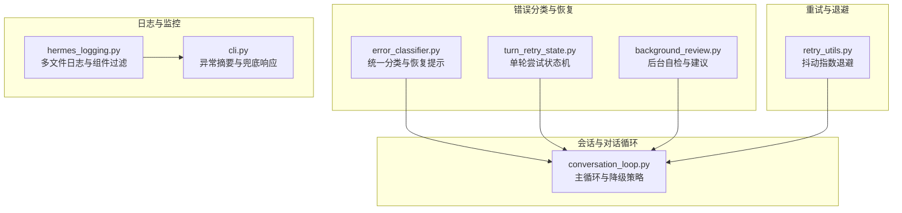
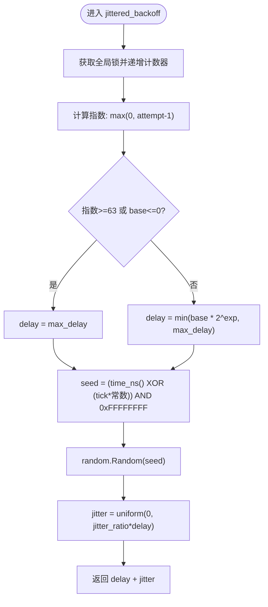
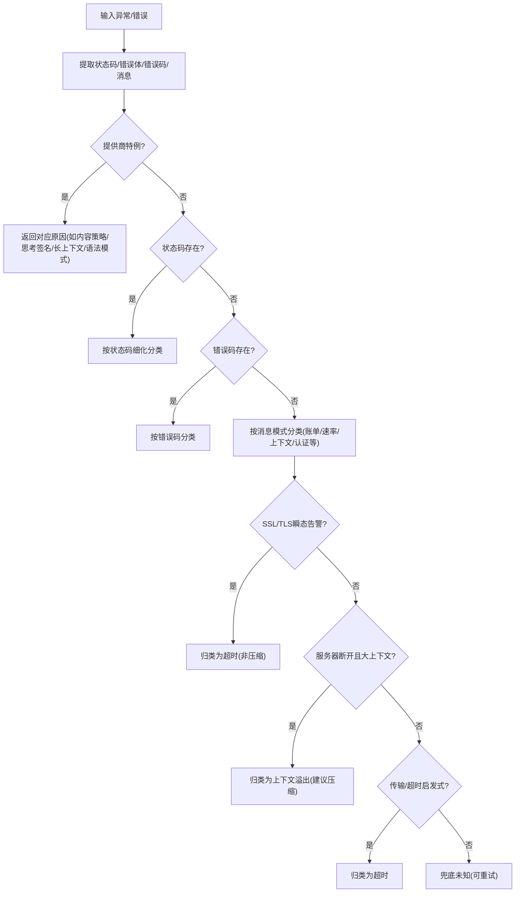
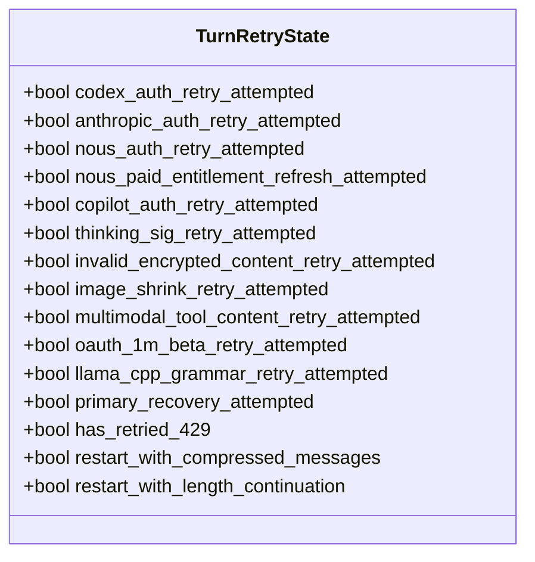
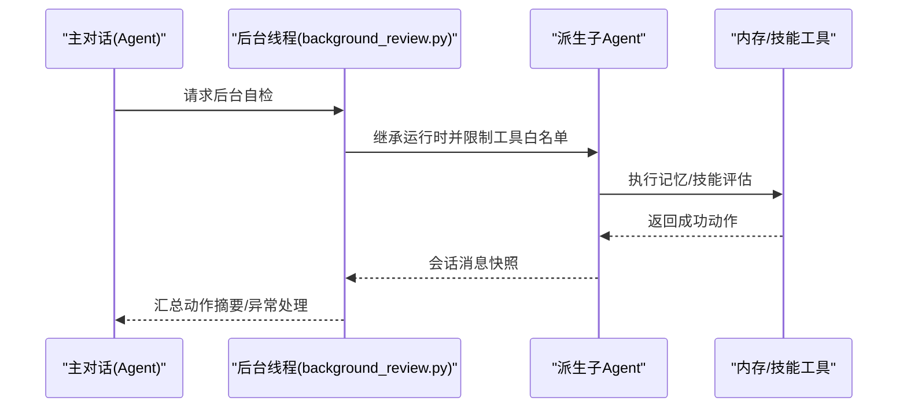
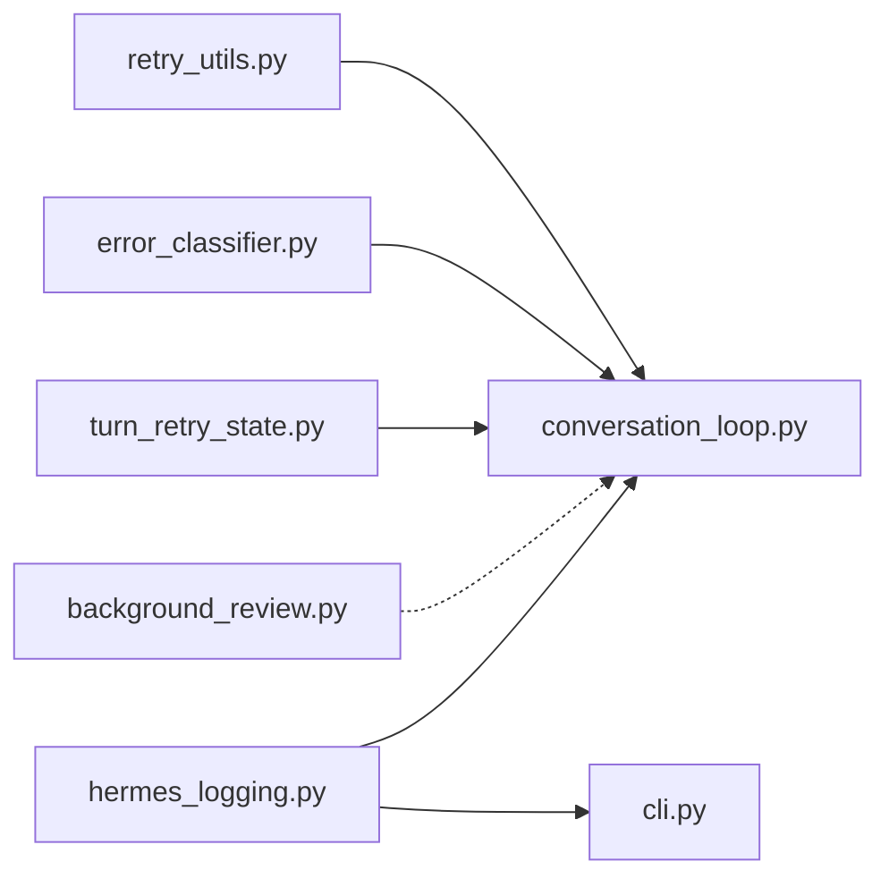

# 错误处理与恢复

<cite>
**本文引用的文件**
- [agent/retry_utils.py](file://agent/retry_utils.py)
- [agent/error_classifier.py](file://agent/error_classifier.py)
- [agent/turn_retry_state.py](file://agent/turn_retry_state.py)
- [agent/background_review.py](file://agent/background_review.py)
- [agent/conversation_loop.py](file://agent/conversation_loop.py)
- [hermes_logging.py](file://hermes_logging.py)
- [tests/agent/test_error_classifier.py](file://tests/agent/test_error_classifier.py)
- [tests/test_retry_utils.py](file://tests/test_retry_utils.py)
- [tests/run_agent/conftest.py](file://tests/run_agent/conftest.py)
- [tests/gateway/test_restart_resume_pending.py](file://tests/gateway/test_restart_resume_pending.py)
- [apps/desktop/src/app/session/hooks/use-route-resume.test.tsx](file://apps/desktop/src/app/session/hooks/use-route-resume.test.tsx)
- [cli.py](file://cli.py)
</cite>

## 目录
1. [简介](#简介)
2. [项目结构](#项目结构)
3. [核心组件](#核心组件)
4. [架构总览](#架构总览)
5. [详细组件分析](#详细组件分析)
6. [依赖分析](#依赖分析)
7. [性能考量](#性能考量)
8. [故障排查指南](#故障排查指南)
9. [结论](#结论)
10. [附录](#附录)

## 简介
本文件面向“错误处理与恢复”主题，系统化梳理本仓库中的错误分类、重试与退避、转轮重试状态管理、自动故障检测与恢复建议、错误传播与降级、以及日志与监控机制。文档以代码为依据，辅以图示与最佳实践，帮助开发者在复杂异步与多适配器场景下构建稳健的容错体系。

## 项目结构
围绕错误处理与恢复的关键模块分布如下：
- 重试与退避：agent/retry_utils.py 提供抖动指数退避；tests/test_retry_utils.py 验证行为。
- 错误分类与恢复策略：agent/error_classifier.py 提供统一的 API 错误分类与恢复提示；tests/agent/test_error_classifier.py 覆盖大量分类用例。
- 转轮重试状态管理：agent/turn_retry_state.py 以数据类封装单轮尝试的恢复守卫与重启信号。
- 自动故障检测与恢复建议：agent/background_review.py 在后台派生子进程评估对话快照，给出记忆与技能层面的自我修复摘要。
- 会话与对话循环中的重试与降级：agent/conversation_loop.py 在主循环中根据分类结果执行回退、压缩、重建客户端等动作。
- 日志与监控：hermes_logging.py 统一配置多文件日志与按组件过滤；CLI 层在异常时汇总错误摘要。
- 端到端验证：tests/gateway/test_restart_resume_pending.py、apps/desktop/src/app/session/hooks/use-route-resume.test.tsx 等覆盖重启/恢复挂起、路由恢复的有限重试与耗尽逻辑。



**图表来源**
- [agent/error_classifier.py](file://agent/error_classifier.py)
- [agent/turn_retry_state.py](file://agent/turn_retry_state.py)
- [agent/background_review.py](file://agent/background_review.py)
- [agent/conversation_loop.py](file://agent/conversation_loop.py)
- [agent/retry_utils.py](file://agent/retry_utils.py)
- [hermes_logging.py](file://hermes_logging.py)
- [cli.py](file://cli.py)

**章节来源**
- [agent/retry_utils.py](file://agent/retry_utils.py)
- [agent/error_classifier.py](file://agent/error_classifier.py)
- [agent/turn_retry_state.py](file://agent/turn_retry_state.py)
- [agent/background_review.py](file://agent/background_review.py)
- [agent/conversation_loop.py](file://agent/conversation_loop.py)
- [hermes_logging.py](file://hermes_logging.py)
- [cli.py](file://cli.py)

## 核心组件
- 抖动指数退避：提供带抖动的指数退避延迟计算，避免并发重试风暴，支持最大延迟与抖动比例配置。
- API 错误分类：基于状态码、错误体、消息与错误类型，优先匹配高确定性规则，输出可直接驱动重试/回退/压缩/凭证轮换的结构化提示。
- 单轮尝试状态机：集中管理一次 API 调用尝试内的恢复守卫与重启信号，避免分散布尔标志带来的复杂度。
- 后台自检与恢复建议：派生子进程在不触达外部存储的前提下评估会话快照，生成“记忆/技能更新”的简洁摘要。
- 会话循环中的降级策略：在达到最大重试、超时、认证失败等条件下，尝试重建客户端、回退到备用提供方、压缩上下文等。
- 日志与监控：统一的旋转日志、按组件过滤、会话上下文注入，便于快速定位与趋势分析。

**章节来源**
- [agent/retry_utils.py](file://agent/retry_utils.py)
- [agent/error_classifier.py](file://agent/error_classifier.py)
- [agent/turn_retry_state.py](file://agent/turn_retry_state.py)
- [agent/background_review.py](file://agent/background_review.py)
- [agent/conversation_loop.py](file://agent/conversation_loop.py)
- [hermes_logging.py](file://hermes_logging.py)

## 架构总览
下图展示了从错误发生到分类、退避、状态管理、降级与日志记录的整体流程。

```mermaid
sequenceDiagram
participant Caller as "调用方"
participant Loop as "对话循环(conversation_loop.py)"
participant Classifier as "错误分类(error_classifier.py)"
participant Backoff as "退避(retry_utils.py)"
participant State as "状态机(turn_retry_state.py)"
participant Logger as "日志(hermes_logging.py)"
Caller->>Loop : 发起API调用
Loop->>Loop : 捕获异常/错误
Loop->>Classifier : classify_api_error(error, provider, model, ...)
Classifier-->>Loop : ClassifiedError{reason, retryable, should_compress, ...}
alt 需要重试
Loop->>Backoff : jittered_backoff(attempt, base, max, jitter)
Backoff-->>Loop : 延迟秒数
Loop->>Logger : 记录重试等待与上下文
Loop->>Loop : 等待(分段可中断)
else 需要回退/压缩/重建
Loop->>State : 更新恢复守卫/重启信号
Loop->>Loop : 执行回退/压缩/重建
end
Logger-->>Caller : 输出错误摘要/级别日志
```

**图表来源**
- [agent/conversation_loop.py](file://agent/conversation_loop.py)
- [agent/error_classifier.py](file://agent/error_classifier.py)
- [agent/retry_utils.py](file://agent/retry_utils.py)
- [agent/turn_retry_state.py](file://agent/turn_retry_state.py)
- [hermes_logging.py](file://hermes_logging.py)

## 详细组件分析

### 抖动指数退避与限次
- 指数退避：延迟 = min(base * 2^(attempt-1), max_delay)，防止雪崩。
- 抖动：以时间+单调计数器作为种子构造随机数，均匀分布在 [0, jitter_ratio*delay]，降低同批并发重试的同步性。
- 线程安全：全局计数器与锁保护 tick 获取，避免竞态。
- 边界保护：极小 base_delay 或过大指数时直接返回最大延迟，避免溢出与忙等。
- 测试覆盖：并发一致性、边界值、抖动上限、时间戳粗粒度下的种子唯一性等。



**图表来源**
- [agent/retry_utils.py](file://agent/retry_utils.py)

**章节来源**
- [agent/retry_utils.py](file://agent/retry_utils.py)
- [tests/test_retry_utils.py](file://tests/test_retry_utils.py)

### API 错误分类与恢复策略
- 分类优先级：提供商特例（如内容策略拒绝、思考块签名、长上下文门槛、语法模式限制）、状态码细化、错误码、消息模式、SSL/TLS瞬态告警、服务器断开且大上下文、传输错误启发式、兜底未知。
- 结果结构：ClassifiedError 包含 reason、retryable、should_compress、should_rotate_credential、should_fallback 等，主循环据此决定下一步。
- 关键分支：
  - 401/403：认证失败，通常不可重试，需轮换凭证并回退。
  - 402：区分账单耗尽与瞬时配额；前者不可重试，后者按瞬时信号判定。
  - 400/4xx：请求格式错误或策略拒绝，多数非重试；但某些“请求验证”信号应快速失败并回退。
  - 500/502/503/529：服务器错误或过载，按规则可重试或回退。
  - 传输/超时：连接/读取超时、协议错误、SSL告警等，归类为超时并重试。
  - 大会话断连：在无状态码时，若上下文很大，优先考虑上下文溢出并压缩，否则视为超时。
- 测试覆盖：大量 HTTP 状态码、错误体、消息模式与提供商特例的正反例，确保误判率低。



**图表来源**
- [agent/error_classifier.py](file://agent/error_classifier.py)

**章节来源**
- [agent/error_classifier.py](file://agent/error_classifier.py)
- [tests/agent/test_error_classifier.py](file://tests/agent/test_error_classifier.py)

### 转轮重试状态管理
- 设计目标：将一次 API 调用尝试内的多种恢复分支（凭证刷新、格式修复、压缩重启、长度续传、重建客户端等）收敛为单一对象，避免散布的布尔标志。
- 关键字段：
  - 凭证/提供商刷新守卫：codex_auth_retry_attempted 等，确保每种恢复仅尝试一次。
  - 格式/负载恢复守卫：thinking_sig_retry_attempted、image_shrink_retry_attempted、multimodal_tool_content_retry_attempted、oauth_1m_beta_retry_attempted、llama_cpp_grammar_retry_attempted。
  - 传输/速率限制恢复：primary_recovery_attempted、has_retried_429。
  - 重启信号：restart_with_compressed_messages、restart_with_length_continuation。
- 优点：集中化、可测试、避免重复尝试与竞态。



**图表来源**
- [agent/turn_retry_state.py](file://agent/turn_retry_state.py)

**章节来源**
- [agent/turn_retry_state.py](file://agent/turn_retry_state.py)

### 自动故障检测与恢复建议
- 触发时机：每次对话回合结束后，可选地派生后台线程对会话快照进行评估。
- 行为：继承父进程运行时（模型/提供方/凭据/系统提示缓存），仅允许内存与技能管理工具，避免对外部存储造成副作用。
- 输出：汇总成功的“记忆/技能更新”动作，去重并按通知模式输出简洁摘要；异常时记录警告并上报辅助失败事件。
- 价值：在不干扰主线程的前提下，持续学习与优化，减少重复性错误。



**图表来源**
- [agent/background_review.py](file://agent/background_review.py)

**章节来源**
- [agent/background_review.py](file://agent/background_review.py)

### 会话循环中的重试与降级
- 主循环在捕获错误后调用分类器，依据 ClassifiedError 的提示执行：
  - 重试：计算抖动退避，分段睡眠以支持中断。
  - 回退：尝试切换到备用提供方或模型。
  - 压缩：对大上下文进行压缩以缓解上下文溢出。
  - 重建：对传输层瞬态错误尝试重建客户端。
  - 终止：达到最大重试次数或不可恢复错误时，输出调试请求快照并终止。
- 中断与恢复：等待期间支持中断，中断后持久化会话并提前退出。

```mermaid
sequenceDiagram
participant Loop as "对话循环"
participant Class as "分类器"
participant Backoff as "退避"
participant Action as "动作(回退/压缩/重建)"
Loop->>Class : classify_api_error(...)
Class-->>Loop : ClassifiedError
alt retryable
Loop->>Backoff : jittered_backoff(...)
Backoff-->>Loop : 等待时间
Loop->>Loop : 分段等待(可中断)
Loop->>Action : 重试
else should_fallback
Loop->>Action : 回退
else should_compress
Loop->>Action : 压缩上下文
else 重建客户端
Loop->>Action : 重建
end
```

**图表来源**
- [agent/conversation_loop.py](file://agent/conversation_loop.py)
- [agent/error_classifier.py](file://agent/error_classifier.py)
- [agent/retry_utils.py](file://agent/retry_utils.py)

**章节来源**
- [agent/conversation_loop.py](file://agent/conversation_loop.py)

### 错误传播与降级策略
- 传播路径：错误在会话循环中被分类，随后由主循环根据策略决定重试、回退、压缩或终止，并在必要时输出调试信息。
- 降级开关：
  - 回退：当错误不可重试或达到最大重试后，尝试备用提供方或模型。
  - 压缩：针对上下文溢出，优先压缩消息长度。
  - 重建：对传输层瞬态错误尝试重建客户端连接池。
  - 终止：在不可恢复错误（如内容策略拒绝、永久认证失败）时，输出最终响应并结束回合。
- CLI 层兜底：当 run_conversation 抛出异常时，记录错误并返回简短摘要，保证前端体验稳定。

**章节来源**
- [agent/conversation_loop.py](file://agent/conversation_loop.py)
- [cli.py](file://cli.py)

### 日志记录与监控
- 文件与级别：
  - agent.log：INFO+，主活动日志。
  - errors.log：WARNING+，快速排障入口。
  - gateway.log/gui.log：按组件过滤，分别聚焦网关与 GUI 相关事件。
- 组件过滤：通过 _ComponentFilter 将不同命名空间的日志定向到对应文件。
- 会话上下文：set_session_context/clear_session_context 注入会话标签，便于关联多进程/多线程日志。
- Windows 兼容：在 Windows 使用并发旋转处理器避免“文件被占用”错误。
- CLI 摘要：异常时截断并汇总错误文本，避免长堆栈污染用户界面。

**章节来源**
- [hermes_logging.py](file://hermes_logging.py)
- [cli.py](file://cli.py)

## 依赖分析
- 模块内聚与耦合：
  - error_classifier 与 conversation_loop 强耦合：前者提供结构化分类，后者消费分类结果执行动作。
  - retry_utils 与 conversation_loop 弱耦合：通过函数调用提供退避延迟，不依赖上层业务。
  - turn_retry_state 与 conversation_loop 弱耦合：以数据类形式承载状态，便于测试与复用。
  - background_review 与 conversation_loop 解耦：通过派生子进程与工具白名单实现隔离。
- 外部依赖：
  - hermes_logging 提供统一日志基础设施，被 CLI 与各模块共享。
  - 测试通过 conftest.patch 两个模块的退避函数，确保测试可控。



**图表来源**
- [agent/retry_utils.py](file://agent/retry_utils.py)
- [agent/error_classifier.py](file://agent/error_classifier.py)
- [agent/turn_retry_state.py](file://agent/turn_retry_state.py)
- [agent/background_review.py](file://agent/background_review.py)
- [agent/conversation_loop.py](file://agent/conversation_loop.py)
- [hermes_logging.py](file://hermes_logging.py)
- [cli.py](file://cli.py)

**章节来源**
- [tests/run_agent/conftest.py](file://tests/run_agent/conftest.py)

## 性能考量
- 抖动退避显著降低重试风暴概率，提升整体吞吐稳定性。
- 分段等待与中断支持避免长时间阻塞，提高交互响应性。
- 日志轮转与组件过滤降低磁盘 IO 与解析成本，Windows 并发旋转避免频繁 rename 导致的失败。
- 后台自检采用轻量派生进程与工具白名单，避免对外部存储与网络的额外压力。

## 故障排查指南
- 快速定位：
  - 使用 errors.log 快速筛选 WARNING+ 错误；结合 agent.log 的会话标签定位具体回合。
  - 在 CLI 中查看异常摘要，必要时开启更详细日志。
- 常见问题与对策：
  - 速率限制：观察分类结果是否为 rate_limit，确认退避是否生效；若频繁出现，考虑回退到备用提供方或降低请求频率。
  - 认证失败：确认 should_rotate_credential 是否被触发；检查凭证轮换与回退逻辑。
  - 上下文溢出：确认 should_compress 是否被触发；检查压缩策略与消息长度阈值。
  - 传输瞬态错误：确认是否尝试重建客户端；关注 SSL/TLS 告警模式。
  - 路由恢复失败：在桌面端钩子中观察有限重试与耗尽逻辑，避免无限重试风暴。
- 重启/恢复挂起：
  - 检查会话存储中标记的 resume_pending 与原因，确认重启超时后的挂起状态是否正确恢复或清理。

**章节来源**
- [hermes_logging.py](file://hermes_logging.py)
- [cli.py](file://cli.py)
- [apps/desktop/src/app/session/hooks/use-route-resume.test.tsx](file://apps/desktop/src/app/session/hooks/use-route-resume.test.tsx)
- [tests/gateway/test_restart_resume_pending.py](file://tests/gateway/test_restart_resume_pending.py)

## 结论
本仓库通过“分类—退避—状态—降级—日志”的闭环设计，实现了在网络波动、API 限流、认证失效、上下文溢出等常见故障场景下的稳健恢复。抖动指数退避与有限重试策略有效抑制了重试风暴；结构化的错误分类与状态机使恢复路径清晰可控；后台自检与日志体系提供了持续学习与可观测性的基础。建议在生产环境中结合会话上下文与组件过滤，配合有限重试与回退策略，进一步提升系统韧性。

## 附录
- 最佳实践：
  - 明确错误分类优先级，优先处理高确定性规则，避免误判。
  - 控制最大重试次数与最大延迟，防止资源耗尽。
  - 在等待期间采用分段睡眠并支持中断，提升用户体验。
  - 使用会话标签与组件过滤日志，缩短定位时间。
  - 对于不可恢复错误，及时输出调试信息并终止，避免无效重试。
- 故障排除清单：
  - 是否正确提取状态码/错误体/错误码/消息？
  - 是否区分账单耗尽与瞬时配额？
  - 是否启用抖动退避并限制最大延迟？
  - 是否在达到最大重试后尝试回退/压缩/重建？
  - 日志是否包含会话标签与组件过滤？