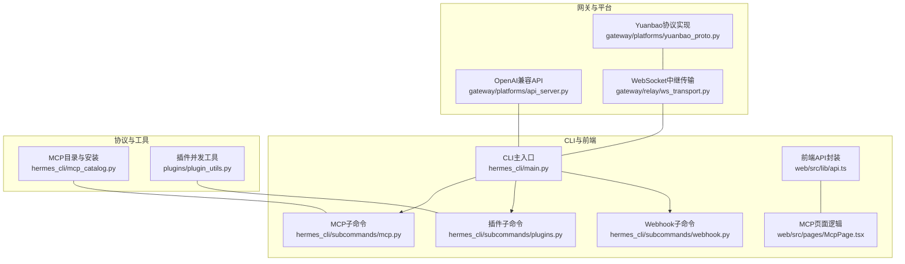
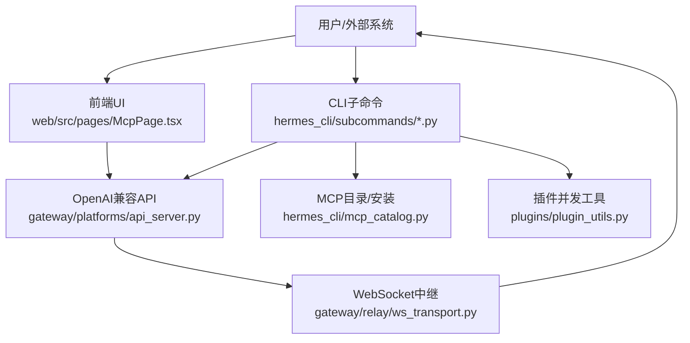
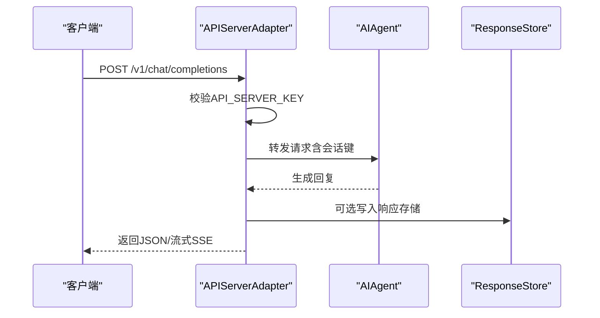
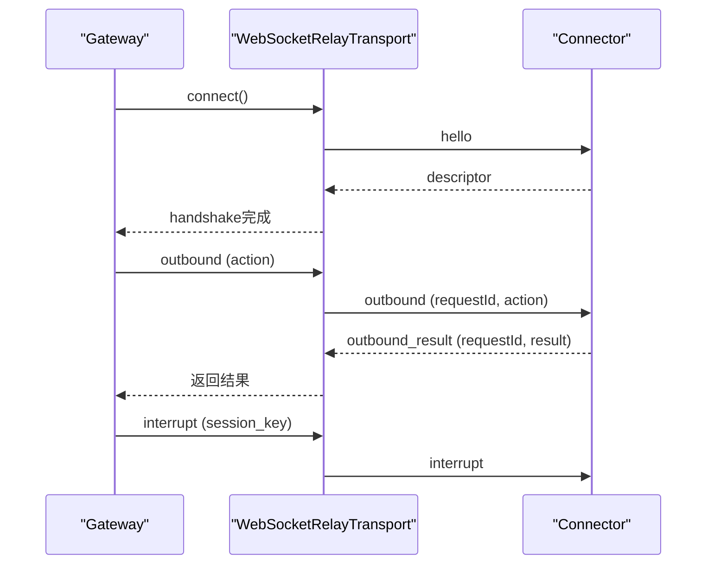
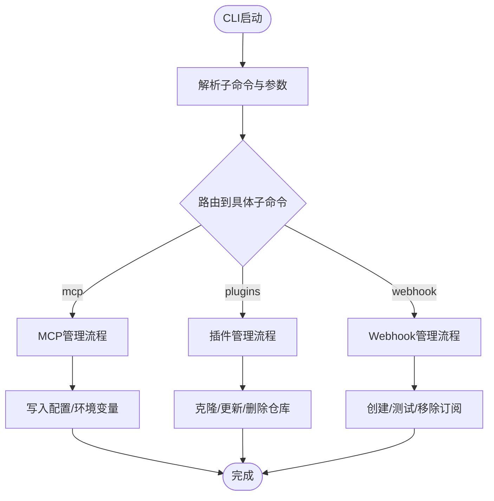
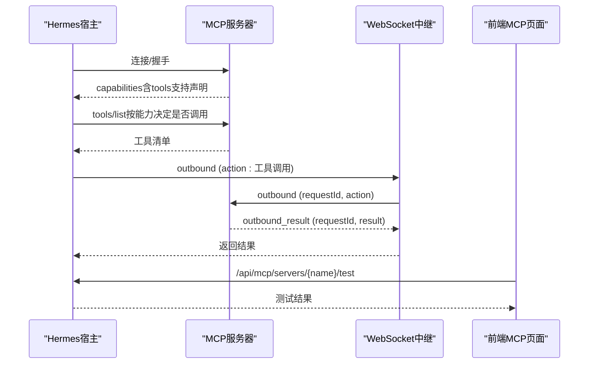
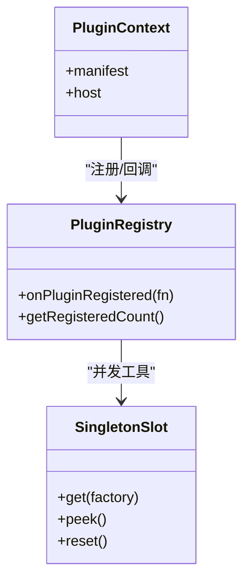
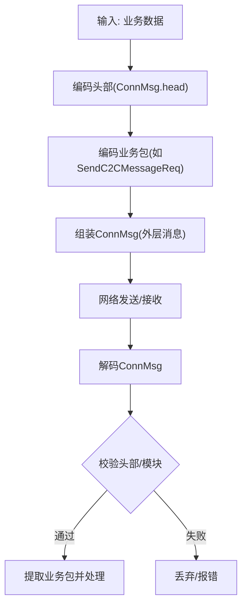
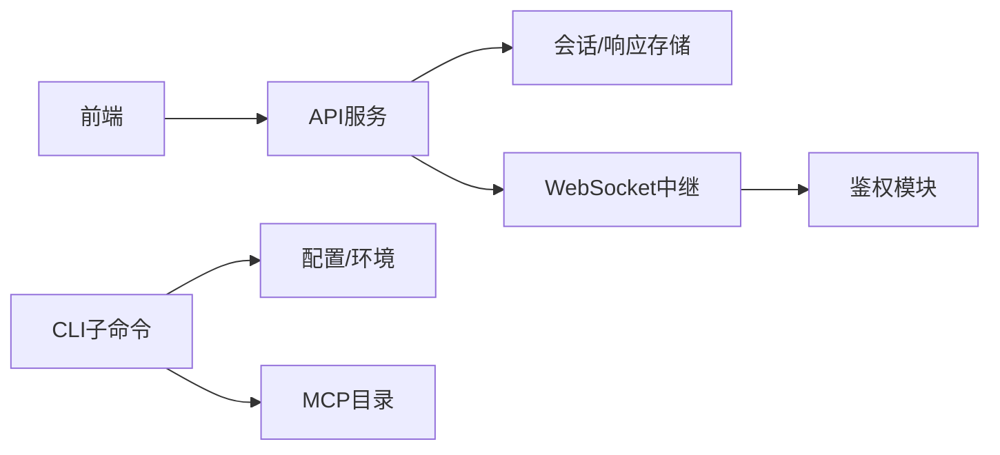

# API参考

<cite>
**本文档引用的文件**
- [api_server.py](file://gateway/platforms/api_server.py)
- [ws_transport.py](file://gateway/relay/ws_transport.py)
- [main.py](file://hermes_cli/main.py)
- [mcp.py](file://hermes_cli/subcommands/mcp.py)
- [plugins.py](file://hermes_cli/subcommands/plugins.py)
- [webhook.py](file://hermes_cli/subcommands/webhook.py)
- [_shared.py](file://hermes_cli/subcommands/_shared.py)
- [mcp_catalog.py](file://hermes_cli/mcp_catalog.py)
- [plugin_utils.py](file://plugins/plugin_utils.py)
- [api.ts](file://web/src/lib/api.ts)
- [McpPage.tsx](file://web/src/pages/McpPage.tsx)
- [test_ws_transport.py](file://tests/gateway/relay/test_ws_transport.py)
- [test_mcp_capability_gating.py](file://tests/tools/test_mcp_capability_gating.py)
- [yuanbao_proto.py](file://gateway/platforms/yuanbao_proto.py)
- [test_yuanbao_proto.py](file://tests/test_yuanbao_proto.py)
- [web-dashboard.md](file://website/docs/user-guide/features/web-dashboard.md)
</cite>

## 目录
1. [简介](#简介)
2. [项目结构](#项目结构)
3. [核心组件](#核心组件)
4. [架构总览](#架构总览)
5. [详细组件分析](#详细组件分析)
6. [依赖分析](#依赖分析)
7. [性能考量](#性能考量)
8. [故障排查指南](#故障排查指南)
9. [结论](#结论)
10. [附录](#附录)

## 简介
本参考文档面向开发者与集成者，系统性梳理 Hermes Agent 的多类接口与协议：REST API（含网关平台适配器）、WebSocket 实时通道、CLI 命令行接口、MCP 协议（含能力声明与工具调用）、插件开发接口（注册、事件与数据交换）、以及 Socket/IPC 通信协议（含 Yuanbao 协议）。文档提供端点规范、消息格式、事件类型、认证机制、错误处理策略、安全与性能限制，并给出最佳实践与迁移建议。

## 项目结构
- 网关平台适配层提供 OpenAI 兼容 API 与会话管理，支持健康检查、运行生命周期、SSE 事件流等。
- 交互式 CLI 提供命令行入口与子命令解析，覆盖 MCP 管理、插件管理、Webhook 等。
- WebSocket 中继传输负责与“连接器”建立长连，承载握手、入站/出站帧与中断事件。
- MCP 目录与安装流程提供“官方”预置 MCP 服务器清单与一键安装。
- 插件开发工具提供线程安全的单例与并发辅助。
- Yuanbao 协议实现微信生态的消息编解码与业务包封装。

图表来源
- [api_server.py:1-120](file://gateway/platforms/api_server.py#L1-L120)
- [ws_transport.py:1-120](file://gateway/relay/ws_transport.py#L1-L120)
- [main.py:1-120](file://hermes_cli/main.py#L1-L120)
- [mcp.py:1-109](file://hermes_cli/subcommands/mcp.py#L1-L109)
- [plugins.py:1-95](file://hermes_cli/subcommands/plugins.py#L1-L95)
- [webhook.py:1-77](file://hermes_cli/subcommands/webhook.py#L1-L77)
- [api.ts:915-953](file://web/src/lib/api.ts#L915-L953)
- [McpPage.tsx:26-71](file://web/src/pages/McpPage.tsx#L26-L71)
- [mcp_catalog.py:1-120](file://hermes_cli/mcp_catalog.py#L1-L120)
- [plugin_utils.py:1-136](file://plugins/plugin_utils.py#L1-L136)
- [yuanbao_proto.py:896-1132](file://gateway/platforms/yuanbao_proto.py#L896-L1132)

章节来源
- [api_server.py:1-120](file://gateway/platforms/api_server.py#L1-L120)
- [ws_transport.py:1-120](file://gateway/relay/ws_transport.py#L1-L120)
- [main.py:1-120](file://hermes_cli/main.py#L1-L120)
- [mcp.py:1-109](file://hermes_cli/subcommands/mcp.py#L1-L109)
- [plugins.py:1-95](file://hermes_cli/subcommands/plugins.py#L1-L95)
- [webhook.py:1-77](file://hermes_cli/subcommands/webhook.py#L1-L77)
- [api.ts:915-953](file://web/src/lib/api.ts#L915-L953)
- [McpPage.tsx:26-71](file://web/src/pages/McpPage.tsx#L26-L71)
- [mcp_catalog.py:1-120](file://hermes_cli/mcp_catalog.py#L1-L120)
- [plugin_utils.py:1-136](file://plugins/plugin_utils.py#L1-L136)
- [yuanbao_proto.py:896-1132](file://gateway/platforms/yuanbao_proto.py#L896-L1132)

## 核心组件
- OpenAI 兼容 API 服务：提供聊天补全、响应存储、会话管理、运行生命周期与事件流等端点。
- WebSocket 中继传输：与连接器建立双向长连，定义握手、入站/出站帧与中断事件。
- CLI 子命令体系：MCP 管理、插件管理、Webhook 管理等，统一解析与帮助输出。
- MCP 目录与安装：官方 MCP 清单、认证与环境变量收集、工具选择与保存。
- 插件并发工具：线程安全的惰性单例与单例槽，避免竞态初始化。
- Yuanbao 协议：微信生态消息编解码、业务包封装与鉴权升级头。

章节来源
- [api_server.py:1-200](file://gateway/platforms/api_server.py#L1-L200)
- [ws_transport.py:100-200](file://gateway/relay/ws_transport.py#L100-L200)
- [mcp.py:15-109](file://hermes_cli/subcommands/mcp.py#L15-L109)
- [plugins.py:12-95](file://hermes_cli/subcommands/plugins.py#L12-L95)
- [mcp_catalog.py:1-200](file://hermes_cli/mcp_catalog.py#L1-L200)
- [plugin_utils.py:43-136](file://plugins/plugin_utils.py#L43-L136)
- [yuanbao_proto.py:896-1132](file://gateway/platforms/yuanbao_proto.py#L896-L1132)

## 架构总览
下图展示 REST API、WebSocket 中继与前端/CLI 的交互关系，以及 MCP 与插件在宿主中的位置。

图表来源
- [api_server.py:1-120](file://gateway/platforms/api_server.py#L1-L120)
- [ws_transport.py:1-120](file://gateway/relay/ws_transport.py#L1-120)
- [McpPage.tsx:26-71](file://web/src/pages/McpPage.tsx#L26-L71)
- [mcp.py:15-109](file://hermes_cli/subcommands/mcp.py#L15-L109)
- [plugins.py:12-95](file://hermes_cli/subcommands/plugins.py#L12-L95)
- [mcp_catalog.py:1-120](file://hermes_cli/mcp_catalog.py#L1-L120)
- [plugin_utils.py:1-136](file://plugins/plugin_utils.py#L1-L136)

## 详细组件分析

### REST API（OpenAI 兼容）
- 端点概览
  - 聊天补全：POST /v1/chat/completions（支持会话键头）
  - 响应存储：POST /v1/responses、GET /v1/responses/{response_id}、DELETE /v1/responses/{response_id}
  - 模型列表：GET /v1/models
  - 能力查询：GET /v1/capabilities
  - 会话管理：GET/POST /api/sessions、GET/PATCH/DELETE /api/sessions/{session_id}、GET /api/sessions/{session_id}/messages
  - 运行生命周期：POST /v1/runs、GET /v1/runs/{run_id}、GET /v1/runs/{run_id}/events、POST /v1/runs/{run_id}/approval、POST /v1/runs/{run_id}/stop
  - 健康检查：GET /health、GET /health/detailed
- 认证与安全
  - API_SERVER_KEY 作为密钥，所有受保护端点需携带该密钥进行访问。
  - 默认仅监听本地回环地址，可通过环境变量或配置调整。
  - 内置安全头与 CORS 预检处理。
- 请求/响应要点
  - 支持多模态内容归一化（文本/图片），对非法内容抛出明确错误。
  - 响应存储基于 SQLite，具备 LRU 与权限收紧。
  - 运行事件采用 SSE 流式推送。
- 错误处理
  - 使用 OpenAI 风格错误体，包含 message/type/param/code。
  - 超大请求体拒绝（413），无效 Content-Length 返回 400。
- 性能与限制
  - 最大请求体大小、内容长度与数组项数限制，防止滥用。
  - SSE 心跳间隔可配置，避免空闲断开。

图表来源
- [api_server.py:734-820](file://gateway/platforms/api_server.py#L734-L820)
- [api_server.py:371-537](file://gateway/platforms/api_server.py#L371-L537)

章节来源
- [api_server.py:1-200](file://gateway/platforms/api_server.py#L1-L200)
- [api_server.py:549-623](file://gateway/platforms/api_server.py#L549-L623)
- [api_server.py:734-820](file://gateway/platforms/api_server.py#L734-L820)
- [api_server.py:371-537](file://gateway/platforms/api_server.py#L371-L537)

### WebSocket 接口（中继传输）
- 连接与握手
  - 网关主动拨号至连接器 WebSocket，发送 hello 帧，等待 descriptor 响应完成握手。
  - 支持升级鉴权头（Authorization: Bearer），用于网关级认证。
- 帧协议
  - hello：{type, platform, botId}
  - descriptor：{type, descriptor}
  - inbound：{type, event, bufferId?}
  - outbound：{type, requestId, action}
  - outbound_result：{type, requestId, result}
  - interrupt：{type, session_key, reason?}
  - interrupt_inbound：{type, session_key, chat_id}
- 实时交互
  - 出站调用阻塞等待对应 requestId 的结果；入站帧由处理器异步分发。
  - 支持会话中断与聊天信息查询。
- 错误与重连
  - 读循环异常时记录日志并结束任务；关闭时失败挂起的请求以避免悬挂。

图表来源
- [ws_transport.py:102-200](file://gateway/relay/ws_transport.py#L102-L200)
- [ws_transport.py:250-299](file://gateway/relay/ws_transport.py#L250-L299)
- [test_ws_transport.py:43-79](file://tests/gateway/relay/test_ws_transport.py#L43-L79)

章节来源
- [ws_transport.py:1-120](file://gateway/relay/ws_transport.py#L1-L120)
- [ws_transport.py:102-200](file://gateway/relay/ws_transport.py#L102-L200)
- [ws_transport.py:250-299](file://gateway/relay/ws_transport.py#L250-L299)
- [test_ws_transport.py:43-79](file://tests/gateway/relay/test_ws_transport.py#L43-L79)

### CLI 命令 API 规范
- 命令组织
  - hermes mcp：管理 MCP 服务器（添加/移除/列出/测试/配置/登录/目录/安装）。
  - hermes plugins：安装/更新/移除/列出插件，支持启用/禁用。
  - hermes webhook：动态 Webhook 订阅（创建/列出/移除/测试）。
  - 共享标志：--accept-hooks 在无 TTY 场景自动批准未知钩子。
- 参数与返回
  - 子命令解析与帮助输出；部分操作返回 JSON/表格/纯文本视图。
  - 插件列表支持 --enabled/--user/--no-bundled/--plain/--json。
- 与前端协作
  - 前端通过 /api/mcp/* 端点与后端交互，使用 fetchJSON 封装请求。

图表来源
- [mcp.py:15-109](file://hermes_cli/subcommands/mcp.py#L15-L109)
- [plugins.py:12-95](file://hermes_cli/subcommands/plugins.py#L12-L95)
- [webhook.py:12-77](file://hermes_cli/subcommands/webhook.py#L12-L77)
- [_shared.py:15-30](file://hermes_cli/subcommands/_shared.py#L15-L30)
- [api.ts:915-953](file://web/src/lib/api.ts#L915-L953)

章节来源
- [mcp.py:15-109](file://hermes_cli/subcommands/mcp.py#L15-L109)
- [plugins.py:12-95](file://hermes_cli/subcommands/plugins.py#L12-L95)
- [webhook.py:12-77](file://hermes_cli/subcommands/webhook.py#L12-L77)
- [_shared.py:15-30](file://hermes_cli/subcommands/_shared.py#L15-L30)
- [api.ts:915-953](file://web/src/lib/api.ts#L915-L953)

### MCP 协议与实现
- 能力声明与工具发现
  - 依据 InitializeResult.capabilities 判断是否支持 tools/* 请求族，避免对仅提示/资源服务器发起不支持的探测。
- 工具调用与状态管理
  - 通过 WebSocket 中继传输发送 action，等待 outbound_result；支持 follow_up 与 get_chat_info。
  - 运行生命周期：创建 run、轮询状态、SSE 事件流、审批与停止。
- 官方目录与安装
  - optional-mcps 下的清单定义传输方式（stdio/http）、认证（api_key/oauth）、安装步骤与后置说明。
  - 安装时收集环境变量（.env），OAuth 由 MCP 客户端在首次连接时触发浏览器流程。
- 前端交互
  - 前端通过 /api/mcp/* 端点与后端交互，封装测试、启用/禁用、目录浏览与安装。

图表来源
- [test_mcp_capability_gating.py:1-36](file://tests/tools/test_mcp_capability_gating.py#L1-L36)
- [ws_transport.py:207-243](file://gateway/relay/ws_transport.py#L207-L243)
- [api.ts:915-953](file://web/src/lib/api.ts#L915-L953)
- [McpPage.tsx:26-71](file://web/src/pages/McpPage.tsx#L26-L71)

章节来源
- [test_mcp_capability_gating.py:1-36](file://tests/tools/test_mcp_capability_gating.py#L1-L36)
- [ws_transport.py:207-243](file://gateway/relay/ws_transport.py#L207-L243)
- [api.ts:915-953](file://web/src/lib/api.ts#L915-L953)
- [McpPage.tsx:26-71](file://web/src/pages/McpPage.tsx#L26-L71)

### 插件开发 API
- 注册与事件
  - 插件通过 register() 函数向宿主注册工具、中间件与钩子；宿主快照注册前后差异，确保计数准确。
  - 插件注册表与插槽系统支持 UI 扩展（slots）与事件回调。
- 数据交换格式
  - 插件与宿主通过公共 SDK 合约（版本号）交换对象；宿主暴露 window.__HERMES_PLUGINS__。
- 并发与线程安全
  - 提供惰性单例与单例槽，避免多线程竞态初始化昂贵对象。
  - reset() 支持测试与清理。

图表来源
- [main.py:1538-1563](file://hermes_cli/main.py#L1538-L1563)
- [plugin_utils.py:84-136](file://plugins/plugin_utils.py#L84-L136)

章节来源
- [main.py:1538-1563](file://hermes_cli/main.py#L1538-L1563)
- [plugin_utils.py:43-136](file://plugins/plugin_utils.py#L43-L136)

### Socket 与 IPC 通信（Yuanbao 协议）
- 编解码与业务包
  - 提供 ConnMsg 头部与多种业务包（AuthBindReq、PingReq、PushMsg、SendC2CMessageReq、SendGroupMessageReq）的编码/解码。
  - 支持推送确认（PushAck）与鉴权绑定（AuthBind）。
- 数据流与消息传递
  - 通过 encode_conn_msg_full 构建完整消息，包含 cmd、msg_id、module 等字段。
  - 解码后校验头部与模块字段，保证消息完整性。
- 进程同步
  - 通过序列号（seq_no）与消息 ID（msg_id）实现请求/响应匹配与去重。

图表来源
- [yuanbao_proto.py:896-1132](file://gateway/platforms/yuanbao_proto.py#L896-L1132)
- [test_yuanbao_proto.py:123-523](file://tests/test_yuanbao_proto.py#L123-L523)

章节来源
- [yuanbao_proto.py:896-1132](file://gateway/platforms/yuanbao_proto.py#L896-L1132)
- [test_yuanbao_proto.py:123-523](file://tests/test_yuanbao_proto.py#L123-L523)

## 依赖分析
- 组件耦合
  - API 服务依赖会话数据库与运行状态管理；WebSocket 中继依赖连接器协议与鉴权模块。
  - CLI 子命令与 MCP/插件/Webhook 管理解耦于宿主配置与环境变量。
  - 前端通过统一 API 封装与后端交互，降低对具体端点细节的耦合。
- 外部依赖
  - aiohttp（API 服务）、websockets（中继传输）、SQLite（响应存储）。
- 循环依赖规避
  - CLI 子命令解析器独立模块化，避免与主入口循环导入。

图表来源
- [api_server.py:371-537](file://gateway/platforms/api_server.py#L371-L537)
- [ws_transport.py:102-200](file://gateway/relay/ws_transport.py#L102-L200)
- [mcp_catalog.py:1-120](file://hermes_cli/mcp_catalog.py#L1-L120)

章节来源
- [api_server.py:371-537](file://gateway/platforms/api_server.py#L371-L537)
- [ws_transport.py:102-200](file://gateway/relay/ws_transport.py#L102-L200)
- [mcp_catalog.py:1-120](file://hermes_cli/mcp_catalog.py#L1-L120)

## 性能考量
- API 服务
  - 限制请求体大小与内容长度，避免内存与带宽压力；SSE 心跳间隔可调。
  - 响应存储采用 WAL 降级与权限收紧，兼顾可靠性与安全性。
- WebSocket
  - 出站调用超时控制与 requestId 匹配，避免堆积；读循环异常时优雅结束任务。
- CLI 与前端
  - 子命令解析与 UI 交互解耦，减少热路径上的阻塞。
- MCP
  - 能力门控避免对不支持工具的探测；工具选择持久化减少重复探测成本。

## 故障排查指南
- API 服务
  - 413/400 错误：检查 Content-Length 与请求体大小；查看 OpenAI 风格错误体定位问题。
  - CORS/鉴权失败：确认 Origin 白名单与 API_SERVER_KEY。
- WebSocket
  - 握手/超时：确认连接 URL、升级头与连接器可达性；查看日志与断线重连策略。
  - 帧格式错误：检查 newline-delimited JSON 与字段完整性。
- CLI
  - MCP 安装失败：检查 PATH、git 可用性与清单版本；OAuth 未完成时需先执行登录。
  - 插件加载错误：查看注册回调与 SDK 版本兼容性。
- Yuanbao
  - 编解码异常：核对常量与消息类型映射；确保 seq_no 与 msg_id 唯一性。

章节来源
- [api_server.py:586-623](file://gateway/platforms/api_server.py#L586-L623)
- [ws_transport.py:145-200](file://gateway/relay/ws_transport.py#L145-L200)
- [mcp_catalog.py:358-424](file://hermes_cli/mcp_catalog.py#L358-L424)
- [test_yuanbao_proto.py:123-523](file://tests/test_yuanbao_proto.py#L123-L523)

## 结论
本文档系统化呈现了 Hermes Agent 的 REST API、WebSocket、CLI、MCP、插件与 Yuanbao 协议接口。通过清晰的端点规范、消息格式与事件模型，结合认证、错误处理与性能限制，为集成与扩展提供了可靠参考。建议在生产环境中严格遵循安全头、CORS 与密钥管理策略，并利用能力门控与工具选择持久化优化 MCP 体验。

## 附录
- 管理端点一览（仪表盘相关）
  - MCP 管理：/api/mcp/servers、/api/mcp/servers/{name}/test、/api/mcp/servers/{name}/enabled、/api/mcp/catalog、/api/mcp/catalog/install
  - 平台与 Webhook：/api/messaging/platforms、/api/messaging/platforms/{id}、/api/messaging/platforms/{id}/test、/api/webhooks、/api/webhooks/{name}
  - 凭据池、内存、网关生命周期、运维诊断、Hook、检查点、系统统计、更新检查、Curator、Portal、Prompt Size、配置迁移、定时任务、会话统计与导出、会话修剪
- 前端 API 封装
  - 通过 fetchJSON 封装 /api/* 请求，统一处理 JSON 序列化与响应。

章节来源
- [web-dashboard.md:507-554](file://website/docs/user-guide/features/web-dashboard.md#L507-L554)
- [api.ts:915-953](file://web/src/lib/api.ts#L915-L953)