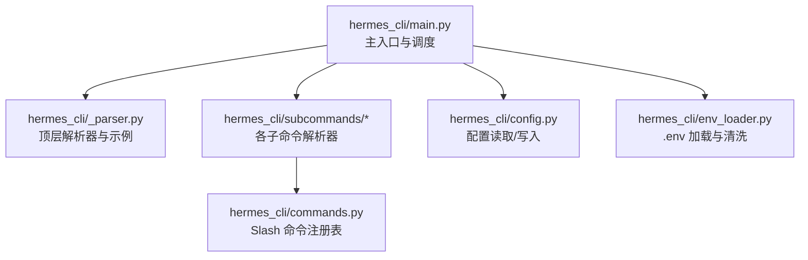
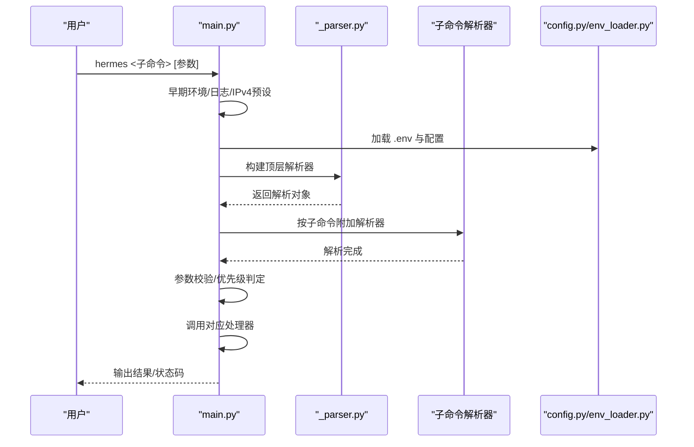
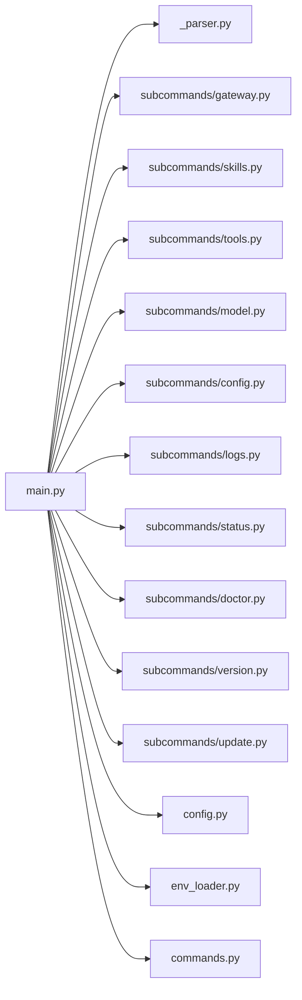

# CLI API

<cite>
**本文引用的文件**
- [hermes_cli/main.py](file://hermes_cli/main.py)
- [hermes_cli/_parser.py](file://hermes_cli/_parser.py)
- [hermes_cli/subcommands/gateway.py](file://hermes_cli/subcommands/gateway.py)
- [hermes_cli/subcommands/skills.py](file://hermes_cli/subcommands/skills.py)
- [hermes_cli/subcommands/tools.py](file://hermes_cli/subcommands/tools.py)
- [hermes_cli/subcommands/model.py](file://hermes_cli/subcommands/model.py)
- [hermes_cli/subcommands/config.py](file://hermes_cli/subcommands/config.py)
- [hermes_cli/subcommands/logs.py](file://hermes_cli/subcommands/logs.py)
- [hermes_cli/subcommands/status.py](file://hermes_cli/subcommands/status.py)
- [hermes_cli/subcommands/doctor.py](file://hermes_cli/subcommands/doctor.py)
- [hermes_cli/subcommands/version.py](file://hermes_cli/subcommands/version.py)
- [hermes_cli/subcommands/update.py](file://hermes_cli/subcommands/update.py)
- [hermes_cli/commands.py](file://hermes_cli/commands.py)
- [hermes_cli/config.py](file://hermes_cli/config.py)
- [hermes_cli/env_loader.py](file://hermes_cli/env_loader.py)
- [cli-config.yaml.example](file://cli-config.yaml.example)
</cite>

## 目录
1. [简介](#简介)
2. [项目结构](#项目结构)
3. [核心组件](#核心组件)
4. [架构总览](#架构总览)
5. [详细组件分析](#详细组件分析)
6. [依赖分析](#依赖分析)
7. [性能考虑](#性能考虑)
8. [故障排查指南](#故障排查指南)
9. [结论](#结论)
10. [附录](#附录)

## 简介
本文件为 Hermes Agent 的 CLI 命令 API 文档，覆盖 hermes 主命令及其子命令的语法结构、参数定义与返回值格式；阐明命令解析机制（参数优先级、配置继承与默认值处理）；详述 gateway、skills、tools、models、config 等常用命令的功能规范与使用示例；解释命令执行流程（参数校验、配置加载、结果输出格式）；介绍调试与诊断命令（logs、status、doctor）的用法；给出批量操作与脚本化使用的最佳实践；并说明命令行选项与环境变量映射及配置文件集成。

## 项目结构
Hermes CLI 采用“主入口 + 子命令解析器 + 共享参数注入”的模块化设计：
- 主入口负责早期环境准备、配置加载、日志初始化与子命令分发
- 子命令解析器按功能拆分，集中于 hermes_cli/subcommands 下
- 共享参数通过 _shared 注入，确保一致性
- 配置管理与环境变量加载在独立模块中完成

图表来源
- [hermes_cli/main.py:1-120](file://hermes_cli/main.py#L1-L120)
- [hermes_cli/_parser.py:84-412](file://hermes_cli/_parser.py#L84-L412)
- [hermes_cli/subcommands/gateway.py:32-333](file://hermes_cli/subcommands/gateway.py#L32-L333)
- [hermes_cli/config.py:1-200](file://hermes_cli/config.py#L1-L200)
- [hermes_cli/env_loader.py:1-200](file://hermes_cli/env_loader.py#L1-L200)
- [hermes_cli/commands.py:64-237](file://hermes_cli/commands.py#L64-L237)

章节来源
- [hermes_cli/main.py:1-120](file://hermes_cli/main.py#L1-L120)
- [hermes_cli/_parser.py:84-412](file://hermes_cli/_parser.py#L84-L412)

## 核心组件
- 主入口与早期初始化：设置进程标题、早期 TUI 判定、Termux 快速路径、版本信息快速打印、日志初始化、IPv4 强制策略、环境变量预加载
- 顶层解析器：定义通用参数（如 --oneshot、--model、--provider、--tui/--cli、--safe-mode 等），以及 chat 子命令的参数集合
- 子命令解析器：按功能模块化构建，如 gateway、skills、tools、model、config、logs、status、doctor、version、update 等
- 配置与环境：统一的配置读取、写入与迁移；.env 文件加载、敏感信息清洗与来源标注；配置错误的告警与回退
- Slash 命令注册：集中管理 CLI/Gateway 平台可用的斜杠命令，支持别名、分类、子命令提示与平台适配

章节来源
- [hermes_cli/main.py:68-106](file://hermes_cli/main.py#L68-L106)
- [hermes_cli/main.py:145-158](file://hermes_cli/main.py#L145-L158)
- [hermes_cli/main.py:227-254](file://hermes_cli/main.py#L227-L254)
- [hermes_cli/_parser.py:84-412](file://hermes_cli/_parser.py#L84-L412)
- [hermes_cli/config.py:96-142](file://hermes_cli/config.py#L96-L142)
- [hermes_cli/env_loader.py:146-200](file://hermes_cli/env_loader.py#L146-L200)
- [hermes_cli/commands.py:64-237](file://hermes_cli/commands.py#L64-L237)

## 架构总览
命令从主入口进入，经过早期环境准备后，由顶层解析器构建参数树，再根据子命令分派到对应处理器。配置与环境变量在启动早期被加载与清洗，确保后续流程稳定。

图表来源
- [hermes_cli/main.py:508-576](file://hermes_cli/main.py#L508-L576)
- [hermes_cli/_parser.py:84-412](file://hermes_cli/_parser.py#L84-L412)
- [hermes_cli/config.py:1-200](file://hermes_cli/config.py#L1-L200)
- [hermes_cli/env_loader.py:1-200](file://hermes_cli/env_loader.py#L1-L200)

## 详细组件分析

### hermes 主命令与通用参数
- 用途：交互式聊天（默认）、一次性查询（--oneshot）、切换界面（--tui/--cli）、会话控制（--resume/--continue）、工作树隔离（--worktree）、安全模式（--safe-mode）、规则忽略（--ignore-rules）、用户配置忽略（--ignore-user-config）、危险命令豁免（--yolo）、Hook 自动批准（--accept-hooks）、模型/提供商覆盖（--model/--provider）、工具集（--toolsets）、技能预加载（--skills）
- 关键优先级与继承：
  - 顶层参数可被 chat 子命令继承（通过 _inherited_flag 包装）
  - --profile/-p 在解析前被预处理并设置 HERMES_HOME，避免后续模块缓存问题
  - --tui 与 --cli 的优先级：--cli 明确覆盖 display.interface=tui
  - --safe-mode 同时隐含 --ignore-user-config 与 --ignore-rules
- 示例与行为：
  - hermes --tui 启动现代 TUI
  - hermes -z "你好" 单次输出最终响应文本
  - hermes --cli 强制经典 REPL
  - hermes -c 或 --continue 可按名称或最近一次恢复会话

章节来源
- [hermes_cli/_parser.py:84-412](file://hermes_cli/_parser.py#L84-L412)
- [hermes_cli/main.py:336-506](file://hermes_cli/main.py#L336-L506)
- [hermes_cli/main.py:145-158](file://hermes_cli/main.py#L145-L158)

### hermes gateway 子命令
- 子命令族：run、start、stop、restart、status、install、uninstall、list、setup、migrate-legacy、enroll、proxy
- 关键参数：
  - run：--verbose/-v 计数级别、--quiet、--replace、--force、--no-supervise
  - start/stop/restart：--system、--all、兼容性 --platform
  - status：--deep、--full、--system
  - install：--force、--system、--run-as-user、--start-now/--no-start-now、--start-on-login/--no-start-on-login、--elevated-handoff
  - enroll：--token、--connector-url、--gateway-id
  - proxy：子命令 start/status/providers；start 支持 --provider、--host、--port
- 行为说明：
  - run 默认前台运行，适合 WSL/Docker/Termux
  - --force 允许在服务已监督的情况下强制启动（需谨慎）
  - --no-supervise 在 s6 容器中可退回历史前台行为
  - enroll 将网关与中继连接器认证，写入 .env

章节来源
- [hermes_cli/subcommands/gateway.py:32-333](file://hermes_cli/subcommands/gateway.py#L32-L333)

### hermes skills 子命令
- 子命令族：browse、search、install、inspect、list、check、update、audit、uninstall、reset、opt-out/opt-in、repair-official、publish、snapshot、tap、config
- 关键参数：
  - browse/search：--page/--size、--source、--limit、--json
  - install：identifier、--category、--name、--force、--yes
  - inspect/list/check/update/audit/uninstall/reset/opt-out/opt-in/repair-official/publish/snapshot/tap：目标/过滤/开关
  - snapshot：export/import，import 支持 --force
  - tap：list/add/remove
  - config：交互式启用/禁用单个技能
- 使用建议：
  - --json 便于脚本化输出
  - audit 支持深度 AST 分析（可选）
  - reset 支持恢复原版 bundled 技能

章节来源
- [hermes_cli/subcommands/skills.py:12-270](file://hermes_cli/subcommands/skills.py#L12-L270)

### hermes tools 子命令
- 子命令族：list、disable、enable、post-setup
- 关键参数：
  - list：--platform，默认 cli
  - disable/enable：names（可多次传入或空格分隔）、--platform
  - post-setup：KEY（如 agent_browser、camofox、kittentts 等）
- 行为说明：
  - 支持内置工具集与 MCP 工具（server:tool 形式）
  - post-setup 用于运行工具后安装钩子（CI/自动化友好）

章节来源
- [hermes_cli/subcommands/tools.py:12-96](file://hermes_cli/subcommands/tools.py#L12-L96)

### hermes model 子命令
- 用途：交互式选择推理提供商与默认模型
- 关键参数：
  - --refresh：刷新模型缓存并重新拉取提供商模型列表
  - --portal-url、--inference-url、--client-id、--scope、--no-browser、--manual-paste、--timeout、--ca-bundle、--insecure
- 适用场景：
  - OAuth 登录流程（Nous 等）的超时、证书与浏览器行为控制

章节来源
- [hermes_cli/subcommands/model.py:12-73](file://hermes_cli/subcommands/model.py#L12-L73)

### hermes config 子命令
- 子命令族：show、edit、set、path、env-path、check、migrate
- 关键参数：
  - set：key、value（可选，支持交互式输入）
- 行为说明：
  - show：显示当前配置
  - edit：在编辑器中打开配置文件
  - set：设置配置项
  - path/env-path：打印配置/环境文件路径
  - check：检查缺失或过期配置
  - migrate：用新选项更新配置

章节来源
- [hermes_cli/subcommands/config.py:12-50](file://hermes_cli/subcommands/config.py#L12-L50)

### hermes logs 子命令
- 用途：查看与过滤日志文件（agent、errors、gateway、gui、desktop）
- 关键参数：
  - log_name：默认 agent，或 list
  - -n/--lines：默认 50
  - -f/--follow：实时跟踪
  - --level：最小日志级别（DEBUG/INFO/WARNING/ERROR）
  - --session：按会话 ID 过滤
  - --since：起始时间（如 1h、30m、2d）
  - --component：按组件过滤（gateway、agent、tools、cli、cron、gui）
- 示例：
  - hermes logs errors
  - hermes logs gateway -n 100
  - hermes logs --level WARNING
  - hermes logs --since 1h -f

章节来源
- [hermes_cli/subcommands/logs.py:13-79](file://hermes_cli/subcommands/logs.py#L13-L79)

### hermes status 子命令
- 用途：显示所有组件状态
- 关键参数：
  - --all：显示全部细节（分享时会脱敏）
  - --deep：执行深度检查（可能耗时较长）

章节来源
- [hermes_cli/subcommands/status.py:12-29](file://hermes_cli/subcommands/status.py#L12-L29)

### hermes doctor 子命令
- 用途：诊断配置与依赖问题
- 关键参数：
  - --fix：尝试自动修复
  - --ack：按咨询通告 ID 确认并退出

章节来源
- [hermes_cli/subcommands/doctor.py:12-36](file://hermes_cli/subcommands/doctor.py#L12-L36)

### hermes version 子命令
- 用途：显示版本信息
- 无额外参数

章节来源
- [hermes_cli/subcommands/version.py:12-19](file://hermes_cli/subcommands/version.py#L12-L19)

### hermes update 子命令
- 用途：更新到最新版本
- 关键参数：
  - --gateway：使用基于文件的 IPC 提示（内部 /update 使用）
  - --check：仅检查是否有更新
  - --no-backup/--backup：控制预更新备份
  - -y/--yes：假设确认（跳过 API 密钥输入）
  - --branch：指定分支
  - --force：Windows 上即使检测到其他 hermes.exe 也继续（可能产生重启延迟替换警告）

章节来源
- [hermes_cli/subcommands/update.py:12-71](file://hermes_cli/subcommands/update.py#L12-L71)

### Slash 命令注册与平台适配
- 统一注册表 COMMAND_REGISTRY：涵盖 Session、Configuration、Tools & Skills、Info、Exit 等类别
- 支持别名、子命令提示、平台限制与配置门控
- Gateway 可见性：根据配置门控动态决定命令是否展示
- 插件命令：通过插件上下文注册，参与菜单与自动补全

章节来源
- [hermes_cli/commands.py:64-237](file://hermes_cli/commands.py#L64-L237)
- [hermes_cli/commands.py:393-436](file://hermes_cli/commands.py#L393-L436)
- [hermes_cli/commands.py:494-526](file://hermes_cli/commands.py#L494-L526)

## 依赖分析
- 主入口对解析器与子命令解析器的依赖清晰，通过函数注入避免循环导入
- 配置与环境加载在早期阶段完成，减少后续模块的重复 IO
- Slash 命令注册表作为跨平台（CLI/Gateway/平台机器人）的单一事实源

图表来源
- [hermes_cli/main.py:265-303](file://hermes_cli/main.py#L265-L303)
- [hermes_cli/_parser.py:84-412](file://hermes_cli/_parser.py#L84-L412)
- [hermes_cli/config.py:1-200](file://hermes_cli/config.py#L1-L200)
- [hermes_cli/env_loader.py:1-200](file://hermes_cli/env_loader.py#L1-L200)
- [hermes_cli/commands.py:64-237](file://hermes_cli/commands.py#L64-L237)

## 性能考虑
- 早期启动优化：Termux 快速版本打印、鼠标残留抑制、display.interface 最小 YAML 读取
- 配置读取去重：对同一文件的解析失败仅警告一次
- 日志初始化：集中式日志，避免每个子命令重复初始化
- IPv4 强制：在 HTTP 客户端创建前应用，减少网络层往返

章节来源
- [hermes_cli/main.py:227-254](file://hermes_cli/main.py#L227-L254)
- [hermes_cli/main.py:168-188](file://hermes_cli/main.py#L168-L188)
- [hermes_cli/main.py:526-576](file://hermes_cli/main.py#L526-L576)
- [hermes_cli/config.py:96-142](file://hermes_cli/config.py#L96-L142)

## 故障排查指南
- logs 子命令：按组件/级别/会话/时间段过滤，支持实时跟踪
- status 子命令：--deep 执行深度检查，--all 展示详情（注意分享时会脱敏）
- doctor 子命令：--fix 自动修复，--ack 确认安全咨询
- 配置错误：解析失败会回退到默认配置并在日志中警告，同时保留损坏副本以便修复
- .env 清洗：非 ASCII 凭证字符会被剥离并提示来源，避免 HTTP 头部传输问题

章节来源
- [hermes_cli/subcommands/logs.py:13-79](file://hermes_cli/subcommands/logs.py#L13-L79)
- [hermes_cli/subcommands/status.py:12-29](file://hermes_cli/subcommands/status.py#L12-L29)
- [hermes_cli/subcommands/doctor.py:12-36](file://hermes_cli/subcommands/doctor.py#L12-L36)
- [hermes_cli/config.py:96-142](file://hermes_cli/config.py#L96-L142)
- [hermes_cli/env_loader.py:102-144](file://hermes_cli/env_loader.py#L102-L144)

## 结论
Hermes CLI 以模块化解析器与共享参数体系实现高内聚低耦合的命令结构；通过早期环境准备、配置与 .env 加载、日志初始化与 IPv4 强制策略，确保启动稳定性与一致性；Slash 命令注册表为多平台提供统一的命令体验；诊断与日志工具完善，便于批量与脚本化使用。

## 附录

### 命令解析机制与优先级
- 早期参数预处理：--profile/-p 在 argparse 之前解析并设置 HERMES_HOME，避免模块级缓存导致的路径不一致
- 接口选择优先级：--cli 明确覆盖 display.interface=tui；否则遵循 display.interface
- 安全模式：--safe-mode 同时忽略用户配置与规则注入
- 继承参数：顶层参数可通过 _inherited_flag 注入到 chat 子命令，保持一致性

章节来源
- [hermes_cli/main.py:336-506](file://hermes_cli/main.py#L336-L506)
- [hermes_cli/main.py:145-158](file://hermes_cli/main.py#L145-L158)
- [hermes_cli/_parser.py:26-37](file://hermes_cli/_parser.py#L26-L37)

### 配置与环境变量映射
- 配置文件：~/.hermes/config.yaml（模型、工具集、终端等）
- 环境文件：~/.hermes/.env（API 密钥与机密）
- 环境变量预加载：启动早期加载 .env 与项目根 .env，桥接 config.yaml 中 security.redact_secrets 至 HERMES_REDACT_SECRETS
- 凭证清洗：对以 _API_KEY/_TOKEN/_SECRET/_KEY 结尾的变量进行 ASCII 清洗并警告
- 不允许写入的环境变量：包括 LD_PRELOAD、PYTHONPATH、PATH 等高风险键名

章节来源
- [hermes_cli/config.py:1-200](file://hermes_cli/config.py#L1-L200)
- [hermes_cli/env_loader.py:1-200](file://hermes_cli/env_loader.py#L1-L200)
- [hermes_cli/main.py:510-547](file://hermes_cli/main.py#L510-L547)

### 配置文件示例
- 示例文件：cli-config.yaml.example（提供字段与结构参考）

章节来源
- [cli-config.yaml.example](file://cli-config.yaml.example)