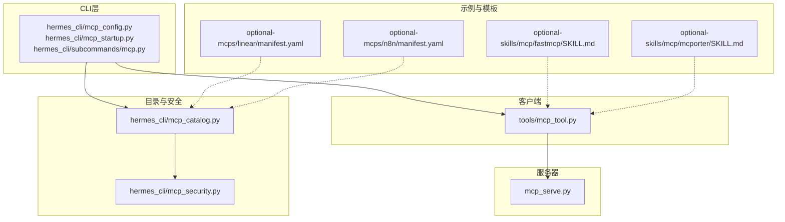
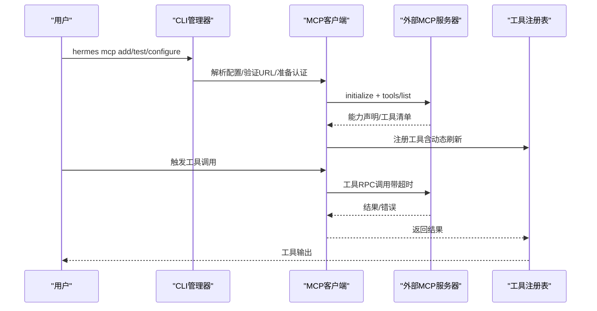
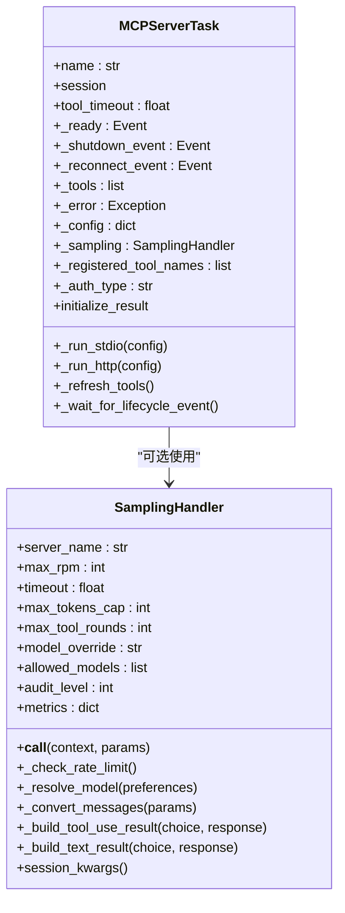
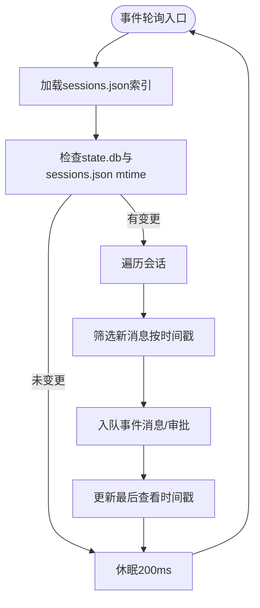
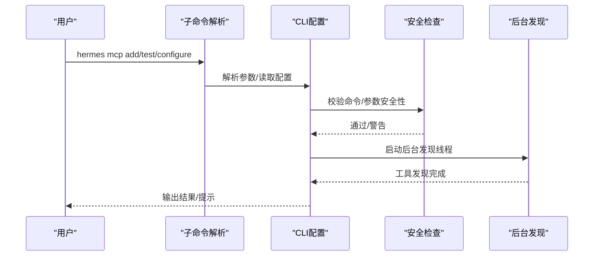
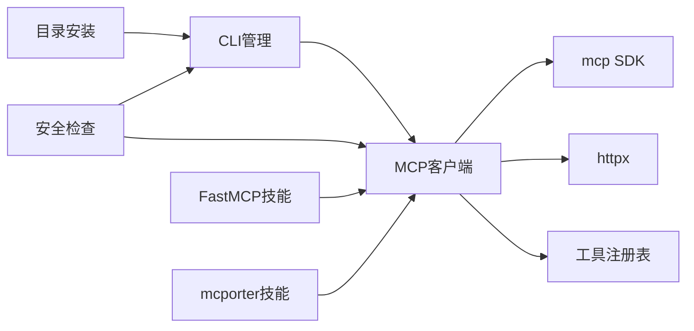

# MCP协议

<cite>
**本文档引用的文件**
- [mcp_serve.py](file://mcp_serve.py)
- [mcp_tool.py](file://tools/mcp_tool.py)
- [mcp_config.py](file://hermes_cli/mcp_config.py)
- [mcp_startup.py](file://hermes_cli/mcp_startup.py)
- [mcp_security.py](file://hermes_cli/mcp_security.py)
- [mcp_catalog.py](file://hermes_cli/mcp_catalog.py)
- [subcommands/mcp.py](file://hermes_cli/subcommands/mcp.py)
- [optional-mcps/linear/manifest.yaml](file://optional-mcps/linear/manifest.yaml)
- [optional-mcps/n8n/manifest.yaml](file://optional-mcps/n8n/manifest.yaml)
- [optional-skills/mcp/fastmcp/SKILL.md](file://optional-skills/mcp/fastmcp/SKILL.md)
- [optional-skills/mcp/mcporter/SKILL.md](file://optional-skills/mcp/mcporter/SKILL.md)
- [README.md](file://README.md)
- [SECURITY.md](file://SECURITY.md)
</cite>

## 目录
1. [简介](#简介)
2. [项目结构](#项目结构)
3. [核心组件](#核心组件)
4. [架构总览](#架构总览)
5. [详细组件分析](#详细组件分析)
6. [依赖关系分析](#依赖关系分析)
7. [性能考量](#性能考量)
8. [故障排除指南](#故障排除指南)
9. [结论](#结论)
10. [附录](#附录)

## 简介
本文件系统性梳理并记录了MCP（Model Context Protocol）在本仓库中的规范与实现，涵盖以下方面：
- 能力声明：工具清单、资源与提示词的声明与动态更新
- 工具调用：参数模式、输入校验、并发控制与错误处理
- 状态管理：会话生命周期、重连策略、保活与动态工具刷新
- 服务器启动与配置：端点地址、认证机制、协议版本协商
- 工具发现与注册：静态与动态工具发现、工具过滤与选择
- 消息格式规范：请求/响应结构、错误码定义与超时处理
- 客户端集成指南：连接建立、能力查询与工具调用示例
- 插件API扩展：自定义工具开发与能力声明
- 协议特定安全考虑、性能优化与故障排除

## 项目结构
围绕MCP的关键模块分布如下：
- 服务器侧：内置MCP服务器实现，用于将会话与消息桥接到MCP工具集
- 客户端侧：MCP客户端支持，负责连接外部MCP服务器、发现工具、注册到工具注册表
- CLI管理：MCP服务器的添加、测试、登录、配置与目录安装
- 安全与验证：命令与参数安全检查、URL有效性验证、凭据清洗
- 扩展与模板：FastMCP与mcporter技能，提供快速构建与调试MCP服务器的能力

**图表来源**
- [mcp_config.py:1-200](file://hermes_cli/mcp_config.py#L1-L200)
- [mcp_startup.py:1-60](file://hermes_cli/mcp_startup.py#L1-L60)
- [mcp_tool.py:1-200](file://tools/mcp_tool.py#L1-L200)
- [mcp_serve.py:1-120](file://mcp_serve.py#L1-L120)
- [mcp_catalog.py:1-120](file://hermes_cli/mcp_catalog.py#L1-L120)
- [mcp_security.py:1-97](file://hermes_cli/mcp_security.py#L1-L97)
- [optional-mcps/linear/manifest.yaml:1-39](file://optional-mcps/linear/manifest.yaml#L1-L39)
- [optional-mcps/n8n/manifest.yaml:1-78](file://optional-mcps/n8n/manifest.yaml#L1-L78)
- [optional-skills/mcp/fastmcp/SKILL.md:1-120](file://optional-skills/mcp/fastmcp/SKILL.md#L1-L120)
- [optional-skills/mcp/mcporter/SKILL.md:1-124](file://optional-skills/mcp/mcporter/SKILL.md#L1-L124)

**章节来源**
- [mcp_config.py:1-200](file://hermes_cli/mcp_config.py#L1-L200)
- [mcp_startup.py:1-60](file://hermes_cli/mcp_startup.py#L1-L60)
- [mcp_tool.py:1-200](file://tools/mcp_tool.py#L1-L200)
- [mcp_serve.py:1-120](file://mcp_serve.py#L1-L120)
- [mcp_catalog.py:1-120](file://hermes_cli/mcp_catalog.py#L1-L120)
- [mcp_security.py:1-97](file://hermes_cli/mcp_security.py#L1-L97)

## 核心组件
- MCP客户端（tools/mcp_tool.py）
  - 支持stdio、HTTP/StreamableHTTP、SSE三种传输
  - 自动重连与指数退避、线程安全的后台事件循环
  - 动态工具发现与通知、采样回调（server-initiated LLM请求）
  - 凭据清洗、环境变量过滤、URL有效性与证书校验
- 内置MCP服务器（mcp_serve.py）
  - 将会话数据库与通道目录暴露为MCP工具集合
  - 提供对话列表、获取、消息读取、附件提取、事件轮询/等待、消息发送等工具
  - 基于SQLite的事件桥接与内存队列，支持长轮询
- CLI管理（hermes_cli/mcp_config.py、mcp_startup.py、subcommands/mcp.py）
  - 添加/移除/列出/测试MCP服务器
  - 登录（OAuth）与认证配置
  - 后台工具发现与延迟加载
- 目录与安全（mcp_catalog.py、mcp_security.py）
  - Nous批准的MCP目录项安装与工具选择
  - 命令行与参数安全检查，阻断高风险执行模式
- 示例与模板（optional-mcps、optional-skills）
  - Linear与n8n的目录条目
  - FastMCP与mcporter技能，提供构建、测试与部署MCP服务器的完整工作流

**章节来源**
- [mcp_tool.py:1-200](file://tools/mcp_tool.py#L1-L200)
- [mcp_serve.py:449-800](file://mcp_serve.py#L449-L800)
- [mcp_config.py:297-500](file://hermes_cli/mcp_config.py#L297-L500)
- [mcp_startup.py:26-60](file://hermes_cli/mcp_startup.py#L26-L60)
- [mcp_catalog.py:669-755](file://hermes_cli/mcp_catalog.py#L669-L755)
- [mcp_security.py:64-97](file://hermes_cli/mcp_security.py#L64-L97)

## 架构总览
MCP在本项目中采用“客户端-服务器”双端协同：
- 客户端负责连接外部MCP服务器，动态发现工具并注册到统一工具注册表，支持并发控制与采样回调
- 服务器负责将本地会话与消息桥接为MCP工具，供其他MCP客户端使用
- CLI贯穿配置、认证、目录安装与后台发现，确保用户以最小成本接入MCP生态

**图表来源**
- [mcp_config.py:297-500](file://hermes_cli/mcp_config.py#L297-L500)
- [mcp_tool.py:1144-1599](file://tools/mcp_tool.py#L1144-L1599)
- [mcp_startup.py:26-60](file://hermes_cli/mcp_startup.py#L26-L60)

**章节来源**
- [mcp_config.py:297-500](file://hermes_cli/mcp_config.py#L297-L500)
- [mcp_tool.py:1144-1599](file://tools/mcp_tool.py#L1144-L1599)
- [mcp_startup.py:26-60](file://hermes_cli/mcp_startup.py#L26-L60)

## 详细组件分析

### MCP客户端（tools/mcp_tool.py）
- 传输与连接
  - 支持stdio（命令+参数）、HTTP/StreamableHTTP、SSE
  - 自动重连（最多5次，指数退避，最大60秒）
  - 保活：每3分钟对具备tools能力的服务器执行list_tools，否则发送ping
- 动态工具发现
  - 通过notification/tools/list_changed触发后台刷新
  - 刷新期间序列化RPC调用，避免stdion JSON-RPC流死锁
- 采样回调（server-initiated LLM请求）
  - 支持SamplingCapability与SamplingToolsCapability
  - 速率限制（滑动窗口1分钟），模型白名单与令牌上限
  - 将MCP消息转换为OpenAI格式，支持文本与工具调用混合
- 安全与健壮性
  - 环境变量过滤（仅允许安全键与显式指定变量）
  - 凭据清洗（正则替换常见密钥/令牌模式）
  - URL有效性验证（http/https，主机名非空）
  - 子进程stderr重定向至共享日志文件，避免TUI污染
- 错误处理与可观测性
  - 统一异常扁平化与可读化
  - 计数器与指标（请求数、错误数、令牌用量、工具调用次数）

**图表来源**
- [mcp_tool.py:1144-1599](file://tools/mcp_tool.py#L1144-L1599)
- [mcp_tool.py:777-1142](file://tools/mcp_tool.py#L777-L1142)

**章节来源**
- [mcp_tool.py:1-200](file://tools/mcp_tool.py#L1-L200)
- [mcp_tool.py:777-1142](file://tools/mcp_tool.py#L777-L1142)
- [mcp_tool.py:1144-1599](file://tools/mcp_tool.py#L1144-L1599)

### 内置MCP服务器（mcp_serve.py）
- 工具集概览
  - conversations_list：按平台/名称/时间过滤对话
  - conversation_get：获取单个对话详情
  - messages_read：读取最近消息（支持限制数量）
  - attachments_fetch：提取消息中的非文本附件
  - events_poll/events_wait：基于游标的事件轮询/长轮询
  - messages_send：向目标平台发送消息
  - channels_list：列出可用通道（用于messages_send的目标构造）
- 事件桥接
  - 基于SQLite会话数据库与sessions.json索引的轮询
  - 内存队列与游标管理，支持限流与超时
  - 事件类型：message、approval_requested、approval_resolved
- 参数与返回
  - 对外JSON结构遵循工具约定，包含计数、列表与数据块
  - 输入参数进行边界与类型强制（如limit、cursor、timeout）

**图表来源**
- [mcp_serve.py:332-444](file://mcp_serve.py#L332-L444)

**章节来源**
- [mcp_serve.py:449-800](file://mcp_serve.py#L449-L800)

### CLI管理（hermes_cli/mcp_config.py、mcp_startup.py、subcommands/mcp.py）
- hermes mcp add
  - 支持URL（HTTP/SSE）、命令（stdio）与预设
  - OAuth与Header认证配置，环境变量注入
  - 临时连接探测工具清单，交互式工具选择
- hermes mcp test
  - 展示传输与认证信息，连接耗时与工具数量
- hermes mcp login
  - 强制重新OAuth认证，清理缓存后触发浏览器流程
- hermes mcp configure
  - 重新探测工具并交互式切换启用/禁用
- 后台发现
  - 启动时检测配置，后台线程执行工具发现，首快照前短暂等待

**图表来源**
- [subcommands/mcp.py:15-109](file://hermes_cli/subcommands/mcp.py#L15-L109)
- [mcp_config.py:297-500](file://hermes_cli/mcp_config.py#L297-L500)
- [mcp_startup.py:26-60](file://hermes_cli/mcp_startup.py#L26-L60)
- [mcp_security.py:64-97](file://hermes_cli/mcp_security.py#L64-L97)

**章节来源**
- [subcommands/mcp.py:15-109](file://hermes_cli/subcommands/mcp.py#L15-L109)
- [mcp_config.py:297-500](file://hermes_cli/mcp_config.py#L297-L500)
- [mcp_startup.py:26-60](file://hermes_cli/mcp_startup.py#L26-L60)
- [mcp_security.py:64-97](file://hermes_cli/mcp_security.py#L64-L97)

### 目录与安全（mcp_catalog.py、mcp_security.py）
- 目录（optional-mcps）
  - 线性（Linear）：远程HTTP服务器，原生OAuth 2.1
  - n8n：本地stdio服务器，需要git克隆与依赖安装
  - 安装流程：下载/克隆→引导脚本→凭证提示→生成mcp_servers配置→工具选择
- 安全
  - 命令与参数安全检查：阻断shell解释器+网络出站的组合
  - URL有效性：http/https、非空主机名
  - 凭据清洗：错误消息中隐藏密钥/令牌
  - 环境变量过滤：仅传递安全键与显式指定变量

**章节来源**
- [mcp_catalog.py:669-755](file://hermes_cli/mcp_catalog.py#L669-L755)
- [optional-mcps/linear/manifest.yaml:1-39](file://optional-mcps/linear/manifest.yaml#L1-L39)
- [optional-mcps/n8n/manifest.yaml:1-78](file://optional-mcps/n8n/manifest.yaml#L1-L78)
- [mcp_security.py:64-97](file://hermes_cli/mcp_security.py#L64-L97)

### 插件API与扩展（optional-skills）
- FastMCP技能
  - 提供模板（API包装器、数据库服务器、文件处理器）
  - CLI工作流：inspect/list/run/call/install/discover/deploy
  - 设计原则：工具命名、参数显式化、只读优先、早期输入校验
- mcporter技能
  - 直接管理与调用MCP服务器（HTTP或stdio）
  - OAuth登录、配置导入导出、守护进程与类型生成

**章节来源**
- [optional-skills/mcp/fastmcp/SKILL.md:1-301](file://optional-skills/mcp/fastmcp/SKILL.md#L1-L301)
- [optional-skills/mcp/mcporter/SKILL.md:1-124](file://optional-skills/mcp/mcporter/SKILL.md#L1-L124)

## 依赖关系分析
- 组件耦合
  - CLI与客户端：CLI负责配置与认证，客户端负责连接与工具注册
  - 客户端与服务器：客户端通过传输层连接外部服务器，内部通过工具注册表统一调度
  - 目录与安全：目录安装流程依赖安全检查与凭证存储
- 外部依赖
  - mcp Python SDK：提供ClientSession、stdio_client、streamable_http_client、sse_client等
  - httpx：用于HTTP预检与证书校验
  - fastmcp/mcporter：第三方工具链，用于本地开发与调试

**图表来源**
- [mcp_tool.py:184-236](file://tools/mcp_tool.py#L184-L236)
- [mcp_config.py:1-80](file://hermes_cli/mcp_config.py#L1-L80)
- [mcp_catalog.py:669-755](file://hermes_cli/mcp_catalog.py#L669-L755)
- [mcp_security.py:64-97](file://hermes_cli/mcp_security.py#L64-L97)

**章节来源**
- [mcp_tool.py:184-236](file://tools/mcp_tool.py#L184-L236)
- [mcp_config.py:1-80](file://hermes_cli/mcp_config.py#L1-L80)
- [mcp_catalog.py:669-755](file://hermes_cli/mcp_catalog.py#L669-L755)
- [mcp_security.py:64-97](file://hermes_cli/mcp_security.py#L64-L97)

## 性能考量
- 连接与重试
  - 最大重试次数与退避上限，避免无限占用资源
  - 保活周期短于典型LB/NAT空闲超时，减少连接失效
- 工具调用
  - 可配置工具调用超时与连接超时
  - 并行工具调用需显式开启（per-server supports_parallel_tool_calls）
- I/O与日志
  - stdio子进程stderr重定向至共享日志文件，避免TUI渲染干扰
  - 事件轮询间隔200ms，结合mtime缓存降低开销
- 采样回调
  - 速率限制与令牌上限，防止过载
  - 滑动窗口统计，兼顾突发与长期平均

[本节为通用指导，无需具体文件分析]

## 故障排除指南
- 连接失败
  - 检查命令是否在PATH（npx/uvx/node等）
  - 端口冲突或URL不可达；确认HTTP服务器可达
  - SDK不支持HTTP传输：升级mcp包
- 工具未出现
  - 确认配置位于mcp_servers而非错误键
  - YAML缩进正确；查看启动日志
  - 工具名前缀为mcp_{server}_{tool}
- 连接频繁断开
  - 客户端最多5次指数退避重连；若服务器不可达，最终放弃
  - 检查服务器进程与网络连通性
- OAuth问题
  - 清理缓存后重新触发浏览器流程
  - 某些提供商需手动创建OAuth客户端并写入配置

**章节来源**
- [README.md:139-213](file://README.md#L139-L213)
- [SECURITY.md:48-123](file://SECURITY.md#L48-L123)

## 结论
本项目提供了完整的MCP协议实现与生态支持：从客户端连接、动态工具发现与注册，到内置服务器桥接会话与消息，再到CLI管理、目录安装与安全加固，形成了一套可扩展、可观测且安全的MCP集成方案。通过FastMCP与mcporter技能，开发者可以高效地构建、测试与部署MCP服务器，并将其无缝接入Hermes Agent。

[本节为总结，无需具体文件分析]

## 附录

### 消息格式规范（工具调用）
- 请求结构
  - initialize：初始化握手，返回InitializeResult（capabilities）
  - tools/list：获取工具清单
  - tools/invoke：调用工具（携带参数schema）
  - notifications（可选）：tools/list_changed等
- 响应结构
  - 成功：工具返回JSON-safe数据
  - 错误：标准化错误对象（含code/message）
- 超时与重试
  - 工具调用超时可配置，默认300秒
  - 连接超时默认60秒，最大重试5次

**章节来源**
- [mcp_tool.py:1144-1599](file://tools/mcp_tool.py#L1144-L1599)

### 认证与协议版本
- 认证方式
  - Header（Authorization: Bearer ${VAR}）
  - OAuth 2.1（原生OAuth与第三方Provider）
- 协议版本
  - HTTP传输使用Streamable HTTP，协议版本回退至2025-03-26
  - SSE传输作为替代方案

**章节来源**
- [mcp_tool.py:184-204](file://tools/mcp_tool.py#L184-L204)
- [mcp_config.py:36-41](file://hermes_cli/mcp_config.py#L36-L41)

### 客户端集成步骤
- 添加服务器
  - hermes mcp add <name> --url <endpoint> 或 --command <cmd> --args <...>
  - 可选--auth oauth/header，可选--preset
- 测试连接
  - hermes mcp test <name>，查看工具数量与认证状态
- 登录（OAuth）
  - hermes mcp login <name>，清理缓存后触发浏览器流程
- 配置工具选择
  - hermes mcp configure <name>，交互式勾选启用工具
- 启动会话
  - 新建会话后工具可用

**章节来源**
- [subcommands/mcp.py:15-109](file://hermes_cli/subcommands/mcp.py#L15-L109)
- [mcp_config.py:297-500](file://hermes_cli/mcp_config.py#L297-L500)

### 插件API扩展（FastMCP）
- 模板与脚手架
  - API包装器、数据库服务器、文件处理器模板
  - scaffold_fastmcp.py一键生成
- 开发与部署
  - 使用fastmcp inspect/list/run/call进行本地验证
  - 支持HTTP部署与客户端安装

**章节来源**
- [optional-skills/mcp/fastmcp/SKILL.md:50-177](file://optional-skills/mcp/fastmcp/SKILL.md#L50-L177)