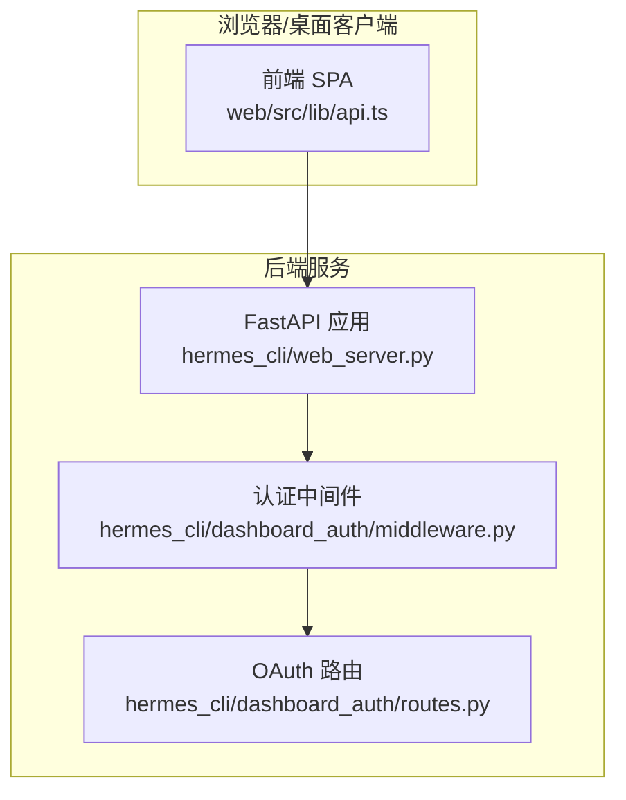
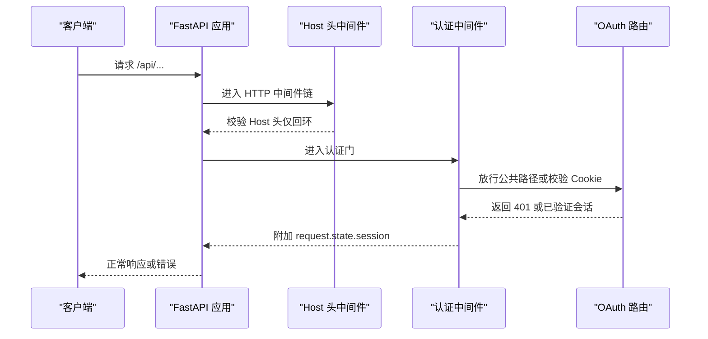
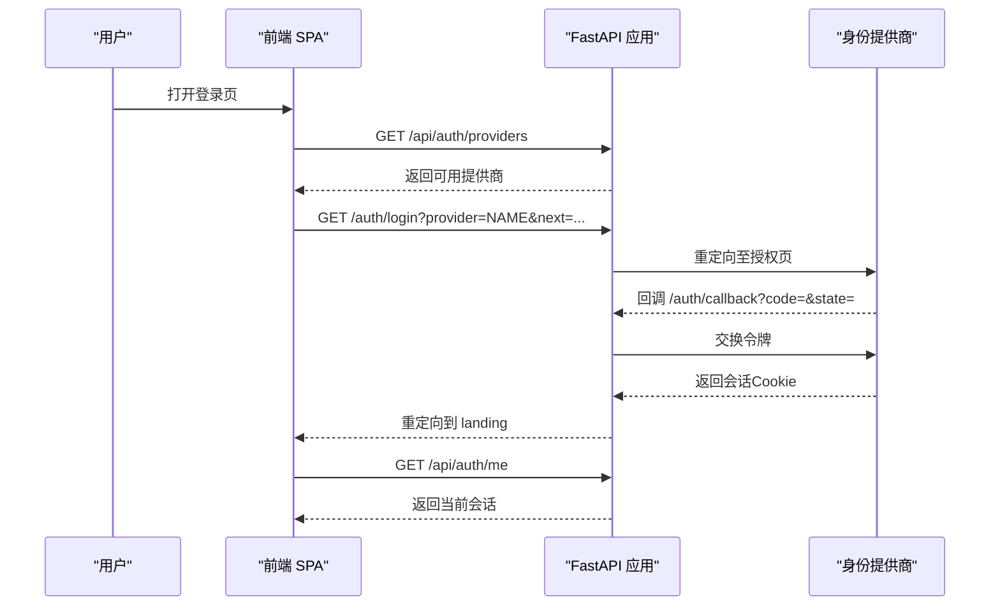
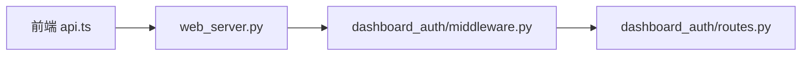

# REST API

<cite>
**本文引用的文件**
- [web_server.py](file://hermes_cli/web_server.py)
- [middleware.py](file://hermes_cli/dashboard_auth/middleware.py)
- [routes.py](file://hermes_cli/dashboard_auth/routes.py)
- [api.ts](file://web/src/lib/api.ts)
- [api-server.md](file://website/docs/user-guide/features/api-server.md)
- [web-dashboard.md](file://website/docs/user-guide/features/web-dashboard.md)
- [test_web_server_host_header.py](file://tests/hermes_cli/test_web_server_host_header.py)
- [test_dashboard_auth_ws_auth.py](file://tests/hermes_cli/test_dashboard_auth_ws_auth.py)
</cite>

## 目录
1. [简介](#简介)
2. [项目结构](#项目结构)
3. [核心组件](#核心组件)
4. [架构总览](#架构总览)
5. [详细组件分析](#详细组件分析)
6. [依赖分析](#依赖分析)
7. [性能考虑](#性能考虑)
8. [故障排查指南](#故障排查指南)
9. [结论](#结论)
10. [附录](#附录)

## 简介
本文件为 Hermes Agent 的 REST API 规范与使用说明，覆盖以下主题：
- 全部 HTTP 端点的 URL 模式、请求参数、响应格式与状态码
- 认证机制：会话 Cookie 验证、查询参数令牌、OAuth 登录流程
- 安全防护：CORS 限制、Host 头校验、DNS 重绑定防护、速率限制
- API 版本管理策略与错误处理
- 关键端点分组：配置管理、会话管理、平台配置、文件管理

## 项目结构
后端基于 FastAPI 提供 Web UI 与 REST API；认证由“网关中间件 + OAuth 路由”共同实现；前端通过 TypeScript/React 与后端交互。

图示来源
- [web_server.py:179-214](file://hermes_cli/web_server.py#L179-L214)
- [middleware.py:172-310](file://hermes_cli/dashboard_auth/middleware.py#L172-L310)
- [routes.py:51-622](file://hermes_cli/dashboard_auth/routes.py#L51-L622)

章节来源
- [web_server.py:179-214](file://hermes_cli/web_server.py#L179-L214)
- [middleware.py:1-369](file://hermes_cli/dashboard_auth/middleware.py#L1-L369)
- [routes.py:1-622](file://hermes_cli/dashboard_auth/routes.py#L1-L622)

## 核心组件
- 认证中间件：在非 loopback 绑定时启用，校验会话 Cookie 并附加已验证会话对象到请求上下文；loopback 模式下通过会话令牌头或查询参数进行授权。
- OAuth 路由：提供登录页、提供商列表、回调、登出、WS 票据等路由，支持密码登录与速率限制。
- 主机头中间件：防御 DNS 重绑定攻击，要求 Host 头与绑定接口一致。
- CORS 中间件：仅允许本地回环来源访问，避免跨站读取/修改配置与密钥。
- 会话与文件管理：统一由 /api/sessions 与 /api/files 下的端点提供。

章节来源
- [web_server.py:234-295](file://hermes_cli/web_server.py#L234-L295)
- [web_server.py:368-395](file://hermes_cli/web_server.py#L368-L395)
- [middleware.py:172-310](file://hermes_cli/dashboard_auth/middleware.py#L172-L310)
- [routes.py:130-533](file://hermes_cli/dashboard_auth/routes.py#L130-L533)

## 架构总览
下图展示认证与安全控制的关键路径：

图示来源
- [web_server.py:368-395](file://hermes_cli/web_server.py#L368-L395)
- [middleware.py:172-310](file://hermes_cli/dashboard_auth/middleware.py#L172-L310)
- [routes.py:130-533](file://hermes_cli/dashboard_auth/routes.py#L130-L533)

## 详细组件分析

### 认证与安全
- 会话令牌验证
  - 会话令牌头：X-Hermes-Session-Token（推荐）或 Authorization: Bearer <token>
  - 查询参数令牌：仅限特定端点（如 /api/files/download），用于下载链接
  - 令牌比较采用恒等时间比较，防止时序攻击
- OAuth 流程
  - 列出提供商：GET /api/auth/providers
  - 发起登录：GET /auth/login?provider=NAME&next=...
  - 回调完成：GET /auth/callback?code=&state=
  - 密码登录：POST /auth/password-login（带速率限制）
  - 获取 WS 票据：POST /api/auth/ws-ticket（单次、短 TTL）
  - 登出：POST /auth/logout
- Host 头校验
  - 仅接受与绑定接口一致的 Host 值；回环绑定接受回环别名；0.0.0.0 绑定视为不保护
- CORS 限制
  - 仅允许 http(s)://localhost(:port) 或 http(s)://127.0.0.1(:port) 来源
- 速率限制
  - 环境变量“揭示”端点：每 30 秒最多 5 次
  - 密码登录：每 IP 每分钟最多 10 次
- 错误处理
  - 401 Unauthorized：未认证或会话过期
  - 403 Forbidden：权限不足
  - 404 Not Found：资源不存在
  - 413 Payload Too Large：文件过大
  - 429 Too Many Requests：触发速率限制
  - 400/500：参数错误或内部错误

章节来源
- [web_server.py:234-295](file://hermes_cli/web_server.py#L234-L295)
- [web_server.py:200-204](file://hermes_cli/web_server.py#L200-L204)
- [web_server.py:368-395](file://hermes_cli/web_server.py#L368-L395)
- [routes.py:150-533](file://hermes_cli/dashboard_auth/routes.py#L150-L533)
- [middleware.py:172-310](file://hermes_cli/dashboard_auth/middleware.py#L172-L310)

### 配置管理端点（/api/config、/api/env）
- GET /api/config
  - 功能：读取运行时配置
  - 响应：配置对象
  - 状态码：200 成功；500 内部错误
- PUT /api/config
  - 请求体：{ config: Record<string, unknown> }
  - 响应：{ ok: boolean }
  - 状态码：200 成功；400 参数无效；500 内部错误
- GET /api/config/raw
  - 功能：读取原始 YAML 配置文本
  - 响应：{ yaml: string, path?: string }
  - 状态码：200 成功；500 内部错误
- PUT /api/config/raw
  - 请求体：{ yaml_text: string }
  - 响应：{ ok: boolean }
  - 状态码：200 成功；400 参数无效；500 内部错误
- GET /api/env
  - 功能：读取环境变量（敏感值已脱敏）
  - 响应：Record<string, EnvVarInfo>
  - 状态码：200 成功；500 内部错误
- PUT /api/env
  - 请求体：{ key: string, value: string, profile?: string }
  - 响应：{ ok: boolean }
  - 状态码：200 成功；400 键名非法；500 内部错误
- DELETE /api/env
  - 请求体：{ key: string, profile?: string }
  - 响应：{ ok: boolean, key: string }
  - 状态码：200 成功；404 不存在；400 键名非法；500 内部错误
- POST /api/env/reveal
  - 请求体：{ key: string, profile?: string }
  - 响应：{ key: string, value: string }
  - 状态码：200 成功；401 未认证；404 不存在；429 速率超限；500 内部错误
  - 安全：需要会话令牌或 Cookie；每 30 秒最多 5 次

章节来源
- [web_server.py:3815-3877](file://hermes_cli/web_server.py#L3815-L3877)
- [api.ts:460-491](file://web/src/lib/api.ts#L460-L491)

### 会话管理端点（/api/sessions、/api/status）
- GET /api/sessions
  - 查询参数：limit, offset, min_messages, archived(exclude|only|include), order(created|recent), source, exclude_sources, profile
  - 响应：{ sessions: Array, total: number, limit, offset }
  - 状态码：200 成功；400 参数无效；500 内部错误
- GET /api/profiles/sessions
  - 查询参数：limit, offset, min_messages, archived, order, profile(all|name), source, exclude_sources
  - 响应：{ sessions: Array, total: number, profile_totals: Record<string,int>, limit, offset }
  - 状态码：200 成功；400 参数无效；500 内部错误
- 其他会话相关端点（来自文档）
  - POST /api/sessions：创建空会话
  - GET /api/sessions/{id}：读取会话元数据
  - PATCH /api/sessions/{id}：更新标题或结束原因
  - DELETE /api/sessions/{id}：删除会话
  - GET /api/sessions/{id}/messages：会话消息历史
  - POST /api/sessions/{id}/fork：分支会话
  - POST /api/sessions/{id}/chat：同步一次对话回合
  - POST /api/sessions/{id}/chat/stream：SSE 流式对话事件
  - 认证：需 API_SERVER_KEY（Authorization: Bearer KEY）

章节来源
- [web_server.py:2700-2783](file://hermes_cli/web_server.py#L2700-L2783)
- [web_server.py:2786-2900](file://hermes_cli/web_server.py#L2786-L2900)
- [api-server.md:315-343](file://website/docs/user-guide/features/api-server.md#L315-L343)

### 平台配置端点（/api/messaging/platforms、/api/messaging/telegram）
- GET /api/messaging/platforms
  - 功能：列出每个消息通道的状态与配置字段
  - 响应：平台列表（含状态与设置字段）
  - 状态码：200 成功；500 内部错误
- PUT /api/messaging/platforms/{id}
  - 请求体：{ enabled?: boolean, env?: Record<string,string>, clear_env?: boolean, profile?: string }
  - 响应：操作结果
  - 状态码：200 成功；400 参数无效；500 内部错误
- POST /api/messaging/platforms/{id}/test
  - 功能：检测通道是否已配置、启用且可连接
  - 响应：测试结果
  - 状态码：200 成功；500 内部错误
- Telegram 开屏流程
  - POST /api/messaging/telegram/onboarding/start：启动开屏，返回配对信息
  - GET /api/messaging/telegram/onboarding/{pairing_id}：轮询状态
  - POST /api/messaging/telegram/onboarding/{pairing_id}/apply：应用配对，写入配置并重启网关
  - POST /api/messaging/telegram/onboarding/{pairing_id}/cancel：取消配对
  - 安全：配对会话有有效期，用户 ID 必须为纯数字

章节来源
- [web-dashboard.md:511-554](file://website/docs/user-guide/features/web-dashboard.md#L511-L554)
- [api.ts:779-817](file://web/src/lib/api.ts#L779-L817)
- [web_server.py:4719-4858](file://hermes_cli/web_server.py#L4719-L4858)

### 文件管理端点（/api/files、/api/fs）
- GET /api/files
  - 查询参数：path?
  - 响应：目录条目列表
  - 状态码：200 成功；400/403/404/500 错误
- GET /api/files/read
  - 查询参数：path
  - 响应：文件元数据与 dataURL
  - 状态码：200 成功；400/403/404/500 错误
- GET /api/files/download
  - 查询参数：path
  - 响应：文件附件下载（支持查询参数令牌）
  - 状态码：200 成功；400/403/404/500 错误
- POST /api/files/upload
  - 请求体：{ path: string, data_url: string, overwrite?: boolean }
  - 响应：{ ok: boolean, entry, path }
  - 状态码：200 成功；400/403/409/413/500 错误
- POST /api/files/mkdir
  - 请求体：{ path: string }
  - 响应：{ ok: boolean, entry, path }
  - 状态码：200 成功；400/403/500 错误
- DELETE /api/files
  - 请求体：{ path: string, recursive?: boolean }
  - 响应：{ ok: boolean, path }
  - 状态码：200 成功；400/403/404/409/500 错误
- GET /api/fs/list
  - 查询参数：path
  - 响应：目录条目数组或错误码
  - 状态码：200 成功；403/404/500 错误
- GET /api/fs/read-text
  - 查询参数：path
  - 响应：文本预览、MIME、语言等
  - 状态码：200 成功；400/403/413 错误
- GET /api/fs/read-data-url
  - 查询参数：path
  - 响应：dataURL
  - 状态码：200 成功；400/403/413 错误

章节来源
- [web_server.py:1369-1596](file://hermes_cli/web_server.py#L1369-L1596)

### 认证流程（OAuth）

图示来源
- [routes.py:150-533](file://hermes_cli/dashboard_auth/routes.py#L150-L533)
- [middleware.py:172-310](file://hermes_cli/dashboard_auth/middleware.py#L172-L310)

## 依赖分析
- 组件耦合
  - web_server.py 作为应用入口，挂载 CORS、Host 头中间件与认证中间件
  - 认证中间件依赖 OAuth 路由模块以解析会话与刷新令牌
  - 前端 api.ts 通过固定路径调用后端端点，遵循后端约定的请求/响应结构
- 外部依赖
  - FastAPI/CORSMiddleware、WebSocket 升级、静态文件
  - 反向代理场景下的 X-Forwarded-* 头处理（由路由层负责）

图示来源
- [web_server.py:179-214](file://hermes_cli/web_server.py#L179-L214)
- [middleware.py:172-310](file://hermes_cli/dashboard_auth/middleware.py#L172-L310)
- [routes.py:51-622](file://hermes_cli/dashboard_auth/routes.py#L51-L622)

章节来源
- [web_server.py:179-214](file://hermes_cli/web_server.py#L179-L214)
- [middleware.py:172-310](file://hermes_cli/dashboard_auth/middleware.py#L172-L310)
- [routes.py:51-622](file://hermes_cli/dashboard_auth/routes.py#L51-L622)

## 性能考虑
- 会话列表聚合：/api/profiles/sessions 对多个 profile 的数据库直接只读扫描，避免频繁启动后端进程
- 分页与排序：按最近活跃或创建时间排序，减少一次性传输量
- 文件读写：受最大大小限制，上传前解码与校验，避免内存膨胀
- 速率限制：针对高风险端点（揭示、密码登录）实施窗口计数限流

## 故障排查指南
- Host 头错误
  - 现象：400 Invalid Host header
  - 原因：Host 不匹配绑定接口；0.0.0.0 绑定不执行该检查
  - 排查：确认服务绑定地址与请求 Host 是否一致
- 401 未认证
  - 现象：API 返回 401 JSON 或 HTML 重定向
  - 原因：缺少有效 Cookie 或会话令牌；或认证门处于开启状态但未通过
  - 排查：检查 Cookie 是否随请求发送；确认 /api/auth/me 能正常返回；必要时重新登录
- CORS 拦截
  - 现象：浏览器报跨域错误
  - 原因：来源不在允许列表（仅回环）
  - 排查：确保从本地回环发起请求
- 速率限制触发
  - 现象：429 Too Many Requests
  - 原因：揭示端点或密码登录超出阈值
  - 排查：等待窗口结束或降低请求频率
- 文件操作失败
  - 现象：403/404/409/413/500
  - 原因：路径越权、目标不存在、目录冲突、文件过大、权限不足
  - 排查：检查路径合法性、目标是否存在、是否具有写权限

章节来源
- [test_web_server_host_header.py:22-126](file://tests/hermes_cli/test_web_server_host_header.py#L22-L126)
- [test_dashboard_auth_ws_auth.py:377-478](file://tests/hermes_cli/test_dashboard_auth_ws_auth.py#L377-L478)
- [web_server.py:368-395](file://hermes_cli/web_server.py#L368-L395)
- [routes.py:409-533](file://hermes_cli/dashboard_auth/routes.py#L409-L533)

## 结论
本 REST API 在本地回环场景下提供安全、可控的配置与会话管理能力，并通过严格的认证与安全中间件保障系统稳定与数据安全。建议：
- 生产部署优先使用 OAuth 模式并限制绑定接口
- 使用查询参数令牌仅限于受控下载场景
- 合理配置反向代理与网络边界，避免暴露回环服务
- 对高风险端点持续监控速率限制与审计日志

## 附录

### 端点一览与示例

- 配置管理
  - GET /api/config → 200 { ... }
  - PUT /api/config → 200 { ok: boolean }
  - GET /api/config/raw → 200 { yaml, path? }
  - PUT /api/config/raw → 200 { ok: boolean }
  - GET /api/env → 200 { [key]: EnvVarInfo }
  - PUT /api/env → 200 { ok: boolean }
  - DELETE /api/env → 200 { ok: boolean, key }
  - POST /api/env/reveal → 200 { key, value }; 429 若超限

- 会话管理
  - GET /api/sessions?limit=20&offset=0 → 200 { sessions, total, limit, offset }
  - GET /api/profiles/sessions → 200 { sessions, total, profile_totals, limit, offset }
  - 文档补充：POST /api/sessions, GET /api/sessions/{id}, PATCH /api/sessions/{id}, DELETE /api/sessions/{id}, GET /api/sessions/{id}/messages, POST /api/sessions/{id}/fork, POST /api/sessions/{id}/chat, POST /api/sessions/{id}/chat/stream（需 API_SERVER_KEY）

- 平台配置
  - GET /api/messaging/platforms → 200 平台列表
  - PUT /api/messaging/platforms/{id} → 200
  - POST /api/messaging/platforms/{id}/test → 200
  - Telegram 开屏：POST /api/messaging/telegram/onboarding/start → 200；GET /api/messaging/telegram/onboarding/{pairing_id} → 200/404；POST /api/messaging/telegram/onboarding/{pairing_id}/apply → 200/400/500

- 文件管理
  - GET /api/files → 200 目录列表
  - GET /api/files/read → 200 文件dataURL
  - GET /api/files/download?token=... → 200 下载
  - POST /api/files/upload → 200
  - POST /api/files/mkdir → 200
  - DELETE /api/files → 200
  - GET /api/fs/list → 200
  - GET /api/fs/read-text → 200
  - GET /api/fs/read-data-url → 200

- 认证与安全
  - GET /api/auth/providers → 200
  - GET /auth/login → 302
  - GET /auth/callback → 302
  - POST /auth/password-login → 200 JSON 或 401/429/503
  - POST /api/auth/ws-ticket → 200 { ticket, ttl_seconds }
  - POST /auth/logout → 302

章节来源
- [web_server.py:1369-1596](file://hermes_cli/web_server.py#L1369-L1596)
- [web_server.py:2700-2900](file://hermes_cli/web_server.py#L2700-L2900)
- [web_server.py:3815-3877](file://hermes_cli/web_server.py#L3815-L3877)
- [routes.py:150-533](file://hermes_cli/dashboard_auth/routes.py#L150-L533)
- [api-server.md:315-343](file://website/docs/user-guide/features/api-server.md#L315-L343)
- [web-dashboard.md:511-554](file://website/docs/user-guide/features/web-dashboard.md#L511-L554)