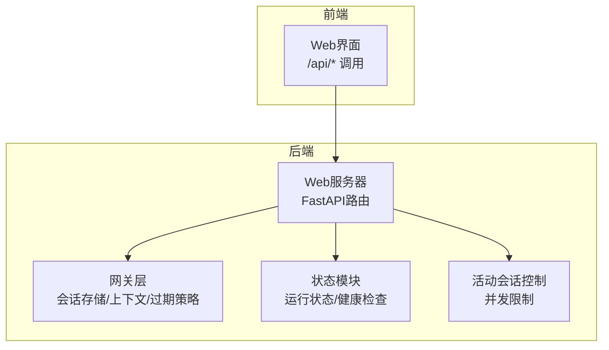
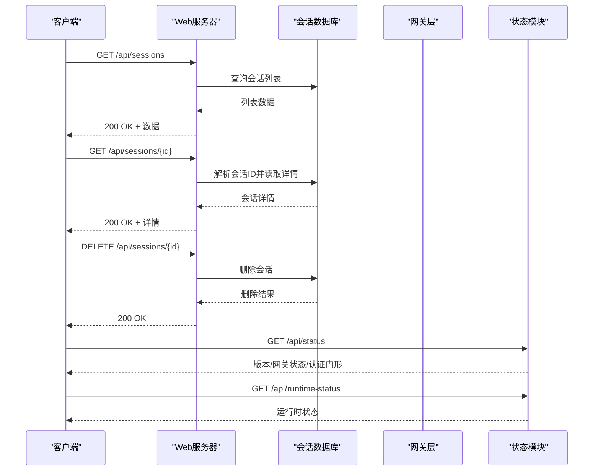
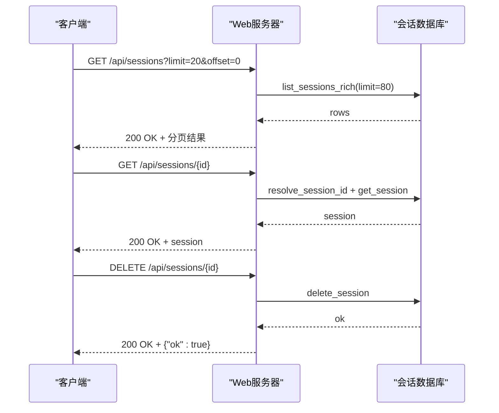
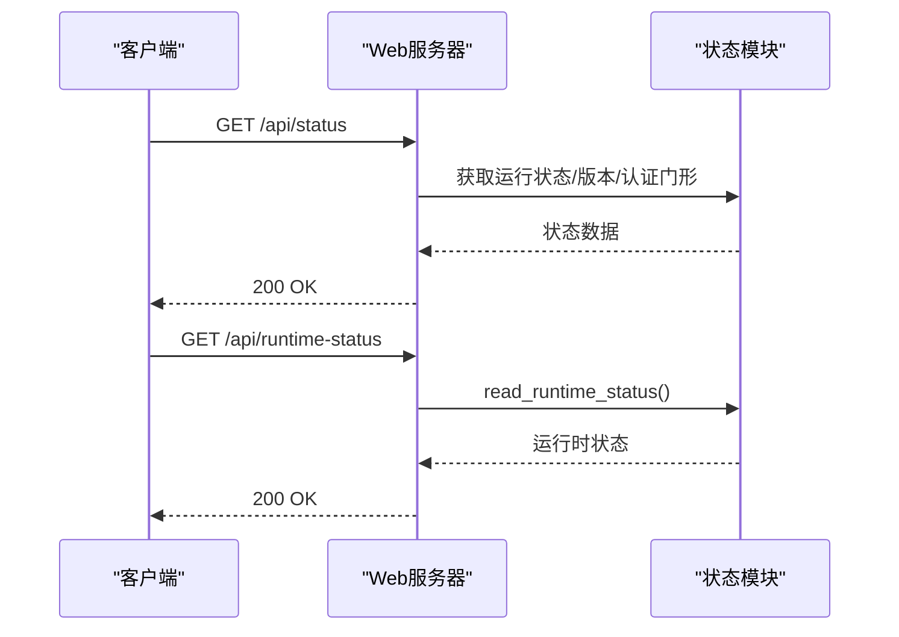
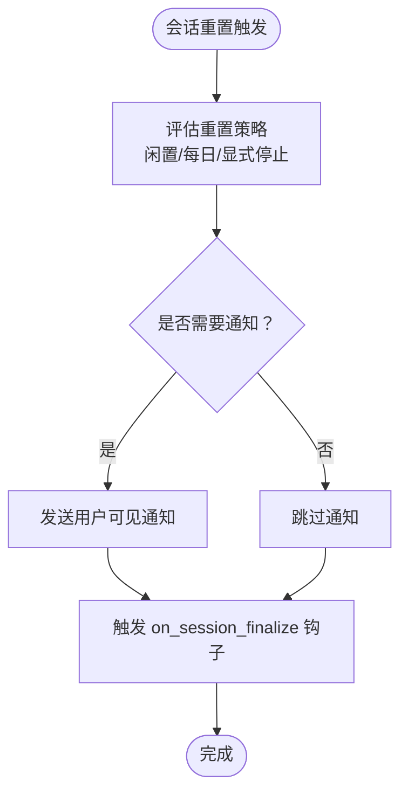
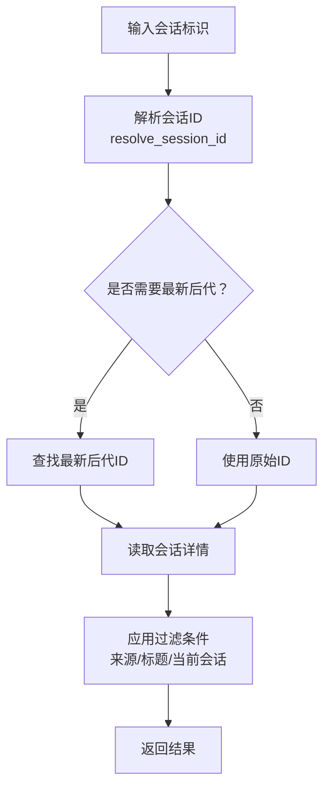
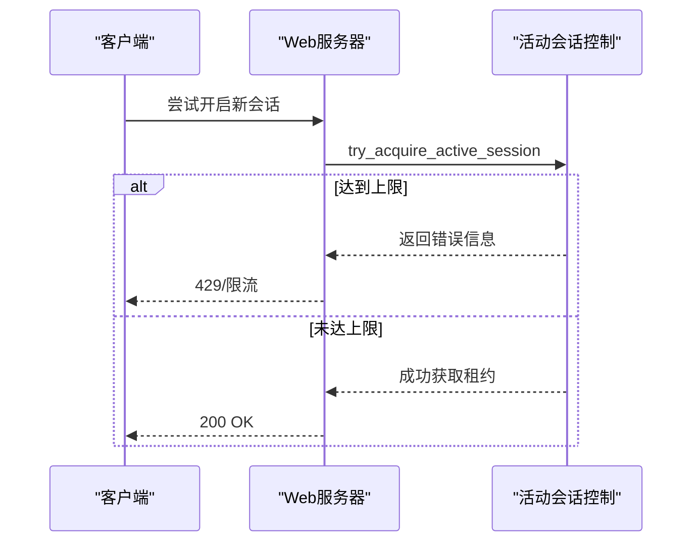
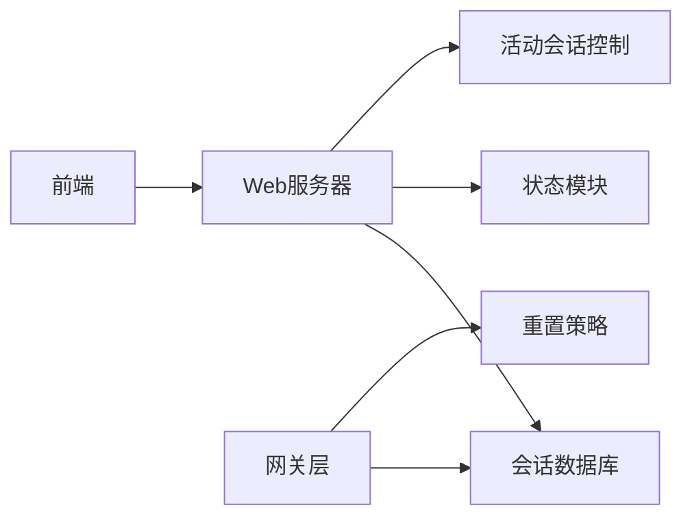

# 会话管理

<cite>
**本文档引用的文件**
- [hermes_cli/web_server.py](file://hermes_cli/web_server.py)
- [gateway/session.py](file://gateway/session.py)
- [gateway/status.py](file://gateway/status.py)
- [hermes_cli/active_sessions.py](file://hermes_cli/active_sessions.py)
- [hermes_cli/session_listing.py](file://hermes_cli/session_listing.py)
- [hermes_cli/session_recap.py](file://hermes_cli/session_recap.py)
- [web/src/lib/api.ts](file://web/src/lib/api.ts)
- [gateway/run.py](file://gateway/run.py)
- [gateway/slash_commands.py](file://gateway/slash_commands.py)
- [hermes_cli/dashboard_auth/public_paths.py](file://hermes_cli/dashboard_auth/public_paths.py)
</cite>

## 目录
1. [简介](#简介)
2. [项目结构](#项目结构)
3. [核心组件](#核心组件)
4. [架构总览](#架构总览)
5. [详细组件分析](#详细组件分析)
6. [依赖关系分析](#依赖关系分析)
7. [性能考虑](#性能考虑)
8. [故障排除指南](#故障排除指南)
9. [结论](#结论)

## 简介
本文件为会话管理API的技术文档，覆盖以下主题：
- 会话生命周期管理端点：列出会话、获取会话详情、删除会话
- 会话状态查询端点：运行状态与运行时状态
- 会话边界钩子、会话重置通知与会话存储清理机制
- 会话ID解析、元数据过滤与会话信息检索
- 会话超时处理与并发访问控制

该文档面向开发者与集成者，既提供接口规范，也解释实现细节与行为契约。

## 项目结构
会话管理功能由后端Web服务器（FastAPI）与网关层共同实现：
- Web服务器提供REST API端点，负责会话列表、详情、删除、批量删除、统计等
- 网关层负责会话键生成、上下文构建、过期策略、边界钩子与重置通知
- 运行状态与健康检查由状态模块提供
- 并发访问通过“活动会话租约”进行限制

图表来源
- [hermes_cli/web_server.py](file://hermes_cli/web_server.py)
- [gateway/session.py](file://gateway/session.py)
- [gateway/status.py](file://gateway/status.py)
- [hermes_cli/active_sessions.py](file://hermes_cli/active_sessions.py)

章节来源
- [hermes_cli/web_server.py](file://hermes_cli/web_server.py)
- [gateway/session.py](file://gateway/session.py)
- [gateway/status.py](file://gateway/status.py)
- [hermes_cli/active_sessions.py](file://hermes_cli/active_sessions.py)

## 核心组件
- Web服务器路由：提供会话管理与状态查询端点
- 网关会话存储：负责会话键生成、上下文注入、过期策略与边界钩子
- 状态模块：提供运行状态与运行时状态读取
- 活动会话控制：限制并发会话数量，避免资源争用
- 会话清单与摘要：支持会话筛选、排序与快速回顾

章节来源
- [hermes_cli/web_server.py](file://hermes_cli/web_server.py)
- [gateway/session.py](file://gateway/session.py)
- [gateway/status.py](file://gateway/status.py)
- [hermes_cli/active_sessions.py](file://hermes_cli/active_sessions.py)
- [hermes_cli/session_listing.py](file://hermes_cli/session_listing.py)
- [hermes_cli/session_recap.py](file://hermes_cli/session_recap.py)

## 架构总览
会话管理涉及多层协作：
- 前端通过HTTP调用后端API
- 后端路由解析请求，打开会话数据库或状态文件，执行业务逻辑
- 网关层在需要时参与会话键解析、上下文构建与过期判断
- 并发控制通过活动会话租约文件锁实现

图表来源
- [hermes_cli/web_server.py](file://hermes_cli/web_server.py)
- [gateway/status.py](file://gateway/status.py)

章节来源
- [hermes_cli/web_server.py](file://hermes_cli/web_server.py)
- [gateway/status.py](file://gateway/status.py)

## 详细组件分析

### 会话生命周期管理端点
- GET /api/sessions
  - 功能：分页获取会话列表
  - 参数：limit（默认20）、offset（默认0）、profile（可选）
  - 行为：基于会话数据库的rich查询，支持按来源过滤与排除当前会话
  - 返回：分页对象，包含会话条目
  - 安全：受公共路径白名单保护，无需登录即可访问
- GET /api/sessions/{id}
  - 功能：获取指定会话的完整元数据
  - 行为：解析会话ID，读取会话记录；支持跨配置文件读取
  - 返回：会话对象（含profile字段时附加配置文件名）
- DELETE /api/sessions/{id}
  - 功能：删除指定会话
  - 行为：解析会话ID并删除；不传递sessions_dir参数，磁盘清理在下一次裁剪时进行
  - 返回：{"ok": true}
- POST /api/sessions/bulk-delete
  - 功能：批量删除多个会话（单事务）
  - 行为：最多500个ID；未知ID静默跳过；父会话的子会话被孤立而非级联删除
  - 返回：{"ok": true, "deleted": N}
- GET /api/sessions/empty/count
  - 功能：统计空闲且已结束的非归档会话数量
  - 返回：{"count": N}
- DELETE /api/sessions/empty
  - 功能：删除所有空闲且已结束的非归档会话（单事务）
  - 行为：跳过活跃会话与已归档会话；子会话孤立
- PATCH /api/sessions/{id}
  - 功能：重命名或归档会话
  - 参数：title（可选，清空传空字符串）、archived（可选）
  - 返回：{"ok": true, "title": "...", "archived": bool}

图表来源
- [hermes_cli/web_server.py](file://hermes_cli/web_server.py)

章节来源
- [hermes_cli/web_server.py](file://hermes_cli/web_server.py)

### 会话状态查询端点
- GET /api/status
  - 功能：返回版本、网关状态、认证门形状等只读信息
  - 安全：属于公共路径白名单，无需登录
  - 返回：包含版本、网关状态、认证要求等
- GET /api/runtime-status
  - 功能：读取持久化的运行时状态文件
  - 返回：运行时状态对象（如平台连接状态、活跃代理数等）

图表来源
- [hermes_cli/web_server.py](file://hermes_cli/web_server.py)
- [gateway/status.py](file://gateway/status.py)
- [hermes_cli/dashboard_auth/public_paths.py](file://hermes_cli/dashboard_auth/public_paths.py)

章节来源
- [gateway/status.py](file://gateway/status.py)
- [hermes_cli/dashboard_auth/public_paths.py](file://hermes_cli/dashboard_auth/public_paths.py)

### 会话边界钩子、会话重置通知与会话存储清理机制
- 边界钩子
  - 在新会话开始时触发“on_session_finalize”插件钩子，携带旧会话ID、平台、原因等
  - 触发“session:end”与“session:reset”事件，用于平台适配器与UI通知
- 会话重置通知
  - 当会话因闲置、每日边界或显式停止而重置时，向用户发送系统提示
  - 提示内容包含重置原因（如闲置时长、每日定时、显式停止）
- 存储清理
  - 批量删除：未知ID静默跳过，子会话孤立
  - 清理空会话：仅删除空闲且已结束的非归档会话，保留活跃与归档会话
  - 会话修剪：按天数删除已结束的会话，支持按来源过滤

图表来源
- [gateway/run.py](file://gateway/run.py)
- [gateway/slash_commands.py](file://gateway/slash_commands.py)

章节来源
- [gateway/run.py](file://gateway/run.py)
- [gateway/slash_commands.py](file://gateway/slash_commands.py)

### 会话ID解析、元数据过滤与会话信息检索
- 会话ID解析
  - 支持通过resolve_session_id解析别名或规范化ID
  - 支持解析最新后代会话ID，便于模型/子会话场景
- 元数据过滤
  - 列表查询支持按来源过滤、排除当前会话、保留或隐藏无标题会话
  - 统计接口按来源聚合会话数量
- 信息检索
  - 会话详情包含标题、归档状态、令牌用量、成本估算等
  - 消息检索支持按会话ID获取消息列表

图表来源
- [hermes_cli/web_server.py](file://hermes_cli/web_server.py)
- [hermes_cli/session_listing.py](file://hermes_cli/session_listing.py)

章节来源
- [hermes_cli/web_server.py](file://hermes_cli/web_server.py)
- [hermes_cli/session_listing.py](file://hermes_cli/session_listing.py)

### 会话超时处理与并发访问控制
- 会话超时处理
  - 网关层根据重置策略（闲置分钟数、每日时刻）判定会话是否过期
  - 过期后触发边界钩子与重置通知，并在必要时清理内存缓存
- 并发访问控制
  - 通过“活动会话租约”限制同时活跃会话数量
  - 使用文件锁与进程存活检测避免僵尸租约
  - 租约记录包含进程PID、启动时间、表面类型等，确保跨进程一致性

图表来源
- [hermes_cli/active_sessions.py](file://hermes_cli/active_sessions.py)

章节来源
- [hermes_cli/active_sessions.py](file://hermes_cli/active_sessions.py)

## 依赖关系分析
- Web服务器依赖会话数据库（SessionDB）进行读写操作
- 网关层依赖会话存储（SessionStore）与重置策略（SessionResetPolicy）
- 状态模块提供运行状态与健康检查能力
- 并发控制依赖文件锁与进程存活检测

图表来源
- [hermes_cli/web_server.py](file://hermes_cli/web_server.py)
- [gateway/session.py](file://gateway/session.py)
- [gateway/status.py](file://gateway/status.py)
- [hermes_cli/active_sessions.py](file://hermes_cli/active_sessions.py)

章节来源
- [hermes_cli/web_server.py](file://hermes_cli/web_server.py)
- [gateway/session.py](file://gateway/session.py)
- [gateway/status.py](file://gateway/status.py)
- [hermes_cli/active_sessions.py](file://hermes_cli/active_sessions.py)

## 性能考虑
- 列表查询采用“富查询+限制”策略，避免一次性加载全部会话
- 批量删除在单事务中执行，减少锁持有时间
- 空会话清理与修剪按需执行，避免频繁扫描
- 并发限制通过租约文件与原子写入降低竞争开销

## 故障排除指南
- 404 会话不存在
  - 可能原因：会话ID无效或已被删除
  - 处理建议：确认会话ID正确性，检查跨配置文件访问权限
- 400 请求体非法
  - 可能原因：PATCH更新缺少title或archived字段；批量删除ID过多
  - 处理建议：提供有效字段；限制ID数量不超过500
- 429 并发达到上限
  - 可能原因：活动会话租约已达最大值
  - 处理建议：等待其他会话释放租约，或调整并发上限配置
- 删除失败/磁盘空间不足
  - 可能原因：底层异常导致删除失败
  - 处理建议：检查磁盘空间与权限，重试或等待下次裁剪

章节来源
- [hermes_cli/web_server.py](file://hermes_cli/web_server.py)
- [hermes_cli/active_sessions.py](file://hermes_cli/active_sessions.py)

## 结论
本文档梳理了会话管理API的端点、行为与实现要点，涵盖生命周期管理、状态查询、边界钩子、重置通知、存储清理、ID解析、元数据过滤与并发控制。遵循这些规范可确保会话系统的稳定性与可维护性。