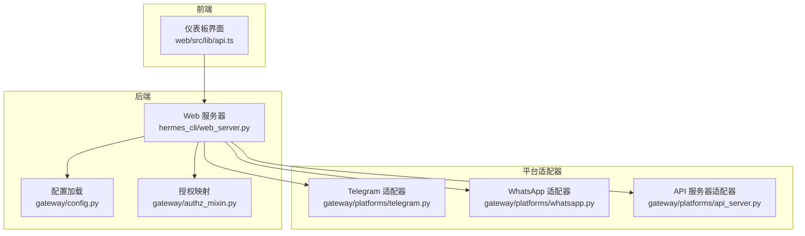
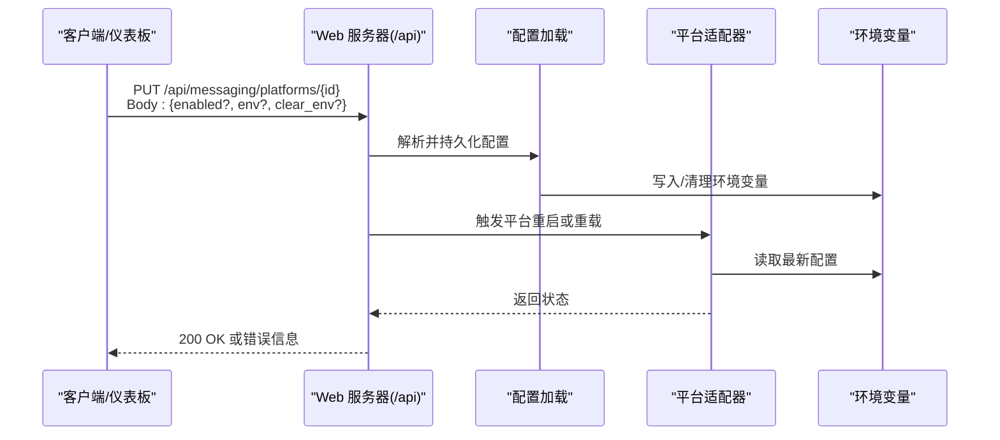
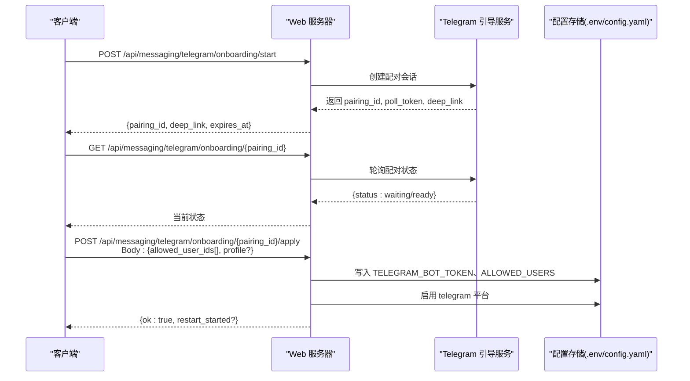
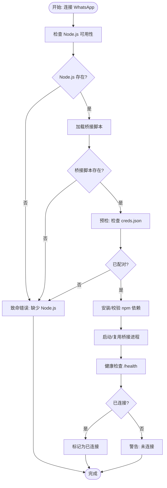
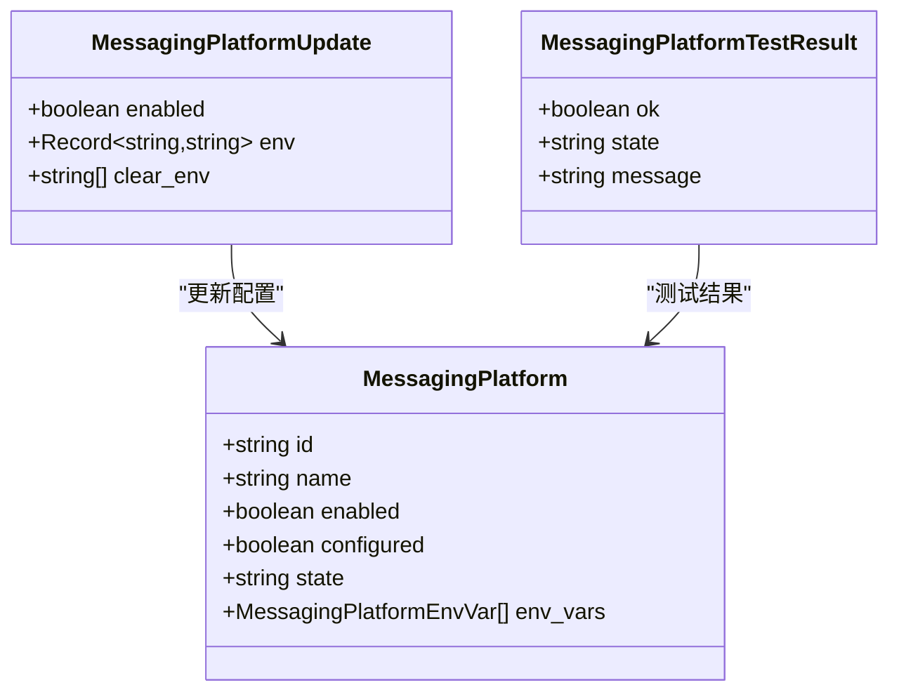
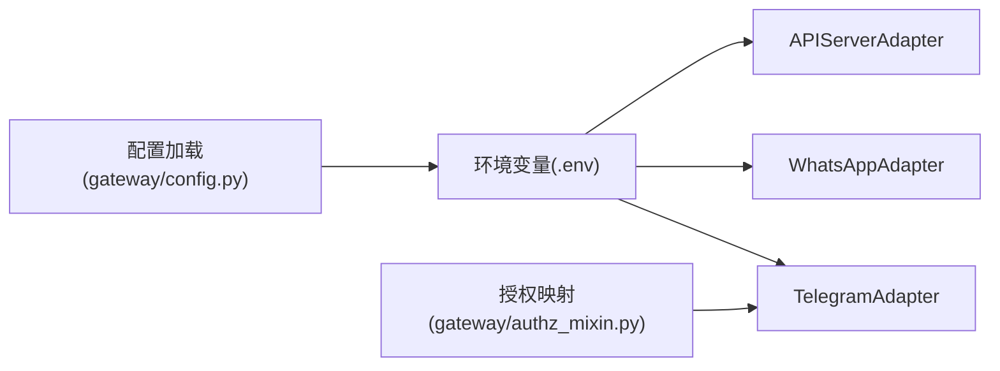

# 平台集成

<cite>
**本文档引用的文件**
- [api_server.py](file://gateway/platforms/api_server.py)
- [telegram.py](file://gateway/platforms/telegram.py)
- [whatsapp.py](file://gateway/platforms/whatsapp.py)
- [web_server.py](file://hermes_cli/web_server.py)
- [config.py](file://gateway/config.py)
- [authz_mixin.py](file://gateway/authz_mixin.py)
- [api.ts](file://web/src/lib/api.ts)
- [web-dashboard.md](file://website/docs/user-guide/features/web-dashboard.md)
</cite>

## 目录
1. [简介](#简介)
2. [项目结构](#项目结构)
3. [核心组件](#核心组件)
4. [架构总览](#架构总览)
5. [详细组件分析](#详细组件分析)
6. [依赖关系分析](#依赖关系分析)
7. [性能考虑](#性能考虑)
8. [故障排除指南](#故障排除指南)
9. [结论](#结论)
10. [附录](#附录)

## 简介
本文件面向平台集成与配置管理，聚焦以下消息平台的配置管理端点与能力：
- Telegram 配置：/api/platforms/telegram、/api/platforms/telegram/onboarding
- Discord 配置：/api/platforms/discord、/api/platforms/discord/channels
- WhatsApp 配置：/api/platforms/whatsapp、/api/platforms/whatsapp/cloud

内容涵盖：
- 平台启用/禁用控制
- 环境变量设置与清理
- 平台特定的配置验证、连接测试与故障排除端点
- 请求/响应示例与最佳实践
- 平台间配置隔离与继承机制

## 项目结构
平台相关代码主要分布在以下模块：
- 网关平台适配器：gateway/platforms/*（Telegram、WhatsApp 等）
- Web 管理后端：hermes_cli/web_server.py（提供 /api/messaging/* 管理端点）
- 配置加载与平台注册：gateway/config.py
- 授权与用户白名单映射：gateway/authz_mixin.py
- 前端 API 客户端：web/src/lib/api.ts

**图表来源**
- [web_server.py](file://hermes_cli/web_server.py)
- [config.py](file://gateway/config.py)
- [authz_mixin.py](file://gateway/authz_mixin.py)
- [telegram.py](file://gateway/platforms/telegram.py)
- [whatsapp.py](file://gateway/platforms/whatsapp.py)
- [api_server.py](file://gateway/platforms/api_server.py)

**章节来源**
- [web_server.py](file://hermes_cli/web_server.py)
- [config.py](file://gateway/config.py)
- [authz_mixin.py](file://gateway/authz_mixin.py)
- [telegram.py](file://gateway/platforms/telegram.py)
- [whatsapp.py](file://gateway/platforms/whatsapp.py)
- [api_server.py](file://gateway/platforms/api_server.py)

## 核心组件
- 平台配置管理端点
  - 列出平台：GET /api/messaging/platforms
  - 更新平台配置：PUT /api/messaging/platforms/{id}
  - 连接测试：POST /api/messaging/platforms/{id}/test
  - Telegram 集成引导：/api/messaging/telegram/onboarding/*
- 平台适配器
  - TelegramAdapter：处理 Telegram 消息收发、富文本渲染、DM 主题路由等
  - WhatsAppAdapter：通过 Node.js 桥接实现消息转发与媒体处理
  - APIServerAdapter：提供 OpenAI 兼容接口的 HTTP 服务
- 配置与环境变量
  - 支持从 .env 与 config.yaml 中读取平台配置
  - 平台特定环境变量（如 TELEGRAM_*、WHATSAPP_*）用于运行时控制
- 授权与白名单
  - 不同平台允许用户列表映射到环境变量（TELEGRAM_ALLOWED_USERS 等）

**章节来源**
- [web-dashboard.md](file://website/docs/user-guide/features/web-dashboard.md)
- [web_server.py](file://hermes_cli/web_server.py)
- [telegram.py](file://gateway/platforms/telegram.py)
- [whatsapp.py](file://gateway/platforms/whatsapp.py)
- [api_server.py](file://gateway/platforms/api_server.py)
- [authz_mixin.py](file://gateway/authz_mixin.py)

## 架构总览
下图展示平台配置管理在系统中的交互流程：

**图表来源**
- [web_server.py](file://hermes_cli/web_server.py)
- [config.py](file://gateway/config.py)
- [telegram.py](file://gateway/platforms/telegram.py)
- [whatsapp.py](file://gateway/platforms/whatsapp.py)

## 详细组件分析

### Telegram 平台配置与引导
- 配置端点
  - GET/PUT /api/messaging/platforms/telegram
  - POST /api/messaging/platforms/telegram/test
- 引导流程（Telegram Onboarding）
  - POST /api/messaging/telegram/onboarding/start
  - GET /api/messaging/telegram/onboarding/{pairing_id}
  - POST /api/messaging/telegram/onboarding/{pairing_id}/apply
- 关键特性
  - 允许用户列表：TELEGRAM_ALLOWED_USERS
  - 组级权限：TELEGRAM_GROUP_ALLOWED_USERS、TELEGRAM_GROUP_ALLOWED_CHATS
  - 富文本渲染与链接预览控制
  - DM 主题路由与回复锚点
- 运行时行为
  - 通过环境变量动态生效
  - 支持“观察未提及群组消息”等扩展选项

**图表来源**
- [web_server.py](file://hermes_cli/web_server.py)
- [api.ts](file://web/src/lib/api.ts)

**章节来源**
- [web_server.py](file://hermes_cli/web_server.py)
- [api.ts](file://web/src/lib/api.ts)
- [authz_mixin.py](file://gateway/authz_mixin.py)
- [config.py](file://gateway/config.py)

### Discord 平台配置与频道管理
- 配置端点
  - GET/PUT /api/messaging/platforms/discord
  - POST /api/messaging/platforms/discord/test
  - GET /api/messaging/platforms/discord/channels
- 关键特性
  - 频道分组与分类显示
  - 自动线程创建、提及要求等高级选项
- 使用建议
  - 通过 channels 端点获取目标频道标识，用于发送消息的目标参数

**章节来源**
- [web-dashboard.md](file://website/docs/user-guide/features/web-dashboard.md)
- [web_server.py](file://hermes_cli/web_server.py)

### WhatsApp 平台配置（含云 API）
- 配置端点
  - GET/PUT /api/messaging/platforms/whatsapp
  - POST /api/messaging/platforms/whatsapp/test
  - GET /api/messaging/platforms/whatsapp/cloud
- 关键特性
  - 支持多种后端：Business API、whatsapp-web.js、Baileys
  - Node.js 桥接模式：通过 HTTP/IPC 转发消息
  - DM 与群组策略：open/allowlist/disabled
  - 文本批处理与媒体缓存目录
- 运行时行为
  - 自动安装 npm 依赖
  - 桥接进程健康检查与重启
  - 会话锁防止并发冲突

**图表来源**
- [whatsapp.py](file://gateway/platforms/whatsapp.py)

**章节来源**
- [web-dashboard.md](file://website/docs/user-guide/features/web-dashboard.md)
- [whatsapp.py](file://gateway/platforms/whatsapp.py)

### 平台通用配置管理端点
- 列出平台：GET /api/messaging/platforms
  - 返回每个平台的状态、是否已配置、环境变量清单等
- 更新平台：PUT /api/messaging/platforms/{id}
  - 支持启用/禁用平台
  - 设置/清理环境变量（env、clear_env）
- 连接测试：POST /api/messaging/platforms/{id}/test
  - 返回平台连通性与当前状态

**图表来源**
- [api.ts](file://web/src/lib/api.ts)

**章节来源**
- [web-dashboard.md](file://website/docs/user-guide/features/web-dashboard.md)
- [api.ts](file://web/src/lib/api.ts)

## 依赖关系分析
- 平台适配器依赖
  - TelegramAdapter 依赖 python-telegram-bot 库与网络传输层
  - WhatsAppAdapter 依赖 Node.js 桥接与 aiohttp 客户端
  - APIServerAdapter 依赖 aiohttp 与会话存储
- 配置与环境变量
  - 平台配置来自 config.yaml 与 .env
  - 运行时通过环境变量覆盖（如 TELEGRAM_*、WHATSAPP_*）
- 授权与白名单
  - 不同平台允许用户映射到统一的环境变量键名

**图表来源**
- [config.py](file://gateway/config.py)
- [authz_mixin.py](file://gateway/authz_mixin.py)
- [telegram.py](file://gateway/platforms/telegram.py)
- [whatsapp.py](file://gateway/platforms/whatsapp.py)
- [api_server.py](file://gateway/platforms/api_server.py)

**章节来源**
- [config.py](file://gateway/config.py)
- [authz_mixin.py](file://gateway/authz_mixin.py)
- [telegram.py](file://gateway/platforms/telegram.py)
- [whatsapp.py](file://gateway/platforms/whatsapp.py)
- [api_server.py](file://gateway/platforms/api_server.py)

## 性能考虑
- 批处理与去抖
  - Telegram/WhatsApp 采用文本批处理延迟策略，减少频繁触发与速率限制影响
- 缓存与媒体
  - 图像/音频/文档缓存目录可由桥接进程共享，避免重复下载
- 连接池与超时
  - HTTP 客户端使用合理超时与连接复用，降低延迟
- 状态持久化
  - 响应存储使用 SQLite，支持 WAL 回退以提升可靠性

[本节为通用指导，无需具体文件引用]

## 故障排除指南
- 常见问题与定位
  - Telegram：检查 TELEGRAM_BOT_TOKEN 与 TELEGRAM_ALLOWED_USERS 是否正确写入 .env；确认引导流程已完成
  - WhatsApp：检查 Node.js 安装、npm 依赖安装、桥接进程健康状态；查看 bridge.log
  - Discord：确认应用令牌与权限；使用 channels 端点核对频道标识
- 测试端点
  - 使用 /api/messaging/platforms/{id}/test 快速判断平台状态
- 清理与重置
  - 通过 PUT /api/messaging/platforms/{id} 的 clear_env 参数清理敏感变量
  - 重新执行平台引导流程（如 Telegram onboarding）

**章节来源**
- [web-dashboard.md](file://website/docs/user-guide/features/web-dashboard.md)
- [web_server.py](file://hermes_cli/web_server.py)
- [whatsapp.py](file://gateway/platforms/whatsapp.py)

## 结论
本文档梳理了平台集成的配置管理端点与运行机制，明确了 Telegram、Discord、WhatsApp 的配置路径、环境变量、引导流程与测试方法。通过统一的 /api/messaging/* 管理接口，结合平台适配器与配置加载逻辑，实现了跨平台的一致体验与可观测性。

[本节为总结性内容，无需具体文件引用]

## 附录

### 请求/响应示例（基于现有端点）
- 获取平台列表
  - 请求：GET /api/messaging/platforms
  - 响应字段：platforms[] 包含 id、name、enabled、configured、state、env_vars[]
- 更新平台配置
  - 请求：PUT /api/messaging/platforms/{id}
  - Body：{enabled?: boolean, env?: Record<string,string>, clear_env?: string[]}
  - 响应：200 OK 或错误详情
- 连接测试
  - 请求：POST /api/messaging/platforms/{id}/test
  - 响应：{ok: boolean, state: string, message: string}
- Telegram 引导
  - 开始：POST /api/messaging/telegram/onboarding/start
  - 查询：GET /api/messaging/telegram/onboarding/{pairing_id}
  - 应用：POST /api/messaging/telegram/onboarding/{pairing_id}/apply

**章节来源**
- [web-dashboard.md](file://website/docs/user-guide/features/web-dashboard.md)
- [web_server.py](file://hermes_cli/web_server.py)
- [api.ts](file://web/src/lib/api.ts)

### 最佳实践
- 配置隔离
  - 使用 .env 与 config.yaml 分离敏感与非敏感配置
  - 通过 clear_env 清理不再需要的变量
- 平台继承
  - 通过环境变量覆盖默认行为（如 CORS、端口、模型名）
- 安全
  - 将 TOKEN/KEY 类变量标记为密码字段
  - 仅在必要时启用 rich_messages 或富文本功能

**章节来源**
- [config.py](file://gateway/config.py)
- [web-dashboard.md](file://website/docs/user-guide/features/web-dashboard.md)