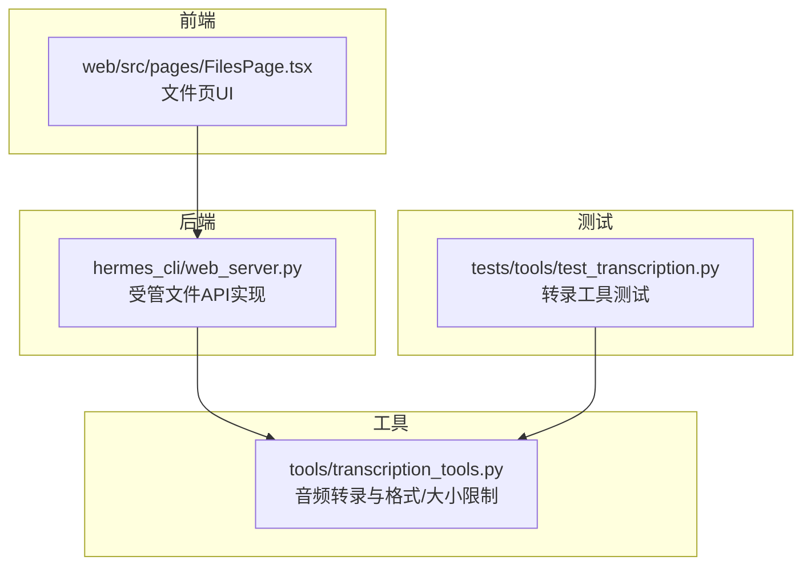
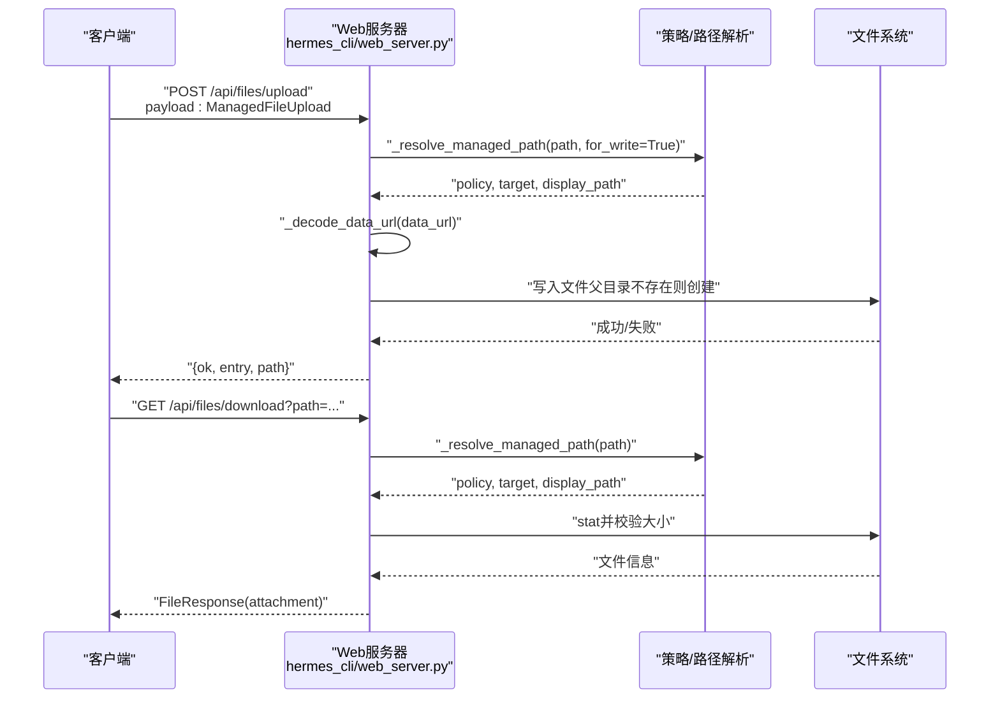
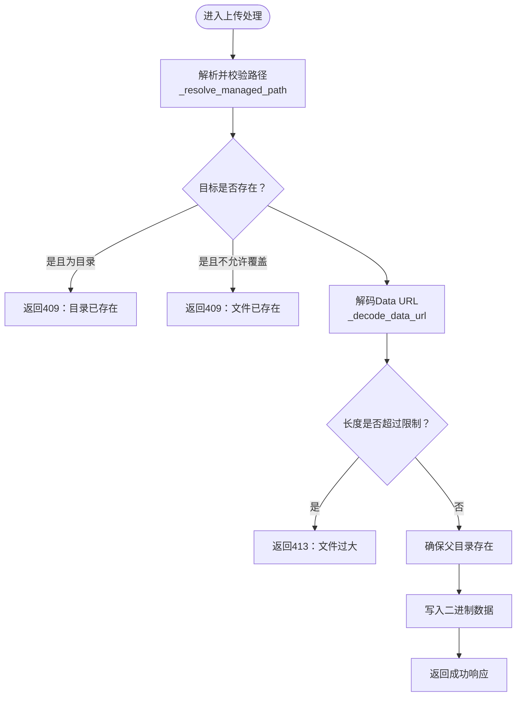
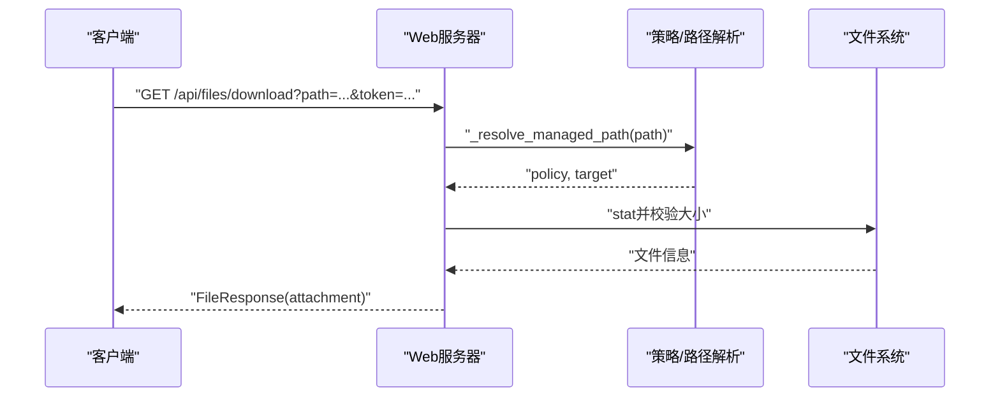
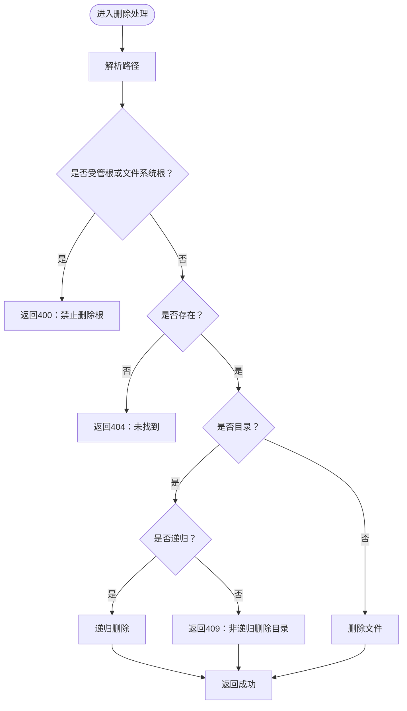
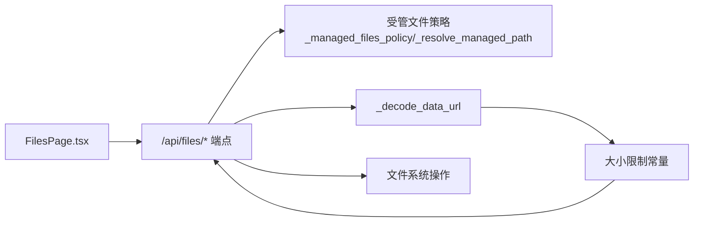

# 文件操作

<cite>
**本文引用的文件**
- [hermes_cli/web_server.py](file://hermes_cli/web_server.py)
- [tools/transcription_tools.py](file://tools/transcription_tools.py)
- [tests/tools/test_transcription.py](file://tests/tools/test_transcription.py)
- [web/src/pages/FilesPage.tsx](file://web/src/pages/FilesPage.tsx)
</cite>

## 目录
1. [简介](#简介)
2. [项目结构](#项目结构)
3. [核心组件](#核心组件)
4. [架构总览](#架构总览)
5. [详细组件分析](#详细组件分析)
6. [依赖关系分析](#依赖关系分析)
7. [性能考量](#性能考量)
8. [故障排查指南](#故障排查指南)
9. [结论](#结论)
10. [附录](#附录)

## 简介
本文件操作API文档聚焦于“受管文件”（managed files）的上传、下载、目录管理与状态检查能力，覆盖以下端点与行为：
- 上传：POST /api/files/upload，接收Data URL格式的二进制内容，支持多种音频格式与大小限制。
- 下载：GET /api/files/download，支持通过查询参数令牌进行认证，返回文件附件流。
- 目录管理：POST /api/files/mkdir 创建目录；DELETE /api/files 删除文件或目录（可递归）。
- 状态检查：GET /api/files 列出目录内容；GET /api/files/read 获取受管文件元信息与Data URL。
- 权限与安全：路径解析严格限制在受管根目录内，拒绝越权访问；对写入路径进行存在性与覆盖策略校验；对读取/写入/删除操作进行权限与异常处理。

此外，文档还说明了文件大小限制、错误处理策略、进度反馈建议以及与音频转录工具的格式支持关系。

## 项目结构
文件操作相关的核心实现集中在后端Web服务器模块中，并辅以前端页面用于交互展示。音频转录工具提供了额外的格式与大小限制参考。

图表来源
- [hermes_cli/web_server.py](file://hermes_cli/web_server.py)
- [web/src/pages/FilesPage.tsx](file://web/src/pages/FilesPage.tsx)
- [tools/transcription_tools.py](file://tools/transcription_tools.py)
- [tests/tools/test_transcription.py](file://tests/tools/test_transcription.py)

章节来源
- [hermes_cli/web_server.py](file://hermes_cli/web_server.py)
- [web/src/pages/FilesPage.tsx](file://web/src/pages/FilesPage.tsx)
- [tools/transcription_tools.py](file://tools/transcription_tools.py)
- [tests/tools/test_transcription.py](file://tests/tools/test_transcription.py)

## 核心组件
- 受管文件策略与路径解析
  - 受管根目录策略：根据环境变量与默认安装位置决定锁定根目录或允许用户家目录浏览。
  - 路径解析：严格规范化与校验，禁止相对路径中的“..”，确保目标位于受管根目录内。
- 数据模型
  - 上传：ManagedFileUpload（path、data_url、overwrite）
  - 目录：ManagedDirectoryCreate（path）
  - 删除：ManagedFileDelete（path、recursive）
- 常量与限制
  - 受管文件最大字节数：100 MB
  - 媒体文件最大字节数：25 MB
  - FS文本预览最大源文件：64 MB；预览截取上限：512 KB
  - FS Data URL最大字节数：16 MB
- 音频格式支持参考
  - 支持扩展名集合：.mp3、.mp4、.mpeg、.mpga、.m4a、.wav、.webm、.ogg、.aac、.flac
  - 最大文件大小：25 MB

章节来源
- [hermes_cli/web_server.py](file://hermes_cli/web_server.py)
- [tools/transcription_tools.py](file://tools/transcription_tools.py)

## 架构总览
下图展示了文件操作端点的调用流程与关键处理步骤。

图表来源
- [hermes_cli/web_server.py](file://hermes_cli/web_server.py)

## 详细组件分析

### 上传端点：POST /api/files/upload
- 请求体
  - ManagedFileUpload
    - path：目标路径（受管根目录内）
    - data_url：Data URL格式的二进制内容
    - overwrite：是否覆盖已存在文件（默认true）
- 处理逻辑
  - 解析并校验路径，确保位于受管根目录内
  - 若目标存在且是目录，返回冲突错误
  - 若目标存在且不允许覆盖，返回冲突错误
  - 解码Data URL，校验编码与大小（不超过受管文件最大值）
  - 确保父目录存在，写入二进制数据
  - 返回成功响应，包含条目信息与显示路径
- 错误处理
  - 路径非法/越权：400/403
  - 已存在但不可覆盖：409
  - 编码无效/过大：400/413
  - 权限不足/IO错误：403/500
- 安全与权限
  - 路径解析严格限制在受管根目录
  - 写入前自动创建父目录
  - 覆盖策略由客户端控制

图表来源
- [hermes_cli/web_server.py](file://hermes_cli/web_server.py)

章节来源
- [hermes_cli/web_server.py](file://hermes_cli/web_server.py)

### 下载端点：GET /api/files/download
- 查询参数
  - path：受管文件路径
  - token：会话令牌（作为查询参数传递，兼容无自定义头的场景）
- 处理逻辑
  - 解析并校验路径，确保为文件且未越权
  - 校验文件大小（不超过受管文件最大值）
  - 推断MIME类型，返回FileResponse并设置为附件下载
- 错误处理
  - 路径不存在/非文件：404/400
  - 超出大小限制：413
  - 权限不足/IO错误：403/500

图表来源
- [hermes_cli/web_server.py](file://hermes_cli/web_server.py)

章节来源
- [hermes_cli/web_server.py](file://hermes_cli/web_server.py)

### 目录管理端点
- 创建目录：POST /api/files/mkdir
  - 请求体：ManagedDirectoryCreate（path）
  - 行为：解析路径，若目标存在但不是目录则报错；否则创建目录（含父目录）
  - 错误：409（文件已存在）、403（无权限）、500（IO错误）
- 删除文件/目录：DELETE /api/files
  - 请求体：ManagedFileDelete（path、recursive）
  - 行为：禁止删除受管根目录与文件系统根；目录支持递归删除
  - 错误：400（根目录保护/非法路径）、404（未找到）、409（非递归删除目录）、500（IO错误）

图表来源
- [hermes_cli/web_server.py](file://hermes_cli/web_server.py)

章节来源
- [hermes_cli/web_server.py](file://hermes_cli/web_server.py)

### 文件状态检查与列表
- 列表目录：GET /api/files
  - 参数：path（可选，默认当前目录）
  - 行为：校验路径为目录，列出子项并排序；返回父目录信息
  - 错误：400/404（路径非法/非目录），403（无权限），500（IO错误）
- 读取受管文件：GET /api/files/read
  - 行为：校验路径为文件，读取并返回Data URL（受管文件大小限制）
  - 错误：400/404（路径非法/非文件），403（无权限），413（过大），500（IO错误）

章节来源
- [hermes_cli/web_server.py](file://hermes_cli/web_server.py)

### 音频格式支持与大小限制参考
- 支持格式（转录工具）：.mp3、.mp4、.mpeg、.mpga、.m4a、.wav、.webm、.ogg、.aac、.flac
- 最大文件大小：25 MB
- 测试覆盖：缺失文件、不支持格式、过大文件、符号链接等边界情况

章节来源
- [tools/transcription_tools.py](file://tools/transcription_tools.py)
- [tests/tools/test_transcription.py](file://tests/tools/test_transcription.py)

## 依赖关系分析
- Web服务器模块
  - 提供受管文件API路由与中间件（会话令牌查询参数支持）
  - 实现路径解析、策略判断、大小限制与错误映射
- 前端页面
  - FilesPage.tsx 提供拖拽上传、创建目录、删除确认等交互
- 音频转录工具
  - 提供格式与大小限制参考，便于理解音频类文件的合规范围

图表来源
- [hermes_cli/web_server.py](file://hermes_cli/web_server.py)
- [web/src/pages/FilesPage.tsx](file://web/src/pages/FilesPage.tsx)

章节来源
- [hermes_cli/web_server.py](file://hermes_cli/web_server.py)
- [web/src/pages/FilesPage.tsx](file://web/src/pages/FilesPage.tsx)

## 性能考量
- 上传与下载
  - 受管文件最大字节数为100 MB；媒体文件为25 MB；FS Data URL为16 MB；FS文本预览源为64 MB，截取上限512 KB
  - 采用一次性解码Data URL并写入磁盘的方式，适合中小文件；大文件建议使用分块上传或直接文件传输
- 列表与读取
  - 列表按目录项数量与名称排序，避免过多子项导致响应膨胀
  - 文本预览与Data URL读取均有限制，防止内存与带宽压力

[本节为通用指导，无需特定文件来源]

## 故障排查指南
- 常见错误与原因
  - 400：路径非法（包含“..”或非绝对路径）、路径指向目录而非文件
  - 403：无权限读取/写入/删除
  - 404：路径不存在
  - 409：目标已存在且不允许覆盖；或尝试非递归删除目录
  - 413：文件超过大小限制
  - 500：IO错误或内部异常
- 下载令牌
  - 当客户端无法设置会话头时，可通过查询参数传入token以完成认证
- 前端交互
  - FilesPage.tsx 提供创建目录、删除确认与拖拽上传等UI反馈，有助于定位问题

章节来源
- [hermes_cli/web_server.py](file://hermes_cli/web_server.py)
- [web/src/pages/FilesPage.tsx](file://web/src/pages/FilesPage.tsx)

## 结论
该文件操作API围绕“受管文件”构建，具备严格的路径解析与权限控制、明确的大小限制与错误处理，覆盖上传、下载、目录管理与状态检查等核心能力。结合前端交互与音频转录工具的格式参考，可满足日常文件管理与跨平台访问需求。对于大文件与高并发场景，建议引入分块上传与缓存策略以优化性能与稳定性。

[本节为总结性内容，无需特定文件来源]

## 附录

### 请求/响应示例（路径引用）
- 上传
  - 请求：POST /api/files/upload
    - 请求体：ManagedFileUpload（path、data_url、overwrite）
    - 成功响应：{ok: true, entry: {...}, path: "..."}
    - 参考实现路径：[hermes_cli/web_server.py](file://hermes_cli/web_server.py)
- 下载
  - 请求：GET /api/files/download?path=...&token=...
    - 成功响应：FileResponse（attachment）
    - 参考实现路径：[hermes_cli/web_server.py](file://hermes_cli/web_server.py)
- 创建目录
  - 请求：POST /api/files/mkdir
    - 请求体：ManagedDirectoryCreate（path）
    - 成功响应：{ok: true, entry: {...}, path: "..."}
    - 参考实现路径：[hermes_cli/web_server.py](file://hermes_cli/web_server.py)
- 删除文件/目录
  - 请求：DELETE /api/files
    - 请求体：ManagedFileDelete（path、recursive）
    - 成功响应：{ok: true, path: "..."}
    - 参考实现路径：[hermes_cli/web_server.py](file://hermes_cli/web_server.py)
- 列表目录
  - 请求：GET /api/files?path=...
    - 成功响应：{path: "...", parent: "...", entries: [...]}
    - 参考实现路径：[hermes_cli/web_server.py](file://hermes_cli/web_server.py)
- 读取受管文件
  - 请求：GET /api/files/read?path=...
    - 成功响应：{name, path, size, mime_type, data_url, ...}
    - 参考实现路径：[hermes_cli/web_server.py](file://hermes_cli/web_server.py)

### 错误处理与进度反馈
- 错误处理
  - 明确的状态码与错误消息，便于前端与自动化脚本识别与恢复
- 进度反馈
  - 当前实现为同步写入/读取；如需大文件上传进度，建议在上层增加分块上传与轮询接口

章节来源
- [hermes_cli/web_server.py](file://hermes_cli/web_server.py)