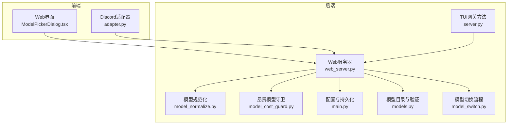
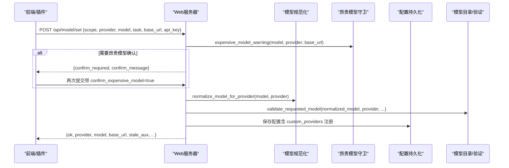
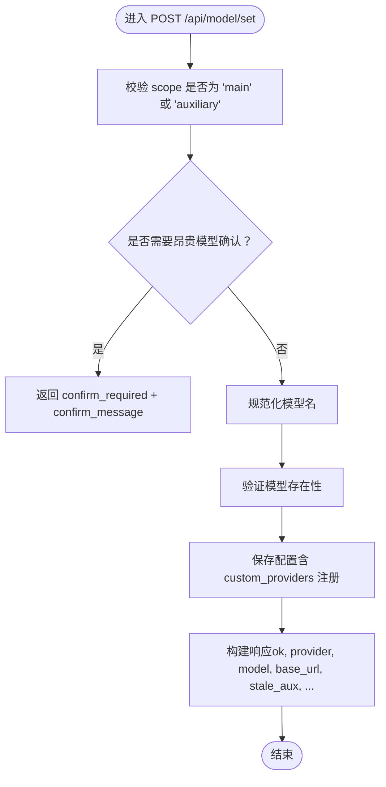
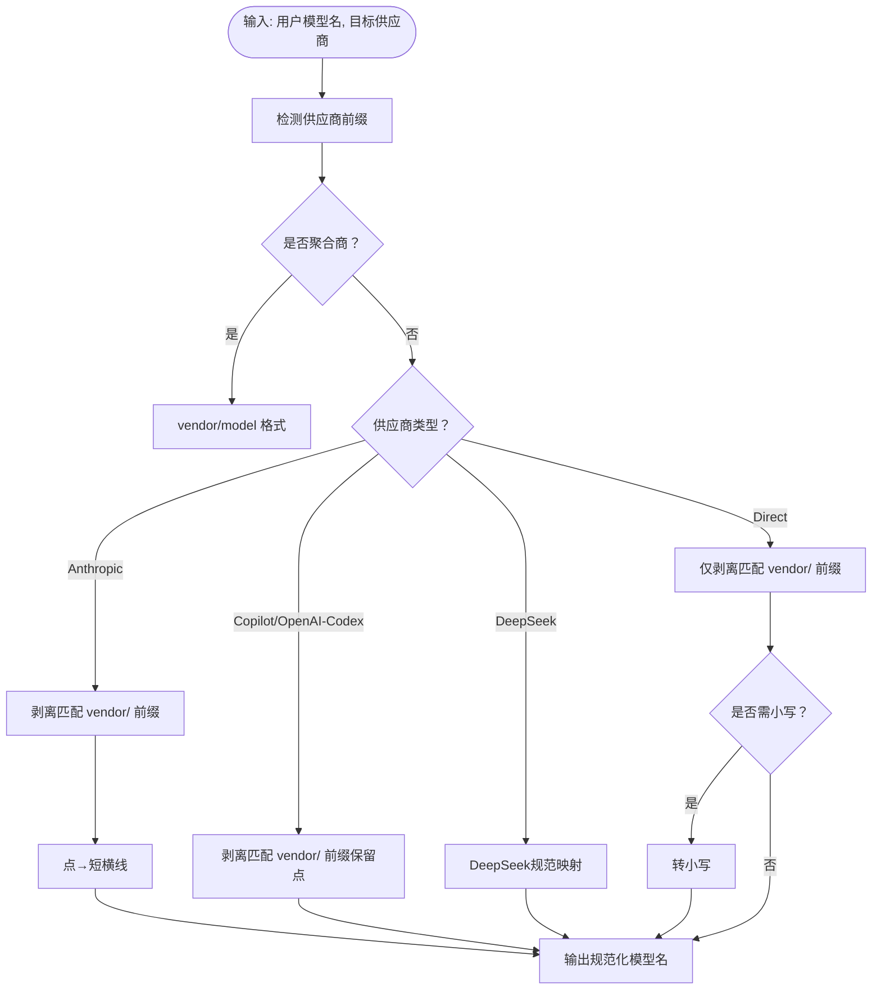
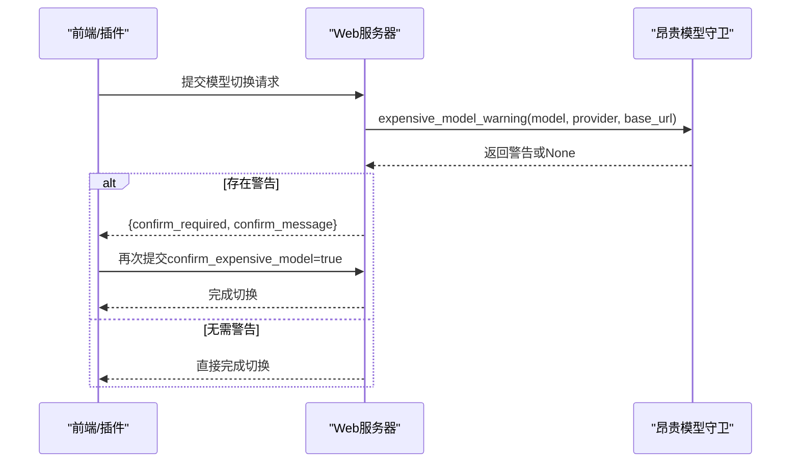
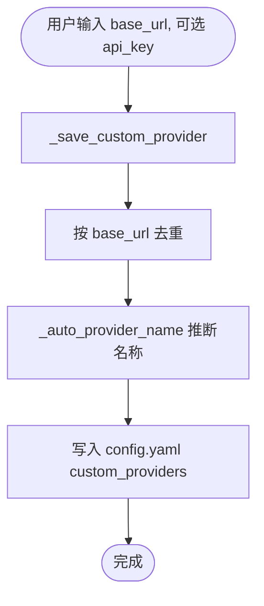
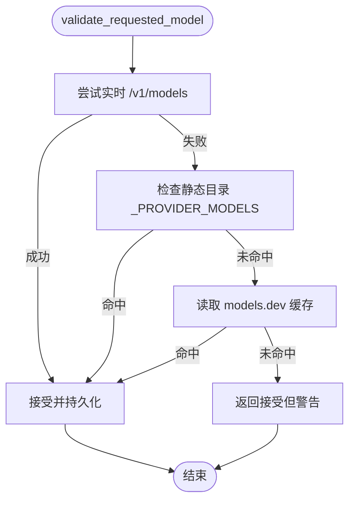
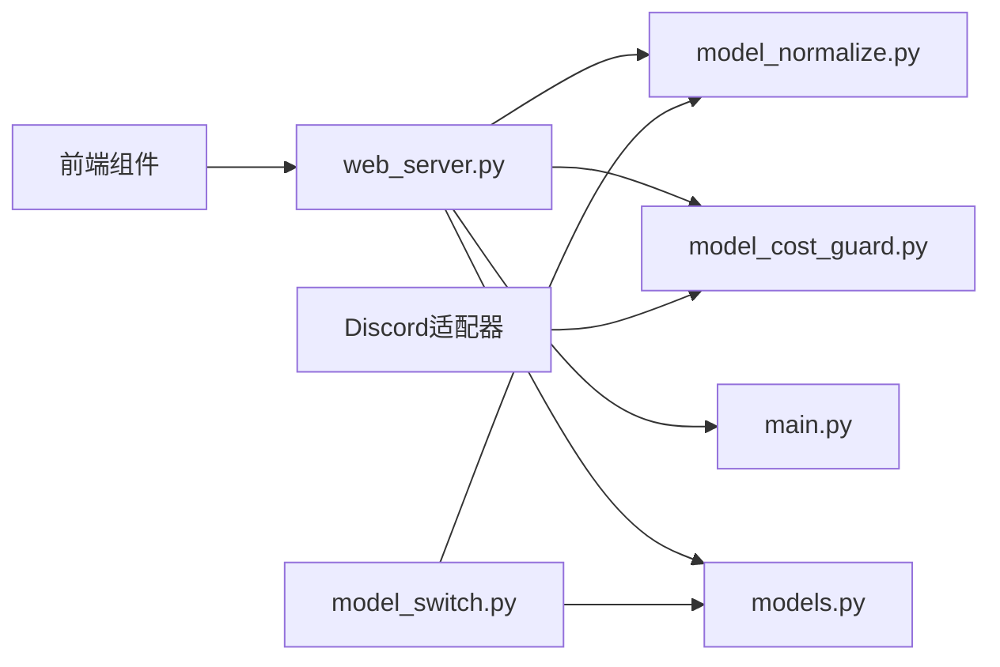

# 模型管理

<cite>
**本文档引用的文件**
- [web_server.py](file://hermes_cli/web_server.py)
- [model_normalize.py](file://hermes_cli/model_normalize.py)
- [model_cost_guard.py](file://hermes_cli/model_cost_guard.py)
- [main.py](file://hermes_cli/main.py)
- [models.py](file://hermes_cli/models.py)
- [model_switch.py](file://hermes_cli/model_switch.py)
- [server.py](file://tui_gateway/server.py)
- [adapter.py](file://plugins/platforms/discord/adapter.py)
- [ModelPickerDialog.tsx](file://web/src/components/ModelPickerDialog.tsx)
- [ModelsPage.tsx](file://web/src/pages/ModelsPage.tsx)
</cite>

## 目录
1. [简介](#简介)
2. [项目结构](#项目结构)
3. [核心组件](#核心组件)
4. [架构总览](#架构总览)
5. [详细组件分析](#详细组件分析)
6. [依赖分析](#依赖分析)
7. [性能考虑](#性能考虑)
8. [故障排除指南](#故障排除指南)
9. [结论](#结论)
10. [附录](#附录)

## 简介
本文件为模型管理API的技术文档，重点覆盖以下内容：
- 模型分配端点：POST /api/model/set 的行为、参数与返回值，支持主模型槽位与辅助任务模型分配。
- 模型规范化处理：供应商名称映射、模型格式标准化、供应商前缀修复等。
- 自定义本地端点配置：支持无API密钥的本地模型服务（如Ollama、vLLM、llama.cpp）。
- 模型切换确认机制与昂贵模型使用警告：在高成本模型切换时进行二次确认。
- 模型验证规则、错误处理与回滚策略：基于目录/缓存/远端API的验证与容错。
- 请求/响应示例与最佳实践：帮助开发者正确集成与调试。

## 项目结构
模型管理相关能力分布在多个模块中：
- Web后端：提供REST API端点与业务逻辑（POST /api/model/set）。
- 规范化模块：统一不同供应商的模型名格式。
- 成本守卫：检测昂贵模型并触发确认流程。
- 配置与持久化：保存自定义端点、模型与工具网关设置。
- 前端与插件：提供GUI选择器与平台适配器（如Discord）。

**图表来源**
- [web_server.py](file://hermes_cli/web_server.py)
- [model_normalize.py](file://hermes_cli/model_normalize.py)
- [model_cost_guard.py](file://hermes_cli/model_cost_guard.py)
- [main.py](file://hermes_cli/main.py)
- [models.py](file://hermes_cli/models.py)
- [model_switch.py](file://hermes_cli/model_switch.py)
- [server.py](file://tui_gateway/server.py)
- [adapter.py](file://plugins/platforms/discord/adapter.py)
- [ModelPickerDialog.tsx](file://web/src/components/ModelPickerDialog.tsx)

**章节来源**
- [web_server.py](file://hermes_cli/web_server.py)
- [model_normalize.py](file://hermes_cli/model_normalize.py)
- [model_cost_guard.py](file://hermes_cli/model_cost_guard.py)
- [main.py](file://hermes_cli/main.py)
- [models.py](file://hermes_cli/models.py)
- [model_switch.py](file://hermes_cli/model_switch.py)
- [server.py](file://tui_gateway/server.py)
- [adapter.py](file://plugins/platforms/discord/adapter.py)
- [ModelPickerDialog.tsx](file://web/src/components/ModelPickerDialog.tsx)

## 核心组件
- 模型分配端点：POST /api/model/set
  - 支持 scope: "main" 或 "auxiliary"
  - 主模型分配需提供 provider 与 model；辅助模型分配需提供 provider（可选 model）
  - 返回值包含是否成功、当前 provider/model/base_url、是否需要确认昂贵模型、辅助槽位的陈旧状态等
- 模型规范化：normalize_model_for_provider
  - 将用户输入的模型名转换为目标供应商API期望的格式
  - 处理聚合商（OpenRouter/Nous/KiloCode）的 vendor/model 格式
  - 处理Anthropic/Copilot等特殊格式要求
  - 修复匹配的供应商前缀（如 zai/glm-5.1 → glm-5.1）
- 昂贵模型确认：expensive_model_warning
  - 基于models.dev或usage_pricing的定价数据判断是否触发警告
  - 超过阈值（输入>20$/M、输出>100$/M）时提示确认
- 自定义本地端点：_save_custom_provider
  - 将自定义/本地端点写入 custom_providers，去重并支持名称自动推断
  - 支持无API密钥场景（如本地Ollama/vLLM）
- 模型验证：validate_requested_model
  - 优先通过 /v1/models 实时校验
  - 回退到静态目录与磁盘缓存
  - 对无法验证的情况给出“接受但警告”的策略

**章节来源**
- [web_server.py](file://hermes_cli/web_server.py)
- [model_normalize.py](file://hermes_cli/model_normalize.py)
- [model_cost_guard.py](file://hermes_cli/model_cost_guard.py)
- [main.py](file://hermes_cli/main.py)
- [models.py](file://hermes_cli/models.py)

## 架构总览
下图展示从Web前端到后端模型分配端点的完整调用链，以及关键的规范化与确认流程。

**图表来源**
- [web_server.py](file://hermes_cli/web_server.py)
- [model_normalize.py](file://hermes_cli/model_normalize.py)
- [model_cost_guard.py](file://hermes_cli/model_cost_guard.py)
- [models.py](file://hermes_cli/models.py)
- [main.py](file://hermes_cli/main.py)

## 详细组件分析

### 组件A：模型分配端点 POST /api/model/set
- 功能概述
  - 主模型分配：scope="main"，必须提供 provider 与 model；会进行昂贵模型确认、规范化与保存
  - 辅助模型分配：scope="auxiliary"，可指定 task（默认全部），必须提供 provider（model可选）
  - 自定义本地端点：当 provider 为 "custom"/"local" 且提供 base_url 时，自动注册到 custom_providers
- 关键流程
  - 昂贵模型确认：在进入配置作用域之前执行，避免跨协程持有RLock
  - 规范化：将用户输入的模型名标准化为目标供应商API期望格式
  - 验证：优先实时查询 /v1/models，其次使用静态目录与磁盘缓存
  - 保存：更新配置并返回结果，包含陈旧辅助槽位列表
- 错误处理
  - 参数校验失败返回400
  - 异常捕获统一返回500，并记录日志
- 返回字段
  - ok、scope、provider、model、base_url、gateway_tools、stale_aux、confirm_required、confirm_message 等

**图表来源**
- [web_server.py](file://hermes_cli/web_server.py)

**章节来源**
- [web_server.py](file://hermes_cli/web_server.py)

### 组件B：模型规范化处理
- 供应商映射
  - 将首段令牌映射到聚合商供应商（如 claude→anthropic、gpt→openai 等）
- 格式标准化
  - 聚合商：强制 vendor/model 格式
  - Anthropic：点转短横线（如 claude-sonnet-4.6 → claude-sonnet-4-6）
  - Copilot：保留点（如 claude-sonnet-4.6）
  - OpenCode Zen/Go：扁平命名空间，必要时剥离 vendor/ 前缀
  - DeepSeek：映射到已知规范ID（如 deepseek-chat、deepseek-reasoner、V系列）
  - 直连供应商：仅剥离匹配的 vendor/ 前缀，必要时小写化（如 Xiaomi）
- 前缀修复
  - 仅当 vendor/ 前缀与目标供应商一致时才剥离，防止误伤

**图表来源**
- [model_normalize.py](file://hermes_cli/model_normalize.py)

**章节来源**
- [model_normalize.py](file://hermes_cli/model_normalize.py)

### 组件C：昂贵模型使用警告与确认机制
- 触发条件
  - 已知定价且超过阈值（输入>20$/M、输出>100$/M）
  - 特定模型（如 openai/gpt-5.5-pro）附加建议
- 执行时机
  - 在配置作用域外异步执行，避免阻塞事件循环
- 平台实现
  - Discord：弹出确认按钮，二次确认后才切换
  - Web/TUI：返回 confirm_required + confirm_message，由前端决定是否再次提交

**图表来源**
- [model_cost_guard.py](file://hermes_cli/model_cost_guard.py)
- [adapter.py](file://plugins/platforms/discord/adapter.py)
- [ModelPickerDialog.tsx](file://web/src/components/ModelPickerDialog.tsx)
- [ModelsPage.tsx](file://web/src/pages/ModelsPage.tsx)

**章节来源**
- [model_cost_guard.py](file://hermes_cli/model_cost_guard.py)
- [adapter.py](file://plugins/platforms/discord/adapter.py)
- [ModelPickerDialog.tsx](file://web/src/components/ModelPickerDialog.tsx)
- [ModelsPage.tsx](file://web/src/pages/ModelsPage.tsx)

### 组件D：自定义本地端点配置
- 场景
  - 本地模型服务（Ollama、vLLM、llama.cpp）通常无需API密钥
  - 通过 "custom"/"local" provider 与 base_url 进行配置
- 行为
  - 保存到 custom_providers，按 base_url 去重
  - 自动生成显示名称（如 Local (localhost:11434)、RunPod (xyz.runpod.io)）
  - 支持无API密钥场景（api_key 可为空）

**图表来源**
- [main.py](file://hermes_cli/main.py)

**章节来源**
- [main.py](file://hermes_cli/main.py)

### 组件E：模型验证规则与回滚策略
- 验证顺序
  1) 实时查询 /v1/models（若可用）
  2) 使用静态目录 _PROVIDER_MODELS
  3) 使用磁盘缓存 models.dev
  4) 若均不可用，返回“接受但警告”，允许用户继续
- 回滚策略
  - 当验证失败但用户坚持使用时，系统仍接受该模型（“Note: ... may not be valid.”）
  - 不会阻止保存配置，确保用户可控

**图表来源**
- [models.py](file://hermes_cli/models.py)
- [model_switch.py](file://hermes_cli/model_switch.py)

**章节来源**
- [models.py](file://hermes_cli/models.py)
- [model_switch.py](file://hermes_cli/model_switch.py)

## 依赖分析
- 模块耦合
  - web_server.py 依赖 model_normalize.py、model_cost_guard.py、models.py、main.py
  - model_switch.py 依赖 models.py 与 model_normalize.py
  - 前端组件（ModelPickerDialog.tsx、ModelsPage.tsx）与后端通过 /api/model/set 交互
  - Discord适配器通过 expensive_model_warning 与后端联动
- 外部依赖
  - models.dev 缓存与 /v1/models 端点用于定价与模型目录
  - 自定义端点无需外部认证，直接通过 base_url 访问

**图表来源**
- [web_server.py](file://hermes_cli/web_server.py)
- [model_normalize.py](file://hermes_cli/model_normalize.py)
- [model_cost_guard.py](file://hermes_cli/model_cost_guard.py)
- [main.py](file://hermes_cli/main.py)
- [models.py](file://hermes_cli/models.py)
- [model_switch.py](file://hermes_cli/model_switch.py)
- [ModelPickerDialog.tsx](file://web/src/components/ModelPickerDialog.tsx)
- [adapter.py](file://plugins/platforms/discord/adapter.py)

**章节来源**
- [web_server.py](file://hermes_cli/web_server.py)
- [model_normalize.py](file://hermes_cli/model_normalize.py)
- [model_cost_guard.py](file://hermes_cli/model_cost_guard.py)
- [main.py](file://hermes_cli/main.py)
- [models.py](file://hermes_cli/models.py)
- [model_switch.py](file://hermes_cli/model_switch.py)
- [ModelPickerDialog.tsx](file://web/src/components/ModelPickerDialog.tsx)
- [adapter.py](file://plugins/platforms/discord/adapter.py)

## 性能考虑
- 异步执行昂贵模型确认：避免阻塞事件循环，使用 asyncio.to_thread
- 规范化与验证尽量走缓存：优先使用 models.dev 缓存与静态目录
- 自定义端点注册幂等：按 base_url 去重，避免重复写入
- 前端确认流程：仅在网络可达时触发昂贵模型确认，减少不必要的交互

## 故障排除指南
- 400 错误：scope 必须为 "main" 或 "auxiliary"；主模型分配缺少 provider 或 model
- 500 错误：内部异常（如配置保存失败），查看后端日志
- 昂贵模型确认：若未收到确认，检查 confirm_expensive_model 参数是否传递
- 自定义端点无效：确认 base_url 正确且以 http:// 或 https:// 开头，本地端点通常需要 /v1 后缀
- 模型未被识别：若 /v1/models 不可达，系统会“接受但警告”，可手动确认继续

**章节来源**
- [web_server.py](file://hermes_cli/web_server.py)
- [model_cost_guard.py](file://hermes_cli/model_cost_guard.py)
- [model_normalize.py](file://hermes_cli/model_normalize.py)

## 结论
本文档系统性地梳理了模型管理API的端点行为、规范化处理、昂贵模型确认、自定义本地端点配置与验证策略。通过清晰的流程图与端到端序列图，开发者可以快速理解并正确集成模型分配功能，同时在遇到问题时具备明确的排查路径。

## 附录

### API定义：POST /api/model/set
- 请求体字段
  - scope: "main" | "auxiliary"
  - provider: 供应商标识（如 openai、anthropic、custom、local 等）
  - model: 模型名称（主模型必填；辅助模型可选）
  - task: 任务槽位（如 "search"、"coding" 等；辅助模型时可选）
  - base_url: 自定义端点基础URL（可选）
  - api_key: API密钥（可选）
  - confirm_expensive_model: 是否确认昂贵模型（可选）
  - profile: 配置文件作用域（可选）
- 响应字段
  - ok: 是否成功
  - scope: "main" 或 "auxiliary"
  - provider: 应用后的供应商
  - model: 应用后的模型
  - base_url: 应用后的基础URL
  - confirm_required: 是否需要昂贵模型确认
  - confirm_message: 确认消息
  - gateway_tools: 当主模型切换至特定供应商时可能新增的工具路由
  - stale_aux: 主模型切换后仍指向其他供应商的辅助槽位列表

**章节来源**
- [web_server.py](file://hermes_cli/web_server.py)

### 请求/响应示例（路径引用）
- 请求示例（主模型分配）
  - 方法与路径：POST /api/model/set
  - 示例请求体字段：scope="main", provider="openai", model="gpt-5.5-pro", base_url="https://api.openai.com/v1"
  - 参考路径：[web_server.py](file://hermes_cli/web_server.py)
- 响应示例（成功）
  - 示例响应字段：ok=true, provider="openai", model="gpt-5.5-pro", base_url="https://api.openai.com/v1"
  - 参考路径：[web_server.py](file://hermes_cli/web_server.py)
- 请求示例（辅助模型分配）
  - 示例请求体字段：scope="auxiliary", provider="anthropic", task="search"
  - 参考路径：[web_server.py](file://hermes_cli/web_server.py)
- 响应示例（昂贵模型确认）
  - 示例响应字段：confirm_required=true, confirm_message="..."
  - 参考路径：[web_server.py](file://hermes_cli/web_server.py), [model_cost_guard.py](file://hermes_cli/model_cost_guard.py)

### 最佳实践
- 本地端点配置
  - 使用 "custom"/"local" 供应商与 base_url，无需 api_key
  - 确保 base_url 以 http:// 或 https:// 开头，本地服务通常需要 /v1 后缀
- 模型规范化
  - 输入模型名时尽量使用聚合商格式（vendor/model），便于规范化
- 昂贵模型
  - 遇到高额定价提示时，先评估用途再确认；可在前端二次确认后再提交
- 验证与回滚
  - 若 /v1/models 不可达，系统会“接受但警告”；可手动确认继续
  - 配置变更可随时回退，确保不会因误操作造成不可恢复的损失