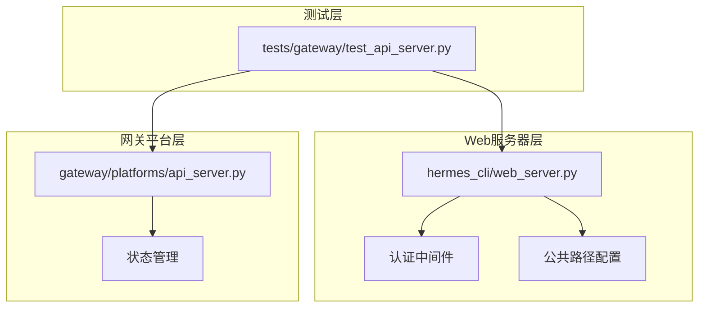
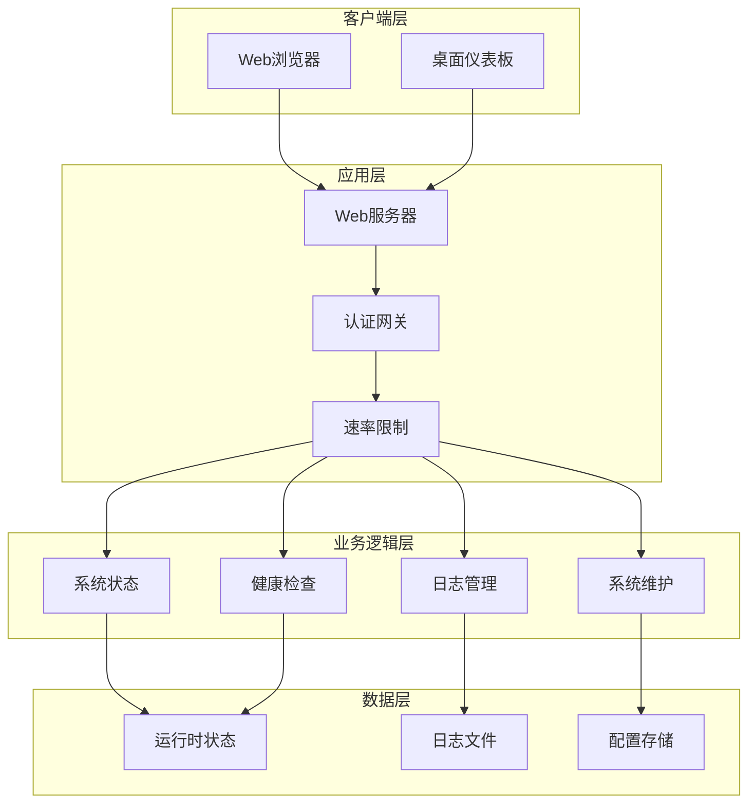
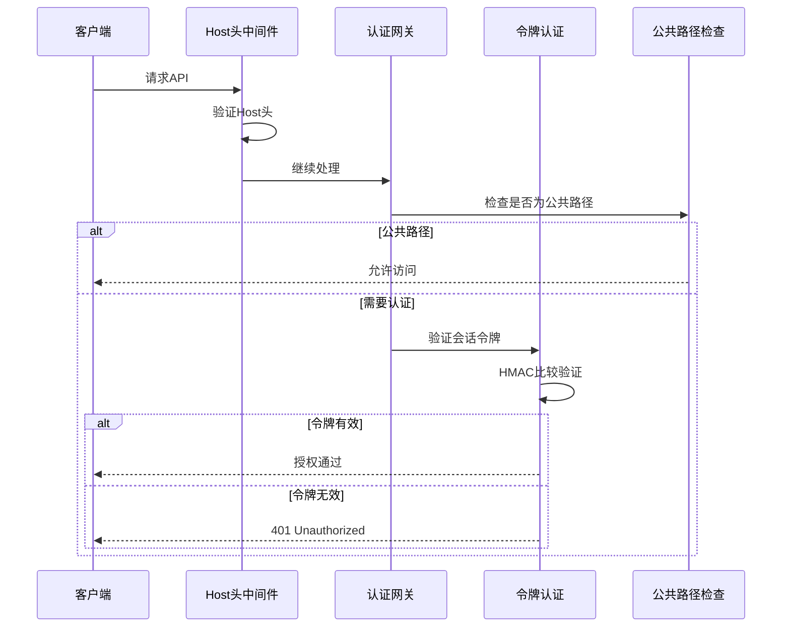
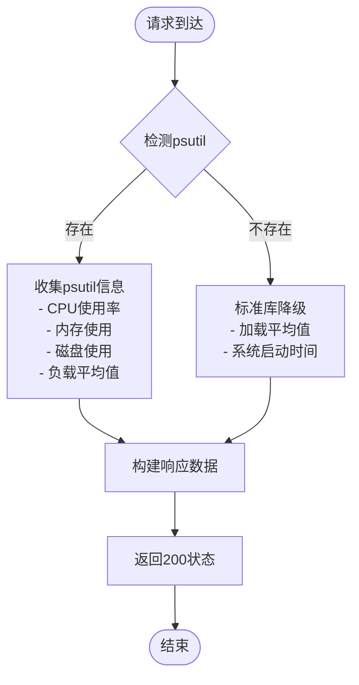
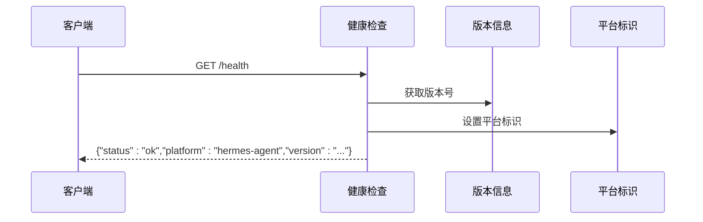
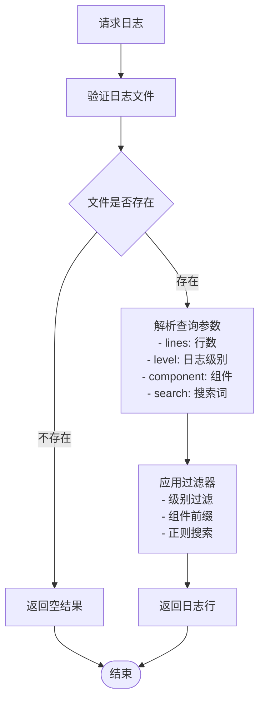
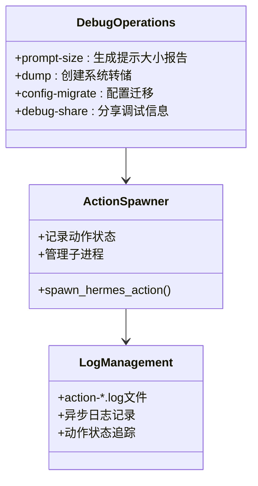
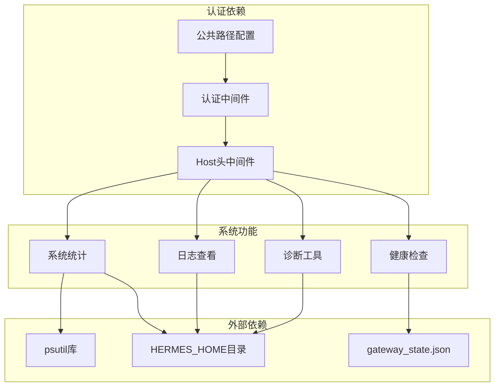

# 系统端点

<cite>
**本文档引用的文件**
- [hermes_cli/web_server.py](file://hermes_cli/web_server.py)
- [gateway/platforms/api_server.py](file://gateway/platforms/api_server.py)
- [gateway/status.py](file://gateway/status.py)
- [tests/gateway/test_api_server.py](file://tests/gateway/test_api_server.py)
- [hermes_cli/dashboard_auth/public_paths.py](file://hermes_cli/dashboard_auth/public_paths.py)
- [hermes_cli/dashboard_auth/routes.py](file://hermes_cli/dashboard_auth/routes.py)
- [hermes_cli/dashboard_auth/middleware.py](file://hermes_cli/dashboard_auth/middleware.py)
- [hermes_cli/logs.py](file://hermes_cli/logs.py)
- [hermes_logging.py](file://hermes_logging.py)
</cite>

## 目录
1. [简介](#简介)
2. [项目结构](#项目结构)
3. [核心组件](#核心组件)
4. [架构概览](#架构概览)
5. [详细组件分析](#详细组件分析)
6. [依赖关系分析](#依赖关系分析)
7. [性能考虑](#性能考虑)
8. [故障排除指南](#故障排除指南)
9. [结论](#结论)

## 简介

本文档详细记录了Hermes Agent系统的端点API规范，包括系统状态查询、健康检查、日志管理和系统维护等核心功能。系统提供了完整的REST API接口，支持本地化部署和远程访问，具备完善的安全控制机制和性能监控能力。

## 项目结构

系统端点主要分布在以下模块中：

**图表来源**
- [hermes_cli/web_server.py:179-428](file://hermes_cli/web_server.py#L179-L428)
- [gateway/platforms/api_server.py:1-800](file://gateway/platforms/api_server.py#L1-L800)

**章节来源**
- [hermes_cli/web_server.py:1-800](file://hermes_cli/web_server.py#L1-L800)
- [gateway/platforms/api_server.py:1-800](file://gateway/platforms/api_server.py#L1-L800)

## 核心组件

### 系统状态查询端点

系统提供了两个主要的状态查询端点：

1. **GET /api/system/stats** - 获取系统统计信息
2. **GET /api/system/info** - 获取系统信息

这些端点提供主机操作系统、CPU、内存、磁盘使用情况等系统级信息。

### 健康检查端点

系统实现了多层次的健康检查机制：

1. **GET /health** - 基础健康检查
2. **GET /health/detailed** - 详细运行时状态检查

### 日志管理端点

提供完整的日志管理功能：

1. **GET /api/logs** - 获取日志内容
2. **POST /api/logs/clear** - 清除日志

### 系统维护端点

支持系统维护操作：

1. **POST /api/ops/prompt-size** - 检查提示大小
2. **POST /api/ops/dump** - 生成系统转储
3. **POST /api/ops/config-migrate** - 配置迁移
4. **POST /api/ops/debug-share** - 调试信息分享

**章节来源**
- [hermes_cli/web_server.py:1830-1908](file://hermes_cli/web_server.py#L1830-L1908)
- [hermes_cli/web_server.py:6910-6961](file://hermes_cli/web_server.py#L6910-L6961)
- [hermes_cli/web_server.py:2024-2093](file://hermes_cli/web_server.py#L2024-L2093)

## 架构概览

系统采用分层架构设计，确保安全性、可扩展性和易维护性：

**图表来源**
- [hermes_cli/web_server.py:368-428](file://hermes_cli/web_server.py#L368-L428)
- [gateway/status.py:58-61](file://gateway/status.py#L58-L61)

## 详细组件分析

### 认证与授权机制

系统实现了多层安全防护机制：

**图表来源**
- [hermes_cli/web_server.py:368-428](file://hermes_cli/web_server.py#L368-L428)
- [hermes_cli/web_server.py:234-294](file://hermes_cli/web_server.py#L234-L294)

#### 会话令牌管理

系统使用基于HMAC的会话令牌机制：

- **令牌生成**：随机URL安全令牌
- **令牌验证**：HMAC比较防止时序攻击
- **支持的头部**：`X-Hermes-Session-Token` 和 `Authorization: Bearer`
- **查询参数支持**：`?token=` 参数用于下载链接

#### 主机头防护

防御DNS重绑定攻击：

- 仅接受绑定到服务器的主机名
- 支持IPv4/IPv6地址格式
- 防止跨域攻击

**章节来源**
- [hermes_cli/web_server.py:200-399](file://hermes_cli/web_server.py#L200-L399)
- [hermes_cli/web_server.py:368-428](file://hermes_cli/web_server.py#L368-L428)

### 系统状态查询

#### GET /api/system/stats 实现

该端点提供详细的系统统计信息：

**图表来源**
- [hermes_cli/web_server.py:1830-1908](file://hermes_cli/web_server.py#L1830-L1908)

#### 返回数据结构

系统统计信息包含以下字段：

- **基础系统信息**：操作系统版本、Python版本、主机名
- **硬件信息**：CPU核心数、架构类型
- **内存信息**：总内存、可用内存、使用量、百分比
- **磁盘信息**：HERMES_HOME目录的磁盘使用情况
- **性能指标**：CPU使用率、系统负载、运行时间
- **进程信息**：当前进程的内存使用、线程数等

**章节来源**
- [hermes_cli/web_server.py:1830-1908](file://hermes_cli/web_server.py#L1830-L1908)

### 健康检查机制

#### 基础健康检查

**GET /health** 端点提供服务可用性检查：

**图表来源**
- [tests/gateway/test_api_server.py:490-525](file://tests/gateway/test_api_server.py#L490-L525)

#### 详细健康检查

**GET /health/detailed** 提供运行时状态详情：

- **网关状态**：运行状态、退出原因
- **平台连接**：各平台连接状态
- **活跃代理**：当前活跃的代理数量
- **进程信息**：PID、更新时间等
- **平台特定状态**：各平台的详细状态信息

**章节来源**
- [tests/gateway/test_api_server.py:527-577](file://tests/gateway/test_api_server.py#L527-L577)
- [gateway/status.py:518-549](file://gateway/status.py#L518-L549)

### 日志管理系统

#### 日志查看端点

**GET /api/logs** 提供灵活的日志过滤功能：

**图表来源**
- [hermes_cli/web_server.py:6910-6961](file://hermes_cli/web_server.py#L6910-L6961)

#### 日志过滤功能

支持多种过滤条件：

- **日志级别**：DEBUG/INFO/WARNING/ERROR
- **组件过滤**：按组件前缀过滤
- **文本搜索**：全文本搜索（不区分大小写）
- **行数限制**：最多500行

#### 日志文件管理

系统支持多个预定义的日志文件：

- **agent.log**：主代理日志
- **gateway.log**：网关相关日志  
- **errors.log**：错误日志
- **其他系统日志**：根据配置动态添加

**章节来源**
- [hermes_cli/web_server.py:6910-6961](file://hermes_cli/web_server.py#L6910-L6961)
- [hermes_cli/logs.py](file://hermes_cli/logs.py)

### 系统维护操作

#### 调试和诊断

系统提供多种诊断工具：

**图表来源**
- [hermes_cli/web_server.py:2024-2093](file://hermes_cli/web_server.py#L2024-L2093)
- [hermes_cli/web_server.py:2156-2195](file://hermes_cli/web_server.py#L2156-L2195)

#### 后台操作执行

所有维护操作都以后台进程方式执行：

- **异步执行**：不阻塞HTTP请求
- **日志记录**：每个操作都有专用日志文件
- **状态追踪**：可以查询操作执行状态
- **资源隔离**：独立的进程空间和环境变量

**章节来源**
- [hermes_cli/web_server.py:2024-2093](file://hermes_cli/web_server.py#L2024-L2093)
- [hermes_cli/web_server.py:2156-2195](file://hermes_cli/web_server.py#L2156-L2195)

## 依赖关系分析

系统端点之间的依赖关系如下：

**图表来源**
- [hermes_cli/web_server.py:229-231](file://hermes_cli/web_server.py#L229-L231)
- [hermes_cli/web_server.py:368-428](file://hermes_cli/web_server.py#L368-L428)

**章节来源**
- [hermes_cli/web_server.py:229-231](file://hermes_cli/web_server.py#L229-L231)
- [hermes_cli/web_server.py:368-428](file://hermes_cli/web_server.py#L368-L428)

## 性能考虑

### 速率限制机制

系统实现了多层速率限制：

1. **环境变量配置**：`HERMES_REVEAL_RATE_LIMIT` 控制每30秒最大尝试次数
2. **内存存储**：使用列表存储时间戳，支持快速计算
3. **滑动窗口**：基于30秒窗口期的动态限制

### 资源优化策略

- **延迟加载**：psutil库按需导入，不存在时自动降级
- **缓存机制**：运行时状态信息缓存，减少文件I/O
- **异步处理**：后台操作使用异步执行，避免阻塞主线程
- **内存管理**：及时清理临时数据结构，防止内存泄漏

## 故障排除指南

### 常见问题诊断

#### 认证失败排查

1. **检查会话令牌**
   - 确认请求头包含正确的 `X-Hermes-Session-Token`
   - 验证令牌格式和有效期

2. **Host头验证失败**
   - 确认请求使用正确的主机名
   - 检查IPv4/IPv6地址格式

3. **公共路径访问**
   - 确认端点在公共路径列表中
   - 检查路由配置

#### 健康检查问题

1. **基础健康检查失败**
   - 检查服务进程状态
   - 验证版本信息获取

2. **详细健康检查异常**
   - 检查 `gateway_state.json` 文件
   - 验证运行时状态权限

#### 日志查看问题

1. **日志文件不存在**
   - 检查HERMES_HOME目录权限
   - 验证日志文件路径

2. **过滤结果为空**
   - 检查过滤参数的有效性
   - 确认日志文件内容

**章节来源**
- [tests/gateway/test_api_server.py:490-577](file://tests/gateway/test_api_server.py#L490-L577)
- [hermes_cli/web_server.py:368-428](file://hermes_cli/web_server.py#L368-L428)

## 结论

Hermes Agent系统提供了完整的企业级API端点解决方案，具有以下特点：

1. **安全性优先**：多层认证机制、Host头防护、速率限制
2. **功能完整**：涵盖系统监控、健康检查、日志管理、系统维护
3. **易于使用**：清晰的API设计、完善的错误处理、详细的文档
4. **可扩展性**：模块化设计、灵活的配置选项、良好的性能表现

系统端点设计充分考虑了生产环境的需求，提供了可靠的监控、诊断和维护能力，是构建企业级AI代理系统的理想选择。