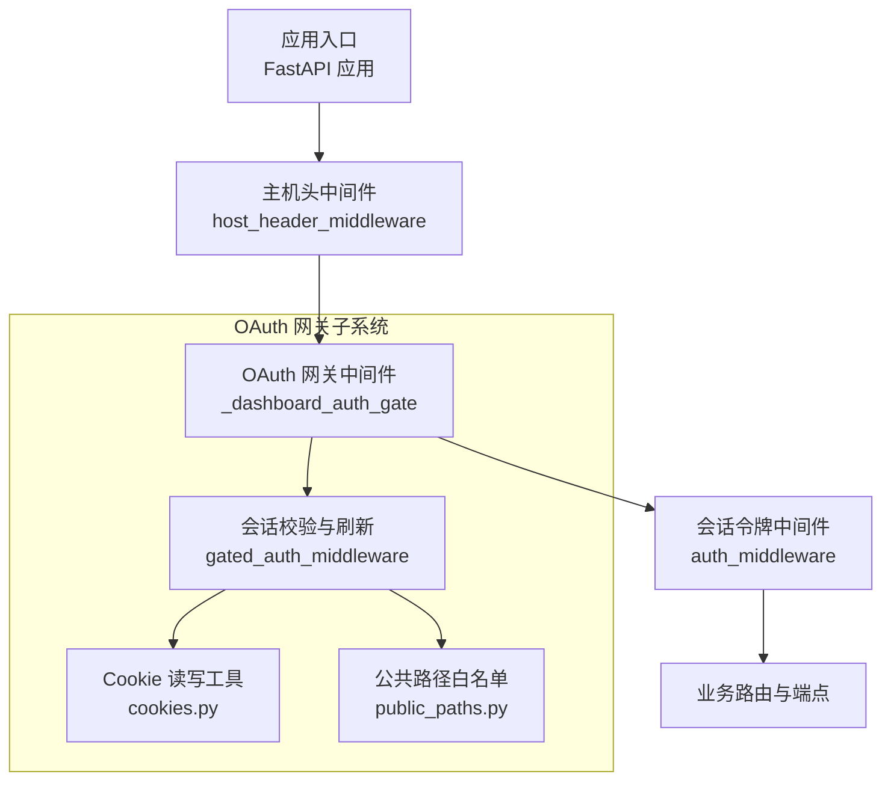
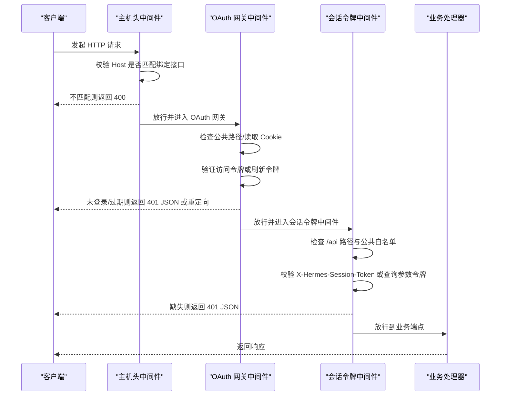
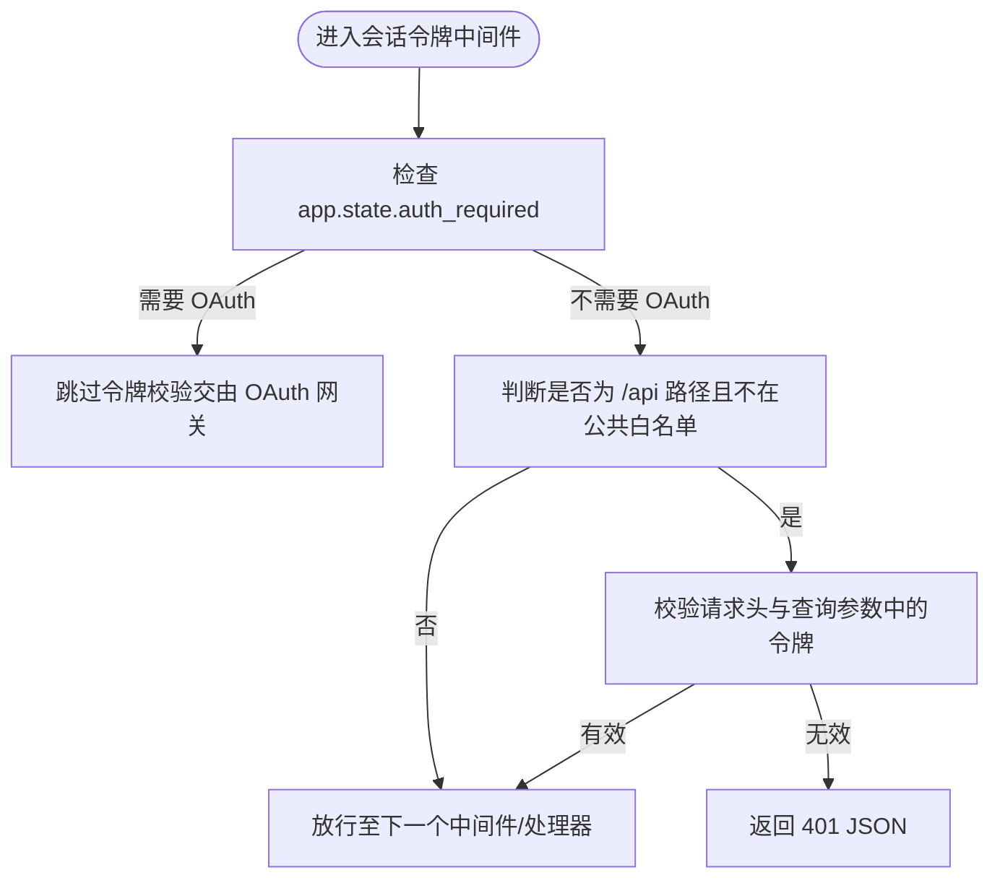
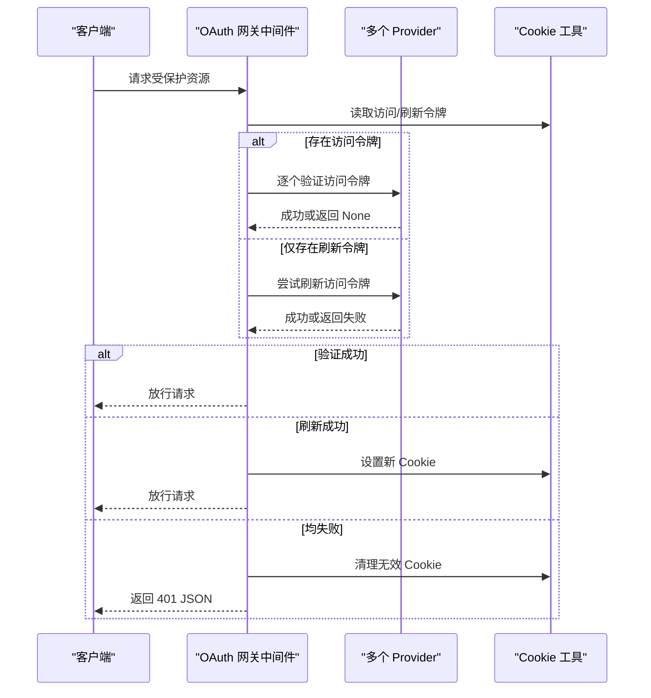
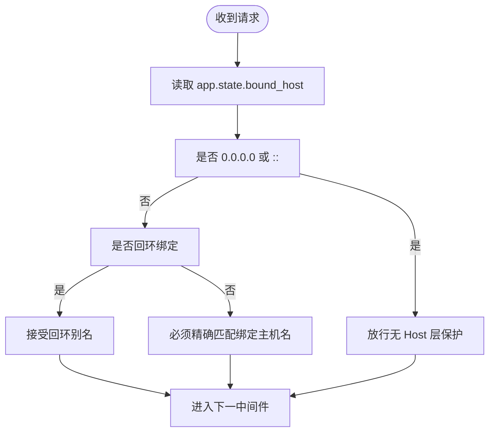
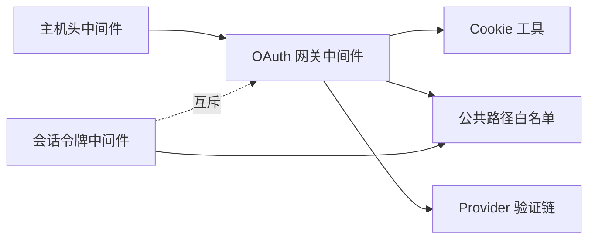

# 认证与授权

<cite>
**本文引用的文件**
- [hermes_cli/web_server.py](file://hermes_cli/web_server.py)
- [hermes_cli/dashboard_auth/middleware.py](file://hermes_cli/dashboard_auth/middleware.py)
- [hermes_cli/dashboard_auth/public_paths.py](file://hermes_cli/dashboard_auth/public_paths.py)
- [hermes_cli/dashboard_auth/cookies.py](file://hermes_cli/dashboard_auth/cookies.py)
- [tests/hermes_cli/test_web_server_host_header.py](file://tests/hermes_cli/test_web_server_host_header.py)
- [apps/desktop/electron/connection-config.cjs](file://apps/desktop/electron/connection-config.cjs)
- [tests/hermes_cli/test_dashboard_auth_401_reauth.py](file://tests/hermes_cli/test_dashboard_auth_401_reauth.py)
- [tools/url_safety.py](file://tools/url_safety.py)
</cite>

## 目录
1. [简介](#简介)
2. [项目结构](#项目结构)
3. [核心组件](#核心组件)
4. [架构总览](#架构总览)
5. [详细组件分析](#详细组件分析)
6. [依赖分析](#依赖分析)
7. [性能考虑](#性能考虑)
8. [故障排查指南](#故障排查指南)
9. [结论](#结论)
10. [附录](#附录)

## 简介
本文件系统性阐述 Hermes Agent 的 REST API 认证与授权方案，覆盖两类机制：
- 会话令牌认证（基于 X-Hermes-Session-Token 头部或查询参数令牌）
- OAuth 认证（基于 Cookie 会话的网关保护）

同时涵盖以下安全与工程要点：
- Host 头验证机制，防御 DNS 重绑定攻击
- 公共路径白名单机制
- 中间件执行顺序与优先级
- 认证失败的错误处理与安全防护
- 实际请求示例与最佳实践

## 项目结构
认证与授权相关的核心代码分布在以下模块：
- 主机头与会话令牌中间件：web_server.py
- OAuth 网关保护与 Cookie 管理：dashboard_auth/*
- 白名单路径定义：dashboard_auth/public_paths.py
- 测试用例：tests/hermes_cli/test_web_server_host_header.py、tests/hermes_cli/test_dashboard_auth_401_reauth.py

图表来源
- [hermes_cli/web_server.py:368-429](file://hermes_cli/web_server.py#L368-L429)
- [hermes_cli/dashboard_auth/middleware.py:172-311](file://hermes_cli/dashboard_auth/middleware.py#L172-L311)
- [hermes_cli/dashboard_auth/public_paths.py:33-49](file://hermes_cli/dashboard_auth/public_paths.py#L33-L49)
- [hermes_cli/dashboard_auth/cookies.py:128-237](file://hermes_cli/dashboard_auth/cookies.py#L128-L237)

章节来源
- [hermes_cli/web_server.py:368-429](file://hermes_cli/web_server.py#L368-L429)
- [hermes_cli/dashboard_auth/middleware.py:172-311](file://hermes_cli/dashboard_auth/middleware.py#L172-L311)
- [hermes_cli/dashboard_auth/public_paths.py:33-49](file://hermes_cli/dashboard_auth/public_paths.py#L33-L49)
- [hermes_cli/dashboard_auth/cookies.py:128-237](file://hermes_cli/dashboard_auth/cookies.py#L128-L237)

## 核心组件
- 主机头验证中间件（Host Header Validation Middleware）
  - 作用：在非 loopback 绑定时拒绝与绑定接口不一致的 Host 请求，防御 DNS 重绑定攻击
  - 关键逻辑：根据绑定主机判断是否接受请求的 Host 值
- OAuth 网关中间件（Dashboard Auth Gate Middleware）
  - 作用：当需要启用 OAuth 时，拦截所有受保护路径，要求有效的会话 Cookie；支持透明刷新与跨 Provider 验证
- 会话令牌中间件（Legacy Session Token Middleware）
  - 作用：在 loopback 或禁用 OAuth 模式下，对 /api 路由要求 X-Hermes-Session-Token 或查询参数令牌
- Cookie 工具（Session Cookies Utilities）
  - 作用：统一设置/读取/清理会话 Cookie，支持多种前缀变体与路径策略
- 公共路径白名单（Public API Paths）
  - 作用：确保健康检查与只读端点无需认证

章节来源
- [hermes_cli/web_server.py:324-395](file://hermes_cli/web_server.py#L324-L395)
- [hermes_cli/dashboard_auth/middleware.py:172-311](file://hermes_cli/dashboard_auth/middleware.py#L172-L311)
- [hermes_cli/web_server.py:413-429](file://hermes_cli/web_server.py#L413-L429)
- [hermes_cli/dashboard_auth/cookies.py:128-237](file://hermes_cli/dashboard_auth/cookies.py#L128-L237)
- [hermes_cli/dashboard_auth/public_paths.py:33-49](file://hermes_cli/dashboard_auth/public_paths.py#L33-L49)

## 架构总览
下图展示认证与授权在请求生命周期中的位置与交互：

图表来源
- [hermes_cli/web_server.py:368-429](file://hermes_cli/web_server.py#L368-L429)
- [hermes_cli/dashboard_auth/middleware.py:172-311](file://hermes_cli/dashboard_auth/middleware.py#L172-L311)
- [hermes_cli/dashboard_auth/public_paths.py:33-49](file://hermes_cli/dashboard_auth/public_paths.py#L33-L49)

## 详细组件分析

### 会话令牌认证（X-Hermes-Session-Token 与查询参数）
- 触发条件
  - 当应用状态标记为“不需要 OAuth”时，会话令牌中间件生效
  - 对 /api 路由（除公共白名单）强制要求有效令牌
- 令牌来源
  - 请求头：X-Hermes-Session-Token
  - 查询参数：支持通过查询参数传递令牌，便于下载链接等场景
- 错误处理
  - 缺少令牌时返回 401 JSON，内容包含“Unauthorized”
- 安全建议
  - 生产环境避免使用查询参数令牌，优先使用请求头
  - 令牌应短生命周期、定期轮换

图表来源
- [hermes_cli/web_server.py:413-429](file://hermes_cli/web_server.py#L413-L429)
- [hermes_cli/dashboard_auth/public_paths.py:33-49](file://hermes_cli/dashboard_auth/public_paths.py#L33-L49)

章节来源
- [hermes_cli/web_server.py:413-429](file://hermes_cli/web_server.py#L413-L429)
- [hermes_cli/dashboard_auth/public_paths.py:33-49](file://hermes_cli/dashboard_auth/public_paths.py#L33-L49)

### OAuth 认证（Cookie 会话网关保护）
- 触发条件
  - 当主机头中间件判定需启用 OAuth（非 loopback 且未允许公开访问）时，OAuth 网关中间件生效
- 会话流程
  - 读取 Cookie（访问令牌与刷新令牌）
  - 若存在访问令牌：按注册顺序尝试各 Provider 验证
  - 若访问令牌缺失但存在刷新令牌：尝试透明刷新
  - 若均失败：返回 401 JSON，并清理无效 Cookie
- Cookie 策略
  - 支持多种名称变体（含 __Host-/__Secure- 前缀），自动读取与设置
  - HTTPS 场景设置 Secure 属性；反向代理前缀部署使用 __Secure- 并显式 Path
- 错误处理
  - Provider 不可达：返回 503
  - 令牌无效/过期：返回 401 JSON，携带 login_url 以便前端跳转登录
  - 清理无效 Cookie，避免浏览器重复发送

图表来源
- [hermes_cli/dashboard_auth/middleware.py:172-311](file://hermes_cli/dashboard_auth/middleware.py#L172-L311)
- [hermes_cli/dashboard_auth/cookies.py:128-237](file://hermes_cli/dashboard_auth/cookies.py#L128-L237)

章节来源
- [hermes_cli/dashboard_auth/middleware.py:172-311](file://hermes_cli/dashboard_auth/middleware.py#L172-L311)
- [hermes_cli/dashboard_auth/cookies.py:128-237](file://hermes_cli/dashboard_auth/cookies.py#L128-L237)

### Host 头验证与 DNS 重绑定防护
- 核心目标：阻止攻击者利用 DNS TTL 反弹将域名解析到本地回环地址，绕过同源/CORS 限制
- 判定规则
  - 绑定到 0.0.0.0 或 ::：视为明确开放，不再做 Host 层面保护
  - 绑定到回环地址：仅接受回环别名（如 localhost、127.0.0.1、[::1]）
  - 绑定到特定非回环主机名：要求 Host 必须完全匹配
- WebSocket 升级同样遵循相同边界约束

图表来源
- [hermes_cli/web_server.py:324-395](file://hermes_cli/web_server.py#L324-L395)
- [tests/hermes_cli/test_web_server_host_header.py:22-148](file://tests/hermes_cli/test_web_server_host_header.py#L22-L148)

章节来源
- [hermes_cli/web_server.py:324-395](file://hermes_cli/web_server.py#L324-L395)
- [tests/hermes_cli/test_web_server_host_header.py:22-148](file://tests/hermes_cli/test_web_server_host_header.py#L22-L148)

### 公共路径白名单机制
- 目标：确保健康检查与只读端点无需认证
- 路径范围
  - /api/status、/api/config/defaults、/api/config/schema、/api/model/info、/api/dashboard/themes、/api/dashboard/plugins
- 两层保护
  - OAuth 网关：直接放行
  - 会话令牌中间件：与公共白名单保持一致，避免漂移导致行为不一致

章节来源
- [hermes_cli/dashboard_auth/public_paths.py:33-49](file://hermes_cli/dashboard_auth/public_paths.py#L33-L49)
- [hermes_cli/web_server.py:413-429](file://hermes_cli/web_server.py#L413-L429)

### 中间件执行顺序与优先级
- 注册顺序
  - 主机头中间件 → OAuth 网关中间件 → 会话令牌中间件
- 语义优先级
  - 主机头中间件最先阻断潜在重绑定风险
  - OAuth 网关中间件在需要时接管认证职责
  - 会话令牌中间件仅在 loopback 或禁用 OAuth 模式下生效

章节来源
- [hermes_cli/web_server.py:398-429](file://hermes_cli/web_server.py#L398-L429)

### Cookie 与会话管理细节
- 名称变体
  - hermes_session_at、hermes_session_rt、hermes_session_pkce
  - 支持 __Host-、__Secure-、空名三种变体，读取时按严格顺序回退
- 路径与安全属性
  - 直接部署：Path=/，HTTPS 时设置 Secure
  - 反代前缀：Path=<prefix>，使用 __Secure- 前缀
- 刷新与透明旋转
  - 访问令牌过期但刷新令牌有效时，服务端自动旋转并更新 Cookie
  - 刷新失败且刷新令牌已失效/被撤销：清理 Cookie 并引导重新登录

章节来源
- [hermes_cli/dashboard_auth/cookies.py:64-237](file://hermes_cli/dashboard_auth/cookies.py#L64-L237)
- [hermes_cli/dashboard_auth/middleware.py:326-367](file://hermes_cli/dashboard_auth/middleware.py#L326-L367)

### 认证失败的错误处理与安全防护
- OAuth 失败
  - 401 JSON：携带 login_url，前端可据此跳转登录页
  - 503：Provider 不可达时返回，避免强制用户重新登录
  - 清理无效 Cookie，防止浏览器持续发送
- 会话令牌失败
  - 401 JSON：内容为“Unauthorized”
- 重定向与 SPA 导航
  - HTML 路由：302 至 /login
  - API 路由：401 JSON，避免浏览器跟随 302 导致跨域问题
- “next” 参数安全
  - 仅允许同源相对路径，绝对 URL 与协议相对 URL 将被丢弃
  - 排除 /api/*、/auth/*、/login 等路径，防止循环跳转

章节来源
- [hermes_cli/dashboard_auth/middleware.py:81-170](file://hermes_cli/dashboard_auth/middleware.py#L81-L170)
- [tests/hermes_cli/test_dashboard_auth_401_reauth.py:378-406](file://tests/hermes_cli/test_dashboard_auth_401_reauth.py#L378-L406)

### 认证请求示例与最佳实践
- 会话令牌认证（推荐使用请求头）
  - 请求头：X-Hermes-Session-Token: <token>
  - 适用场景：后端服务调用、脚本自动化
- 会话令牌认证（查询参数，谨慎使用）
  - 查询参数：?token=<token>
  - 适用场景：临时下载链接、调试
- OAuth 认证（Cookie）
  - 通过浏览器登录后，Cookie 自动携带
  - 支持透明刷新：访问令牌过期时自动以刷新令牌换取新令牌
- 最佳实践
  - 生产环境启用 OAuth 网关中间件，避免使用查询参数令牌
  - HTTPS 部署时确保 Cookie 设置 Secure 属性
  - 使用反代前缀时采用 __Secure- 前缀并显式 Path
  - 定期轮换令牌，缩短访问令牌生命周期

章节来源
- [hermes_cli/web_server.py:413-429](file://hermes_cli/web_server.py#L413-L429)
- [hermes_cli/dashboard_auth/cookies.py:128-237](file://hermes_cli/dashboard_auth/cookies.py#L128-L237)
- [apps/desktop/electron/connection-config.cjs:217-231](file://apps/desktop/electron/connection-config.cjs#L217-L231)

## 依赖分析
- 中间件耦合
  - 主机头中间件独立于认证，优先执行
  - OAuth 网关中间件依赖 Cookie 工具与公共路径白名单
  - 会话令牌中间件与 OAuth 网关互斥（当 OAuth 启用时跳过）
- 外部集成点
  - Provider 验证链：可叠加多个 Provider，首个识别的令牌即生效
  - 反代前缀：通过 X-Forwarded-Prefix 影响 Cookie 路径与前缀选择

图表来源
- [hermes_cli/web_server.py:398-429](file://hermes_cli/web_server.py#L398-L429)
- [hermes_cli/dashboard_auth/middleware.py:172-311](file://hermes_cli/dashboard_auth/middleware.py#L172-L311)
- [hermes_cli/dashboard_auth/public_paths.py:33-49](file://hermes_cli/dashboard_auth/public_paths.py#L33-L49)
- [hermes_cli/dashboard_auth/cookies.py:128-237](file://hermes_cli/dashboard_auth/cookies.py#L128-L237)

章节来源
- [hermes_cli/web_server.py:398-429](file://hermes_cli/web_server.py#L398-L429)
- [hermes_cli/dashboard_auth/middleware.py:172-311](file://hermes_cli/dashboard_auth/middleware.py#L172-L311)
- [hermes_cli/dashboard_auth/public_paths.py:33-49](file://hermes_cli/dashboard_auth/public_paths.py#L33-L49)
- [hermes_cli/dashboard_auth/cookies.py:128-237](file://hermes_cli/dashboard_auth/cookies.py#L128-L237)

## 性能考虑
- OAuth 验证链
  - 令牌识别失败时继续尝试其他 Provider，避免单点失败
  - Provider 不可达时不强制用户登录，返回 503 以便后续重试
- 透明刷新
  - 访问令牌过期时优先尝试刷新，减少用户感知的登录中断
- Cookie 写入
  - 刷新成功后立即设置新 Cookie，避免后续请求重复刷新

[本节为通用指导，不涉及具体文件分析]

## 故障排查指南
- 400 错误（Invalid Host header）
  - 现象：请求被主机头中间件拒绝
  - 原因：Host 与绑定接口不一致
  - 处理：确认服务绑定主机名或使用正确的反代前缀
- 401 错误（Unauthorized）
  - OAuth：检查 Cookie 是否存在且有效；必要时重新登录
  - 会话令牌：检查请求头或查询参数中的令牌是否正确
- 503 错误（Auth provider unreachable）
  - 现象：Provider 不可达
  - 处理：稍后重试，或切换到其他 Provider
- 下载链接无法访问
  - 现象：带查询参数令牌的下载链接 401
  - 处理：优先改用请求头携带令牌；若必须使用查询参数，请确保 URL 未泄露给第三方

章节来源
- [hermes_cli/web_server.py:368-395](file://hermes_cli/web_server.py#L368-L395)
- [hermes_cli/dashboard_auth/middleware.py:81-170](file://hermes_cli/dashboard_auth/middleware.py#L81-L170)
- [tests/hermes_cli/test_web_server_host_header.py:87-148](file://tests/hermes_cli/test_web_server_host_header.py#L87-L148)

## 结论
该认证体系通过“主机头验证 + OAuth 网关 + 会话令牌”的分层设计，在保证安全性的同时兼顾易用性：
- Host 头验证有效防御 DNS 重绑定
- OAuth 网关提供强认证与透明刷新
- 会话令牌中间件为 loopback 或禁用 OAuth 提供兼容
- 公共路径白名单确保健康检查与只读端点可用
- Cookie 工具与测试用例共同保障实现的健壮性

[本节为总结性内容，不涉及具体文件分析]

## 附录
- URL 安全与私有地址防护
  - 在内部网络访问中，系统对私有地址解析与访问进行额外控制，防止 SSRF 与内网探测
- 反向代理与前缀部署
  - 通过 X-Forwarded-Prefix 与 Cookie 前缀/路径策略，确保多环境一致性

章节来源
- [tools/url_safety.py:339-370](file://tools/url_safety.py#L339-L370)