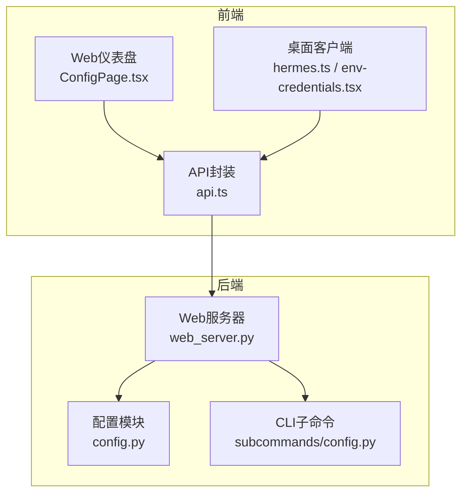
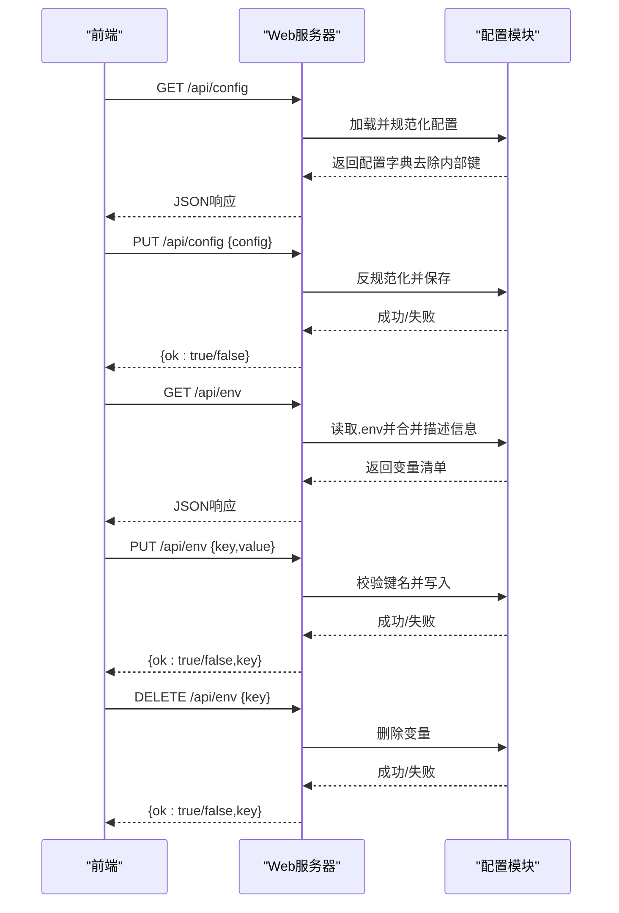
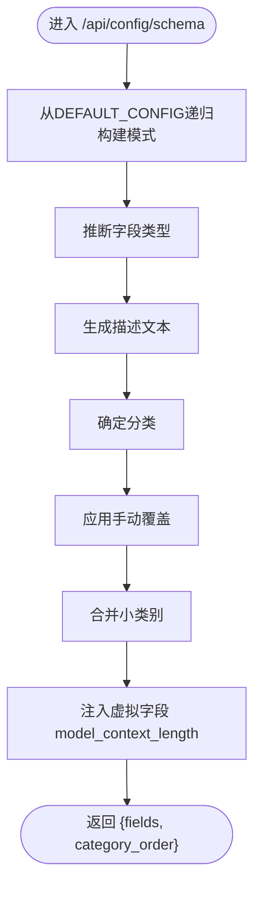
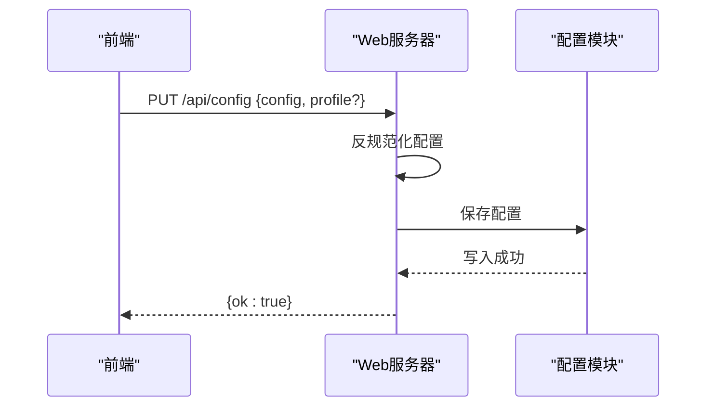
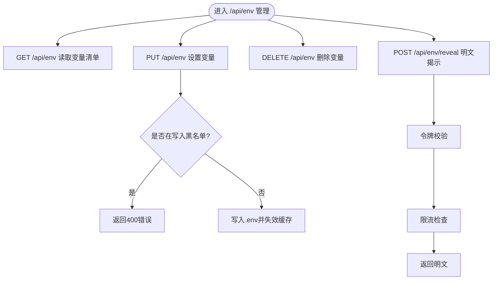
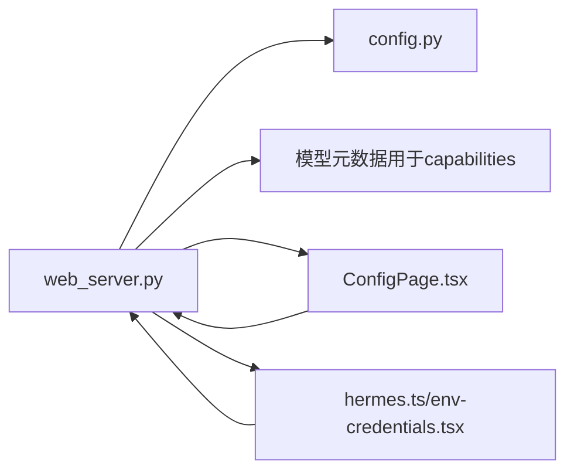

# 配置管理

<cite>
**本文档引用的文件**
- [web_server.py](file://hermes_cli/web_server.py)
- [config.py](file://hermes_cli/config.py)
- [config.py](file://hermes_cli/subcommands/config.py)
- [api.ts](file://web/src/lib/api.ts)
- [ConfigPage.tsx](file://web/src/pages/ConfigPage.tsx)
- [env-credentials.tsx](file://apps/desktop/src/app/settings/env-credentials.tsx)
- [hermes.ts](file://apps/desktop/src/hermes.ts)
- [web-dashboard.md](file://website/docs/user-guide/features/web-dashboard.md)
</cite>

## 目录
1. [简介](#简介)
2. [项目结构](#项目结构)
3. [核心组件](#核心组件)
4. [架构总览](#架构总览)
5. [详细组件分析](#详细组件分析)
6. [依赖关系分析](#依赖关系分析)
7. [性能考量](#性能考量)
8. [故障排除指南](#故障排除指南)
9. [结论](#结论)

## 简介
本文件系统化梳理配置管理API，覆盖以下能力：
- 配置读取：获取完整配置、默认值、字段模式与分类顺序
- 配置更新：通过REST接口更新配置
- 配置重置：通过专用端点重置配置
- 环境变量管理：获取、设置、删除与明文揭示
- 配置验证与迁移：字段类型推断、分类显示、虚拟字段处理、版本检查与迁移策略

该文档面向前端与后端开发者，既提供技术细节也提供可操作的使用建议。

## 项目结构
配置管理相关代码分布在以下模块：
- Web服务器层：定义REST端点、模型校验、模式生成与虚拟字段注入
- 配置加载/保存层：负责配置文件与.env的读写、缓存、迁移与安全策略
- 前端集成层：Web仪表盘与桌面客户端对API的调用封装

图表来源
- [web_server.py](file://hermes_cli/web_server.py)
- [config.py](file://hermes_cli/config.py)
- [config.py](file://hermes_cli/subcommands/config.py)
- [api.ts](file://web/src/lib/api.ts)
- [ConfigPage.tsx](file://web/src/pages/ConfigPage.tsx)
- [env-credentials.tsx](file://apps/desktop/src/app/settings/env-credentials.tsx)
- [hermes.ts](file://apps/desktop/src/hermes.ts)

章节来源
- [web_server.py](file://hermes_cli/web_server.py)
- [config.py](file://hermes_cli/config.py)
- [config.py](file://hermes_cli/subcommands/config.py)
- [api.ts](file://web/src/lib/api.ts)
- [ConfigPage.tsx](file://web/src/pages/ConfigPage.tsx)
- [env-credentials.tsx](file://apps/desktop/src/app/settings/env-credentials.tsx)
- [hermes.ts](file://apps/desktop/src/hermes.ts)

## 核心组件
- 配置读取端点
  - GET /api/config：返回当前配置（已去除内部键），并注入虚拟字段model_context_length
  - GET /api/config/defaults：返回默认配置树
  - GET /api/config/schema：返回字段模式与分类顺序
- 配置更新端点
  - PUT /api/config：接收配置对象并持久化
- 环境变量管理端点
  - GET /api/env：返回环境变量清单（含描述、分类、是否密码等）
  - PUT /api/env：设置或更新环境变量（带写入白名单与安全校验）
  - DELETE /api/env：删除指定环境变量
  - POST /api/env/reveal：在令牌与限流保护下返回明文（用于调试）

章节来源
- [web_server.py](file://hermes_cli/web_server.py)
- [config.py](file://hermes_cli/config.py)

## 架构总览
配置管理API采用“模式驱动 + 虚拟字段 + 安全约束”的设计：
- 模式生成：从默认配置树递归构建字段类型、描述与分类，并合并手动覆盖与小类别合并
- 虚拟字段：将model_context_length作为顶层字段注入，便于UI编辑
- 安全约束：禁止写入敏感环境变量名；对.env进行行级清洗与缓存；对敏感操作（如reveal）施加令牌与限流

图表来源
- [web_server.py](file://hermes_cli/web_server.py)
- [config.py](file://hermes_cli/config.py)

## 详细组件分析

### 配置读取与模式生成
- GET /api/config
  - 行为：加载配置并规范化，移除内部键，注入虚拟字段model_context_length
  - 规范化逻辑：当model为字典时，提取default/name作为字符串，并将context_length提升到顶层
- GET /api/config/defaults
  - 行为：直接返回默认配置树
- GET /api/config/schema
  - 行为：返回字段模式与分类顺序
  - 模式生成规则：
    - 递归遍历默认配置树，为每个叶子节点推断类型并生成描述
    - 分类：优先取前缀第一段，否则为字典键或"general"
    - 手动覆盖：针对特定路径应用额外属性（如类型、是否高级）
    - 小类别合并：将细分子类别合并到父类别
    - 虚拟字段注入：在model后插入model_context_length，确保UI相邻展示

图表来源
- [web_server.py](file://hermes_cli/web_server.py)

章节来源
- [web_server.py](file://hermes_cli/web_server.py)

### 配置更新与反规范化
- PUT /api/config
  - 请求体：包含config与可选profile
  - 处理流程：
    - 进入profile作用域
    - 反规范化：将前端传回的扁平配置还原为后端期望结构（如model从字符串还原为字典，context_length写回model.dict）
    - 保存：写入配置文件并应用安全注释与权限控制

图表来源
- [web_server.py](file://hermes_cli/web_server.py)
- [config.py](file://hermes_cli/config.py)

章节来源
- [web_server.py](file://hermes_cli/web_server.py)
- [config.py](file://hermes_cli/config.py)

### 环境变量管理
- GET /api/env
  - 行为：读取.env并合并OPTIONAL_ENV_VARS中的描述信息，输出统一结构（是否设置、脱敏值、描述、分类、是否密码、工具列表、是否高级、是否被平台托管等）
- PUT /api/env
  - 行为：设置或更新环境变量
  - 安全校验：拒绝写入黑名单变量名（如PATH、LD_PRELOAD、PYTHONPATH等），并抛出400错误
- DELETE /api/env
  - 行为：删除指定变量
  - 错误处理：未找到时返回404
- POST /api/env/reveal
  - 行为：在令牌校验与限流保护下返回明文
  - 安全措施：会话令牌、固定时间窗口内的速率限制、审计日志

图表来源
- [web_server.py](file://hermes_cli/web_server.py)
- [config.py](file://hermes_cli/config.py)

章节来源
- [web_server.py](file://hermes_cli/web_server.py)
- [config.py](file://hermes_cli/config.py)

### 配置验证规则与字段类型推断
- 字段类型推断：基于默认配置树中叶子节点的实际值推断（字符串、整数、布尔、浮点、数组、对象等）
- 描述生成：将路径转换为自然语言描述（点号→箭头，下划线→空格，首字母大写）
- 分类映射：优先取路径前缀第一段，否则为字典键或"general"
- 手动覆盖：针对特定路径（如model_context_length）设置额外属性（如category、advanced）
- 小类别合并：将细分子类别合并到父类别，减少UI复杂度
- 虚拟字段：model_context_length在schema中显式注入，渲染时紧邻model字段

章节来源
- [web_server.py](file://hermes_cli/web_server.py)

### 分类显示与虚拟字段处理
- 分类顺序：category_order由后端维护，前端按顺序渲染
- 字段计数：前端根据schema统计各分类字段数量
- 虚拟字段：model_context_length在GET /api/config时注入，便于UI编辑上下文长度

章节来源
- [web_server.py](file://hermes_cli/web_server.py)
- [ConfigPage.tsx](file://web/src/pages/ConfigPage.tsx)

### 版本检查与迁移策略
- 配置版本：配置文件中包含_config_version字段，用于追踪迁移状态
- 迁移流程：
  - 自动补齐缺失字段：遍历DEFAULT_CONFIG，将缺失的键递归补全
  - 更新版本号：若存在新增字段或版本变更，则更新_config_version
  - 技能配置提示：扫描已启用技能声明的配置项，提示用户补充
- 保存策略：
  - 保留原始环境变量模板：当值未变化时，优先写回原始${VAR}模板而非展开后的明文
  - 注释区块：根据配置内容自动添加安全与回退模型等注释区块

章节来源
- [config.py](file://hermes_cli/config.py)

## 依赖关系分析
- Web服务器依赖配置模块进行读写与迁移
- 前端通过API封装统一调用后端端点
- 环境变量管理依赖OPTIONAL_ENV_VARS与黑名单策略
- 模式生成依赖DEFAULT_CONFIG与手动覆盖表

图表来源
- [web_server.py](file://hermes_cli/web_server.py)
- [config.py](file://hermes_cli/config.py)
- [ConfigPage.tsx](file://web/src/pages/ConfigPage.tsx)
- [hermes.ts](file://apps/desktop/src/hermes.ts)
- [env-credentials.tsx](file://apps/desktop/src/app/settings/env-credentials.tsx)

章节来源
- [web_server.py](file://hermes_cli/web_server.py)
- [config.py](file://hermes_cli/config.py)
- [ConfigPage.tsx](file://web/src/pages/ConfigPage.tsx)
- [hermes.ts](file://apps/desktop/src/hermes.ts)
- [env-credentials.tsx](file://apps/desktop/src/app/settings/env-credentials.tsx)

## 性能考量
- 配置读取缓存：配置与.env均采用基于(mtime,size)的进程内缓存，避免重复解析与深拷贝开销
- 模式生成：仅在启动或配置变更时重建，运行期复用
- 环境变量清洗：一次性扫描与分割，避免逐次解析带来的CPU消耗
- 异步写入：配置更新与环境变量写入在独立线程中执行，避免阻塞事件循环

## 故障排除指南
- PUT /api/config 返回500
  - 可能原因：配置解析失败、磁盘写入异常、并发锁竞争
  - 排查步骤：查看后端日志；确认配置文件语法；检查磁盘权限
- PUT /api/env 返回400
  - 可能原因：变量名在黑名单中（如PATH、LD_PRELOAD等）
  - 解决方案：更换变量名或直接编辑~/.hermes/.env
- DELETE /api/env 返回404
  - 可能原因：变量不存在于.env
  - 解决方案：确认变量名拼写或先通过GET /api/env确认是否存在
- POST /api/env/reveal 返回401/429
  - 可能原因：令牌无效或超出限流
  - 解决方案：重新登录获取令牌；等待限流窗口恢复

章节来源
- [web_server.py](file://hermes_cli/web_server.py)

## 结论
本配置管理API以“模式驱动 + 虚拟字段 + 安全约束”为核心设计，兼顾易用性与安全性。通过完善的字段类型推断、分类显示与版本迁移机制，前端可以直观地编辑配置，同时后端严格保障环境变量的安全性与配置文件的稳定性。建议在生产环境中：
- 使用GET /api/config/schema与GET /api/config/defaults进行前端UI渲染与默认值回填
- 通过PUT /api/config进行批量配置更新，并在失败时回滚
- 对敏感环境变量采用POST /api/env/reveal进行临时明文核验，避免长期暴露
- 定期运行配置检查与迁移，确保新版本特性正确生效