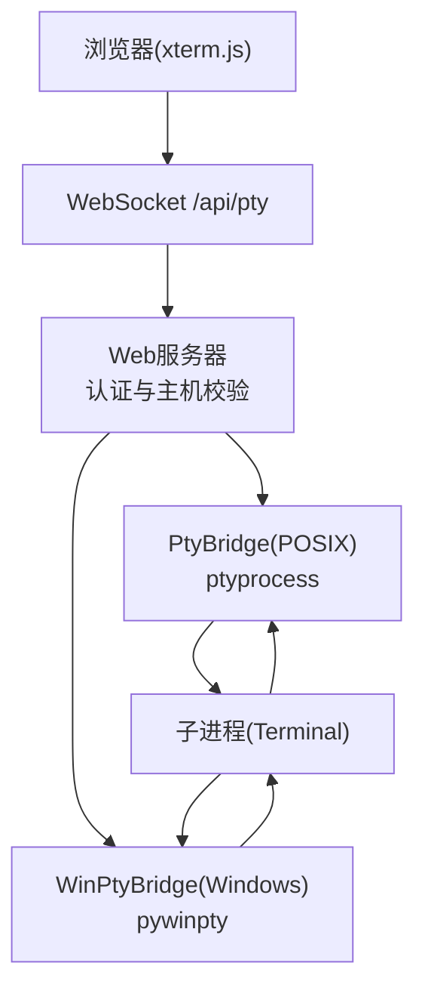
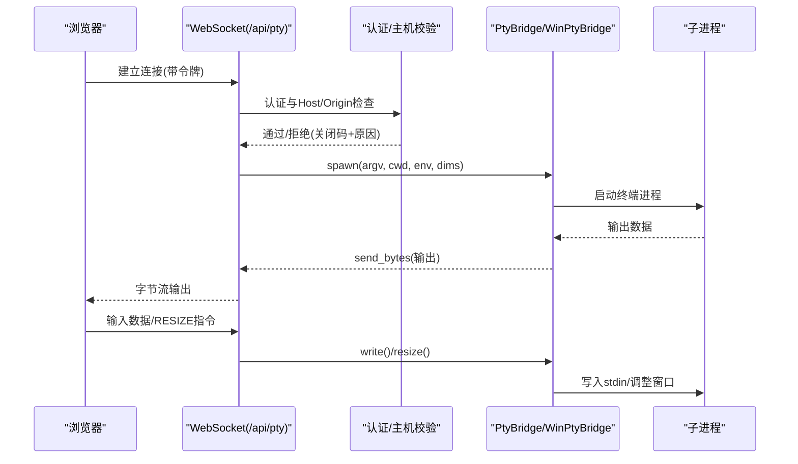
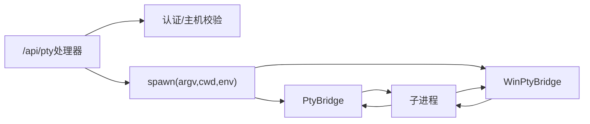

# PTY终端WebSocket

<cite>
**本文档引用的文件**
- [web_server.py](file://hermes_cli/web_server.py)
- [pty_bridge.py](file://hermes_cli/pty_bridge.py)
- [win_pty_bridge.py](file://hermes_cli/win_pty_bridge.py)
- [ChatPage.tsx](file://web/src/pages/ChatPage.tsx)
- [routes.py](file://hermes_cli/dashboard_auth/routes.py)
- [process_registry.py](file://tools/process_registry.py)
- [terminal_tool.py](file://tools/terminal_tool.py)
- [local.py](file://tools/environments/local.py)
- [test_web_server.py](file://tests/hermes_cli/test_web_server.py)
- [test_dashboard_auth_ws_auth.py](file://tests/hermes_cli/test_dashboard_auth_ws_auth.py)
- [test_terminal_foreground_timeout_cap.py](file://tests/tools/test_terminal_foreground_timeout_cap.py)
</cite>

## 目录
1. [简介](#简介)
2. [项目结构](#项目结构)
3. [核心组件](#核心组件)
4. [架构总览](#架构总览)
5. [详细组件分析](#详细组件分析)
6. [依赖关系分析](#依赖关系分析)
7. [性能考虑](#性能考虑)
8. [故障排除指南](#故障排除指南)
9. [结论](#结论)
10. [附录](#附录)

## 简介
本文件系统性地记录了 `/api/pty` 伪终端WebSocket API的设计与实现，涵盖命令执行、输出流传输、进程控制、会话建立与维护、数据流协议、终端控制指令、跨平台兼容性与性能优化策略，并提供安全防护与资源限制机制说明。

## 项目结构
/api/pty 是仪表盘“聊天”标签页的终端桥接入口，采用WebSocket协议承载伪终端数据流。后端根据操作系统选择不同的PTYP桥接实现：POSIX 使用 pty_bridge，Windows 使用 win_pty_bridge。前端通过 xterm.js 渲染终端界面，支持窗口大小调整、键盘输入与鼠标事件过滤等交互。

图表来源
- [web_server.py:10670-10808](file://hermes_cli/web_server.py#L10670-L10808)
- [pty_bridge.py:89-155](file://hermes_cli/pty_bridge.py#L89-L155)
- [win_pty_bridge.py:57-102](file://hermes_cli/win_pty_bridge.py#L57-L102)

章节来源
- [web_server.py:10670-10808](file://hermes_cli/web_server.py#L10670-L10808)
- [pty_bridge.py:1-287](file://hermes_cli/pty_bridge.py#L1-L287)
- [win_pty_bridge.py:1-180](file://hermes_cli/win_pty_bridge.py#L1-L180)

## 核心组件
- WebSocket处理器：负责认证、主机/来源校验、会话初始化、读写循环与清理。
- PTY桥接器：POSIX桥接器(PtyBridge)与Windows桥接器(WinPtyBridge)，统一暴露spawn/read/write/resize/close接口。
- 终端工具与环境：提供工作目录解析、环境变量注入、超时与资源限制策略。
- 浏览器前端：xterm.js渲染器，发送输入与窗口大小调整指令，接收字节流输出。

章节来源
- [web_server.py:10670-10808](file://hermes_cli/web_server.py#L10670-L10808)
- [pty_bridge.py:89-287](file://hermes_cli/pty_bridge.py#L89-L287)
- [win_pty_bridge.py:57-180](file://hermes_cli/win_pty_bridge.py#L57-L180)
- [ChatPage.tsx:600-747](file://web/src/pages/ChatPage.tsx#L600-L747)

## 架构总览
/api/pty 的端到端流程如下：浏览器发起WebSocket连接，服务端进行多层安全检查与认证，随后按平台选择桥接器启动子进程，建立双向数据通道：子进程输出经桥接器读取并通过WebSocket发送给浏览器；浏览器输入（含RESIZE指令）经桥接器写入子进程stdin。

图表来源
- [web_server.py:10670-10808](file://hermes_cli/web_server.py#L10670-L10808)
- [pty_bridge.py:113-155](file://hermes_cli/pty_bridge.py#L113-L155)
- [win_pty_bridge.py:76-102](file://hermes_cli/win_pty_bridge.py#L76-L102)

## 详细组件分析

### WebSocket处理器(/api/pty)
- 功能要点
  - 禁用检测：若嵌入式聊天未启用则直接拒绝。
  - 多重校验：认证失败(4401)、Host/Origin不匹配(4403)、客户端不允许(4408)、功能禁用(4404)。
  - 平台适配：Windows原生不支持POSIX PTY时，返回清晰错误并优雅关闭。
  - 会话参数：支持resume/profile/channel参数，用于恢复会话与侧车URL构建。
  - 子进程启动：解析argv/cwd/env，调用PtyBridge.spawn。
  - 双向通道：后台线程读取输出，事件循环处理输入；RESIZE指令在本地消费，不写入PTY。
  - 清理策略：取消读任务、关闭桥接器，确保进程组被终止并避免僵尸进程。

- 关键行为
  - RESIZE指令格式：`\x1b[RESIZE:<cols>;<rows>]`，由正则匹配并调用bridge.resize。
  - 读取策略：executor中阻塞读取，超时时间内无数据返回空字节，EOF返回None。
  - 写入策略：原始字节写入master fd；Windows路径下先解码为文本再写入。
  - 关闭策略：先取消读任务，再关闭桥接器，最后终止子进程组。

章节来源
- [web_server.py:10670-10808](file://hermes_cli/web_server.py#L10670-L10808)
- [test_web_server.py:4835-5091](file://tests/hermes_cli/test_web_server.py#L4835-L5091)

### PTY桥接器(PtyBridge/WinPtyBridge)
- 设计约束
  - POSIX桥接器仅支持类Unix平台，依赖fcntl/termios/ptyprocess。
  - Windows桥接器使用pywinpty，接口与POSIX保持一致。
- 生命周期
  - spawn：复制父进程环境，注入TERM=xterm-256color，设置初始窗口尺寸。
  - is_alive：查询子进程状态。
  - close：向进程组发送SIGHUP/TERM/KILL，强制回收，防止僵尸进程。
- I/O与窗口调整
  - read：POSIX使用select+os.read，Windows使用轮询+sleep，均限制最大读取64KiB。
  - write：POSIX直接写master fd；Windows将字节解码为UTF-8文本写入。
  - resize：POSIX通过ioctl(TIOCSWINSZ)设置winsize；Windows通过setwinsize。

章节来源
- [pty_bridge.py:89-287](file://hermes_cli/pty_bridge.py#L89-L287)
- [win_pty_bridge.py:57-180](file://hermes_cli/win_pty_bridge.py#L57-L180)

### 浏览器前端(xterm.js)
- 连接与初始化
  - 设置binaryType为arraybuffer，首次打开即发送RESIZE指令。
  - onmessage：字符串与二进制数据均写入终端。
  - onclose：根据关闭码展示友好提示，ANSI错误帧场景返回1011。
- 输入与事件过滤
  - 屏蔽SGR鼠标报告，避免控制流量误作为用户输入。
  - onResize：发送RESIZE指令更新后端窗口尺寸。
- 会话结束处理：输出会话结束提示并标记会话结束状态。

章节来源
- [ChatPage.tsx:600-747](file://web/src/pages/ChatPage.tsx#L600-L747)

### 认证与安全
- 认证方式
  - 查询参数携带会话令牌(token)，浏览器无法设置Authorization头时采用该方案。
  - 支持OAuth网关授权与传统令牌两种模式，具体取决于部署配置。
- 主机与来源校验
  - 严格校验Host/Origin，拒绝DNS重绑定攻击风险。
  - 仅允许回环地址访问，进一步降低跨域风险。
- 关闭码语义
  - 4401：认证失败
  - 4403：Host/Origin不匹配或客户端不允许
  - 4404：嵌入式聊天禁用
  - 1011：服务器内部错误/启动失败

章节来源
- [routes.py:598-600](file://hermes_cli/dashboard_auth/routes.py#L598-L600)
- [web_server.py:10680-10706](file://hermes_cli/web_server.py#L10680-L10706)
- [test_dashboard_auth_ws_auth.py:207-221](file://tests/hermes_cli/test_dashboard_auth_ws_auth.py#L207-L221)

### 数据流协议
- 输出流
  - 服务器端：bridge.read返回字节串，ws.send_bytes发送至浏览器。
  - 浏览器端：onmessage统一写入xterm.js，支持字符串与二进制。
- 输入流
  - 服务器端：优先解析bytes，否则将text编码为utf-8；RESIZE指令在本地处理。
  - 浏览器端：屏蔽SGR鼠标报告，其余输入透明转发。
- 错误与异常
  - 启动失败：发送ANSI错误帧并以1011关闭。
  - 进程退出：读到EOF后读任务退出，清理流程触发。

章节来源
- [web_server.py:10758-10808](file://hermes_cli/web_server.py#L10758-L10808)
- [ChatPage.tsx:618-624](file://web/src/pages/ChatPage.tsx#L618-L624)

### 终端控制指令
- 窗口大小调整
  - 指令格式：`\x1b[RESIZE:<cols>;<rows>]`
  - 解析与应用：正则匹配后调用bridge.resize，POSIX通过ioctl，Windows通过setwinsize。
- 鼠标事件
  - 屏蔽SGR鼠标报告，避免控制序列进入子进程stdin。
- 信号与终止
  - 服务器端：close时向进程组发送SIGHUP/TERM/KILL，确保清理。
  - 前端：正常断开时输出会话结束提示。

章节来源
- [web_server.py:10790-10798](file://hermes_cli/web_server.py#L10790-L10798)
- [ChatPage.tsx:696-712](file://web/src/pages/ChatPage.tsx#L696-L712)
- [pty_bridge.py:243-287](file://hermes_cli/pty_bridge.py#L243-L287)

### 会话建立与维护
- 工作目录与环境变量
  - argv/cwd/env由_resolve_chat_argv解析，支持profile与channel参数。
  - 环境变量注入TERM=xterm-256color，保证终端探测正常。
- 资源限制与超时
  - 终端工具提供前台命令最大超时限制(默认600秒)，可通过环境变量覆盖。
  - 终端工具提供磁盘使用告警阈值，定期扫描hermes相关目录。
- 进程控制
  - 通过process_registry可对会话执行等待、日志读取、写入stdin、提交stdin、关闭stdin等操作。

章节来源
- [web_server.py:10729-10754](file://hermes_cli/web_server.py#L10729-L10754)
- [terminal_tool.py:106-120](file://tools/terminal_tool.py#L106-L120)
- [terminal_tool.py:123-149](file://tools/terminal_tool.py#L123-L149)
- [process_registry.py:1738-1760](file://tools/process_registry.py#L1738-L1760)

### 跨平台兼容性
- POSIX平台：使用ptyprocess，支持select+ioctl窗口调整。
- Windows平台：使用pywinpty，通过setwinsize与轮询读取实现。
- 原生Windows不支持POSIX PTY时，服务端返回明确提示并优雅关闭。

章节来源
- [web_server.py:10228-10247](file://hermes_cli/web_server.py#L10228-L10247)
- [win_pty_bridge.py:1-180](file://hermes_cli/win_pty_bridge.py#L1-L180)

### 性能优化策略
- I/O模型
  - 读取：POSIX使用select避免忙等；Windows使用短睡眠轮询，降低CPU占用。
  - 写入：循环写直到全部送达，避免部分写导致的阻塞。
- 缓冲与超时
  - 单次读取上限64KiB，减少内存峰值。
  - 读取超时0.2秒，平衡延迟与CPU占用。
- 窗口调整
  - 初始RESIZE立即发送，后续测量权威化，避免多次布局抖动。
- 资源回收
  - 关闭时终止进程组，及时释放资源，防止僵尸进程。

章节来源
- [pty_bridge.py:171-217](file://hermes_cli/pty_bridge.py#L171-L217)
- [win_pty_bridge.py:118-152](file://hermes_cli/win_pty_bridge.py#L118-L152)
- [ChatPage.tsx:608-616](file://web/src/pages/ChatPage.tsx#L608-L616)

## 依赖关系分析

图表来源
- [web_server.py:10670-10808](file://hermes_cli/web_server.py#L10670-L10808)
- [pty_bridge.py:113-155](file://hermes_cli/pty_bridge.py#L113-L155)
- [win_pty_bridge.py:76-102](file://hermes_cli/win_pty_bridge.py#L76-L102)

章节来源
- [web_server.py:10670-10808](file://hermes_cli/web_server.py#L10670-L10808)
- [pty_bridge.py:89-155](file://hermes_cli/pty_bridge.py#L89-L155)
- [win_pty_bridge.py:57-102](file://hermes_cli/win_pty_bridge.py#L57-L102)

## 性能考虑
- I/O吞吐
  - 64KiB分片读取，避免大块缓冲；POSIX使用select，Windows使用短睡眠轮询。
- 延迟与刷新
  - 初始RESIZE立即发送，后续权威测量，减少重排次数。
- 资源回收
  - 关闭时终止进程组并强制回收，避免僵尸进程与句柄泄漏。
- 超时与限制
  - 前台命令最大超时默认600秒，可通过环境变量调整；磁盘使用超过阈值发出警告。

章节来源
- [pty_bridge.py:171-217](file://hermes_cli/pty_bridge.py#L171-L217)
- [terminal_tool.py:106-120](file://tools/terminal_tool.py#L106-L120)
- [terminal_tool.py:123-149](file://tools/terminal_tool.py#L123-L149)

## 故障排除指南
- 连接被拒
  - 4401：认证失败，检查令牌有效性与来源。
  - 4403：Host/Origin不匹配或客户端不允许，确认请求来源与绑定主机。
  - 4404：嵌入式聊天禁用，需以--tui启动。
  - 4408：仅允许回环访问，确认客户端为本地。
- 启动失败
  - 1011：常见于缺少依赖或命令不存在，查看服务器输出的ANSI错误帧。
- 断开与清理
  - 正常断开：输出会话结束提示；异常断开：检查关闭码与原因。
- 窗口异常
  - 确认RESIZE指令格式正确且浏览器已发送；后端会进行维度范围钳制。

章节来源
- [web_server.py:10680-10706](file://hermes_cli/web_server.py#L10680-L10706)
- [web_server.py:10711-10721](file://hermes_cli/web_server.py#L10711-L10721)
- [ChatPage.tsx:626-680](file://web/src/pages/ChatPage.tsx#L626-L680)

## 结论
/api/pty 通过统一的WebSocket接口与跨平台桥接器，实现了稳定的伪终端通信能力。其设计兼顾安全性（多层认证与主机校验）、可靠性（进程组终止与资源回收）与性能（高效I/O与窗口调整）。前端xterm.js提供流畅的终端体验，配合严格的输入过滤与错误处理，满足生产环境的复杂需求。

## 附录

### 数据流协议细节
- 输出：服务器端从bridge.read读取字节，通过ws.send_bytes发送；浏览器端统一写入xterm.js。
- 输入：浏览器端屏蔽SGR鼠标报告；RESIZE指令在服务器端解析并调用bridge.resize。
- 错误：启动失败发送ANSI错误帧并以1011关闭；断开时输出会话结束提示。

章节来源
- [web_server.py:10758-10808](file://hermes_cli/web_server.py#L10758-L10808)
- [ChatPage.tsx:618-712](file://web/src/pages/ChatPage.tsx#L618-L712)

### 会话超时与资源限制
- 前台命令最大超时：默认600秒，可通过环境变量覆盖。
- 磁盘使用告警：超过阈值(默认500GB)发出警告，建议清理环境。
- 终端工作目录：支持配置别名与路径展开，避免相对路径问题。

章节来源
- [terminal_tool.py:106-120](file://tools/terminal_tool.py#L106-L120)
- [terminal_tool.py:123-149](file://tools/terminal_tool.py#L123-L149)
- [local.py:564-592](file://tools/environments/local.py#L564-L592)