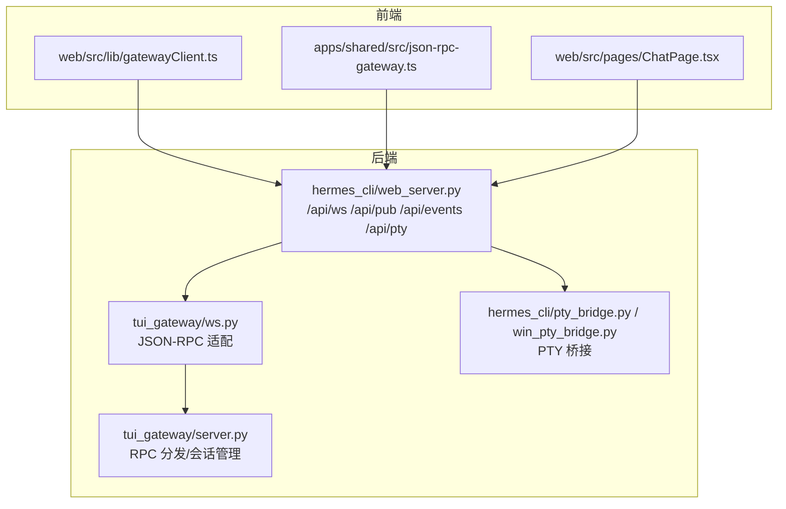
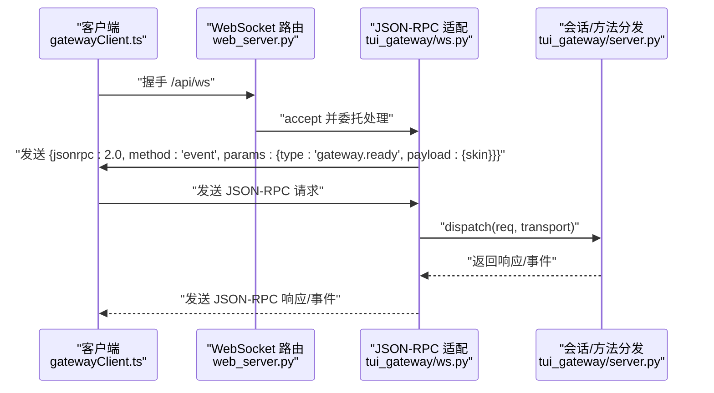
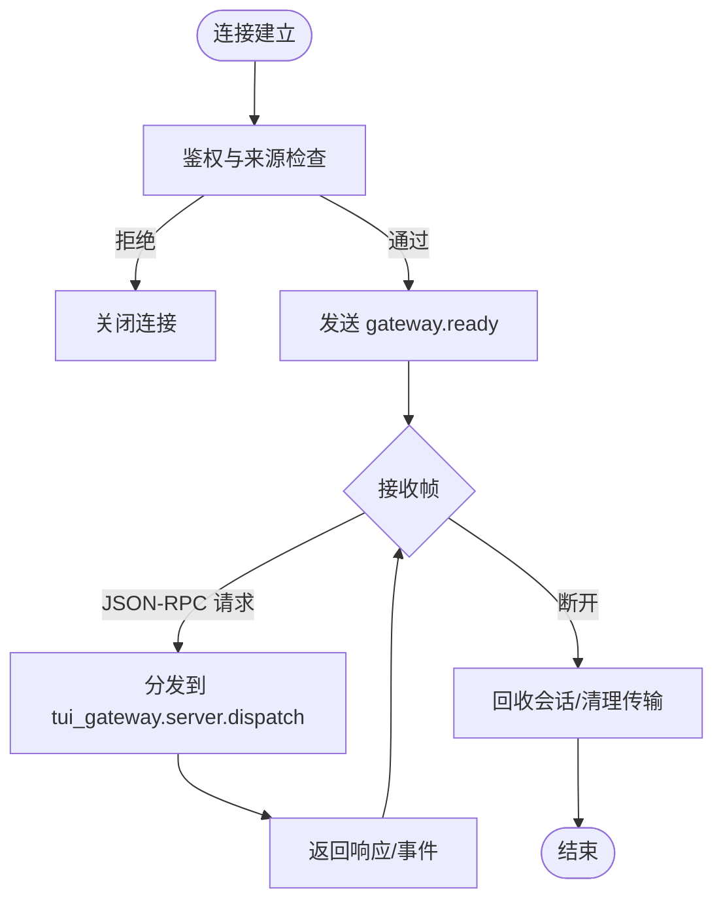
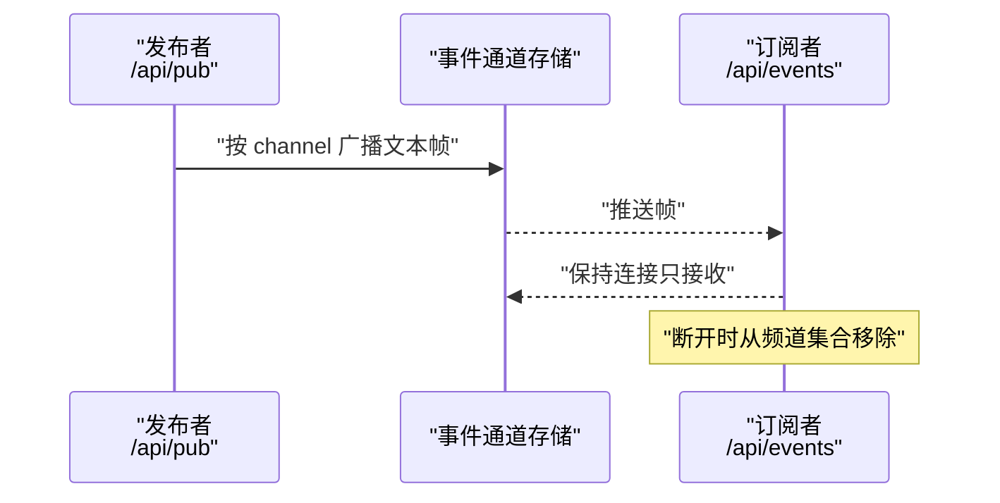
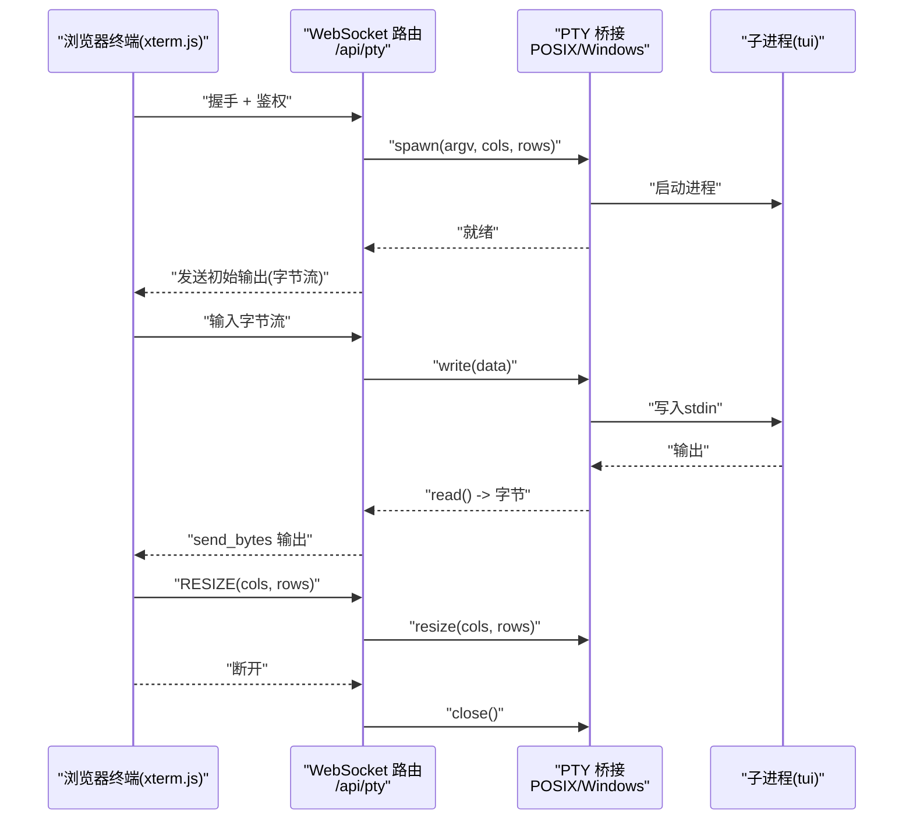
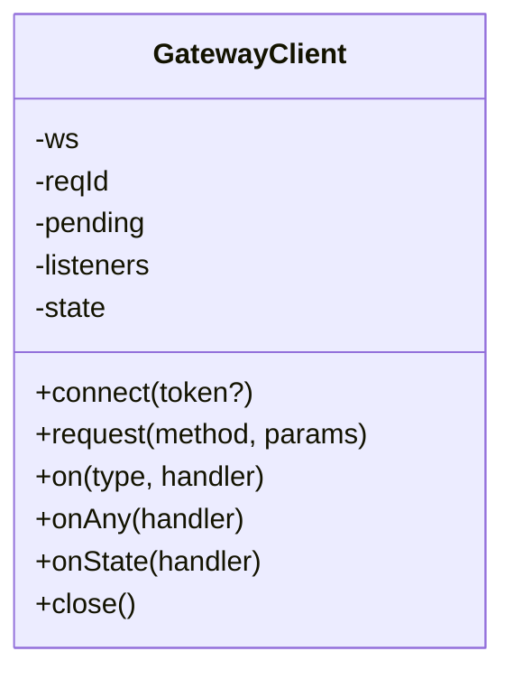
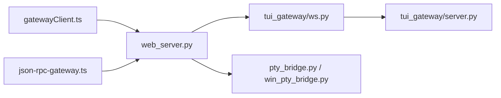

# WebSocket API

<cite>
**本文引用的文件**
- [hermes_cli/web_server.py](file://hermes_cli/web_server.py)
- [tui_gateway/ws.py](file://tui_gateway/ws.py)
- [tui_gateway/server.py](file://tui_gateway/server.py)
- [hermes_cli/pty_bridge.py](file://hermes_cli/pty_bridge.py)
- [hermes_cli/win_pty_bridge.py](file://hermes_cli/win_pty_bridge.py)
- [web/src/lib/gatewayClient.ts](file://web/src/lib/gatewayClient.ts)
- [apps/shared/src/json-rpc-gateway.ts](file://apps/shared/src/json-rpc-gateway.ts)
- [web/src/pages/ChatPage.tsx](file://web/src/pages/ChatPage.tsx)
- [hermes_cli/dashboard_auth/ws_tickets.py](file://hermes_cli/dashboard_auth/ws_tickets.py)
- [tests/hermes_cli/test_dashboard_auth_ws_auth.py](file://tests/hermes_cli/test_dashboard_auth_ws_auth.py)
- [gateway/channel_directory.py](file://gateway/channel_directory.py)
</cite>

## 目录
1. [简介](#简介)
2. [项目结构](#项目结构)
3. [核心组件](#核心组件)
4. [架构总览](#架构总览)
5. [详细组件分析](#详细组件分析)
6. [依赖关系分析](#依赖关系分析)
7. [性能考量](#性能考量)
8. [故障排查指南](#故障排查指南)
9. [结论](#结论)
10. [附录：消息格式与事件规范](#附录消息格式与事件规范)

## 简介
本文件系统化梳理 Hermes Agent 的 WebSocket 实时通信协议，覆盖两类端点：
- 聊天会话 WebSocket（/api/ws）：基于 JSON-RPC 的双向通信，承载会话控制、工具调用、事件推送等。
- 伪终端 WebSocket（/api/pty）：通过 PTY 桥接在浏览器中渲染终端输出、回传用户输入，支持跨平台。

同时说明事件通道机制与订阅管理、连接生命周期与重连策略、安全与鉴权、消息格式与事件类型、以及错误处理与资源限制。

## 项目结构
- 后端路由与鉴权：FastAPI 路由位于 web_server.py，负责 /api/ws、/api/pub、/api/events、/api/pty 等端点的接入与鉴权校验。
- 前端客户端：web/src/lib/gatewayClient.ts 与 apps/shared/src/json-rpc-gateway.ts 提供 JSON-RPC 客户端封装与事件分发。
- 终端桥接：hermes_cli/pty_bridge.py（POSIX）与 hermes_cli/win_pty_bridge.py（Windows）为 /api/pty 提供跨平台 PTY 支持。
- 会话网关：tui_gateway/ws.py 将 WebSocket 与 tui_gateway/server.py 的 JSON-RPC 分发器对接，实现一致的请求/响应与事件模型。

图示来源
- [hermes_cli/web_server.py:10821-10837](file://hermes_cli/web_server.py#L10821-L10837)
- [tui_gateway/ws.py:173-341](file://tui_gateway/ws.py#L173-L341)
- [tui_gateway/server.py:125-200](file://tui_gateway/server.py#L125-L200)
- [hermes_cli/pty_bridge.py:113-155](file://hermes_cli/pty_bridge.py#L113-L155)
- [hermes_cli/win_pty_bridge.py:76-102](file://hermes_cli/win_pty_bridge.py#L76-L102)

章节来源
- [hermes_cli/web_server.py:10821-10837](file://hermes_cli/web_server.py#L10821-L10837)
- [tui_gateway/ws.py:173-341](file://tui_gateway/ws.py#L173-L341)
- [tui_gateway/server.py:125-200](file://tui_gateway/server.py#L125-L200)
- [hermes_cli/pty_bridge.py:113-155](file://hermes_cli/pty_bridge.py#L113-L155)
- [hermes_cli/win_pty_bridge.py:76-102](file://hermes_cli/win_pty_bridge.py#L76-L102)

## 核心组件
- WebSocket 路由与鉴权
  - /api/ws：JSON-RPC 网关侧车，绑定 tui_gateway.ws.handle_ws。
  - /api/pub：事件发布端点，向指定频道广播文本帧。
  - /api/events：事件订阅端点，按频道维护订阅集合。
  - /api/pty：伪终端桥接端点，读写字节流，支持终端尺寸调整与进程控制。
- JSON-RPC 适配层
  - tui_gateway/ws.py：将 WebSocket 文本帧解析为 JSON-RPC 请求，调用 tui_gateway/server.py 的 dispatch，并将响应/事件以帧形式回推。
- PTY 桥接
  - hermes_cli/pty_bridge.py（POSIX）与 hermes_cli/win_pty_bridge.py（Windows）：统一接口 spawn/read/write/resize/close/is_available，屏蔽平台差异。
- 前端客户端
  - web/src/lib/gatewayClient.ts 与 apps/shared/src/json-rpc-gateway.ts：封装连接、请求/响应、事件订阅、超时与错误处理；ChatPage.tsx 展示终端会话。

章节来源
- [hermes_cli/web_server.py:10821-10837](file://hermes_cli/web_server.py#L10821-L10837)
- [tui_gateway/ws.py:173-341](file://tui_gateway/ws.py#L173-L341)
- [hermes_cli/pty_bridge.py:113-155](file://hermes_cli/pty_bridge.py#L113-L155)
- [hermes_cli/win_pty_bridge.py:76-102](file://hermes_cli/win_pty_bridge.py#L76-L102)
- [web/src/lib/gatewayClient.ts:65-211](file://web/src/lib/gatewayClient.ts#L65-L211)
- [apps/shared/src/json-rpc-gateway.ts:60-336](file://apps/shared/src/json-rpc-gateway.ts#L60-L336)
- [web/src/pages/ChatPage.tsx:600-635](file://web/src/pages/ChatPage.tsx#L600-L635)

## 架构总览
WebSocket 采用“请求-响应 + 事件推送”的双通道模式：
- 请求-响应：客户端发送 JSON-RPC 请求，服务端返回结果或错误。
- 事件推送：服务端在会话生命周期内推送事件（如 gateway.ready、工具调用进度、子代理状态等），客户端订阅感兴趣事件类型。

图示来源
- [hermes_cli/web_server.py:10821-10837](file://hermes_cli/web_server.py#L10821-L10837)
- [tui_gateway/ws.py:193-202](file://tui_gateway/ws.py#L193-L202)
- [tui_gateway/ws.py:262-288](file://tui_gateway/ws.py#L262-L288)

章节来源
- [hermes_cli/web_server.py:10821-10837](file://hermes_cli/web_server.py#L10821-L10837)
- [tui_gateway/ws.py:193-202](file://tui_gateway/ws.py#L193-L202)
- [tui_gateway/ws.py:262-288](file://tui_gateway/ws.py#L262-L288)

## 详细组件分析

### 聊天会话 WebSocket（/api/ws）
- 连接建立
  - 仅在启用嵌入式聊天时开放；需通过鉴权（会话令牌或一次性票据）与来源/客户端白名单检查。
  - 接受连接后立即推送 gateway.ready 事件，随后进入请求-响应循环。
- 双向通信
  - 客户端可发送 JSON-RPC 请求（含 id/method/params），服务端返回结果或错误。
  - 服务端可推送事件（method=event），客户端订阅事件类型或通配符。
- 生命周期与清理
  - 断开时尝试回收会话（关闭由该传输拥有的会话，或将其标记为孤立并在宽限窗口后回收）。

图示来源
- [hermes_cli/web_server.py:10821-10837](file://hermes_cli/web_server.py#L10821-L10837)
- [tui_gateway/ws.py:183-341](file://tui_gateway/ws.py#L183-L341)

章节来源
- [hermes_cli/web_server.py:10821-10837](file://hermes_cli/web_server.py#L10821-L10837)
- [tui_gateway/ws.py:183-341](file://tui_gateway/ws.py#L183-L341)

### 事件通道与订阅管理（/api/pub 与 /api/events）
- 频道与订阅
  - /api/pub 接收来自内部侧车的消息文本帧，按频道广播。
  - /api/events 订阅者仅接收消息，不发送；断开时从频道集合移除。
- 频道 ID 分配
  - 由上游逻辑决定（例如会话/目标标识），路由层通过查询参数提取频道标识。
- 自动清理
  - 订阅者断开后，若频道无其他订阅者则清空该频道记录。

图示来源
- [hermes_cli/web_server.py:10852-10877](file://hermes_cli/web_server.py#L10852-L10877)
- [hermes_cli/web_server.py:10880-10922](file://hermes_cli/web_server.py#L10880-L10922)

章节来源
- [hermes_cli/web_server.py:10852-10877](file://hermes_cli/web_server.py#L10852-L10877)
- [hermes_cli/web_server.py:10880-10922](file://hermes_cli/web_server.py#L10880-L10922)

### 伪终端 WebSocket（/api/pty）
- 协议与数据流
  - 服务器端通过 PTY 桥接启动子进程，将子进程输出以字节流形式发送至客户端；客户端键盘输入以字节流回传。
  - 支持终端尺寸调整（RESIZE 控制序列）与进程生命周期管理（终止/回收）。
- 跨平台实现
  - POSIX：使用 ptyprocess/fcntl/termios。
  - Windows：使用 pywinpty/ConPTY。
- 安全与可用性
  - 若平台不支持 PTY 或缺失依赖，服务器返回明确提示并优雅关闭连接。
  - 严格来源与客户端白名单检查，拒绝非本地环回来源（在非宽松模式下）。

图示来源
- [hermes_cli/web_server.py:10688-10789](file://hermes_cli/web_server.py#L10688-L10789)
- [hermes_cli/pty_bridge.py:113-155](file://hermes_cli/pty_bridge.py#L113-L155)
- [hermes_cli/win_pty_bridge.py:76-102](file://hermes_cli/win_pty_bridge.py#L76-L102)
- [web/src/pages/ChatPage.tsx:600-635](file://web/src/pages/ChatPage.tsx#L600-L635)

章节来源
- [hermes_cli/web_server.py:10688-10789](file://hermes_cli/web_server.py#L10688-L10789)
- [hermes_cli/pty_bridge.py:113-155](file://hermes_cli/pty_bridge.py#L113-L155)
- [hermes_cli/win_pty_bridge.py:76-102](file://hermes_cli/win_pty_bridge.py#L76-L102)
- [web/src/pages/ChatPage.tsx:600-635](file://web/src/pages/ChatPage.tsx#L600-L635)

### 客户端 JSON-RPC 客户端（GatewayClient）
- 功能要点
  - 连接状态管理（idle/connecting/open/closed/error）。
  - 请求/响应：自动生成请求 id，超时与错误处理。
  - 事件订阅：支持按事件类型与通配符订阅。
  - 重连策略：由上层应用决定，客户端提供连接与关闭能力。
- 与后端一致性
  - 与 tui_gateway/ws.py 的 JSON-RPC 规范完全一致（jsonrpc:2.0，method/params/id 结构）。

图示来源
- [web/src/lib/gatewayClient.ts:65-211](file://web/src/lib/gatewayClient.ts#L65-L211)
- [apps/shared/src/json-rpc-gateway.ts:60-336](file://apps/shared/src/json-rpc-gateway.ts#L60-L336)

章节来源
- [web/src/lib/gatewayClient.ts:65-211](file://web/src/lib/gatewayClient.ts#L65-L211)
- [apps/shared/src/json-rpc-gateway.ts:60-336](file://apps/shared/src/json-rpc-gateway.ts#L60-L336)

## 依赖关系分析
- 路由层依赖
  - web_server.py 路由到 tui_gateway.ws.handle_ws，后者再调用 tui_gateway/server.py 的 dispatch。
- 平台差异
  - /api/pty 通过条件导入 POSIX 或 Windows PTY 桥接模块，保证对外接口一致。
- 客户端依赖
  - 前端两个 JSON-RPC 客户端库共享同一协议契约，确保跨组件一致性。

图示来源
- [hermes_cli/web_server.py:10821-10837](file://hermes_cli/web_server.py#L10821-L10837)
- [tui_gateway/ws.py:173-341](file://tui_gateway/ws.py#L173-L341)
- [tui_gateway/server.py:125-200](file://tui_gateway/server.py#L125-L200)
- [hermes_cli/pty_bridge.py:113-155](file://hermes_cli/pty_bridge.py#L113-L155)
- [hermes_cli/win_pty_bridge.py:76-102](file://hermes_cli/win_pty_bridge.py#L76-L102)

章节来源
- [hermes_cli/web_server.py:10821-10837](file://hermes_cli/web_server.py#L10821-L10837)
- [tui_gateway/ws.py:173-341](file://tui_gateway/ws.py#L173-L341)
- [tui_gateway/server.py:125-200](file://tui_gateway/server.py#L125-L200)
- [hermes_cli/pty_bridge.py:113-155](file://hermes_cli/pty_bridge.py#L113-L155)
- [hermes_cli/win_pty_bridge.py:76-102](file://hermes_cli/win_pty_bridge.py#L76-L102)

## 性能考量
- 流式输出优化
  - 在 WebSocket 侧禁用 Nagle，确保小帧即时发送，避免模型思考暂停后的合并抖动。
- 写入路径
  - 非事件循环线程通过线程池调度写入，设置写超时保护，避免阻塞主循环。
- PTY 读写
  - POSIX 使用 select + 64KiB 块读取；Windows 使用轮询 + 缓冲读取，避免阻塞事件循环。
- 会话回收
  - 断开后对“孤儿会话”设置宽限窗口回收，平衡快速重连与资源占用。

章节来源
- [tui_gateway/ws.py:155-171](file://tui_gateway/ws.py#L155-L171)
- [tui_gateway/ws.py:95-123](file://tui_gateway/ws.py#L95-L123)
- [hermes_cli/pty_bridge.py:171-199](file://hermes_cli/pty_bridge.py#L171-L199)
- [hermes_cli/win_pty_bridge.py:118-143](file://hermes_cli/win_pty_bridge.py#L118-L143)
- [tui_gateway/server.py:146-162](file://tui_gateway/server.py#L146-L162)

## 故障排查指南
- 鉴权失败
  - 未启用嵌入式聊天、缺少有效令牌/票据、来源/客户端不在允许列表。
- 来源与客户端限制
  - 非环回来源在非宽松模式下被拒绝；票据已消费或过期也会导致拒绝。
- PTY 不可用
  - 平台不支持 PTY 或缺少依赖；Windows 需要 pywinpty；POSIX 需要 ptyprocess。
- 连接异常
  - 前端可在 onclose 中读取 reason 了解具体原因；后端日志记录断开原因与统计指标。

章节来源
- [hermes_cli/web_server.py:10821-10837](file://hermes_cli/web_server.py#L10821-L10837)
- [hermes_cli/web_server.py:10852-10877](file://hermes_cli/web_server.py#L10852-L10877)
- [hermes_cli/web_server.py:10880-10922](file://hermes_cli/web_server.py#L10880-L10922)
- [hermes_cli/web_server.py:10688-10789](file://hermes_cli/web_server.py#L10688-L10789)
- [tests/hermes_cli/test_dashboard_auth_ws_auth.py:219-455](file://tests/hermes_cli/test_dashboard_auth_ws_auth.py#L219-L455)

## 结论
本文档完整描述了 Hermes Agent 的 WebSocket 实时通信协议：聊天会话（/api/ws）采用 JSON-RPC 双向模型，事件通道（/api/pub 与 /api/events）支持按频道订阅与自动清理；伪终端（/api/pty）通过跨平台 PTY 桥接实现终端输出流与输入回传。配合严格的鉴权、来源与客户端限制、Nagle 禁用与写超时保护、孤儿会话回收等机制，系统在功能与稳定性之间取得良好平衡。

## 附录：消息格式与事件规范

### 通用消息格式（JSON-RPC 2.0）
- 请求
  - 字段：jsonrpc（固定为 "2.0"）、method（字符串）、params（对象，可选）、id（字符串/数字，用于请求-响应）。
- 响应
  - 字段：jsonrpc（固定为 "2.0"）、id（与请求对应）、result（成功结果，可选）、error（错误对象，可选）。
- 通知（事件）
  - 字段：jsonrpc（固定为 "2.0"）、method（固定为 "event"）、params（对象，包含 type 与 payload）。

章节来源
- [tui_gateway/ws.py:229-298](file://tui_gateway/ws.py#L229-L298)
- [apps/shared/src/json-rpc-gateway.ts:260-336](file://apps/shared/src/json-rpc-gateway.ts#L260-L336)

### 事件类型与负载
- gateway.ready
  - 类型：通知（event）
  - 负载：包含皮肤信息（skin），用于前端渲染初始化。
- 工具调用与子代理事件
  - 类型：工具调用开始/结束、子代理状态变化等（由具体会话流程产生）。
- 终端相关事件
  - /api/pty 场景下，事件由 PTY 输出与交互触发，通常以文本帧形式推送。

章节来源
- [tui_gateway/ws.py:193-202](file://tui_gateway/ws.py#L193-L202)
- [tui_gateway/ws.py:262-288](file://tui_gateway/ws.py#L262-L288)

### 连接生命周期与重连策略
- 生命周期
  - 握手 → 鉴权 → 发送 gateway.ready → 请求-响应/事件推送 → 断开 → 回收会话。
- 重连建议
  - 建议指数退避与最大重试次数；在收到早期关闭时区分“握手接受但鉴权失败”与“握手拒绝”。

章节来源
- [web/src/lib/gatewayClient.ts:108-172](file://web/src/lib/gatewayClient.ts#L108-L172)
- [apps/shared/src/json-rpc-gateway.ts:170-185](file://apps/shared/src/json-rpc-gateway.ts#L170-L185)

### 安全与鉴权
- 鉴权方式
  - 本地环回模式：?token= 会话令牌。
  - 网关模式：一次性票据 ?ticket=，通过 /api/auth/ws-ticket 获取。
- 来源与客户端限制
  - 严格校验 Origin 与客户端 IP，拒绝跨站来源与非允许客户端。
- 资源限制
  - 终端尺寸上限（列/行）防止异常探测导致的过大窗口；写超时保护避免阻塞。

章节来源
- [hermes_cli/dashboard_auth/ws_tickets.py:1-22](file://hermes_cli/dashboard_auth/ws_tickets.py#L1-L22)
- [tests/hermes_cli/test_dashboard_auth_ws_auth.py:219-455](file://tests/hermes_cli/test_dashboard_auth_ws_auth.py#L219-L455)
- [hermes_cli/web_server.py:10364-10396](file://hermes_cli/web_server.py#L10364-L10396)
- [hermes_cli/pty_bridge.py:53-61](file://hermes_cli/pty_bridge.py#L53-L61)
- [hermes_cli/win_pty_bridge.py:33-50](file://hermes_cli/win_pty_bridge.py#L33-L50)