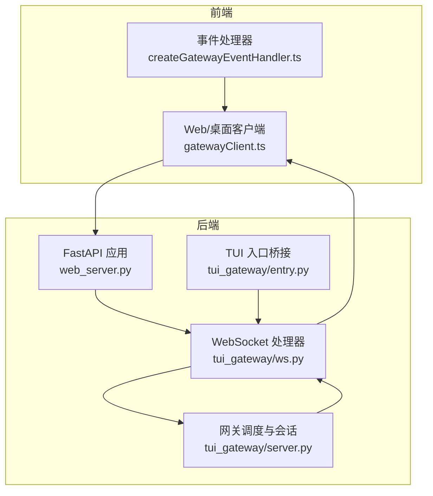
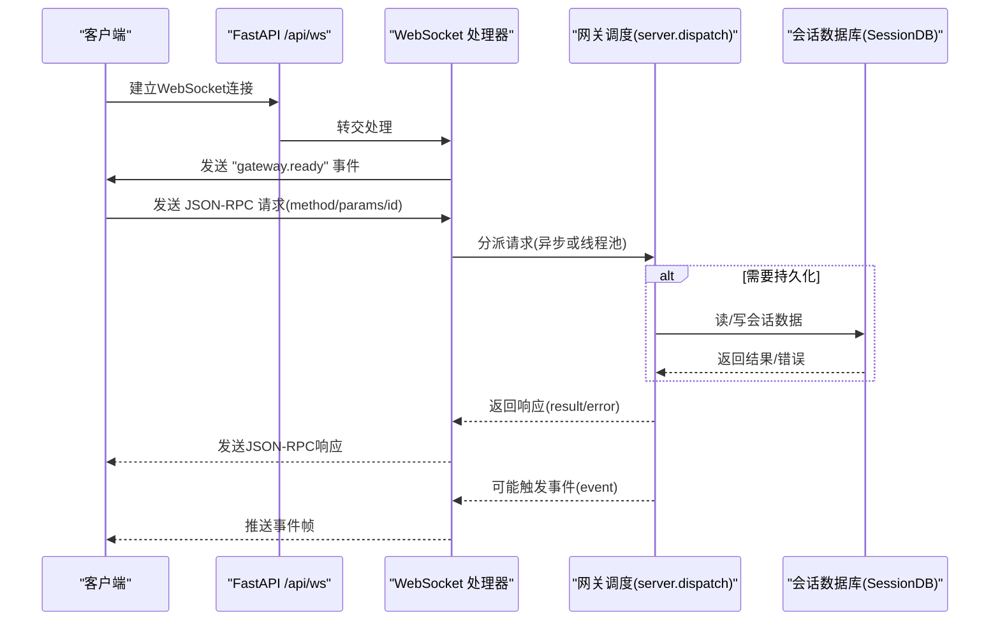
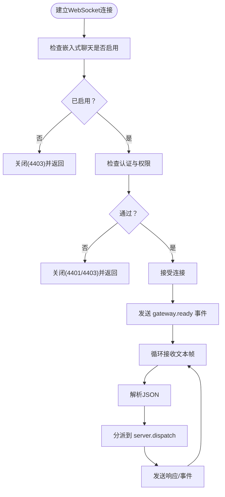
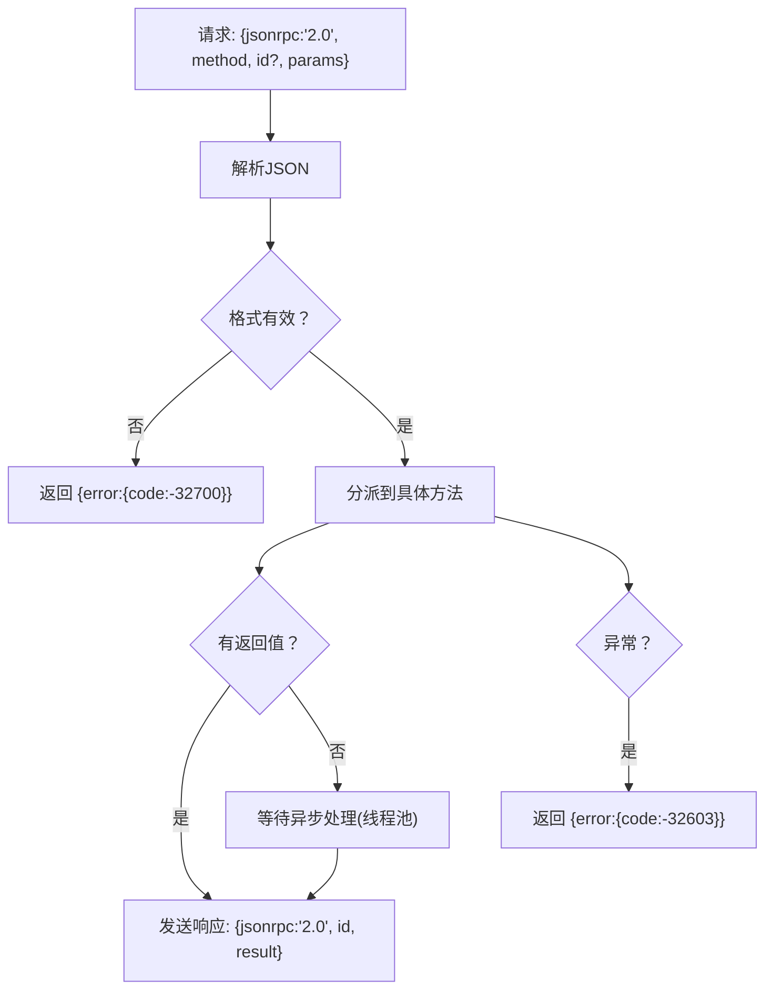
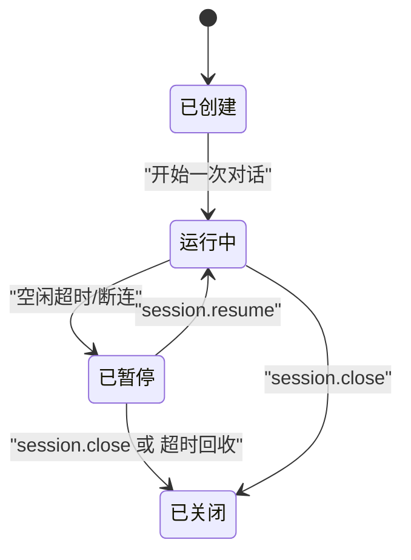
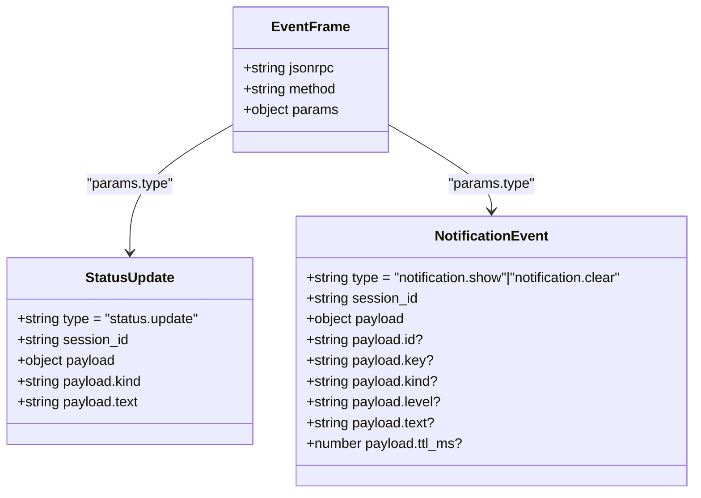
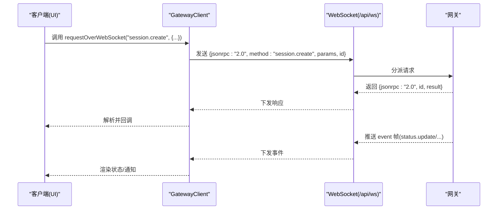
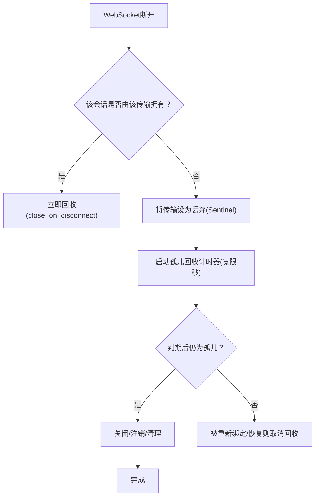
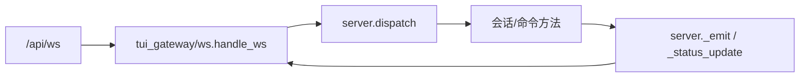

# 聊天会话WebSocket

<cite>
**本文档引用的文件**
- [tui_gateway/ws.py](file://tui_gateway/ws.py)
- [tui_gateway/server.py](file://tui_gateway/server.py)
- [hermes_cli/web_server.py](file://hermes_cli/web_server.py)
- [ui-tui/src/gatewayClient.ts](file://ui-tui/src/gatewayClient.ts)
- [ui-tui/src/app/createGatewayEventHandler.ts](file://ui-tui/src/app/createGatewayEventHandler.ts)
- [tests/test_tui_gateway_server.py](file://tests/test_tui_gateway_server.py)
- [tests/gateway/relay/test_ws_transport.py](file://tests/gateway/relay/test_ws_transport.py)
- [tui_gateway/entry.py](file://tui_gateway/entry.py)
</cite>

## 目录
1. [简介](#简介)
2. [项目结构](#项目结构)
3. [核心组件](#核心组件)
4. [架构总览](#架构总览)
5. [详细组件分析](#详细组件分析)
6. [依赖关系分析](#依赖关系分析)
7. [性能考量](#性能考量)
8. [故障排查指南](#故障排查指南)
9. [结论](#结论)
10. [附录](#附录)

## 简介
本文件为聊天会话WebSocket API的技术文档，聚焦于 /api/ws 端点的双向通信协议。内容涵盖：
- 会话建立、消息收发与状态通知机制
- 基于 JSON-RPC 2.0 的请求/响应格式与错误处理
- 会话生命周期管理（创建、维护、销毁）
- 事件类型与消息格式（如 status.update、notification.* 等）
- 客户端连接示例与消息交互模式
- 会话ID管理、并发控制与资源清理
- 安全考虑（认证、授权与访问控制）

## 项目结构
与聊天会话WebSocket相关的核心模块如下：
- 后端服务入口：/api/ws 由 hermes_cli/web_server.py 提供，内部复用 tui_gateway/ws.py 的处理逻辑
- WebSocket传输层：tui_gateway/ws.py 实现了基于 FastAPI 的 WebSocket 处理器，兼容标准输入输出的 JSON-RPC 协议
- 会话与事件：tui_gateway/server.py 提供会话方法（session.create/resume/close/list 等）与事件发射（status.update、notification.* 等）
- 客户端示例：ui-tui/src/gatewayClient.ts 展示了通过 WebSocket 发送 JSON-RPC 请求的客户端实现
- 事件分发：ui-tui/src/app/createGatewayEventHandler.ts 展示了客户端对事件的消费与渲染

图表来源
- [hermes_cli/web_server.py:10821-10838](file://hermes_cli/web_server.py#L10821-L10838)
- [tui_gateway/ws.py:173-341](file://tui_gateway/ws.py#L173-L341)
- [tui_gateway/server.py:749-770](file://tui_gateway/server.py#L749-L770)
- [tui_gateway/entry.py:32-49](file://tui_gateway/entry.py#L32-L49)

章节来源
- [hermes_cli/web_server.py:10821-10838](file://hermes_cli/web_server.py#L10821-L10838)
- [tui_gateway/ws.py:1-341](file://tui_gateway/ws.py#L1-L341)
- [tui_gateway/server.py:1-200](file://tui_gateway/server.py#L1-L200)
- [tui_gateway/entry.py:1-200](file://tui_gateway/entry.py#L1-L200)

## 核心组件
- WebSocket端点：/api/ws，用于承载聊天会话的实时双向通信
- JSON-RPC 2.0：请求/响应统一采用 JSON-RPC 2.0 规范，支持 id、method、params、result/error 字段
- 事件系统：通过 event.method 与 params.type 标识事件类型，如 status.update、notification.show/clear 等
- 会话管理：提供 session.create、session.resume、session.close、session.list 等方法
- 传输层：WSTransport 封装写入与线程安全，支持从工作线程向事件循环调度发送帧

章节来源
- [tui_gateway/ws.py:51-143](file://tui_gateway/ws.py#L51-L143)
- [tui_gateway/server.py:749-770](file://tui_gateway/server.py#L749-L770)
- [tui_gateway/server.py:4000-4126](file://tui_gateway/server.py#L4000-L4126)

## 架构总览
下图展示了从客户端到后端的完整调用链路，以及事件在系统内的传播路径。

图表来源
- [hermes_cli/web_server.py:10821-10838](file://hermes_cli/web_server.py#L10821-L10838)
- [tui_gateway/ws.py:173-341](file://tui_gateway/ws.py#L173-L341)
- [tui_gateway/server.py:728-770](file://tui_gateway/server.py#L728-L770)

## 详细组件分析

### WebSocket端点与握手
- 端点：/api/ws
- 认证与访问控制：需满足嵌入式聊天启用、认证检查与请求允许条件，否则以特定关闭码断开
- 握手：接受连接后立即发送 "gateway.ready" 事件，携带皮肤信息
- 协议：与标准输入输出一致，使用换行分隔的 JSON 文本；服务器回显所有请求与事件

图表来源
- [hermes_cli/web_server.py:10821-10838](file://hermes_cli/web_server.py#L10821-L10838)
- [tui_gateway/ws.py:173-208](file://tui_gateway/ws.py#L173-L208)

章节来源
- [hermes_cli/web_server.py:10821-10838](file://hermes_cli/web_server.py#L10821-L10838)
- [tui_gateway/ws.py:173-208](file://tui_gateway/ws.py#L173-L208)

### JSON-RPC 2.0 协议规范
- 请求格式
  - 必填字段：jsonrpc(固定为"2.0")、method(字符串)
  - 可选字段：id(数字/字符串/null)、params(对象)
- 响应格式
  - 成功：jsonrpc="2.0"、id(与请求对应)、result(对象)
  - 错误：jsonrpc="2.0"、id(可为null)、error(code/message/data?)
- 错误码
  - -32700：解析错误(parse error)
  - -32603：内部错误(internal error)
  - 其他业务错误码：如会话不存在(4007)、活跃会话不可删除(4023)、数据库不可用(5007/5036)等

图表来源
- [tui_gateway/ws.py:229-288](file://tui_gateway/ws.py#L229-L288)
- [tests/test_tui_gateway_server.py:5310-5354](file://tests/test_tui_gateway_server.py#L5310-L5354)

章节来源
- [tui_gateway/ws.py:229-288](file://tui_gateway/ws.py#L229-L288)
- [tests/test_tui_gateway_server.py:5310-5354](file://tests/test_tui_gateway_server.py#L5310-L5354)

### 会话生命周期管理
- 创建
  - 方法：session.create
  - 参数：可选模型/提供商/推理努力/快速模式/工作目录/标题/远端配置等
  - 返回：session_id/stored_session_id/初始消息列表/信息摘要
  - 行为：立即返回轻量级会话描述，随后延迟构建真实代理
- 恢复
  - 方法：session.resume
  - 参数：session_id、列数(cols)、可选 profile
  - 行为：在指定配置文件范围内恢复会话，若不存在则报错
- 关闭
  - 方法：session.close
  - 行为：关闭会话并释放占用的活动会话槽位
- 列表与最近会话
  - 方法：session.list/session.most_recent
  - 行为：列出人类可读会话或返回最近会话ID

图表来源
- [tui_gateway/server.py:4000-4126](file://tui_gateway/server.py#L4000-L4126)
- [tui_gateway/server.py:4218-4240](file://tui_gateway/server.py#L4218-L4240)
- [tui_gateway/server.py:5293-5300](file://tui_gateway/server.py#L5293-L5300)

章节来源
- [tui_gateway/server.py:4000-4126](file://tui_gateway/server.py#L4000-L4126)
- [tui_gateway/server.py:4218-4240](file://tui_gateway/server.py#L4218-L4240)
- [tui_gateway/server.py:5293-5300](file://tui_gateway/server.py#L5293-L5300)

### 事件类型与消息格式
- 通用事件结构
  - {jsonrpc:"2.0", method:"event", params:{type, session_id?, payload?}}
- 常见事件
  - status.update：会话状态更新，payload 包含 kind/text
  - notification.show/notification.clear：通知展示与清除，payload 包含 id/key/kind/level/text/ttl_ms
- 客户端处理
  - ui-tui/src/app/createGatewayEventHandler.ts 对 status.update 进行去重与活动面板推送

图表来源
- [tui_gateway/server.py:749-770](file://tui_gateway/server.py#L749-L770)
- [ui-tui/src/app/createGatewayEventHandler.ts:489-535](file://ui-tui/src/app/createGatewayEventHandler.ts#L489-L535)

章节来源
- [tui_gateway/server.py:749-770](file://tui_gateway/server.py#L749-L770)
- [ui-tui/src/app/createGatewayEventHandler.ts:489-535](file://ui-tui/src/app/createGatewayEventHandler.ts#L489-L535)

### 客户端连接示例与交互模式
- 连接建立
  - 使用 ui-tui/src/gatewayClient.ts 中的 ensureAttachedWebSocket 与 requestOverWebSocket
  - 自动管理连接状态、请求ID分配与超时
- 请求发送
  - 通过 JSON.stringify({jsonrpc:"2.0", method, params, id}) 发送
- 事件订阅
  - 通过 /api/events 或 /api/pub 接收事件流（由后端广播）

图表来源
- [ui-tui/src/gatewayClient.ts:644-675](file://ui-tui/src/gatewayClient.ts#L644-L675)
- [tui_gateway/ws.py:209-298](file://tui_gateway/ws.py#L209-L298)

章节来源
- [ui-tui/src/gatewayClient.ts:644-675](file://ui-tui/src/gatewayClient.ts#L644-L675)
- [tui_gateway/ws.py:209-298](file://tui_gateway/ws.py#L209-L298)

### 并发控制与资源清理
- 线程池与调度
  - 长耗时方法（如 session.resume、slash.exec 等）在独立线程池执行，避免阻塞事件循环
- 传输层线程安全
  - WSTransport 支持从工作线程安全调度发送，内置超时保护与失败降级
- 会话回收
  - 断连后：根据 close_on_disconnect 决定立即回收或进入“孤儿会话”宽限期回收
  - 空闲超时：超过阈值且无活动/挂起任务的会话被回收
  - 进程退出：进程退出时统一关闭剩余会话

图表来源
- [tui_gateway/ws.py:300-341](file://tui_gateway/ws.py#L300-L341)
- [tui_gateway/server.py:539-574](file://tui_gateway/server.py#L539-L574)
- [tui_gateway/server.py:594-640](file://tui_gateway/server.py#L594-L640)

章节来源
- [tui_gateway/ws.py:300-341](file://tui_gateway/ws.py#L300-L341)
- [tui_gateway/server.py:539-574](file://tui_gateway/server.py#L539-L574)
- [tui_gateway/server.py:594-640](file://tui_gateway/server.py#L594-L640)

### 安全考虑
- 认证与授权
  - /api/ws 在启用嵌入式聊天的前提下进行认证检查，失败返回 4401/4403
- 访问控制
  - 仅允许来自受信任来源的请求；不满足条件直接断开
- Host/Origin 校验
  - 测试覆盖了本地回环场景下的 Host/Origin 接受规则
- 事件通道隔离
  - /api/pub 与 /api/events 通过 channel 进行订阅隔离，避免无关事件泄露

章节来源
- [hermes_cli/web_server.py:10821-10838](file://hermes_cli/web_server.py#L10821-L10838)
- [hermes_cli/web_server.py:10852-10878](file://hermes_cli/web_server.py#L10852-L10878)
- [hermes_cli/web_server.py:10880-10923](file://hermes_cli/web_server.py#L10880-L10923)
- [tests/hermes_cli/test_web_server_host_header.py:189-217](file://tests/hermes_cli/test_web_server_host_header.py#L189-L217)

## 依赖关系分析
- 端点到处理器
  - /api/ws -> tui_gateway/ws.handle_ws
- 处理器到调度
  - ws.handle_ws -> server.dispatch
- 调度到方法
  - server.dispatch -> 具体方法（如 session.create/resume/close/list）
- 事件到传输
  - server.emit -> WSTransport.write_async -> 客户端

图表来源
- [hermes_cli/web_server.py:10821-10838](file://hermes_cli/web_server.py#L10821-L10838)
- [tui_gateway/ws.py:259-298](file://tui_gateway/ws.py#L259-L298)
- [tui_gateway/server.py:749-770](file://tui_gateway/server.py#L749-L770)

章节来源
- [hermes_cli/web_server.py:10821-10838](file://hermes_cli/web_server.py#L10821-L10838)
- [tui_gateway/ws.py:259-298](file://tui_gateway/ws.py#L259-L298)
- [tui_gateway/server.py:749-770](file://tui_gateway/server.py#L749-L770)

## 性能考量
- TCP_NODELAY：禁用 Nagle，确保流式帧即时下发，改善客户端平滑体验
- 写入超时：线程池写入设置超时阈值，避免事件循环卡顿导致死锁
- 空闲回收：定期扫描空闲会话，释放资源
- 孤儿回收：断连后短暂宽限，允许快速重连恢复，否则回收

章节来源
- [tui_gateway/ws.py:155-171](file://tui_gateway/ws.py#L155-L171)
- [tui_gateway/ws.py:95-116](file://tui_gateway/ws.py#L95-L116)
- [tui_gateway/server.py:594-640](file://tui_gateway/server.py#L594-L640)

## 故障排查指南
- 常见错误码
  - 4401/4403：认证/权限失败
  - 4007：会话不存在
  - 4023：活跃会话不可删除
  - 5007/5036：数据库不可用/操作失败
- 日志与诊断
  - 服务器记录解析错误、分派崩溃、发送失败等统计
  - 客户端侧可观察请求超时与断线重连行为
- 回收与泄漏
  - 若出现会话无法回收，检查孤儿回收计时器与断连路径

章节来源
- [tui_gateway/ws.py:229-288](file://tui_gateway/ws.py#L229-L288)
- [tests/test_tui_gateway_server.py:5310-5354](file://tests/test_tui_gateway_server.py#L5310-L5354)
- [tui_gateway/server.py:539-574](file://tui_gateway/server.py#L539-L574)

## 结论
/chat/ws 端点通过 /api/ws 提供了与标准输入输出一致的 JSON-RPC 2.0 通信协议，结合事件驱动模型实现了会话的全生命周期管理。其设计兼顾了实时性、可靠性与安全性，适合在 Web/桌面客户端中集成聊天能力。建议在生产环境中启用认证与访问控制，并合理配置孤儿回收与空闲回收策略以优化资源利用率。

## 附录

### API 方法清单（节选）
- session.create：创建新会话
- session.resume：恢复指定会话
- session.close：关闭会话
- session.list/session.most_recent：列出/获取最近会话
- 其他方法：详见测试与源码中的 @method 注册

章节来源
- [tui_gateway/server.py:4000-4126](file://tui_gateway/server.py#L4000-L4126)
- [tui_gateway/server.py:4218-4240](file://tui_gateway/server.py#L4218-L4240)
- [tui_gateway/server.py:5293-5300](file://tui_gateway/server.py#L5293-L5300)
- [tests/test_tui_gateway_server.py:594-635](file://tests/test_tui_gateway_server.py#L594-L635)