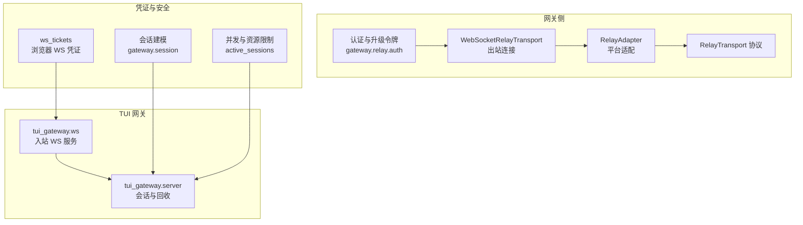
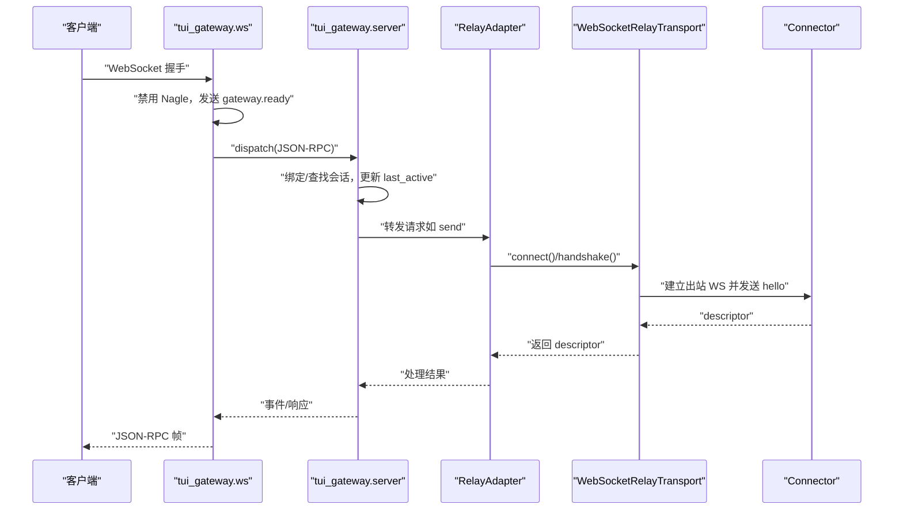
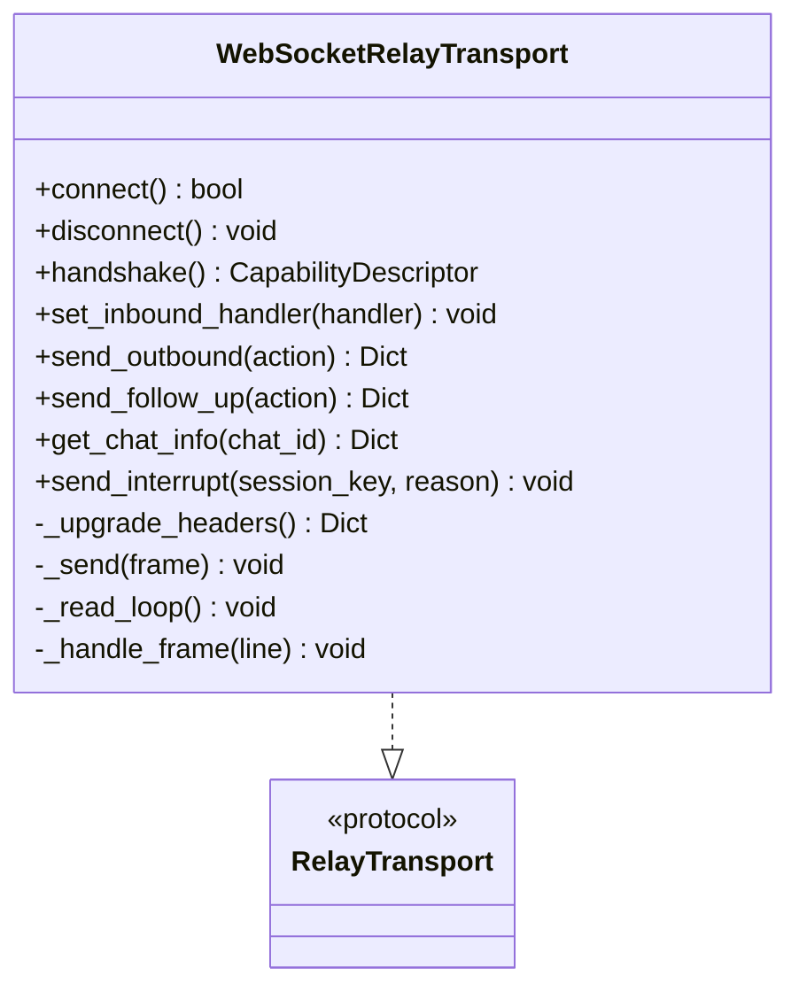
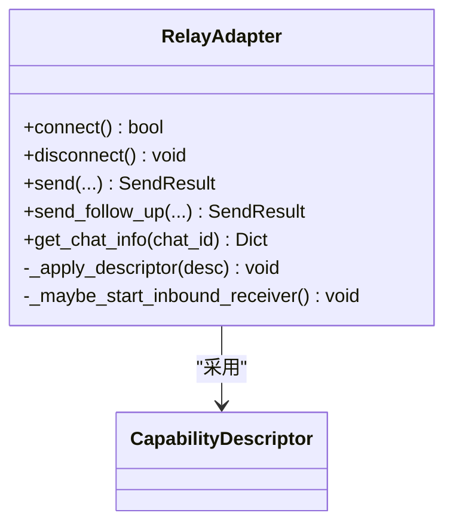
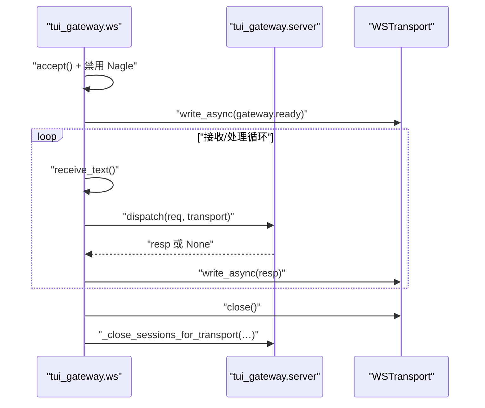
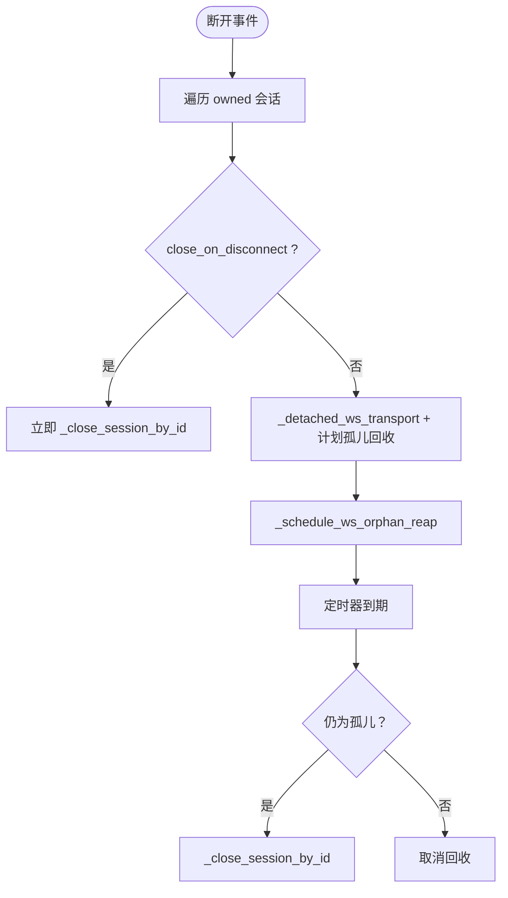
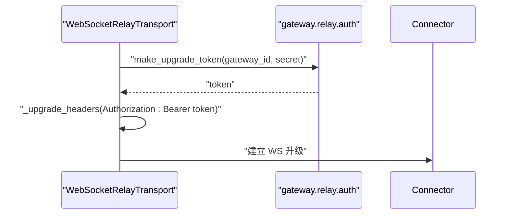
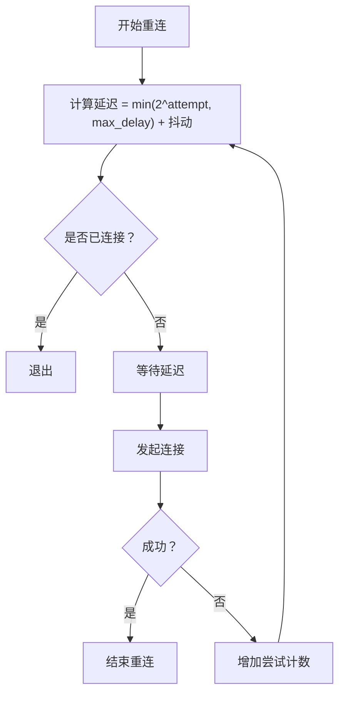
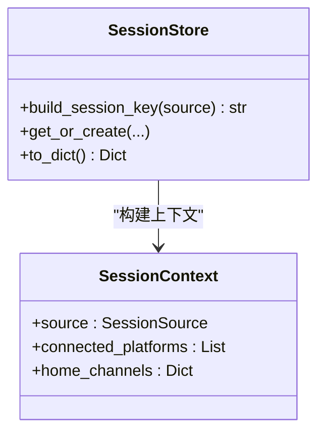
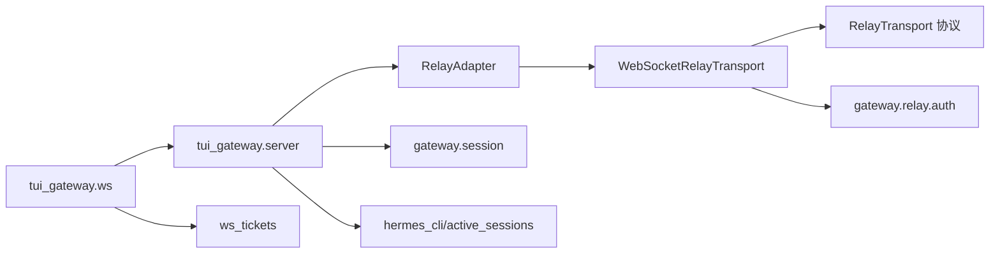

# 连接管理

<cite>
**本文引用的文件**
- [gateway/relay/ws_transport.py](file://gateway/relay/ws_transport.py)
- [gateway/relay/transport.py](file://gateway/relay/transport.py)
- [gateway/relay/adapter.py](file://gateway/relay/adapter.py)
- [gateway/relay/auth.py](file://gateway/relay/auth.py)
- [tui_gateway/ws.py](file://tui_gateway/ws.py)
- [tui_gateway/server.py](file://tui_gateway/server.py)
- [hermes_cli/dashboard_auth/ws_tickets.py](file://hermes_cli/dashboard_auth/ws_tickets.py)
- [gateway/session.py](file://gateway/session.py)
- [agent/retry_utils.py](file://agent/retry_utils.py)
- [gateway/platforms/yuanbao.py](file://gateway/platforms/yuanbao.py)
- [hermes_cli/active_sessions.py](file://hermes_cli/active_sessions.py)
- [tests/test_tui_gateway_ws.py](file://tests/test_tui_gateway_ws.py)
- [tests/test_tui_gateway_server.py](file://tests/test_tui_gateway_server.py)
- [ui-tui/src/__tests__/gatewayRecovery.test.ts](file://ui-tui/src/__tests__/gatewayRecovery.test.ts)
</cite>

## 目录
1. [引言](#引言)
2. [项目结构](#项目结构)
3. [核心组件](#核心组件)
4. [架构总览](#架构总览)
5. [详细组件分析](#详细组件分析)
6. [依赖分析](#依赖分析)
7. [性能考量](#性能考量)
8. [故障排查指南](#故障排查指南)
9. [结论](#结论)
10. [附录](#附录)

## 引言
本文件系统化梳理了该代码库中的 WebSocket 连接管理机制，覆盖从握手与认证、连接生命周期、状态跟踪与空闲回收、重连与退避、会话绑定与传输切换、到监控与诊断、以及安全与访问控制等全链路能力。目标是帮助开发者与运维人员快速理解并正确使用与扩展连接管理功能。

## 项目结构
围绕 WebSocket 的连接管理涉及以下模块：
- 网关侧生产传输：WebSocketRelayTransport（面向 connector 的出站 WebSocket）
- 适配器层：RelayAdapter（统一平台适配，委托传输）
- TUI 网关 WebSocket 服务端：tui_gateway.ws 与 tui_gateway.server（入站客户端连接）
- 认证与凭证：gateway.relay.auth（升级令牌）、hermes_cli.dashboard_auth.ws_tickets（浏览器 WS 凭证）
- 会话与资源：gateway.session（会话建模）、tui_gateway.server（会话状态与回收）
- 重连与退避：gateway/platforms/yuanbao.py、agent/retry_utils.py
- 资源上限与并发：hermes_cli/active_sessions.py
- 测试与前端恢复策略：tests/* 与 ui-tui/* 测试

图示来源
- [gateway/relay/ws_transport.py:102-299](file://gateway/relay/ws_transport.py#L102-L299)
- [gateway/relay/adapter.py:44-100](file://gateway/relay/adapter.py#L44-L100)
- [gateway/relay/transport.py:34-102](file://gateway/relay/transport.py#L34-L102)
- [gateway/relay/auth.py:97-106](file://gateway/relay/auth.py#L97-L106)
- [tui_gateway/ws.py:173-341](file://tui_gateway/ws.py#L173-L341)
- [tui_gateway/server.py:495-573](file://tui_gateway/server.py#L495-L573)
- [hermes_cli/dashboard_auth/ws_tickets.py:62-162](file://hermes_cli/dashboard_auth/ws_tickets.py#L62-L162)
- [gateway/session.py:702-800](file://gateway/session.py#L702-L800)
- [hermes_cli/active_sessions.py:220-257](file://hermes_cli/active_sessions.py#L220-L257)

章节来源
- [gateway/relay/ws_transport.py:102-299](file://gateway/relay/ws_transport.py#L102-L299)
- [tui_gateway/ws.py:173-341](file://tui_gateway/ws.py#L173-L341)
- [tui_gateway/server.py:495-573](file://tui_gateway/server.py#L495-L573)
- [gateway/relay/auth.py:97-106](file://gateway/relay/auth.py#L97-L106)
- [hermes_cli/dashboard_auth/ws_tickets.py:62-162](file://hermes_cli/dashboard_auth/ws_tickets.py#L62-L162)
- [gateway/session.py:702-800](file://gateway/session.py#L702-L800)
- [hermes_cli/active_sessions.py:220-257](file://hermes_cli/active_sessions.py#L220-L257)

## 核心组件
- WebSocketRelayTransport：负责与 connector 建立出站 WebSocket 连接，执行握手与帧协议收发，支持超时与中断。
- RelayAdapter：面向平台的适配器，委托传输完成连接、握手、发送消息与聊天信息查询。
- tui_gateway.ws：FastAPI WebSocket 入站处理器，负责握手、Nagle 禁用、事件派发与线程安全写。
- tui_gateway.server：会话状态管理、空闲回收、孤儿会话回收、传输断开后的会话处置。
- 认证与凭证：升级令牌生成与校验；浏览器 WS 凭证（单次票据与进程级内部凭证）。
- 会话与资源：会话键生成、存储与上下文注入；并发槽位与租约控制。

章节来源
- [gateway/relay/ws_transport.py:102-299](file://gateway/relay/ws_transport.py#L102-L299)
- [gateway/relay/adapter.py:44-100](file://gateway/relay/adapter.py#L44-L100)
- [tui_gateway/ws.py:51-144](file://tui_gateway/ws.py#L51-L144)
- [tui_gateway/server.py:495-573](file://tui_gateway/server.py#L495-L573)
- [gateway/relay/auth.py:97-106](file://gateway/relay/auth.py#L97-L106)
- [hermes_cli/dashboard_auth/ws_tickets.py:62-162](file://hermes_cli/dashboard_auth/ws_tickets.py#L62-L162)
- [gateway/session.py:618-640](file://gateway/session.py#L618-L640)
- [hermes_cli/active_sessions.py:220-257](file://hermes_cli/active_sessions.py#L220-L257)

## 架构总览
下图展示从浏览器/桌面客户端到 TUI 网关再到网关适配器与出站 WebSocket 的完整路径。

图示来源
- [tui_gateway/ws.py:173-341](file://tui_gateway/ws.py#L173-L341)
- [tui_gateway/server.py:728-754](file://tui_gateway/server.py#L728-L754)
- [gateway/relay/adapter.py:79-100](file://gateway/relay/adapter.py#L79-L100)
- [gateway/relay/ws_transport.py:145-201](file://gateway/relay/ws_transport.py#L145-L201)

## 详细组件分析

### 组件A：WebSocketRelayTransport（出站传输）
- 职责：建立与 connector 的出站 WebSocket，发送 hello 获取 descriptor，注册入站回调，处理请求-响应模式，支持中断帧。
- 握手与认证：通过 _upgrade_headers 注入 Authorization: Bearer <token>，token 由 make_upgrade_token 生成。
- 超时与异常：握手与出站请求均设置超时；读循环捕获异常并记录，避免阻塞任务。
- 帧协议：按行分隔的 JSON 帧，支持 descriptor、inbound、outbound、outbound_result、interrupt、interrupt_inbound。

图示来源
- [gateway/relay/ws_transport.py:102-299](file://gateway/relay/ws_transport.py#L102-L299)
- [gateway/relay/transport.py:34-102](file://gateway/relay/transport.py#L34-L102)

章节来源
- [gateway/relay/ws_transport.py:145-201](file://gateway/relay/ws_transport.py#L145-L201)
- [gateway/relay/ws_transport.py:244-299](file://gateway/relay/ws_transport.py#L244-L299)
- [gateway/relay/auth.py:97-106](file://gateway/relay/auth.py#L97-L106)

### 组件B：RelayAdapter（平台适配器）
- 职责：在 connect 中调用传输 connect/handshake，并采用 descriptor 更新能力表面；在 disconnect 中清理 inbound 接收器与传输。
- 能力表面：根据 descriptor 设置最大消息长度、Markdown 支持、草稿流支持等。
- 发送与查询：封装 send/send_follow_up/get_chat_info，统一返回 SendResult。

图示来源
- [gateway/relay/adapter.py:44-100](file://gateway/relay/adapter.py#L44-L100)
- [gateway/relay/adapter.py:129-134](file://gateway/relay/adapter.py#L129-L134)

章节来源
- [gateway/relay/adapter.py:79-100](file://gateway/relay/adapter.py#L79-L100)
- [gateway/relay/adapter.py:150-188](file://gateway/relay/adapter.py#L150-L188)

### 组件C：tui_gateway.ws（入站 WebSocket 服务）
- 职责：接受 WebSocket 连接，发送 gateway.ready，逐行解析 JSON-RPC 请求，派发至 server.dispatch，线程安全写回。
- 安全与性能：禁用 Nagle 提升流式输出体验；write 方法在事件循环线程与工作线程间选择不同调度策略；超时保护避免阻塞。
- 断开处理：捕获 WebSocketDisconnect，记录断开原因，关闭传输并触发会话回收。

图示来源
- [tui_gateway/ws.py:173-341](file://tui_gateway/ws.py#L173-L341)
- [tui_gateway/ws.py:51-144](file://tui_gateway/ws.py#L51-L144)

章节来源
- [tui_gateway/ws.py:173-341](file://tui_gateway/ws.py#L173-L341)
- [tui_gateway/ws.py:51-144](file://tui_gateway/ws.py#L51-L144)

### 组件D：tui_gateway.server（会话与回收）
- 会话状态：维护 _sessions 字典，记录 transport、running、agent_ready、last_active、created_at 等。
- 孤儿回收：断开后对非 close_on_disconnect 的会话指向 _detached_ws_transport，并在可配置宽限窗口后回收。
- TTL 回收：基于 last_active 与 created_at 的会话 TTL 检查，周期性扫描回收。
- 并发安全：使用 RLock 保证会话字典修改一致性。

图示来源
- [tui_gateway/server.py:539-573](file://tui_gateway/server.py#L539-L573)
- [tui_gateway/server.py:509-536](file://tui_gateway/server.py#L509-L536)
- [tui_gateway/server.py:594-616](file://tui_gateway/server.py#L594-L616)

章节来源
- [tui_gateway/server.py:495-573](file://tui_gateway/server.py#L495-L573)
- [tui_gateway/server.py:583-640](file://tui_gateway/server.py#L583-L640)

### 组件E：认证与凭证
- 升级认证：WebSocketRelayTransport 在握手前通过 _upgrade_headers 注入 Authorization: Bearer <token>，token 由 make_upgrade_token(gateway_id, secret) 生成。
- 浏览器 WS 凭证：ws_tickets 提供两类凭证——一次性票据（TTL=30s）与进程级内部凭证（多用、不注入前端）。
- 签名验证：inbound delivery 使用 HMAC-SHA256 签名，带时间戳与重放窗口检查。

图示来源
- [gateway/relay/auth.py:97-106](file://gateway/relay/auth.py#L97-L106)
- [gateway/relay/ws_transport.py:158-173](file://gateway/relay/ws_transport.py#L158-L173)

章节来源
- [gateway/relay/auth.py:97-106](file://gateway/relay/auth.py#L97-L106)
- [hermes_cli/dashboard_auth/ws_tickets.py:62-162](file://hermes_cli/dashboard_auth/ws_tickets.py#L62-L162)

### 组件F：重连策略与退避
- 平台级重连：gateway/platforms/yuanbao.py 实现指数退避（1s、2s、4s…上限 60s），避免雪崩。
- 通用退避：agent/retry_utils 提供指数退避 + 抖动，支持最小/最大延迟与抖动比例。
- 前端恢复预算：ui-tui 测试显示存在恢复尝试次数预算与时间窗口，防止启动风暴。

图示来源
- [gateway/platforms/yuanbao.py:3763-3780](file://gateway/platforms/yuanbao.py#L3763-L3780)
- [agent/retry_utils.py:39-57](file://agent/retry_utils.py#L39-L57)
- [ui-tui/src/__tests__/gatewayRecovery.test.ts:1-47](file://ui-tui/src/__tests__/gatewayRecovery.test.ts#L1-L47)

章节来源
- [gateway/platforms/yuanbao.py:3763-3780](file://gateway/platforms/yuanbao.py#L3763-L3780)
- [agent/retry_utils.py:39-57](file://agent/retry_utils.py#L39-L57)
- [ui-tui/src/__tests__/gatewayRecovery.test.ts:1-47](file://ui-tui/src/__tests__/gatewayRecovery.test.ts#L1-L47)

### 组件G：会话绑定与传输管理
- 会话键与上下文：gateway/session 提供构建会话键、上下文注入与存储；支持 PII 红色与共享多用户会话规则。
- 传输绑定：tui_gateway.ws 将每个 WebSocket 连接绑定到 WSTransport；断开后将 owned 会话标记为孤儿或立即回收。
- 资源限制：hermes_cli/active_sessions 提供并发会话租约与释放，避免资源耗尽。

图示来源
- [gateway/session.py:618-699](file://gateway/session.py#L618-L699)
- [gateway/session.py:160-194](file://gateway/session.py#L160-L194)

章节来源
- [gateway/session.py:618-699](file://gateway/session.py#L618-L699)
- [tui_gateway/server.py:728-754](file://tui_gateway/server.py#L728-L754)
- [hermes_cli/active_sessions.py:220-257](file://hermes_cli/active_sessions.py#L220-L257)

## 依赖分析
- WebSocketRelayTransport 依赖 RelayTransport 协议与 CapabilityDescriptor；通过 websockets 库实现连接与帧读写。
- RelayAdapter 依赖传输实现与描述符，负责能力表面与入站接收器启动。
- tui_gateway.ws 依赖 FastAPI WebSocket 类型与 tui_gateway.server 的 dispatch；WSTransport 独立于框架，提供线程安全写。
- 认证模块独立于传输，为升级阶段提供令牌生成与校验。
- 会话与资源模块被 server 与 CLI 层广泛使用。

图示来源
- [tui_gateway/ws.py:173-341](file://tui_gateway/ws.py#L173-L341)
- [tui_gateway/server.py:728-754](file://tui_gateway/server.py#L728-L754)
- [gateway/relay/adapter.py:44-100](file://gateway/relay/adapter.py#L44-L100)
- [gateway/relay/ws_transport.py:102-201](file://gateway/relay/ws_transport.py#L102-L201)
- [gateway/relay/transport.py:34-102](file://gateway/relay/transport.py#L34-L102)
- [gateway/relay/auth.py:97-106](file://gateway/relay/auth.py#L97-L106)
- [gateway/session.py:702-800](file://gateway/session.py#L702-L800)
- [hermes_cli/active_sessions.py:220-257](file://hermes_cli/active_sessions.py#L220-L257)
- [hermes_cli/dashboard_auth/ws_tickets.py:62-162](file://hermes_cli/dashboard_auth/ws_tickets.py#L62-L162)

章节来源
- [gateway/relay/ws_transport.py:102-201](file://gateway/relay/ws_transport.py#L102-L201)
- [gateway/relay/adapter.py:44-100](file://gateway/relay/adapter.py#L44-L100)
- [tui_gateway/ws.py:173-341](file://tui_gateway/ws.py#L173-L341)
- [tui_gateway/server.py:728-754](file://tui_gateway/server.py#L728-L754)

## 性能考量
- 流式输出优化：tui_gateway.ws 禁用 Nagle，确保小帧即时发送，改善客户端平滑体验。
- 写入超时保护：WSTransport 对线程外写入设置超时，避免事件循环卡顿导致永久阻塞。
- 读循环健壮性：WebSocketRelayTransport 的读循环捕获异常并记录，避免任务崩溃影响整体。
- 回收策略：孤儿回收与 TTL 回收双轨并行，减少僵尸会话占用资源。

章节来源
- [tui_gateway/ws.py:155-171](file://tui_gateway/ws.py#L155-L171)
- [tui_gateway/ws.py:95-122](file://tui_gateway/ws.py#L95-L122)
- [gateway/relay/ws_transport.py:250-266](file://gateway/relay/ws_transport.py#L250-L266)
- [tui_gateway/server.py:583-640](file://tui_gateway/server.py#L583-L640)

## 故障排查指南
- 握手失败：检查 _upgrade_headers 是否正确生成 token，确认 gateway_id 与 secret 配置一致。
- 连接断开：查看 tui_gateway.ws 的断开原因与统计；确认 _close_sessions_for_transport 是否正确回收 owned 会话。
- 孤儿会话：若宽限窗口内未重连，确认 _schedule_ws_orphan_reap 是否触发；检查 _ws_session_is_orphaned 判断逻辑。
- 超时问题：检查 WebSocketRelayTransport 的握手与出站超时；核对网络延迟与 connector 响应。
- 资源耗尽：检查 hermes_cli/active_sessions 的租约与释放；必要时调整并发上限。

章节来源
- [gateway/relay/auth.py:97-106](file://gateway/relay/auth.py#L97-L106)
- [tui_gateway/ws.py:300-341](file://tui_gateway/ws.py#L300-L341)
- [tui_gateway/server.py:539-573](file://tui_gateway/server.py#L539-L573)
- [tui_gateway/server.py:495-507](file://tui_gateway/server.py#L495-L507)
- [gateway/relay/ws_transport.py:196-201](file://gateway/relay/ws_transport.py#L196-L201)
- [hermes_cli/active_sessions.py:220-257](file://hermes_cli/active_sessions.py#L220-L257)

## 结论
该连接管理体系以 tui_gateway.ws 为入口，结合 tui_gateway.server 的会话与回收策略，配合 WebSocketRelayTransport 的出站连接与 RelayAdapter 的平台适配，形成了从握手、认证、初始化、状态管理到断开回收的闭环。通过升级令牌、浏览器 WS 凭证与签名验证强化安全，辅以重连退避与资源限制，满足生产环境的稳定性与可运维性要求。

## 附录
- 测试参考：测试覆盖了断开回收、孤儿会话判定、会话创建标志位等关键行为，便于回归验证与扩展。
- 前端恢复：前端测试展示了恢复尝试预算与时间窗口的策略，有助于理解重启/崩溃场景下的恢复行为。

章节来源
- [tests/test_tui_gateway_ws.py:29-79](file://tests/test_tui_gateway_ws.py#L29-L79)
- [tests/test_tui_gateway_server.py:1663-1701](file://tests/test_tui_gateway_server.py#L1663-L1701)
- [tests/test_tui_gateway_server.py:7583-7612](file://tests/test_tui_gateway_server.py#L7583-L7612)
- [ui-tui/src/__tests__/gatewayRecovery.test.ts:1-47](file://ui-tui/src/__tests__/gatewayRecovery.test.ts#L1-L47)