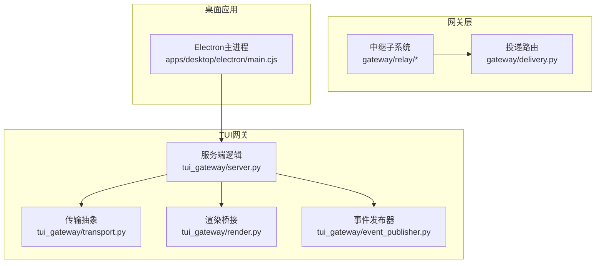
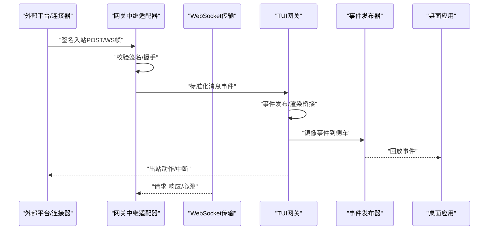
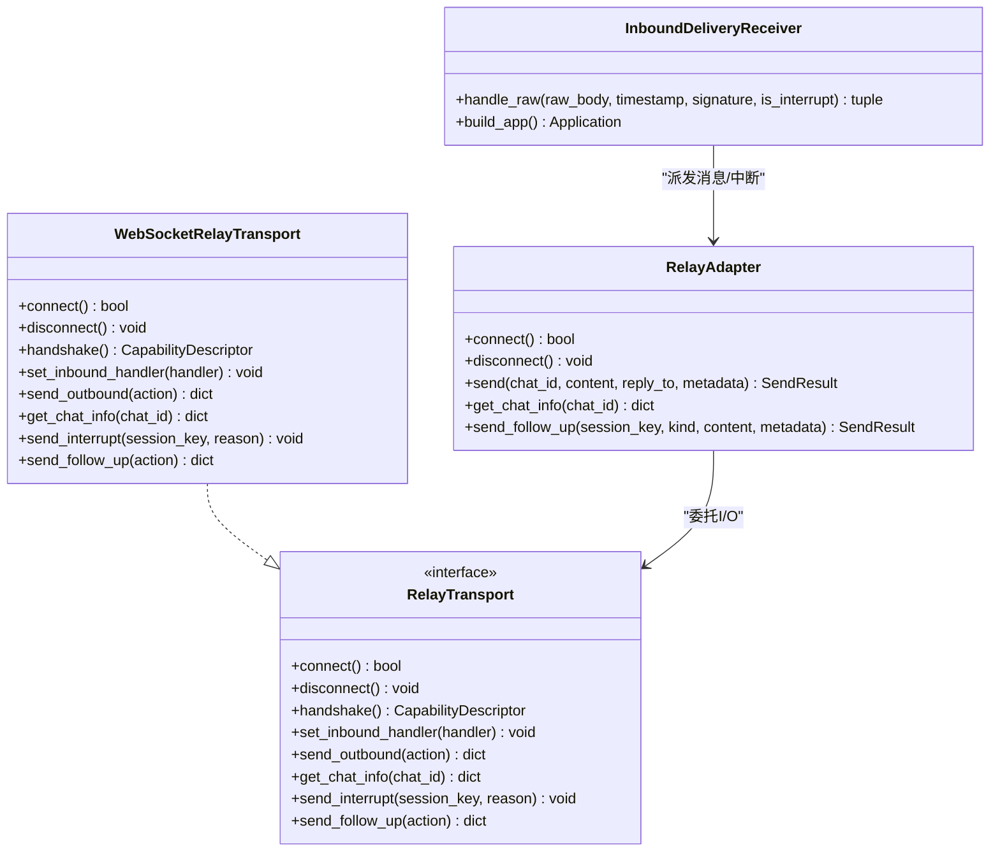
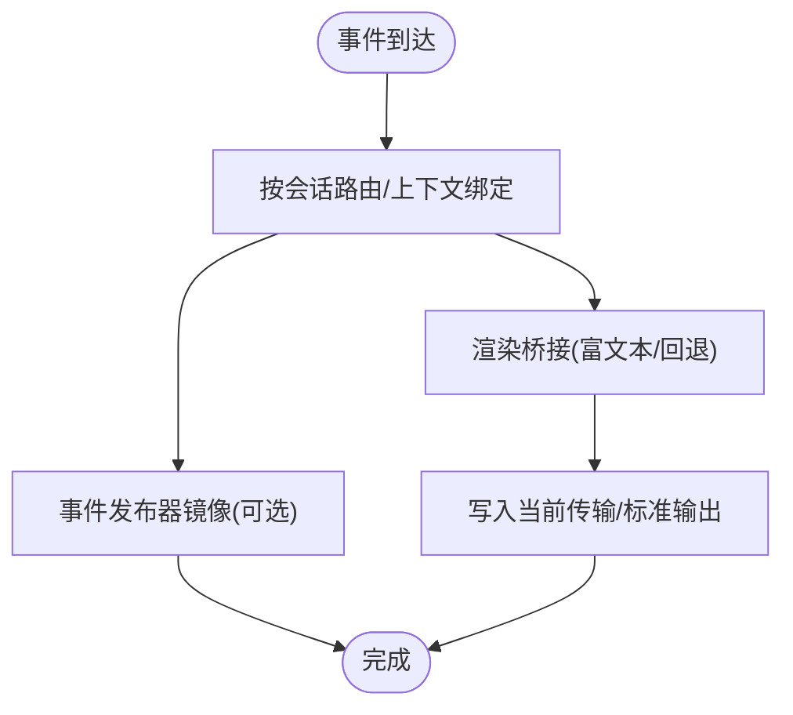
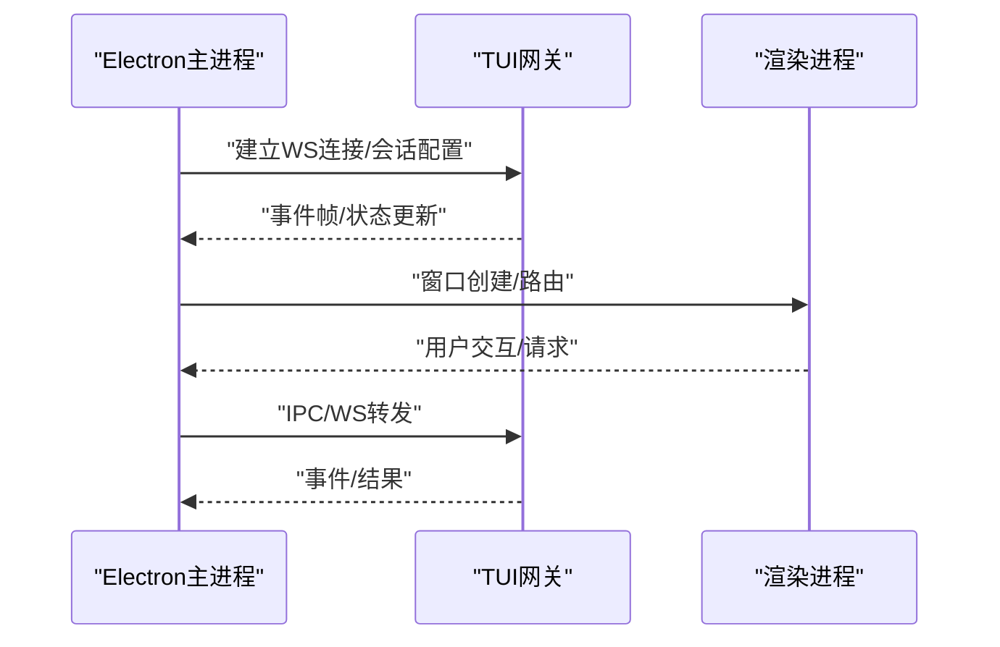
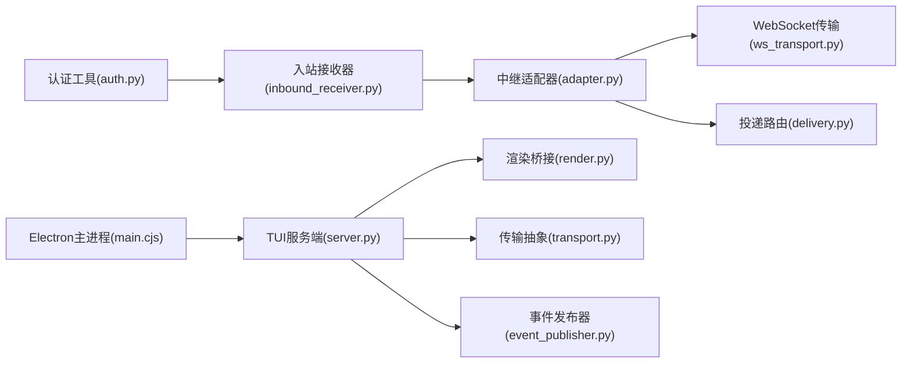

# 内部API

<cite>
**本文引用的文件**
- [gateway/relay/inbound_receiver.py](file://gateway/relay/inbound_receiver.py)
- [gateway/relay/transport.py](file://gateway/relay/transport.py)
- [gateway/relay/ws_transport.py](file://gateway/relay/ws_transport.py)
- [gateway/relay/adapter.py](file://gateway/relay/adapter.py)
- [gateway/relay/auth.py](file://gateway/relay/auth.py)
- [gateway/delivery.py](file://gateway/delivery.py)
- [tui_gateway/server.py](file://tui_gateway/server.py)
- [tui_gateway/event_publisher.py](file://tui_gateway/event_publisher.py)
- [tui_gateway/render.py](file://tui_gateway/render.py)
- [tui_gateway/transport.py](file://tui_gateway/transport.py)
- [apps/desktop/electron/main.cjs](file://apps/desktop/electron/main.cjs)
</cite>

## 目录
1. [引言](#引言)
2. [项目结构](#项目结构)
3. [核心组件](#核心组件)
4. [架构总览](#架构总览)
5. [详细组件分析](#详细组件分析)
6. [依赖分析](#依赖分析)
7. [性能考量](#性能考量)
8. [故障排查指南](#故障排查指南)
9. [结论](#结论)
10. [附录](#附录)

## 引言
本文件面向内部开发者，系统化梳理系统内部组件间的通信协议与接口契约，覆盖以下主题：
- 网关中继API：入站接收器、传输适配器与WS传输协议
- TUI网关内部接口：事件发布、渲染协调与用户交互处理
- 代理服务器内部API：适配器模式、请求转发与响应处理
- 桌面应用内部通信：Electron主进程与渲染进程的消息传递
- 版本兼容性、错误处理与性能监控方案
- 安全考虑与访问控制机制

## 项目结构
本仓库采用多模块分层组织，关键模块如下：
- gateway：消息平台网关与中继通道，负责平台适配、消息投递与安全认证
- tui_gateway：终端交互式网关，承载事件发布、渲染桥接与会话生命周期管理
- apps/desktop：桌面应用（Electron），负责与网关的IPC与窗口管理
- agent：智能体运行时与工具链，为网关提供能力扩展与上下文压缩等支撑

**图表来源**
- [gateway/relay/inbound_receiver.py](file://gateway/relay/inbound_receiver.py)
- [gateway/relay/transport.py](file://gateway/relay/transport.py)
- [gateway/relay/ws_transport.py](file://gateway/relay/ws_transport.py)
- [gateway/relay/adapter.py](file://gateway/relay/adapter.py)
- [gateway/delivery.py](file://gateway/delivery.py)
- [tui_gateway/server.py](file://tui_gateway/server.py)
- [tui_gateway/transport.py](file://tui_gateway/transport.py)
- [tui_gateway/render.py](file://tui_gateway/render.py)
- [tui_gateway/event_publisher.py](file://tui_gateway/event_publisher.py)
- [apps/desktop/electron/main.cjs](file://apps/desktop/electron/main.cjs)

**章节来源**
- [gateway/relay/inbound_receiver.py](file://gateway/relay/inbound_receiver.py)
- [gateway/relay/transport.py](file://gateway/relay/transport.py)
- [gateway/relay/ws_transport.py](file://gateway/relay/ws_transport.py)
- [gateway/relay/adapter.py](file://gateway/relay/adapter.py)
- [gateway/delivery.py](file://gateway/delivery.py)
- [tui_gateway/server.py](file://tui_gateway/server.py)
- [tui_gateway/transport.py](file://tui_gateway/transport.py)
- [tui_gateway/render.py](file://tui_gateway/render.py)
- [tui_gateway/event_publisher.py](file://tui_gateway/event_publisher.py)
- [apps/desktop/electron/main.cjs](file://apps/desktop/electron/main.cjs)

## 核心组件
- 中继适配器与传输协议：统一抽象出连接、握手、入站/出站消息与中断路由的契约，屏蔽具体传输细节
- 入站接收器：验证签名后将标准化消息事件派发到网关适配器
- WebSocket传输：生产环境的长连接传输实现，支持请求-响应模型与帧协议
- 投递路由：根据目标解析平台与聊天ID，执行平台适配器发送或本地落盘
- TUI网关：事件发布、渲染桥接、会话生命周期与线程池调度
- 传输抽象：统一JSON-RPC帧写入与上下文绑定，支持标准输出与WebSocket双栈
- 桌面应用：Electron主进程负责窗口、IPC与后端探活

**章节来源**
- [gateway/relay/transport.py](file://gateway/relay/transport.py)
- [gateway/relay/adapter.py](file://gateway/relay/adapter.py)
- [gateway/relay/inbound_receiver.py](file://gateway/relay/inbound_receiver.py)
- [gateway/relay/ws_transport.py](file://gateway/relay/ws_transport.py)
- [gateway/delivery.py](file://gateway/delivery.py)
- [tui_gateway/server.py](file://tui_gateway/server.py)
- [tui_gateway/transport.py](file://tui_gateway/transport.py)

## 架构总览
下图展示从“外部平台”到“桌面应用”的完整数据通路与安全边界。

**图表来源**
- [gateway/relay/inbound_receiver.py](file://gateway/relay/inbound_receiver.py)
- [gateway/relay/ws_transport.py](file://gateway/relay/ws_transport.py)
- [gateway/relay/adapter.py](file://gateway/relay/adapter.py)
- [tui_gateway/server.py](file://tui_gateway/server.py)
- [tui_gateway/event_publisher.py](file://tui_gateway/event_publisher.py)
- [apps/desktop/electron/main.cjs](file://apps/desktop/electron/main.cjs)

## 详细组件分析

### 网关中继API（入站接收器、传输适配器与WS传输）
- 入站接收器
  - 职责：接收来自连接器的签名入站POST，验证时间戳与HMAC后，将标准化消息事件派发给网关适配器；支持中断路径
  - 关键点：严格使用原始字节进行签名验证，避免重序列化导致的不一致
- 传输适配器
  - 职责：实现平台适配器的连接、断开、发送与聊天信息查询；在握手后采用连接器提供的能力描述
  - 关键点：通过注入的传输实现解耦，支持测试桩与生产WS
- WebSocket传输
  - 协议：基于换行分隔的JSON帧，定义hello/descriptor/inbound/outbound/outbound_result/interrupt/interrupt_inbound等类型
  - 生命周期：握手超时、请求-响应Future映射、后台读循环与异常处理
  - 安全：升级阶段携带授权令牌，支持网关ID索引与密钥轮换

**图表来源**
- [gateway/relay/inbound_receiver.py](file://gateway/relay/inbound_receiver.py)
- [gateway/relay/transport.py](file://gateway/relay/transport.py)
- [gateway/relay/ws_transport.py](file://gateway/relay/ws_transport.py)
- [gateway/relay/adapter.py](file://gateway/relay/adapter.py)

**章节来源**
- [gateway/relay/inbound_receiver.py](file://gateway/relay/inbound_receiver.py)
- [gateway/relay/transport.py](file://gateway/relay/transport.py)
- [gateway/relay/ws_transport.py](file://gateway/relay/ws_transport.py)
- [gateway/relay/adapter.py](file://gateway/relay/adapter.py)
- [gateway/relay/auth.py](file://gateway/relay/auth.py)

### TUI网关内部接口（事件发布、渲染协调与用户交互）
- 事件发布
  - 通过事件发布器将TUI侧事件镜像到桌面侧，采用异步队列与守护线程，失败静默
- 渲染协调
  - 渲染桥接优先使用agent.rich_output，否则回退至前端Markdown渲染
- 用户交互处理
  - 会话生命周期管理、主动会话槽位占用/释放、空闲回收、WS孤儿会话清理
  - 线程池调度慢操作（如slash.exec、session.resume等），保证快速路径有序性
- 传输抽象
  - 统一JSON-RPC帧写入，支持上下文绑定的当前传输与模块级标准输出回退
  - 标准输出传输对“对端已断开”进行精确判定，避免误判为编程错误

**图表来源**
- [tui_gateway/server.py](file://tui_gateway/server.py)
- [tui_gateway/event_publisher.py](file://tui_gateway/event_publisher.py)
- [tui_gateway/render.py](file://tui_gateway/render.py)
- [tui_gateway/transport.py](file://tui_gateway/transport.py)

**章节来源**
- [tui_gateway/server.py](file://tui_gateway/server.py)
- [tui_gateway/event_publisher.py](file://tui_gateway/event_publisher.py)
- [tui_gateway/render.py](file://tui_gateway/render.py)
- [tui_gateway/transport.py](file://tui_gateway/transport.py)

### 代理服务器内部API（适配器模式、请求转发与响应处理）
- 适配器模式
  - 以RelayAdapter为中心，将平台特定逻辑剥离，仅暴露统一能力描述与发送接口
- 请求转发
  - 出站动作封装为动作字典，经WebSocket传输发出，并以requestId等待outbound_result
- 响应处理
  - 后台读循环解析帧，匹配请求-响应Future并返回结果；超时返回带错误码的结果

**章节来源**
- [gateway/relay/adapter.py](file://gateway/relay/adapter.py)
- [gateway/relay/transport.py](file://gateway/relay/transport.py)
- [gateway/relay/ws_transport.py](file://gateway/relay/ws_transport.py)

### 桌面应用内部通信（Electron主进程与渲染进程）
- 主进程职责
  - 窗口生命周期、菜单、通知、剪贴板、协议注册、网络请求与安全存储
  - 与后端（TUI网关）建立WebSocket连接，构建会话窗口与仪表盘集成
- 渲染进程职责
  - React应用入口、主题与国际化、错误边界与性能探针（开发态）

**图表来源**
- [apps/desktop/electron/main.cjs](file://apps/desktop/electron/main.cjs)
- [tui_gateway/server.py](file://tui_gateway/server.py)

**章节来源**
- [apps/desktop/electron/main.cjs](file://apps/desktop/electron/main.cjs)
- [tui_gateway/server.py](file://tui_gateway/server.py)

## 依赖分析
- 组件内聚与耦合
  - 中继子系统通过协议接口解耦传输实现，便于替换与测试
  - TUI网关通过传输抽象与事件发布器实现与上层的松耦合
- 外部依赖
  - aiohttp/websockets用于HTTP与WebSocket功能（可选依赖）
  - Electron主进程承担窗口与IPC，渲染进程承担UI

**图表来源**
- [gateway/relay/auth.py](file://gateway/relay/auth.py)
- [gateway/relay/inbound_receiver.py](file://gateway/relay/inbound_receiver.py)
- [gateway/relay/adapter.py](file://gateway/relay/adapter.py)
- [gateway/relay/ws_transport.py](file://gateway/relay/ws_transport.py)
- [gateway/delivery.py](file://gateway/delivery.py)
- [tui_gateway/server.py](file://tui_gateway/server.py)
- [tui_gateway/render.py](file://tui_gateway/render.py)
- [tui_gateway/transport.py](file://tui_gateway/transport.py)
- [tui_gateway/event_publisher.py](file://tui_gateway/event_publisher.py)
- [apps/desktop/electron/main.cjs](file://apps/desktop/electron/main.cjs)

**章节来源**
- [gateway/relay/auth.py](file://gateway/relay/auth.py)
- [gateway/relay/inbound_receiver.py](file://gateway/relay/inbound_receiver.py)
- [gateway/relay/adapter.py](file://gateway/relay/adapter.py)
- [gateway/relay/ws_transport.py](file://gateway/relay/ws_transport.py)
- [gateway/delivery.py](file://gateway/delivery.py)
- [tui_gateway/server.py](file://tui_gateway/server.py)
- [tui_gateway/render.py](file://tui_gateway/render.py)
- [tui_gateway/transport.py](file://tui_gateway/transport.py)
- [tui_gateway/event_publisher.py](file://tui_gateway/event_publisher.py)
- [apps/desktop/electron/main.cjs](file://apps/desktop/electron/main.cjs)

## 性能考量
- 并发与阻塞
  - TUI网关对慢操作使用线程池隔离，避免阻塞快速路径
  - WebSocket传输采用请求-响应Future映射，避免全局锁竞争
- I/O与缓冲
  - 标准输出传输支持禁用flush以规避半关闭管道阻塞
  - 事件发布器采用有界队列与守护线程，失败静默防止阻塞主流程
- 回收与泄漏防护
  - 会话空闲回收、WS孤儿会话清理、主动会话槽位释放与内存提交

**章节来源**
- [tui_gateway/server.py](file://tui_gateway/server.py)
- [tui_gateway/transport.py](file://tui_gateway/transport.py)
- [tui_gateway/event_publisher.py](file://tui_gateway/event_publisher.py)
- [gateway/relay/ws_transport.py](file://gateway/relay/ws_transport.py)

## 故障排查指南
- 入站接收器
  - 缺失/无效/过期签名：返回401；检查时间戳偏移与密钥轮换
  - 非法JSON：返回400；检查编码与重序列化一致性
- WebSocket传输
  - 握手/出站超时：检查连接参数与对端实现；确认requestId映射
  - 读循环异常：关注日志与取消策略，确保优雅关闭
- TUI网关
  - 标准输出断开：区分“对端已断开”与“主机I/O错误”，避免误判
  - 事件发布失败：确认连接与队列容量，守护线程健康
- 投递路由
  - 平台适配器缺失或聊天ID为空：检查目标解析与适配器注册
  - Telegram私聊话题：检查命名话题创建与回复锚点

**章节来源**
- [gateway/relay/inbound_receiver.py](file://gateway/relay/inbound_receiver.py)
- [gateway/relay/ws_transport.py](file://gateway/relay/ws_transport.py)
- [tui_gateway/transport.py](file://tui_gateway/transport.py)
- [tui_gateway/event_publisher.py](file://tui_gateway/event_publisher.py)
- [gateway/delivery.py](file://gateway/delivery.py)

## 结论
本内部API文档系统化梳理了网关中继、TUI网关与桌面应用之间的通信协议与接口契约，明确了安全、性能与可靠性方面的设计要点。通过协议抽象与传输解耦，系统实现了跨平台、可扩展且可观测的内部通信体系。

## 附录
- 版本兼容性
  - 中继协议与能力描述处于实验阶段，可能在≥2类一级平台验证前变更
- 安全与访问控制
  - 入站交付采用HMAC签名与时间戳校验；WebSocket升级采用授权令牌
  - 密钥轮换采用多密钥验证列表，支持旋转期间的兼容

**章节来源**
- [gateway/relay/auth.py](file://gateway/relay/auth.py)
- [gateway/relay/inbound_receiver.py](file://gateway/relay/inbound_receiver.py)
- [gateway/relay/ws_transport.py](file://gateway/relay/ws_transport.py)
- [gateway/relay/adapter.py](file://gateway/relay/adapter.py)