# 仪表板插件开发

<cite>
**本文档引用的文件**
- [web/src/plugins/registry.ts](file://web/src/plugins/registry.ts)
- [web/src/plugins/slots.ts](file://web/src/plugins/slots.ts)
- [web/src/plugins/usePlugins.ts](file://web/src/plugins/usePlugins.ts)
- [web/src/lib/api.ts](file://web/src/lib/api.ts)
- [web/src/themes/index.ts](file://web/src/themes/index.ts)
- [plugins/hermes-achievements/dashboard/manifest.json](file://plugins/hermes-achievements/dashboard/manifest.json)
- [plugins/kanban/dashboard/manifest.json](file://plugins/kanban/dashboard/manifest.json)
- [plugins/hermes-achievements/dashboard/plugin_api.py](file://plugins/hermes-achievements/dashboard/plugin_api.py)
- [plugins/kanban/dashboard/plugin_api.py](file://plugins/kanban/dashboard/plugin_api.py)
- [tests/fixtures/plugins/example-dashboard/dashboard/plugin_api.py](file://tests/fixtures/plugins/example-dashboard/dashboard/plugin_api.py)
</cite>

## 目录
1. [简介](#简介)
2. [项目结构](#项目结构)
3. [核心组件](#核心组件)
4. [架构概览](#架构概览)
5. [详细组件分析](#详细组件分析)
6. [依赖关系分析](#依赖关系分析)
7. [性能考虑](#性能考虑)
8. [故障排除指南](#故障排除指南)
9. [结论](#结论)
10. [附录](#附录)

## 简介

本指南面向仪表板插件开发者，系统性阐述如何基于 Hermes 仪表板框架开发功能完整的插件应用。内容涵盖 React 组件结构与状态管理、数据绑定机制、样式定制方案、交互设计规范、API 接口定义、打包分发流程以及调试测试方法。

仪表板插件采用前后端分离架构：前端通过插件 SDK 在浏览器中动态加载插件脚本，后端通过 FastAPI 提供插件专用 API 路由。插件通过注册表和插槽系统与仪表板主应用集成，实现标签页组件和页面级组件的注入。

## 项目结构

仪表板插件开发涉及以下关键目录和文件：

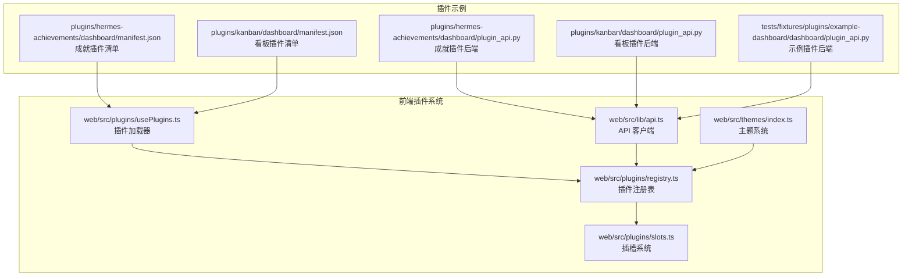

**图表来源**
- [web/src/plugins/registry.ts:1-169](file://web/src/plugins/registry.ts#L1-L169)
- [web/src/plugins/slots.ts:1-200](file://web/src/plugins/slots.ts#L1-L200)
- [web/src/plugins/usePlugins.ts:71-133](file://web/src/plugins/usePlugins.ts#L71-L133)
- [web/src/lib/api.ts:1-800](file://web/src/lib/api.ts#L1-L800)
- [web/src/themes/index.ts:1-10](file://web/src/themes/index.ts#L1-L10)

**章节来源**
- [web/src/plugins/registry.ts:1-169](file://web/src/plugins/registry.ts#L1-L169)
- [web/src/plugins/slots.ts:1-200](file://web/src/plugins/slots.ts#L1-L200)
- [web/src/plugins/usePlugins.ts:71-133](file://web/src/plugins/usePlugins.ts#L71-L133)
- [web/src/lib/api.ts:1-800](file://web/src/lib/api.ts#L1-L800)
- [web/src/themes/index.ts:1-10](file://web/src/themes/index.ts#L1-L10)

## 核心组件

### 插件注册表（Plugin Registry）

插件注册表是插件系统的核心中枢，负责维护已注册插件的映射关系和变更通知机制：

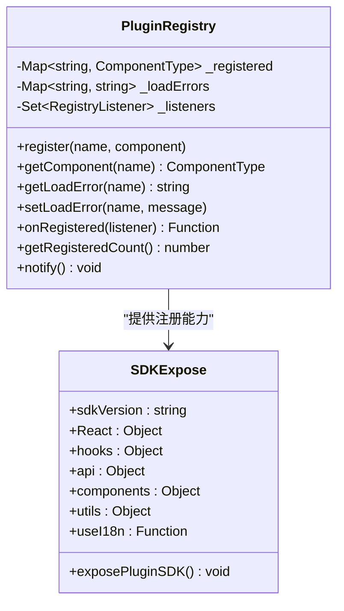

**图表来源**
- [web/src/plugins/registry.ts:34-169](file://web/src/plugins/registry.ts#L34-L169)

注册表提供以下关键能力：
- 插件组件注册与查询
- 加载错误状态管理
- 变更事件通知
- SDK 版本控制

**章节来源**
- [web/src/plugins/registry.ts:34-169](file://web/src/plugins/registry.ts#L34-L169)

### 插槽系统（Plugin Slots）

插槽系统允许插件在仪表板特定位置注入自定义组件：

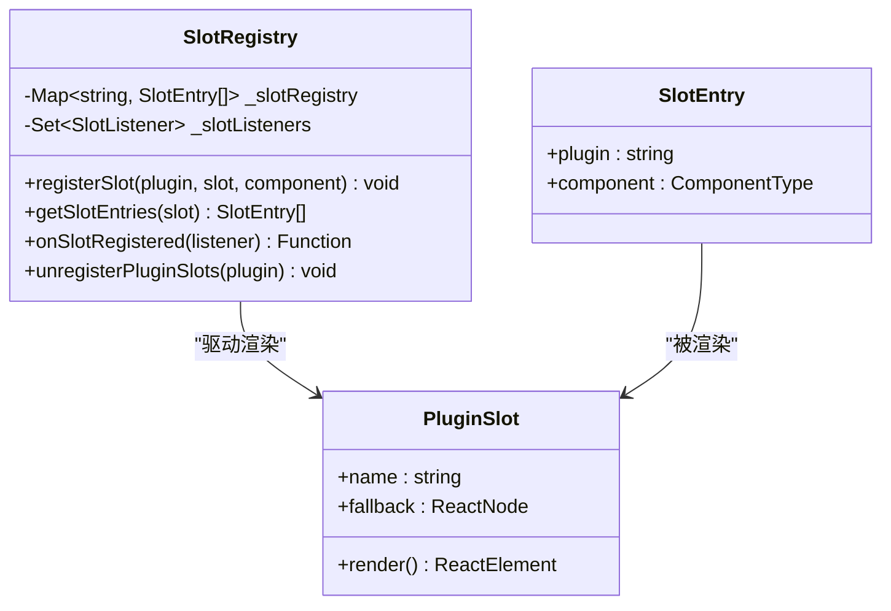

**图表来源**
- [web/src/plugins/slots.ts:95-200](file://web/src/plugins/slots.ts#L95-L200)

插槽系统支持：
- 全局壳层插槽（头部、侧边栏等）
- 页面级插槽（各内置页面的顶部/底部）
- 多插件叠加渲染
- 实时变更通知

**章节来源**
- [web/src/plugins/slots.ts:95-200](file://web/src/plugins/slots.ts#L95-L200)

### 插件加载器（Plugin Loader）

插件加载器负责从插件清单中发现并动态加载插件资源：

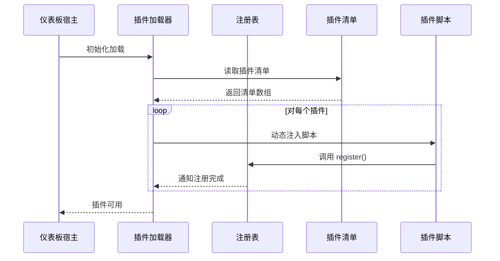

**图表来源**
- [web/src/plugins/usePlugins.ts:71-133](file://web/src/plugins/usePlugins.ts#L71-L133)

**章节来源**
- [web/src/plugins/usePlugins.ts:71-133](file://web/src/plugins/usePlugins.ts#L71-L133)

## 架构概览

仪表板插件系统采用模块化架构，前后端分离，通过标准化接口实现松耦合集成：

```mermaid
graph TB
subgraph "浏览器端"
A[插件注册表]
B[插槽系统]
C[API 客户端]
D[主题系统]
E[插件加载器]
end
subgraph "Python 后端"
F[FastAPI 应用]
G[插件路由前缀]
H[认证中间件]
I[WebSocket 支持]
end
subgraph "插件实例"
J[前端组件]
K[后端 API]
L[静态资源]
end
A < --> E
B < --> E
C < --> F
D < --> A
E < --> J
F --> G
G --> H
G --> I
H --> K
I --> K
J --> C
K --> C
```

**图表来源**
- [web/src/plugins/registry.ts:1-169](file://web/src/plugins/registry.ts#L1-L169)
- [web/src/lib/api.ts:1-800](file://web/src/lib/api.ts#L1-L800)
- [plugins/hermes-achievements/dashboard/plugin_api.py:1-1062](file://plugins/hermes-achievements/dashboard/plugin_api.py#L1-L1062)

## 详细组件分析

### React 组件结构与状态管理

#### 组件生命周期管理

插件组件应遵循以下生命周期模式：

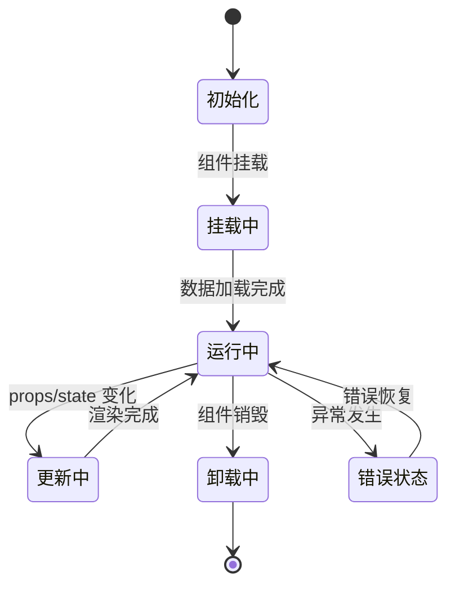

#### 状态管理模式

推荐使用以下状态管理模式：

1. **本地状态**：用于组件内部的临时状态
2. **上下文状态**：用于跨组件共享的状态
3. **外部状态**：通过 API 获取的持久化状态

**章节来源**
- [web/src/plugins/registry.ts:11-19](file://web/src/plugins/registry.ts#L11-L19)

### 数据绑定机制

#### Props 传递与验证

插件组件应实现严格的 props 验证和默认值处理：

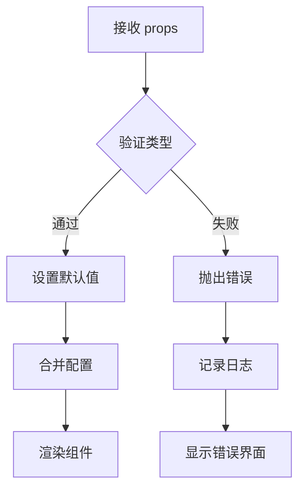

#### 状态同步策略

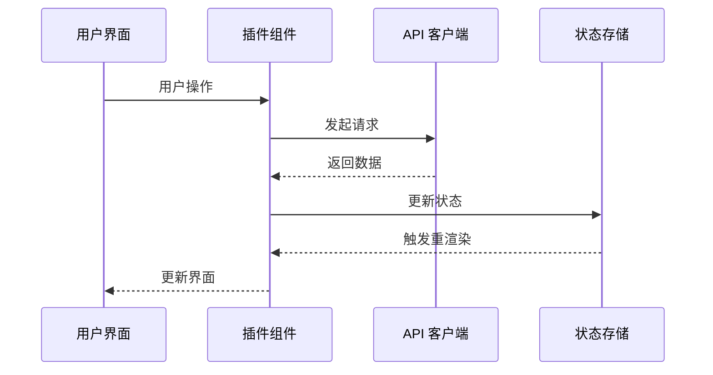

**图表来源**
- [web/src/lib/api.ts:91-189](file://web/src/lib/api.ts#L91-L189)

**章节来源**
- [web/src/lib/api.ts:91-189](file://web/src/lib/api.ts#L91-L189)

### 样式定制与主题支持

#### 主题系统架构

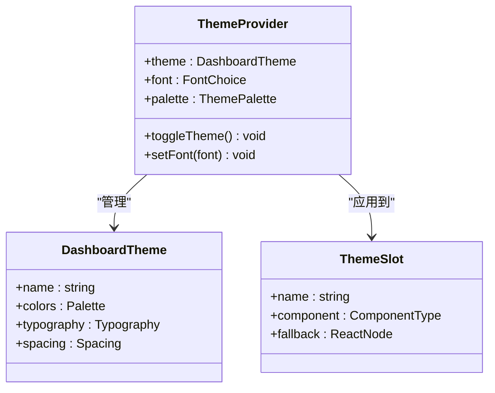

**图表来源**
- [web/src/themes/index.ts:1-10](file://web/src/themes/index.ts#L1-L10)

#### 响应式设计原则

插件应遵循以下响应式设计原则：
- 移动优先的设计策略
- 弹性布局和网格系统
- 触摸友好的交互元素
- 适配不同屏幕尺寸的断点

**章节来源**
- [web/src/themes/index.ts:1-10](file://web/src/themes/index.ts#L1-L10)

### 交互设计与用户体验

#### 用户操作反馈

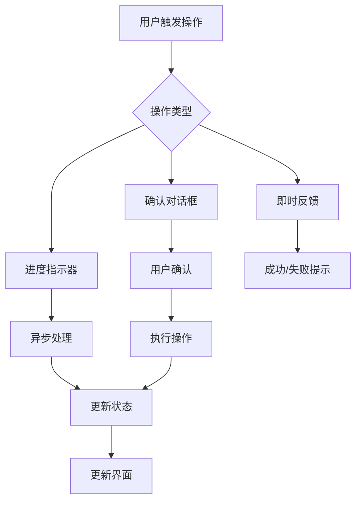

#### 进度指示与错误处理

插件应提供清晰的进度指示和错误处理机制：
- 长时间操作显示进度条或加载动画
- 错误信息以用户可理解的方式呈现
- 提供重试机制和错误恢复选项

**章节来源**
- [web/src/plugins/registry.ts:104-169](file://web/src/plugins/registry.ts#L104-L169)

### API 接口规范

#### 插件注册接口

插件通过以下接口进行注册：

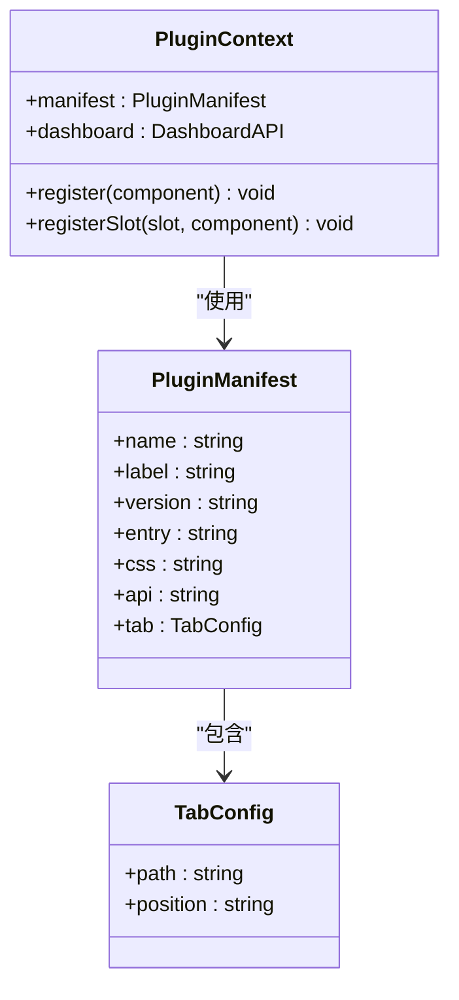

**图表来源**
- [plugins/hermes-achievements/dashboard/manifest.json:1-12](file://plugins/hermes-achievements/dashboard/manifest.json#L1-L12)
- [plugins/kanban/dashboard/manifest.json:1-15](file://plugins/kanban/dashboard/manifest.json#L1-L15)

#### 后端 API 路由

插件后端 API 通过 FastAPI 路由系统提供服务：

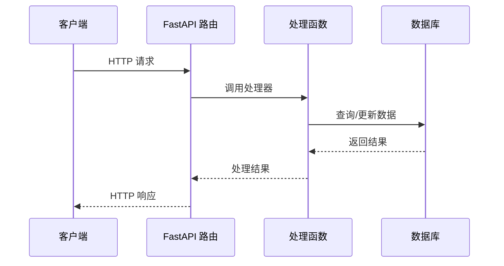

**图表来源**
- [plugins/hermes-achievements/dashboard/plugin_api.py:1-1062](file://plugins/hermes-achievements/dashboard/plugin_api.py#L1-L1062)
- [plugins/kanban/dashboard/plugin_api.py:1-800](file://plugins/kanban/dashboard/plugin_api.py#L1-L800)

**章节来源**
- [plugins/hermes-achievements/dashboard/manifest.json:1-12](file://plugins/hermes-achievements/dashboard/manifest.json#L1-L12)
- [plugins/kanban/dashboard/manifest.json:1-15](file://plugins/kanban/dashboard/manifest.json#L1-L15)
- [plugins/hermes-achievements/dashboard/plugin_api.py:1-1062](file://plugins/hermes-achievements/dashboard/plugin_api.py#L1-L1062)
- [plugins/kanban/dashboard/plugin_api.py:1-800](file://plugins/kanban/dashboard/plugin_api.py#L1-L800)

## 依赖关系分析

仪表板插件系统的依赖关系如下：

```mermaid
graph TB
subgraph "核心依赖"
A[React 18+]
B[TypeScript]
C[FastAPI]
D[SQLite]
end
subgraph "UI 组件库"
E[@nous-research/ui]
F[shadcn/ui]
end
subgraph "工具链"
G[Vite]
H[Tailwind CSS]
I[Prettier]
end
subgraph "插件系统"
J[插件注册表]
K[插槽系统]
L[API 客户端]
M[主题系统]
end
A --> J
C --> K
E --> L
F --> M
G --> J
H --> L
I --> K
```

**图表来源**
- [web/src/plugins/registry.ts:11-32](file://web/src/plugins/registry.ts#L11-L32)
- [web/src/lib/api.ts:20-34](file://web/src/lib/api.ts#L20-L34)

**章节来源**
- [web/src/plugins/registry.ts:11-32](file://web/src/plugins/registry.ts#L11-L32)
- [web/src/lib/api.ts:20-34](file://web/src/lib/api.ts#L20-L34)

## 性能考虑

### 加载性能优化

1. **代码分割**：插件脚本按需加载，避免阻塞主应用启动
2. **缓存策略**：利用浏览器缓存和 CDN 加速静态资源加载
3. **压缩传输**：启用 Gzip/Brotli 压缩减少传输体积

### 运行时性能

1. **状态管理**：合理使用 React.memo 和 useMemo 避免不必要的重渲染
2. **内存泄漏防护**：及时清理事件监听器和定时器
3. **网络请求优化**：批量请求和请求去重

## 故障排除指南

### 常见问题诊断

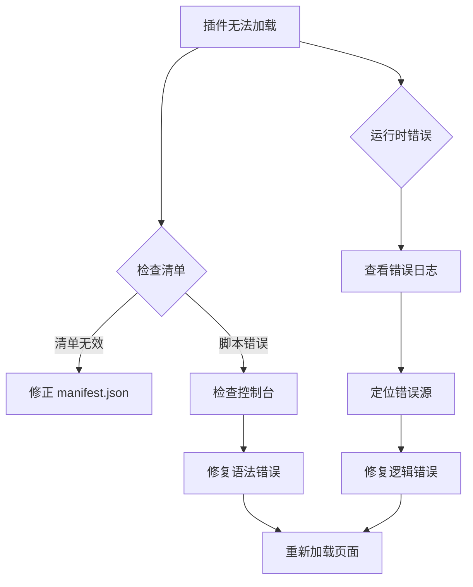

### 调试工具使用

1. **浏览器开发者工具**：监控网络请求和 JavaScript 错误
2. **插件注册表监控**：跟踪插件注册状态变化
3. **API 客户端调试**：查看请求响应和错误详情

**章节来源**
- [web/src/plugins/usePlugins.ts:71-133](file://web/src/plugins/usePlugins.ts#L71-L133)
- [web/src/plugins/registry.ts:50-85](file://web/src/plugins/registry.ts#L50-L85)

## 结论

仪表板插件开发提供了强大的扩展能力，通过标准化的注册表、插槽系统和 API 接口，开发者可以构建功能丰富、体验一致的插件应用。建议遵循本文档的最佳实践，在保证性能和用户体验的前提下，充分发挥插件系统的灵活性和可扩展性。

## 附录

### 快速开始模板

```typescript
// 插件入口文件示例
import { exposePluginSDK } from '@/plugins/registry';

exposePluginSDK();

// 插件组件
const MyPluginTab = () => {
  const [data, setData] = useState(null);
  
  useEffect(() => {
    // 加载插件数据
  }, []);
  
  return (
    <div className="p-4">
      <h2>我的插件</h2>
      {/* 插件内容 */}
    </div>
  );
};

// 注册插件
window.__HERMES_PLUGINS__.register('my-plugin', MyPluginTab);
```

### 最佳实践清单

- 使用 TypeScript 编写插件代码
- 实现完善的错误处理机制
- 遵循响应式设计原则
- 优化网络请求和状态管理
- 提供清晰的用户反馈
- 编写单元测试和集成测试
- 使用 SRI 完整性验证保护插件安全