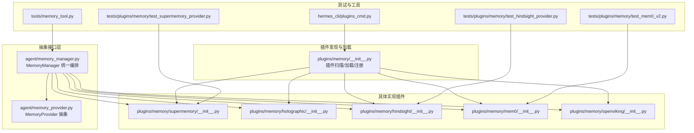
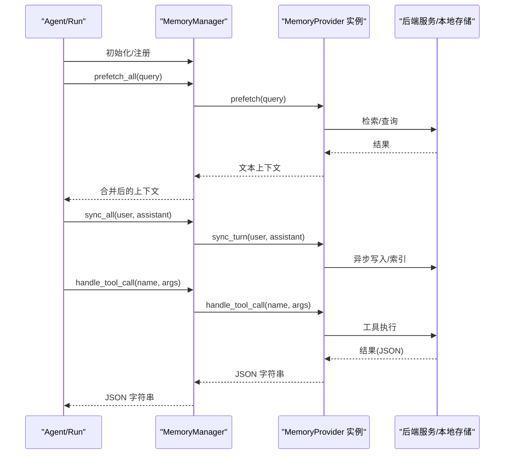
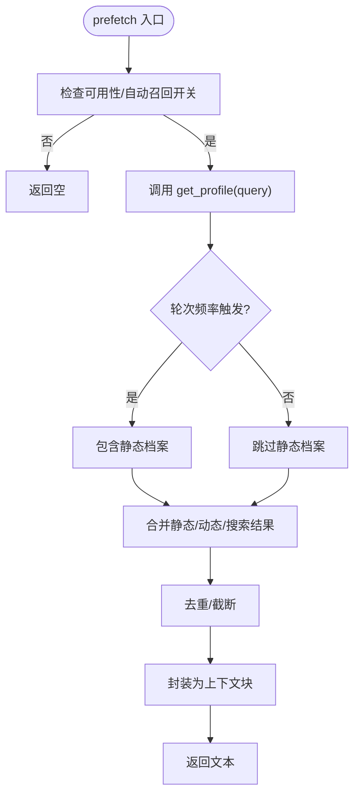
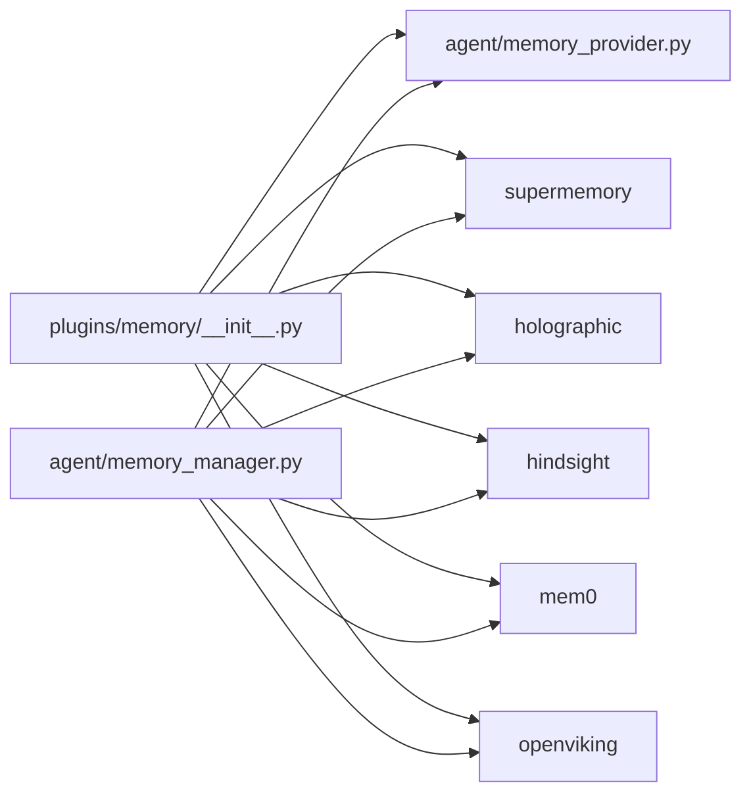

# 内存插件开发

<cite>
**本文档引用的文件**
- [memory_manager.py](file://agent/memory_manager.py)
- [memory_provider.py](file://agent/memory_provider.py)
- [__init__.py（内存插件总览）](file://plugins/memory/__init__.py)
- [supermemory/__init__.py](file://plugins/memory/supermemory/__init__.py)
- [holographic/__init__.py](file://plugins/memory/holographic/__init__.py)
- [hindsight/__init__.py](file://plugins/memory/hindsight/__init__.py)
- [mem0/__init__.py](file://plugins/memory/mem0/__init__.py)
- [openviking/__init__.py](file://plugins/memory/openviking/__init__.py)
- [test_supermemory_provider.py](file://tests/plugins/memory/test_supermemory_provider.py)
- [test_mem0_v2.py](file://tests/plugins/memory/test_mem0_v2.py)
- [test_hindsight_provider.py](file://tests/plugins/memory/test_hindsight_provider.py)
- [memory_tool.py](file://tools/memory_tool.py)
- [plugins_cmd.py](file://hermes_cli/plugins_cmd.py)
- [run.py（网关运行时）](file://gateway/run.py)
- [memoryMonitor.ts](file://ui-tui/src/lib/memoryMonitor.ts)
- [lru.ts](file://ui-tui/packages/hermes-ink/src/ink/lru.ts)
</cite>

## 目录
1. [简介](#简介)
2. [项目结构](#项目结构)
3. [核心组件](#核心组件)
4. [架构概览](#架构概览)
5. [详细组件分析](#详细组件分析)
6. [依赖分析](#依赖分析)
7. [性能考虑](#性能考虑)
8. [故障排除指南](#故障排除指南)
9. [结论](#结论)
10. [附录](#附录)

## 简介
本指南面向开发者，系统性阐述如何在本项目中开发“内存插件”。内容覆盖：
- 存储接口规范：数据模型、工具调用协议、检索算法
- 核心功能：记忆存储、上下文检索、长期记忆管理
- 索引机制：向量检索、关键词匹配、语义搜索
- 缓存策略：LRU缓存、预加载、失效处理
- 性能优化：批量操作、异步处理、资源管理
- 配置项：存储路径、索引大小、检索参数
- 测试与基准：单元测试、兼容性验证
- 故障排除与监控：错误处理、可观测性

## 项目结构
内存插件体系由“插件发现与加载”“抽象接口层”“具体实现插件”三部分组成，并通过“内存管理器”统一编排。

图示来源
- [__init__.py（内存插件总览）:1-451](file://plugins/memory/__init__.py#L1-L451)
- [memory_provider.py:1-297](file://agent/memory_provider.py#L1-L297)
- [memory_manager.py:1-949](file://agent/memory_manager.py#L1-L949)
- [supermemory/__init__.py:1-898](file://plugins/memory/supermemory/__init__.py#L1-L898)
- [holographic/__init__.py:1-409](file://plugins/memory/holographic/__init__.py#L1-L409)
- [hindsight/__init__.py:1-1868](file://plugins/memory/hindsight/__init__.py#L1-L1868)
- [mem0/__init__.py:1-375](file://plugins/memory/mem0/__init__.py#L1-L375)
- [openviking/__init__.py:1-1352](file://plugins/memory/openviking/__init__.py#L1-L1352)
- [test_supermemory_provider.py:1-460](file://tests/plugins/memory/test_supermemory_provider.py#L1-L460)
- [test_mem0_v2.py:1-242](file://tests/plugins/memory/test_mem0_v2.py#L1-L242)
- [test_hindsight_provider.py:1-1698](file://tests/plugins/memory/test_hindsight_provider.py#L1-L1698)
- [memory_tool.py:240-272](file://tools/memory_tool.py#L240-L272)
- [plugins_cmd.py:1063-1103](file://hermes_cli/plugins_cmd.py#L1063-L1103)

章节来源
- [__init__.py（内存插件总览）:1-451](file://plugins/memory/__init__.py#L1-L451)
- [memory_provider.py:1-297](file://agent/memory_provider.py#L1-L297)
- [memory_manager.py:1-949](file://agent/memory_manager.py#L1-L949)

## 核心组件
- MemoryProvider 抽象接口：定义生命周期钩子、工具模式、同步/预取等标准能力。
- MemoryManager 统一编排：注册外部插件、路由工具调用、后台异步写入、会话切换与压缩前处理。
- 插件发现与加载：扫描内置与用户安装插件目录，优先级与命名冲突处理。
- 具体插件实现：Supermemory、Holographic、Hindsight、Mem0、OpenViking，分别提供不同检索与存储策略。

章节来源
- [memory_provider.py:42-297](file://agent/memory_provider.py#L42-L297)
- [memory_manager.py:313-794](file://agent/memory_manager.py#L313-L794)
- [__init__.py（内存插件总览）:146-206](file://plugins/memory/__init__.py#L146-L206)

## 架构概览
内存插件的调用链路如下：

图示来源
- [memory_manager.py:452-701](file://agent/memory_manager.py#L452-L701)
- [memory_provider.py:133-149](file://agent/memory_provider.py#L133-L149)

## 详细组件分析

### MemoryProvider 接口规范
- 必须实现：is_available、initialize、prefetch、sync_turn、get_tool_schemas、handle_tool_call
- 可选钩子：on_turn_start、on_session_end、on_session_switch、on_pre_compress、on_memory_write、on_delegation
- 工具调用返回：必须为 JSON 字符串；失败返回工具错误格式
- 配置能力：get_config_schema/save_config 支持“原生配置文件”或仅环境变量

章节来源
- [memory_provider.py:42-297](file://agent/memory_provider.py#L42-L297)

### MemoryManager 统一编排
- 注册限制：仅允许一个外部插件，避免工具名冲突与后端冲突
- 工具注入：将外部插件工具模式注入到代理工具集中
- 预取/同步：对每个插件执行预取与异步同步，失败不阻塞其他插件
- 生命周期：turn 开始、会话结束、会话切换、压缩前处理
- 背景线程：单工作线程串行化写入，避免竞态

章节来源
- [memory_manager.py:313-794](file://agent/memory_manager.py#L313-L794)

### 插件发现与加载（plugins/memory）
- 扫描顺序：内置 plugins/memory/<name>/ 优先于 $HERMES_HOME/plugins/<name>/
- 加载策略：支持 register(ctx) 或直接实例化类
- CLI 命令：仅对当前激活的插件暴露命令
- 可用性检测：快速检查 is_available，避免导入失败

章节来源
- [__init__.py（内存插件总览）:146-206](file://plugins/memory/__init__.py#L146-L206)
- [__init__.py（内存插件总览）:354-451](file://plugins/memory/__init__.py#L354-L451)

### Supermemory 插件
- 功能要点
  - 语义检索：支持 hybrid/memories/documents 模式
  - 多容器标签：支持主容器与自定义容器
  - 自动捕获：会话结束批量写入对话
  - 显式存储：工具调用存储明确事实
  - 配置持久化：$HERMES_HOME/supermemory.json
- 数据模型
  - 记忆条目：包含 id、memory、similarity、updated_at、metadata
  - 容器标签：container_tags
  - 元数据：合并 sm_source、类型、来源迁移
- 检索流程
  - prefetch：按频率与轮次决定是否包含 profile 静态/动态与搜索结果
  - 搜索：search_memories(q, container_tag, limit, search_mode)
  - 个人资料：get_profile(q?, container_tag)
- 写入流程
  - on_memory_write：显式存储
  - on_session_end/on_session_switch：批量写入对话
  - sync_turn：缓冲每轮对话，延迟写入

图示来源
- [supermemory/__init__.py:567-583](file://plugins/memory/supermemory/__init__.py#L567-L583)
- [supermemory/__init__.py:209-252](file://plugins/memory/supermemory/__init__.py#L209-L252)

章节来源
- [supermemory/__init__.py:1-898](file://plugins/memory/supermemory/__init__.py#L1-L898)
- [test_supermemory_provider.py:114-137](file://tests/plugins/memory/test_supermemory_provider.py#L114-L137)

### Holographic 插件
- 功能要点
  - 结构化事实存储：实体解析、信任评分、时间衰减
  - HRR 向量检索：组合查询、相关度推理
  - 工具集：fact_store（add/search/probe/reason/related/contradict/update/remove/list）、fact_feedback
  - 配置：SQLite 路径、自动提取、默认信任、HRR 维度、时间衰减
- 数据模型
  - 事实表：包含实体、类别、标签、信任分、向量等
  - 查询：支持多实体同时连接的组合查询
- 检索流程
  - 通过 FactRetriever 进行关键词/语义/组合检索
  - 可设置最小信任阈值过滤

章节来源
- [holographic/__init__.py:1-409](file://plugins/memory/holographic/__init__.py#L1-L409)

### Hindsight 插件
- 功能要点
  - 知识图谱与实体解析
  - 多策略检索：关键词、向量、混合
  - 保留/反射：自动保留与合成回答
  - 云/本地模式：支持云端 API 与嵌入式守护进程
  - 配置：银行 ID、预算、超时、闲置关闭、保留标签与观察范围
- 数据模型
  - 记忆条目：带标签、实体、元数据
  - 会话文档：按会话 ID 管理
- 检索流程
  - recall：异步检索，支持预算控制
  - reflect：合成回答
  - retain：自动/手动保留

章节来源
- [hindsight/__init__.py:1-1868](file://plugins/memory/hindsight/__init__.py#L1-L1868)
- [test_hindsight_provider.py:1-200](file://tests/plugins/memory/test_hindsight_provider.py#L1-L200)

### Mem0 插件
- 功能要点
  - 平台 API：LLM 提取、重排序、去重
  - 工具集：mem0_profile、mem0_search（rerank/top_k）、mem0_conclude
  - 过滤迁移：从 user_id 直接传参迁移到 filters={}
  - 响应解包：v2 返回 {"results": [...]} 的兼容处理
  - 断路器：连续失败后冷却，避免雪崩
- 数据模型
  - 记忆条目：memory、score
  - 过滤器：filters（user_id、agent_id）
- 检索流程
  - queue_prefetch + prefetch：后台线程检索
  - handle_tool_call：profile/search/conclude
  - sync_turn：写入时附加 agent_id

章节来源
- [mem0/__init__.py:1-375](file://plugins/memory/mem0/__init__.py#L1-L375)
- [test_mem0_v2.py:1-242](file://tests/plugins/memory/test_mem0_v2.py#L1-L242)

### OpenViking 插件
- 功能要点
  - 文件系统风格知识库：viking:// URI 层级浏览
  - 会话管理：自动提取、层级上下文（L0/L1/L2）
  - 资源摄取：URL/文档/代码
  - 写入镜像：on_memory_write 映射到 preferences/patterns
- 数据模型
  - 记忆分类：preferences/entities/events/cases/patterns
  - 会话消息：按角色与内容组织
- 写入流程
  - viking:// URI 写入
  - on_memory_write：根据 target 写入不同子目录

章节来源
- [openviking/__init__.py:1-1352](file://plugins/memory/openviking/__init__.py#L1-L1352)

## 依赖分析
- 插件发现依赖：plugins.memory.__init__ 作为入口，扫描目录并加载模块
- 接口依赖：各插件实现 MemoryProvider 抽象，遵循统一生命周期与工具协议
- 管理依赖：MemoryManager 对插件进行注册、路由、后台调度与生命周期通知
- 第三方依赖：各插件引入对应 SDK（如 supermemory、mem0、hindsight、httpx）

图示来源
- [__init__.py（内存插件总览）:1-451](file://plugins/memory/__init__.py#L1-L451)
- [memory_provider.py:1-297](file://agent/memory_provider.py#L1-L297)
- [memory_manager.py:1-949](file://agent/memory_manager.py#L1-L949)

章节来源
- [__init__.py（内存插件总览）:1-451](file://plugins/memory/__init__.py#L1-L451)
- [memory_provider.py:1-297](file://agent/memory_provider.py#L1-L297)
- [memory_manager.py:1-949](file://agent/memory_manager.py#L1-L949)

## 性能考虑
- 异步与后台线程
  - MemoryManager 使用单工作线程串行化写入，避免并发写入竞争
  - 各插件内部使用线程池/事件循环处理网络请求与检索
- 批量与延迟写入
  - Supermemory/Hindsight/OpenViking 在会话边界批量写入，减少频繁调用
- 预取与缓存
  - Supermemory 支持自动召回与周期性刷新档案
  - Hindsight 支持预算控制与断路器
- 资源管理
  - OpenViking 使用 atexit 安全提交未完成会话
  - 网关侧 LRU 缓存清理，避免内存峰值

章节来源
- [memory_manager.py:575-642](file://agent/memory_manager.py#L575-L642)
- [supermemory/__init__.py:584-628](file://plugins/memory/supermemory/__init__.py#L584-L628)
- [hindsight/__init__.py:197-200](file://plugins/memory/hindsight/__init__.py#L197-L200)
- [openviking/__init__.py:95-108](file://plugins/memory/openviking/__init__.py#L95-L108)
- [run.py（网关运行时）:13321-13346](file://gateway/run.py#L13321-L13346)

## 故障排除指南
- 插件不可用
  - 检查 is_available 与依赖安装（如 supermemory、mem0、httpx）
  - 环境变量与配置文件是否正确
- 工具调用失败
  - 返回 JSON 字符串；若异常，查看日志并确认参数完整性
- 写入阻塞或丢失
  - 确认 MemoryManager 的后台线程是否正常运行
  - 插件是否正确实现 sync_turn/queue_prefetch
- 会话数据丢失
  - OpenViking 使用 atexit 回退提交；确保 on_session_end 正常触发
- 性能问题
  - 启用批量写入与预算控制；检查断路器状态
  - 监控内存峰值，必要时触发 LRU 清理

章节来源
- [memory_manager.py:575-642](file://agent/memory_manager.py#L575-L642)
- [openviking/__init__.py:95-108](file://plugins/memory/openviking/__init__.py#L95-L108)
- [hindsight/__init__.py:181-189](file://plugins/memory/hindsight/__init__.py#L181-L189)

## 结论
本指南提供了内存插件的完整开发框架：以 MemoryProvider 为统一接口，借助 MemoryManager 实现跨插件的一致行为；通过多种实现满足不同检索与存储需求。建议在新插件开发中严格遵循接口契约、工具模式与生命周期钩子，充分利用后台异步与批量写入机制，并结合测试与监控保障稳定性与性能。

## 附录

### 存储接口规范与数据模型
- 工具模式
  - get_tool_schemas：返回 OpenAI 函数调用格式
  - handle_tool_call：返回 JSON 字符串
- 生命周期
  - initialize/session_prompt_block/prefetch/sync_turn/get_tool_schemas/handle_tool_call/shutdown
  - 可选：on_turn_start/on_session_end/on_session_switch/on_pre_compress/on_memory_write/on_delegation
- 数据模型（示例）
  - Supermemory：memory、similarity、updated_at、metadata、container_tags
  - Mem0：memory、score、filters
  - Holographic：实体、类别、标签、信任分、向量
  - OpenViking：viking:// URI、分类、会话消息

章节来源
- [memory_provider.py:133-149](file://agent/memory_provider.py#L133-L149)
- [supermemory/__init__.py:306-350](file://plugins/memory/supermemory/__init__.py#L306-L350)
- [mem0/__init__.py:82-112](file://plugins/memory/mem0/__init__.py#L82-L112)
- [holographic/__init__.py:38-90](file://plugins/memory/holographic/__init__.py#L38-L90)
- [openviking/__init__.py:54-71](file://plugins/memory/openviking/__init__.py#L54-L71)

### 索引机制与检索算法
- 语义检索
  - Supermemory：hybrid/memories/documents 模式
  - Hindsight：向量/关键词/混合
  - Mem0：可启用 rerank 提升精度
- 关键词匹配
  - Holographic：fact_store.search
  - Hindsight：recall 支持关键词
- 检索参数
  - top_k/limit、search_mode、filters、container_tag、最大结果数

章节来源
- [supermemory/__init__.py:306-324](file://plugins/memory/supermemory/__init__.py#L306-L324)
- [hindsight/__init__.py:1-1868](file://plugins/memory/hindsight/__init__.py#L1-L1868)
- [mem0/__init__.py:82-112](file://plugins/memory/mem0/__init__.py#L82-L112)

### 缓存策略
- LRU 缓存
  - UI 层：lruEvict 用于热路径缓存淘汰
  - 网关：LRU 缓存清理，避免过载
- 预加载
  - Supermemory：按轮次频率预取档案与搜索结果
  - Hindsight：异步预取与预算控制
- 失效处理
  - 会话切换：清理旧会话缓存
  - 断路器：连续失败后冷却

章节来源
- [lru.ts:1-14](file://ui-tui/packages/hermes-ink/src/ink/lru.ts#L1-L14)
- [memoryMonitor.ts:63-102](file://ui-tui/src/lib/memoryMonitor.ts#L63-L102)
- [run.py（网关运行时）:13321-13346](file://gateway/run.py#L13321-L13346)
- [supermemory/__init__.py:567-583](file://plugins/memory/supermemory/__init__.py#L567-L583)
- [hindsight/__init__.py:181-189](file://plugins/memory/hindsight/__init__.py#L181-L189)

### 性能优化方法
- 批量操作
  - 会话结束批量写入（Supermemory/Hindsight/OpenViking）
- 异步处理
  - MemoryManager 单线程串行化写入；插件内部异步请求
- 资源管理
  - atexit 回退提交、断路器、预算控制、闲置关闭

章节来源
- [memory_manager.py:575-642](file://agent/memory_manager.py#L575-L642)
- [supermemory/__init__.py:596-628](file://plugins/memory/supermemory/__init__.py#L596-L628)
- [hindsight/__init__.py:181-189](file://plugins/memory/hindsight/__init__.py#L181-L189)
- [openviking/__init__.py:95-108](file://plugins/memory/openviking/__init__.py#L95-L108)

### 配置选项
- 通用
  - memory.provider：选择外部插件
  - context.engine：上下文引擎
- Supermemory
  - SUPERMEMORY_API_KEY、SUPERMEMORY_CONTAINER_TAG
  - $HERMES_HOME/supermemory.json：container_tag/auto_recall/auto_capture/max_recall_results/profile_frequency/capture_mode/search_mode/entity_context/api_timeout/custom_containers/custom_container_instructions
- Mem0
  - MEM0_API_KEY、MEM0_USER_ID、MEM0_AGENT_ID
  - $HERMES_HOME/mem0.json：rerank、keyword_search
- Hindsight
  - HINDSIGHT_API_KEY、HINDSIGHT_BANK_ID、HINDSIGHT_BUDGET、HINDSIGHT_API_URL、HINDSIGHT_MODE、HINDSIGHT_TIMEOUT、HINDSIGHT_IDLE_TIMEOUT、HINDSIGHT_RETAIN_TAGS、HINDSIGHT_RETAIN_OBSERVATION_SCOPES、HINDSIGHT_RETAIN_SOURCE、HINDSIGHT_RETAIN_USER_PREFIX、HINDSIGHT_RETAIN_ASSISTANT_PREFIX
  - $HERMES_HOME/hindsight/config.json
- OpenViking
  - OPENVIKING_ENDPOINT、OPENVIKING_API_KEY、OPENVIKING_ACCOUNT、OPENVIKING_USER、OPENVIKING_AGENT

章节来源
- [plugins_cmd.py:1063-1103](file://hermes_cli/plugins_cmd.py#L1063-L1103)
- [supermemory/__init__.py:56-141](file://plugins/memory/supermemory/__init__.py#L56-L141)
- [mem0/__init__.py:40-66](file://plugins/memory/mem0/__init__.py#L40-L66)
- [hindsight/__init__.py:12-28](file://plugins/memory/hindsight/__init__.py#L12-L28)
- [openviking/__init__.py:10-23](file://plugins/memory/openviking/__init__.py#L10-L23)

### 测试方法与基准
- 单元测试
  - Supermemory：配置读写、预取上下文去重、会话写入、元数据标注
  - Mem0：过滤器迁移（filters）、响应解包、预取与写入过滤
  - Hindsight：保留标签归一化、观察范围、Schema 完整性
- 基准测试
  - 可基于插件提供的检索/写入接口编写压力测试脚本，关注吞吐与延迟

章节来源
- [test_supermemory_provider.py:1-460](file://tests/plugins/memory/test_supermemory_provider.py#L1-L460)
- [test_mem0_v2.py:1-242](file://tests/plugins/memory/test_mem0_v2.py#L1-L242)
- [test_hindsight_provider.py:1-1698](file://tests/plugins/memory/test_hindsight_provider.py#L1-L1698)