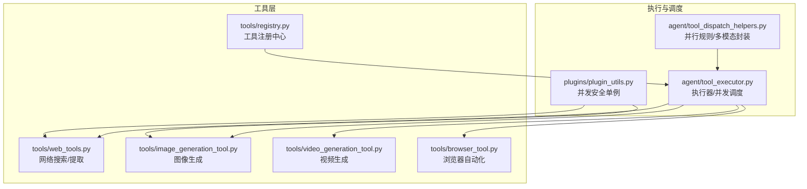
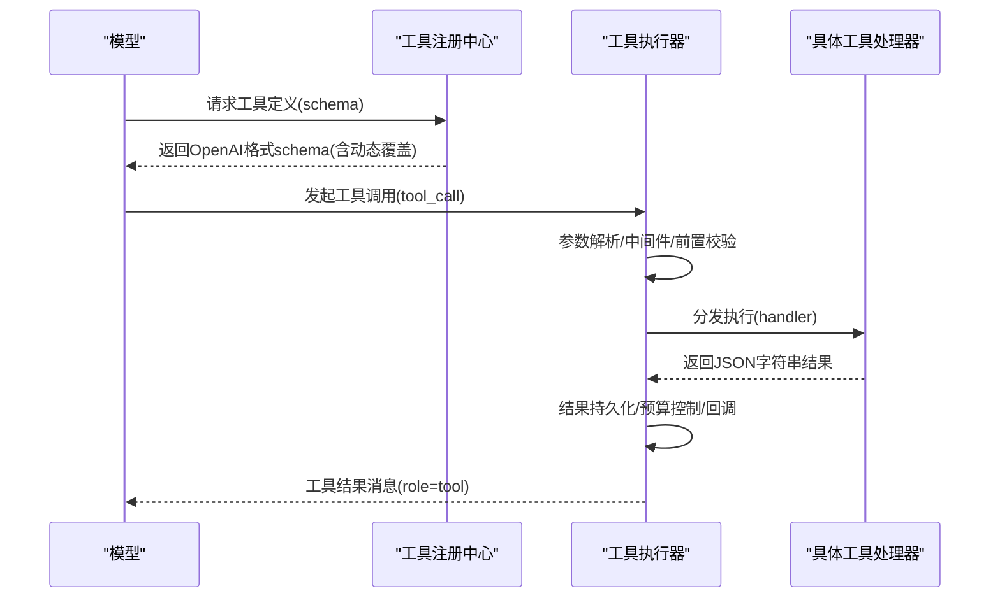
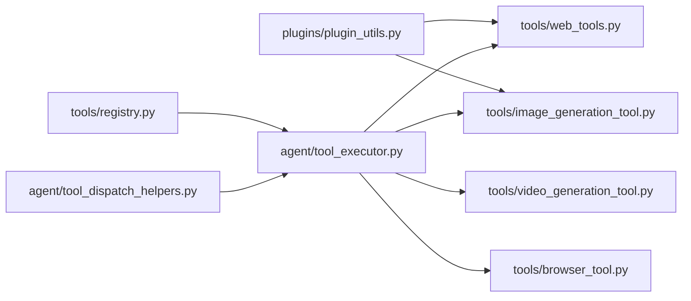

# 工具插件开发

<cite>
**本文档引用的文件**
- [agent/tool_executor.py](file://agent/tool_executor.py)
- [agent/tool_dispatch_helpers.py](file://agent/tool_dispatch_helpers.py)
- [tools/registry.py](file://tools/registry.py)
- [tools/__init__.py](file://tools/__init__.py)
- [plugins/plugin_utils.py](file://plugins/plugin_utils.py)
- [tools/web_tools.py](file://tools/web_tools.py)
- [tools/image_generation_tool.py](file://tools/image_generation_tool.py)
- [tools/video_generation_tool.py](file://tools/video_generation_tool.py)
- [tools/browser_tool.py](file://tools/browser_tool.py)
</cite>

## 目录
1. [简介](#简介)
2. [项目结构](#项目结构)
3. [核心组件](#核心组件)
4. [架构总览](#架构总览)
5. [详细组件分析](#详细组件分析)
6. [依赖分析](#依赖分析)
7. [性能考虑](#性能考虑)
8. [故障排查指南](#故障排查指南)
9. [结论](#结论)
10. [附录](#附录)

## 简介
本指南面向希望在本系统中开发“工具插件”的开发者，系统性阐述工具插件的开发规范、接口要求、参数校验与执行回调机制；总结常见工具类型（网络搜索、图像生成、视频生成、浏览器自动化）的实现模式；说明配置管理（Schema 定义、默认值、动态配置更新）、错误处理与重试策略、测试与调试技巧，以及性能优化与最佳实践。

## 项目结构
围绕工具插件的关键模块与职责如下：
- 工具注册中心：集中管理工具元数据、可用性检查、动态 Schema、分发执行
- 执行器：负责并发/串行执行、中间件、回调、结果持久化与预算控制
- 辅助工具：并发安全单例、并行批调度规则、多模态结果封装
- 典型工具实现：网络搜索、图像生成、视频生成、浏览器自动化等

图表来源
- [tools/registry.py:151-544](file://tools/registry.py#L151-L544)
- [agent/tool_executor.py:243-768](file://agent/tool_executor.py#L243-L768)
- [agent/tool_dispatch_helpers.py:103-146](file://agent/tool_dispatch_helpers.py#L103-L146)
- [plugins/plugin_utils.py:43-136](file://plugins/plugin_utils.py#L43-L136)

章节来源
- [tools/registry.py:151-544](file://tools/registry.py#L151-L544)
- [agent/tool_executor.py:243-768](file://agent/tool_executor.py#L243-L768)
- [agent/tool_dispatch_helpers.py:103-146](file://agent/tool_dispatch_helpers.py#L103-L146)
- [plugins/plugin_utils.py:43-136](file://plugins/plugin_utils.py#L43-L136)

## 核心组件
- 工具注册中心（ToolRegistry）
  - 职责：注册/注销工具、查询可用工具集、动态 Schema、分发执行、最大结果长度限制
  - 关键点：支持动态 Schema 覆盖、check_fn 缓存、线程安全快照读取
- 工具执行器（并发/串行）
  - 职责：解析参数、预检/拦截、中间件、并发执行、回调通知、结果持久化、预算控制
  - 关键点：最大并发工作线程数、中断传播、后置回调钩子
- 并行调度与多模态辅助
  - 职责：批量并行安全判定、路径隔离、多模态结果封装与文本摘要
- 插件并发安全工具
  - 职责：提供线程安全的懒加载单例与带参缓存槽，避免竞态初始化

章节来源
- [tools/registry.py:151-544](file://tools/registry.py#L151-L544)
- [agent/tool_executor.py:243-768](file://agent/tool_executor.py#L243-L768)
- [agent/tool_dispatch_helpers.py:103-146](file://agent/tool_dispatch_helpers.py#L103-L146)
- [plugins/plugin_utils.py:43-136](file://plugins/plugin_utils.py#L43-L136)

## 架构总览
工具从“注册中心”暴露给模型，模型调用后由“执行器”进行参数解析、前置校验、中间件处理、并发调度与执行，并通过“回调/中间件”完成可观测性与治理，最终将结果以统一消息格式返回会话。

图表来源
- [tools/registry.py:337-417](file://tools/registry.py#L337-L417)
- [agent/tool_executor.py:243-768](file://agent/tool_executor.py#L243-L768)

## 详细组件分析

### 工具注册中心（ToolRegistry）
- 注册/注销
  - 支持覆盖开关、工具集别名、动态 Schema 覆盖、最大结果长度
- 可用性检查
  - check_fn 缓存（约30秒），避免频繁探测外部环境
- 动态 Schema
  - 在 get_definitions 时应用动态覆盖，使描述随当前配置变化
- 分发执行
  - 统一捕获异常并标准化错误输出，屏蔽异常字符串中的结构噪声

章节来源
- [tools/registry.py:234-306](file://tools/registry.py#L234-L306)
- [tools/registry.py:337-384](file://tools/registry.py#L337-L384)
- [tools/registry.py:390-417](file://tools/registry.py#L390-L417)
- [tools/registry.py:422-431](file://tools/registry.py#L422-L431)

### 工具执行器（并发/串行）
- 并发执行
  - 最大并发工作线程数固定上限；为每个任务建立线程并传播中断信号
  - 周期性等待与心跳，避免长时间并发批次被网关误判为空闲
  - 每个工具完成后触发后置回调，记录状态、持久化结果、注入目录提示
- 回调与中间件
  - 请求前中间件：可修改参数并记录 trace
  - 执行中间件：可插入自定义执行逻辑
  - 后置回调：统一上报执行耗时、状态、错误类型
- 预算与持久化
  - 按回合对工具结果进行大小限制与持久化
- 错误处理
  - 统一包装错误为 JSON 字符串；区分用户中断、线程缺失、工具异常等

章节来源
- [agent/tool_executor.py:243-768](file://agent/tool_executor.py#L243-L768)
- [agent/tool_executor.py:184-241](file://agent/tool_executor.py#L184-L241)
- [agent/tool_executor.py:618-767](file://agent/tool_executor.py#L618-L767)

### 并行调度与多模态辅助
- 并行安全判定
  - 不可并行工具集合、只读工具集合、路径作用域工具（独立路径才可并行）
  - 基于路径重叠检测避免并发写冲突
- 多模态结果
  - 统一封装为内容列表或文本摘要，保证不同适配器兼容
  - 提供文本摘要提取、向多模态结果追加子目录提示

章节来源
- [agent/tool_dispatch_helpers.py:103-146](file://agent/tool_dispatch_helpers.py#L103-L146)
- [agent/tool_dispatch_helpers.py:177-235](file://agent/tool_dispatch_helpers.py#L177-L235)
- [agent/tool_dispatch_helpers.py:237-294](file://agent/tool_dispatch_helpers.py#L237-L294)

### 插件并发安全工具
- 懒加载单例装饰器与带参缓存槽
  - 双重检查锁定，避免竞态初始化导致资源泄漏
  - 适用于跨线程共享昂贵客户端实例

章节来源
- [plugins/plugin_utils.py:43-136](file://plugins/plugin_utils.py#L43-L136)

### 网络搜索工具（web_tools）
- 后端选择与可用性探测
  - 支持多个后端（Exa、Parallel、Firecrawl、Tavily、SearXNG、Brave-Free、DDGS、XAI）
  - 自动探测优先级，兼顾手动配置与托管网关
- 内容处理
  - 使用辅助 LLM 对长内容进行智能摘要，支持分块并行与合成
  - 输出压缩率统计与失败回退（截断原始内容）
- 调试与日志
  - 支持调试开关与会话日志输出

章节来源
- [tools/web_tools.py:144-243](file://tools/web_tools.py#L144-L243)
- [tools/web_tools.py:342-557](file://tools/web_tools.py#L342-L557)
- [tools/web_tools.py:560-714](file://tools/web_tools.py#L560-L714)

### 图像生成工具（image_generation_tool）
- 模型目录与参数映射
  - 统一输入到各模型原生参数的转换，按模型 supports 白名单过滤
- 代理与网关
  - 支持直接 FAL 或通过 Nous 门户网关；网关 4xx 显示清晰错误与修复建议
- 结果后处理
  - 本地路径到代理可见路径映射、强制同步生成物、失败回退
- 并发安全
  - 使用插件并发安全工具缓存客户端实例

章节来源
- [tools/image_generation_tool.py:97-370](file://tools/image_generation_tool.py#L97-L370)
- [tools/image_generation_tool.py:401-474](file://tools/image_generation_tool.py#L401-L474)
- [tools/image_generation_tool.py:692-722](file://tools/image_generation_tool.py#L692-L722)

### 视频生成工具（video_generation_tool）
- 后端插件化
  - 通过视频生成提供者抽象与注册表实现后端无关的统一工具面
- 动态 Schema
  - 根据当前后端能力与模型特性动态生成描述，减少无效尝试
- 参数规范化
  - 类型/必填校验、布尔/整数归一化、参考图列表清洗

章节来源
- [tools/video_generation_tool.py:49-56](file://tools/video_generation_tool.py#L49-L56)
- [tools/video_generation_tool.py:61-160](file://tools/video_generation_tool.py#L61-L160)
- [tools/video_generation_tool.py:310-394](file://tools/video_generation_tool.py#L310-L394)
- [tools/video_generation_tool.py:414-544](file://tools/video_generation_tool.py#L414-L544)

### 浏览器自动化工具（browser_tool）
- 后端选择
  - 支持本地 Headless Chromium、Camofox、Browserbase、Browser Use 等
  - 自动探测优先级与显式配置优先
- 引擎与回退
  - 支持 Lightpanda 引擎加速，必要时自动回退到 Chrome
- 命令超时与对话框策略
  - 可配置命令超时、对话框策略与超时时间
- CDP 连接与监督
  - 支持直接 CDP 连接与云端会话 CDP URL 解析，启动 CDP 监督器

章节来源
- [tools/browser_tool.py:489-591](file://tools/browser_tool.py#L489-L591)
- [tools/browser_tool.py:638-702](file://tools/browser_tool.py#L638-L702)
- [tools/browser_tool.py:200-222](file://tools/browser_tool.py#L200-L222)
- [tools/browser_tool.py:312-345](file://tools/browser_tool.py#L312-L345)

## 依赖分析
- 工具注册中心与执行器
  - 执行器依赖注册中心进行工具分发与可用性检查
  - 注册中心依赖工具自身模块完成自注册
- 并行与多模态
  - 执行器依赖调度助手判断是否可并行、如何封装多模态结果
- 插件并发安全
  - 图像/网络工具使用并发安全单例缓存昂贵客户端

图表来源
- [tools/registry.py:337-417](file://tools/registry.py#L337-L417)
- [agent/tool_executor.py:243-768](file://agent/tool_executor.py#L243-L768)
- [agent/tool_dispatch_helpers.py:103-146](file://agent/tool_dispatch_helpers.py#L103-L146)
- [plugins/plugin_utils.py:43-136](file://plugins/plugin_utils.py#L43-L136)

章节来源
- [tools/registry.py:337-417](file://tools/registry.py#L337-L417)
- [agent/tool_executor.py:243-768](file://agent/tool_executor.py#L243-L768)
- [agent/tool_dispatch_helpers.py:103-146](file://agent/tool_dispatch_helpers.py#L103-L146)
- [plugins/plugin_utils.py:43-136](file://plugins/plugin_utils.py#L43-L136)

## 性能考虑
- 并发执行
  - 控制最大并发工作线程数量，避免过度竞争 IO
  - 批量工具执行时基于路径隔离与只读工具集进行并行判定
- 结果处理
  - 对长内容进行智能摘要与分块并行处理，降低上下文开销
  - 多模态结果统一为文本摘要或内容列表，减少下游适配成本
- 客户端复用
  - 使用并发安全单例缓存昂贵客户端，避免重复初始化
- 超时与心跳
  - 并发执行周期性等待与心跳，防止被网关误判空闲

章节来源
- [agent/tool_executor.py:553-624](file://agent/tool_executor.py#L553-L624)
- [agent/tool_dispatch_helpers.py:103-146](file://agent/tool_dispatch_helpers.py#L103-L146)
- [tools/web_tools.py:560-714](file://tools/web_tools.py#L560-L714)
- [plugins/plugin_utils.py:43-136](file://plugins/plugin_utils.py#L43-L136)

## 故障排查指南
- 工具不可用
  - 检查注册中心的 check_fn 缓存是否过期，必要时刷新
  - 确认后端凭据、托管网关可用性与订阅状态
- 并发问题
  - 确认工具是否属于不可并行集合；检查路径作用域是否重叠
  - 使用并发安全单例避免竞态初始化
- 结果异常
  - 查看后置回调上报的状态与错误类型
  - 对多模态结果进行文本摘要，定位错误片段
- 超时与中断
  - 调整工具命令超时与并发批次的心跳间隔
  - 确保中断信号正确传播至工作线程

章节来源
- [tools/registry.py:126-148](file://tools/registry.py#L126-L148)
- [agent/tool_executor.py:577-624](file://agent/tool_executor.py#L577-L624)
- [agent/tool_executor.py:618-714](file://agent/tool_executor.py#L618-L714)
- [agent/tool_dispatch_helpers.py:166-174](file://agent/tool_dispatch_helpers.py#L166-L174)

## 结论
本指南提供了从接口规范、执行流程、配置管理到错误处理与性能优化的完整开发蓝图。遵循注册中心-执行器-辅助工具的分层设计，结合动态 Schema、并发安全与可观测性回调，可快速构建稳定、可扩展且易维护的工具插件。

## 附录

### 开发规范与接口要求
- 工具定义格式
  - 使用注册中心的 register 接口声明：名称、工具集、Schema、处理器、check_fn、环境变量需求、异步标记、表情符号、最大结果长度、动态 Schema 覆盖
- 参数验证规则
  - 在工具处理器内部进行轻量参数校验（类型、必填字段），并将错误以 JSON 字符串返回
  - 对外部输入进行归一化（如布尔/整数、列表清洗）
- 执行回调机制
  - 请求前中间件：可修改参数并记录 trace
  - 执行中间件：可插入自定义执行逻辑
  - 后置回调：统一上报执行耗时、状态、错误类型

章节来源
- [tools/registry.py:234-306](file://tools/registry.py#L234-L306)
- [agent/tool_executor.py:184-241](file://agent/tool_executor.py#L184-L241)
- [agent/tool_executor.py:618-714](file://agent/tool_executor.py#L618-L714)

### 常用工具类型实现模式
- 网络搜索工具
  - 后端选择与可用性探测、内容智能摘要、分块并行与合成、调试日志
- 图像生成工具
  - 模型目录与参数映射、代理/网关、结果路径映射与同步、失败回退
- 视频生成工具
  - 后端插件化、动态 Schema、参数规范化
- 浏览器自动化工具
  - 多后端选择、引擎切换与回退、命令超时与对话框策略、CDP 连接与监督

章节来源
- [tools/web_tools.py:144-243](file://tools/web_tools.py#L144-L243)
- [tools/web_tools.py:342-557](file://tools/web_tools.py#L342-L557)
- [tools/image_generation_tool.py:401-474](file://tools/image_generation_tool.py#L401-L474)
- [tools/video_generation_tool.py:61-160](file://tools/video_generation_tool.py#L61-L160)
- [tools/browser_tool.py:489-591](file://tools/browser_tool.py#L489-L591)

### 配置管理
- 参数 Schema 定义
  - 在工具模块内定义 OpenAI 格式的参数 Schema，必要时使用动态覆盖
- 默认值设置
  - 在注册时设置默认值与最大结果长度；在处理器内部进行类型/范围校验
- 动态配置更新
  - 通过注册中心的动态覆盖与配置变更（如切换后端/模型）触发 Schema 重建

章节来源
- [tools/registry.py:337-384](file://tools/registry.py#L337-L384)
- [tools/video_generation_tool.py:414-544](file://tools/video_generation_tool.py#L414-L544)

### 错误处理与重试机制
- 超时处理
  - 并发执行周期性等待与心跳；工具命令超时可配置
- 异常捕获
  - 统一捕获异常并标准化错误输出；对 LLM 摘要失败进行回退
- 状态恢复
  - 中断传播至工作线程；线程清理与中断位清除避免泄漏

章节来源
- [agent/tool_executor.py:577-624](file://agent/tool_executor.py#L577-L624)
- [tools/web_tools.py:421-439](file://tools/web_tools.py#L421-L439)

### 测试方法与调试技巧
- 单元测试
  - 使用懒加载单例的 reset 属性清理状态；对并发场景进行压力测试
- 集成测试
  - 通过插件发现确保第三方后端可用；对动态 Schema 与可用性检查进行回归
- 调试技巧
  - 启用工具调试开关与会话日志；观察后置回调中的状态与错误类型

章节来源
- [plugins/plugin_utils.py:76-81](file://plugins/plugin_utils.py#L76-L81)
- [tools/web_tools.py:339-339](file://tools/web_tools.py#L339-L339)