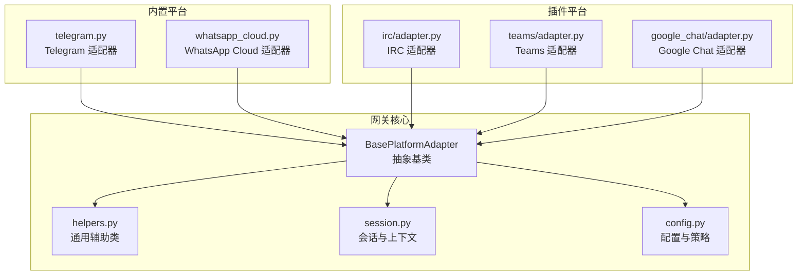
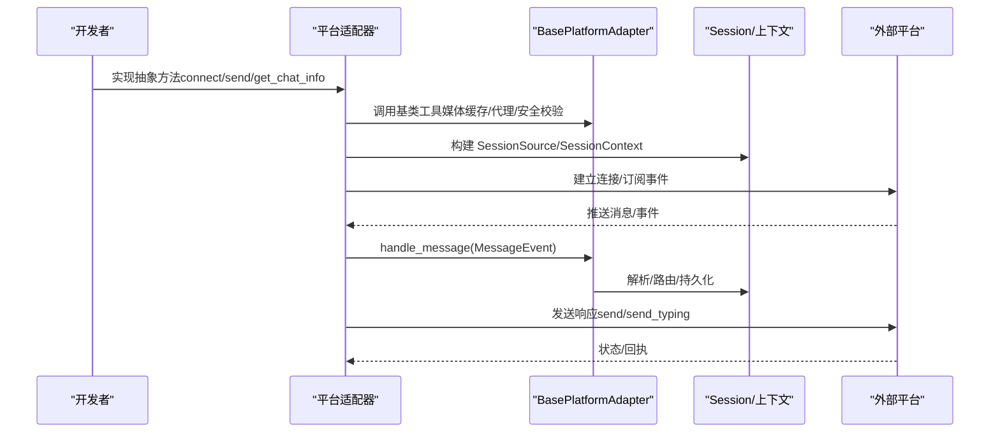
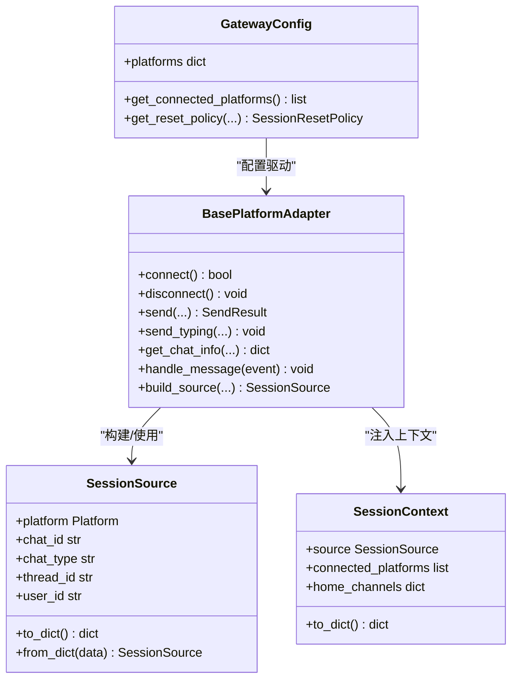
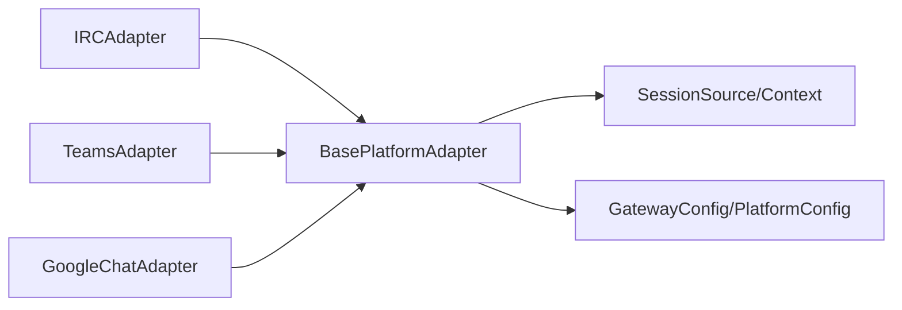

# 平台插件开发

<cite>
**本文引用的文件**
- [gateway/platforms/base.py](file://gateway/platforms/base.py)
- [gateway/platforms/__init__.py](file://gateway/platforms/__init__.py)
- [gateway/platforms/ADDING_A_PLATFORM.md](file://gateway/platforms/ADDING_A_PLATFORM.md)
- [gateway/platforms/helpers.py](file://gateway/platforms/helpers.py)
- [gateway/session.py](file://gateway/session.py)
- [gateway/config.py](file://gateway/config.py)
- [plugins/platforms/irc/adapter.py](file://plugins/platforms/irc/adapter.py)
- [plugins/platforms/irc/plugin.yaml](file://plugins/platforms/irc/plugin.yaml)
- [plugins/platforms/teams/adapter.py](file://plugins/platforms/teams/adapter.py)
- [plugins/platforms/google_chat/adapter.py](file://plugins/platforms/google_chat/adapter.py)
</cite>

## 目录
1. [引言](#引言)
2. [项目结构](#项目结构)
3. [核心组件](#核心组件)
4. [架构总览](#架构总览)
5. [详细组件分析](#详细组件分析)
6. [依赖分析](#依赖分析)
7. [性能考虑](#性能考虑)
8. [故障排查指南](#故障排查指南)
9. [结论](#结论)
10. [附录](#附录)

## 引言
本指南面向希望在 Hermes 网关中开发“平台插件”的开发者，系统讲解如何从零实现一个消息平台适配器，覆盖以下主题：
- 平台连接建立、认证与会话管理
- 核心接口：消息接收、发送、状态查询与事件监听
- 平台特定能力：多媒体处理、用户信息获取、群组管理
- 配置项：连接参数、认证方式、行为开关
- 错误处理策略：连接重试、断线恢复、异常通知
- 测试与模拟环境搭建
- 部署与运维注意事项

## 项目结构
Hermes 的平台适配器分为两类：
- 内置平台（gateway/platforms 下）：如 Telegram、Discord、WhatsApp 等
- 插件平台（plugins/platforms 下）：通过插件机制扩展，如 IRC、Teams、Google Chat 等

核心抽象位于 gateway/platforms/base.py，所有适配器均继承自 BasePlatformAdapter，并遵循统一的生命周期与接口契约。

图示来源
- [gateway/platforms/base.py](file://gateway/platforms/base.py)
- [gateway/platforms/helpers.py](file://gateway/platforms/helpers.py)
- [gateway/session.py](file://gateway/session.py)
- [gateway/config.py](file://gateway/config.py)
- [plugins/platforms/irc/adapter.py](file://plugins/platforms/irc/adapter.py)
- [plugins/platforms/teams/adapter.py](file://plugins/platforms/teams/adapter.py)
- [plugins/platforms/google_chat/adapter.py](file://plugins/platforms/google_chat/adapter.py)

章节来源
- [gateway/platforms/__init__.py](file://gateway/platforms/__init__.py)
- [gateway/platforms/ADDING_A_PLATFORM.md](file://gateway/platforms/ADDING_A_PLATFORM.md)

## 核心组件
- 抽象基类 BasePlatformAdapter：定义适配器必须实现的生命周期与接口，包括 connect/disconnect、send、send_typing、get_chat_info 等；提供媒体缓存、代理、URL 安全校验等工具函数。
- 会话与上下文：SessionSource 描述消息来源（平台、聊天类型、线程等），SessionContext 将来源注入系统提示，支持动态上下文注入与隐私脱敏。
- 配置与策略：GatewayConfig 统一管理平台配置、会话重置策略、流式输出策略、未授权 DM 行为等。
- 通用辅助：helpers.py 提供消息去重、文本聚合、Markdown 去除、线程参与追踪等可复用模式。

章节来源
- [gateway/platforms/base.py](file://gateway/platforms/base.py)
- [gateway/session.py](file://gateway/session.py)
- [gateway/config.py](file://gateway/config.py)
- [gateway/platforms/helpers.py](file://gateway/platforms/helpers.py)

## 架构总览
平台适配器的典型交互流程如下：

图示来源
- [gateway/platforms/base.py](file://gateway/platforms/base.py)
- [gateway/session.py](file://gateway/session.py)

## 详细组件分析

### 抽象基类与核心接口
- 生命周期
  - connect()：建立连接、启动监听、注册回调
  - disconnect()：停止监听、关闭连接、清理任务
- 消息处理
  - send(...)：发送文本/富媒体/交互按钮等
  - send_typing(...)：发送输入指示
  - get_chat_info(...)：查询聊天元信息（名称、类型、线程等）
- 事件与状态
  - handle_message(...)：分发入站消息到网关
  - build_source(...)：构建 SessionSource
  - 支持流式输出（编辑预览、草稿流等）
- 工具与安全
  - 媒体缓存：图片/音频/视频本地缓存，避免过期链接
  - 代理与 SSRF：解析代理、重定向防护
  - URL 安全：禁止私有/内部地址访问
  - 文本长度与编码：UTF-16 计数、长度截断

章节来源
- [gateway/platforms/base.py](file://gateway/platforms/base.py)

### 会话与上下文
- SessionSource：描述消息来源（平台、聊天类型、线程、用户标识等），用于路由与系统提示注入
- SessionContext：将来源、已连接平台、HomeChannel 等注入系统提示，支持多用户共享会话与隐私脱敏
- 会话键生成：基于平台、聊天类型、聊天/线程/用户标识的确定性键，确保会话隔离或共享策略一致

章节来源
- [gateway/session.py](file://gateway/session.py)

### 配置与策略
- Platform/PlatformConfig/GatewayConfig：统一管理平台启用、令牌、HomeChannel、回复线程模式、重启通知开关等
- 会话重置策略：按日/空闲/两者皆可，支持通知与排除平台
- 流式输出策略：传输模式（原生草稿/编辑/关闭）、刷新阈值、光标样式、最终消息替换
- 未授权 DM 行为：配对/忽略
- 连接检查器：针对微信、WhatsApp、Signal、钉钉等平台的专用连接判定

章节来源
- [gateway/config.py](file://gateway/config.py)

### 插件平台示例：IRC
- 连接与认证：支持服务器、端口、TLS、服务密码、NickServ 密码；昵称冲突自动后缀
- 授权控制：允许列表（大小写不敏感）或允许所有人
- 消息拆分：根据 IRC 行限制与用户最大长度限制进行拆分
- Markdown 去除：去除粗体、斜体、代码块、链接等不兼容格式
- 单独发送钩子：独立进程下通过临时客户端发送（deliver=irc）

章节来源
- [plugins/platforms/irc/adapter.py](file://plugins/platforms/irc/adapter.py)
- [plugins/platforms/irc/plugin.yaml](file://plugins/platforms/irc/plugin.yaml)

### 插件平台示例：Teams
- 入站：aiohttp Webhook 接收消息
- 出站：SDK App.send 执行主动消息与输入指示
- 交付模式：Incoming Webhook 或 Microsoft Graph API
- 令牌提供器：静态访问令牌提供器，支持强制刷新与缓存清理
- 会话摘要写入器：Teams 汇总写入管线，支持两种交付模式

章节来源
- [plugins/platforms/teams/adapter.py](file://plugins/platforms/teams/adapter.py)

### 插件平台示例：Google Chat
- 入站：Google Cloud Pub/Sub 拉取订阅，线程安全回调转事件循环
- 出站：Google Chat REST API，使用 asyncio.to_thread 保持事件循环响应
- 重试策略：指数退避 + 抖动，重试 429/5xx 与网络错误
- 速率限制：空间级限流计数告警阈值
- 附件上传：通过用户 OAuth 同意流程实现媒体上传

章节来源
- [plugins/platforms/google_chat/adapter.py](file://plugins/platforms/google_chat/adapter.py)

### 类关系图（代码级）

图示来源
- [gateway/platforms/base.py](file://gateway/platforms/base.py)
- [gateway/session.py](file://gateway/session.py)
- [gateway/config.py](file://gateway/config.py)

## 依赖分析
- 适配器对基类的强依赖：所有平台适配器必须实现基类抽象方法
- 适配器对会话系统的依赖：通过 SessionSource/SessionContext 获取来源与上下文
- 适配器对配置系统的依赖：Platform/PlatformConfig/GatewayConfig 提供连接、策略与行为开关
- 插件平台对第三方 SDK 的可选依赖：IRC 无外部依赖；Teams/Google Chat 需要对应 SDK

图示来源
- [gateway/platforms/base.py](file://gateway/platforms/base.py)
- [gateway/session.py](file://gateway/session.py)
- [gateway/config.py](file://gateway/config.py)
- [plugins/platforms/irc/adapter.py](file://plugins/platforms/irc/adapter.py)
- [plugins/platforms/teams/adapter.py](file://plugins/platforms/teams/adapter.py)
- [plugins/platforms/google_chat/adapter.py](file://plugins/platforms/google_chat/adapter.py)

章节来源
- [gateway/platforms/__init__.py](file://gateway/platforms/__init__.py)

## 性能考虑
- 媒体缓存：图片/音频/视频本地缓存，减少上游过期与重复下载
- 文本聚合：快速文本事件批量合并，降低平台消息风暴
- 去重与线程追踪：避免重复处理与跨线程混淆
- 代理与网络：统一代理解析与 SSRF 防护，避免 DNS 污染与内网暴露
- 流式输出：编辑预览与原生草稿流，平衡实时性与平台限制

章节来源
- [gateway/platforms/helpers.py](file://gateway/platforms/helpers.py)
- [gateway/platforms/base.py](file://gateway/platforms/base.py)

## 故障排查指南
- 连接失败
  - 检查令牌/密钥/端口/证书等配置
  - 查看适配器是否正确设置致命错误与可重试标志
  - 参考插件平台的独立发送钩子以验证外发路径
- 断线与重连
  - 使用指数退避 + 抖动重试
  - 对可重试错误（网络超时、DNS 失败、连接重置）持续重试
  - 对不可重试错误（鉴权失败）终止队列并等待人工干预
- 输入指示与流式输出
  - 不同平台的输入指示与草稿流支持不同，需按平台特性选择传输模式
- 媒体与长度限制
  - 遵循平台最大长度限制，必要时进行 UTF-16 计数与截断
  - 使用媒体缓存避免过期链接导致的 404

章节来源
- [plugins/platforms/irc/adapter.py](file://plugins/platforms/irc/adapter.py)
- [plugins/platforms/teams/adapter.py](file://plugins/platforms/teams/adapter.py)
- [plugins/platforms/google_chat/adapter.py](file://plugins/platforms/google_chat/adapter.py)
- [gateway/platforms/base.py](file://gateway/platforms/base.py)

## 结论
通过遵循 BasePlatformAdapter 的抽象契约与通用工具，开发者可以快速、稳定地实现新的平台插件。结合会话上下文、统一配置与错误处理策略，平台插件能够在复杂网络环境中可靠运行，并提供一致的用户体验。

## 附录

### 开发步骤速查
- 选择路径：插件路径（推荐，无需修改核心代码）或内置路径（仅核心贡献者）
- 实现适配器：继承 BasePlatformAdapter，实现 connect/disconnect/send/send_typing/get_chat_info
- 注册平台：在插件目录提供 plugin.yaml 与 adapter.py，并通过注册入口暴露
- 配置与行为：在 plugin.yaml 中声明 requires_env/optional_env，适配器中读取环境变量与 extra 字段
- 会话与上下文：使用 build_source 构造 SessionSource，注入 SessionContext 动态系统提示
- 测试与模拟：参考插件平台的独立发送钩子与最小适配器测试样例

章节来源
- [gateway/platforms/ADDING_A_PLATFORM.md](file://gateway/platforms/ADDING_A_PLATFORM.md)
- [plugins/platforms/irc/plugin.yaml](file://plugins/platforms/irc/plugin.yaml)
- [plugins/platforms/irc/adapter.py](file://plugins/platforms/irc/adapter.py)