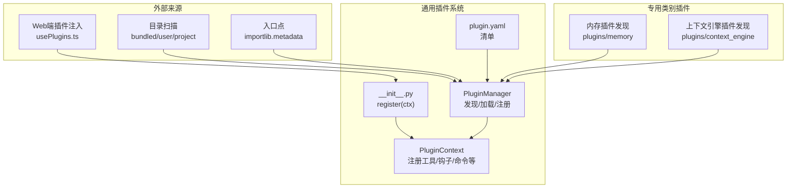
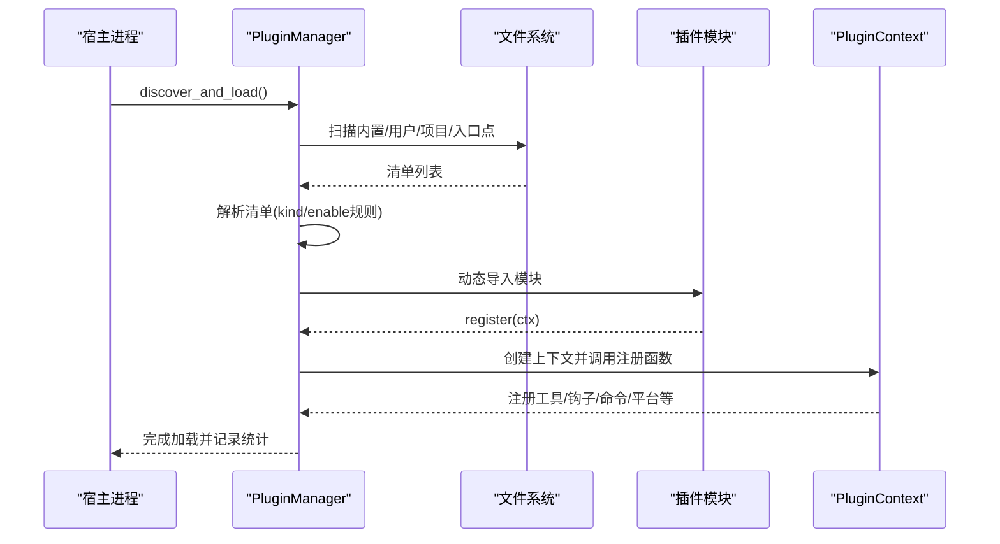
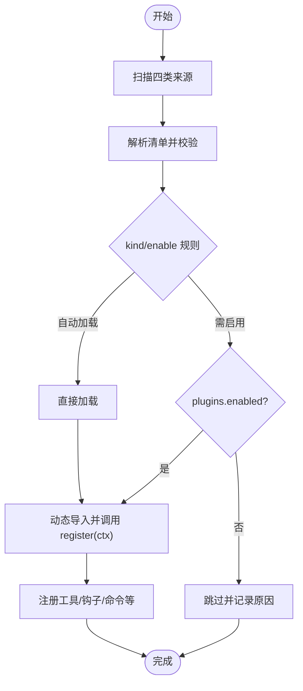
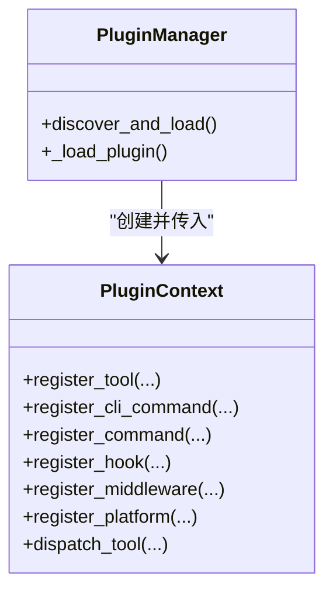
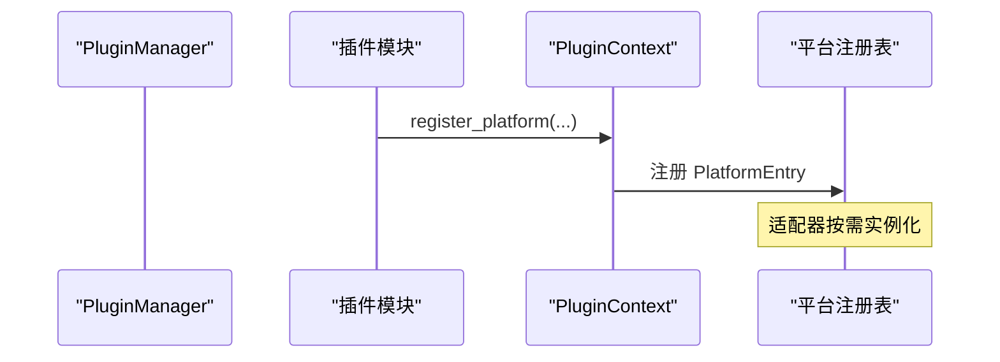
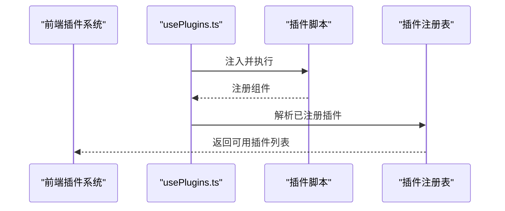
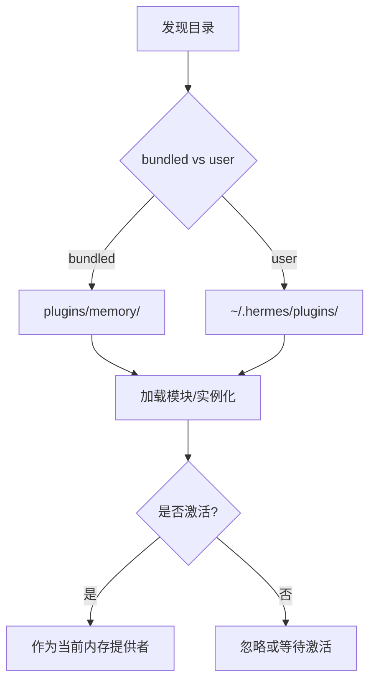
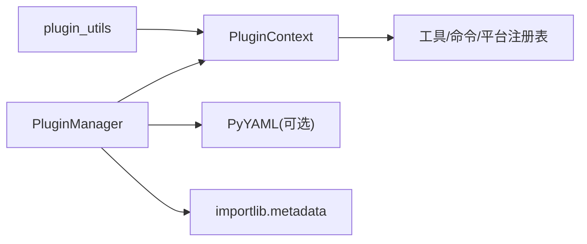

# 插件API

<cite>
**本文引用的文件**
- [plugins/__init__.py](file://plugins/__init__.py)
- [plugins/plugin_utils.py](file://plugins/plugin_utils.py)
- [hermes_cli/plugins.py](file://hermes_cli/plugins.py)
- [plugins/memory/__init__.py](file://plugins/memory/__init__.py)
- [plugins/context_engine/__init__.py](file://plugins/context_engine/__init__.py)
- [plugins/disk-cleanup/plugin.yaml](file://plugins/disk-cleanup/plugin.yaml)
- [plugins/google_meet/plugin.yaml](file://plugins/google_meet/plugin.yaml)
- [plugins/spotify/plugin.yaml](file://plugins/spotify/plugin.yaml)
- [web/src/plugins/usePlugins.ts](file://web/src/plugins/usePlugins.ts)
</cite>

## 目录
1. [简介](#简介)
2. [项目结构](#项目结构)
3. [核心组件](#核心组件)
4. [架构总览](#架构总览)
5. [详细组件分析](#详细组件分析)
6. [依赖分析](#依赖分析)
7. [性能考虑](#性能考虑)
8. [故障排查指南](#故障排查指南)
9. [结论](#结论)
10. [附录](#附录)

## 简介
本文件为 Hermes 插件系统的开发与使用指南，覆盖插件发现、加载与注册机制；插件接口规范（元数据、配置模式、生命周期钩子）；工具插件、平台插件、仪表板插件与内存插件的开发要点；以及测试、调试与发布流程。目标是帮助开发者在不破坏宿主运行时的前提下，安全、可维护地扩展 Hermes 的能力。

## 项目结构
Hermes 插件体系由“通用插件系统”和“专用类别插件”组成：
- 通用插件系统：通过目录扫描、入口点发现、清单解析与模块加载，统一管理插件的注册与生命周期。
- 专用类别插件：如内存提供者与上下文引擎，采用独立发现路径，遵循特定激活规则（例如仅允许单一提供者）。

图示来源
- [hermes_cli/plugins.py:1118-1310](file://hermes_cli/plugins.py#L1118-L1310)
- [plugins/memory/__init__.py:90-122](file://plugins/memory/__init__.py#L90-L122)
- [plugins/context_engine/__init__.py:33-77](file://plugins/context_engine/__init__.py#L33-L77)
- [web/src/plugins/usePlugins.ts:71-108](file://web/src/plugins/usePlugins.ts#L71-L108)

章节来源
- [hermes_cli/plugins.py:55-123](file://hermes_cli/plugins.py#L55-L123)
- [plugins/__init__.py:1-2](file://plugins/__init__.py#L1-L2)

## 核心组件
- 插件清单（plugin.yaml）
  - 字段：name、version、description、author、requires_env、provides_tools、provides_hooks、kind、hooks 等。
  - 作用：声明插件元信息、依赖环境变量、提供的工具与钩子、插件类型（kind）等。
- 插件上下文（PluginContext）
  - 提供注册工具、命令、钩子、中间件、平台适配器、LLM 访问、消息注入、技能与辅助任务注册等能力。
- 插件管理器（PluginManager）
  - 负责扫描与加载插件、解析清单、调用 register(ctx)、维护已注册项与错误状态。
- 并发工具（plugins/plugin_utils.py）
  - 提供线程安全的惰性单例装饰器与槽位类，避免多线程下的竞态与资源泄漏。

章节来源
- [hermes_cli/plugins.py:235-284](file://hermes_cli/plugins.py#L235-L284)
- [hermes_cli/plugins.py:290-500](file://hermes_cli/plugins.py#L290-L500)
- [hermes_cli/plugins.py:1087-1113](file://hermes_cli/plugins.py#L1087-L1113)
- [plugins/plugin_utils.py:43-136](file://plugins/plugin_utils.py#L43-L136)

## 架构总览
通用插件系统支持四种来源的插件，按优先级覆盖：
1) 内置插件（仓库内 plugins/<name>/）
2) 用户插件（~/.hermes/plugins/<name>/）
3) 项目插件（./.hermes/plugins/<name>/，需显式启用）
4) 入口点插件（pip 包的 hermes_agent.plugins）

清单解析后，根据 kind 与来源决定是否自动加载或需要显式启用。随后调用 register(ctx)，由 PluginContext 统一注册各类扩展点。

图示来源
- [hermes_cli/plugins.py:1118-1310](file://hermes_cli/plugins.py#L1118-L1310)
- [hermes_cli/plugins.py:1520-1597](file://hermes_cli/plugins.py#L1520-L1597)
- [hermes_cli/plugins.py:1598-1600](file://hermes_cli/plugins.py#L1598-L1600)

## 详细组件分析

### 插件发现与加载机制
- 来源扫描
  - 内置：plugins/<name>/ 及 plugins/platforms/
  - 用户：~/.hermes/plugins/<name>/
  - 项目：./.hermes/plugins/<name>/（需开启环境变量）
  - 入口点：importlib.metadata 的 hermes_agent.plugins 分组
- 清单解析
  - 支持 plugin.yaml 与 plugin.yml；自动推断 key（含分类前缀），校验 kind 合法性。
- 加载策略
  - 内置后端与平台插件自动加载；其他插件需在 plugins.enabled 中显式启用。
  - exclusive 类型（如内存提供者）走专用发现路径，不由通用管理器加载。
- 错误与回退
  - 失败的插件记录错误原因；重复键以最后来源为准覆盖。

图示来源
- [hermes_cli/plugins.py:1160-1310](file://hermes_cli/plugins.py#L1160-L1310)
- [hermes_cli/plugins.py:1395-1484](file://hermes_cli/plugins.py#L1395-L1484)
- [hermes_cli/plugins.py:1520-1597](file://hermes_cli/plugins.py#L1520-L1597)

章节来源
- [hermes_cli/plugins.py:1160-1310](file://hermes_cli/plugins.py#L1160-L1310)
- [hermes_cli/plugins.py:1395-1484](file://hermes_cli/plugins.py#L1395-L1484)
- [hermes_cli/plugins.py:1520-1597](file://hermes_cli/plugins.py#L1520-L1597)

### 插件接口规范
- 清单字段
  - 必填：name
  - 建议：version、description、author
  - 环境：requires_env（字符串或字典条目）
  - 能力：provides_tools、provides_hooks
  - 类型：kind（standalone/backend/exclusive/platform/model-provider）
  - 额外：hooks（生命周期钩子列表）
- 注册入口
  - 模块必须导出 register(ctx) 函数；ctx 提供丰富的注册 API。
- 生命周期钩子
  - 已知钩子集合：pre_tool_call、post_tool_call、transform_terminal_output、transform_tool_result、transform_llm_output、pre_llm_call、post_llm_call、pre_api_request、post_api_request、api_request_error、on_session_start、on_session_end、on_session_finalize、on_session_reset、subagent_start、subagent_stop、pre_gateway_dispatch、pre_approval_request、post_approval_response。
- 中间件
  - 支持注册请求/执行中间件（种类由 VALID_MIDDLEWARE 定义）。

章节来源
- [hermes_cli/plugins.py:128-170](file://hermes_cli/plugins.py#L128-L170)
- [hermes_cli/plugins.py:1014-1034](file://hermes_cli/plugins.py#L1014-L1034)

### 工具插件开发指南
- 工具注册
  - 使用 ctx.register_tool(name, toolset, schema, handler, ...) 将工具注册到全局工具注册表。
  - 支持异步处理器、参数校验函数、覆盖内置工具等。
- 参数验证与执行回调
  - 通过 schema 描述参数结构；check_fn 进行前置校验；handler 实际执行。
- 示例参考
  - google_meet 提供了多工具与 hooks 的组合示例。

图示来源
- [hermes_cli/plugins.py:290-500](file://hermes_cli/plugins.py#L290-L500)
- [hermes_cli/plugins.py:1087-1113](file://hermes_cli/plugins.py#L1087-L1113)

章节来源
- [hermes_cli/plugins.py:320-354](file://hermes_cli/plugins.py#L320-L354)
- [plugins/google_meet/plugin.yaml:9-16](file://plugins/google_meet/plugin.yaml#L9-L16)

### 平台插件实现方法
- 平台适配器注册
  - 使用 ctx.register_platform(name, label, adapter_factory, check_fn, ...) 注册网关平台适配器。
  - 适配器工厂接收 PlatformConfig 返回具体适配器实例；check_fn 用于依赖检查。
- 事件处理与状态同步
  - 通过 pre_gateway_dispatch 等钩子参与消息预处理与分发控制。
- Slack 交互
  - 可注册 Slack Block Kit 动作处理器，遵循 slack_bolt 回调约定。

图示来源
- [hermes_cli/plugins.py:770-822](file://hermes_cli/plugins.py#L770-L822)
- [hermes_cli/plugins.py:824-880](file://hermes_cli/plugins.py#L824-L880)

章节来源
- [hermes_cli/plugins.py:770-822](file://hermes_cli/plugins.py#L770-L822)
- [hermes_cli/plugins.py:824-880](file://hermes_cli/plugins.py#L824-L880)

### 仪表板插件 API
- Web 端加载
  - 浏览器通过 usePlugins.ts 注入脚本，支持 SRI 完整性校验与加载失败/未注册检测。
- 组件注册
  - 插件脚本应在加载完成后向全局注册表注册组件，以便宿主识别并渲染。
- 安全与容错
  - 失败时设置错误状态；超时后停止加载状态；开发模式下可移除注入脚本。

图示来源
- [web/src/plugins/usePlugins.ts:71-108](file://web/src/plugins/usePlugins.ts#L71-L108)
- [web/src/plugins/usePlugins.ts:110-133](file://web/src/plugins/usePlugins.ts#L110-L133)

章节来源
- [web/src/plugins/usePlugins.ts:71-133](file://web/src/plugins/usePlugins.ts#L71-L133)

### 内存插件开发规范
- 发现与加载
  - 专用发现函数扫描 plugins/memory 与用户目录，支持 bundled 优先于 user。
  - 通过 register(ctx) 或顶层 MemoryProvider 子类实例化两种方式。
- 激活与覆盖
  - 仅允许一个内存提供者生效，通过 config.yaml 的 memory.provider 选择。
- CLI 命令
  - 仅对当前激活的内存插件暴露 CLI 子命令（轻量扫描 cli.py）。

图示来源
- [plugins/memory/__init__.py:90-122](file://plugins/memory/__init__.py#L90-L122)
- [plugins/memory/__init__.py:183-206](file://plugins/memory/__init__.py#L183-L206)
- [plugins/memory/__init__.py:354-451](file://plugins/memory/__init__.py#L354-L451)

章节来源
- [plugins/memory/__init__.py:1-21](file://plugins/memory/__init__.py#L1-L21)
- [plugins/memory/__init__.py:183-206](file://plugins/memory/__init__.py#L183-L206)
- [plugins/memory/__init__.py:354-451](file://plugins/memory/__init__.py#L354-L451)

### 上下文引擎插件
- 发现与加载
  - 仅扫描 plugins/context_engine/<name>/，默认仅内置压缩器可用。
  - 支持 register(ctx) 或顶层 ContextEngine 子类实例化。
- 命令注册
  - 可通过 register_command 暴露斜杠命令，并转发至全局插件命令注册表。

章节来源
- [plugins/context_engine/__init__.py:1-286](file://plugins/context_engine/__init__.py#L1-L286)

## 依赖分析
- 插件系统内部耦合
  - PluginManager 与 PluginContext 强关联；前者负责生命周期，后者提供注册 API。
  - 清单解析与加载路径相互独立但共同决定最终注册结果。
- 外部依赖
  - importlib.metadata 用于入口点扫描；PyYAML 用于清单解析（可选）。
- 并发与线程安全
  - 提供惰性单例与线程安全槽位，避免多线程竞态与资源泄漏。

图示来源
- [hermes_cli/plugins.py:1490-1514](file://hermes_cli/plugins.py#L1490-L1514)
- [plugins/plugin_utils.py:43-136](file://plugins/plugin_utils.py#L43-L136)

章节来源
- [hermes_cli/plugins.py:1490-1514](file://hermes_cli/plugins.py#L1490-L1514)
- [plugins/plugin_utils.py:43-136](file://plugins/plugin_utils.py#L43-L136)

## 性能考虑
- 插件发现与加载
  - 仅在首次加载或强制刷新时进行扫描；避免在长生命周期会话中重复全量扫描。
  - 对用户/项目插件启用开关，减少不必要的扫描。
- 清单解析
  - 若未安装 PyYAML，将跳过清单解析并记录警告，不影响其他来源。
- 并发访问
  - 使用线程安全的惰性单例，避免重复初始化带来的资源浪费与竞态。

## 故障排查指南
- 插件未出现
  - 检查是否位于正确来源目录、是否包含 plugin.yaml、是否被禁用或未启用。
  - 设置 HERMES_PLUGINS_DEBUG=1 获取详细日志。
- 加载失败
  - 查看错误原因（如缺少 register()、类型不匹配、入口点异常）。
- 并发问题
  - 使用 plugins/plugin_utils 提供的线程安全工具，避免竞态。
- Web 插件
  - 检查 SRI 完整性、网络面板错误、是否成功注册组件。

章节来源
- [hermes_cli/plugins.py:89-122](file://hermes_cli/plugins.py#L89-L122)
- [hermes_cli/plugins.py:1598-1600](file://hermes_cli/plugins.py#L1598-L1600)
- [plugins/plugin_utils.py:43-136](file://plugins/plugin_utils.py#L43-L136)
- [web/src/plugins/usePlugins.ts:71-108](file://web/src/plugins/usePlugins.ts#L71-L108)

## 结论
Hermes 插件系统通过清晰的清单与注册模型、严格的来源与覆盖规则、以及专用类别插件的独立发现机制，实现了高扩展性与安全性。开发者应严格遵循清单字段、生命周期钩子与注册 API，结合并发工具与调试手段，确保插件稳定可靠地集成到宿主环境中。

## 附录

### 插件清单字段速查
- name：插件名称（必填）
- version：版本号
- description：描述
- author：作者
- requires_env：所需环境变量（字符串或字典条目）
- provides_tools：提供的工具名列表
- provides_hooks：提供的钩子名列表
- kind：插件类型（standalone/backend/exclusive/platform/model-provider）
- hooks：生命周期钩子列表（如 post_tool_call、on_session_end 等）

章节来源
- [plugins/disk-cleanup/plugin.yaml:1-8](file://plugins/disk-cleanup/plugin.yaml#L1-L8)
- [plugins/google_meet/plugin.yaml:1-17](file://plugins/google_meet/plugin.yaml#L1-L17)
- [plugins/spotify/plugin.yaml:1-14](file://plugins/spotify/plugin.yaml#L1-L14)