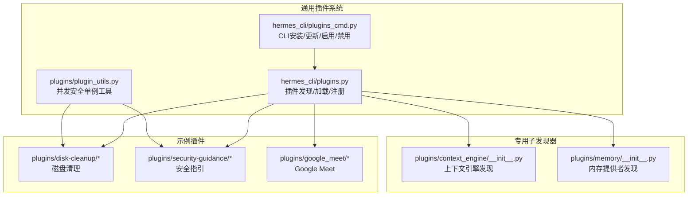
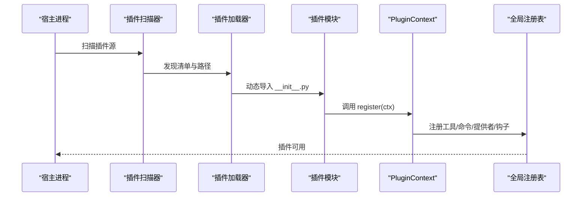
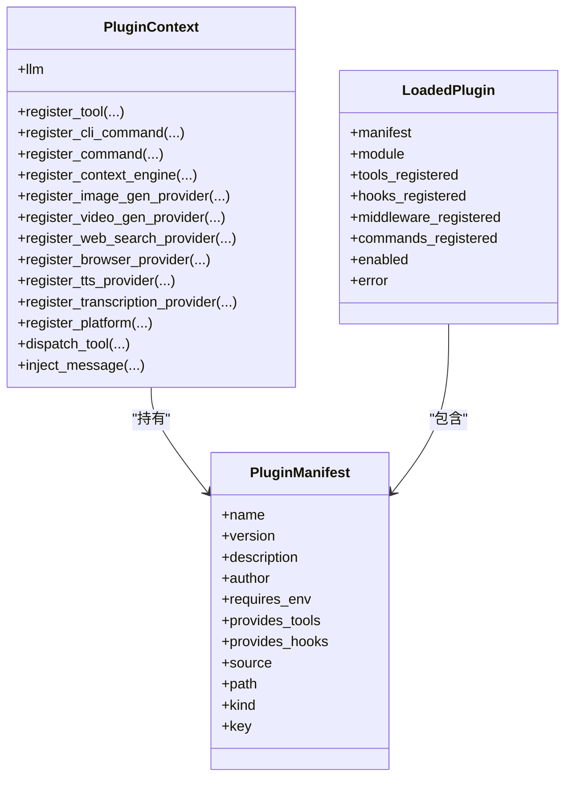
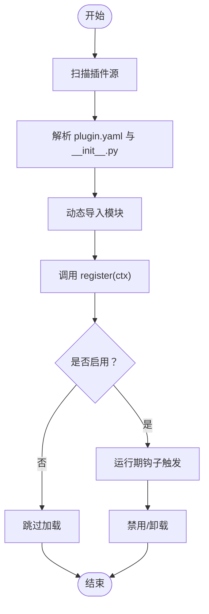
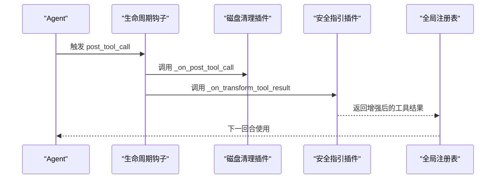
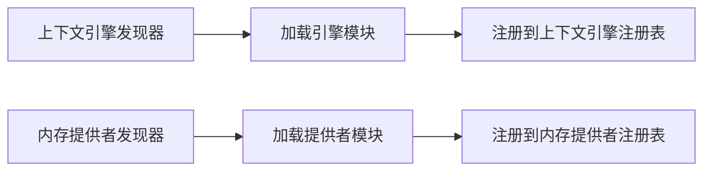
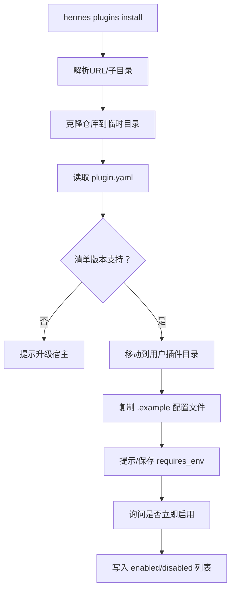
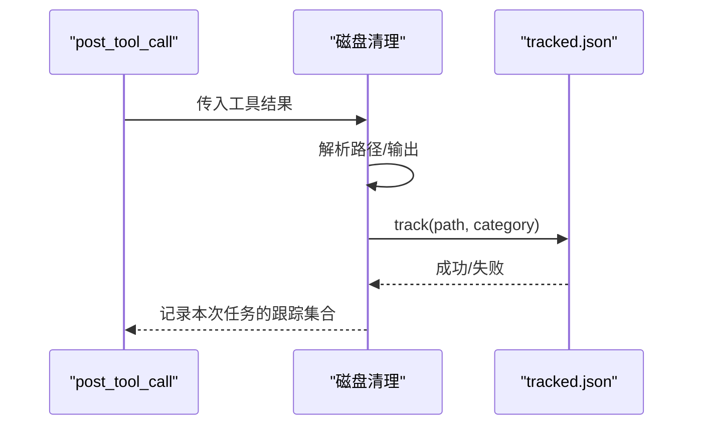
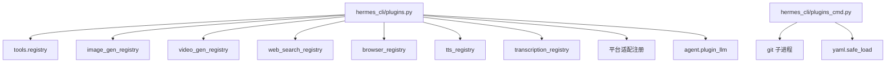

# 插件架构设计

<cite>
**本文档引用的文件**
- [plugins/__init__.py](file://plugins/__init__.py)
- [plugins/plugin_utils.py](file://plugins/plugin_utils.py)
- [hermes_cli/plugins.py](file://hermes_cli/plugins.py)
- [hermes_cli/plugins_cmd.py](file://hermes_cli/plugins_cmd.py)
- [plugins/context_engine/__init__.py](file://plugins/context_engine/__init__.py)
- [plugins/memory/__init__.py](file://plugins/memory/__init__.py)
- [plugins/disk-cleanup/plugin.yaml](file://plugins/disk-cleanup/plugin.yaml)
- [plugins/disk-cleanup/__init__.py](file://plugins/disk-cleanup/__init__.py)
- [plugins/disk-cleanup/disk_cleanup.py](file://plugins/disk-cleanup/disk_cleanup.py)
- [plugins/security-guidance/plugin.yaml](file://plugins/security-guidance/plugin.yaml)
- [plugins/security-guidance/__init__.py](file://plugins/security-guidance/__init__.py)
- [plugins/security-guidance/patterns.py](file://plugins/security-guidance/patterns.py)
- [plugins/google_meet/plugin.yaml](file://plugins/google_meet/plugin.yaml)
</cite>

## 目录
1. [引言](#引言)
2. [项目结构](#项目结构)
3. [核心组件](#核心组件)
4. [架构总览](#架构总览)
5. [详细组件分析](#详细组件分析)
6. [依赖分析](#依赖分析)
7. [性能考虑](#性能考虑)
8. [故障排除指南](#故障排除指南)
9. [结论](#结论)

## 引言
本设计文档系统化阐述 Hermes 插件架构：插件发现与加载、注册表管理、生命周期、事件与消息通信、依赖与版本兼容、安全与权限、配置与环境变量等。文档以代码为依据，结合实际插件示例（如磁盘清理、安全指引、Google Meet 等）进行深入解析，并提供可视化图示帮助理解。

## 项目结构
Hermes 插件体系由“通用插件系统”和“专用子发现器”构成：
- 通用插件系统：扫描多源插件目录，解析 plugin.yaml，执行 __init__.py 的 register(ctx) 完成注册。
- 专用子发现器：针对特定领域（如内存提供者、上下文引擎）提供独立扫描与加载逻辑，避免与通用系统冲突。
- 插件命令行工具：提供安装、更新、启用/禁用、查看等运维能力。

**图表来源**
- [hermes_cli/plugins.py](file://hermes_cli/plugins.py)
- [hermes_cli/plugins_cmd.py](file://hermes_cli/plugins_cmd.py)
- [plugins/context_engine/__init__.py](file://plugins/context_engine/__init__.py)
- [plugins/memory/__init__.py](file://plugins/memory/__init__.py)
- [plugins/disk-cleanup/__init__.py](file://plugins/disk-cleanup/__init__.py)
- [plugins/security-guidance/__init__.py](file://plugins/security-guidance/__init__.py)
- [plugins/google_meet/plugin.yaml](file://plugins/google_meet/plugin.yaml)

**章节来源**
- [plugins/__init__.py](file://plugins/__init__.py)
- [plugins/plugin_utils.py](file://plugins/plugin_utils.py)
- [hermes_cli/plugins.py](file://hermes_cli/plugins.py)
- [hermes_cli/plugins_cmd.py](file://hermes_cli/plugins_cmd.py)
- [plugins/context_engine/__init__.py](file://plugins/context_engine/__init__.py)
- [plugins/memory/__init__.py](file://plugins/memory/__init__.py)

## 核心组件
- 插件发现与加载器：定位插件源、解析清单、导入模块、调用 register(ctx)。
- 插件上下文（PluginContext）：向插件暴露注册工具、命令、平台适配、LLM 能力等。
- 专用发现器：上下文引擎与内存提供者两类，各自独立扫描与加载。
- 插件命令行：Git 克隆、清单校验、环境变量提示、启用/禁用持久化。
- 并发安全工具：线程安全懒加载单例，避免多线程竞争导致的资源泄漏。

**章节来源**
- [hermes_cli/plugins.py](file://hermes_cli/plugins.py)
- [plugins/plugin_utils.py](file://plugins/plugin_utils.py)
- [hermes_cli/plugins_cmd.py](file://hermes_cli/plugins_cmd.py)
- [plugins/context_engine/__init__.py](file://plugins/context_engine/__init__.py)
- [plugins/memory/__init__.py](file://plugins/memory/__init__.py)

## 架构总览
Hermes 插件系统采用“多源扫描 + 清单驱动 + 上下文注册”的架构：
- 多源扫描：内置插件目录、用户插件目录、项目插件目录、pip 插件入口点。
- 清单驱动：每个插件目录必须包含 plugin.yaml 与 __init__.py，后者提供 register(ctx)。
- 生命周期钩子：插件可注册预/后置工具调用、LLM 调用、会话阶段、网关分发等钩子。
- 注册表管理：工具、命令、平台适配器、图像/视频/搜索/浏览器/TTS/转写等提供者通过上下文注册到全局注册表。

**图表来源**
- [hermes_cli/plugins.py](file://hermes_cli/plugins.py)
- [plugins/disk-cleanup/__init__.py](file://plugins/disk-cleanup/__init__.py)
- [plugins/security-guidance/__init__.py](file://plugins/security-guidance/__init__.py)

## 详细组件分析

### 通用插件系统（发现、加载、注册）
- 插件源优先级与覆盖规则：内置 > 用户 > 项目 > pip；同名时后者覆盖前者。
- 清单与入口要求：每个目录需有 plugin.yaml 与 __init__.py，且 __init__.py 提供 register(ctx)。
- 生命周期钩子：支持 pre/post 工具调用、LLM 调用、API 请求、会话阶段、网关分发、审批流程等。
- 注册能力：工具、CLI 命令、Slash 命令、上下文引擎、各类提供者（图像生成、视频生成、Web 搜索、浏览器、TTS、转写、平台适配）。
- LLM 访问：受控的 host-owned LLM 能力，通过配置开关授权。
- 消息注入：允许插件向活动对话注入消息（在 CLI 模式下生效）。

**图表来源**
- [hermes_cli/plugins.py](file://hermes_cli/plugins.py)

**章节来源**
- [hermes_cli/plugins.py](file://hermes_cli/plugins.py)

### 插件清单与包结构规范
- 目录组织：每个插件目录包含 plugin.yaml 与 __init__.py；部分插件包含额外子模块（如磁盘清理的 disk_cleanup.py）。
- 文件命名约定：plugin.yaml 或 plugin.yml；__init__.py；其他模块按功能拆分。
- 元数据格式要点（示例字段）：name、version、description、author、hooks、provides_tools、kind、platforms 等。
- 示例参考：
  - 磁盘清理：声明 hooks 与工具提供列表。
  - 安全指引：声明 hooks 与工具提供列表。
  - Google Meet：声明 kind、平台支持与工具提供列表。

**章节来源**
- [plugins/disk-cleanup/plugin.yaml](file://plugins/disk-cleanup/plugin.yaml)
- [plugins/security-guidance/plugin.yaml](file://plugins/security-guidance/plugin.yaml)
- [plugins/google_meet/plugin.yaml](file://plugins/google_meet/plugin.yaml)

### 插件生命周期管理
- 初始化：扫描与加载阶段完成，register(ctx) 被调用，插件注册自身能力。
- 激活：根据配置（enabled/disabled）与清单键（key）决定是否启用。
- 运行期：按钩子时机被宿主调用（如 post_tool_call、on_session_end 等）。
- 卸载/停用：通过 CLI 禁用或移除插件目录，注册表中对应能力不再被调度。

**图表来源**
- [hermes_cli/plugins.py](file://hermes_cli/plugins.py)
- [hermes_cli/plugins_cmd.py](file://hermes_cli/plugins_cmd.py)

**章节来源**
- [hermes_cli/plugins.py](file://hermes_cli/plugins.py)
- [hermes_cli/plugins_cmd.py](file://hermes_cli/plugins_cmd.py)

### 插件间通信机制
- 事件系统：通过生命周期钩子（如 post_tool_call、on_session_end）在宿主与插件之间传递事件。
- 消息传递：PluginContext.inject_message 支持从外部源注入消息到当前会话。
- 状态共享：插件通过全局注册表共享工具、命令与提供者；专用发现器（上下文引擎、内存提供者）维护各自注册表。
- LLM 访问：受控的 host-owned LLM 能力，仅在授权范围内使用。

**图表来源**
- [plugins/disk-cleanup/__init__.py](file://plugins/disk-cleanup/__init__.py)
- [plugins/security-guidance/__init__.py](file://plugins/security-guidance/__init__.py)
- [hermes_cli/plugins.py](file://hermes_cli/plugins.py)

**章节来源**
- [plugins/disk-cleanup/__init__.py](file://plugins/disk-cleanup/__init__.py)
- [plugins/security-guidance/__init__.py](file://plugins/security-guidance/__init__.py)
- [hermes_cli/plugins.py](file://hermes_cli/plugins.py)

### 专用发现器：上下文引擎与内存提供者
- 上下文引擎发现器：扫描 plugins/context_engine/<name>/，要求 __init__.py 实现 ContextEngine 子类或 register(ctx)。
- 内存提供者发现器：扫描 plugins/memory/<name>/，支持 bundled 与用户安装两种来源，同名 bundled 优先。
- 加载策略：先尝试 register(ctx) 模式，再回退到直接实例化子类；对 CLI 命令扫描采用轻量导入，避免全量加载。

**图表来源**
- [plugins/context_engine/__init__.py](file://plugins/context_engine/__init__.py)
- [plugins/memory/__init__.py](file://plugins/memory/__init__.py)

**章节来源**
- [plugins/context_engine/__init__.py](file://plugins/context_engine/__init__.py)
- [plugins/memory/__init__.py](file://plugins/memory/__init__.py)

### 插件命令行工具（安装/更新/启用/禁用）
- Git 安装：支持完整 URL、短横 owner/repo、带子目录；自动克隆到用户插件目录。
- 清单版本：支持 manifest_version 字段，新版本需要宿主升级。
- 环境变量：读取 requires_env 列表，交互式提示缺失项并保存至用户 .env。
- 启用/禁用：持久化到配置文件，支持键规范化（支持嵌套分类键）。

**图表来源**
- [hermes_cli/plugins_cmd.py](file://hermes_cli/plugins_cmd.py)

**章节来源**
- [hermes_cli/plugins_cmd.py](file://hermes_cli/plugins_cmd.py)

### 并发安全与单例工具
- 问题背景：多线程环境下常见的“延迟单例”竞态会导致重复初始化与资源泄漏。
- 解决方案：提供 lazy_singleton 与 SingletonSlot 两个线程安全原语，内部使用锁与双检锁策略，确保首次调用工厂函数只执行一次。
- 使用建议：复杂配置场景优先使用 SingletonSlot，零参场景使用 lazy_singleton。

**章节来源**
- [plugins/plugin_utils.py](file://plugins/plugin_utils.py)

### 示例插件详解

#### 磁盘清理插件
- 功能：自动跟踪测试/临时文件，在工具调用后与会话结束时清理；提供 /disk-cleanup Slash 命令。
- 清单：声明 hooks 与工具提供列表。
- 关键钩子：post_tool_call（跟踪）、on_session_end（清理）。
- 数据持久化：tracked.json 原子写入与备份恢复；审计日志独立于宿主日志目录。

**图表来源**
- [plugins/disk-cleanup/__init__.py](file://plugins/disk-cleanup/__init__.py)
- [plugins/disk-cleanup/disk_cleanup.py](file://plugins/disk-cleanup/disk_cleanup.py)

**章节来源**
- [plugins/disk-cleanup/plugin.yaml](file://plugins/disk-cleanup/plugin.yaml)
- [plugins/disk-cleanup/__init__.py](file://plugins/disk-cleanup/__init__.py)
- [plugins/disk-cleanup/disk_cleanup.py](file://plugins/disk-cleanup/disk_cleanup.py)

#### 安全指引插件
- 功能：在写文件/补丁等操作前或后扫描内容中的危险模式，非阻断模式下追加安全警告；可通过环境变量切换阻断模式。
- 清单：声明 hooks 与工具提供列表。
- 关键钩子：pre_tool_call（阻断模式）、transform_tool_result（警告模式）。
- 模式库：patterns.py 维护安全模式清单，编译为正则表达式以提升匹配效率。

**章节来源**
- [plugins/security-guidance/plugin.yaml](file://plugins/security-guidance/plugin.yaml)
- [plugins/security-guidance/__init__.py](file://plugins/security-guidance/__init__.py)
- [plugins/security-guidance/patterns.py](file://plugins/security-guidance/patterns.py)

#### Google Meet 插件
- 功能：加入 Google Meet 通话、实时字幕、语音交互与后续跟进；支持多平台。
- 清单：声明 kind、平台支持与工具提供列表。

**章节来源**
- [plugins/google_meet/plugin.yaml](file://plugins/google_meet/plugin.yaml)

## 依赖分析
- 插件系统依赖：
  - hermes_cli.plugins：通用插件发现与注册。
  - hermes_cli.plugins_cmd：插件安装/更新/启用/禁用。
  - plugins.plugin_utils：并发安全工具。
  - 专用发现器：plugins.context_engine 与 plugins.memory。
- 插件对宿主能力的依赖：
  - 工具注册：tools.registry。
  - 提供者注册：各子系统注册表（图像/视频/Web/浏览器/TTS/转写）。
  - LLM 访问：agent.plugin_llm（受配置限制）。
- 第三方依赖：
  - YAML 解析（可选）：用于读取 plugin.yaml。
  - Git（可选）：用于插件安装。

**图表来源**
- [hermes_cli/plugins.py](file://hermes_cli/plugins.py)
- [hermes_cli/plugins_cmd.py](file://hermes_cli/plugins_cmd.py)

**章节来源**
- [hermes_cli/plugins.py](file://hermes_cli/plugins.py)
- [hermes_cli/plugins_cmd.py](file://hermes_cli/plugins_cmd.py)

## 性能考虑
- 插件扫描与加载：
  - 专用发现器采用轻量导入策略，仅在需要时才完整加载模块，降低启动开销。
  - 清单解析与环境变量检查在安装阶段完成，运行期避免重复 I/O。
- 钩子执行：
  - 钩子回调应尽量轻量，避免阻塞宿主事件循环；耗时操作建议异步化。
- 并发安全：
  - 使用线程安全单例工具，避免重复初始化带来的 CPU 与资源浪费。
- 磁盘清理：
  - 快速清理不交互，仅删除确定可删项；深度清理需确认时采用交互式确认，避免长时间阻塞。

[本节为通用指导，无需特定文件引用]

## 故障排除指南
- 插件未出现：
  - 检查 plugin.yaml 是否存在，字段是否正确；确认 __init__.py 是否提供 register(ctx)。
  - 设置 HERMES_PLUGINS_DEBUG=1 获取详细调试日志。
- 安装失败：
  - 确认 git 可用且网络可达；检查 URL/子目录格式；关注清单版本兼容性。
  - requires_env 中缺失的环境变量会在安装时提示输入并保存至用户 .env。
- 启用/禁用无效：
  - 确认使用的键（key）与清单中的 key 一致；嵌套分类插件支持形如 category/name 的键。
- 运行期异常：
  - 查看宿主日志与插件审计日志（如磁盘清理的 cleanup.log），定位具体错误。
  - 对于阻断模式的安全指引插件，可通过关闭阻断模式或修复内容规避。

**章节来源**
- [hermes_cli/plugins.py](file://hermes_cli/plugins.py)
- [hermes_cli/plugins_cmd.py](file://hermes_cli/plugins_cmd.py)
- [plugins/disk-cleanup/disk_cleanup.py](file://plugins/disk-cleanup/disk_cleanup.py)

## 结论
Hermes 插件架构以“清单驱动 + 上下文注册 + 专用发现器”为核心，兼顾灵活性与安全性。通过统一的生命周期钩子与注册表管理，插件能够无缝集成工具、命令与各类提供者；借助专用发现器与并发安全工具，系统在扩展性与稳定性上取得平衡。配合完善的 CLI 工具链与安全策略，Hermes 插件体系为生态扩展提供了清晰、可控、可运维的基础设施。