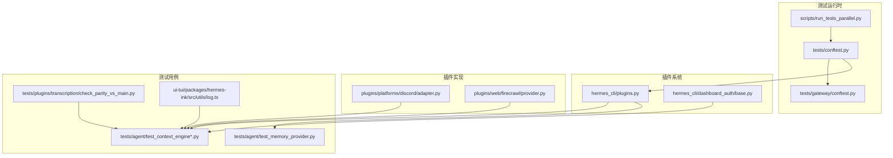
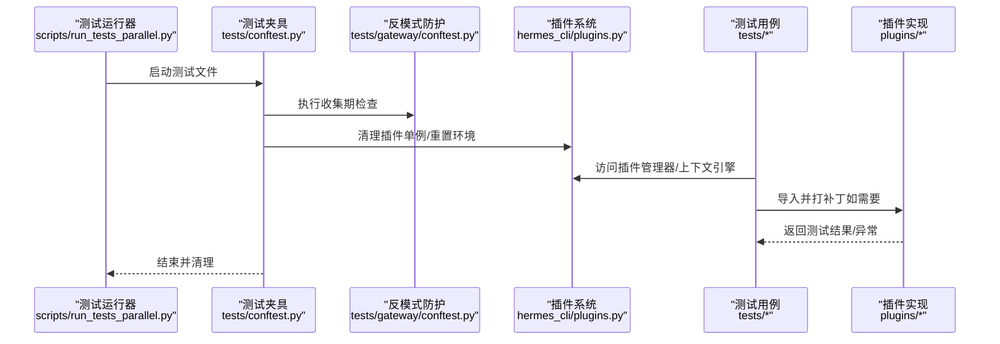
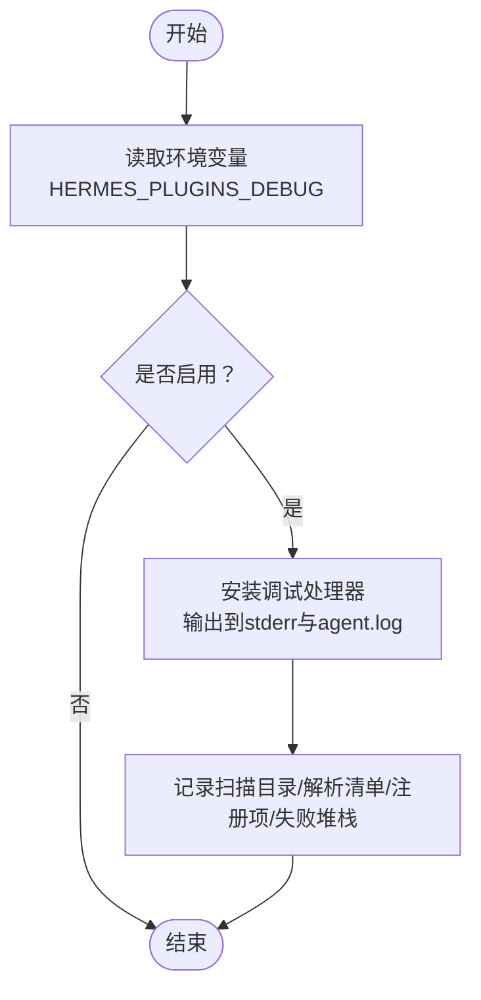
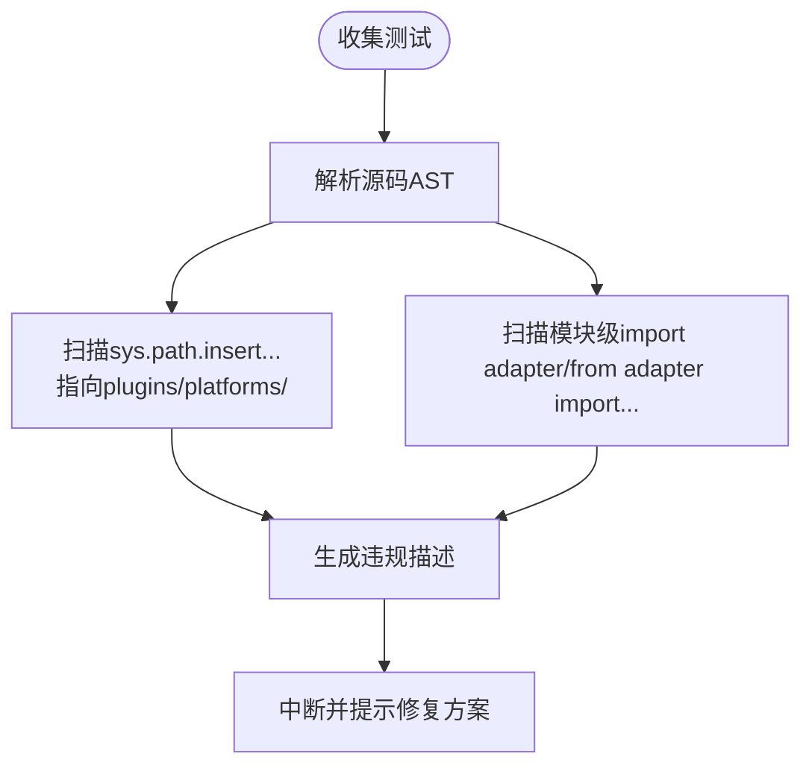
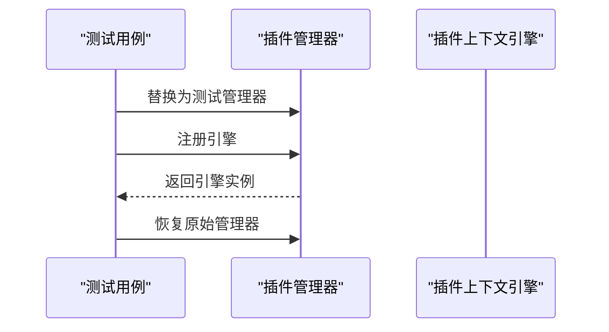
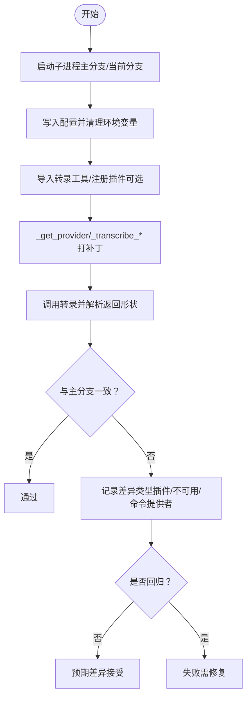
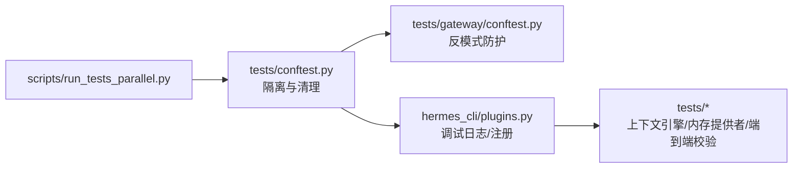

# 插件测试与调试

<cite>
**本文引用的文件**
- [tests/plugins/transcription/check_parity_vs_main.py](file://tests/plugins/transcription/check_parity_vs_main.py)
- [tests/gateway/conftest.py](file://tests/gateway/conftest.py)
- [tests/agent/test_context_engine.py](file://tests/agent/test_context_engine.py)
- [tests/agent/test_context_engine_host_contract.py](file://tests/agent/test_context_engine_host_contract.py)
- [tests/agent/test_memory_provider.py](file://tests/agent/test_memory_provider.py)
- [tests/conftest.py](file://tests/conftest.py)
- [hermes_cli/plugins.py](file://hermes_cli/plugins.py)
- [hermes_cli/dashboard_auth/base.py](file://hermes_cli/dashboard_auth/base.py)
- [plugins/platforms/discord/adapter.py](file://plugins/platforms/discord/adapter.py)
- [plugins/web/firecrawl/provider.py](file://plugins/web/firecrawl/provider.py)
- [scripts/run_tests_parallel.py](file://scripts/run_tests_parallel.py)
- [ui-tui/packages/hermes-ink/src/utils/log.ts](file://ui-tui/packages/hermes-ink/src/utils/log.ts)
</cite>

## 目录
1. [引言](#引言)
2. [项目结构](#项目结构)
3. [核心组件](#核心组件)
4. [架构总览](#架构总览)
5. [详细组件分析](#详细组件分析)
6. [依赖分析](#依赖分析)
7. [性能考虑](#性能考虑)
8. [故障排查指南](#故障排查指南)
9. [结论](#结论)
10. [附录](#附录)

## 引言
本指南聚焦于插件测试与调试，覆盖单元测试设计、Mock 使用、断言验证、集成测试（端到端、性能、并发）策略、调试工具与日志、测试环境搭建、性能测试方法以及发布前质量检查清单，并提供常见问题诊断与解决建议。内容基于仓库中现有的测试框架、插件系统实现与调试工具进行归纳总结。

## 项目结构
围绕插件测试与调试的关键目录与文件：
- 测试入口与并行执行：scripts/run_tests_parallel.py
- 插件系统调试开关：hermes_cli/plugins.py
- 插件适配器反模式防护：tests/gateway/conftest.py
- 上下文引擎与插件交互：tests/agent/test_context_engine*.py
- 内存提供者与用户插件发现：tests/agent/test_memory_provider.py
- 行为一致性校验（端到端风格）：tests/plugins/transcription/check_parity_vs_main.py
- 调试日志工具（前端包）：ui-tui/packages/hermes-ink/src/utils/log.ts
- 平台插件适配器中的测试补丁点：plugins/platforms/discord/adapter.py、plugins/web/firecrawl/provider.py
- 仪表盘认证插件测试辅助：hermes_cli/dashboard_auth/base.py

图表来源
- [scripts/run_tests_parallel.py](file://scripts/run_tests_parallel.py)
- [tests/conftest.py](file://tests/conftest.py)
- [tests/gateway/conftest.py](file://tests/gateway/conftest.py)
- [hermes_cli/plugins.py](file://hermes_cli/plugins.py)
- [hermes_cli/dashboard_auth/base.py](file://hermes_cli/dashboard_auth/base.py)
- [plugins/platforms/discord/adapter.py](file://plugins/platforms/discord/adapter.py)
- [plugins/web/firecrawl/provider.py](file://plugins/web/firecrawl/provider.py)
- [tests/agent/test_context_engine.py](file://tests/agent/test_context_engine.py)
- [tests/agent/test_context_engine_host_contract.py](file://tests/agent/test_context_engine_host_contract.py)
- [tests/agent/test_memory_provider.py](file://tests/agent/test_memory_provider.py)
- [tests/plugins/transcription/check_parity_vs_main.py](file://tests/plugins/transcription/check_parity_vs_main.py)
- [ui-tui/packages/hermes-ink/src/utils/log.ts](file://ui-tui/packages/hermes-ink/src/utils/log.ts)

章节来源
- [scripts/run_tests_parallel.py](file://scripts/run_tests_parallel.py)
- [tests/conftest.py](file://tests/conftest.py)
- [tests/gateway/conftest.py](file://tests/gateway/conftest.py)
- [hermes_cli/plugins.py](file://hermes_cli/plugins.py)

## 核心组件
- 插件系统与调试日志
  - 通过环境变量启用插件发现的详细日志输出，便于定位插件未加载、注册失败等问题。
  - 提供在测试中动态安装调试处理器的能力，避免重复注入。
- 插件适配器反模式防护
  - 在测试收集阶段扫描模块导入路径与裸导入，防止直接从插件目录 sys.path 注入导致的不确定性与泄漏。
- 上下文引擎与插件交互
  - 单元测试验证插件上下文引擎的发现与注册行为；主机契约测试确保命令转发与注册接口正确。
- 内存提供者与用户插件发现
  - 验证用户插件被发现与加载，非内存类插件被排除。
- 端到端行为一致性校验
  - 通过子进程对比主分支与当前工作树的行为差异，覆盖插件钩子、命令提供者优先级等场景。
- 并行测试执行
  - 每个测试文件在独立子进程中运行，减少模块级状态污染，提升稳定性。

章节来源
- [hermes_cli/plugins.py:76-122](file://hermes_cli/plugins.py#L76-L122)
- [tests/gateway/conftest.py:226-316](file://tests/gateway/conftest.py#L226-L316)
- [tests/agent/test_context_engine.py:233-250](file://tests/agent/test_context_engine.py#L233-L250)
- [tests/agent/test_context_engine_host_contract.py:197-274](file://tests/agent/test_context_engine_host_contract.py#L197-L274)
- [tests/agent/test_memory_provider.py:466-523](file://tests/agent/test_memory_provider.py#L466-L523)
- [tests/plugins/transcription/check_parity_vs_main.py:1-432](file://tests/plugins/transcription/check_parity_vs_main.py#L1-L432)
- [scripts/run_tests_parallel.py](file://scripts/run_tests_parallel.py)

## 架构总览
下图展示插件测试与调试在系统中的位置与交互关系：测试运行器负责隔离与并行执行；测试夹具负责环境清理与反模式防护；插件系统提供调试日志与注册能力；具体插件实现提供可打补丁的入口以支持测试。

图表来源
- [scripts/run_tests_parallel.py](file://scripts/run_tests_parallel.py)
- [tests/conftest.py:379-410](file://tests/conftest.py#L379-L410)
- [tests/gateway/conftest.py:226-316](file://tests/gateway/conftest.py#L226-L316)
- [hermes_cli/plugins.py:76-122](file://hermes_cli/plugins.py#L76-L122)
- [tests/agent/test_context_engine.py:233-250](file://tests/agent/test_context_engine.py#L233-L250)
- [tests/agent/test_context_engine_host_contract.py:197-274](file://tests/agent/test_context_engine_host_contract.py#L197-L274)
- [tests/agent/test_memory_provider.py:466-523](file://tests/agent/test_memory_provider.py#L466-L523)

## 详细组件分析

### 组件A：插件系统与调试日志
- 功能要点
  - 通过环境变量开启插件发现的详细日志，同时将日志输出到标准错误与中央日志文件，便于定位插件未显示、解析失败、注册项等问题。
  - 支持在测试中强制安装调试处理器，避免重复注入与跨进程干扰。
- 关键实现位置
  - 环境变量读取与处理器安装逻辑
  - 可在测试中调用强制安装函数以切换日志级别或格式
- 建议用法
  - 开发阶段设置环境变量以观察扫描目录、解析清单、跳过原因、注册内容与加载失败的完整堆栈
  - 在复杂插件加载失败时，结合中央日志与标准错误输出进行交叉验证

图表来源
- [hermes_cli/plugins.py:76-122](file://hermes_cli/plugins.py#L76-L122)

章节来源
- [hermes_cli/plugins.py:76-122](file://hermes_cli/plugins.py#L76-L122)

### 组件B：插件适配器反模式防护
- 功能要点
  - 在测试收集阶段对源码进行静态分析，识别两类反模式：
    - 在 sys.path 中插入 plugins/platforms 相关路径
    - 模块级裸导入 adapter
  - 对上述反模式生成明确的违规描述，帮助测试作者遵循正确的加载方式
- 建议用法
  - 使用提供的加载器加载插件适配器，避免直接 sys.path 注入与裸导入
  - 若出现反模式警告，修正导入路径或改用规范加载方式

图表来源
- [tests/gateway/conftest.py:246-316](file://tests/gateway/conftest.py#L246-L316)

章节来源
- [tests/gateway/conftest.py:226-316](file://tests/gateway/conftest.py#L226-L316)

### 组件C：上下文引擎与插件交互（单元测试）
- 功能要点
  - 单元测试验证在无插件时返回空上下文引擎，在注册后能正确返回已注册引擎
  - 主机契约测试验证命令转发与注册接口行为
- 建议用法
  - 使用插件管理器的占位实现进行隔离测试
  - 在测试前后恢复原始管理器实例，避免跨用例污染

图表来源
- [tests/agent/test_context_engine.py:233-250](file://tests/agent/test_context_engine.py#L233-L250)
- [tests/agent/test_context_engine_host_contract.py:197-274](file://tests/agent/test_context_engine_host_contract.py#L197-L274)

章节来源
- [tests/agent/test_context_engine.py:233-250](file://tests/agent/test_context_engine.py#L233-L250)
- [tests/agent/test_context_engine_host_contract.py:197-274](file://tests/agent/test_context_engine_host_contract.py#L197-L274)

### 组件D：内存提供者与用户插件发现
- 功能要点
  - 验证用户插件被发现与加载，非内存类插件被排除
- 建议用法
  - 在临时目录构造插件清单与实现，确保仅内存相关插件参与发现流程

章节来源
- [tests/agent/test_memory_provider.py:466-523](file://tests/agent/test_memory_provider.py#L466-L523)

### 组件E：端到端行为一致性校验（转录插件）
- 功能要点
  - 通过子进程对比主分支与当前工作树的行为差异，覆盖以下场景：
    - 显式指定内置提供者
    - 未知名称且无插件：两者均应返回“无提供者”错误
    - 已注册插件：PR 应走插件分发，主分支应返回“无提供者”
    - 插件不可用：PR 返回更清晰的“插件不可用”封装
    - 命令提供者注册：新增注册表支持，命令提供者优先级高于未知名称插件
  - 子进程内清理模块缓存、写入配置、禁用真实凭据、打补丁底层调用以专注分发逻辑
- 建议用法
  - 在 CI 中运行该脚本，确保回归与预期差异可控
  - 将新增场景纳入 SCENARIOS 列表，保持覆盖率

图表来源
- [tests/plugins/transcription/check_parity_vs_main.py:1-432](file://tests/plugins/transcription/check_parity_vs_main.py#L1-L432)

章节来源
- [tests/plugins/transcription/check_parity_vs_main.py:1-432](file://tests/plugins/transcription/check_parity_vs_main.py#L1-L432)

### 组件F：平台插件适配器中的测试补丁点
- 功能要点
  - 平台插件适配器中提供绑定导入的补丁点，便于测试对环境变量读取等行为进行打补丁
- 建议用法
  - 在测试中替换绑定导入的模块，以模拟不同环境变量值或外部依赖状态

章节来源
- [plugins/platforms/discord/adapter.py:6751-6751](file://plugins/platforms/discord/adapter.py#L6751-L6751)
- [plugins/web/firecrawl/provider.py:219-219](file://plugins/web/firecrawl/provider.py#L219-L219)

### 组件G：仪表盘认证插件测试辅助
- 功能要点
  - 提供在每个提供者插件的单元测试中调用的辅助函数，用于统一测试行为
- 建议用法
  - 在认证相关插件测试中调用该辅助函数，确保测试一致性

章节来源
- [hermes_cli/dashboard_auth/base.py:189-189](file://hermes_cli/dashboard_auth/base.py#L189-L189)

## 依赖分析
- 测试运行与隔离
  - 每个测试文件在独立子进程中运行，避免模块级状态泄漏
- 夹具职责
  - 清理插件单例、重置安全配置、删除特定环境变量，确保测试间隔离
- 反模式防护
  - 在收集阶段阻止不规范的插件适配器导入路径与裸导入
- 插件系统
  - 提供调试日志与注册接口，支撑上下文引擎与内存提供者的测试

图表来源
- [scripts/run_tests_parallel.py](file://scripts/run_tests_parallel.py)
- [tests/conftest.py:379-410](file://tests/conftest.py#L379-L410)
- [tests/gateway/conftest.py:226-316](file://tests/gateway/conftest.py#L226-L316)
- [hermes_cli/plugins.py:76-122](file://hermes_cli/plugins.py#L76-L122)

章节来源
- [scripts/run_tests_parallel.py](file://scripts/run_tests_parallel.py)
- [tests/conftest.py:379-410](file://tests/conftest.py#L379-L410)
- [tests/gateway/conftest.py:226-316](file://tests/gateway/conftest.py#L226-L316)
- [hermes_cli/plugins.py:76-122](file://hermes_cli/plugins.py#L76-L122)

## 性能考虑
- 并发测试
  - 利用并行测试执行框架，按文件粒度并行运行，缩短整体测试时间
- 端到端测试的子进程隔离
  - 通过子进程隔离配置与模块缓存清理，避免真实外部依赖带来的性能波动
- 日志与可观测性
  - 在开发阶段启用插件调试日志，有助于快速定位瓶颈与异常路径
- 资源使用监控
  - 建议在 CI 中结合系统指标采集工具对 CPU、内存、I/O 进行采样，评估插件加载与调用开销

章节来源
- [scripts/run_tests_parallel.py](file://scripts/run_tests_parallel.py)
- [tests/plugins/transcription/check_parity_vs_main.py:62-208](file://tests/plugins/transcription/check_parity_vs_main.py#L62-L208)
- [hermes_cli/plugins.py:76-122](file://hermes_cli/plugins.py#L76-L122)

## 故障排查指南
- 插件未显示/未加载
  - 步骤
    - 设置环境变量启用插件调试日志
    - 查看标准错误与中央日志，确认扫描目录、解析清单、注册项与失败堆栈
    - 使用规范加载器加载插件适配器，避免 sys.path 注入与裸导入
- 插件上下文引擎为空
  - 步骤
    - 确认已在测试中注册引擎
    - 检查插件管理器实例是否被其他测试污染，必要时恢复原始实例
- 内存提供者未发现用户插件
  - 步骤
    - 确保插件实现符合内存提供者要求
    - 在临时目录构造清单与实现，验证发现与加载流程
- 端到端行为不一致
  - 步骤
    - 使用行为一致性校验脚本对比主分支与当前分支
    - 关注“插件已注册”“插件不可用”“命令提供者”等场景的差异类型
- 平台插件适配器环境变量读取异常
  - 步骤
    - 使用绑定导入的补丁点替换环境变量读取逻辑，模拟不同配置

章节来源
- [hermes_cli/plugins.py:76-122](file://hermes_cli/plugins.py#L76-L122)
- [tests/gateway/conftest.py:226-316](file://tests/gateway/conftest.py#L226-L316)
- [tests/agent/test_context_engine.py:233-250](file://tests/agent/test_context_engine.py#L233-L250)
- [tests/agent/test_memory_provider.py:466-523](file://tests/agent/test_memory_provider.py#L466-L523)
- [tests/plugins/transcription/check_parity_vs_main.py:1-432](file://tests/plugins/transcription/check_parity_vs_main.py#L1-L432)
- [plugins/platforms/discord/adapter.py:6751-6751](file://plugins/platforms/discord/adapter.py#L6751-L6751)
- [plugins/web/firecrawl/provider.py:219-219](file://plugins/web/firecrawl/provider.py#L219-L219)

## 结论
本指南基于现有测试框架与插件系统实现，提供了从单元测试、Mock 与断言，到集成测试（端到端、性能、并发）、调试工具与日志、测试环境搭建、性能测试方法与发布前质量检查的完整实践路径。建议在日常开发中：
- 使用规范加载器与反模式防护，确保测试稳定
- 启用插件调试日志，快速定位问题
- 采用子进程端到端校验脚本，保证行为一致性
- 借助并行测试执行，提升回归效率
- 在 CI 中引入性能与并发测试，保障发布质量

## 附录

### A. 插件单元测试编写方法
- 测试用例设计
  - 针对插件上下文引擎、内存提供者、平台适配器等关键路径编写最小化用例
  - 使用插件管理器占位实现，避免真实外部依赖
- Mock 对象使用
  - 在平台适配器中利用绑定导入补丁点，替换环境变量读取与外部调用
  - 在转录插件场景中，对底层提供者调用进行打补丁，仅验证分发逻辑
- 断言验证
  - 验证返回值结构、注册项存在性、错误信息封装等

章节来源
- [tests/agent/test_context_engine.py:233-250](file://tests/agent/test_context_engine.py#L233-L250)
- [plugins/platforms/discord/adapter.py:6751-6751](file://plugins/platforms/discord/adapter.py#L6751-L6751)
- [tests/plugins/transcription/check_parity_vs_main.py:133-167](file://tests/plugins/transcription/check_parity_vs_main.py#L133-L167)

### B. 插件集成测试实施策略
- 端到端测试
  - 使用行为一致性校验脚本，对比主分支与当前分支在多种场景下的分发结果
- 性能测试
  - 在 CI 中结合系统指标采集，评估插件加载与调用开销
- 并发测试
  - 利用并行测试执行框架，按文件粒度并行运行，覆盖高并发场景

章节来源
- [tests/plugins/transcription/check_parity_vs_main.py:1-432](file://tests/plugins/transcription/check_parity_vs_main.py#L1-L432)
- [scripts/run_tests_parallel.py](file://scripts/run_tests_parallel.py)

### C. 插件调试工具与日志
- 插件调试日志
  - 通过环境变量启用详细日志，输出到标准错误与中央日志文件
- 错误追踪
  - 在测试中强制安装调试处理器，获取完整堆栈与注册详情
- 状态检查
  - 在平台适配器中利用补丁点检查环境变量读取与外部依赖状态

章节来源
- [hermes_cli/plugins.py:76-122](file://hermes_cli/plugins.py#L76-L122)
- [plugins/platforms/discord/adapter.py:6751-6751](file://plugins/platforms/discord/adapter.py#L6751-L6751)

### D. 插件测试环境搭建
- 测试数据准备
  - 在子进程内写入配置文件，清理与测试相关的环境变量
- 模拟服务配置
  - 通过打补丁替换底层提供者调用，避免真实外部服务
- 隔离环境管理
  - 使用独立的 HERMES_HOME 与模块缓存清理，确保测试隔离

章节来源
- [tests/plugins/transcription/check_parity_vs_main.py:62-208](file://tests/plugins/transcription/check_parity_vs_main.py#L62-L208)
- [tests/conftest.py:379-410](file://tests/conftest.py#L379-L410)

### E. 插件性能测试方法
- 响应时间测量
  - 在 CI 中对关键路径进行多次采样，统计平均与分位数
- 资源使用监控
  - 采集 CPU、内存、I/O 指标，评估插件生命周期开销
- 压力测试
  - 并行运行多个测试文件，观察系统资源与稳定性

章节来源
- [scripts/run_tests_parallel.py](file://scripts/run_tests_parallel.py)
- [tests/plugins/transcription/check_parity_vs_main.py:307-330](file://tests/plugins/transcription/check_parity_vs_main.py#L307-L330)

### F. 发布前质量检查清单
- 单元测试
  - 插件上下文引擎、内存提供者、平台适配器用例通过
- 集成测试
  - 行为一致性校验脚本通过，无未预期差异
- 并发与性能
  - 并行测试执行稳定，关键路径性能达标
- 调试与日志
  - 插件调试日志可用，错误堆栈完整
- 环境隔离
  - 测试夹具清理有效，无状态泄漏

章节来源
- [tests/agent/test_context_engine.py:233-250](file://tests/agent/test_context_engine.py#L233-L250)
- [tests/agent/test_context_engine_host_contract.py:197-274](file://tests/agent/test_context_engine_host_contract.py#L197-L274)
- [tests/agent/test_memory_provider.py:466-523](file://tests/agent/test_memory_provider.py#L466-L523)
- [tests/plugins/transcription/check_parity_vs_main.py:411-427](file://tests/plugins/transcription/check_parity_vs_main.py#L411-L427)
- [scripts/run_tests_parallel.py](file://scripts/run_tests_parallel.py)
- [hermes_cli/plugins.py:76-122](file://hermes_cli/plugins.py#L76-L122)
- [tests/conftest.py:379-410](file://tests/conftest.py#L379-L410)